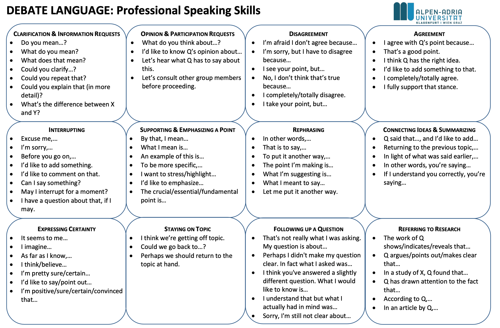
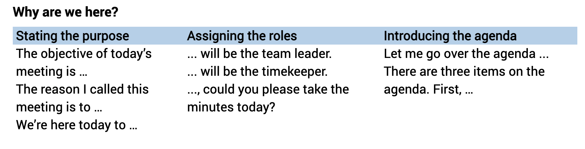

[toc]

## || Debate

### Information Requests

- Do you mean ... ?
- What do you mean?
- What does that mean?
- Could you clarify ...?
- Could you repeat that?
- Could you explain that (in more detail)?
- What's the difference beteween x and y?

### Participation Requests

- What do you think about ...?
- I'd like to know Q's opinion about ...
- Let's hear what Q has to say about this.
- Let's consult other group members before proceeding.

### Disagreement

- I'm afraid I don't agree because ...
- I'm sorry, but I have to disagree because ...
- I see your point, but ...
- I take your point, but ...
- No, I don't think that's true because ...
- I completely / totally disagree. 

### Agreement

- I agree with Q's point because ...
- That's a good point.
- I think Q has the right idea.
- **I'd like to add something to that.**
- I completely / totally agree.
- I fully support that stance. 

### Interrupting

- Execuse me, ...
- I'm sorry, ...
- Before you go on, ..
- I'd like to add something.
- **I'd like to commen on that.**
- Can I say something?
- May I interrupt for a moment?
- **I have a question about that, if I may.**

### Emphasizing a point

- By that, I mean ...
- What I mean is ...
- An example of this is ...
- **To be more specific, ...**
- I want to stress / highlight ...
- I'd like to emphasize ...
- **The crucial / essential / fundamental point is ...**

### Rephrasing

- In other words, ...
- That is to say, ...
- **To put it another way, ...**
- **Let me put it another way.**
- The point I'm making is ...
- What I'm suggesting is ...
- What I meant to say ...

### Summarizing

- Q said that ..., and I'd like to add ...
- Returning to the previous topic, ...
- In light of what was said earlier, ...
- In other words, you're saying ...
- **If I understand you correctly, you're saying ...**

### Expressiong Certainty

- It seems to me ...
- I imagine ...
- As far as I know, ...
- I think / believe ...
- I'm pretty sure / certain ...
- I'd like to say / point out ...
- **I'm positive / sure / certain / convinced that ...**

### Staying on topic

- I think we're getting off topic. 
- Could we go back to ...?
- Perhaps we should return to the topic at hand. 

### Following up a question

- That's not really what I was asking. My question is about ...
- **Perhaps I didn't make my question clear, In fact what I asked was ...**
- I think you've answered a slightly different question. What I would like to know is ...
- I understand that but what I actually had in mind was ...
- Sorry, I'm still not clear about ...

### Referring to research

- The work of Q shows / indicates / reveals that ...
- Q argues / pints out / makes clear that ...
- In a study of X, Q found that ...
- Q has drawn attention to the fact that ...
- According to Q, ...
- In an artical by Q, ...

## || Start meeting

Idiom

- Let's get the ball rolling.  -- start doing sth.
- After getting off to a flying start, -- start off well, good, fast. 
- This project really started off with a bang. -- good
- Our team members got off on the wrong foot; -- bad. first or initial part didn't go well
- Start from scratch. -- 

