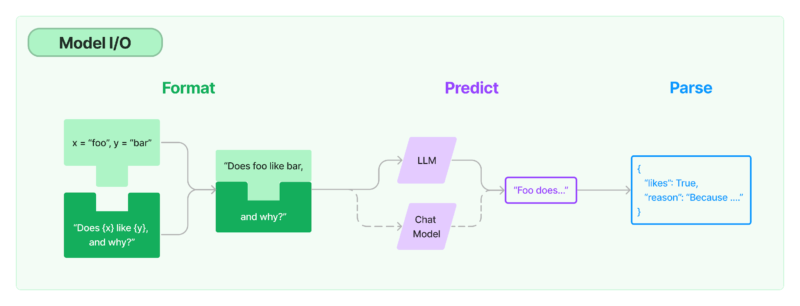
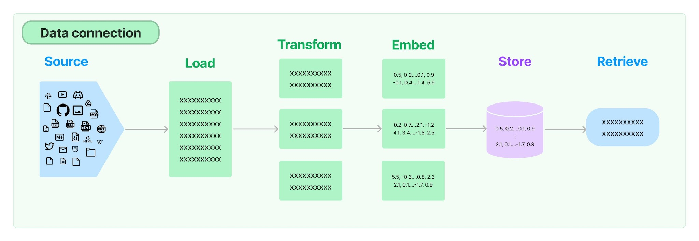

[toc]


# | 基础

Plan

- AI for everyone: https://www.coursera.org/learn/ai-for-everyone/ 
  https://www.bilibili.com/video/BV1yC4y127uj/
- Generative AI for everyone: https://www.coursera.org/learn/generative-ai-for-everyone
- Supervised Machine Learning: Regression and Classification: https://www.coursera.org/learn/machine-learning 
- Deep Learning Specialization https://www.coursera.org/specializations/deep-learning
- Machine Learning in Production https://www.coursera.org/learn/introduction-to-machine-learning-in-production 
- Practical Time Series Analysis https://www.coursera.org/learn/practical-time-series-analysis 

演进

- `ANI`: artificial narrow intelligence. E.g. smart speaker, self-driving car.
- `Generative AI`: E.g. ChatGPT, Bard, Midjourney. 
- `AGI`: Artificial general intelligence. Do anything a human can do. 


## ML

- **Supervised Learning:**Input -> Output
  - Spam Filtering: email -> spam? 
  - Speech Recognition: audio -> text transcripts
  - Machine translation: English -> Chinese
  - Online advertising: ad, user info -> click?
  - Self-driving car: image, radar info -> position of other cars. 
  - Visual inspection: image of phone -> defect? 
  - Chatbot: sequence of words -> the next word.


## LLM

Large Language Model

- LLMs are built by using supervised learning to repeatedly predict the next word. 
- 流程：Prompt --> LLM --> Completion


## Gerative AI


## LangChain

- 解决 LLM 的挑战

  - 提示词管理、调整、模板（利于重用）
  - LLM request management: 调用不同的大模型
  - Output management: 解析
  - Multi LLM call management: 链式调用、多次交互

- 职责：类似 Java 开发中的 Spring 框架

  - **Prompts**

  - - Templatize, dynamically select, and manage model inputs

    - `prompt_template.format`

      ```
      template = "Tell me a {adjective} joke about {content}."
      
      prompt_template = PromptTemplate.from_template(template)
      prompt_template.input_variables
      # -> ['adjective', 'content']
      prompt_template.format(adjective="funny", content="chickens")
      # -> Tell me a funny joke about chickens.
      
      ```

      

  - **Language models**

  - - Make calls to language models through common interfaces

      ```
      from langchain.llms import OpenAI
      llm = OpenAI()
      # 切换LLM
      # llm = AzureOpenAI( deployment_name="td2", model_name="text-davinci-002")
      llm("Tell me a joke")
      ```

      

  - **Output parsers**

  - - Extract information from model outputs

    - `from langchain.output_parsers`

      ```
      from langchain.output_parsers import CommaSeparatedListOutputParser
      
      output_parser = CommaSeparatedListOutputParser()
      format_instructions = output_parser.get_format_instructions()
      prompt = PromptTemplate(
          template="List five {subject}.\n{format_instructions}",
          input_variables=["subject"],
          partial_variables={"format_instructions": format_instructions}
      )
      
      model = OpenAI(temperature=0)
      _input = prompt.format(subject="ice cream flavors")
      output = model(_input)
      output_parser.parse(output)
      ```




- 更多功能

  - **Model I/O**

  - **Chains**

    > A single sequence of steps or actions that can be executed with predefined prompt template, output parser etc.
    >
    > 不同的chain预置好了不同的提示词，以解决不同的场景

    - LLM chain
    - RetrivelQA chain
    - Router chain
    - Math chain
    - Bash chain

  - **Data connection**

    

    - Source: DB, File, etc

  - **Agents**

    - Give a set of **tools** and let LLM to **choose the right tool** to answer input question, like how a human decide

    - > ReAct Mode: Reasoning <-> Action

    - https://www.pinecone.io/learn/series/langchain/langchain-agents/

    - 例子：ZeroShotAgent https://github.com/hwchase17/langchain/blob/master/langchain/agents/mrkl/prompt.py

      

  - **Memory** 

    - 记住对话上下文


# | 应用


# | 开发


## || OpenAI 接口

API https://learn.microsoft.com/en-us/azure/cognitive-services/openai/reference

### Completion API

https://platform.openai.com/docs/api-reference/completions/create

openai.Completion.create

- 参数
  - `engine`: 用openai的哪一个引擎；
  - `prompt`: 提示语；
  - `max_token`: 调用生成的内容允许的最大 token 数量。你可以简单地把 token 理解成一个单词。注意它包含提示语长度！
  - `n`: 生成几条内容供选择；
  - `stop`: 希望模型输出的内容在遇到什么内容的时候就停下来。

```python
import openai
import os

openai.api_key = os.environ.get("OPENAI_API_KEY")

prompt = '请你用朋友的语气回复给到客户，并称他为“亲”，他的订单已经发货在路上了，预计在3天之内会送达，订单号2021AEDG，我们很抱歉因为天气的原因物流时间比原来长，感谢他选购我们的商品。'

def get_response(prompt, temperature = 1.0):
    completions = openai.Completion.create ( ##OpenAI接口
        engine="text-davinci-003",
        prompt=prompt,
        max_tokens=1024,
        n=1,
        stop=None,
        temperature=temperature,
    )
    message = completions.choices[0].text
    return message
    
print(get_response(prompt))    
```


### ChatCompletion API

https://time.geekbang.org/column/article/643915 

openai.ChatCompletion.create

- role

  - `system`: 代表我们给 AI 的一个指令，也就是告诉 AI 应该怎么回答用户的问题。

  - `user` `assistant`: 代表用户和 AI 对话的内容。

    

```python
import openai
openai.ChatCompletion.create(
  model="gpt-3.5-turbo",
  messages=[
        {"role": "system", "content": "You are a helpful assistant."},
        {"role": "user", "content": "Who won the world series in 2020?"},
        {"role": "assistant", "content": "The Los Angeles Dodgers won the World Series in 2020."},
        {"role": "user", "content": "Where was it played?"}
    ]
)


```


封装聊天机器人：

- 为降低成本，只保留最近n个上下文。——优化：让chatgpt总结上下文；
- 

```py
import openai
import os

openai.api_key = os.environ.get("OPENAI_API_KEY")

class Conversation:
    def __init__(self, prompt, num_of_round):
        self.prompt = prompt
        self.num_of_round = num_of_round
        self.messages = []
        self.messages.append({"role": "system", "content": self.prompt})

    def ask(self, question):
        try:
          #记录user提问内容，作为上下文
            self.messages.append({"role": "user", "content": question})
            response = openai.ChatCompletion.create( #OpenAI接口
                model="gpt-3.5-turbo",
                messages=self.messages,
                temperature=0.5,
                max_tokens=2048,
                top_p=1,
            )
        except Exception as e:
            print(e)
            return e

        message = response["choices"][0]["message"]["content"]
        #记录使用的token
        num_of_tokens = response['usage']['total_tokens']
        #记录assistant回复内容，作为上下文
        self.messages.append({"role": "assistant", "content": message})

        #删掉最老的上下文
        if len(self.messages) > self.num_of_round*2 + 1:
            del self.messages[1:3] //Remove the first round conversation left.
        return message
      
prompt = """你是一个中国厨师，用中文回答做菜的问题。你的回答需要满足以下要求:
1. 你的回答必须是中文
2. 回答限制在100个字以内"""
conv1 = Conversation(prompt, 2)
question1 = "你是谁？"
print("User : %s" % question1)
print("Assistant : %s\n" % conv1.ask(question1))

question2 = "请问鱼香肉丝怎么做？"
print("User : %s" % question2)
print("Assistant : %s\n" % conv1.ask(question2))

question3 = "那蚝油牛肉呢？"
print("User : %s" % question3)
print("Assistant : %s\n" % conv1.ask(question3))      
```


### Gradio 聊天界面

> https://gradio.app/creating-a-chatbot/

- 用 Gradio 这个 Python 库来开发这个聊天机器人的界面，可直接在 Jupyter Notebook 里显示。
- 可以免费把 Gradio 的应用部署到 [HuggingFace](https://huggingface.co/) 上


Gradio集成代码

```python
> conda install -c conda-forge gradio

import gradio as gr
prompt = """你是一个中国厨师，用中文回答做菜的问题。你的回答需要满足以下要求:
1. 你的回答必须是中文
2. 回答限制在100个字以内"""

conv = Conversation(prompt, 10) #重用上一节的聊天代码

def answer(question, history=[]):
    history.append(question)
    response = conv.ask(question)
    history.append(response)
    responses = [(u,b) for u,b in zip(history[::2], history[1::2])]
    return responses, history

#调用Gradio组价
with gr.Blocks(css="#chatbot{height:300px} .overflow-y-auto{height:500px}") as demo:
    chatbot = gr.Chatbot(elem_id="chatbot")
    state = gr.State([])

    with gr.Row():
        txt = gr.Textbox(show_label=False, placeholder="Enter text and press enter").style(container=False)

    txt.submit(answer, [txt, state], [chatbot, state])

demo.launch()
```


### Embedding 向量化

- 作用：可以通过 Embedding 把文本变成一段向量。而对于向量我们自然可以用一些简单的聚类算法，比如我们采用最简单的 K-Means 算法就可以了。

```python
###### 引入embedding包
from openai.embeddings_utils import get_embedding, get_embeddings

####### 调用get_embedding
df_1k["embedding"] = df_1k.combined.apply(lambda x : get_embedding(x, engine="text-embedding-ada-002"))
```


- 示例一：Embedding后做文本分类
  ```python
  import pandas as pd
  import tiktoken
  import openai
  import os
  
  ###### 引入embedding包
  from openai.embeddings_utils import get_embedding, get_embeddings
  
  openai.api_key = os.environ.get("OPENAI_API_KEY")
  
  # embedding model parameters
  embedding_model = "text-embedding-ada-002"
  embedding_encoding = "cl100k_base"  # this the encoding for text-embedding-ada-002
  max_tokens = 8000  # the maximum for text-embedding-ada-002 is 8191
  
  # import data/toutiao_cat_data.txt as a pandas dataframe
  df = pd.read_csv('data/toutiao_cat_data.txt', sep='_!_', names=['id', 'code', 'category', 'title', 'keywords'])
  df = df.fillna("")
  df["combined"] = (
      "标题: " + df.title.str.strip() + "; 关键字: " + df.keywords.str.strip()
  )
  
  print("Lines of text before filtering: ", len(df))
  
  encoding = tiktoken.get_encoding(embedding_encoding)
  # omit reviews that are too long to embed
  df["n_tokens"] = df.combined.apply(lambda x: len(encoding.encode(x)))
  df = df[df.n_tokens <= max_tokens]
  
  print("Lines of text after filtering: ", len(df))
  
  
  
  # randomly sample 1k rows
  df_1k = df.sample(1000, random_state=42)
  ####### 调用get_embedding
  df_1k["embedding"] = df_1k.combined.apply(lambda x : get_embedding(x, engine=embedding_model))
  df_1k.to_csv("data/toutiao_cat_data_10k_with_embeddings.csv", index=False)
  ```

  

### INSERT

- openai.Completion.create
  - prompt=prefix
  - suffix=suffix

```python
prefix = """在这个快节奏的现代社会中，我们每个人都面临着各种各样的挑战和困难。
在这些挑战和困难中，有些是由外部因素引起的，例如经济萧条、全球变暖和自然灾害等。\n"""
# 还有一些是由内部因素引起的，例如情感问题、健康问题和自我怀疑等。
suffix = """\n面对这些挑战和困难，我们需要采取积极的态度和行动来克服它们。
这意味着我们必须具备坚韧不拔的意志和创造性思维，以及寻求外部支持的能力。
只有这样，我们才能真正地实现自己的潜力并取得成功。"""

def insert_text(prefix, suffix):
    response = openai.Completion.create(
        model="text-davinci-003",
        prompt=prefix,
        suffix=suffix,
        max_tokens=1024,
        )
    return response

response = insert_text(prefix, suffix)
print(response["choices"][0]["text"])
```

- 在使用这个 INSERT 接口的时候，考虑好文本之间需要使用什么样的分隔符，是非常重要的。


### Moderate

- 目的：可以让你对输入以及返回的内容做个检查，例如出现色情暴力的输入，则可以屏蔽这些用户的访问，也可以人工审核一下用户的问题。


```python
threaten = "你不听我的我就拿刀砍死你"

def moderation(text):
    #openai.ChatCompletion.create返回：很抱歉，我是一台人工智能助手...
    #openai.Moderation.create返回一个json，flagged: true
    response = openai.Moderation.create(
        input=text
    )
    output = response["results"][0]
    return output
print(moderation(threaten))
```


## || 开发场景

