[toc]

# 1. 计算 - Compute

## || 安全组

在每一个EC2实例创建的过程中，你都会被要求为其指定一个**安全组（Security Group）**。这个安全组充当了主机的**虚拟防火墙**作用，能根据协议、端口、源IP地址来过滤EC2实例的入向和出向流量。

特性：

- 默认情况下，所有**入方向**的流量都会被**拒绝**
- 默认情况下，所有**出方向**的流量都会被**允许**
- 在安全组内只能设置允许的条目，不能设置拒绝的条目。
- 一个流量只要被安全组的任何一条规则匹配，那么这个流量就会被允许放行
- 安全组是有状态的
  - 如果某个流量被入方向的规则放行，那么无论它的出站规则如何，它的出方向**响应流量**都会被无条件放行
  - 如果从主机发出去的出站请求，无论入站规则如何，该请求的**响应流量**都会被无条件放行


## || EC2

### EBS & 实例存储

**EBS - Elastic Block Store 弹性块存储**

- EBS卷可以依附到**同一个可用区（AZ）**内的任何实例上；
- 可加密；
- 可备份 - 通过**快照（Snapshot）**来进行增量备份，快照会保存在 **S3 **上；
- 可基于快照创建 EBS；


EBS 类型

- 预配置IOPS SSD（Provisioned IOPS SSD）
- 通用型SSD（General Purpose SSD）
- 吞吐量优化型HDD（Throughput Optimized HDD）
- Cold HDD
- Magnetic


**Instance Store Volumes 实例存储**

- 用于短暂存储，又叫 Ephemeral Storage 
- EC2 实例终止 --> 实例存储消失；重启 --> 不影响


### AMI 

AMI - Amazon Machine Image，包含启动实例所需的信息：

- 模板：操作系统、应用程序、应用程序相关配置；
- 实例启动时附加到实例卷的信息；


**Bootstrap 开机脚本**

- 创建 EC2 -> 配置实例详细信息 -> 高级详细信息 -> 用户数据

- 例如如下脚本：更新补丁、开启http服务

  ```bash
  #!/bin/bash
  yum update -y
  yum install httpd -y
  service httpd start
  chkconfig httpd on
  echo "Hello aws.xiaopeiqing.com" > /var/www/html/index.html
  ```

查看用户数据：http://169.254.169.254/latest/user-data 


### CloudWatch

- 面板（Dashboards）-可创建自定义面板来方便观察你AWS环境中的不同监控对象；
- 告警（Alarms）- 当某个监控对象超过阈值时，会给你发出告警信息；
- 事件（Events）- 针对AWS环境中所发生的变化进行的反应；
- 日志（Logs）-Cloudwatch日志帮助你收集、监控和存储日志信息；


### Auto Scaling

垂直扩展 vs. 水平扩展

- Sacle Up
- Sacle Out


Auto Scaling 配置

- **配置模板** 

  - 自动启动的 EC2 实例模板：可指定AMI、实例类型、安全组、角色；

  - 可选择使用 `启动模板` 或者 `启动配置 Launch Configuration`；

    > 推荐用启动模板，因为功能更多。

- **ASG**

  - Auto Scaling Group 是 EC2 实例集合，将实例当作一个逻辑单位进行扩展和管理；

  - 可配置组中的最小最大实例数、在哪个可用区/子网启动实例、ASG是否附加负载均衡器、监控状况检查等；

    > 会在可用区间均匀启动实例。

  - ASG 只能在一个 Zone内运行，不能跨 Zone。

- **扩展选项**

  配置ASG中实例数量的伸缩规则，共 5 种：

  1. **始终保持当前实例数量** --> 如实例不健康，则会被终止并启动新实例
  2. **手动扩展**
  3. **按计划扩展** --> 按时间
  4. **按照需求扩展**（动态扩展）--> 与 CloudWatch Alert 关联；
  5. **预测式扩展** (?)


> **实践**
>
> - EC2 --> 启动配置：指定实例类型、AMI、安全组、user data （自动执行某些命令）；
>
> - EC2 --> Auto Scaling Group --> 最小容量：1
>
>   - `实例` 选项卡：当前ec2实例列表；--> 尝试终止一台；
>
>   - `活动历史记录` 选项卡：启动、终止实例的记录；
>
>   - `扩展策略` 选项卡：伸缩规则；
>
>   - `计划的操作` 选项卡：按计划扩展


### Placement Groups

作用：逻辑性地把一些实例放置在一个组里面，以便组内实例能享受低延迟、高网络吞吐的网络；决定实例启动在哪个底层硬件上、哪个机柜上。例如：

- 放置在同一可用区，以实现实例之间的低延迟、高吞吐；
- 分散放置在不同底层硬件和机柜，减少故障；


三种放置策略：


**1. 集群置放群组 - Cluster Placement Group**

- 将实例尽量放置在一起
- 在**同一个 AZ 可用区**；
- <u>适用于低延迟、高吞吐场景；</u>

> 建议：
>
> 1. 一次性启动所需实例数，不要临时添加；
> 2. 置放群组中的实例类型要一样


> 实践：
>
> - EC2 --> 网络与安全 --> 置放群组 --> 新建
> - EC2 --> 启动实例 --> step3 ”配置实例“ - 选择置放群组


**2. 分区置放群组 - Partition Placement Group**

- 将实例分布在不同的”逻辑分区“；每个分区分配一个机柜，不同分区属于不同机柜；
- 可在**同一区域**下的多个可用区，每个可用区可有最多7个分区。
- <u>适用于大型分布式，和重复的工作负载，例如Hadoop Cassandra Kafka；</u>


**3. 分布置放群组 - Spread Placement Group**

- 将实例放置在不同机柜；可以跨越**同一区域**中的多个可用区。

> Q: 和分区置放群组的区别？
>
> A: Partition只能在同一个AZ，Spread可跨多个AZ。


**Capacity Error** ?

- 在**同一时间**启动组内所有EC2实例，这样可以减少出现“capacity error”错误的概率。
- 如出现，可以停止再启动组中的所有实例，再重新创建刚才的实例。


### EC2 状态检查、自动恢复

状态检查是内置到 Amazon EC2 中的，所以不能禁用或删除。状态检查每分钟进行一次，会返回一个通过或失败状态。如果所有的检查都通过，则实例的整体状态是OK，如果有一个或多个检查故障，则整体状态为受损。

可分为两类：

- **系统状态检查**
  - 网络连接丢失、系统电源损耗、硬件问题  
  - 需要 aws 参与修复的深层实例问题
- **实例状态检查**
  - 内存耗尽、内核不兼容、网络或启动配置不正确
  - 需要用户自行解决；


**实践：状态检查、自动恢复**

- EC2 --> `状态检查` 选项卡 --> 查看 系统状态检查、实例状态检查的结果；

  - 配置自动恢复：点击创建状态检查警报 --> 执行操作 == `恢复此实例` --> 在 CloudWatch 中查看警报

    > 恢复此实例：会在另一个物理机上启动；
    > 重启此实例：不会切换物理机；

  - 测试：手工触发状态检查警报 --> cloudwatch控制台中的状态切换 `确定` --> `警报中`

    ````
    aws cloudwatch set-alarm-state \
    --alarm-name "..." \
    --state-value ALARM \
    --state-reason "..." \
    --region ap-northeast-1
    ````

    

- EC2 --> `监控` 选项卡 --> 查看状态检查失败的次数；


## || Serverless

使用**AWS Lambda**，无需配置和管理任何服务器和应用程序就能运行你的代码。只需要上传代码，Lambda就会处理运行并且根据需要自动进行横向扩展。

Lambda 触发器

- **API Gateway**
- **AWS IoT**
- **CloudWatch Events**
- CloudWatch Logs
- CodeCommit
- DynamoDB
- S3
- SNS
- Cognito Sync Trigger


> 实战：使用 Lambda 定时关闭和启动EC2实例
>
> https://iteablue.com/course/aws-certified-solutions-architect-associate/lessons/how-to-stop-and-start-ec2-using-lambda 
>
> - Lambda --> 创建函数 
>
>   - 函数名称
>
>   - 运行时：Python 3.7
>
>   - 权限：创建策略，因为默认权限比较小，而启停EC2需要更高权限。
>
>     ```json
>     // Policy
>     {
>       "Version": "2012-10-17",
>       "Statement": [
>         {
>           "Effect": "Allow",
>           "Action": [
>             "logs:CreateLogGroup",
>             "logs:CreateLogStream",
>             "logs:PutLogEvents"
>           ],
>           "Resource": "arn:aws:logs:*:*:*"
>         },
>         {
>           "Effect": "Allow",
>           "Action": [
>             "ec2:Start*",
>             "ec2:Stop*"
>           ],
>           "Resource": "*"
>         }
>       ]
>     }
>     ```
>
> - --> 进入 IDE 页面，
>
>   - 编写py脚本
>   - 环境变量设置
>   - 基本设置：超时时间、内存
>
> - 配置测试事件 --> 测试 （相当于手工触发 lambda）
>
> - 基于CloudWatch配置定时任务：事件 --> 规则 --> 创建规则
>
>   - 事件源：事件模式 | 计划
>   - 目标：选择 lambda


# 2. 存储 - Storage

## || S3

**特点**

- 对象存储，而不是块存储；

  > 对象参数包括：
  >
  > - Key
  > - Value
  > - Version Id
  > - Metadata
  > - 访问控制信息

- 文件存储在 **Bucket** 内，bucket相当于文件夹；

- 创建在某个 **Region**，但不可指定 AZ；

- 版本控制：可恢复文件到之前版本；

- 生命周期管理：自动转换存储类型；

- 支持加密、ACL、Bucket Policy


**数据一致性模型**

- 新对象：Read after Write Consistency

  > 返回200之前先同步到aws的多个物理位置。

- 修改\删除：Eventual Consistency

  > 异步同步


**S3 存储类型**

- Standard

- Reduced Redundancy

  > 持久性最低，用于存储可再生数据。不推荐使用。

- Standard - IA (Infrequently Accessed)

  > 用于存储不常访问的数据，跨区存储。
  >
  > 存储价格比 Standard 低，但读取更贵。

- Onezone - IA

  > 类似 Standard IA，但只保存到一个可用区

- Glacier

  > 仅做归档


> **实践：创建存储桶**
>
> - 名称：唯一性
> - 区域：必须且只能选择一个
> - 版本控制：选择是否开启，开启后费用更高
>   - 属性 --> 版本控制 --> 启用
>   - 文件名 右侧下拉框 --> 切换版本；或列表 --> 版本：显示
>
> 
>
> **实践：跨区域同步**
>
> （作用：高可用、用户距离）
>
> - 管理选项卡 --> 复制 --> 添加规则
>   - 源：整个桶，或桶内部分对象；
>   - 目标：选择目标桶，必须开启版本控制；
>   - 权限：IAM 角色、并赋予权限；
> - 在源上上传文件，会自动同步到目标。
> - 在源上删除文件某个版本，不会同步到目标。
> - 在源上删除文件所有版本，会同步到目标。
>
> 
>
> **实践：生命周期管理**
>
> - 管理选项卡 --> 生命周期 --> 添加规则
>   - 范围
>   - 转换规则：转到`标准IA` `一区IA` `Glacier`
>   - 过期：多久后被永久删除
>
> 
>
> **实践：传输加速**
>
> - 原理：将数据上传到离我们最近的**边缘节点**，然后再通过AWS内部网络（更高速，更稳定）传输到对应区域的 S3 存储桶。
> - 属性 --> 高级设置 --> 转移加速度 --> 启用


**S3 安全**

- Bucket Policy
- Access Control List 


**S3 加密**

- 传输过程中加密：SSL/TLS

- 静态加密

  - 服务端加密（SSE, Server Side Encryption）

    > **SSE-S3**: S3 托管密钥
    >
    > **SSE-KMS**: KMS 托管密钥
    >
    > **SSE-C**: 服务端加密与客户提供的密钥一起使用

  - 客户端加密（CSE, Client Side Encryption）


## || Glacier


## || Storage Gateway

作用：将**本地软件设备**与**基于云的存储**相连接。


**架构**

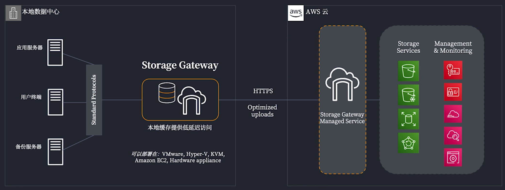


三种网关类型

- **File Gateway**
  - 基于**文件系统**，通过 NFS 连接直接访问存储在 S3 / Glacier上的文件，并且本地进行缓存

- **Volume Gateway**
  - 将本地的**块存储**备份到云上
    - **Stored Volumes**：所有的数据都将保存到本地，但是会**异步地**将数据备份到AWS S3上 --> 异地容灾；
    - **Cached Volumes**：所有的数据都会保存到S3，但是会将最经常访问的数据**缓存**到本地

- **Tape Gateway**
  - 用来取代传统的磁带备份，使用NetBackup，Backup Exec或Veeam 等备份软件将文件备份到 S3 / Glacier 


> 实践：创建 Storage Gateway
>
> - 选择网络类型
> - 选择主机平台：VMware, Linux KVM, EC2
>   - EC2 创建、连接到网关选择 ec2 ip
> - 配置本地磁盘
> - 配置日志记录
> - 创建文件共享
>   - 配置S3存储桶
>   - Mount 到本地


## || EFS

Elastic File System 可以简单地理解为是共享盘或NAS存储；可以在多个EC2实例上使用同样的一个EFS文件系统，以达到共享通用数据的目的。

特点：

- 支持Network File System version 4 (NFSv4)协议
- EFS是**Block Base Storage**，而不是Object Base Storage（例如S3）
- 使用EFS，你只需要为你使用的存储空间付费，没有预支费用
- 可以有高达PB级别的存储
- 同一时间能支持上千个NFS连接
- 高可用：EFS的数据会存储在一个AWS区域的多个可用区内
- Read After Write Consistency


> 实践：创建EFS
>
> 1. Config file system access: 选择 VPC --> 选择相应子网、安全组
> 2. Config optional settings：设置 Tags，选择性能模式
>
> 实践：挂载 EC2
>
> - EFS --> 找到 EC2 Mount Instructions，拷贝挂载命令
>
> - CLI 登录 EC2，执行命令
>
>   ```
>   mkdir efs
>   mount mount -t nfs4 -o ... efs
>         
>   # 此时在一个 EC2实例 efs目录下创建文件，其他实例也可看到。
>   ```
>


vs. **FSx for Windows File Server**

- 协议：FSx 支持 SMB，EFS 支持NFS
- 系统：FSx 支持win,linux,mac；EFS 只支持Linux
- 多可用区：EFS 只能多可用区部署；FSx 可选
- FSx 支持 MS AD 域用户


# 3. 数据库 - Database


# 4. 网络 - Networking


## || CloudFront CDN

利用CDN访问的是位于全球各地的分发网络（边缘站点），从而达到更快的访问速度和减少源服务器的负载。

- **边缘站点（Edge Location）**：边缘站点是内容缓存的地方，它存在于多个网络服务提供商的机房，它和AWS区域和可用区是完全不一样的概念。
- **源（Origin）**：这是CDN缓存的内容所使用的源，源可以是一个S3存储桶，可以是一个EC2实例，一个弹性负载均衡器（ELB）或Route53，甚至可以是AWS之外的资源。
- **分配（Distribution）**：AWS CloudFront创建后的名字。分配分为两种类型，分别是
  - **Web Distribution**：一般的网站应用
  - **RTMP (Real-Time Messaging Protocol)**：媒体流


> 实践：创建 CloudFront CDN
>
> - 网络和内容分发 --> CloudFront (无法也无需选择区域) --> Create --> Web Distribution
> - Origin 设置
>   - Domain: S3 or LB
>   - Path: 
>   - Origin Access Identity: 
> - Cache 设置
>   - Protocol 策略
>   - 允许的http方法
> - Distribution 设置
>   - WAF (web application firewall): 防止应用层攻击，SQL注入
>   - CNAMEs:
>   - SSL 证书：
>   - Logging: 可以存储到S3
> - Geo-Restriction
>   - 可以把某个国家加到白名单或黑名单


## || VPC

Virtual Private Cloud 是一个用来隔离你的网络与其他客户网络的虚拟网络服务。在一个VPC里面，用户的数据会逻辑上地与其他AWS租户分离，用以保障数据安全。

可以简单地理解为一个 VPC 就是一个**虚拟的数据中心**，在这个虚拟数据中心内我们可以创建不同的子网（公有网络和私有网络）


### VPC 特点

- VPC内可以创建多个**子网**；

- 一个 VPC 可以跨越多个可用区，**一个子网只能在一个可用区内**

- 可以在选择的子网上启动EC2实例

- 在每一个子网上分配自己规划的IP地址

- 每一个子网配置自己的**路由表**

- 创建一个**Internet Gateway**并且绑定到VPC上，让EC2实例可以访问互联网

- VPC对你的AWS资源有更安全的保护

  - 部署针对实例的**安全组**（Security Group）

  - 部署针对子网的**网络控制列表**（Network Access Control List）

    > `安全组（Security Group）`是有状态的：如果入向流量被允许，则出向的响应流量会被自动允许；
    >
    > `网络控制列表（Network Access Control List）`是无状态的：入向规则和出向规则需要分别单独配置，互不影响

- VPC的**子网掩码范围是从`/28`到`/16`**，不能设置在这个范围外的子网掩码

- VPC可以通过**Virtual Private Gateway** (VGW) 来与企业本地的数据中心相连

- VPC可以通过AWS PrivateLink访问其他AWS账户托管的服务（VPC终端节点服务）


> 实践：创建 VPC
>
> - 名称
> - IPv4 CIDR 块：10.0.0.0/16
> - 路由表：自动创建
> - 网络ACL：自动创建，允许所有出站入站
>
> 
>
> 实践：创建子网 *2， private / public
>
> - 名称
> - VPC
> - VPC CIDR：自动选择
> - 可用区：
> - IPv4 CIDR: 10.0.1.0/24 
>
>   /24 地址实际可用251个地址，另外5个被预留。
>
> 
>
> 实践：创建路由表 （默认路由表没有访问 Internet 的权限）
>
> - 名称
> - VPC
> - 创建 **Internet 网关**（IGW）
>   - 操作 --> 附加到 VPC (注意是一对一关系)
> - 路由 --> 添加 
>   - 目标：0.0.0.0/0 --> 代表默认路由
>   - 目标：选择 IGW
> - 子网关联 --> 
>   - 如果子网不明确与任何路由表关联，则与主路由表关联，不能访问外网。
> - 创建EC2，分别位于 public 子网、private 子网
>   - pubilc ec2 可以访问外网
>   - public ec2 可以访问 private server
>   - 
>
>
> 
>
> 查看VPC
>
> - 路由表
> - 网络ACL


### 网络 ACL 

网络访问控制列表（NACL）与安全组（Security Group）类似，它能在**子网**的层面控制所有入站和出站的流量，为VPC提供更加安全的保障。

- 一个子网只能关联一个NACL：`N : 1`
- Vs. 安全组：NACL 无状态，安全组有状态

> 实践：创建 NACL
>
> - VPC --> 安全性 --> 网络ACL
>   默认VPC 会有一个默认 NACL：入站出站允许所有流量
> - 入站规则：按ID从小到大匹配
> - 出站规则：无状态！出站需要单独配置 
>   - 添加：端口号 1024 ~ 65535 (所有临时端口范围)


### VPC Peering

VPC Peering 是两个VPC之间的网络连接，通过此连接，你可以使用IPv4地址在两个VPC之间传输流量。这两个VPC内的实例会和如果在同一个网络一样彼此通信。


### Elastic IP

通过申请弹性IP地址，你可以将一个固定的公网IP分配给一个EC2实例。在这个实例无论重启，关闭，甚至终止之后，你都可以回收这个弹性IP地址并且在需要的时候分配给一个新的EC2实例。


# 5. 安全 - Security


## 5.1 网络安全


## 5.2 IAM

组


角色


策略


> **实战1：为EC2分配 aws access key**
>
> ```bash
> > aws s3 ls 
> # 默认没权限
> > aws configure
> # 输入access id, secret 进行配置
> # ls ~/.aws 会看到两个文件 config, security；security 文件包含 access_key 和 secret_key
> 
> > aws s3 ls 
> # 此时有权限了
> > aws ec2 describe-instances
> ```
>
> - 确定：如泄漏，影响严重
>
> 
>
> **实战2：为EC2分配IAM角色**
>
> 使用AWS IAM创建一个新的**AWS角色**，赋予该角色一定的权限，然后将这个角色赋予到使用AMI创建的EC2实例上。
>
> 1. **创建角色**：IAM -> 角色 -> 创建（aws√, **oidc**, saml） ->附加权限策略
> 2. **创建EC2时附加角色**：创建EC2 -> 配置实例 -> 选择IAM角色
> 3. **附加到已有的EC2**：操作 -> 实例设置 -> 附加替换IAM角色
>
> 


# 6. 迁移 - Migration


# 7. 高可用 - High Availability


## || ELB

ELB只在一个特定的AWS区域中工作，不能跨区域（Region），但可以跨可用区（AZs） 


类型：

https://aws.amazon.com/cn/elasticloadbalancing/features/#compare

- Classic Load Balancer: 不推荐
- Network Load Balancer：静态 IP (?)、极致性能
- Application Load Balancer：灵活管理应用程序

|      | CLB                              | ALB                                                          | NLB                                                          |
| ---- | -------------------------------- | ------------------------------------------------------------ | ------------------------------------------------------------ |
| 层   | 7层                              | 7 层                                                         | 4 层，**只支持传输层协议**：TCP、UDP、TLS                    |
| 特点 | - 不支持基于路径、Host、头的转发 | - 可进行基于路径的路由；<br />- 可侦听HTTP头来定义规则；<br />- 可将IP地址注册为目标 | - NLB可以基于协议、源 IP 地址、源端口、目标 IP 地址、目标端口和 TCP 序列号，使用流式哈希算法选择目标。 |
|      |                                  |                                                              | 适合大吞吐场景                                               |
|      |                                  |                                                              |                                                              |


#### CLB

Classic Load Balancer 

为什么不推荐 CLB：

- 不支持本机 HTTP/2 协议；
- 不支持 注册IP地址即目标，**只支持 EC2 为目标**；
- 不支持服务名称指示 SNI；(?)
- 不支持基于路径的路由；
- 不支持负载均衡到同一实例上的多个端口；


> **实践**
>
> - EC2 启动 nginx
>
>   - ssh EC2，添加 nginx 源：`sudo rpm xxx`；安装 nginx `yum -y install nginx`
>   - 修改index文件：`vi /usr/share/nginx/html/index.html`，`systemctl start nginx`
>   - 配置安全组：允许 CLB 访问
>
> - 配置 CLB：EC2 --> 负载均衡器 --> 创建 - CLB
>
>   - 配置可用区 - 选择 VPC：与 ec2 要相同
>   - 配置**侦听器**：HTTP, 80 --> HTTP, 80
>   - 配置安全组：创建新 SG，确保开放 80 端口
>   - 配置运行状况检查
>   - 添加 EC2 实例


#### ALB

Application Load Balancer

https://docs.aws.amazon.com/zh_cn/elasticloadbalancing/latest/application/introduction.html

工作在7层（应用层），也被称为 `7层ELB` 

流程

- ALB 收到请求，按照优先顺序评估`侦听器`的`规则`，将流量转发到特定目标组。
- 可以根据`流量内容`或`URL路径`，将不同的请求转发到不同的目标组。


功能

- 支持 HTTP / HTTPS
- 支持基于路径、基于主机的路由
- 支持将 **IP 地址**注册为目标，包括VPC之外的目标；
- 支持调用 Lambda 函数
- 支持 SNI
- 支持单个实例**多个端口**之间的负载均衡


路由算法

- 轮询


> **实践：基于路径的路由**
>
> - 创建 ALB：EC2 --> 负载均衡器 --> 创建 - ALB
>   - 配置 VPC、可用区、安全组；
>   - 配置路由：新建“**目标组**” --> 目标类型：IP （？）
>   - 注册目标：输入 IP ，添加到列表
> - 新增**目标组**：EC2 --> 目标组 --> 创建
>   - 类型：IP
>   - 添加实例到目标组：目标组 --> 目标 --> 添加 IP 到列表
> - 配置路径路由：EC2 --> 负载均衡器 --> **侦听器** --> **编辑规则** - 添加规则，转发到**目标组**
>   - 规则1 - IF : 路径 == `*images*`；规则 THEN: 转发至 == `images 目标组`
>   - 规则2 - IF : 路径 == `*about*`；规则 THEN: 转发至 == `about 目标组`
>
> 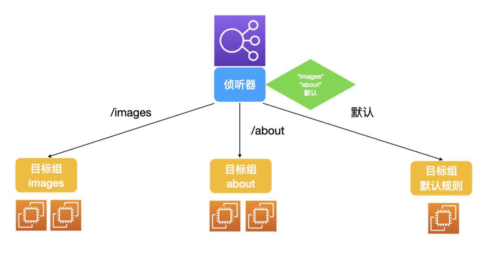


#### NLB

Network Load Balancer

https://docs.aws.amazon.com/zh_cn/elasticloadbalancing/latest/network/introduction.html

运行于第四层，**只支持传输层协议**：TCP、UDP、TLS。--> 区别于 ALB

- 所以无法支持 应用层的功能，例如基于路径的路由、基于HTTP标头路由；

  > 在配置界面中，没有**侦听器规则**配置项


路由算法：流式哈希算法

- 对TCP流量，基于协议、源IP、源端口、目标IP、目标端口、TCP序列号，使用“**流式哈希算法**”选择目标；

- 对于每个单独的TCP连接，在连接有效期内只会路由到单个目标。

  > 黏连、不会轮询


优势

- 能处理突发流量；

- 极致网络性能；

- 支持将静态IP地址用于负载均衡器；还可为每个子网分配一个弹性IP地址 (?)

  > 作用：每个NLB在每个可用区中提供单个静态IP地址，用户端发往该IP地址的流量会被负载分发到同可用区内的多个后端实例上，用户可以为NLB在每个可用区中分配固定的弹性IP，如此设计使得NLB能够被纳入企业现有的防火墙安全策略中，并且能够避免DNS缓存带来的问题。


**实践：弹性IP**

https://www.iloveaws.cn/2170.html

- 申请弹性IP：EC2 --> 网络与安全 --> 弹性IP
- 创建 NLB：EC2 --> 负载均衡器 --> 新建 - NLB
  - 配置侦听器：协议 TCP
  - 配置可用区：至少选择两个，将 **弹性IP** 配置到其中一个可用区；
  - 配置路由目标组：新建目标组 --> 目标类型：实例，协议：TCP
  - 注册目标：添加 EC2
- 测试
  - 弹性IP --> 找到被分配到的网络接口 --> 可以看到描述为 上述NLB在相应可用区的网络接口。
  - 终端：`nslookup NLB_HOST` --> 获取到的IP地址 == *弹性IP - 公有IP地址*


#### 侦听器 & 目标组

> 只用在 ALB、NLB；CLB 是直接在 LB层面配置“目标实例”。

侦听器

- 侦听器是LB 用于**检查连接请求**的进程。一个LB可以有多个侦听器。

- 侦听器使用配置的**协议和端口** 检查来自客户端的连接请求；

- 侦听器将请求 根据规则**路由**到已注册目标组。

目标组

- 目标组使用指定的**协议和端口**将请求**路由**到一个或多个注册目标，例如EC2、IP；


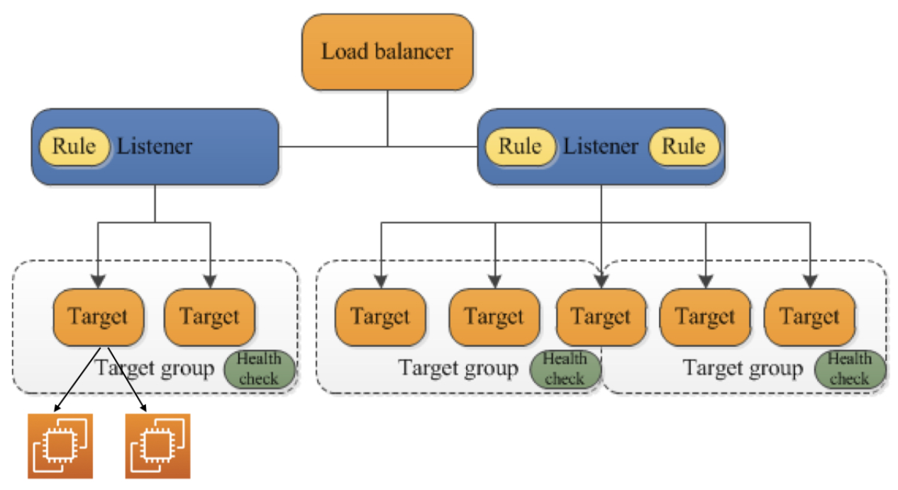


## || Auto Scaling


# 8. 部署 - Deployment

## || ECS

> Elastic Container Service，它可以轻松运行、停止和管理集群上的Docker容器，你可以将容器安装在EC2实例上，或者使用Fargate来启动你的服务和任务。

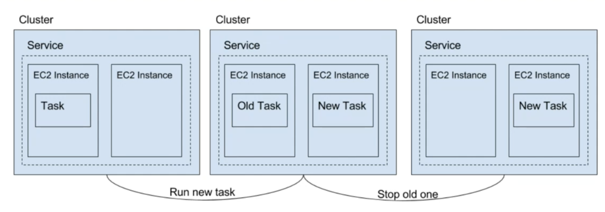

**分类**

- **ECS on EC2**
  - 容器运行在EC2实例上；
  - ECSA Container Agent 安装在实例上；
  - ECS 是免费的，EC2 收费；
  - 不好扩容；
  - 集成了 EKS (托管的k8s服务)
- **ECS on Fargate** 
  - 无需 EC2 实例资源；
  - 为运行的任务付费；
  - 尚未集成 k8s

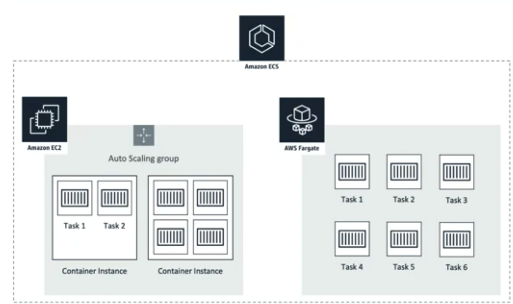


**ECS Task Definition**

任务定义是一个JSON格式的文本文件，这个文件定义了构建应用程序的各种参数。这些参数包括了：要使用哪些容器镜像，使用哪种启动类型，打开什么端口，使用什么数据卷等等。

> ECS任务定义有点类似 *CloudFormation* （or 类似 Dockerfile?），只是ECS任务定义是用来创建Docker容器的。
>
> Task 类似于 pod？

```json
{
    "family": "webserver",
    "containerDefinitions": [
        {
            "name": "web",
            "image": "nginx",
            "memory": "100",
            "cpu": "99"
        },
    ],
    "requiresCompatibilities": [
        "FARGATE"
    ],
    "networkMode": "awsvpc",
    "memory": "512",
    "cpu": "256",
}

```


**ECS Scheduling**

ECS任务调度负责将任务放置到集群中，你可以定义一个**服务（Service）**来运行和管理一定数量的任务。


服务调度（Service Scheduler）

- 保证了一定数量的任务持续地运行，如果任务失败了会自动进行重新调度
- 保证了任务内会注册一个ELB给所有容器

自定义调度（Custom Scheduler）

- 你可以根据自己的业务需求来创建自己的调度
- 利用第三方的调度


**ECS Cluster**

当使用 ECS运行任务时，任务会放在到一个逻辑的资源池上，这个池叫做**集群（Cluster）**。

- 如果是 **ECS on Fargate**，那么ECS将会管理你的集群资源，你不需要管理容器的底层基础架构。

- 如果是 **ECS on EC2**，那么你的集群会是一组容器实例。

在Amazon ECS上运行的容器实例实际上是运行了ECS**容器代理（Container Agent）**的EC2实例。

特点：

- 集群包含了多种不同类型的容器实例
- 集群只能在同一个区域内
- 一个容器实例只能存在于一个集群中
- 可以创建IAM策略来限制用户访问某个集群


**ECS Container Agent**

容器代理会在Amazon ECS集群内的每个基础设施资源上运行。使用容器代理可以让容器实例和集群进行通信，它可以向ECS发送有关资源当前运行的任务和资源使用率的信息。

容器代理可以接受ECS的请求进行启动和停止任务。

 

> 实践：使用ECS 创建 Docker 容器
>
> - ECS -> 开始使用 
>   - **容器定义**：sample-app 基于httpd；或者 nginx 
>   - **任务定义**：网络模式，任务内存，任务CPU；相当于是一个模板 Dockfile
>   - 服务：定义 ALB，port, http
>   - 集群：VPC，子网
> - LB --> 查看自动创建的 ALB，可通过其访问 sample-app


## || Elastic Beanstalk

使用者只需要上传应用程序，Elastic Beanstalk 将自动处理容量预配置、负载均衡、Auto Scaling 和应用程序运行状况监控的部署细节。


**需求：部署web应用，并配置ELB**

传统方式：

- 启动 EC2，配置安全组等；
- 登录 EC2，安装web服务器；
- 上传及配置应用；
- 创建 ELB，配置检查检查，指向实例；

Beanstalk 方式：

- 在 Beanstalk 控制台创建应用程序，选择需要的平台；
- 上传应用代码；


> **实践：创建 Beanstalk**
>
> - Elastic Beanstalk 控制台 --> 创建应用
>
>   - 应用程序名称
>   - 平台 = Java，平台版本 = xx
>   - 程序代码来源：上传 / S3 
>
> - aws 自动做的工作：（可查看： EB --> 事件）
>
>   - 创建安全组
>   - 创建 EIP
>   - 启动 EC2
>   - 配置 EC2 平台环境
>   - 上传代码至 EC2
>   - 提供一个公共的终端节点


> **实践：查看日志**
>
> 直接通过EB，而不用 ssh 到 EC2 查看日志。
>
> - EB --> 选择环境 --> 日志 --> 请求完整日志 --> 下载


> **实践：部署新版本**
>
> - EB --> 选择环境 --> 点击 “上传和部署”


> **实践：自定义环境**
>
> - EB --> 选择环境 --> 配置
>   - 容量：单一实例 vs. 负载均衡 （auto scaling）
>   - 软件配置：内存限制、最长执行时间（与平台相关）
>   - 实例日志流式传输到 CloudWatch
>   - EC2 密钥对
>   - ...


**EB 部署策略**

- 一次部署全部 - All at once

  > 部署时间最短，但需停机

- 滚动部署

  > 分批部署；部署过程中服务实例数会减少；

- 附加批次滚动部署

  > 先启动新的额外的实例批次进行部署；

- 不可变部署

  > 创建临时 Auto Scaling 组、新实例；部署失败带来的影响最小；
  >
  > 类似 蓝绿部署；


# 9. 无服务架构 - Serverless


# 10. 大数据 - Big Data


# 11. 成本管理 - Cost Management


# | Organizational Complexity 

## || 多账户策略

### 身份账户 +实践

> Identity Account Architecture

- 在单一的中央区域对所有用户进行**集中管理**；并允许他们访问多个 AWS 账户下的不同 AWS 资源。
- 可以通过**跨账户 IAM 角色** 和 **身份联合**（Federation）来完成。


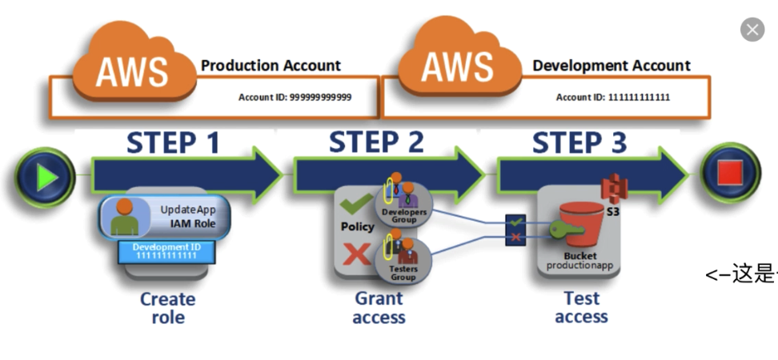

**实践**

**背景**

- AS-IS：假设有 4 个 aws 账户，就需要为新员工创建 4 个 IAM 用户、管理不便；
- TO-BE：只需将新员工加入身份账户；

**思路**

- 设置独立专用的 `身份账户 Identity Account`，集中建立用户、密码、访问秘钥、管理用户。

  > 建议身份账户只用于用户管理，不做资源管理

- 在身份账户与企业其他账户直接**建立信任关系**，在其他账户中建立**角色**，将身份账户设置为受信任实体，并设置**策略**。

- 用户登录身份账户后，通过**切换角色**，即可访问不同账户的资源。

**步骤**

- 在身份账户中创建一个 **IAM 用户** zhangsan；
  - IAM --> 用户 --> 添加用户 
- 在生成环境账户中创建一个 **跨账户角色** CA-TEST，并分配S3完全访问权限；
  - IAM --> 角色 --> 创建角色 
  - 选择受信任实体类型 = 其他AWS账户 --> 输入 zhangsan id
  - 选择权限策略 --> S3 完全访问
  - 摘要：拷贝出切换链接
- 在身份账户中配置允许 zhangsan 切换到生成环境账户的 CA-TEST角色；
  - IAM --> 用户 --> 添加内联策略
- 切换角色：输入地址
  - 登录zhangsan --> 执行切换链接 --> 即可切换到生产环境账户 --> 测试 S3 完全访问
  - 后续切换：右上角 --> 角色历史记录


### 日志账户

> Logging Account Architecture

- 将所有账户的所需日志**集中存储**在一个中心区域；

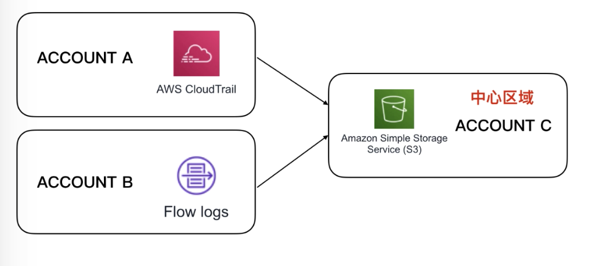

### 发布账户

> Publishing Account Structure

- **集中管理**整个企业预先批准的 AMI、aws CloudFormation 模板。

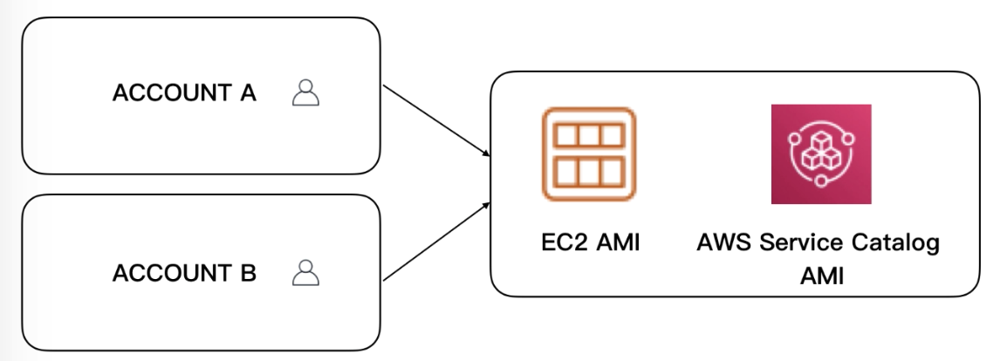


### 账单结构

> Billing Structure

- 建立主账户，**整合支付**所有成员子账户。
- 统一支付、账单追踪、合并使用量

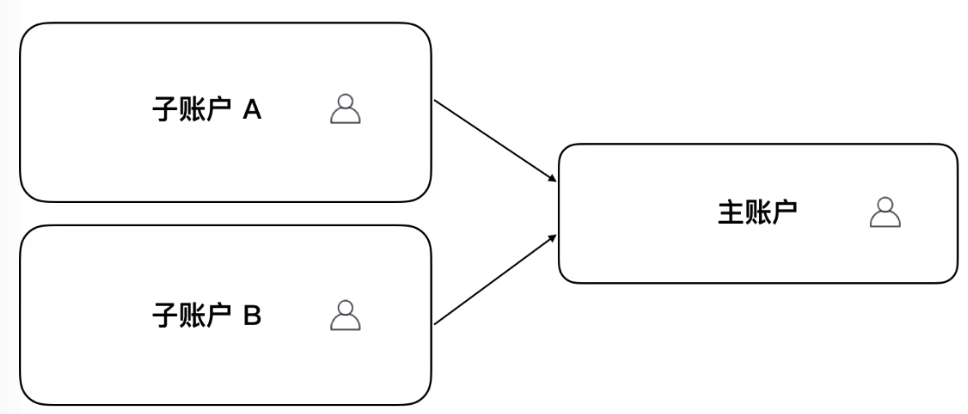


## || AWS Organizations

目的：将多个 AWS 账户（成员账户）整合到集中管理的组织（主账户）中，进行账户管理、整合账单。

- 我的账户 - 账单

### 服务控制策略 +实践

> SCP: Service Control Policy


**实践**

主账户

- AWS organizations --> 创建 --> 选择仅整合账单，或所有功能 --> 当前账户会成为主账户。
- 添加账户 --> 邀请现有账户，或创建新账户

成员账户

- AWS organizations --> 打开并接受新邀请；
- 我的账单 --> 确认账户已成为组织成员；

配置策略

- 主账户 --> AWS organizations --> 策略 - 服务控制策略 --> 创建策略 （例如禁止访问S3）
- 主账户 --> AWS organizations --> 账户 --> 选中成员账户 --> 附加 策略


## || 日志


### 集中式日志存储架构 +实践

如何查看服务器日志？

- 方法一：给开发人员分配 ssh 权限；
- 方法二：集中式日志存储架构，将所有账户的所需日志集中存储在一个中心区域，集中进行监控分析。


最佳实践：

- 尽早定义日志保留实践、生命周期（冷数据存 Glacier）
- 生命周期策略自动化
- 自动安装和配置日志agent（处理 autoscaling）
- 支持混合云架构


AWS 提供的集中式日志解决方案：

- AWS ElasticSearch Service
- AWS CloudWatch Logs
- Kinesis Firehose
- AWS S3


**实践**

将各个**账户**的日志 发送到**中央账户** S3 存储桶。


- 中央账户：创建 S3 存储桶；并配置策略：权限 --> 存储桶策略。

  ```json
  {
      "Version": "2012-10-17",
      "Statement": [
          {
              "Sid": "AWSCloudTrailAclCheck20150319",
              "Effect": "Allow",
              "Principal": {
                  "Service": "cloudtrail.amazonaws.com"
              }, //or config.amazonaws.com
              "Action": "s3:GetBucketAcl",
              "Resource": "arn:aws:s3:::iloveawscn-central-config"
          },
          {
              "Sid": "AWSCloudTrailWrite20150319",
              "Effect": "Allow",
              "Principal": {
                  "Service": "cloudtrail.amazonaws.com"
              },
              "Action": "s3:PutObject",
              "Resource": "arn:aws:s3:::iloveawscn-central-config/*",
              "Condition": {
                  "StringEquals": {
                      "s3:x-amz-acl": "bucket-owner-full-control"
                  }
              }
          }
      ]
  }
  ```

  

- CloudTrail  转发配置

  - 账户B : CloudTrail --> 创建跟踪 --> 存储位置：S3 存储桶

- Config 日志转发配置
  
  - 账户B: aws config --> 设置：S3 存储桶

> Q: CloudTrail / Config 日志分别是什么时候生成？


### CloudWatch Logs +实践

在ec2上按照 CloudWatch Logs代理，将相关日志推动到 **CloudWatch 日志组**。接下来即可在cloudwatch日志组中检索日志。

**实践**

把 Linux 系统日志内容推送到 中央CloudWatch

- 为 EC2 分配 **IAM 角色**，以便允许 EC2 创建日志组、发送到日志组；

  - IAM --> 角色 - 创建角色 --> 选择EC2 --> 附加策略：CloudWatchAgentServerPolicy
  - EC2 --> 实例 --> 设置 - 附加/替换 IAM 角色 --> 选择上一步的角色；

- 在 EC2 上安装并配置 **CloudWatch Logs代理**；

  - 安装：`yum install -y awslogs`

  - 配置：

    ```sh
    $ cd /etc/awslogs
    # 两个配置文件 awscli.conf, awslogs.conf
    
    $ vi awscli.conf
    [plugins]
    cwlogs = cwlogs
    [default]
    region = us #根据实际配置region
    
    $ vi awslogs.conf
    ...
    [/var/logs/messages] #对应会创建日志组
    file = /var/logs/messages
    ```

- 启动 CloudWatch Logs代理；

  - `systemctl start awslogsd`
  - 代理本身的日志文件：/var/log/awslogs.log

- 验证：CloudWatch --> 日志组 --> /var/logs/messages


## || 权限策略


### S3 存储桶策略

S3 访问策略

- 基于资源
  - ACL 访问控制列表
  - 存储桶策略
- 基于用户

实践

- 配置允许所有人访问：

  - S3 --> 权限 --> unselect “阻止全部公共访问权限”；选择文件 --> 公开

- 允许特定IP 段的存储桶策略：

  - S3 --> 权限 --> 存储桶策略

    ```json
    {
       "Version":"2012-10-17",
       "Id":"S3PolicyId1",
       "Statement":[
          {
             "Sid":"statement1",
             "Effect":"Deny",
             "Principal":"*",
             "Action":[
                "s3:*"
             ],
             "Resource":"arn:aws:s3:::examplebucket/*",
             "Condition":{
                "NotIpAddress":{ //除这个ip之外的 都deny
                   "aws:SourceIp":"192.168.143.188/32"
                }
             }
          }
       ]
    }
    ```


### 跨账户 S3 存储桶访问

将 S3 访问权限授予不同的 aws 账户。

- 访问目的：Account A 

  - S3 --> 权限 --> 存储桶策略

  ```json
  {
      "Version": "2012-10-17",
      "Statement": [
          {
              "Sid": "cross",
              "Effect": "Allow",
              "Principal": {
                  "AWS": "arn:aws:iam::256454142732:root"
              },
              "Action": "s3:*",
              "Resource": [
                  "arn:aws:s3:::iloveawscn", //当前存储桶的ARN
                  "arn:aws:s3:::iloveawscn/*"
              ]
          }
      ]
  }
  ```

- 访问来源：Account B

  - IAM --> 用户 --> 访问秘钥

  - 将 A 和 B 的凭证配置到 CLI Credentials 配置文件

    - cat .aws/credentials

      ```properties
      [accounta]
      aws_access_key_id = 
      aws_secret_access_key = 
      
      [accountb]
      aws_access_key_id = 
      aws_secret_access_key = 
      ```

  - 访问：`aws s3 ls s3://iloveaswcn/ --profile accountb` 

  - 上传：`aws s3 cp accountb_file s3://iloveawscn/ --profile accountb`

  - Q: 用 accounta 下载 accountb_file 会报403，为什么？

    - ACL ! 

### S3 标准 ACL

基础知识

- ACL 作为子资源附加到 存储桶或对象上；新对象默认会分配“资源拥有者完全访问权限”。
- `get-object-acl` 查看附加的ACL具体内容；
  `aws s3api get-object-acl --bucket iloveawscn --key accountb_file --profile accountb`


标准 ACL：一系列预定义的授权

- 创建时，通过 `x-amz-acl` 请求头指定；
  `aws s3 cp acl.txt s3://iloveawscn/ --acl bucket-owner-full-control --profile accountb`

- 标准 ACL 列表：

  | ACL                       | 适用         | 所有者       | 其他                                           |
  | ------------------------- | ------------ | ------------ | ---------------------------------------------- |
  | private                   | bucket / obj | FULL_CONTROL | 其他人无权限                                   |
  | public-read               | bucket / obj | FULL_CONTROL | READ                                           |
  | public-read-write         | bucket / obj | FULL_CONTROL | READ, WRITE                                    |
  | aws-exec-read             | bucket / obj | FULL_CONTROL | ec2 从 s3 获取对GET AMI 捆绑的read访问权限 (?) |
  | authenticated-read        | bucket / obj | FULL_CONTROL | AuthenticatedUsers组有READ权限                 |
  | bucket-owner-read         | obj          | FULL_CONTROL | 存储桶拥有者可以READ                           |
  | bucket-owner-full-control | obj          | FULL_CONTROL | 存储桶拥有者 FULL_CONTROL                      |
  | log-delivery-write        | bucket       |              | LogDelivery 组可以对桶 WRITE / READ_ACP        |

  


# | Design for New Solutions

## || 安全

### IAM: Identity and Access Management.

IAM vs. Policy 

- IAM 角色可附加多个策略。


原则

- 最小权限原则 Principle of Least Privilage


**IAM 策略评估模型**

> IAM Policy Evaluation Logic

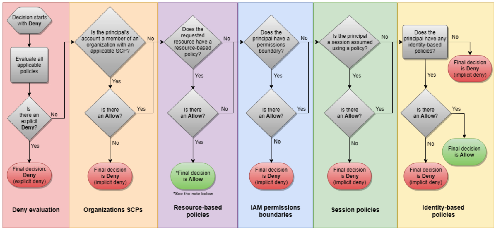

- **Deny Evaluation**：是否有显示拒绝策略？-
  - 隐式拒绝。
- **Organizations SCPs**：组织是否有可应用的 SCP?
- **Resource-based Policies**：被请求的资源是否有policy?
- **IAM Permissions Boundaries**：当前 principal 是否有 permission boundary?
- **Session Policies**：当前 principal 是否是使用 policy 的session?
- **Identity-based Policies**：当前 principal 是否有基于identity的策略？


#### **实践：S3 IAM 策略**

**实践1**：新增S3策略

- IAM --> 用户 --> 添加权限 --> AmazonS3ReadOnlyAccess
  - s3:Get, s3:List


**实践2**：有 N 个存储桶，只拒绝第 5 个

- 允许访问所有：IAM --> 用户 --> 添加权限 --> AmazonS3FullAccess

- 拒绝第5个：IAM --> 用户 --> 添加权限 --> 创建策略（策略编辑器）

  - 服务 --> 选择 S3

  - 操作 --> 选择所有；选择切换以拒绝权限

  - 资源 --> 添加 ARN --> 输入存储桶名称

  - 编辑策略 --> 删除部分自动生成的内容 (???)

    ```json
    {
      "Statement": [
        {
          "Sid": "VisualEditor1",
          "Effect": "Deny",
          "Action": "s3:*",
          "Resource": "arn:aws:s3:::iloveawscn5"
        }
      ]
    }
    ```

  - 附加策略到用户：

> 说明 显式拒绝策略的优先级高于允许策略。


**实践：通过附加 IAM 角色访问 S3**

- IAM 角色 --> 附加策略：S3ReadyOnly
- EC2 --> 设置IMA 角色 


### STS: Securtiy Token Service

通过 metadata 检索 IAM 角色临时安全凭证：`curl http://169.254.169.254/latest/meta-data/iam/security-credentials/S3ReadOnly/`

将返回：

- AccessKeyId: 
- SecretAccessKey:
- Token:
- Expiration: 

Token 并不是IAM角色生成，而是 STS 生成的。IAM 角色与 STS 服务会建立信任管理，通过STS 获取这些凭证。


什么是临时安全凭证？

- STS 创建可控制你的 aws 资源的临时安全凭证，将凭证提供给**受信任用户**。
- 临时安全凭证是短期的，有效时间几分钟或几小时。-- 无需显式撤销、轮换。
- 应用程序无需分配长期 AWS 安全凭证。


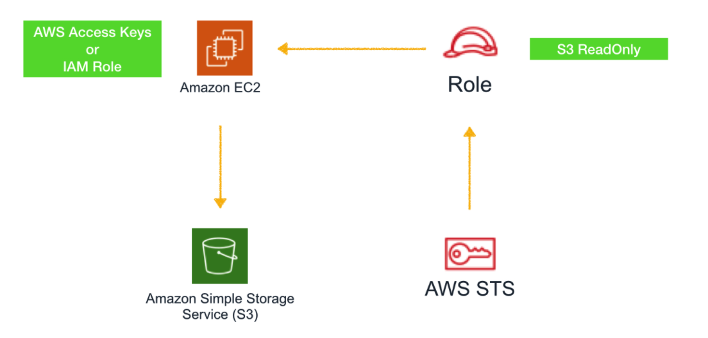

#### 实践：本地开发临时凭证

**实践1：信任管理配置**

- IAM --> 角色 - 选择角色 --> 信任关系  

  ```json
  //允许EC2代入该角色，调用 sts:AssumeRole 获取临时安全凭证
  {
    "Version": "",
    "Statement": [
      {
        "Effect": "Allow",
        "Principal": {
          "Service": "ec2.amazonaws.com"
        },
        "Action": "sts:AssumeRole" //?
      }
    ]
  }
  ```


AssumeRole: https://docs.aws.amazon.com/cli/latest/reference/sts/assume-role.html


**实践2：本地开发模拟 EC2 IAM 角色同样的权限**

- Local --> 编辑 credentials 文件 `vim ~/.aws/credentials`

  ```properties
  [accounta]
  ...
  
  [accountb]
  ...
  
  [ec2role]
  aws_access_key_id = 
  aws_secret_access_key = 
  aws_session_token = //来源自通过 metadata 检索 IAM 角色临时安全凭证：`curl http://169.254.169.254/latest/meta-data/iam/security-credentials/S3ReadOnly/`
  ```

- 通过临时凭证访问S3：`aws s3 ls --profile ec2role`


**实践3：本地开发使用STS生成临时凭证** (推荐)

是对实践2的优化。

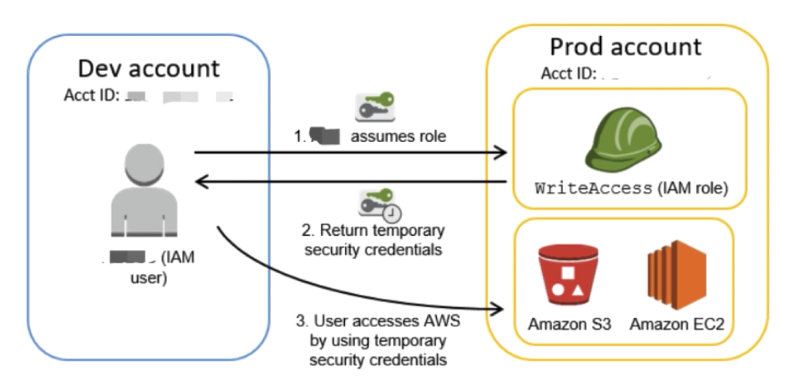

只配置本地安全凭证：IAM --> 用户: zhangsan --> 安全证书：访问秘钥 --> 拷贝到 `.aws/credentials` 文件；

--> 并不能访问 S3. 


步骤：

- 在 IAM 中建立一个跨账户**角色** stroll；

  - IAM --> 角色 --> 创建 --> 选择受信任实体：其他 AWS 账户 - 输入zhangsan账户ID 

    ```json
    {
      "Statement": [
        "Principal": {
          //受信任实体：aws账户
          //区别于受信任实体EC2: "Service": "ec2.amazonaws.com"
          "AWS": "arn:aws:iam::12345:root"
        },
        "Action": "sts:AssumeRole"
      ]
    }
    ```

    

  - 附加一个 S3ReadOnly **权限策略**到 IAM 角色：IAM --> 角色 --> 附加权限策略 --> S3ReadOnly
  
- 给用户添加 **AssumeRole策略**：允许 IAM 用户（开发人员）STS Assume Role 权限，以便获得临时凭证访问 S3；

  - IAM --> 用户：zhangsan --> 添加内联策略
    - 服务 -->选择 STS
    - 操作 --> AssumeRole
    - 资源 --> 添加 ARN --> 拷贝stroll角色的 ARN （指定允许zhangsan承担的角色的ARN）
  
- 本地测试：
  - 获取临时安全凭证：`aws sts assume-role --role-arn arn:aws:iam::256454142732:role/stroll --role-session-name stroll`
  - 写入本地文件: `vi ~/.aws/credentials`
  - 测试访问：`aws s3 ls --profile zhangsansts`


**实践4：自动化获取临时凭证**

实践3可优化：aws sts assume-role --> 拷贝设置 credentials

思路：为AWS CLI 指定承担的角色。这样CLI 就会自动进行 AssumeRole调用。

> 类似 EC2 自动获取临时凭证，也是因为EC2上附加了 IAM 角色。


步骤：

- 设置 credentials：`vi ~/.aws/credentials`

  ```properties
  [default]
  aws_access_key_id = xx
  aws_secret_access_key = xx
  
  [automate]
  role_arn = arn:aws:iam::12345:role/stroll #角色
  source_profile = default #用户访问秘钥所在的profile
  ```

- 测试： `aws s3 ls --profile automate` 即可访问成功。


### ssh ec2 -TODO

- 下载证书到本地 xx.pem
- 登录 `ssh -i xx.pem IP`


### KMS: Key Management Service

用于加密密钥的生成、管理、审计。

特点：

- 完全托管
- 集中式密钥管理
- 管理AWS服务的加密
- 成本低廉


#### **实践：主密钥加密解密**

- 创建**客户主密钥 CMK**

  - KMS --> 客户管理的密钥 --> 创建密钥 
    - 密钥类型：对称√、非对称
    - 密钥材料来源：KMS√、外部、自定义密钥库 CloudHSM
  - 定义密钥管理权限：密钥管理员 --> 选择 IAM 用户或角色
  - 定义密钥使用权限：
  
- 定义密钥管理员及**密钥用户**

  - 创建 IAM 用户：IAM --> 用户 --> 创建；
  - KMS --> 添加密钥用户 --> 获得 `访问密钥ID`、`私有访问密钥`
  
- 密钥用户使用`访问密钥ID`、`私有访问密钥` 来加密和解密数据

  > 注意：密钥不允许导出、只可在当前区域使用

  - 配置 CLI：`aws configure` --> 输入访问密钥、私有访问密钥、Region （IAM --> 用户 --> 安全证书 --> 创建访问密钥）
  - 为用户添加权限：IAM --> 用户 --> 添加内联策略 -- 否则aws kms list-keys 会拒绝访问
    - 服务 --> KMS
    - 操作 --> listkeys
  - 测试获取CMK： `aws kms list-keys` 列出当前账户所有 CMK

  

- 加密：`aws kms encrypt --key-id {密钥ID} --plaintext {待加密内容} --query CiphertextBlob --output text`

  - --query CiphertextBlob: 只返回密文，不返回密钥ID、算法；
  - --output text：去掉密文两边的引号；
  - 解码后输出到二进制文件：`| base64 --decode > encryptfile`
  
- 解密：`aws kms decrypt --ciphertext-blob fileb://encryptfile --query Plaintext --output text | base64 --decode`

  - --query Plaintext：只返回解密后文本，不返回密钥ID、算法；
  - 解码：`| base64 --decode`

  

> 加密解密过程中，主密钥一直存储在 KMS 中 由aws进行保存；用户通过密钥ID来进行加密，保障了主密钥的安全性。


#### KMS 信封加密

将加密数据的数据密钥封入信封中进行存储、传输，使用离线的密钥在本地加解密，**不再使用主密钥直接加解密数据**。

使用场景：

- 当加密数据较大时。- KMS 最大支持4KB
- 性能要求高时。- 因为降低了网络负载
- 传输过程中的安全风险。 - 窃听、钓鱼


**信封加密工作流程：**

1. 创建客户主密钥 CMK；
2. 调用 KMS generate-data-key 生成数据密钥（共两个，一个明文数据密钥，一个密文数据密钥）；
   - 实践 - 生成数据密钥：`aws kms generate-data-key --key-id {CMK密钥ID} --key-spec AES_256`
     - 密钥ID: 拷贝自 KMS --> 客户管理的密钥
     - --key-spec: 密钥长度
     - 返回值：Plaintext == 明文数据密钥，CiphertextBlob == 密文数据密钥；
3. 使用`明文数据密钥`加密文件；
4. 将加密后的文件、`密文数据密钥`一同存储；并删除明文文件、明文数据密钥。


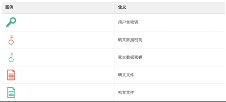


**信封解密工作流程：**

1. 读取密文数据密钥、密文文件；
2. 调用 KMS decrypt，解密`密文数据密钥`，得到`明文数据密钥`；
3. 使用`明文数据密钥`解密文件；

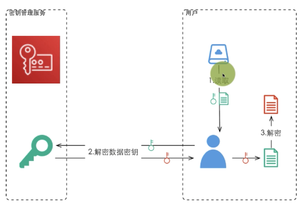


### Network ACLs

**概念**

- 网络ACL是无状态的；

- 网络ACL 运行于子网级别，而安全组运行于实例级别；

  > 网络ACL规则控制允许进入子网的数据流，而安全组规则控制允许进入实例的数据流。

- VPC 中每一个子网都必须与网络ACL关联；-- 网络ACL : 子网 == 1 : N
- 默认网络ACL 允许所有入站和出站的流量；自定义网路ACL默认拒绝所有入站和出站流量，直到添加规则；


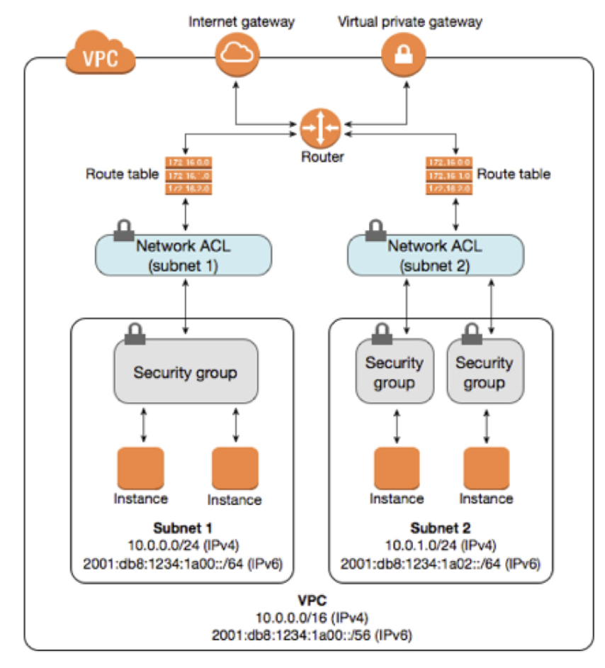

**网络ACL vs. 安全组**

|             | 安全组                           | 网络ACL                                |
| ----------- | -------------------------------- | -------------------------------------- |
| 运行级别    | 实例级别                         | 子网级别                               |
| 规则        | 仅支持允许规则                   | 支持允许规则、*拒绝规则*               |
| 状态        | 有状态，返回的数据流会被自动允许 | 无状态，返回的数据流必须被规则明确允许 |
| 规则判断(?) | 评估所有规则                     | 按照规则数字顺序，找到符合的规则即返回 |
| 应用时机    | 只有与实例关联时 才会应用规则    | 自动应用与之关联的子网下所有实例       |


**实战**：禁止特定 IP 访问 EC2 端口22

- EC2 --> 安全组 --> 入站规则：允许22端口，无法配置拒绝规则；
- VPC --> 网络ACL --> 选择默认ACL --> 确认关联子网 --> 默认入站规则 100 - 允许所有；
  - 配置入站规则：添加 --> 编号设置为较小 --> DENY
- 创建自定义ACL：默认 DENY all


## || 灾备

### 指标：RTO & RPO

**RTO: 恢复时间目标**

- 从业务中断到恢复到正常所需的时间；

**RPO: 恢复点目标**

- 可容忍的最大数据丢失量；


### RDS 只读副本

作用

- 灾备
- 读写分离

适用场景

- 适用于读取密集型数据库


**实践：创建 RDS 只读副本**

- RDS --> 操作 - 创建只读副本 -->
  - 选择实例规格：同主数据库
  - 目标区域：跨 zone 部署

- 测试：

  - 测试数据库端口连通性 `nc -zv  xxx.ap-northeast-1.rds.amazonaws.com 3306`

    > 先要打开 RDS 公开可用性、以及 **VPC 安全组**中添加允许访问策略。

  - 连接主库，创建 database；连接从库，测试 db 是否已同步。

- 监控：

  - RDS --> 只读副本 --> 监控 - CloudWatch --> 副本滞后


### S3 跨区域复制 -CRR

**使用场景**

- 合规性要求
  - S3 默认是跨可用区复制，而不是跨区域；
- 减少延迟：就近访问
- 灾难恢复


>  注意：开启复制时，不会影响之前已存在的对象


**实践：**

- 创建两个存储桶，分别位于不同区域；
- 开启版本控制（必须！）：S3 --> 属性 --> 版本控制 --> 启用；
- 配置复制：源存储桶 --> 管理 --> 复制 
  - --> **添加规则**：所有内容，或满足特定前缀 / 标签；
  - --> 选择**目标存储桶**：还可指定更改*存储类*；
  - --> 配置 IAM 角色：创建新角色；（使用角色赋予一定的权限来完成跨区域复制）


## || VPC

### VPC 基础知识

**VPC** 

- VPC 是aws账户的虚拟网络。在逻辑上与aws中其他虚拟网络隔离。
- 允许的 CIDR 介于 /16 ~ /28 之间 （IP地址个数 65535 ~ 28）

**CIDR**: 

- Classless Inter-Domain Routing，创建VPC时必须指定 IPv4 CIDR 块。

**私有IP**: 

- *10.0.0.0/8* (10.0.0.0~10.255.255.255) - 大型网络 
- *172.16.0.0/12* (172.16.0.0~172.31.255.255) - AWS 默认
- *192.168.0.0/16* (192.168.0.0~192.168.255.255) - 家庭网络

**VPC IPv6**

- 如何支持：创建一个 IPv6 CIDR块与该 VPC 关联，并将互联网网关附加到 VPC；
- 公有子网
  - 在公有子网启动一台EC2，并分配一个 IPv6 地址；
  - 添加路由表条目，去往 `::/0` 的流量发送到 互联网网关
- 私有子网
  - 在公有子网创建“仅出口互联网网关”；
  - 添加路由表条目，去往 `::/0` 的IPv6流量发送到“仅出口互联网网关”；


**子网**

- 子网位于VPC之内，创建时需要指定 CIDR块，它是VPC CIDR 块的子集。
- 每个子网必须完全位于一个可用区之内，不可跨区。
- 每个子网内启动的实例，都会被分配一个私有 IP。

**公有子网**

- 它有一条特殊的路由：将`0.0.0.0/0`的流量发送到 Internet 网关。即实例能访问互联网。
- 公有子网的实例要具有全局唯一 IP 地址：公有IPv4地址、弹性IP、或 IPv6 地址。

**私有子网**

- 私有子网通过 **NAT 实例**或 **NAT 网关**访问 Internet。
- 而 NAT 实例或 NAT 网关需要配置到公有子网中。
- 需要添加路由：将 `0.0.0.0/0`路由到 NAT 实例或网关。


**路由表**

- 用于决定子网或网关的网络流量的流向何处。
- 分为主路由表、自定义路由表，与子网进行关联。
- 最长前缀匹配原则：优先使用与流量匹配的最具体的路由条目来路由流量。

**Internet 网关 (IGW)**

- 用于***将 VPC 接入 Internet***。
- 横向扩展、冗余、高可用。
- 为已分配公有 IPv4 或 IPv6 的实例执行**网络地址转换 (NAT)**。

**NAT 实例**

- 需要部署在公有子网的一台实例。
- 作用：让私有子网中的实例通过 NAT 实例访问 Internet、但阻止接收Internet 入站流量。
- 私有子网实例 --> NAT 实例 --> VPC Internet 网关
- 并非高可用！带宽受限！

**NAT 网关**

- AWS推荐，带宽自动扩展，在每个可用区高度可用 --> 优化：在每个可用区创建一个 NAT 网关。

- 需要绑定一个`弹性 IP`；访问的外部服务看到的来源请求是 NAT 网关的弹性IP地址。

  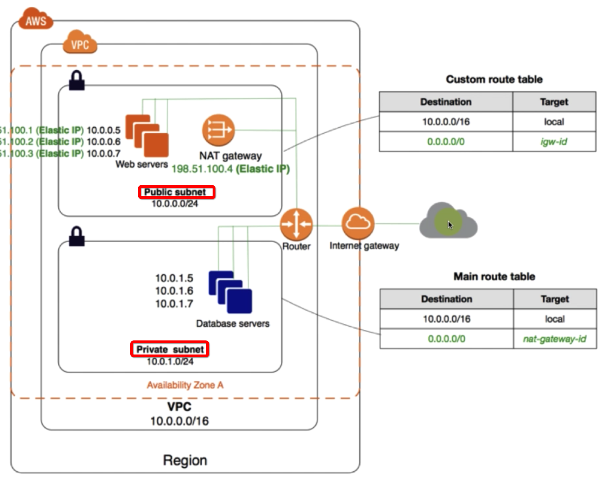


**网络 ACL - NACL**

- 在子网级别的无状态防火墙，用来控制子网进出的流量。
- **无状态**：对出站请求、入站返回都要明确允许。
- 支持添加允许和拒绝策略。

**安全组**

- 运行在实例级别；
- **有状态**：如果请求被允许，则响应流量一定会被允许；
- 只能添加允许规则，不能添加拒绝规则；
- 支持在规则中引用同一区域内的其他安全组；


**VPC 流日志**

- 作用：捕获传入传出 VPC 中网络接口的 IP 流量信息，例如流量拒绝日志、失败的节点等
- 可以为 VPC、子网、网络接口ENI 创建流日志；
- 可发布到 CloudWatch Logs 或 S3；


**堡垒机**

- 堡垒机是配置在公有子网的一台实例，ssh 堡垒机 --> ssh 私有子网实例；


### VPC Endpoints - 终端节点

作用：使您能够将 VPC 通过 AWS 的私有网络连接到支持的 AWS 服务，而不需要通过internet。

否则需要通过 Internet 网关经过 Internet 访问，无法保证安全和品质。

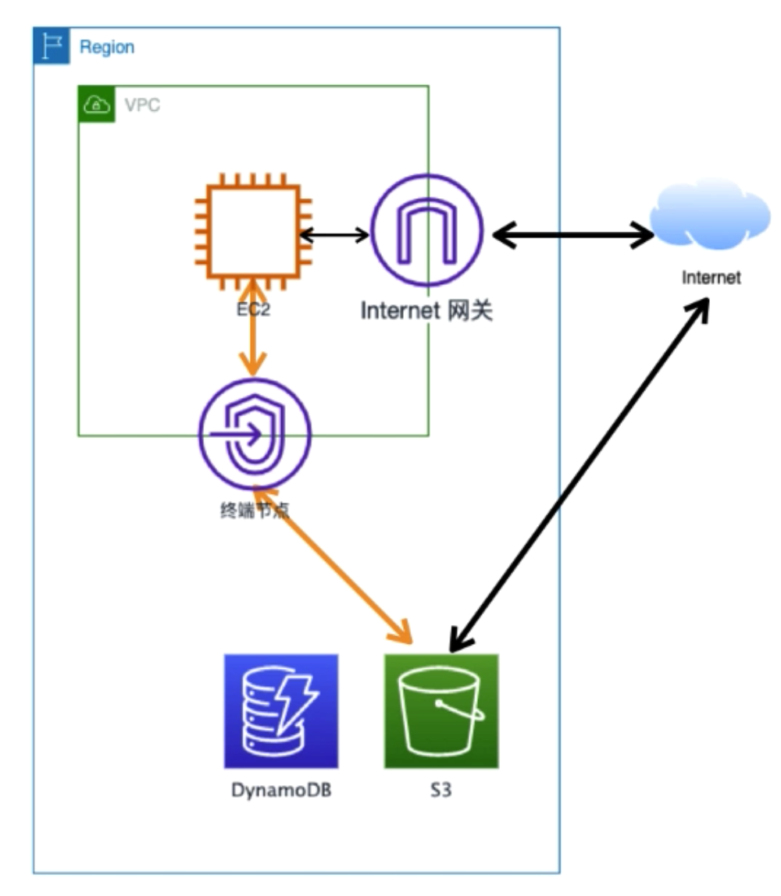


问题排查：

- 检查 DNS 解析配置
- 检查路由表


#### Gateway VPC Endpoints

- 网关终端节点只支持 S3 和 DynamoDB；必须为每个 VPC 创建一个网关。
- 需要更新**路由表**，创建到 AWS 服务的路由；
- 在 VPC 级别定义，VPC 要启用 **DNS 解析**。
- 无法扩展到 VPC 之外，例如 VPN连接、VPC对等连接、Transit Gateway、AWS Direct Connect、ClassicLink (?)

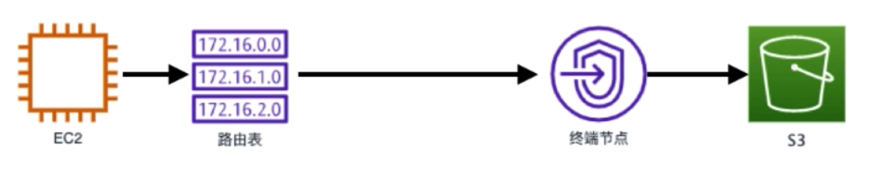


实践：

- 检查 EC2 配置：EC --> 

  - 描述：没有共有 IP 和公有 DNS
  - 子网 - 查看 --> 路由表：只有指向local的路由，没有指向网关或NAT网关/实例的路由 --> 所以无法访问 Internet，就无法访问 S3；
  - 登录该 EC2 （通过另一台可访问 Internet 的 EC2 作为跳板机） --> `aws s3 ls`，无法访问

- 创建 Endpoint：EC2 --> 终端节点 --> 创建

  - 服务类别：AWS 服务 | 按名称查找 | 您的 AWS Marketplace 服务

  - 服务名称：选择S3 - gateway

  - VPC：

  - 配置路由表：EC2 所在**子网的路由表**

    > 会在该路由表中增加一条规则：目的地为S3，目标为endpint id。

  - 策略：完全访问

- 测试 `aws s3 ls` 可正常访问


#### Interface VPC Interface 

接口终端节点支持更多的AWS服务。

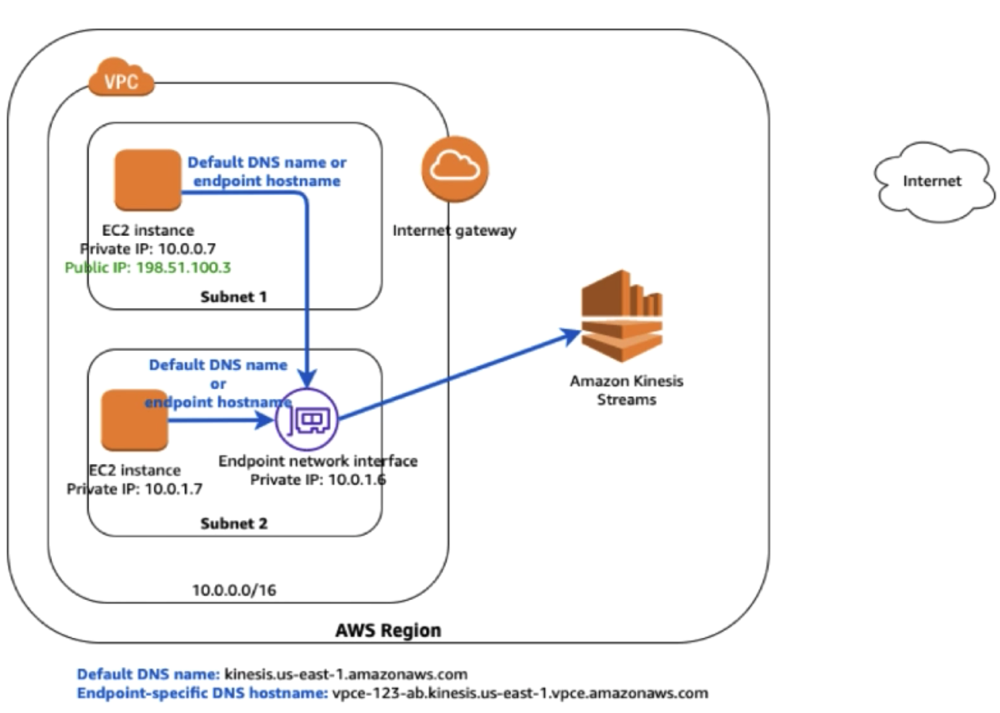

- 接口终端节点提供一个**弹性网络接口 ENI**，被分配一个所属子网的私有IP地址 10.0.1.6。

- 还会生成几个特定的终端节点 **DNS 名称**，可用这些DNS名称与AWS服务通信。

  > 如果勾选”启动私有DNS名称“，那么对应的公有DNS名称就不再解析成*aws服务的公有IP地址*，而是会解析成*接口终端节点的私有IP地址*。
  >
  > 如果未勾选呢？--> 则原来的公有DNS会失效？

- 需要指定与接口终端节点关联的安全组，控制从VPC中的资源发送到接口终端节点的通信。
- 本地数据中心可以通过AWS Direct Connect 或AWS站点到站点VPN访问接口终端节点。


实践：

- 创建 Endpoint：EC2 --> 终端节点 --> 创建
  - 服务类别：AWS 服务
  - 服务名称：选择 ec2 - interface
  - VPC：
  - 子网：选择 subnet2
  - 启用私有 DNS 名称
  - 安全组：控制从VPC中资源发往该终端节点网络接口的通信。
- 测试 
  - VPC --> 终端节点 
    --> 子网 - 找到**网络接口** --> 安全组规则：放行所有
    --> 详细信息 --> 查看分配的 **DNS 名称** 
  - 登录 EC2 --> 执行 `aws ec2 describe-instances`，正常返回；


#### 终端节点策略

控制只允许 `特定的IAM用户` 通过这个终端节点 访问 `特定的资源`，且只可 `指定特定的动作`。示例：

```json
{
  "Statement": [{
    "Action": ["sqs:SendMessage"], 
    "Effect": "Allow",
    "Resource": "arn:aws:sqs:us-east-xx:MyQueue",
    "Principal": {
      "AWS": "arn:aws:iam:123333:user/MyUser"
    }
  }]
}
```

- 不会覆盖或取代 IAM 用户策略、服务特定策略，只是多加一层控制、提供VPC终端节点级别的访问控制。


**S3 存储桶策略 - 只允许从特定终端节点、或特定VPC 访问存储桶**

- 允许特定终端节点 - `Condition: "aws:sourceVpce": "xxx"` 

  > 注意 aws:sourceIp 对终端节点无法生效，因为它只能限制公有IP访问。

  ```json
  {
    "Statement": [{
      "Principal": "*",
      "Action": ["s3:GetOject", "s3:PutObject", "s3:List*"], 
      "Effect": "Deny",
      "Resource": ["arn:aws:s3:::my_secure_bucket"],
      "Condition": {
        "StringNotEquals": {
          "aws:sourceVpce": "vpce-1234"
        }
      }
    }]
  }
  ```

  

- 允许特定VPC - `Condition: "aws:sourceVpc": "xxx"`

  ```json
  {
    "Statement": [{
      "Principal": "*",
      "Action": "s3:*", 
      "Effect": "Deny",
      "Resource": ["arn:aws:s3:::my_secure_bucket"],
      "Condition": {
        "StringNotEquals": {
          "aws:sourceVpc": "vpc-5678"
        }
      }
    }]
  }
  ```

  

**访问S3故障排查**

- 检查实例的**安全组**：出站规则要有允许相应的访问出站；
- 检查 VPC 终端节点上的**终端节点策略**：是否允许EC2访问S3
- 检查**路由表**：要有通过网关终端节点访问S3的规则
- 检查 VPC **DNS设置**：需要启用 DNS 解析；
- 检查 **S3 存储桶策略**
- 检查 **IAM 权限**：确认EC2附加的角色是否允许访问 S3；


### VPC 对等连接

作用：

- 连接两个 VPC，让两个 VPC 中的实例之间的通信就像在同一个网络中一样。流量一直处于 aws 内部网络，不会经过 Internet。

条件：

- 两个 VPC 不能有重叠的 CIDR 块；
- 不支持传递；
- 不支持边界到边界的路由：Site-to-Site VPN connection，aws Direct Connect，Internet Gateway，NAT 网关，网关终端节点；
- 支持 跨区域、跨账户；
- 安全组配置：如果是同一区域，则可引用另一端对等 VPC 中的安全组，作为规则中的入向源或出向目标；


### VPC Site-to-Site VPN

VPN 虚拟专用网络

- 在公有网络上建立专有网络，加密通讯。
- 例如将公司数据中心 与 AWS VPC 建立链接，并通过私有IP加密通信。

配置

- 本地数据中心
  - 配置`软件或硬件VPN设备`，要求VPN外部接口需要有一个可在Internet路由/访问的IP地址。
- AWS端
  - 创建一个`虚拟专用网关（VGW）`，相当于在aws侧的VPN集线器；然后附加到 VPC。
  - 创建一个`客户网关`，表示本地本地数据中心的VPN设备；配置指定本地数据中心VPN设备公有IP。
  - 创建两条 VPN 隧道，提供冗余能力。

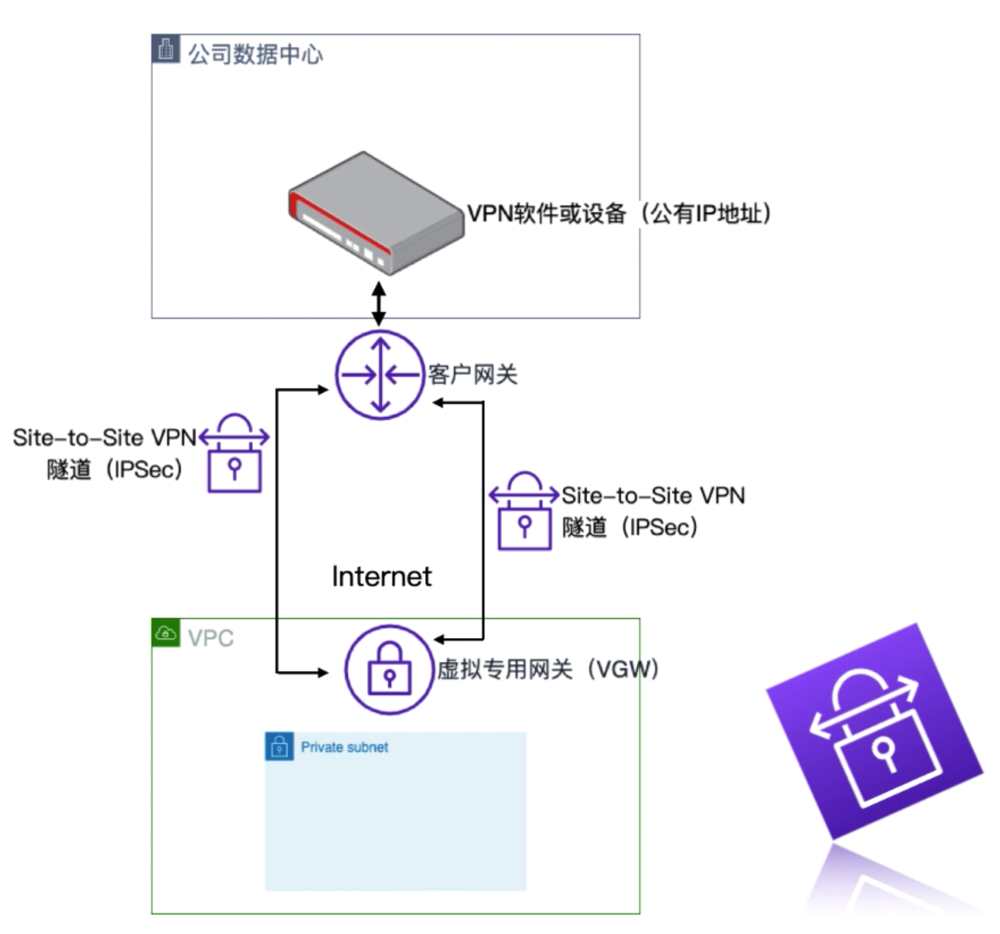

- 配置路由表
  - 配置静态路由
    - 本地数据中心：将去往VPC私有网络 10.0.0.10/24的通信指向`客户网关`；
    - AWS：将去往本地数据中心10.2.0.0/20的通信指向`虚拟专用网关VGW`；
  - 或配置动态路由 BGP - 允许网络之间自动交换彼此的网络路由信息
    - 在客户网关、虚拟专用网关配置 ASN；
    - 好处：无需手动配置路由表，BGP 自动更新；


例题：VPN 与 Internet 访问

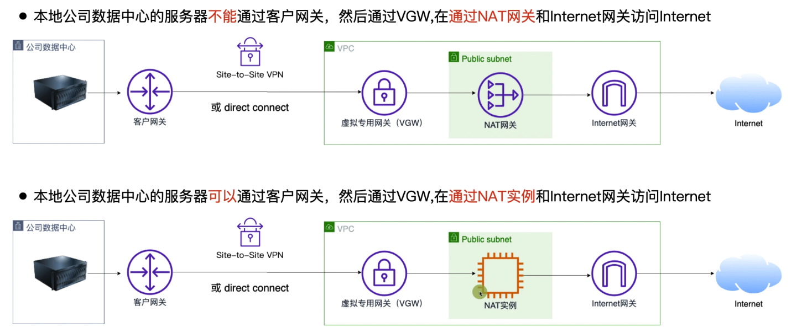

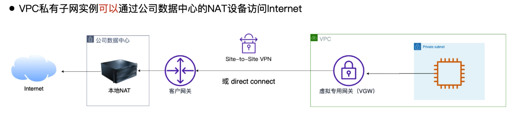


**VPN CloudHub**

将多个 Site-to-Site VPN `客户网关`连接到一起。星型拓扑连接模型：可连接多个 本地数据中心。


# | Migration Planning


# | Cost Control


# | Continuous Improvement for Existing Solutions


