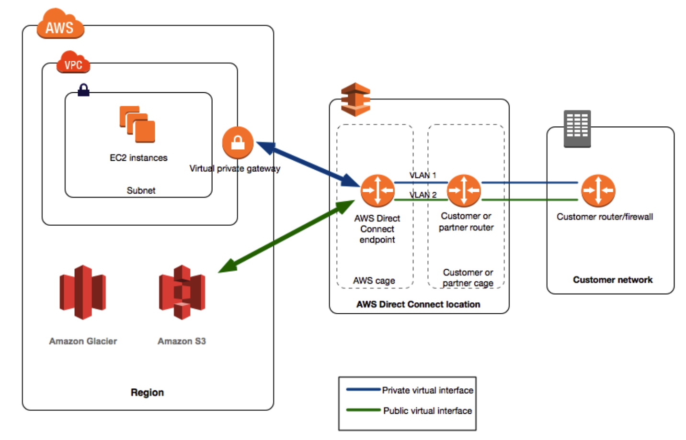

[toc]

# 1. 计算 - Compute

## || 安全组

在每一个EC2实例创建的过程中，你都会被要求为其指定一个**安全组（Security Group）**。这个安全组充当了主机的**虚拟防火墙**作用，能根据协议、端口、源IP地址来过滤EC2实例的入向和出向流量。

特性：

- 默认情况下，所有**入方向**的流量都会被**拒绝**；Allow no inbound traffic
- 默认情况下，所有**出方向**的流量都会被**允许**；Allow all outbound traffic
- 在安全组内**只能设置允许的条目**，不能设置拒绝的条目。
- 一个流量只要被安全组的任何一条规则匹配，那么这个流量就会被允许放行
- 安全组是有状态的
  - 如果某个流量被入方向的规则放行，那么无论它的出站规则如何，它的出方向**响应流量**都会被无条件放行
  - 如果从主机发出去的出站请求，无论入站规则如何，该请求的**响应流量**都会被无条件放行


## || EC2

EC2 获取元数据：

http://169.254.169.254/latest/meta-data 


### AMI 

AMI - Amazon Machine Image，包含启动实例所需的信息：

- 模板：操作系统、应用程序、应用程序相关配置；
- 实例启动时附加到实例卷的信息；


**Bootstrap 开机脚本**

- 创建 EC2 -> 配置实例详细信息 -> 高级详细信息 -> 用户数据

- 例如如下脚本：更新补丁、开启http服务

  ```bash
  #!/bin/bash
  yum update -y
  yum install httpd -y
  service httpd start
  chkconfig httpd on
  echo "Hello aws.xiaopeiqing.com" > /var/www/html/index.html
  ```

查看用户数据：http://169.254.169.254/latest/user-data 


### CloudWatch

- 面板（Dashboards）-可创建自定义面板来方便观察你AWS环境中的不同监控对象；
- 告警（Alarms）- 当某个监控对象超过阈值时，会给你发出告警信息；
- 事件（Events）- 针对AWS环境中所发生的变化进行的反应；
- 日志（Logs）-Cloudwatch日志帮助你收集、监控和存储日志信息；


### Auto Scaling

垂直扩展 vs. 水平扩展

- Sacle Up
- Sacle Out


Auto Scaling 配置

- **配置模板** 

  - 自动启动的 EC2 实例模板：可指定AMI、实例类型、安全组、角色；

  - 可选择使用 `启动模板` 或者 `启动配置 Launch Configuration`；

    > 推荐用启动模板，因为功能更多。

- **ASG**

  - Auto Scaling Group 是 EC2 实例集合，将实例当作一个逻辑单位进行扩展和管理；

  - 可配置组中的最小最大实例数、在哪个可用区/子网启动实例、ASG是否附加负载均衡器、监控状况检查等；

    > 会在可用区间均匀启动实例。

  - ASG 只能在一个 Zone内运行，不能跨 Zone。

- **扩展选项**

  配置ASG中实例数量的伸缩规则，共 5 种：

  1. **始终保持当前实例数量** --> 如实例不健康，则会被终止并启动新实例
  2. **手动扩展**
  3. **按计划扩展** --> 按时间
  4. **按照需求扩展**（动态扩展）--> 与 CloudWatch Alert 关联；
  5. **预测式扩展** (?)


> **实践**
>
> - EC2 --> 启动配置：指定实例类型、AMI、安全组、user data （自动执行某些命令）；
>
> - EC2 --> Auto Scaling Group --> 最小容量：1
>
>   - `实例` 选项卡：当前ec2实例列表；--> 尝试终止一台；
>
>   - `活动历史记录` 选项卡：启动、终止实例的记录；
>
>   - `扩展策略` 选项卡：伸缩规则；
>
>   - `计划的操作` 选项卡：按计划扩展


- 预热时间 Health Check Grace Period，默认300秒
- 冷却时间，默认300秒


### Placement Groups

作用：逻辑性地把一些实例放置在一个组里面，以便组内实例能享受低延迟、高网络吞吐的网络；决定实例启动在哪个底层硬件上、哪个机柜上。例如：

- 放置在同一可用区，以实现实例之间的低延迟、高吞吐；
- 分散放置在不同底层硬件和机柜，减少故障；


三种放置策略：


**1. 集群置放群组 - Cluster Placement Group**

- 将实例尽量放置在一起；在**同一个 AZ 可用区**；
- <u>适用于低延迟、高吞吐场景；</u>

> 建议：
>
> 1. 一次性启动所需实例数，不要临时添加；
> 2. 置放群组中的实例类型要一样


> 实践：
>
> - EC2 --> 网络与安全 --> 置放群组 --> 新建
> - EC2 --> 启动实例 --> step3 ”配置实例“ - 选择置放群组


**2. 分区置放群组 - Partition Placement Group**

- 将实例分布在不同的”逻辑分区“；每个分区分配一个机柜，<u>不同分区属于不同机柜</u>；
- 可在**同一区域**下的多个可用区，每个可用区可有最多7个分区。
- <u>适用于大型分布式，和重复的工作负载，例如Hadoop Cassandra Kafka；</u>


**3. 分布置放群组 - Spread Placement Group**

- 将实例放置在<u>不同机柜</u>；可以跨越**同一区域**中的多个可用区。

> Q: 和分区置放群组的区别？
>
> A: Partition只能在同一个AZ，Spread可跨多个AZ。


**Capacity Error** ?

- 在**同一时间**启动组内所有EC2实例，这样可以减少出现“capacity error”错误的概率。
- 如出现，可以停止再启动组中的所有实例，再重新创建刚才的实例。


### EC2 状态检查、自动恢复

状态检查是内置到 Amazon EC2 中的，所以不能禁用或删除。状态检查每分钟进行一次，会返回一个通过或失败状态。如果所有的检查都通过，则实例的整体状态是OK，如果有一个或多个检查故障，则整体状态为受损。

可分为两类：

- **系统状态检查**
  - 网络连接丢失、系统电源损耗、硬件问题  
  - 需要 aws 参与修复的深层实例问题
- **实例状态检查**
  - 内存耗尽、内核不兼容、网络或启动配置不正确
  - 需要用户自行解决；


**实践：状态检查、自动恢复**

- EC2 --> `状态检查` 选项卡 --> 查看 系统状态检查、实例状态检查的结果；

  - 配置自动恢复：点击创建状态检查警报 --> 执行操作 == `恢复此实例` --> 在 CloudWatch 中查看警报

    > 恢复此实例：会在另一个物理机上启动；
    > 重启此实例：不会切换物理机；

  - 测试：手工触发状态检查警报 --> cloudwatch控制台中的状态切换 `确定` --> `警报中`

    ````
    aws cloudwatch set-alarm-state \
    --alarm-name "..." \
    --state-value ALARM \
    --state-reason "..." \
    --region ap-northeast-1
    ````

    

- EC2 --> `监控` 选项卡 --> 查看状态检查失败的次数；


## || Lambda

使用**AWS Lambda**，无需配置和管理任何服务器和应用程序就能运行你的代码。只需要上传代码，Lambda就会处理运行并且根据需要自动进行横向扩展。

**场景**

- **上传照片到S3**，触发Lambda进行转码处理，存储到另一个存储桶。
- **HTTP 网页请求**，静态内容S3，动态内容 Lambda处理。


**Lambda 触发器**

- **API Gateway**
- **AWS IoT**
- **CloudWatch Events**
- CloudWatch Logs
- CodeCommit
- DynamoDB
- S3
- SNS
- Cognito Sync Trigger


**Lambda 原理**


- **Worker Manager**：作业调度
- **Woker / Sandbox**：计算资源
  - 
  - FireCracker: 超轻量级虚机
  - 冷启动问题：启动耗时，


**同步、异步调用**

- 同步调用函数，Lambda结束是返回结果；默认行为。
- 异步调用函数，Lambda将事件发送到队列，执行失败自动重试两次，进入死信队列。


> 实战：使用 Lambda 定时关闭和启动EC2实例
>
> https://iteablue.com/course/aws-certified-solutions-architect-associate/lessons/how-to-stop-and-start-ec2-using-lambda 
>
> - Lambda --> 创建函数 
>
>   - 函数名称
>
>   - 运行时：Python 3.7
>
>   - 权限：创建策略，因为默认权限比较小，而启停EC2需要更高权限。
>
>     ```json
>     // Policy
>     {
>       "Version": "2012-10-17",
>       "Statement": [
>         {
>           "Effect": "Allow",
>           "Action": [
>             "logs:CreateLogGroup",
>             "logs:CreateLogStream",
>             "logs:PutLogEvents"
>           ],
>           "Resource": "arn:aws:logs:*:*:*"
>         },
>         {
>           "Effect": "Allow",
>           "Action": [
>             "ec2:Start*",
>             "ec2:Stop*"
>           ],
>           "Resource": "*"
>         }
>       ]
>     }
>     ```
>
> - --> 进入 IDE 页面，
>
>   - 编写py脚本
>   - 环境变量设置
>   - 基本设置：超时时间、内存
>
> - 配置测试事件 --> 测试 （相当于手工触发 lambda）
>
> - 基于CloudWatch配置定时任务：事件 --> 规则 --> 创建规则
>
>   - 事件源：事件模式 | 计划
>   - 目标：选择 lambda


## || Batch

- 利用 Spot 实例（竞价实例），降低费用。
- 场景
  - 文件 --> S3 --> Batch 配置资源调度数据分析作业 --> 大数据工具预测下一个交易日 --> 存储结果


## || Lightsail

- 是入门级云计算 VPS 
- 价格低廉
- 场景
  - 简单web应用
  - 预配置应用程序、自定义博客、个人网站
  - 商业软件
  - 开发测试环境


## || API Gateway

API Gateway是一个托管的Rest API服务

- API Gateway可以缓存内容，从而更快地将一些常用内容发送给用户
- API Gateway是一种低成本的**无服务（serverless）方案**，而且它可以自动弹性伸缩（类似ELB，NAT网关）
- 可以对API Gateway进行节流，以防止恶意攻击
- 可以将API Gateway的日志放到CloudWatch中
- 如果你使用JavaScript/AJAX来跨域访问资源，那么你需要保证在API Gateway上已经开启了**CORS (Cross-Origin Resource Sharing)**功能


# 2. 存储 - Storage

## || S3

**特点**

- 对象存储，而不是块存储；

  - 对象存储：key --> Object
  - 块存储：硬盘，数据块，索引
  - 文件存储：文件系统，根，目录，层次结构

  > 对象参数包括：
  >
  > - Key
  > - Value
  > - Version Id
  > - Metadata
  > - 访问控制信息

- 文件存储在 **Bucket** 内，bucket相当于文件夹；

- 创建在某个 **Region**，但不可指定 AZ；

- 版本控制：可恢复文件到之前版本；

- 生命周期管理：自动转换存储类型；

- 安全性：支持加密、ACL、Bucket Policy；

- 高可用：3 az，11-9 持久性，4-9可用性；


**数据一致性模型**

- 新对象：写后读一致性，Read after Write Consistency

  > 返回200之前，先同步到aws的多个物理位置。

- 修改\删除：最终一致性，Eventual Consistency

  > 异步同步


**S3 存储类型 & 生命周期**

- Standard

- Reduced Redundancy

  > 持久性最低，用于存储可再生数据。不推荐使用。

- Standard - IA (Infrequently Accessed)

  > 用于存储不常访问的数据，跨区存储。
  >
  > 存储价格比 Standard 低，但读取更贵。

- Onezone - IA

  > 类似 Standard IA，但只保存到一个可用区

- Glacier

  > 仅做归档


> **实践：创建存储桶**
>
> - 名称：唯一性
> - 区域：必须且只能选择一个
> - 版本控制：选择是否开启，开启后费用更高
>   - 属性 --> 版本控制 --> 启用
>   - 文件名 右侧下拉框 --> 切换版本；或列表 --> 版本：显示
>
> 
>
> **实践：跨区域同步**
>
> （作用：高可用、用户距离）
>
> - 管理选项卡 --> 复制 --> 添加规则
>   - 源：整个桶，或桶内部分对象；
>   - 目标：选择目标桶，必须开启版本控制；
>   - 权限：IAM 角色、并赋予权限；
> - 在源上上传文件，会自动同步到目标。
> - 在源上删除文件某个版本，不会同步到目标。
> - 在源上删除文件所有版本，会同步到目标。
>
> 
>
> **实践：生命周期管理**
>
> - 管理选项卡 --> 生命周期 --> 添加规则
>   - 范围
>   - 转换规则：转到`标准IA` `一区IA` `Glacier`
>   - 过期：多久后被永久删除
>
> 
>
> **实践：传输加速**
>
> - 原理：将数据上传到离我们最近的**边缘节点**，然后再通过AWS内部网络（更高速，更稳定）传输到对应区域的 S3 存储桶。
> - 属性 --> 高级设置 --> 转移加速度 --> 启用


**S3 安全**

- 基于资源的访问控制：Object ACL, bucket policy, bucket ACL
- 基于用户的访问控制：IAM policy


**S3 数据保护**

- Versioning 防止误删

- 删除时可要求 MFA 验证

- 加密：

  - 传输过程中加密：SSL/TLS

  - 静态加密

    - 服务端加密（SSE, Server Side Encryption）


    > **SSE-S3**: S3 托管密钥
    >
    > **SSE-KMS**: KMS 托管密钥
    >
    > **SSE-C**: 服务端加密与客户提供的密钥一起使用
    
    - 客户端加密（CSE, Client Side Encryption）


**跨区复制**

- 要开启Versioning
- 根据桶、prefix、tag复制
- 只复制生效后的对象
- 源桶删除对象，目标桶不会自动删除


## || Glacier

特点：

- 数据归档、长期存储：90天/180天起
- 超低价格、取回收费
- 高可用：至少3 az，11-9持久性，4-9可用性
- 取回时间：3-5 小时 ~ 12 - 48 小时


## || EBS & 实例存储

**Elastic Block Store 弹性块存储**

- 与EC2配合使用：EBS卷可以依附到 **同一个可用区（AZ）**内的任何EC2实例上；
- 可加密；
- 可备份 - 通过**快照（Snapshot）**来进行**增量**备份，快照会保存在 **S3 **上；
  - 

- 可基于快照创建 EBS；


EBS 卷类型

- `gp2` 通用型SSD（General Purpose SSD）
- `io1` 预配置IOPS SSD（Provisioned IOPS SSD）
- `st1` 吞吐量优化型HDD（Throughput Optimized HDD）
- `sc1` Cold HDD
- Magnetic

如何选择卷类型


**Instance Store Volumes 实例存储**

- 用于短暂存储，又叫 Ephemeral Storage 
- EC2 实例终止 --> 实例存储消失；重启 --> 不影响


## || EFS

Elastic File System 可以简单地理解为是 "共享盘" 或 "NAS存储"；可以在多个EC2实例上使用同样的一个EFS文件系统，以达到共享通用数据的目的。

特点：

- 支持Network File System version 4 (NFSv4)协议
- EFS是 **Block Base Storage**，而不是Object Base Storage（例如S3）
- 使用EFS，你只需要为你使用的存储空间付费，没有预支费用（区别EBS?）
- 可以有高达PB级别的存储
- 同一时间能支持上千个NFS连接
- 高可用：EFS的数据会存储在一个AWS区域的**多个可用区**内
- Read After Write Consistency


> 实践：创建EFS
>
> 1. Config file system access: 选择 VPC --> 选择相应子网、安全组
> 2. Config optional settings：设置 Tags，选择性能模式
>
> 实践：挂载 EC2
>
> - EFS --> 找到 EC2 Mount Instructions，拷贝挂载命令
>
> - CLI 登录 EC2，执行命令
>
>   ```
>   mkdir efs
>   mount mount -t nfs4 -o ... efs
>                       
>   # 此时在一个 EC2实例 efs目录下创建文件，其他实例也可看到。
>   ```
>


vs. **EBS**

- EBS 块存储 vs. 文件存储
- EC2 单机使用 vs. 多机共享
- 单 AZ，自行快照 vs. 多AZ，托管服务
- 4 种 EBS vs. 3种instance storage选择


vs. **FSx for Windows File Server**

- 协议：FSx 支持 SMB，EFS 支持NFS
- 系统：FSx 支持win,linux,mac；EFS 只支持Linux
- 多可用区：EFS 只能多可用区部署；FSx 可选
- FSx 支持 MS AD 域用户


## || Storage Gateway

作用：混合云存储服务，将 **本地软件设备** 与 **云存储** 相连接。


**架构**


**三种网关类型**

- **File Gateway**
  - 基于**文件系统**，通过 NFS 连接直接访问存储在 S3 / Glacier上的文件，并且本地进行缓存

- **Volume Gateway**
  - 将本地的**块存储**备份到云上
    - **Stored Volumes**：所有的数据都将保存到本地，但是会**异步地**将数据备份到AWS S3上 --> 异地容灾；
    - **Cached Volumes**：所有的数据都会保存到S3，但是会将最经常访问的数据**缓存**到本地

- **Tape Gateway**
  - 用来取代传统的磁带备份，使用NetBackup，Backup Exec或Veeam 等备份软件将文件备份到 S3 / Glacier 


> 实践：创建 Storage Gateway
>
> - 选择网络类型
> - 选择主机平台：VMware, Linux KVM, EC2
>   - EC2 创建、连接到网关选择 ec2 ip
> - 配置本地磁盘
> - 配置日志记录
> - 创建文件共享
>   - 配置S3存储桶
>   - Mount 到本地


# 3. 数据库 - Database

## || RDS

Amazon RDS支持的关系数据库有：

- SQL Server
- Oracle
- MySQL Server
- PostgreSQL
- Aurora
- MariaDB


**Multi-AZ 多可用区部署**

- 目的：把AWS RDS数据库部署在多个**可用区（AZ）**内，以提供高可用性和故障转移支持。
- 原理：在不同的可用区内配置和维护一个主数据库和一个备用数据库，主数据库的数据会自动复制到备用数据库中。--> **同步!**
- 注意：Multi-AZ 只是用来解决灾备的问题，并不能解决读取性能的问题；要提升数据库读取性能，我们需要用到Read Replicas。


**Read Replicas 只读副本**

将应用程序的数据库读取功能转移到Read Replicas上，来减轻源数据库的负载。对于有大量读取需求的数据库，我们可以使用这种方式来进行灵活的数据库扩展，同时突破单个数据库实例的性能限制。

特点：

- Read Replicas是用来提高读取性能的，不是用来做灾备的
- 要创建Read Replicas需要源RDS实例开启了自动备份的功能
- 可以为数据库创建最多**5个**Read Replicas （每个AZ 5个，一共 3 * 5）
- 可以为Read Replicas创建Read Replicas
- 每一个Read Replicas都有自己的URL Endpoint --> 可利用Router53对应用屏蔽多endpoint.
- 可以为一个启用了 Multi-AZ 的数据库创建Read Replicas
- Read Replicas可以提升成为独立的数据库
- 可以创建位于另一个区域（Region）的Read Replicas


**多可用区部署 vs. 只读副本**

|              | 多可用区部署                           | 只读副本                         |
| ------------ | -------------------------------------- | -------------------------------- |
| **复制方式** | 同步复制 --> 为了高持久性              | 异步复制 --> 为了高扩展性        |
| **访问方式** | 只有主实例处于活跃状态                 | 所有只读副本均可访问             |
| **备份方式** | 从备用实例自动备份                     | 默认无备份                       |
| **可用区**   | 始终跨越一个区域中的两个可用区         | 可以在同一可用区，也可以跨可用区 |
| **升级**     | 数据库引擎版本升级发生在主实例         | 数据库引擎版本升级独立于源实例   |
| **故障转移** | 检测到问题后自动执行故障转移至备用实例 | 可手动提升到独立的数据库实例     |


**多可用区部署 + 只读副本整合部署**


> 实践：创建 RDS
>
> - 选择引擎：Aurora / MySQL、版本、实例类型、存储空间
> - 高级配置：VPC、子网组、安全组、端口 3306、备份窗口、监控、日志
>
> 创建 EC2，连接到RDS
>
> - 子网：public
> - 高级详细信息 - 用户数据：脚本启动 httpd服务、连接 rds
> - RDS 安全组 - 添加规则：类型= MySQL，**来源=EC2安全组**；（建议选择安全组，而不是ip）


## || Aurora

Amazon Aurora是一种兼容MySQL和PostgreSQL的商用级别关系数据库，速度可以达到MySQL数据库的**5倍**

特点：

- 10GB的起始存储空间，可以增加到最大64TB的容量
- 计算资源可以提升到最多32vCPU和244GB的内存
- Aurora会将你的数据**复制2份**到每一个可用区内，并且**复制到最少3个可用区**，因此你会有**6份数据库备份**
- 2份及以下的数据备份丢失，不影响Aurora的写入功能
- 3份及以下的数据备份丢失，不影响Aurora的读取功能
- Aurora有自动修复的功能，AWS会自动检查磁盘错误和数据块问题并且自动进行修复
- 有两种数据库只读副本
  - Aurora Replicas（最多支持15个）
  - MySQL Replica（最多支持5个）
  - 两者的区别是Aurora主数据库出现故障的时候，Aurora Replicas可以自动变成主数据库，而MySQL Replica不可以


**为什么 Aurora 比 MySQL 快？**


## || DynamoDB

NoSQL 非关系数据库方案；


**组件**


- 表、表项、属性
- Partition Key、Sort Key (相当于索引)


**特点：**

- 使用 SSD 存储

- 数据分散在3个不同地理位置的数据中心（并不是3个可用区）

- **最终一致性读取**（Eventual Consistent Reads）
  - 默认的设置，即如果写入数据到DynamoDB之后马上读取该数据，可能会读取到旧的信息
  - DynamoDB需要时间（一秒内）把写入的数据同步到3个不同地理位置的数据中心

- **强一致性读取**（Strongly Consistent Reads）
  - 在写入数据到DynamoDB之后马上读取该数据，会等所有写入操作以及数据同步全部完成后再回馈结果
  - 即强一致性读取一定会读到最新的数据结果

- 如果我们需要增加DynamoDB的规格，我们可以直接在AWS管理控制台上进行更改，并且**不会有任何系统downtime**

- 除非您指定其他读取方式，否则 DynamoDB 将使用最终一致性读取。读取操作 (例如 GetItem，Query 和 Scan) 提供了一个 **ConsistentRead** 参数。如果您将此参数设置为 true，DynamoDB 将在操作过程中使用强一致性读取。

  


> 实践：创建表
>
> - 名称
> - 主键：名称、字符串/数字/二进制
> - 表设置：二级索引、表容量、auto scaling
>
> 添加条目 --> 项目 选项卡
>
> - 创建项目：输入键 --> append：选择类型、值 （每个项目可以有不同的属性！）


**高级功能**

- 事务性

  - TransactWriteItems

  - TransactGetItems

- 预配置容量

  - RCU：读取容量单位
  - WCU：写入容量单位
  - Auto Scaling: 当 RCU/WCU 得到阈值时

- 二级索引

  - **LSI**：Local Secondary Index
    - 额外的sort key属性，不修改原有的partition key
    - 每个表最多 5 个 LSI
  - **GSI**：Global Secondary Index
    - 额外的 partition key / sort key，
    - 全局可用，复合索引
    - 每个表最多20个GSI，每个RCU、WCU单独收费

- TTL
  - 根据失效时间戳自动删除数据项
- DynamoDB Streams
  - 将变化日志按时间顺序分隔好，提供更新、插入、删除的数据流
- Global Tables
  - 多地区容灾


## || Redshift

OLAP常用的流行工具是**AWS Redshift**, Greenplum, Hive等。

**特点：**

- **单节点**（160Gb）部署模式
- **多节点**部署模式
  - **领导节点**：管理连接和接收请求
  - **计算节点**：存储数据，执行请求和计算任务，最多可以有128个计算节点
- **Columnar Data Storage** 列式存储
- Advanced Compression
  - 同类数据压缩
  - 压缩方式：连续值、差值、字典

- 目前Redshift只能部署在**一个可用区**内，不能跨可用区或者用类似RDS的高可用配置
  - Redshift是用来产生报告和做商业分析的，并不需要像生产环境一样对可用性有高保证
- 我们可以对Redshift做快照，并且在需要的时候恢复这个快照到另一个可用区


**MPP: Massively Parallel Processing** 

- 大规模平行处理
- 管理节点：
  - SQL连接、存储元数据、协调SQL并行处理
- 计算节点：
  - 本地的列式存储、平行执行查询、备份恢复


## || Elasticache

支持 Memcached 和 Redis。


## || 其他

**Neptune**

- 作用：图形数据库服务
- 场景：建议引擎、欺诈检测、知识图谱
- 特点
  - 可存储十亿个关系、毫秒级查询
  - 高可用：只读副本、时间点恢复、S3持续备份、跨可用区复制
  - 加密：HTTPS 加密客户端连接、静态加密


**DocumentDB**

- 类似 DynamoDB，但是 JSON 结构
- 与 MongoDB兼容


**Quantum Ledger Database**

- 不可更改性


**Timestream**

- 时间序列数据库 
- 适用于 IoT


# 4. 网络 - Networking

AWS 网络整体架构


## || VPC

Virtual Private Cloud 是一个用来隔离你的网络与其他客户网络的虚拟网络服务。在一个VPC里面，用户的数据会逻辑上地与其他AWS租户分离，用以保障数据安全。

可以简单地理解为一个 VPC 就是一个**虚拟的数据中心**，在这个虚拟数据中心内我们可以创建不同的子网（公有网络和私有网络）


**VPC** 

- VPC 是aws账户的虚拟网络。在逻辑上与aws中其他虚拟网络隔离。
- 允许的 CIDR 介于 `/16` ~ `/28` 之间 （IP地址个数 65535 ~ 28）

**CIDR**: 

- Classless Inter-Domain Routing，创建VPC时必须指定 IPv4 CIDR 块。

**私有IP**: 

- *10.0.0.0/8* (10.0.0.0~10.255.255.255) - 大型网络 
- *172.16.0.0/12* (172.16.0.0~172.31.255.255) - AWS 默认
- *192.168.0.0/16* (192.168.0.0~192.168.255.255) - 家庭网络

**VPC IPv6**

- 如何支持：创建一个 IPv6 CIDR块与该 VPC 关联，并将互联网网关附加到 VPC；
- 公有子网
  - 在公有子网启动一台EC2，并分配一个 IPv6 地址；
  - 添加路由表条目，去往 `::/0` 的流量发送到 IGW 互联网网关
- 私有子网
  - 在公有子网创建“仅出口互联网网关”；
  - 添加路由表条目，去往 `::/0` 的IPv6流量发送到“仅出口互联网网关”；


**VPC 流日志**

- 作用：捕获传入传出 VPC 中网络接口的 IP 流量信息，例如流量拒绝日志、失败的节点等
- 可以为 VPC、子网、网络接口ENI 创建流日志；
- 可发布到 CloudWatch Logs 或 S3；


**堡垒机**

- 堡垒机是配置在公有子网的一台实例，ssh 堡垒机 --> ssh 私有子网实例；


**VPC 特点**

- 创建一个**Internet Gateway**并且绑定到VPC上，让EC2实例可以访问互联网

- VPC对你的AWS资源有更安全的保护

  - 部署针对实例的**安全组**（Security Group）

  - 部署针对子网的**网络控制列表**（Network Access Control List）

    > `安全组（Security Group）`是有状态的：如果入向流量被允许，则出向的响应流量会被自动允许；
    >
    > `网络控制列表（Network Access Control List）`是无状态的：入向规则和出向规则需要分别单独配置，互不影响

- VPC可以通过**Virtual Private Gateway** (VGW) 来与企业本地的数据中心相连

- VPC可以通过AWS PrivateLink访问其他AWS账户托管的服务（VPC终端节点服务）


> 实践：创建 VPC
>
> - 名称
> - IPv4 CIDR 块：10.0.0.0/16
> - 路由表：自动创建
> - 网络ACL：自动创建，允许所有出站入站
>
> 
>
> 实践：创建子网 *2， private / public
>
> - 名称
> - VPC
> - VPC CIDR：自动选择
> - 可用区：
> - IPv4 CIDR: 10.0.1.0/24 
>
>   /24 地址实际可用251个地址，另外5个被预留。
>
> 
>
> 实践：创建路由表 （默认路由表没有访问 Internet 的权限）
>
> - 名称
> - VPC
> - 创建 **Internet 网关**（IGW）
>   - 操作 --> 附加到 VPC (注意是一对一关系)
> - 路由 --> 添加 
>   - 目标：0.0.0.0/0 --> 代表默认路由
>   - 目标：选择 IGW
> - 子网关联 --> 
>   - 如果子网不明确与任何路由表关联，则与主路由表关联，不能访问外网。
> - 创建EC2，分别位于 public 子网、private 子网
>   - pubilc ec2 可以访问外网
>   - public ec2 可以访问 private server
>   - 
>
>
> 
>
> 查看VPC
>
> - 路由表
> - 网络ACL


### Subnet

- VPC内可以创建**多个子网**；
- 一个 VPC 可以跨越多个可用区，但是**一个子网只能在一个可用区内**
- 可以在选择的子网上启动EC2实例，每个子网内启动的实例，都会被分配一个私有 IP。
- 在每一个子网上分配自己规划的IP地址
- 每一个子网配置自己的**路由表**
- VPC的**子网掩码范围是从`/16`到`/28`**，不能设置在这个范围外的子网掩码


分类

- **公有子网**

  - 它有一条特殊的路由：将`0.0.0.0/0`的流量发送到 Internet 网关。即实例能访问互联网。

  - 公有子网的实例要具有全局唯一 IP 地址：公有IPv4地址、弹性IP、或 IPv6 地址。


- **私有子网**

  - 私有子网通过 **NAT 实例**或 **NAT 网关**访问 Internet。

  - 而 NAT 实例或 NAT 网关需要配置到公有子网中。

  - 需要添加路由：将 `0.0.0.0/0`路由到 NAT 实例或网关。

- **VPN-only 子网**：连接到 Virtual Private Gateway


默认子网

- 默认子网下的实例，有一个 public ip, 一个 private ip.


### 路由表

**路由表**

- 用于决定子网或网关的网络流量的流向何处。
- 分为主路由表、自定义路由表，与子网进行关联。
- 最长前缀匹配原则：优先使用与流量匹配的最具体的路由条目来路由流量。


### IGW

**Internet 网关 (IGW)**

- 用于***将 VPC 接入 Internet***。
- 横向扩展、冗余、高可用。
- 为已分配公有 IPv4 或 IPv6 的实例执行**网络地址转换 (NAT)**。

### NACL、安全组

网络访问控制列表（NACL）与安全组（Security Group）类似，它能在**子网**的层面控制所有入站和出站的流量，为VPC提供更加安全的保障。

- 一个子网只能关联一个NACL：`N : 1`
- 支持添加允许和拒绝策略。
- Vs. 安全组：
  - NACL **无状态**，对出站请求、入站返回都要明确允许；安全组有状态
  - NACL **针对子网**，安全组针对EC2实例


> 实践：创建 NACL
>
> - VPC --> 安全性 --> 网络ACL
>   默认VPC 会有一个默认 NACL：入站出站允许所有流量
> - 入站规则：按ID从小到大匹配
> - 出站规则：无状态！出站需要单独配置 
>   - 添加：端口号 1024 ~ 65535 (所有临时端口范围)


**安全组**

- 运行在实例级别；
- **有状态**：如果请求被允许，则响应流量一定会被允许；
- 只能添加允许规则，**不能添加拒绝规则**；
- 支持在规则中引用同一区域内的其他安全组；


### NAT网关、NAT实例

**Network Address Translation，网络地址转换**，它可以让整个机构只使用一个公有的IP地址出现在Internet上。

NAT 是一种把内部私有地址（192.168.1.x，10.x.x.x等）转换为Internet公有地址的协议，它一定程度上解决了公网地址不足的问题。可用于让 EC2 访问 Internet.


**NAT 实例**

- 用 EC2 实例来承担 NAT，需要部署在公有子网的一台实例。
- 作用：让私有子网中的实例通过 NAT 实例访问 Internet、但阻止接收Internet 入站流量。
- 私有子网实例 --> NAT 实例 --> VPC Internet 网关
- 并非高可用！带宽受限！NAT 实例很容易成为瓶颈、需要维护补丁。已过时。


> 实践：创建 NAT 实例
>
> - 创建 EC2，置于 公有子网
>   - 注意要**关闭源/目标检查（Source/Destination Check）**
> - 在私有子网配置默认路由表，添加路由
>   - 0.0.0.0/0，目标地址：EC2
>   - 这样，private 子网下实例访问 internet，下一条是 EC2 （NAT 实例）
> - 创建”堡垒机 Baston“，置于 public 子网；通过堡垒机访问 private 子网实例


**NAT 网关**

- 网络吞吐可以达到10Gbps

- 不需要为NAT的操作系统和程序打补丁

- 不需要关联安全组

- 自动分配一个公网IP地址（EIP）

- 私有子网需要创建一条默认路由（0.0.0.0/0）到NAT网关

  

- AWS推荐，带宽自动扩展，在每个可用区高度可用 --> 优化：在每个可用区创建一个 NAT 网关。

- 需要绑定一个`弹性 IP`；访问的外部服务看到的来源请求是 NAT 网关的弹性IP地址。

  

  

> 实践：创建 NAT 网关
>
> - VPC --> NAT 网关 --> 创建
>   - 子网：选择 pubic 子网 
>   - Elastic IP: 新建 EIP，公网地址
> - 在私有子网配置默认路由表，添加路由
>   - 0.0.0.0/0，目标地址：NAT 


### VPC 终端节点

**VPC Endpoints** 能建立VPC和一些AWS服务之间的高速、私密的“专线”。这个专线叫做**PrivateLink**，你无需再使用Internet网关、NAT网关、VPN或AWS Direct Connect连接，仅通过内网就可以访问到一些AWS资源了！

VPC Endpoints 是虚拟设备，它是以能够自动水平扩展、高度冗余、高度可用的VPC组件设计而成，你也不需要为它的带宽限制和故障而有任何担忧。


**类型**

- **接口 Interface**；支持如下服务：
  - CloudWatch Logs
  - EC2 API
  - Kinesis Data Streams
  - SNS
- **网关 Gateway**；自支持高可用。支持如下服务：
  - S3
  - DynamoDB

> 实践：创建终端节点，让私有子网下的实例访问S3
>
> - 服务端：VPC --> 终端节点服务
> - 客户端：VPC --> 终端节点
>   - 服务名称：选择 s3-gateway
>   - VPC：
>   - 配置路由表：选择private子网下的路由表；
>     会自动创建一条路由：下一跳 vpc endpoints
> - 私有子网 EC2 --> 
>   - 附加替换 IAM 角色：允许访问S3
>   - 通过跳板机登录 EC2 --> aws s3 ls


### Elastic IP

通过申请弹性IP地址，你可以将一个固定的公网IP分配给一个EC2实例。在这个实例无论重启，关闭，甚至终止之后，你都可以回收这个弹性IP地址并且在需要的时候分配给一个新的EC2实例。


## || VPC 互联

### VPC Peering

- VPC Peering 是两个VPC之间的网络连接，通过此连接，你可以使用IPv4地址在两个VPC之间传输流量。这两个VPC内的实例会和**如同一个网络**一样彼此通信。

- 如果两个VPC出现了地址覆盖/重复，那么这两个VPC不能做Peering


### Direct Connect 线路

- 用于连接公司内网与AWS 网络

VS. VPN 连接

- VPN连接可以在数分钟之内就搭建成功。如果有紧急的业务需求，可以使用VPN连接。VPN连接是基于互联网线路的，因此带宽不高，稳定性也不好，但价格便宜
- AWS Direct Connect使用的是专线，你的数据不会跑在互联网上，是私有的、安全的网络





### Transit Gateway

把不同VPC、本地网络打通；相当于**云上路由器**。

- 没有 Transit Gateway 之前，网络连接复杂：VPN, VPC Peering, Direct Connect
  

- 有了 Transit Gateway之后，相当于有了一个 **hub**

  

  - Transit Gateway 和连接的VPC 必须在同一个Region
  - 中心化路由策略
  - 灵活的访问隔离、路由策略
  - 自动扩展


**关键概念**

- **Attachment**: 
  - 可以将 VPC, Direct Connect Gateway, VPN 以附件形式关联到 TGW；
  - 还可以将另一个 TGW 以 Peering的形式关联到 TGW；实现 Inter-Region-Peering
- **路由表**
  - TGW 有一个默认路由表、可自己配置路由策略
- **Association 关联**
  - 路由表和 Attachment 建立 1:N 关系
- **Route Propagation 路由传播**
  - 用于把 VPC 或VPN内的路由，动态传播到 TGW 


**整体架构**


### Global Accelerator

AGA 提供静态IP地址，充当应用程序终端节点的固定入口；用于提高可用性和性能。

- 静态IP地址，将流量引导到一个或多个 Region；目标可指向 ALB, NLB或 EC2；
- 所有流量通过边缘节点进入aws骨干网，能抵御DDoS攻击。否则，流量经过运行商 ISP，链路长。
- 原理：使用 IP Anycast 技术，全球使用一样的地址，但实际访问的是就近资源。


Vs. CloudFront

- CloudFront 提供cname，存在TTL缓存问题。
- CloudFront只支持 TCP（http/https）


> 实践：创建Global Accelerator
>
> - Name
> - IP address type：IPv4
> - Static IP：可以创建2个
> - Add Listener：开通什么端口、协议（支持 UDP/TCP）
> - Add endpoint groups: --> endpoints: EIP，ELB，etc


## || Router53

Router53 是 aws DNS 服务。不属于某一个zone。


**DNS 记录类型**

- **SOA** (Start of Authority)：记录域名的信息，例如主DNS服务器、检查更新的时间间隔、TTL

- **NS** (Name Server)：描述了某个域名所使用的权威的DNS服务器，所有其他DNS服务器进行轮询查询的时候最终都需要到这些权威的DNS服务器上进行查询，获取最新的记录

- **A 记录**：将域名直接转换为 IPv4 地址；

- **CNAME** (Canonical Name)：将一个域名指向另一个域名；

- **Alias 记录**：将一个域名指向另一个域名，例如S3 桶（要求桶名和域名一致）

  > 与CNAME的区别：https://docs.aws.amazon.com/zh_cn/Route53/latest/DeveloperGuide/resource-record-sets-choosing-alias-non-alias.html
  >
  > - Alias 可以应用在根域，而CNAME不行；
  > - CNAME你能指向任何其他域名（例如www.baidu.com）都可以，但是Alias记录不可以。
  > - Alias 解析速度更快。(?) 
  >   因为Route53会自动识别别名记录所指的记录中的更改。例如，假设example.com的一个别名记录指向位于lb1-1234.us-east-2.elb.amazonaws.com上的一个ELB负载均衡器。如果该负载均衡器的IP地址发生更改，Route53将在example.com的DNS应答中自动反映这些更改，而无需对包含example.com的记录的托管区域做出任何更改。


**Router53 Record Set & 路由策略**

- **简单路由策略（Simple Routing Policy）**：提供单一资源的策略类型，即一个DNS域名指向一个*单一目标*；即一组IP地址，或一个Alias记录。
- **加权路由策略（Weighted Routing Policy）**：按照不同的权值比例将流量分配到*不同的目标*上去。
  - 创建多个 Record Set
  - 例如将 10% 流量切到测试环境
- **延迟路由策略（Latency Routing Policy）**：根据网络延迟的不同，将与用户延迟最小的结果应答给最终用户
- **地理位置路由策略（Geolocation Routing Policy）**：根据用户所在的地理位置，将不同的目标结果应答给用户
  - 使用基于地理位置的路由策略，可以对内容进行本地化（提供当地的语言和特色）；也可以向某些地理位置提供内容服务，而向其他地理位置提供另外的内容服务，甚至不提供服务。
- **故障转移路由策略（Failover Routing Policy）**：配置主动/被动（Active/Passive）的故障转移策略，保证DNS解析的容灾
  - 提前配置 Router53 --> Health Check
  - 创建多个Alias  Recored Set，Failover Record Type: 选择当前是 Primary / Secondary 


> 实践：
>
> - Registered Domain --> 新建 --> 购买域名
>
> - Hosted Zone --> 创建 --> 输入在其他供应商购买的域名 
>
>   - 创建 Record Set： A记录，CNAME；
>     - 1、在建好create hosted zone后，会看到2条记录，其中第一条是NS域名服务器记录。 
>     - 2、还需要做的一点是，去到我们的域名提供商那里编辑域名。对DNS的服务器进行手动配置，配置成这4台AWS的域名服务器。配置完之后，过一段时间之后AWS的route53就能完全管理我们这个域名下面的所有的记录了。
>   - 配置 Record Set: 路由策略 Routing Policy
>   - 测试 Record Set：输入域名，返回地址/协议
>
>   
>
> - 注意：每个host zone 域名后缀必须相同！


## || CloudFront CDN

利用CDN访问的是位于全球各地的分发网络（边缘站点），从而达到更快的访问速度和减少源服务器的负载。

- **边缘站点（Edge Location）**：边缘站点是内容缓存的地方，它存在于多个网络服务提供商的机房，它和AWS区域和可用区是完全不一样的概念。
- **源（Origin）**：这是CDN缓存的内容所使用的源，源可以是:
  - S3存储桶，
  - EC2实例，
  - ELB
  - 或Route53，
  - 甚至可以是AWS之外的资源。

- **分配（Distribution）**：AWS CloudFront创建后的名字。分配分为两种类型，分别是
  - **Web Distribution**：一般的网站应用
  - **RTMP (Real-Time Messaging Protocol)**：媒体流


> 实践：创建 CloudFront CDN
>
> - 网络和内容分发 --> CloudFront (无法也无需选择区域) --> Create --> Web Distribution
> - Origin 设置
>   - Domain: S3 or LB
>   - Path: 
>   - Origin Access Identity: 
> - Cache 设置
>   - Protocol 策略
>   - 允许的http方法
> - Distribution 设置
>   - WAF (web application firewall): 防止应用层攻击，SQL注入
>   - CNAMEs:
>   - SSL 证书：
>   - Logging: 可以存储到S3
> - Geo-Restriction
>   - 可以把某个国家加到白名单或黑名单


# 5. 安全 - Security


## || 网络安全


## || IAM

组


IAM角色 vs. Policy 

- IAM 角色可附加多个策略。


原则

- 最小权限原则 Principle of Least Privilage


> **实战1：为EC2分配 aws access key**
>
> ```bash
> > aws s3 ls 
> # 默认没权限
> > aws configure
> # 输入access id, secret 进行配置
> # ls ~/.aws 会看到两个文件 config, security；security 文件包含 access_key 和 secret_key
> 
> > aws s3 ls 
> # 此时有权限了
> > aws ec2 describe-instances
> ```
>
> - 确定：如泄漏，影响严重
>
> 
>
> **实战2：为EC2分配IAM角色**
>
> 使用AWS IAM创建一个新的**AWS角色**，赋予该角色一定的权限，然后将这个角色赋予到使用AMI创建的EC2实例上。
>
> 1. **创建角色**：IAM -> 角色 -> 创建（aws√, **oidc**, saml） ->附加权限策略
> 2. **创建EC2时附加角色**：创建EC2 -> 配置实例 -> 选择IAM角色
> 3. **附加到已有的EC2**：操作 -> 实例设置 -> 附加替换IAM角色
>
> 


**IAM 策略评估模型**

IAM Policy Evaluation Logic


- **Deny Evaluation**：是否有显示拒绝策略？-
  - 隐式拒绝。
- **Organizations SCPs**：组织是否有可应用的 SCP?
- **Resource-based Policies**：被请求的资源是否有policy?
- **IAM Permissions Boundaries**：当前 principal 是否有 permission boundary?
- **Session Policies**：当前 principal 是否是使用 policy 的session?
- **Identity-based Policies**：当前 principal 是否有基于identity的策略？


> **实践：S3 IAM 策略**
>
> **实践1**：新增S3策略
>
> - IAM --> 用户 --> 添加权限 --> AmazonS3ReadOnlyAccess
>   - s3:Get, s3:List
>
> 
>
> **实践2**：有 N 个存储桶，只拒绝第 5 个
>
> - 允许访问所有：IAM --> 用户 --> 添加权限 --> AmazonS3FullAccess
>
> - 拒绝第5个：IAM --> 用户 --> 添加权限 --> 创建策略（策略编辑器）
>
>   - 服务 --> 选择 S3
>
>   - 操作 --> 选择所有；选择切换以拒绝权限
>
>   - 资源 --> 添加 ARN --> 输入存储桶名称
>
>   - 编辑策略 --> 删除部分自动生成的内容 (???)
>
>     ```json
>     {
>       "Statement": [
>         {
>           "Sid": "VisualEditor1",
>           "Effect": "Deny",
>           "Action": "s3:*",
>           "Resource": "arn:aws:s3:::iloveawscn5"
>         }
>       ]
>     }
>     ```
>
>   - 附加策略到用户：
>
> > 说明 显式拒绝策略的优先级高于允许策略。
>
> 
>
> **实践：通过附加 IAM 角色访问 S3**
>
> - IAM 角色 --> 附加策略：S3ReadyOnly
> - EC2 --> 设置IMA 角色 
>


## || STS

STS: Securtiy Token Service，用于创建和控制对你的AWS资源访问的**临时安全凭证**。

**区别**与 IAM 用户

- 临时性，几分钟到几小时。
- 动态性，只在有需要的时候才生成。


**场景**

- **企业联合身份验证（Federation）**
  - 使用了基于*Security Assertion Markup Language (SAML)* 的标准
  - 可以使用*微软Active Directory*的用户来获取临时权限，不需要创建IAM用户
  - 支持*单点登录（Single Sign On, SSO）*
- **Web联合身份验证（Federation with Mobile Apps）**
  - 使用已知的第三方身份供应商（Amazon, Facebook, Google或其他OpenID提供商）来登录
- **跨账户访问**
  - 让一个账号内的用户访问同一个组织（Organization）内其他账号的AWS资源


**流程**

1. 用户在应用程序内输入账号密码，应用程序将其发送给**Identity Provider (Identity Broker)**
2. Identity Provider (**IdP**)将用户名和密码发送到企业的LDAP目录进行验证
3. 验证成功后IdP发送一个SAML认证响应给应用程序
4. 应用程序使用*AssumeRoleWithSAMLRequest* API发送SMAL请求给STS
5. STS返回临时安全凭证给应用程序，其中包括了AccessKeyId, SecretAccessKey, SessionToken和时限（1到36小时）
6. 应用程序使用临时凭证访问S3存储桶


什么是临时安全凭证？

- STS 创建可控制你的 aws 资源的临时安全凭证，将凭证提供给**受信任用户**。
- 临时安全凭证是短期的，有效时间几分钟或几小时。-- 无需显式撤销、轮换。
- 应用程序无需分配长期 AWS 安全凭证。


实践：本地开发临时凭证

**实践1：信任管理配置**

- IAM --> 角色 - 选择角色 --> 信任关系  

  ```json
  //允许EC2代入该角色，调用 sts:AssumeRole 获取临时安全凭证
  {
    "Version": "",
    "Statement": [
      {
        "Effect": "Allow",
        "Principal": {
          "Service": "ec2.amazonaws.com"
        },
        "Action": "sts:AssumeRole" //?
      }
    ]
  }
  ```


AssumeRole: https://docs.aws.amazon.com/cli/latest/reference/sts/assume-role.html


**实践2：本地开发模拟 EC2 IAM 角色同样的权限**

- Local --> 编辑 credentials 文件 `vim ~/.aws/credentials`

  ```properties
  [accounta]
  ...
  
  [accountb]
  ...
  
  [ec2role]
  aws_access_key_id = 
  aws_secret_access_key = 
  aws_session_token = //来源自通过 metadata 检索 IAM 角色临时安全凭证：`curl http://169.254.169.254/latest/meta-data/iam/security-credentials/S3ReadOnly/`
  ```

- 通过临时凭证访问S3：`aws s3 ls --profile ec2role`


**实践3：本地开发使用STS生成临时凭证** (推荐)

是对实践2的优化。


只配置本地安全凭证：IAM --> 用户: zhangsan --> 安全证书：访问秘钥 --> 拷贝到 `.aws/credentials` 文件；

--> 并不能访问 S3. 


步骤：

- 在 IAM 中建立一个跨账户**角色** stroll；

  - IAM --> 角色 --> 创建 --> 选择受信任实体：其他 AWS 账户 - 输入zhangsan账户ID 

    ```json
    {
      "Statement": [
        "Principal": {
          //受信任实体：aws账户
          //区别于受信任实体EC2: "Service": "ec2.amazonaws.com"
          "AWS": "arn:aws:iam::12345:root"
        },
        "Action": "sts:AssumeRole"
      ]
    }
    ```

    

  - 附加一个 S3ReadOnly **权限策略**到 IAM 角色：IAM --> 角色 --> 附加权限策略 --> S3ReadOnly

- 给用户添加 **AssumeRole策略**：允许 IAM 用户（开发人员）STS Assume Role 权限，以便获得临时凭证访问 S3；

  - IAM --> 用户：zhangsan --> 添加内联策略
    - 服务 -->选择 STS
    - 操作 --> AssumeRole
    - 资源 --> 添加 ARN --> 拷贝stroll角色的 ARN （指定允许zhangsan承担的角色的ARN）

- 本地测试：

  - 获取临时安全凭证：`aws sts assume-role --role-arn arn:aws:iam::256454142732:role/stroll --role-session-name stroll`
  - 写入本地文件: `vi ~/.aws/credentials`
  - 测试访问：`aws s3 ls --profile zhangsansts`


**实践4：自动化获取临时凭证**

实践3可优化：aws sts assume-role --> 拷贝设置 credentials

思路：为AWS CLI 指定承担的角色。这样CLI 就会自动进行 AssumeRole调用。

> 类似 EC2 自动获取临时凭证，也是因为EC2上附加了 IAM 角色。


步骤：

- 设置 credentials：`vi ~/.aws/credentials`

  ```properties
  [default]
  aws_access_key_id = xx
  aws_secret_access_key = xx
  
  [automate]
  role_arn = arn:aws:iam::12345:role/stroll #角色
  source_profile = default #用户访问秘钥所在的profile
  ```

- 测试： `aws s3 ls --profile automate` 即可访问成功。


## || 跨账号访问权限

**跨账号访问权限（Cross Account Access）**可以在AWS管理控制台上轻松地进行账号（角色）的切换，让你在不同的开发账号（角色）、测试账号（角色）、生产账号（角色）中进行快捷的切换。


示例：让开发账号拥有一定权限，让其访问生产账号中的 S3 资源。

- **生产账号**管理员在 IAM 中创建角色 UpdateAPP，使用策略：允许特定账号访问 productionapp S3 存储桶

  ```json
  {
    "Version": "2012-10-17",
    "Statement": [
      {
        "Effect": "Allow",
        "Action": "s3:ListAllMyBuckets",
        "Resource": "*"
      },
      {
        "Effect": "Allow",
        "Action": [
          "s3:ListBucket",
          "s3:GetBucketLocation"
         ],
        "Resource": "arn:aws:s3:::productionapp"
      },
      {
        "Effect": "Allow",
        "Action": [
          "s3:GetObject",
          "s3:PutObject",
          "s3:DeleteObject"
        ],
        "Resource": "arn:aws:s3:::productionapp/*"
      }
    ]
  }
  
  ```

- **开发账号**管理员向成员授权切换角色的权限；向开发人员组授予针对UpdateApp角色调用 AWS Security Token Service **(STS) AssumeRole API** 的权限，策略如下

  ```json
  {
    "Version": "2012-10-17",
    "Statement": {
      "Effect": "Allow",
      "Action": "sts:AssumeRole",
      "Resource": "arn:aws:iam::PRODUCTION-ACCOUNT-ID:role/UpdateApp"
    }
  }
  ```

- 用户请求切换角色

- AWS **STS** 返回临时凭证

- 临时凭证允许访问AWS资源，这样切换后的角色就可以访问productionapp的存储桶里的内容了。


## || Cognito

两个主要组件：

- 用户池 User Pool
  - 认证：提供注册、登录。
  - 可以通过用户池直接登录；也可通过第三方身份提供商 IdP 联合登录。
- 身份池 Identity Pool
  - 授权：提供aws凭证，用于向用户授予对aws服务的访问权限。


## || WAF & Shield

Web Application Firewall，保护常见web漏洞攻击，例如SQL注入、跨站点脚本。


## || System Manager

**Parameter Store**

- 

> 实践：创建参数 --> 
>
> - 名称
> - 层：标准（4k） or 高级 （8k）
> - 值：逗号分隔
>
> CLI 获取值
>
> - `ssm get-parameters --profile xx --name 'param-name'`


# 6. 迁移 - Migration


# 7. 高可用 - High Availability


## || ELB

ELB只在一个特定的AWS区域中工作，不能跨区域（Region），但可以跨可用区（AZs） 


类型：

https://aws.amazon.com/cn/elasticloadbalancing/features/#compare

- Classic Load Balancer: 不推荐
- Network Load Balancer：静态 IP (?)、极致性能
- Application Load Balancer：灵活管理应用程序

|      | CLB                              | ALB                                                          | NLB                                                          |
| ---- | -------------------------------- | ------------------------------------------------------------ | ------------------------------------------------------------ |
| 层   | 7层                              | 7 层                                                         | 4 层，**只支持传输层协议**：TCP、UDP、TLS                    |
| 特点 | - 不支持基于路径、Host、头的转发 | - 可进行基于路径的路由；<br />- 可侦听HTTP头来定义规则；<br />- 可将IP地址注册为目标 | - NLB可以基于协议、源 IP 地址、源端口、目标 IP 地址、目标端口和 TCP 序列号，使用流式哈希算法选择目标。 |
|      |                                  |                                                              | 适合大吞吐场景                                               |
|      |                                  |                                                              |                                                              |


#### CLB

Classic Load Balancer 

为什么不推荐 CLB：

- 不支持本机 HTTP/2 协议；
- 不支持 注册IP地址即目标，**只支持 EC2 为目标**；
- 不支持服务名称指示 SNI；(?)
- 不支持基于路径的路由；
- 不支持负载均衡到同一实例上的多个端口；


> **实践**
>
> - EC2 启动 nginx
>
>   - ssh EC2，添加 nginx 源：`sudo rpm xxx`；安装 nginx `yum -y install nginx`
>   - 修改index文件：`vi /usr/share/nginx/html/index.html`，`systemctl start nginx`
>   - 配置安全组：允许 CLB 访问
>
> - 配置 CLB：EC2 --> 负载均衡器 --> 创建 - CLB
>
>   - 配置可用区 - 选择 VPC：与 ec2 要相同
>   - 配置**侦听器**：HTTP, 80 --> HTTP, 80
>   - 配置安全组：创建新 SG，确保开放 80 端口
>   - 配置运行状况检查
>   - 添加 EC2 实例


#### ALB

Application Load Balancer

https://docs.aws.amazon.com/zh_cn/elasticloadbalancing/latest/application/introduction.html

工作在7层（应用层），也被称为 `7层ELB` 

流程

- ALB 收到请求，按照优先顺序评估`侦听器`的`规则`，将流量转发到特定目标组。
- 可以根据`流量内容`或`URL路径`，将不同的请求转发到不同的目标组。


功能

- 支持 HTTP / HTTPS
- 支持基于路径、基于主机的路由
- 支持将 **IP 地址**注册为目标，包括VPC之外的目标；
- 支持调用 Lambda 函数
- 支持 SNI
- 支持单个实例**多个端口**之间的负载均衡


路由算法

- 轮询


> **实践：基于路径的路由**
>
> - 创建 ALB：EC2 --> 负载均衡器 --> 创建 - ALB
>   - 配置 VPC、可用区、安全组；
>   - 配置路由：新建“**目标组**” --> 目标类型：IP （？）
>   - 注册目标：输入 IP ，添加到列表
> - 新增**目标组**：EC2 --> 目标组 --> 创建
>   - 类型：IP
>   - 添加实例到目标组：目标组 --> 目标 --> 添加 IP 到列表
> - 配置路径路由：EC2 --> 负载均衡器 --> **侦听器** --> **编辑规则** - 添加规则，转发到**目标组**
>   - 规则1 - IF : 路径 == `*images*`；规则 THEN: 转发至 == `images 目标组`
>   - 规则2 - IF : 路径 == `*about*`；规则 THEN: 转发至 == `about 目标组`
>
> 


#### NLB

Network Load Balancer

https://docs.aws.amazon.com/zh_cn/elasticloadbalancing/latest/network/introduction.html

运行于第四层，**只支持传输层协议**：TCP、UDP、TLS。--> 区别于 ALB

- 所以无法支持 应用层的功能，例如基于路径的路由、基于HTTP标头路由；

  > 在配置界面中，没有**侦听器规则**配置项


路由算法：流式哈希算法

- 对TCP流量，基于协议、源IP、源端口、目标IP、目标端口、TCP序列号，使用“**流式哈希算法**”选择目标；

- 对于每个单独的TCP连接，在连接有效期内只会路由到单个目标。

  > 黏连、不会轮询


优势

- 能处理突发流量；

- 极致网络性能；

- 支持将静态IP地址用于负载均衡器；还可为每个子网分配一个弹性IP地址 (?)

  > 作用：每个NLB在每个可用区中提供单个静态IP地址，用户端发往该IP地址的流量会被负载分发到同可用区内的多个后端实例上，用户可以为NLB在每个可用区中分配固定的弹性IP，如此设计使得NLB能够被纳入企业现有的防火墙安全策略中，并且能够避免DNS缓存带来的问题。


**实践：弹性IP**

https://www.iloveaws.cn/2170.html

- 申请弹性IP：EC2 --> 网络与安全 --> 弹性IP
- 创建 NLB：EC2 --> 负载均衡器 --> 新建 - NLB
  - 配置侦听器：协议 TCP
  - 配置可用区：至少选择两个，将 **弹性IP** 配置到其中一个可用区；
  - 配置路由目标组：新建目标组 --> 目标类型：实例，协议：TCP
  - 注册目标：添加 EC2
- 测试
  - 弹性IP --> 找到被分配到的网络接口 --> 可以看到描述为 上述NLB在相应可用区的网络接口。
  - 终端：`nslookup NLB_HOST` --> 获取到的IP地址 == *弹性IP - 公有IP地址*


#### 侦听器 & 目标组

> 只用在 ALB、NLB；CLB 是直接在 LB层面配置“目标实例”。

侦听器

- 侦听器是LB 用于**检查连接请求**的进程。一个LB可以有多个侦听器。

- 侦听器使用配置的**协议和端口** 检查来自客户端的连接请求；

- 侦听器将请求 根据规则**路由**到已注册目标组。

目标组

- 目标组使用指定的**协议和端口**将请求**路由**到一个或多个注册目标，例如EC2、IP；


## || Auto Scaling


# 8. 部署 - Deployment

## || ECS

> Elastic Container Service，它可以轻松运行、停止和管理集群上的Docker容器，你可以将容器安装在EC2实例上，或者使用Fargate来启动你的服务和任务。


**分类**

- **ECS on EC2**
  - 容器运行在EC2实例上；
  - ECSA Container Agent 安装在实例上；
  - ECS 是免费的，EC2 收费；
  - 不好扩容；
  - 集成了 EKS (托管的k8s服务)
- **ECS on Fargate** 
  - 无需 EC2 实例资源；
  - 为运行的任务付费；
  - 尚未集成 k8s


**概念**

- **任务**：定义task definition，是集群内任务定义的实例化。
- **服务**：同时运行和维护指定数量的任务。
- **集群**：托管的Fargate或自建 EC2


**ECS Task Definition**

任务定义是一个JSON格式的文本文件，这个文件定义了构建应用程序的各种参数。这些参数包括了：要使用哪些容器镜像，使用哪种启动类型，打开什么端口，使用什么数据卷等等。

> ECS任务定义有点类似 *CloudFormation* （or 类似 Dockerfile?），只是ECS任务定义是用来创建Docker容器的。
>
> Task 类似于 pod？

```json
{
    "family": "webserver",
    "containerDefinitions": [
        {
            "name": "web",
            "image": "nginx",
            "memory": "100",
            "cpu": "99"
        },
    ],
    "requiresCompatibilities": [
        "FARGATE"
    ],
    "networkMode": "awsvpc",
    "memory": "512",
    "cpu": "256",
}

```


**ECS Scheduling**

ECS任务调度负责将任务放置到集群中，你可以定义一个**服务（Service）**来运行和管理一定数量的任务。


服务调度（Service Scheduler）

- 保证了一定数量的任务持续地运行，如果任务失败了会自动进行重新调度
- 保证了任务内会注册一个ELB给所有容器

自定义调度（Custom Scheduler）

- 你可以根据自己的业务需求来创建自己的调度
- 利用第三方的调度


**ECS Cluster**

当使用 ECS运行任务时，任务会放在到一个逻辑的资源池上，这个池叫做**集群（Cluster）**。

- 如果是 **ECS on Fargate**，那么ECS将会管理你的集群资源，你不需要管理容器的底层基础架构。

- 如果是 **ECS on EC2**，那么你的集群会是一组容器实例。

在Amazon ECS上运行的容器实例实际上是运行了ECS**容器代理（Container Agent）**的EC2实例。

特点：

- 集群包含了多种不同类型的容器实例
- 集群只能在同一个区域内
- 一个容器实例只能存在于一个集群中
- 可以创建IAM策略来限制用户访问某个集群


**ECS Container Agent**

容器代理会在Amazon ECS集群内的每个基础设施资源上运行。使用容器代理可以让容器实例和集群进行通信，它可以向ECS发送有关资源当前运行的任务和资源使用率的信息。

容器代理可以接受ECS的请求进行启动和停止任务。

 

> 实践：使用ECS 创建 Docker 容器
>
> - ECS -> 开始使用 
>   - **容器定义**：sample-app 基于httpd；或者 nginx 
>   - **任务定义**：网络模式，任务内存，任务CPU；相当于是一个模板 Dockfile
>   - 服务：定义 ALB，port, http
>   - 集群：VPC，子网
> - LB --> 查看自动创建的 ALB，可通过其访问 sample-app


## || Beanstalk

**快速上云：**使用者只需要上传应用程序，Elastic Beanstalk 将自动处理容量预配置、负载均衡、Auto Scaling 和应用程序运行状况监控的部署细节。


**需求：部署web应用，并配置ELB**

传统方式：

- 启动 EC2，配置安全组等；
- 登录 EC2，安装web服务器；
- 上传及配置应用；
- 创建 ELB，配置检查检查，指向实例；

Beanstalk 方式：

- 在 Beanstalk 控制台创建应用程序，选择需要的平台；
- 上传应用代码；


> **实践：创建 Beanstalk**
>
> - Elastic Beanstalk 控制台 --> 创建应用
>
>   - 应用程序名称
>   - 平台 = Java，平台版本 = xx
>   - 程序代码来源：上传 / S3 
>
> - aws 自动做的工作：（可查看： EB --> 事件）
>
>   - 创建安全组
>   - 创建 EIP
>   - 启动 EC2
>   - 配置 EC2 平台环境
>   - 上传代码至 EC2
>   - 提供一个公共的终端节点


> **实践：查看日志**
>
> 直接通过EB，而不用 ssh 到 EC2 查看日志。
>
> - EB --> 选择环境 --> 日志 --> 请求完整日志 --> 下载


> **实践：部署新版本**
>
> - EB --> 选择环境 --> 点击 “上传和部署”


> **实践：自定义环境**
>
> - EB --> 选择环境 --> 配置
>   - 容量：单一实例 vs. 负载均衡 （auto scaling）
>   - 软件配置：内存限制、最长执行时间（与平台相关）
>   - 实例日志流式传输到 CloudWatch
>   - EC2 密钥对
>   - ...


**EB 部署策略**

- 一次部署全部 - All at once

  > 部署时间最短，但需停机

- 滚动部署

  > 分批部署；部署过程中服务实例数会减少；

- 附加批次滚动部署

  > 先启动新的额外的实例批次进行部署；

- 不可变部署

  > 创建临时 Auto Scaling 组、新实例；部署失败带来的影响最小；
  >
  > 类似 蓝绿部署；


## || CloudFormation

IaaC - Infrastructure as a Code，通过代码描述架构。

概念

- 堆栈：定义要创建的aws服务及其参数
- 资源组：相同 label 的资源一起管理


# 9. 无服务架构 - Serverless


# 10. 大数据 - Big Data


## || SQS

SQS (Simple Queue Service)  是一种完全托管的消息队列服务，可以让你分离和扩展微服务、分布式系统和无服务应用程序。


特点

- 大小：256K
- **Retention**
  - 消息会在队列中保存1分钟~14天，默认时间是4天 
- **可见性超时（Visibility Timeout）**
  - 当SQS队列收到新的消息并且被拉取走进行处理时，会触发Visibility Timeout的时间。这个消息不会被删除，而是会被设置为不可见，用来防止该消息在处理的过程中再一次被拉取
  - 当这个消息被处理完成后，这个消息会在SQS中被删除，表示这个任务已经处理完毕
  - 如果这个消息在Visibility Timeout时间结束之后还没有被处理完，则这个消息会设置为可见状态，等待另一个程序来进行处理
  - 因此同一个消息可能会被处理两次（或以上）
  - 这个超时时间最大可以设置为12小时

- **长轮询（Long Polling）**

  - 默认情况下，Amazon SQS使用短轮询（Short Polling），即应用程序每次去查询SQS队列，SQS都会做回应（哪怕队列一直是空的）
  - 使用了长轮询，应用程序每次去查询SQS队列，SQS队列不会马上做回应。而是等到队列里有消息可处理时，或者等到设定的超时时间再做出回应。
  - 长轮询可以一定程度减少SQS的花销

  

SQS有两种不同类型的队列，它们分别是：

- **标准队列**（Standard Queue）
  - 标准队列拥有无限的吞吐量，所有消息都会至少传递一次，并且它会尽最大努力进行排序。
- **FIFO队列**（先进先出队列）
  - 最多支持300TPS（每秒300个发送、接受或删除操作）。
  - 在队列中的消息都只会不多不少地被处理一次。
  - FIFO队列严格保持消息的发送和接收顺序。


## || SNS 

SNS (Simple Notification Service) 是一种完全托管的发布/订阅消息收发和移动通知服务，用于协调向订阅终端节点和客户端的消息分发。 

目的地：

- 可以使用SNS将消息推送到SQS消息队列中、AWS Lambda函数或者HTTP终端节点上。
- SNS通知还可以发送推送通知到IOS，安卓，Windows和基于百度的设备，也可以通过电子邮箱或者SMS短信的形式发送到各种不同类型的设备上。


特点：

- SNS是实时的**推送服务（Push）**，有别于SQS的**拉取服务（Pull/Poll）**
- 拥有简单的API，可以和其他应用程序兼容
- 可以通过多种不同的传输协议进行集成
- 便宜、用多少付费多少的服务模型
- 在AWS管理控制台上就可以进行简单的操作


SNS  能推送的目标

- HTTP
- HTTPS
- Email
- Email-JSON
- SQS
- Application
- Lambda


## || SWF

SWS (Simple Workflow Service) 提供了给应用程序异步、分布式处理的流程工具。


概念

- **SWF发起者（Starter）**
  - 可以激活一个工作流的应用程序，可能是电商网站上下单的行为，或者是在手机APP上点击某个按钮
- **SWF决策者（ Decider）**
  - SWF Decider决定了任务之间的协调，处理的顺序，并发性和任务的逻辑控制
- **SWF参与者（Worker）**
  - SWF Worker可以在SWF中获取新的任务，处理任务，并且返回结果
- **SWF域（Domains）**
  - 域包含了工作流的所有组成部分，比如工作流类型和活动类型


**vs. SQS**

- SWF是面向任务的；SQS是面向消息的；
- SWF保证了每一个任务都只执行一次而不会重复；标准的SQS消息可能会被处理多次
- SWF保证了程序内所有任务都正常被处理，并且追踪工作流；而SQS只能在应用程序的层面追踪工作流
- SWF内的任务最长可以保存1年；SQS内的消息最长只能保存14天


## || Kinesis

 Kinesis 可以让你轻松收集、处理和分析实时流数据。可以在收到数据的同时对数据进行处理和分析，无需等到数据全部收集完成才进行处理。


**Kinesis Data Streams (Kinesis Streams)**

使用自定义的应用程序分析数据流。

- **Producer**（EC2实例、用户的PC终端、移动终端，服务器）会持续将数据推送到Kinesis Data Streams中；

- Kinesis Data Streams由一组**分片（Shards）**组成，每个shards都有一系列的数据记录，每一个数据记录都有一个分配好的序列号。
- 数据记录在添加到流之后会保存一定的时间，这个**保留周期（Retention Period）**默认是**24小时**，但可以手动设置为**最多7天**。

- **Comsumer**会实时地对Kinesis Streams里的内容进行处理，并将最终结果推送到AWS服务，例如Amazon S3，DynamoDB，Redshift，Amazon EMR或者Kinesis Firehose。


**Kinesis Video Streams**

- 捕获、处理并存储视频流用于分析和机器学习。

- 可以捕获来自多种设备类型的视频流数据（比如智能手机、网络摄像头、车载摄像头、无人机等）。


**Kinesis Data Firehose**

- 让实时数据流传输到我们定义的目标，包括Amazon S3，Amazon Redshift，Amazon Elasticsearch Service (ES)和Splunk。


**Kinesis Data Analytics**

- 使用标准的SQL语句来处理和分析我们的数据流。这个服务可以让我们使用强大的SQL代码来做实时的数据流分析、创建实时的参数。


# 11. 成本管理 - Cost Management


## || 整合账单

可以在AWS **Organization**内创建一个主账户，并且创建不同的**组织单元（OU）**。每一个OU可以代表一个部门或者一个系统环境，如下图的开发、测试和生产环境。

- OU 可嵌套，最多五层。

- 每一个OU下面可以分配若干个不同的AWS账号，每一个账号拥有不同的访问AWS的权限。

**账单整合**（Consolidated Billing）的作用是将多个AWS账户的账单都合并为同一个账单进行付款。

优点：

- **单一的账单**：你不需要为每个账号单独处理账单，所有账号的账单都被统一成一个
- **方便追踪**：你可以很容易追踪每个账号的具体花费
- **使用量折扣**：AWS的很多服务是用得越多单价越便宜，因此如果账单进行合并更容易达到便宜折扣的门槛
- **无额外费用**：整合账单不单独收费


> 实践：
>
> - 创建组织、OU
> - 创建组织“策略” ，在不同OU上附加不同的策略
>   - 精准控制不同部门的权限


# 12. 案例

案例1： 部署一个高可用 WordPress 网站

相关服务

- **Router 53**：解析域名

- **ELB**：负载均衡

  - 必须在 public 子网
  - ASG：需要基于 AMI --> 配置：从LB接收流量

- **服务器**：EC2 + ASG + subnet 

  - SG 入站规则： 开放80、443端口；开放SSH 

    ```
    # 入站规则1：开放80、443端口 
    类型 = HTTP
    协议 = TCP
    端口范围 = 80
    源 = 0.0.0.0/0
    
    # 入站规则2：开放 SSH
    类型 = SSH
    协议 = TCP
    端口范围 = 22
    源 = 0.0.0.0/0
    
    # 入站规则3：允许EFS
    类型 = NFS
    协议 = TCP
    端口范围 = 2049
    源 = VPC
    ```

  - 安装 wordpress: https://iteablue.com/course/aws-certified-solutions-architect-associate/lessons/create-ec2-instance-and-wordpress-code 

- **RDS**：multi-az，Security Group，私有子网

  - SG 入站规则

    ```
    类型 = MySQL/Aurora
    协议 = TCP
    端口范围 = 3306
    源 = ec2 SG
    ```

    

- **S3**：静态文件

  - 配置 wordpress offload s3插件，以IAM方式连接 而不是access key；wp-config.php -->
    `define('AS3CF_AWS_USE_EC2_IAM_ROLE', true)`
  - 将多媒体文件自动备份到 S3

- **CloudFront**: 

  - 缓存S3内容
  - 配置 wordpress offload s3插件，选择cloud front distribution.

- **EFS**：应用程序文件

- **CloudWatch**：监控

- **IAM**：定义角色

  - 创建角色，赋予 EC2 访问S3的权限

    ```
    1. 附加权限：AmazonS3FullAccess
    ```

    


# 13. Best Practice


## || 设计原则

https://docs.aws.amazon.com/wellarchitected/latest/framework/welcome.html

- **Stop guessing capacity needs**
  - 先尽可能使用较少的容量，然后在后期根据需求进行随意伸缩。
- **Test systems at production scale**
  - 可以在云环境中轻松搭建与生产环境1:1的测试环境，在做完一系列测试之后清空这些资源，同时只为使用的资源和时间而付费。
- **Automate to make architectural experimentation easier**
  - 自动化可以帮助我们降低成本以及手动操作带来的种种投入。我们可以使用CloudTrail追踪各种变更、审计相关的影响并且在必要时进行恢复。我们也可以使用例如Lambda函数来进行大量自动化的工作。
- **Allow for evolutionary architectures**
  - 在云计算的环境中，我们可以巧妙利用自动化、DevOps、IaaC (Infrastrature as a Code)的特性来对架构进行更快速的迭代，实现敏捷开发（Agile）
- **Drive architectures using data**
  - 收集数据，了解架构对workload的影响
- **Improve through game days**
  - 模拟失败、大流量


## || Security

https://docs.aws.amazon.com/wellarchitected/latest/framework/security.html


- **Implement a strong identity foundation**: Implement the principle of <u>least privilege</u> and enforce <u>separation of duties</u> with appropriate authorization for each interaction with your AWS resources. Centralize <u>identity management</u>, and aim to eliminate reliance on long-term static credentials.
- **Enable traceability**: Monitor, alert, and audit actions and changes to your environment in real time. Integrate <u>log and metric</u> collection with systems to automatically investigate and take action.
- **Apply security at all layers**: Apply a defense in depth approach with multiple security controls. <u>Apply to all layers</u> (for example, edge of network, VPC, load balancing, every instance and compute service, operating system, application, and code).
- **Automate security best practices**: Automated software-based security mechanisms improve your ability to securely scale more rapidly and cost-effectively. Create secure architectures, including the implementation of controls that are defined and managed as code in version-controlled templates.
- **Protect data in transit and at rest**: Classify your data into sensitivity levels and use mechanisms, such as *encryption*, *tokenization*, and *access control* where appropriate.
- **Keep people away from data**: 
- **Prepare for security events**: Prepare for an incident by having incident management and investigation policy and processes that align to your organizational requirements. Run incident response simulations and use tools with automation to increase your speed for detection, investigation, and recovery.


## || Reliability

https://docs.aws.amazon.com/wellarchitected/latest/framework/reliability.html

- **Automatically recover from failure**: By monitoring a workload for KPIs, you can trigger automation when a threshold is breached. This allows for automatic notification and tracking of failures, and for automated recovery processes that work around or repair the failure. *With more sophisticated automation, it’s possible to anticipate and remediate failures before they occur*.
- **Test recovery procedures**: In an on-premises environment, testing is often conducted to prove that the workload works in a particular scenario. You can use automation to simulate different failures or to recreate scenarios that led to failures before.
- **Scale horizontally to increase aggregate workload availability**: <u>Replace one large resource with multiple small resources</u> to reduce the impact of a single failure on the overall workload. Distribute requests across multiple, smaller resources to ensure that they don’t share a common point of failure. --> 去掉 SPOF
- **Stop guessing capacity**: 不用担心workload被打满。
- **Manage change in automation**: Changes to your infrastructure should be made using automation. The changes that need to be managed include changes to the automation, which then can be tracked and reviewed.


## || Performance Efficiency

https://docs.aws.amazon.com/wellarchitected/latest/framework/performance-efficiency.html 

- **Democratize advanced technologies**: Make advanced technology implementation easier for your team by delegating complex tasks to your cloud vendor.  For example, NoSQL databases, media transcoding, and machine learning --> 无需自研。
- **Go global in minutes**: Deploying your workload in multiple AWS Regions around the world allows you to provide lower latency and a better experience for your customers at minimal cost.
- **Use serverless architectures**: Serverless architectures remove the need for you to run and maintain physical servers for traditional compute activities. 
- **Experiment more often**: With virtual and automatable resources, you can quickly carry out comparative testing using different types of instances, storage, or configurations.
- **Consider mechanical sympathy**: Understand how cloud services are consumed and always use the technology approach that aligns best with your workload goals. For example, consider data access patterns when you select database or storage approaches. --> 机器同理心?


## || Cost Optimization

https://docs.aws.amazon.com/wellarchitected/latest/framework/cost-optimization.html

- **Implement Cloud Financial Management**: Need to invest in Cloud Financial Management /Cost Optimization. Your organization needs to dedicate time and resources to build capability in this new domain of technology and usage management. 
- **Adopt a consumption model**: Pay only for the computing resources that you require and increase or decrease usage depending on business requirements, not by using elaborate forecasting. *For example, development and test environments are typically only used for eight hours a day during the work week. You can stop these resources when they are not in use for a potential cost savings of 75% (40 hours versus 168 hours)*.
- **Measure overall efficiency**: Measure the business output of the workload and the costs associated with delivering it. Use this measure to know the gains you make from increasing output and reducing costs.
- **Stop spending money on undifferentiated heavy lifting**: AWS does the heavy lifting of data center operations like racking, stacking, and powering servers. It also removes the operational burden of managing operating systems and applications with managed services. This allows you to focus on your customers and business projects rather than on IT infrastructure. --> 无需关注基础设施
- **Analyze and attribute expenditure**: The cloud makes it easier to accurately identify the usage and cost of systems, which then allows transparent attribution of IT costs to individual workload owners. This helps measure return on investment (ROI) and gives workload owners an opportunity to optimize their resources and reduce costs.


## || Operational Excellence

https://docs.aws.amazon.com/wellarchitected/latest/framework/operational-excellence.html 

- **Perform operations as code**: You can define your entire workload (applications, infrastructure) as code and update it with code. You can implement your operations procedures as code and automate their execution by triggering them in response to events. By performing operations as code, you limit human error and enable consistent responses to events. --> 减少人工运维
- **Make frequent, small, reversible changes**: Design workloads to allow components to be updated regularly. Make changes in small increments that can be reversed if they fail (without affecting customers when possible).
- **Refine operations procedures frequently**: As you use operations procedures, look for opportunities to improve them. As you evolve your workload, evolve your procedures appropriately. Set up regular *game days* to review and validate that all procedures are effective and that teams are familiar with them.
- **Anticipate failure**: Perform “pre-mortem” exercises to identify potential sources of failure so that they can be removed or mitigated. Test your failure scenarios and validate your understanding of their impact. Test your response procedures to ensure that they are effective, and that teams are familiar with their execution. Set up regular *game days* to test workloads and team responses to simulated events.
- **Learn from all operational failures**: Drive improvement through lessons learned from all operational events and failures. Share what is learned across teams and through the entire organization.


# | Ref

https://jayendrapatil.com/ 

SAA 课程

- https://iteablue.com/course/aws-certified-solutions-architect-associate/lessons 

SAA 模拟题

- https://iteablue.com/course/aws-saa-online-quiz-chinese 
- https://iteablue.com/course/aws-saa-online-quiz

免费套餐

- https://aws.amazon.com/cn/free

# ---------------------


# | Organizational Complexity 

## || 多账户策略

### 身份账户 +实践

> Identity Account Architecture

- 在单一的中央区域对所有用户进行**集中管理**；并允许他们访问多个 AWS 账户下的不同 AWS 资源。
- 可以通过**跨账户 IAM 角色** 和 **身份联合**（Federation）来完成。


**实践**

**背景**

- AS-IS：假设有 4 个 aws 账户，就需要为新员工创建 4 个 IAM 用户、管理不便；
- TO-BE：只需将新员工加入身份账户；

**思路**

- 设置独立专用的 `身份账户 Identity Account`，集中建立用户、密码、访问秘钥、管理用户。

  > 建议身份账户只用于用户管理，不做资源管理

- 在身份账户与企业其他账户直接**建立信任关系**，在其他账户中建立**角色**，将身份账户设置为受信任实体，并设置**策略**。

- 用户登录身份账户后，通过**切换角色**，即可访问不同账户的资源。

**步骤**

- 在身份账户中创建一个 **IAM 用户** zhangsan；
  - IAM --> 用户 --> 添加用户 
- 在生成环境账户中创建一个 **跨账户角色** CA-TEST，并分配S3完全访问权限；
  - IAM --> 角色 --> 创建角色 
  - 选择受信任实体类型 = 其他AWS账户 --> 输入 zhangsan id
  - 选择权限策略 --> S3 完全访问
  - 摘要：拷贝出切换链接
- 在身份账户中配置允许 zhangsan 切换到生成环境账户的 CA-TEST角色；
  - IAM --> 用户 --> 添加内联策略
- 切换角色：输入地址
  - 登录zhangsan --> 执行切换链接 --> 即可切换到生产环境账户 --> 测试 S3 完全访问
  - 后续切换：右上角 --> 角色历史记录


### 日志账户

> Logging Account Architecture

- 将所有账户的所需日志**集中存储**在一个中心区域；


### 发布账户

> Publishing Account Structure

- **集中管理**整个企业预先批准的 AMI、aws CloudFormation 模板。


### 账单结构

> Billing Structure

- 建立主账户，**整合支付**所有成员子账户。
- 统一支付、账单追踪、合并使用量


## || AWS Organizations

目的：将多个 AWS 账户（成员账户）整合到集中管理的组织（主账户）中，进行账户管理、整合账单。

- 我的账户 - 账单

### 服务控制策略 +实践

> SCP: Service Control Policy


**实践**

主账户

- AWS organizations --> 创建 --> 选择仅整合账单，或所有功能 --> 当前账户会成为主账户。
- 添加账户 --> 邀请现有账户，或创建新账户

成员账户

- AWS organizations --> 打开并接受新邀请；
- 我的账单 --> 确认账户已成为组织成员；

配置策略

- 主账户 --> AWS organizations --> 策略 - 服务控制策略 --> 创建策略 （例如禁止访问S3）
- 主账户 --> AWS organizations --> 账户 --> 选中成员账户 --> 附加 策略


## || 日志


### 集中式日志存储架构 +实践

如何查看服务器日志？

- 方法一：给开发人员分配 ssh 权限；
- 方法二：集中式日志存储架构，将所有账户的所需日志集中存储在一个中心区域，集中进行监控分析。


最佳实践：

- 尽早定义日志保留实践、生命周期（冷数据存 Glacier）
- 生命周期策略自动化
- 自动安装和配置日志agent（处理 autoscaling）
- 支持混合云架构


AWS 提供的集中式日志解决方案：

- AWS ElasticSearch Service
- AWS CloudWatch Logs
- Kinesis Firehose
- AWS S3


**实践**

将各个**账户**的日志 发送到**中央账户** S3 存储桶。


- 中央账户：创建 S3 存储桶；并配置策略：权限 --> 存储桶策略。

  ```json
  {
      "Version": "2012-10-17",
      "Statement": [
          {
              "Sid": "AWSCloudTrailAclCheck20150319",
              "Effect": "Allow",
              "Principal": {
                  "Service": "cloudtrail.amazonaws.com"
              }, //or config.amazonaws.com
              "Action": "s3:GetBucketAcl",
              "Resource": "arn:aws:s3:::iloveawscn-central-config"
          },
          {
              "Sid": "AWSCloudTrailWrite20150319",
              "Effect": "Allow",
              "Principal": {
                  "Service": "cloudtrail.amazonaws.com"
              },
              "Action": "s3:PutObject",
              "Resource": "arn:aws:s3:::iloveawscn-central-config/*",
              "Condition": {
                  "StringEquals": {
                      "s3:x-amz-acl": "bucket-owner-full-control"
                  }
              }
          }
      ]
  }
  ```

  

- CloudTrail  转发配置

  - 账户B : CloudTrail --> 创建跟踪 --> 存储位置：S3 存储桶

- Config 日志转发配置
  
  - 账户B: aws config --> 设置：S3 存储桶

> Q: CloudTrail / Config 日志分别是什么时候生成？


### CloudWatch Logs +实践

在ec2上按照 CloudWatch Logs代理，将相关日志推动到 **CloudWatch 日志组**。接下来即可在cloudwatch日志组中检索日志。

**实践**

把 Linux 系统日志内容推送到 中央CloudWatch

- 为 EC2 分配 **IAM 角色**，以便允许 EC2 创建日志组、发送到日志组；

  - IAM --> 角色 - 创建角色 --> 选择EC2 --> 附加策略：CloudWatchAgentServerPolicy
  - EC2 --> 实例 --> 设置 - 附加/替换 IAM 角色 --> 选择上一步的角色；

- 在 EC2 上安装并配置 **CloudWatch Logs代理**；

  - 安装：`yum install -y awslogs`

  - 配置：

    ```sh
    $ cd /etc/awslogs
    # 两个配置文件 awscli.conf, awslogs.conf
    
    $ vi awscli.conf
    [plugins]
    cwlogs = cwlogs
    [default]
    region = us #根据实际配置region
    
    $ vi awslogs.conf
    ...
    [/var/logs/messages] #对应会创建日志组
    file = /var/logs/messages
    ```

- 启动 CloudWatch Logs代理；

  - `systemctl start awslogsd`
  - 代理本身的日志文件：/var/log/awslogs.log

- 验证：CloudWatch --> 日志组 --> /var/logs/messages


## || 权限策略


### S3 存储桶策略

S3 访问策略

- 基于资源
  - ACL 访问控制列表
  - 存储桶策略
- 基于用户

实践

- 配置允许所有人访问：

  - S3 --> 权限 --> unselect “阻止全部公共访问权限”；选择文件 --> 公开

- 允许特定IP 段的存储桶策略：

  - S3 --> 权限 --> 存储桶策略

    ```json
    {
       "Version":"2012-10-17",
       "Id":"S3PolicyId1",
       "Statement":[
          {
             "Sid":"statement1",
             "Effect":"Deny",
             "Principal":"*",
             "Action":[
                "s3:*"
             ],
             "Resource":"arn:aws:s3:::examplebucket/*",
             "Condition":{
                "NotIpAddress":{ //除这个ip之外的 都deny
                   "aws:SourceIp":"192.168.143.188/32"
                }
             }
          }
       ]
    }
    ```


### 跨账户 S3 存储桶访问

将 S3 访问权限授予不同的 aws 账户。

- 访问目的：Account A 

  - S3 --> 权限 --> 存储桶策略

  ```json
  {
      "Version": "2012-10-17",
      "Statement": [
          {
              "Sid": "cross",
              "Effect": "Allow",
              "Principal": {
                  "AWS": "arn:aws:iam::256454142732:root"
              },
              "Action": "s3:*",
              "Resource": [
                  "arn:aws:s3:::iloveawscn", //当前存储桶的ARN
                  "arn:aws:s3:::iloveawscn/*"
              ]
          }
      ]
  }
  ```

- 访问来源：Account B

  - IAM --> 用户 --> 访问秘钥

  - 将 A 和 B 的凭证配置到 CLI Credentials 配置文件

    - cat .aws/credentials

      ```properties
      [accounta]
      aws_access_key_id = 
      aws_secret_access_key = 
      
      [accountb]
      aws_access_key_id = 
      aws_secret_access_key = 
      ```

  - 访问：`aws s3 ls s3://iloveaswcn/ --profile accountb` 

  - 上传：`aws s3 cp accountb_file s3://iloveawscn/ --profile accountb`

  - Q: 用 accounta 下载 accountb_file 会报403，为什么？

    - ACL ! 

### S3 标准 ACL

基础知识

- ACL 作为子资源附加到 存储桶或对象上；新对象默认会分配“资源拥有者完全访问权限”。
- `get-object-acl` 查看附加的ACL具体内容；
  `aws s3api get-object-acl --bucket iloveawscn --key accountb_file --profile accountb`


标准 ACL：一系列预定义的授权

- 创建时，通过 `x-amz-acl` 请求头指定；
  `aws s3 cp acl.txt s3://iloveawscn/ --acl bucket-owner-full-control --profile accountb`

- 标准 ACL 列表：

  | ACL                       | 适用         | 所有者       | 其他                                           |
  | ------------------------- | ------------ | ------------ | ---------------------------------------------- |
  | private                   | bucket / obj | FULL_CONTROL | 其他人无权限                                   |
  | public-read               | bucket / obj | FULL_CONTROL | READ                                           |
  | public-read-write         | bucket / obj | FULL_CONTROL | READ, WRITE                                    |
  | aws-exec-read             | bucket / obj | FULL_CONTROL | ec2 从 s3 获取对GET AMI 捆绑的read访问权限 (?) |
  | authenticated-read        | bucket / obj | FULL_CONTROL | AuthenticatedUsers组有READ权限                 |
  | bucket-owner-read         | obj          | FULL_CONTROL | 存储桶拥有者可以READ                           |
  | bucket-owner-full-control | obj          | FULL_CONTROL | 存储桶拥有者 FULL_CONTROL                      |
  | log-delivery-write        | bucket       |              | LogDelivery 组可以对桶 WRITE / READ_ACP        |

  


# | Design for New Solutions

## || 安全


### ssh ec2 -TODO

- 下载证书到本地 xx.pem
- 登录 `ssh -i xx.pem IP`


### KMS: Key Management Service

用于加密密钥的生成、管理、审计。

特点：

- 完全托管
- 集中式密钥管理
- 管理AWS服务的加密
- 成本低廉


#### **实践：主密钥加密解密**

- 创建**客户主密钥 CMK**

  - KMS --> 客户管理的密钥 --> 创建密钥 
    - 密钥类型：对称√、非对称
    - 密钥材料来源：KMS√、外部、自定义密钥库 CloudHSM
  - 定义密钥管理权限：密钥管理员 --> 选择 IAM 用户或角色
  - 定义密钥使用权限：
  
- 定义密钥管理员及**密钥用户**

  - 创建 IAM 用户：IAM --> 用户 --> 创建；
  - KMS --> 添加密钥用户 --> 获得 `访问密钥ID`、`私有访问密钥`
  
- 密钥用户使用`访问密钥ID`、`私有访问密钥` 来加密和解密数据

  > 注意：密钥不允许导出、只可在当前区域使用

  - 配置 CLI：`aws configure` --> 输入访问密钥、私有访问密钥、Region （IAM --> 用户 --> 安全证书 --> 创建访问密钥）
  - 为用户添加权限：IAM --> 用户 --> 添加内联策略 -- 否则aws kms list-keys 会拒绝访问
    - 服务 --> KMS
    - 操作 --> listkeys
  - 测试获取CMK： `aws kms list-keys` 列出当前账户所有 CMK

  

- 加密：`aws kms encrypt --key-id {密钥ID} --plaintext {待加密内容} --query CiphertextBlob --output text`

  - --query CiphertextBlob: 只返回密文，不返回密钥ID、算法；
  - --output text：去掉密文两边的引号；
  - 解码后输出到二进制文件：`| base64 --decode > encryptfile`
  
- 解密：`aws kms decrypt --ciphertext-blob fileb://encryptfile --query Plaintext --output text | base64 --decode`

  - --query Plaintext：只返回解密后文本，不返回密钥ID、算法；
  - 解码：`| base64 --decode`

  

> 加密解密过程中，主密钥一直存储在 KMS 中 由aws进行保存；用户通过密钥ID来进行加密，保障了主密钥的安全性。


#### KMS 信封加密

将加密数据的数据密钥封入信封中进行存储、传输，使用离线的密钥在本地加解密，**不再使用主密钥直接加解密数据**。

使用场景：

- 当加密数据较大时。- KMS 最大支持4KB
- 性能要求高时。- 因为降低了网络负载
- 传输过程中的安全风险。 - 窃听、钓鱼


**信封加密工作流程：**

1. 创建客户主密钥 CMK；
2. 调用 KMS generate-data-key 生成数据密钥（共两个，一个明文数据密钥，一个密文数据密钥）；
   - 实践 - 生成数据密钥：`aws kms generate-data-key --key-id {CMK密钥ID} --key-spec AES_256`
     - 密钥ID: 拷贝自 KMS --> 客户管理的密钥
     - --key-spec: 密钥长度
     - 返回值：Plaintext == 明文数据密钥，CiphertextBlob == 密文数据密钥；
3. 使用`明文数据密钥`加密文件；
4. 将加密后的文件、`密文数据密钥`一同存储；并删除明文文件、明文数据密钥。


**信封解密工作流程：**

1. 读取密文数据密钥、密文文件；
2. 调用 KMS decrypt，解密`密文数据密钥`，得到`明文数据密钥`；
3. 使用`明文数据密钥`解密文件；


### Network ACLs

**概念**

- 网络ACL是无状态的；

- 网络ACL 运行于子网级别，而安全组运行于实例级别；

  > 网络ACL规则控制允许进入子网的数据流，而安全组规则控制允许进入实例的数据流。

- VPC 中每一个子网都必须与网络ACL关联；-- 网络ACL : 子网 == 1 : N
- 默认网络ACL 允许所有入站和出站的流量；自定义网路ACL默认拒绝所有入站和出站流量，直到添加规则；


**网络ACL vs. 安全组**

|             | 安全组                           | 网络ACL                                |
| ----------- | -------------------------------- | -------------------------------------- |
| 运行级别    | 实例级别                         | 子网级别                               |
| 规则        | 仅支持允许规则                   | 支持允许规则、*拒绝规则*               |
| 状态        | 有状态，返回的数据流会被自动允许 | 无状态，返回的数据流必须被规则明确允许 |
| 规则判断(?) | 评估所有规则                     | 按照规则数字顺序，找到符合的规则即返回 |
| 应用时机    | 只有与实例关联时 才会应用规则    | 自动应用与之关联的子网下所有实例       |


**实战**：禁止特定 IP 访问 EC2 端口22

- EC2 --> 安全组 --> 入站规则：允许22端口，无法配置拒绝规则；
- VPC --> 网络ACL --> 选择默认ACL --> 确认关联子网 --> 默认入站规则 100 - 允许所有；
  - 配置入站规则：添加 --> 编号设置为较小 --> DENY
- 创建自定义ACL：默认 DENY all


## || 灾备

### 指标：RTO & RPO

**RTO: 恢复时间目标**

- 从业务中断到恢复到正常所需的时间；

**RPO: 恢复点目标**

- 可容忍的最大数据丢失量；


### RDS 只读副本

作用

- 灾备
- 读写分离

适用场景

- 适用于读取密集型数据库


**实践：创建 RDS 只读副本**

- RDS --> 操作 - 创建只读副本 -->
  - 选择实例规格：同主数据库
  - 目标区域：跨 zone 部署

- 测试：

  - 测试数据库端口连通性 `nc -zv  xxx.ap-northeast-1.rds.amazonaws.com 3306`

    > 先要打开 RDS 公开可用性、以及 **VPC 安全组**中添加允许访问策略。

  - 连接主库，创建 database；连接从库，测试 db 是否已同步。

- 监控：

  - RDS --> 只读副本 --> 监控 - CloudWatch --> 副本滞后


### S3 跨区域复制 -CRR

**使用场景**

- 合规性要求
  - S3 默认是跨可用区复制，而不是跨区域；
- 减少延迟：就近访问
- 灾难恢复


>  注意：开启复制时，不会影响之前已存在的对象


**实践：**

- 创建两个存储桶，分别位于不同区域；
- 开启版本控制（必须！）：S3 --> 属性 --> 版本控制 --> 启用；
- 配置复制：源存储桶 --> 管理 --> 复制 
  - --> **添加规则**：所有内容，或满足特定前缀 / 标签；
  - --> 选择**目标存储桶**：还可指定更改*存储类*；
  - --> 配置 IAM 角色：创建新角色；（使用角色赋予一定的权限来完成跨区域复制）


## || VPC


### VPC Endpoints - 终端节点

作用：使您能够将 VPC 通过 AWS 的私有网络连接到支持的 AWS 服务，而不需要通过internet。

否则需要通过 Internet 网关经过 Internet 访问，无法保证安全和品质。


问题排查：

- 检查 DNS 解析配置
- 检查路由表


#### Gateway VPC Endpoints

- 网关终端节点只支持 S3 和 DynamoDB；必须为每个 VPC 创建一个网关。
- 需要更新**路由表**，创建到 AWS 服务的路由；
- 在 VPC 级别定义，VPC 要启用 **DNS 解析**。
- 无法扩展到 VPC 之外，例如 VPN连接、VPC对等连接、Transit Gateway、AWS Direct Connect、ClassicLink (?)


实践：

- 检查 EC2 配置：EC --> 

  - 描述：没有共有 IP 和公有 DNS
  - 子网 - 查看 --> 路由表：只有指向local的路由，没有指向网关或NAT网关/实例的路由 --> 所以无法访问 Internet，就无法访问 S3；
  - 登录该 EC2 （通过另一台可访问 Internet 的 EC2 作为跳板机） --> `aws s3 ls`，无法访问

- 创建 Endpoint：EC2 --> 终端节点 --> 创建

  - 服务类别：AWS 服务 | 按名称查找 | 您的 AWS Marketplace 服务

  - 服务名称：选择S3 - gateway

  - VPC：

  - 配置路由表：EC2 所在**子网的路由表**

    > 会在该路由表中增加一条规则：目的地为S3，目标为endpint id。

  - 策略：完全访问

- 测试 `aws s3 ls` 可正常访问


#### Interface VPC Interface 

接口终端节点支持更多的AWS服务。


- 接口终端节点提供一个**弹性网络接口 ENI**，被分配一个所属子网的私有IP地址 10.0.1.6。

- 还会生成几个特定的终端节点 **DNS 名称**，可用这些DNS名称与AWS服务通信。

  > 如果勾选”启动私有DNS名称“，那么对应的公有DNS名称就不再解析成*aws服务的公有IP地址*，而是会解析成*接口终端节点的私有IP地址*。
  >
  > 如果未勾选呢？--> 则原来的公有DNS会失效？

- 需要指定与接口终端节点关联的安全组，控制从VPC中的资源发送到接口终端节点的通信。
- 本地数据中心可以通过AWS Direct Connect 或AWS站点到站点VPN访问接口终端节点。


实践：

- 创建 Endpoint：EC2 --> 终端节点 --> 创建
  - 服务类别：AWS 服务
  - 服务名称：选择 ec2 - interface
  - VPC：
  - 子网：选择 subnet2
  - 启用私有 DNS 名称
  - 安全组：控制从VPC中资源发往该终端节点网络接口的通信。
- 测试 
  - VPC --> 终端节点 
    --> 子网 - 找到**网络接口** --> 安全组规则：放行所有
    --> 详细信息 --> 查看分配的 **DNS 名称** 
  - 登录 EC2 --> 执行 `aws ec2 describe-instances`，正常返回；


#### 终端节点策略

控制只允许 `特定的IAM用户` 通过这个终端节点 访问 `特定的资源`，且只可 `指定特定的动作`。示例：

```json
{
  "Statement": [{
    "Action": ["sqs:SendMessage"], 
    "Effect": "Allow",
    "Resource": "arn:aws:sqs:us-east-xx:MyQueue",
    "Principal": {
      "AWS": "arn:aws:iam:123333:user/MyUser"
    }
  }]
}
```

- 不会覆盖或取代 IAM 用户策略、服务特定策略，只是多加一层控制、提供VPC终端节点级别的访问控制。


**S3 存储桶策略 - 只允许从特定终端节点、或特定VPC 访问存储桶**

- 允许特定终端节点 - `Condition: "aws:sourceVpce": "xxx"` 

  > 注意 aws:sourceIp 对终端节点无法生效，因为它只能限制公有IP访问。

  ```json
  {
    "Statement": [{
      "Principal": "*",
      "Action": ["s3:GetOject", "s3:PutObject", "s3:List*"], 
      "Effect": "Deny",
      "Resource": ["arn:aws:s3:::my_secure_bucket"],
      "Condition": {
        "StringNotEquals": {
          "aws:sourceVpce": "vpce-1234"
        }
      }
    }]
  }
  ```

  

- 允许特定VPC - `Condition: "aws:sourceVpc": "xxx"`

  ```json
  {
    "Statement": [{
      "Principal": "*",
      "Action": "s3:*", 
      "Effect": "Deny",
      "Resource": ["arn:aws:s3:::my_secure_bucket"],
      "Condition": {
        "StringNotEquals": {
          "aws:sourceVpc": "vpc-5678"
        }
      }
    }]
  }
  ```

  

**访问S3故障排查**

- 检查实例的**安全组**：出站规则要有允许相应的访问出站；
- 检查 VPC 终端节点上的**终端节点策略**：是否允许EC2访问S3
- 检查**路由表**：要有通过网关终端节点访问S3的规则
- 检查 VPC **DNS设置**：需要启用 DNS 解析；
- 检查 **S3 存储桶策略**
- 检查 **IAM 权限**：确认EC2附加的角色是否允许访问 S3；


### VPC 对等连接

作用：

- 连接两个 VPC，让两个 VPC 中的实例之间的通信就像在同一个网络中一样。流量一直处于 aws 内部网络，不会经过 Internet。

条件：

- 两个 VPC 不能有重叠的 CIDR 块；
- 不支持传递；
- 不支持边界到边界的路由：Site-to-Site VPN connection，aws Direct Connect，Internet Gateway，NAT 网关，网关终端节点；
- 支持 跨区域、跨账户；
- 安全组配置：如果是同一区域，则可引用另一端对等 VPC 中的安全组，作为规则中的入向源或出向目标；


### VPC Site-to-Site VPN

VPN 虚拟专用网络

- 在公有网络上建立专有网络，加密通讯。
- 例如将公司数据中心 与 AWS VPC 建立链接，并通过私有IP加密通信。

配置

- 本地数据中心
  - 配置`软件或硬件VPN设备`，要求VPN外部接口需要有一个可在Internet路由/访问的IP地址。
- AWS端
  - 创建一个`虚拟专用网关（VGW）`，相当于在aws侧的VPN集线器；然后附加到 VPC。
  - 创建一个`客户网关`，表示本地本地数据中心的VPN设备；配置指定本地数据中心VPN设备公有IP。
  - 创建两条 VPN 隧道，提供冗余能力。


- 配置路由表
  - 配置静态路由
    - 本地数据中心：将去往VPC私有网络 10.0.0.10/24的通信指向`客户网关`；
    - AWS：将去往本地数据中心10.2.0.0/20的通信指向`虚拟专用网关VGW`；
  - 或配置动态路由 BGP - 允许网络之间自动交换彼此的网络路由信息
    - 在客户网关、虚拟专用网关配置 ASN；
    - 好处：无需手动配置路由表，BGP 自动更新；


例题：VPN 与 Internet 访问


**VPN CloudHub**

将多个 Site-to-Site VPN `客户网关`连接到一起。星型拓扑连接模型：可连接多个 本地数据中心。


# | Migration Planning


# | Cost Control


# | Continuous Improvement for Existing Solutions


