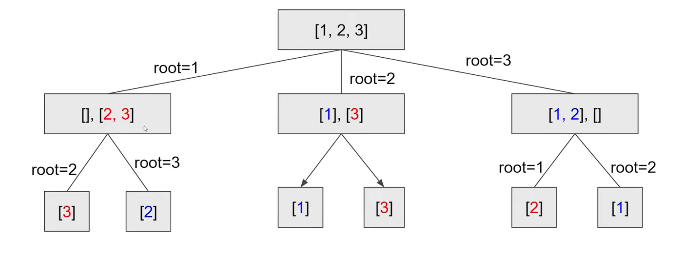
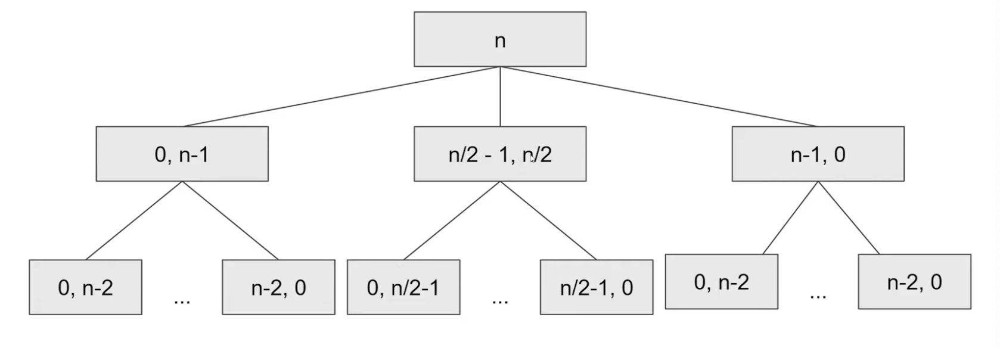
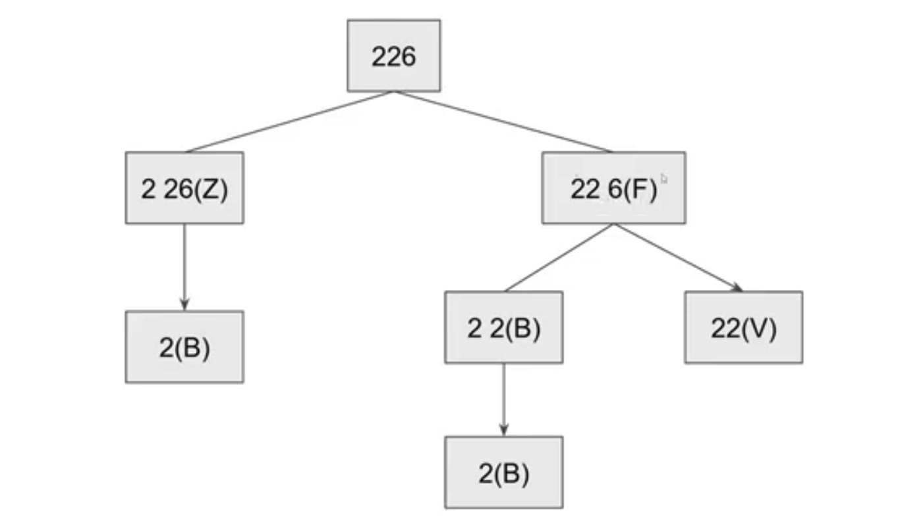
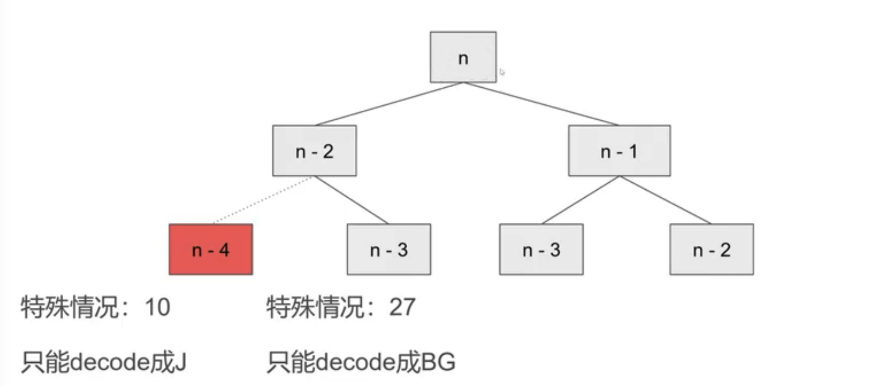
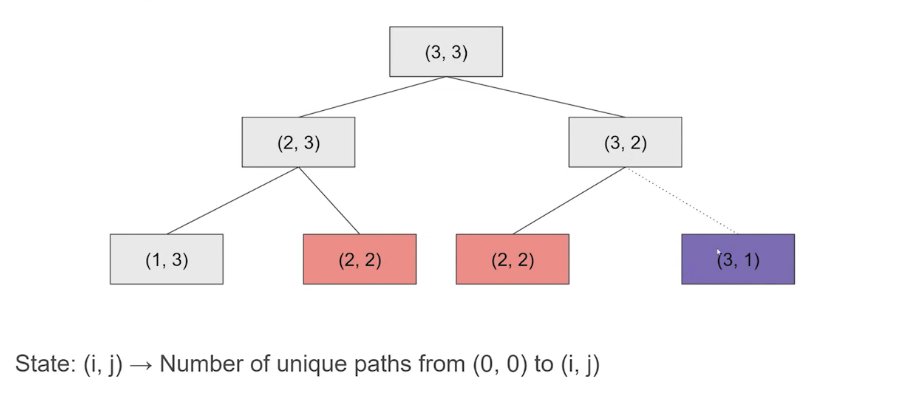
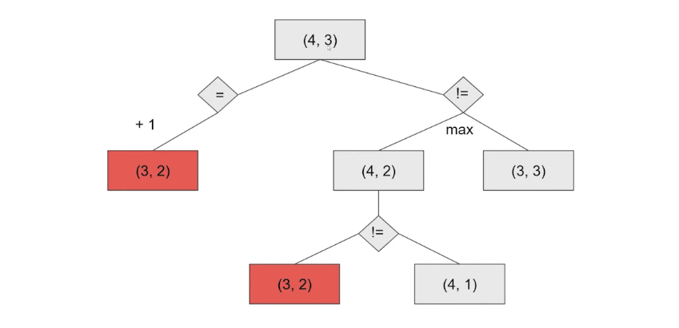

**数据结构与算法**


[toc]


# | 基础

数据结构

- 一组数据的存储结构

- 数据结构为算法服务

算法

- 操作数据的一组方法
- 算法要作用在特定的数据结构之上


## || 复杂度分析

**时间复杂度**

大O表示法

- 渐进时间复杂度；表示代码执行时间随数据规模增长的变化趋势


分析

- 只关注循环执行次数最多的一段代码
- 加法法则：`总复杂度 = 量级最大的那段代码的复杂度`
- 乘法法则：`嵌套代码的复杂度 = 嵌套内外代码复杂度的乘积`


常见复杂度量级

- 常量阶 O(1)
  - 当不存在递归、循环

- 对数阶 O(logn)
  - 循环变量按“倍数”增长

- 线性阶 O(n)

- 线性对数阶 O(nlogn)

- 平方阶 O(n^2)

- 指数阶 O(2^n)

- 阶乘阶 O(n!)

场景

- 最好

- 最坏

- 平均
  
- 加权平均时间复杂度、期望时间复杂度
  
- 均摊

  - 摊还分析法

    > 对一个数据结构进行一组连续操作中，大部分情况下时间复杂度都很低，只有个别情况下时间复杂度比较高，而且这些操作之间存在前后连贯的时序关系。
    > 这个时候，我们就可以将这一组操作放在一块儿分析，看是否能将较高时间复杂度那次操作的耗时，平摊到其他那些时间复杂度比较低的操作上。而且，在能够应用均摊时间复杂度分析的场合，一般均摊时间复杂度就等于最好情况时间复杂度
  


**空间复杂度**

渐进空间复杂度，表示存储空间与数据规模之间的增长关系


## || 常见思路

### 递归

三个条件

- 一个问题的解可以分解为几个**子问题**的解

- 该问题与子问题求解思路完全一样

- 存在**递归终止条件**


思路

- 写递归代码的关键就是找到如何将大问题**分解**为小问题的规律，并且基于此写出递推公式，然后再推敲终止条件，最后将递推公式和终止条件翻译成代码

- 写出递推公式

- 找到终止条件


如何写

- 严格定义递归函数作用：参数、返回值、side-effect

- 先一般，后特殊

- 每次调用必须缩小问题规模

- 每次问题规模缩小程度必须为1

注意

- 溢出

- 警惕重复计算


### 循环

如何写

- 定义循环不变式，循环体每次结束后保持循环不变式

- 先一般，后特殊

- 每次必须向前推进循环不变式中涉及的变量值

- 每次推进的规模必须为1


### 二分

[a, b) 前闭后开

- [a, b) + [b, c) = [a, c)

- b - a = len([a, b))

- [a, a) ==> empty range


# | 数据结构

## || 线性表

### 数组

**概念**

- 插入低效
  - 优化：插入索引K, 则只将原K元素移到数组尾部

- 删除低效
  - 优化：标记清除
- 内存空间连续
  - 所以申请时如果连续空间不足，会OOM

- vs. ArrayList
  - 封装细节
  - 动态扩容：创建时应事先指定大小


**思路：同向指针**

- 含义
  - `[0, i)`：已处理
  - `[i, j)`：已忽略
  - `[j, max)`：待处理
- 通用步骤
  - 初始化指针 i, j = 0
  - while j < array.length
    - if need array[j], then keep it by array[i] = array[j]; i++
    - otherwise skip (跳过意味着无需 i++)


**思路：反向指针**

- 含义
  - `[0, i)`：已处理
  - `[i, j)`：待处理
  - `[j, max)`：已处理
- 反向指针处理后，**不会**保留原来的相对位置。
- 通用步骤
  - 初始化 i = 0, j = max
  - while i <= j
    - 根据 array[i], array[j] 的取值进行处理；
    - Move i or j forward


注意：

- 区间闭合保持一致，例如都是左闭右开。


例题

- **283 - Move zeros to the end**. [1, 2, 0, 3, 0, 8] --> [1, 2, 3, 8, 0, 0]
  https://leetcode.com/problems/move-zeroes/ 

- **344 - Reverse String**
  https://leetcode.com/problems/reverse-string/ 

  ```java
  // 反向双指针
  public char[] reverseString(char[] str) {
    int i = 0; j = str.length - 1;
    while (i < j) {
      swap(str, i, j);
      i++;
      j--;
    }
    return str;
  }
  ```
  
  
  
- **26 - Remove Duplicates from Sorted Array**

  https://leetcode.com/problems/remove-duplicates-from-sorted-array/ 

  > 要保持顺序，用同向指针

  ```java
  public int removeDups(int[] arr) {
    int i = 0, j = 0;
    while (j < arr.length) {
      if (i == 0 || arr[j] != arr[i - 1]) {
        arr[i] = arr[j];
        i++;
        j++;
      } else {
        j++; //遇到重复元素，i不动：[i, j) 表示忽略的部分
      }
    }
    return i; // [0, i) 即为去重后的结果
  }
  ```

  

- 80 - Remove Duplicates from Sorted Array II
- 11 - Container with Most Water
- 42 - Trapping Rain Water
- 1047 - Remove All Adjacent Duplicates In String


### 链表

**种类**

- 单链表

- 双向链表

  - 用空间换时间

  - LinkedHashMap

    >  双向链表 + 散列表
    >
    > 原生支持LRU：访问一个元素，会将其移到链表末尾

- 循环链表

- 双向循环链表

- 静态链表


**思路1：同向双指针**

- 思路
  1. 两个指针一个快一个慢，确定距离隔开多少
  2. 确定两个指针移动速度
- **技巧**

  - 理解指针或引用的含义


  - 警惕指针丢失


  - 利用**哨兵**简化实现难度

    > 虚拟空头。
    >
    > 否则：插入删除操作，需要对插入第一个节点、删除最后一个节点特殊处理


  - 留意边界条件处理

    > 空、1节点、2节点、处理头节点尾节点


  - 举例、画图


**思路2：递归**

1. 子问题：假设 k 之后的节点已经处理完；
2. 处理当前层
3. 返回结果


**例题**

- **876 - 求链表中间节点**
  https://leetcode.com/problems/middle-of-the-linked-list/

  ```java
  //快指针每次前进 2 个节点，慢指针每次前进 1 个节点
  public ListNode findMiddleNode(ListNode head) {
    ListNode i = head, j = head;
    while (j != null && j.next != null) {
      i = i.next;
      j = j.next.next;
    }
    return i;
  } 
  ```

- **Linked List 找倒数第 K 个节点**

  ```java
  // 两个指针先隔开 K 个位置，再以相同速度前移
  public ListNode findLastKth(ListNode head, int k) {
    ListNode i = head, j = head;
    for (int c = 0; c < k; c++) {
      j = j.next;
    }
    while (j != null) {
      i = i.next;
      j = j.next;
    }
    return i;
  }
  ```

- **206 - 单链表反转**：递归
  https://leetcode.com/problems/reverse-linked-list/ 

  ```java
  public ListNode reverse(ListNode head) {
    // 递归退出条件
    if (head = null || head.next == null) {
      return head;
    }
    // 1. 子问题：问下一次要结果
    ListNode reversedHead = reverse(head.next);
    // 2. 处理当前层
    head.next.next = head; //下一个节点（已反转的子问题的最后一个节点）的 next --> 指向当前节点
    head.next = null; //当前节点的next置为null
    // 3. 返回
    return reversedHead;
  }
  ```

- 92 - Reverse LinkedList II

- 25 - Reverse Nodes in K-Group

- **234. 判断字符串回文**
  https://leetcode.com/problems/palindrome-linked-list/
- 237 - Delete Node in LinkedList

- **141. 链表中环的检测**
  https://leetcode.com/problems/linked-list-cycle/
  https://leetcode.com/problems/linked-list-cycle-ii/

- **21. 有序链表合并**
  https://leetcode.com/problems/merge-two-sorted-lists/

- **19. 删除链表倒数第n个节点**
  https://leetcode.com/problems/remove-nth-node-from-end-of-list/

- **LRU 缓存**
  https://leetcode.com/problems/lru-cache/

思路：

> 使用有序单链表，尾部表示最早使用的节点。
>
> 插入节点时，
>
> - 遍历链表，查询是否已存在；
> - 若存在，则从原位置删除、插入到头；
> - 若不存在，且缓存未满，则插入到头；
> - 若不存在，且缓存已满，则删除尾部节点，插入到头。


- 可用双向链表 + 散列表 提升性能到O(1)

- 查找
  - 散列表 O(1)
  - 并移动到双向链表尾部

- 删除
  - 通过散列表定位到节点
  - 通过节点前驱指针、后驱指针，在双向链表中删除

- 添加

  - 已有节点：移动到双向链表尾部
  - 新节点：是否已满？
    - 满：删除头部节点、新增尾部节点
    - 未满：新增尾部节点

  

### 跳表

**思路**

> 对链表建立多级索引：这样链表也可以“二分查找”了
> 空间换时间：空间复杂度 O(n)


**索引动态更新**

- 随机函数

- 决定插入到第 1 ~ K 级索引


**应用**

- Redis 有序集合

> 为什么redis不用红黑树？
>
> 区间查询：跳表 O(logn)，更快
>
> 更易实现


### 栈

**定义**

- 受限的线性表：入栈 push()，出栈pop()

**特性**

- LIFO，适用于需要记录之前的状态，必要时可以回到之前的状态、或利用之前的值。
- 扩展：DP 需要记录之前所有状态，随时可能访问任何一个子问题，所以通常用数组或map。

**实现**

- 顺序栈：用数组实现
  
- 链式栈：用链表实现

**应用**

- 函数调用栈

- 表达式求值
  - 操作数栈
  - 运算符栈

- 括号匹配

- 浏览器前进后退
  - 两个栈
  - 或者用双向链表

**例题**

- **739 - Daily Temperatures**，多少天后有更高气温 --> 单调栈
  https://leetcode.com/problems/daily-temperatures/

  ```java
  // 栈元素：比当前元素大的右侧元素索引 
  public int[] dailyTemperatures(int[] t) {
      int n = t.length;
      int[] res = new int[n];
  
      Deque<Integer> stack = new ArrayDeque<>();
      for (int i = n - 1; i >= 0; i--) {
        // 如果栈内元素比当前元素小，则清空
        // --> 大个子来了，之前的小个子无需存储
        while(!stack.isEmpty() && t[i] >= t[stack.peek()]) {
          stack.pop();
        }
        
        // 记录当前 i 位置的结果：栈顶到i的距离
        if (stack.isEmpty()) {
          res[i] = 0;
        } else {
          res[i] = stack.peek() - i;
        }
        stack.push(i);
      }
  
      return res;
  }
  ```

  

- **735 - Asteroid Collision**
  https://leetcode.com/problems/asteroid-collision/ 

  > 碰到下一个行星，需要回头看上一个行星的方向，故用 Stack！
  
  ```java
  // 栈元素：目前存活的行星
  public int[] collission(int[] arr) {
    Deque<Integer> stack = new ArrayDeque<>();
    for (int a : arr) {
      if (a > 0) {
        stack.push(a);
      } else {
        // 对于负数，回头看之前的行星：如果质量小，则撞飞
        while (!stack.isEmpty() && stack.peek() > 0 && stack.peek() < -a) {
          stack.pop(); 
        }
        if (!stack.isEmpty() && stack.peek() == -a) {
          stack.pop();   //如果之前有行星，且质量相等，则撞飞 + 当前行星不放入
        } else if (stack.isEmpty() || stack.peek() < 0) {
          stack.push(a); //如果之前无行星，或之前行星为负数，则放入当前行星
        }
      }
    }
    
    int[] res = new int[stack.size()];
    for (int i = res.length - 1; i >=0; i--) {
      res[i] = stack.pop();
    }
    return res;
  }
  ```
  
  
  
- **20. Valid Parentheses**
  https://leetcode.com/problems/valid-parentheses/

- **155. Min Stack**
  https://leetcode.com/problems/min-stack/

- **232. Implement Queue using Stacks**
  https://leetcode.com/problems/implement-queue-using-stacks/

- **844. Backspace String Compare**
  https://leetcode.com/problems/backspace-string-compare/

- **224. Basic Calculator**
  https://leetcode.com/problems/basic-calculator/

- **682. Baseball Game**
  https://leetcode.com/problems/baseball-game/

- **496. Next Greater Element I**
  https://leetcode.com/problems/next-greater-element-i/
- **503 - Next Greater Element II**
- **394 - Decode String**
- **636 - Exclusive Time of Functions**
- **84 - Largest Rectangle in Histogram**
  https://leetcode.com/problems/largest-rectangle-in-histogram/ 


### 队列

**定义**

- 受限的线性表
  - 入队 enqueue()
  - 出队 dequeue()
- 接口

```
- Queue 的接口
  - offer() / add()  
  - poll() / remove()
  - peek() / element() null / exception
  
- BlockingQueue
  - put() / take()

- Deque 的接口
  - getFirst() / getLast()        : exception
  - pollFirst() / pollLast()      : null
  - removeFirst() / removeLast()  : exception
  - addFirst() / addLast()
  - offerFirst() / offerLast() : addFirst() + return true
```


**实现**

- 顺序队列

用数组实现

队空：head == tail

队满：tail == n

```java
public class ArrayQueue {
  // 数组：items，数组大小：n
  private String[] items;
  private int n = 0;
  
  private int head = 0;
  private int tail = 0;
  
  // 出队
  public String dequeue() {
    // 如果 head == tail 表示队列为空
    if (head == tail) return null;
    String ret = items[head];
    ++head;
    return ret;
  }
  
  // 入队
  public boolean enqueue(String item) {
    // 如果 tail == n 表示队列已经满了
    if (tail == n) return false;
    items[tail] = item;
    ++tail;
    return true;
  }
  
  
     // 入队 + 数据搬移
  public boolean enqueue(String item) {
    if (tail == n) {
      // tail ==n && head==0，表示整个队列都占满了
      if (head == 0) return false;
      // 数据搬移
      for (int i = head; i < tail; ++i) {
        items[i-head] = items[i];
      }
      // 搬移完之后重新更新 head 和 tail
      tail -= head;
      head = 0;
    }
    
    items[tail] = item;
    ++tail;
    return true;
  }

}

```

- 链式队列

用链表实现


**种类**

- 普通队列

- 循环队列

队空：head == tail

队满：(tail + 1) % n == head

```java
public class CircularQueue {
  // 数组：items，数组大小：n
  private String[] items;
  private int n = 0;
  
  private int head = 0;
  private int tail = 0;

  // 入队
  public boolean enqueue(String item) {
    // 队列满了
    if ((tail + 1) % n == head) return false;
    items[tail] = item;
    tail = (tail + 1) % n;
    return true;
  }

  // 出队
  public String dequeue() {
    // 如果 head == tail 表示队列为空
    if (head == tail) return null;
    String ret = items[head];
    head = (head + 1) % n;
    return ret;
  }
}

```

- 双端队列

- 阻塞队列
  - 生产者消费者模型

- 并发队列
  - 加锁
  - CAS：Disruptor

- 阻塞并发队列


**应用**

- Disruptor

- ArrayBlockingQueue实现公平锁


## || 散列表

**思路**

- 数组 按下标访问，时间复杂度 O(1)

- 散列函数：将key映射为数组下标


**冲突解决**

**开放寻址 open addressing**

- 线性探测 Linear Probing
  - 如果冲突，依次往后找
  - 场景：数据量小时、装载因子小时
- 二次探测 Quadratic Probing
  - 如果冲突，按指数步长往后找
- 双重散列 Double hashing
  - 如果冲突，换hash函数

**链表法 chaining**

场景：适合存储大对象、大数据量

因为指针要消耗空间的


**动态扩容**

- 避免哈希碰撞攻击
  - 让散列表退化为链表
  - 查询时消耗CPU/线程

- 扩容后，装载因子变低，散列表变得更空

- 优化：渐进式扩容

  - 目的：避免扩容时的插入操作 耗时过长

  - 要点

    - 扩容时，仅分配新空间，不迁移数据
    - 后续插入时，一步步迁移
    - 查询时，先查新数组，再查老数组

    

**位图**

- TBD


**应用**

- 将词典放入Map，用于拼写检查

- ThreadLocalMap 使用开放寻址法

  > 数据量小


**例题**

- **1 - Two Sum**

  > - Brute Force：遍历每一个数，找另一个数是否在数组里
  > - 使用 HashMap 加速查找：key = 数值，value = 索引

  ```java
  public int[] twoSum(int[] nums, int target) {
    Map<Integer, Integer> map = new Hashmap<>();
    for (int i = 0; i < nums.length; i++) {
      if (map.containsKey(target - nums[i])) {
        return new int[]{map.get(target - nums[i]), i};
      }
      map.put(nums[i], i)
    }
    return new int[2];
  }
  ```

  ```java
  //如果有序且要求返回数值，而非返回索引 --> 双指针
  public int[] twoSum(int[] nums, int target) {
    Arrays.sort(nums);
    int i = 0, j = nums.length - 1;
    while (i < j) {
      int sum = nums[i] + nums[j];
      if (sum == target) {
        return new int[]{nums[i], nums[j]};
      } else if (sum > target) {
        j--;
      } else {
        i++;
      }
    }
    return null;
  }
  ```

  

- 560 - Subarray Sum Equals K：找到连续子数组，其总和为K，返回个数

  > 思路：subarray sum = sum(0, x) - sum(0, y)
  >
  > Map: Key = sum, Value = 次数

  ```java
  public int subarraySum(int[] nums, int k) {
    Map<Integer, Integer> map = new HashMap<>();
    map.put(0, 1);
    int sum = 0, cnt = 0;
    
    for (int x : nums) {
      sum += x;
      if (map.containsKey(sum - k)) {
        // subarray sum = k = sum(0, x) - sum(0, y)
        // ?
        cnt += map.get(sum - k); 
      }
      map.put(sum, map.getOrDefault(sum, 0) + 1);
    }
    return cnt;
  }
  ```

- 3 - Longest Substring without Repeating Characters

- 49 - Group Anagrams

- **138 - Copy List with Random Pointer**

- 340 - Longest Substring with At Most K Distinct Characters

- 554 - Brick Wall

- 535 - Encode and Decode TinyURL


## || 树

### 二叉树

**1. 平衡二叉树**

**2. 二叉查找树**

定义：左子树 < 当前节点 < 右子树

操作

- 查找
- 插入
- 删除
  - 如果待删除节点有2个子节点；需要从右子树中找到最小节点替换到待删除节点

特点

- 中序遍历 可得有序序列

- 支持重复数据

  - 链表法

  - 或插入右子树

    即：左子树 < 当前节点 <= 右子树

vs. 哈希表

- 哈希表数据无序
- 哈希表扩容耗时
- 哈希表要考虑hash函数设计、冲突解决、扩容


**3. 平衡二叉查找树**

https://en.wikipedia.org/wiki/Self-balancing_binary_search_tree

定义

- 任意节点左右子树高度相差不大于1
- 且是二叉查找树
- 为了解决二叉树频繁插入删除时，退化成链表


- **3.1 AVL 树**

  - 每个节点存储平衡因子：子树高度差

  - 如何平衡
    - 左旋
    - 右旋
    - 左右旋
    - 右左旋


  - 缺点
    - 需要额外存储
    - 调整次数频繁：但实际上没必要完美平衡


- **3.2 2-3 树**

https://www.cnblogs.com/tiancai/p/9072813.html

- 目的
  - 保持树的矮胖、平衡


- 插入时平衡调整

  - 插入到一个 2-节点，则扩充其为 3-节点


  - 插入到一个 3-节点

    - 若无父节点，则扩充其为 4-节点，然后分解变成二叉树
    - 若有 2-节点 父节点，则扩充其为 4-节点，然后分解，并将新树父节点融入到 2-节点父节点
    - 若有 3-节点 父节点，则扩充其为 4-节点，然后分解，向上融合；上面的3-节点继续扩充、融合

    


- **3.3 红黑树**

https://www.cnblogs.com/tiancai/p/9072813.html

- 思想

  - “近似”平衡二叉树

  - 左右子树高度差小于两倍


- **实现**

  - 根节点是黑色

  - 叶子节点都是黑色、且是空节点
    - 为了简化编码

  - 相邻节点不能同时为红色
    - 否则成为 4-节点
    - 插入删除时可能破坏该要求

  - 任意节点到可达叶子节点的路径，包含相同数目的黑色节点
    - 即：平衡
    - 插入删除时可能破坏该要求


- 平衡

  - 插入时平衡调整
    - 左旋、右旋
    - 改变颜色


  - 删除时平衡调整

    https://time.geekbang.org/column/article/68976


- **vs. 2-3 树**

  - 红色，标记 3节点
    - 红节点与父节点 可以合并为一个 3-节点

  - 黑色，普通节点


- **vs. AVL树**

  - AVL 严格平衡，读更快


  - 红黑树 插入、删除更快


  - 存储

    - AVL额外存储平衡因子 
    - 红黑树 仅需 1 bit，表示黑or红


  - 场景

    - 红黑树：高级语言库中
    - AVL 树：数据库

    


**4. 完全二叉树**

最后一层叶子节点靠左排列


**5. 满二叉树**

叶子节点全在最底层


**二叉树的表示法**

- 链式存储法

- 数组

  - 索引

    - 如果下标从 1 开始

      > i / 2 父节点
      >
      > 2 * i：左子节点
      >
      > 2 * 1 +1 ：右子节点

    - 如果下标从 0 开始

      > (i - 1) / 2 父节点 --> d叉树：(i - 1) / d
      >
      > 2 * i+ 1 左子节点
      >
      > 2 * i + 2 右子节点 --> d叉树：d * i + 1  / d * i+2

  - 适用
    - 完全二叉树、满二叉树
    - 其他类型 浪费数组空间
    
    

**二叉树的遍历**

- 前序

- 中序

- 后序

```
void preOrder(Node* root) {
  if (root == null) return;
  print root // 表示打印root节点
  preOrder(root->left);
  preOrder(root->right);
}

void inOrder(Node* root) {
  if (root == null) return;
  inOrder(root->left);
  print root // 表示打印root节点
  inOrder(root->right);
}

void postOrder(Node* root) {
  if (root == null) return;
  postOrder(root->left);
  postOrder(root->right);
  print root // 表示打印root节点
}
```


例题

**二叉树 按层遍历**

https://leetcode.com/problems/binary-tree-level-order-traversal/

**104. Max Depth**

https://leetcode.com/problems/maximum-depth-of-binary-tree/

**199. Right Side View**

https://leetcode.com/problems/binary-tree-right-side-view/

**450. Delete Node**

https://leetcode.com/problems/delete-node-in-a-bst/


### -多路查找树

- B 树
- B+ 树
- 2-3 树
- 2-3-4 树


### 堆

定义

- 堆是完全二叉树

- “每个节点的值”均 >= 或 <= “子树各节点值”

类型

- 小顶堆
- 大顶堆
- 优先级队列
- 斐波那契堆
- 二项堆

存储

- 数组
  - 因为是完全二叉树

操作

- 查看堆顶 `peek()` -- O(1)
  
- 插入 `offer()` -- O(logN)
  - 先放到最后；与父节点比较、交换
  - 从下往上堆化

- 删除堆顶 `poll()` -- O(logN)
  - 方法一
    - 从左右子节点中找出第二大元素，放到堆顶；再迭代地删除第二大节点
    - 会出现数组空洞，不满足完全二叉树
  - 方法二
    - 把最后一个节点放到堆顶；再从上往下堆化

应用

- 优先级队列

  - 合并有序小文件

    > 从N个小文件中，取出第一条记录，放入小顶堆
    >
    > 取出堆顶，放入大文件
  
  - 高性能定时器
  
    > 堆顶是需要最先执行的任务
    >
    > 避免 频繁扫描任务列表

- Top K
  - 维护 大小为K的  “小顶堆”
  - 遍历数组，如果比堆顶大，则插入堆；否则不做处理

- 求中位数

  - 思路1：先排序，再取中位数

    缺点：动态数据，则每次都要先排序

  - 思路2：维护两个堆

    - 大顶堆：存储前半部分数据，堆顶即是中位数
    - 小顶堆：存储后半部分数据
    - 动态插入数据
      - 如果 <= 大顶堆堆顶，则插入大顶堆
      - 然后移动到另一个堆，保持平衡

- 求百分位值（例如P99）
  - 求中位数问题的变形
  - 大顶堆：N*99% 个元素*
  -  小顶堆：N*1%个元素


**其他**

- 树状数组

- 线段树


**例题**

- **215 - 数组中的 TopK 元素**

  https://leetcode.com/problems/kth-largest-element-in-an-array/ 

  ```java
  // 维护最小堆，其大小为 K 
  // 堆顶元素即为 topK
  public int findKth(int[] nums, int k) {
    PriorityQueue<Integer> heap = new PriorityQueue<>();
    for (int x : nums) {
      if (heap.size() < k || x > heap.peek()) {
        heap.offer(x);
      }
      if (heap.size() > k) {
        heap.poll(); //如果堆超过k，则调整大小
      }
    }
    return heap.peek();
  }
  ```

- **23 - Merge K Sorted Lists**
  https://leetcode.com/problems/merge-k-sorted-lists/

  > 如果只有 2 个 list，可用双指针；
  >
  > 但如果个数不定（K个）：
  >
  > - Linear Scan - O(K)
  > - Simple Sorting - O(KlogK)
  > - Min Heap - O(NlogK)

  ```java
  // 维护最小堆，大小为 K；每次添加并移动最小的 pointer
  public ListNode mergeKLists(ListNode[] lists) {
    PriorityQueue<ListNode> heap = new PriorityQueue<>((a, b) -> a.val - b.val);
    
    //添加每个list的头节点
    for (ListNode list : lists) {
      if (list != null) {
        heap.offer(list); 
      }
    }
    
    ListNode res = new ListNode(0); //技巧：虚拟头节点
    ListNode cur = res;
    while (!heap.isEmpty()) {
      //取出堆顶，即取出最小元素
      ListNode top = heap.poll(); 
      //堆顶元素加入结果链表
      cur.next = top; 
      cur = cur.next;
      //堆里插入 top.next
      if (top.next != null) {
        heap.offer(top.next);
      }
    }
    
    return res.next;
  }
  ```

- 347 - TopK Frequent Elements

- 253 - Meeting Rooms II

- **295 - Find Median From Data Stream** 

- 767 - Reorganize String

- 703 - Kth Largest Element in a Stream


## || 图

**图的存储**

- **邻接矩阵 - Adjacency Matrix**
  - 二维数组
  - 空间浪费；需要提前知道节点个数

- **邻接表 - Adjacency List**
  - 类似散列表 `Map<T, List<T>>`，指向与当前节点邻接的节点列表
  - 如果链表过长，可替换为红黑树、跳表
  - 可分片存储

**操作**

- 拓扑排序
- 最短路径
- 关键路径
- 最小生成树
- 二分图
- 最大流

**案例**

- 微信好友关系：无向图

- 微博关注关系：有向图

  - 可用两个邻接表，分别存储关注关系、被关注关系


### 图的 BFS

- 场景：按层搜索，**适合寻找最短路径**
- 注意：可能有环，需要查重
- 模板
  - Init a queue, 加入所有起始点；Init a HashSet，保存访问过的节点
  - While (queue is not empty) 
    - Retrieve current queue size：当前层的节点数
    - For each current level nodes:
      - **Poll** out one node
      - If this is the node we want, return it;
      - **Offer** all its neighbor to the queue, <u>if not visited and valid</u>
    - Increase level
- 技巧：预先存一个 4-direction-array，用于帮助访问 neighbors --> `directions = {{0, 1}, {1, 0}, {0, -1}, {-1, 0}}`


**例题**

- **542 - 0 1 Matrix**，查找 01 矩阵中离每个节点最近的 0 距离

  > 直接思维：对于每一个1，利用 BFS 找到离他最近的 0。O(mn * mn)
  >
  > 逆向思维：对于所有的 0，利用 BFS 填充到每一个 1 的距离。O(mn)

  ```java
  int[][] dirs = {{0, 1}, {1, 0}, {0, -1}, {-1, 0}};
  
  public int[][] updateMatrix(int[][] matrix) {
    int m = matrix.length; n = matrix[0].length;
    int[][] res = new int[m][n];
    
    boolean[][] visited = new boolean[m][n];
    Queue<int[]> queue = new LinkedList<>();
    //找到所有0节点，作为队列初始值
    for (int i = 0; i < m; i++) {
      for (int j = 0; j < n; j++) {
        if (matrix[i][j] == 0) {
          queue.offer(new int[]{i, j});
          visited[i][j] = true;
        }
      }
    }
    
    int cost = 0;
    while (!queue.isEmpty()) {
      int size = queue.size();
      for (int s = 0; s < size; s++) {
        // 遍历queue node, 如果是1节点，保存cost
        int[] cur = queue.poll();
        int i = cur[0], j = cur[1];
        if (matrix[i][j] == 1) {
          res[i][j] = cost;
        }
        // Offer 邻接节点
        for (int[] dir : dirs) {
          int x = i + dir[0], y = j + dir[i];
          if (x >= 0 && x < m && y >= 0 && y < n && !visited[x][y]) {
            queue.offer(new int[]{x, y});
            visited[x][y] = true;
          }
        }
      }
      cost++;
    }
    return res;
  }
  ```

- **127 - Word Ladder**，每次只能改变一个字母，并必须在字典中，那么两个单词要经过几次变化

  > 并不明说是图的题目。

  ```java
  // 首先构造图
  private Map<String, List<String>> constructGraph(List<String> words) {
    Map<String, List<String>> graph = new HashMap<>();
    int n = words.size();
    // 两次遍历，找到两两相邻的单词
    for (int i = 0; i < n - 1; i++) {
      for (int j = i + 1; j < n; j++) {
        String w1 = words.get(i), w2 = words.get(j);
        if (oneChangeAway(w1, w2)) {
          graph.computeIfAbsent(w1, k -> new ArrayList<>()).add(w2);
          graph.computeIfAbsent(w2, k -> new ArrayList<>()).add(w1);
        }
      }
    }
    return graph;
  }
  
  // 判断两个单词是否只差一个字符
  private boolean oneChangeAway(String w1, String w2) {
    int diff = 0;
    for (int i = 0; i < w1.length(); i++) {
      char c1 = w1.charAt(i), c2 = w2.charAt(i);
      if (c1 != c2) {
        diff++;
        if (diff > 1) {
          return false;
        }
      }
    }
    return diff == 1;
  }
  
  // BFS 寻找最短路径
  public int ladderLength(String begin, String end, List<String> dicts) {
    if (!dicts.contains(end)) {
      return 0;
    }
    if (!words.contains(begin)) {
      dicts.add(begin);
    }
    // 0. 构造图
    Map<String, List<String>> graph = constructGraph(dicts);
    
    // BFS遍历图：1. 构造队列，初始化为初始单词
    Set<String> visited = new HashSet<>();
    Queue<String> queue = new LinkedList<>();
    queue.offer(begin);
    visited.add(begin);
    
    // BFS遍历图：2. while queue is not empty
    int length = 1;
    while (!queue.isEmpty()) {
      //2.1 获取当前层size
      int size = queue.size();
      //2.2 遍历当前层每个单词
      for (int i = 0; i < size; i++) {
        String cur = queue.poll();
        // 如果满足要求，则返回
        if (cur.equals(end)) { 
          return length;
        }
        // Offer邻接节点
        for (String neighbor : graph.getOrDefault(cur, new ArrayList<>())) { 
          queue.offer(neighbor);
          visited.add(neighbor);
        }
      }
      length++;
    }
    return 0; 
  }
  
  ```

- 934 - Shortest Bridge

- 310 - Min Height Trees

- 1091 - Shortest Path in Binary Matrix

- 994 - Rotting Oranges

- 863 - All Nodes Distance K in Binary Tree

- 317 - Shortest Distance from All Buildings


### 加权图的 Best-First Search

- 优先展开 ”最优“ 的节点，即图中每条边都有**权重**。
- 技巧：如何快速计算”最优“ --> Heap
- 模板：与 BFS 基本一致，只是把 Queue 换成 Heap
  - Init a Heap, with all starting points. Init a HashSet for visited nodes
  - While heap is not empty
    - **poll** out one node.
    - if visited, skip; otherwise mark as visited, & udpate its cost;
    - if it's the destination, return;
    - **offer** all its neighbors


**例题**

- **? 743 - Network Delay Time**，从一个节点出发，多久能渗透到网络中所有节点

  > 即，计算从初始节点，到最远节点的最短路径。

  ```java
  //输入节点列表:  List<times[start, end, delay]>
  public int networkDelayTime(int[][] times, int N, in k) {
    //1. 构造图
    Map<Integer, List<Cell>> graph = constructGraph(times);
    // visited node & cost. 注意此处要额外保存cost
    Map<Integer, Integer> costs = new HashMap<>();
    //2. 初始化堆，放入初始节点 k
    PriorityQueue<Cell> heap = new PriorityQueue<>();
    heap.offer(new Cell(k, 0));
    //3. 遍历堆
    while (!heap.isEmpty()) {
      Cell cur = heap.poll();
      if (costs.containsKey(cur.node)) { 
        continue; //忽略visited nodes
      }
      
      //update cost: cost值 = 当前节点delay ???
      costs.put(cur.node, cur.time);
      
      //如果还有邻接节点，则遍历之
      if (graph.containsKey(cur.node)) {
        for (Cell neighbor : graph.get(cur.node)) {
          if (!costs.containsKey(neighbor.node)) {
            //heap: 加上 neighbor candidate = 到达当前节点的最优cost + 邻接cost
            heap.offer(new Cell(neighbor.node, cur.time + neighbor.time));
          }
        }
      }
    }
    
    if (costs.size() != N) {
      return -1; //如果不是所有节点能都reach，则无法完全遍历
    }
    
    //返回值 = cost中的最大值
    int res = 0;
    for (int x : costs.values()) {
      res = Math.max(res, x);
    }
    return res; 
  }
  
  //构造图
  //输入节点列表:  List<times[start, end, delay]>
  private Map<Integer, List<Cell>> constructGraph(int[][] times) {
    Map<Integer, List<Cell>> graph = new HashMap<>(); //注意 map value 需要附带cost，map[src] = Cell{dst, cost}
    for (int[] time : times) {
      List<Cell> edges = graph.getOrDefault(time[0], new ArrayList<>());
      edges.add(new Cell(time[1], time[2])); //Cell(node, cost)
      graph.put(time[0], edges);
    }
    return graph;
  }
  
  class Cell implements Comparable<Cell> {
    int node, time;
    
    public int compareTo(Cell c2) {
      return time - c2.time;
    }
  }
  ```
  
- **787 - Cheapest Flights within K Stops.** 有向加权图

  > Heap 中除了存储 {node, cost}，还要存一个 stop，如果stop > K，就不能再展开该节点。

  ```java
  public int findCheapestPrice(int n, int[][] flights, int src, int dst, int K) {
    //1.构造图
    Map<Integer, List<int[]>> graph = constructMap(flights);
    //2.初始化堆: 加初始节点 & stop = K & cost=0
    PriorityQueue<Cell> heap = new PriorityQueue<>();
    heap.offer(new Cell(src, K, 0));
    
    while (!heap.isEmpty()) {
      Cell cur = heap.poll();
      if (cur.dest == dst) { //如果是终点，则返回。因为是按优先级展开，第一次达到终点的一定是最优解
        return cur.price;
      }
      // 展开邻接节点，成本=cur cost + edge cost
      if (cur.stop >= 0 && graph.containsKey(cur.dst)) {
        for (int[] next : graph.get(cur.dst)) {
          heap.offer(new Cell(next[0], cur.stop - 1, cur.price + next[1]));
        }
      }
    }
    return -1;
  }
  
  // Construct Graph: map[src] = {dst, cost}
  // value 可以是数组、或者 pojo
  private Map<Integer, List<int[]>> constructMap(int[][] flights) {
    Map<Integer, List<int[]>> graph = new HashMap<>(); 
    for (int[] flight : flights) {
      List<int[]> to = graph.getOrDefault(flight[0], new ArrayList<>());
      to.add(new int[] {flight[1], flight[2]});
      graph.put(flight[0], to);
    }
    return graph;
  }
  
  class Cell implements Comparable<Cell> {
    int dst; //节点 
    int stop; //换乘数
    int price;//从出发地开始的累积价格
    
    public int compareTo(Cell other) {
      return price - other.price;
    }
  }
  ```
  
- 264 - Ugly Number II

- 373 - Find K Pairs with Smallest Sums

- 778 - Swim in Rising Water

- 378 - Kth Smallest Element in a Sorted Matrix


### 图的 DFS 

- DFS 会一口气扎到最深层，再递归回到原点；然后再一口气扎到另一条路的最深层，如此反复。
- 模板
  - Init HashSet, to record visited nodes;
  - For all entry nodes, call dfs()
    - Validate current node
    - Do sth. (Pre-order)
    - For each neighbor nodes:
      - Validate neighbor nodes, if visited or invalid, skip
      - 递归 dfs(neighbor)
    - Do sth. (post-order)


例题

- **200 - Number of Islands**

  ```java
  int[][] dirs = {{0,1}, {0,-1}, {1,0}, {-1,0}};
  public int numIslands(char[][] grid) {
    int cont = 0;
    //1. 遍历矩阵
    for (int i = 0; i < grid.length; i++) {
      for (int j = 0; j < grid[i].length; j++) {
        //2. For all entry nodes, call dfs
        if (grid[i][j] == '1') {
          count++;
          dfs(grid, i, j);
        }
      }  
    }
    return count;
  }
  
  // dfs染色：[i,j]表示当前位置
  private void dfs(char[][] grid, int i, int j) {
    grid[i][j] = 0; //技巧：染色
    for (int[] dir : dirs) {
      int x = i + dir[0];
      int y = j + dir[1];
      // dfs(neighbor)
      if (x >= 0 && x < grid.length || y >= 0 || y < grid[i].length && grid[x][y] == '1') {
        dfs(grid, x, y);
      }
    }
  }
  ```

  

- **332 - Reconstruct Itinerary** 

  > 每个 array 元素代表一张机票，[["JFK", "PVG"], [JFK, SFO], ["SFO, JFK"]]，返回行程路线。
  >
  > --> Post-order traversal on edges. 

  ```java
  public List<String> findItinerary(List<List<String>> tickets) {
    //1. 构建图：Adjacency Heap Map
    //为什么是heap map: 邻接节点需要排序
    Map<String, PriorityQueue<String>> graph = new HashMap<>();
    for (List<String> edge: tickets) {
  		graph.computeIfAbsent(edge.get(0), k -> new PriorityQueue<>())
        .offer(edge.get(1));
    }
    
    //2. Init result list
    List<String> res = new LinkedList<>(); //LinkedList支持从头部插入
    //3. DFS
    dfs(res, graph, "JFK");
    return res;
  }
  
  private void dfs(List<String> res, Map<String, PriorityQueue<String>> graph, String cur) {
    //3.1 for each neighbor of current city, poll out, &dfs
    PriorityQueue<String> neis = graph.getOrDefault(cur, new PriorityQueue<>());
    while (!neis.isEmpty()) {
      dfs(res, graph, neis.poll()); //poll 拿出即删，无需记录visited
    }
    //3.2 append current city to result
    res.add(0, cur);
  }
  ```

- 133 - Clone Graph

- 399 - Evaluate Division

- 785 - Is Graph Bipartite

- 841 - Keys and Rooms


# | 算法场景

## || 排序

> https://visualgo.net/zh/sorting
>
> https://mp.weixin.qq.com/s/HQg3BzzQfJXcWyltsgOfCQ


**指标**

- 内存消耗

- 稳定性

- 时间复杂度
  - 逆序度


**---- O(n^2) ----**

**1. 冒泡排序**

- 思路：两两比较

- 性能：三次赋值

自上而下对相邻的两个数依次进行比较和调整，让较大的数往下沉，较小的往上冒。

即：每当两相邻的数比较后发现它们的排序与排序要求相反时，就将它们互换。

```java
for (int i=0; i<data.length; i++) {
  for (int j=i+1; j<data.length; j++) {
    if (data[i] > data[j]) {
       int tmp = data[j];
       data[j] = data[i];
       data[i] = tmp;
    }
  }
}
```


**2. 插入排序**

- 思路
  - 假定分为  排序区 + 未排序区
  - 把第n个值 插入前面n-1个元素的排序区
    - 找到待插入位置，同时移动元素
    - 插入

- 性能
  - 一次赋值


假设前面 (n-1) 个数已经是排好顺序的。
把第n个数插到前面的有序数中，使得这n个数也是排好顺序的。

- 找到待插入位置，查找过程中移动数据
- 把n插入找到的位置。

```java
for (int i = 1; i < data.length; i++) {
  int value = data[i];
  int targetIndex = -1;
            
  // 找到待插入位置
  for (int j = i - 1; j >= 0; j--) {
    if (data[j] > value) 
      // 数据移动
      data[j+1] = data[j]; 
      targetIndex = j;
    } else {
      break;
    }
  }
  
  if (targetIndex >= 0) {
     data[targetIndex] = value;
  }
}
```


**3. 选择排序**

- 思路
  - 假定分为  排序区 + 未排序区
  - 从未排序区`选择`最小元素，放到排序区末尾

- 性能
  - 非稳定排序

思路类似插入排序，分为已排序区、未排序区；
每次从未排序区找到最小元素，放到已排序区末尾。

```java
// 重复（n-1）次
for (int i = 0; i < n; i++) {
  // 找到最小值索引
  int min = i;
  for (int j = i+1; j < n; j++) { 
    if (data[j] < data[min]) {
        min = j;
    }
  }
            
  // 将最小值和第一个没有排序过的位置交换
  if (data[min] < data[i]) {
     int temp = data[min];
     data[min] = data[i];
     data[i] = temp;
  }
            
}
```


**4. 希尔排序**

算法先将要排序的一组数按某个增量d（n/2,n为要排序数的个数）分成若干组，每组中记录的下标相差d.对每组中全部元素进行`直接插入排序`，
然后再用一个较小的增量（d/2）对它进行分组，在每组中再进行直接插入排序。
当增量减到1时，进行直接插入排序后，排序完成。


**---- O(nlogn) ----**

**5. 归并排序**

- 思路
  - 分解、合并
  - 分治、递归

- 性能
  - 非原地排序
  - 空间复杂度 O(n)


分治思想，将两个有序表合并成一个新的有序表。即：

- 把待排序序列分为若干个子序列，que'bao每个子序列是有序的。

- 然后再把有序子序列合并为整体有序序列。


**6. 快速排序**

- 思路
  - 找个基准元素，比它小的放左边，比它大的放右边
  - 递归
    - 递归排序左右两部分

- 性能

  - 最坏情况
    - 原因：基准元素选取不合理
    -  优化：三数取中法、随机法
  -  非稳定排序

  

- 流程：
  - 选择一个基准元素，通常选择第一个元素或者最后一个元素。

  - 通过一趟扫描，将待排序列分成两部分：一部分比基准元素小；一部分大于等于基准元素。

  - 此时基准元素在其排好序后的正确位置，然后再用同样的方法递归地排序划分的两部分。


**7. 堆排序**

- 思路
  - 两个步骤
    - 建堆
    - 排序

- 特点
  - 排序过程需要将最后节点与堆顶节点互换
    - 会改变原始相对顺序
    - 交换次数多余快排
  - 对 CPU 缓存不友好，并非顺序访问


堆排序需要两个过程，一是建立堆，二是堆顶与堆的最后一个元素交换位置。

所以堆排序有两个函数组成。

- 一是建堆的渗透函数，
- 二是反 复调用渗透函数实现排序的函数。


**---- O(n) ----**

**8. 桶排序 Bucket Sort**

- 思路
  - 将数据分到几个有序的桶里
  - 每个桶里的数据单独排序
  - 然后按桶的顺序依次取出

- 要求
  - 数据能划分成桶
  - 各桶数据分布较均匀

- 性能
  
- 非稳定排序
  
- 应用

  - 外部排序： 10GB订单 按金额排序

  

**9. 计数排序 Counting Sort**

- 思路
  - 特殊的桶排序
  - N个桶
  - 每个桶内元素值相同，无需再桶内排序

- 要求
  - 数据范围不大
  - 正整数

- 性能

  - 非稳定排序

-  应用

  - 成绩排序

  

桶排序的特殊情况：n个数据，划分n个桶；

关键是如何计算排序后的下标。


``` java
public void countingSort(int[] a, int n) {
  if (n <= 1) return;

  // 查找数组中数据的范围
  int max = a[0];
  for (int i = 1; i < n; ++i) {
    if (max < a[i]) {
      max = a[i];
    }
  }
  
  // 申请一个计数数组 c，
  int[] c = new int[max + 1]; 
  for (int i = 0; i <= max; ++i) {
    c[i] = 0;
  }

  // 计算每个元素的个数，放入 c 中
  for (int i = 0; i < n; ++i) {
    c[a[i]]++;
  }

  // 依次累加：为计算下标做准备
  for (int i = 1; i <= max; ++i) {
    c[i] = c[i-1] + c[i];
  }

  // 临时数组 r，存储排序之后的结果
  int[] r = new int[n];
  
  // 计算排序的关键步骤，有点难理解
  for (int i = n - 1; i >= 0; --i) {
    int index = c[a[i]]-1;
    r[index] = a[i];
    c[a[i]]--;
  }

  // 将结果拷贝给 a 数组
  for (int i = 0; i < n; ++i) {
    a[i] = r[i];
  }
}


```


**10. 基数排序 Radix Sort**

- 思路
  
  - 最低位开始，依次排序
- 要求
  - 数据可以分割出独立的 “位”
  - 而且位之间有递进的关系

- 性能

  - 非稳定排序

- 应用

  - 排序手机号

    - 先按最后一位排序
    -  再按倒数第二位重新排序，以此类推

    

将所有待比较数值（正整数）统一为同样的数位长度，数位较短的数前面补零。

然后，从最低位开始，依次进行一次排序。

这样从最低位排序一直到最高位排序完成以后，数列就变成一个有序序列。	


**JDK 排序算法**

- 原始数据类型

  - 快排

  - 双轴快排 Dual-Pivot QuickSort 

    http://hg.openjdk.java.net/jdk/jdk/file/26ac622a4cab/src/java.base/share/classes/java/util/DualPivotQuicksort.java

- 对象类型
  - TimSort：结合 `归并` + `二分插入binarySort`

    >  1 元素个数 < 32, 采用二分查找插入排序(Binary Sort)
    >
    > 2 元素个数 >= 32, 采用归并排序，归并的核心是分区(Run)
    >
    > 3 找连续升或降的序列作为分区，分区最终被调整为升序后压入栈
    >
    > 4 如果分区长度太小，通过二分插入排序扩充分区长度到分区最小阙值
    >
    > 5 每次压入栈，都要检查栈内已存在的分区是否满足合并条件，满足则进行合并
    >
    > 6 最终栈内的分区被全部合并，得到一个排序好的数组

Timsort的合并算法非常巧妙：

1 找出左分区最后一个元素(最大)及在右分区的位置
2 找出右分区第一个元素(最小)及在左分区的位置
3 仅对这两个位置之间的元素进行合并，之外的元素本身就是有序的

- 并行排序算法 parallelSort


## || 搜索


### BFS：广度优先搜索

- Breadth-First Search

- 场景：**适合解决与层数相关的 Tree 题目**
- 模板
  - Init a Queue，初始值为 all entry points
  - while (queue not empty) 
    - for each node in the **current** queue, 
    - poll out node, add to result
    - expand it, offer children to the queue **in order**.
    - increase level. 
- 复杂度 O(n)，每个 node 进出queue 一次。
- 缺点：对内存不友好，因为越展开越多


**例题**

- **102 - Binary Tree Level Order Traversal**，二叉树按层遍历

  ```java
  public List<List<Integer>> levelOrder(TreeNode root) {
    List<List<Integer>> res = new ArrayList<>();
    if (root == null) 
      return res;
    
    Queue<TreeNode> queue = new LinkedList();
    queue.offer(root);
    
    while (!queue.isEmpty()) {
      // 先存下size，保证遍历当前队列
      int size = queue.size();
      List<Integer> level = new ArrayList<>();
      for (int i = 0; i < size; i++) {
        TreeNode cur = queue.poll();
        level.add(cur.val);
        
        //expand, offer children
        if (cur.left != null) {
          queue.offer(cur.left);
        }
        if (cur.right != null) {
          queue.offer(cur.right);
        }
      }
      res.add(level);
    }
    return res;
  }
  ```

  

- **104 - Max depth of binary tree**. 二叉树最大深度

  ```java
  public int maxDepth(TreeNode root) {
    int depth = 0;
    Queue<TreeNode> queue = new LinkedList<>();
    queue.offer(root);
    
    while (!queue.isEmpty()) {
      int size = queue.size();
      for (int i = 0; i < size; i++) {
        TreeNode cur = queue.poll();
        
        if (cur.left != null) {
          queue.offer(cur.left);
        }
        if (cur.right != null) {
  				queue.offer(cur.right);
        }
      }
      depth++;
    }
    return depth;
  }
  ```

- **109 - Binary Tree Right Side View**，二叉树右视图

  ```java
  public List<Integer> levelOrder(TreeNode root) {
    List<Integer> res = new ArrayList<>();
    Queue<TreeNode> queue = new LinkedList();
    queue.offer(root);
    
    while (!queue.isEmpty()) {
      // 队列第一个元素 即上一层最右侧节点
      res.add(queue.peek().val); 
      
      int size = queue.size();
      List<Integer> level = new ArrayList<>();
      for (int i = 0; i < size; i++) {
        TreeNode cur = queue.poll();    
        //expand, offer children；注意先遍历右节点
        if (cur.right != null) {
          queue.offer(cur.right);
        }
        if (cur.left != null) {
          queue.offer(cur.left);
        }
      }
      
    }
    return res;
  }
  ```

- 101 - Symmetric Tree

- 103 - Binary Tree Zigzag Level Order Traversal 

- 111 - Min Depth of Binary Tree

- 515 - Find Largest Value in Each Tree Row 

- 429 - N-ary Tree Level Order Traversal 


### DFS：深度优先搜索

- Depth-First Search

- 模板：递归！！！

  - **Top-down DFS**

    - 把值通过参数的形式，从上往下传

    - 注意 dfs() 本身不返回值

      > 1. 处理 base case
      > 2. 利用父问题传下来的值做一些计算
      > 3. 如有必要，做一些额外处理
      > 4. 把值传下去给子问题继续递归

  - **Bottom-up DFS**

    - 把值从下（subproblem）往上传

    - 当前递归层利用 subproblem 传上来的值计算当前层的新值并返回

    - 注意一定会有返回值

      > 1. 处理 base case
      > 2. 向子问题要答案
      > 3. 利用子问题的答案，构建当前递归层的答案
      > 4. 如有必要，做一些额外操作
      > 5. 返回答案（给父问题）


- 遍历：preorder

  ```java
  public void dfs(TreeNode node) {
    if (node == null) {
      return;
    }
    
    System.out.println(node.val);
    dfs(node.left);
    dfs(node.right);
  }
  ```

  

**例题**

- **104 - Max depth of binary tree**. 二叉树最大深度

  ```java
  // Bottom-up DFS
  public int maxDepth(TreeNode root) {
    if (root == null) {
      return 0;
    }
    int left = maxDepth(root.left);
    int right = maxDepth(root.right);
    int max = Math.max(left, right) + 1;
    return max;
  }
  ```

- **124 - Binary Tree Max Path Sum.** 二叉树路径和最大值

  ```java
  // Bottom-up DFS
  int max = Integer.MIN_VALUE;
  public int maxSum(TreeNode root) {
    dfs(root);
    return max;
  }
  
  private int dfs(TreeNode node) {
    if (node == null) {
      return 0;
    }
    int left = dfs(node.left);
    int right = dfs(node.right);
    left = left < 0 ? 0 : left;
    right = right < 0 ? 0 : right;
    // 更新全局最大值 = 当前人字形链路 vs Max
    max = Math.max(max, left + right + node.val);
    // 返回给上一层：直线型的最大值
    return Math.max(left + node.val, right + node.val);
  }
  ```

- **129 - Sum Root to Leaf Numbers** 路径转为数值，再取和

  ```java
  // Top-down DFS 
  int sum = 0;
  public int sum(TreeNode root) {
    if (root == null) {
      return 0;
    }
    
    dfs(root, 0);
    return sum;
  }
  
  private int dfs(TreeNode node, int parent) {
    int curSum = 10 * parent + node.val
    if (node.left == null && node.right == null) {
      // base case: for leaf node, add sum
      sum += curSum; 
      return;
    }
     
    if (node.left != null) {
      dfs(node.left, curSum);
    }
    if (node.right != null) {
      dfs(node.right, curSum);
    }
  }
  ```

- 98 - Validate Binary Search Tree

- 110 - Balanced Binary Tree

- 113 - Path Sum II 

- **236 - Lowest Common Ancestor of a Binary Tree**

- 450 - Delete Node in a BST

- 508 - Most Frequent Subtree Sum


### A*启发式搜索

TBD


## || 查找 

### 二分查找

- 复杂度 = O(logN): 极其高效
  
- 原则
  
  - 每次都要缩减搜索区域
  - 每次缩减不能排除潜在答案
  
- 缺点

  - 不适用链表
  - 要求有序：不适合频繁插入删除的场景

  - 不适合数据量太小的情况：小数据量顺序遍历即可

  - 不适合数据量太大的情况：因为数组要求连续内存

  

- 模板

  - **找一个准确值**

    > //循环条件：`l <= r`
    > //缩减搜索空间：`l = mid + 1, r = mid - 1`

    ```java
    public int binarySearch(int[] arr, int k) {
      int l = 0, r = arr.length - 1;
      while (l <= r) {
        // 中点的计算
        // (low + high / 2)  可能溢出
        // low + ((high - low) / 2)
        // low + ((high - low) >> 1) 位运算更高效
        int mid = l + (r - l) / 2;
        
        if (arr[mid] == k) {
          return mid;
        } else if (arr[mid] > k) {
          r = mid - 1;
        } else {
          l = mid + 1;
        }
      }
      return -1;
    }
    ```

  - **找一个模糊值**：例如找比 4 大的最小数、找 2 出现的第一个位置
    
    > //循环条件：`l < r`
    > //缩减搜索空间（注意不能排除潜在答案）：`l = mid, r = mid - 1`，或者 `l = mid + 1, r = mid `
    
    ```java
    // e.g. 找 k 出现的第一个位置
    public int binarySearch(int[] arr, int k) {
      int l = 0, r = arr.length - 1;
      while (l < r) { //为什么不是 l<=r：可能死循环、无法缩减搜索区域
        int mid = l + (r - l) / 2; 
        if (arr[mid] < k) {
          l = mid + 1
        } else {
          r = mid; //为了不排除潜在答案，r缩减时步子要小
        }
      }
      return l;
    }
    ```
    
  - **万用型**

    > //循环条件：`l < r - 1`，最终保留两个数
    > //缩减搜索空间：`l = mid, r = mid`
    
    ```java
    // e.g. find closet to 2
    public int binarySearch(int[] arr, int k) {
      int l = 0, r = arr.length - 1;
      while (l < r - 1) {
        int mid = l + (r - l) / 2;
        if (arr[mid] < k) {
          l = mid;
        } else {
          r = mid;
        }
      }
      
      //因为最终保留了两个数，所以最后要根据情况决定返回哪一个
      if (arr[r] < k) {
        return r;
      } else if (arr[l] > k) {
        return l;
      } else {
        return k - arr[l] < arr[r] - k ? l : r;
      }
    }
    ```

  

  

- **例题**

  - 31 查找 = value 的起始位置
  - 31 查找 = value 的结束位置
  - 查找 >= value 的起始位置
  - 查找 <= vlaue 的结束位置
    - https://leetcode.com/problems/search-in-rotated-sorted-array/
   - 33 循环有序数组的二分查找
   - **1062 - Longest Repeating Substring**
     https://leetcode.com/problems/longest-repeating-substring/ 

     > 思路：`l = 0, r = n-1, l < r`；`mid = l + (r - l + 1) / 2`
     > Case1: if `f(mid) is valid LRS` --> l = mid
     > Case2: if `f(mid) is not valid LRS` --> r = mid - 1
     
     ```java
     public int lrs(String s) {
       int l = 0, r = s.length() - 1;
       while (l < r) {
         int mid = l + (r - l + 1) / 2;
         if (f(s, mid)) {
           l = mid; //往右缩减时，不可排除mid，否则可能排除掉潜在答案
         } else {
           r = mid - 1;
         }
       }
       return l;
     }
     
     //helper: if substring with length is valid Repeating
     public boolean f(String s, int length) {
       Set<String> seen = new HashSet();
       for (int i = 0; i <= s.length() - length; i++) {
         int j = i + length - 1;
         String sub = s.substring(i, j + 1);
         if (seen.contains(sub)) {
           return true;
         }
         seen.add(sub);
       }
       return false;
     }
     ```

   - 410 - Spilt Array Largest Sum

   - 1231 - Divide Chocolate

   - 852 - Peak Index in a Mountain Array

   - 1011 - Capacity to Ship Packages within D Days

   - 1292 - Maximum Side Length of a Square with Sum <= Threshold 


### 跳表查找

- 概念：链表 + 多级索引

- 复杂度
  - O(logN): 和二分查找一样高效
  - 空间复杂度：O(N)

- 插入、删除
  
- 随机函数插入几级索引
  
- 跳表 vs. 红黑树

  - 跳表还支持按区间查找：找到起始位置，然后往后遍历

  

### 线性表查找

TBD

### 树结构查找

TBD

### 散列表查找

TBD


## || 哈希

- 安全加密
  - MD5
  - SHA
  - DES / AES
  - 注意：加 Salt

- 唯一标识
  
- 图片摘要：分区取N字节 + MD5
  
- 数据校验
  
- BT 种子文件
  
- 散列函数
- 负载均衡
  - Session Sticky
    - 映射关系表：会很大·且不好维护
    - 哈希算法能解决

- 数据分片
  - 统计大日志文件中的URL访问次数
    - 对URL分片
    - MapReduce

- 分布式存储

  - 一致性哈希

  

## || 字符串匹配

### 朴素 Brute Force

- 思路：遍历主串，依次与模式串对比
- 复杂度：O(n*m)

### Robin-Karp

- 思路

  - 对主串中 n-m+1 个子串分别求 HASH

  > 每个字母用 26 进制转成十进制数
  >
  > 相邻子串的哈希值计算有共享部分，节约效率

  - 与子串哈希值比较

- 复杂度：O(n)

- 问题：哈希值可能超出整型范围

  - 将字母转换为数字 0 ~26，求和得到哈希
  - 将字母转换为素数，求和得到哈希
  - 哈希冲突的处理：比较字符串

### Boyer-Moore

- 思路

  - BF/RK算法的问题：遇到不匹配的字符时，模式串往后滑动一位

  - 解决思路：尽量往后多滑动几位

- 原理

  - 坏字符规则
    - 匹配顺序：模式串从右往左匹配
    - 遇到不匹配字符（坏字符），则在模式串中查找是否有此字符
      - 有：滑动其到坏字符位置
      - 无：滑动整个模式串到坏字符之后

  - 好后缀规则
    -  概念：后缀匹配，但后缀{u}的前一个字符不匹配
    - 思路1
      - 如果模式串中有 {u}，则滑动与好后缀对齐
      - 如果没有，则整体滑动到好后缀之后
      - 可能会过头，遗漏
    - 思路2
      - 匹配{u}的后缀子串与模式串的前缀子串

### KMP

- 思路
  - 在模式串和主串匹配的过程中，当遇到坏字符后，对于已经比对过的好前缀，能否找到一种规律，将模式串一次性滑动很多位？

### Trie 树

- 目的：解决字符串快速匹配问题

- 实现：N 叉树
  - 用 Node[26] 来存储子节点
  - 以空间换时间
  - 每个节点存储一个字符

- 案例

  - 输入提示
    - 预先将字典构造成 Trie 树

  - 敏感词过滤
    - 预先将敏感词构造成 Trie 树
    - 将用户输入内容作为主串
      - 从第一个字符开始在Trie树种匹配
      - 如果不能匹配到，则将主串开始匹配位置后移一位
      - 可通过 AC自动机，使得匹配失败时尽可能往后躲滑动几位

### AC 自动机

- vs. Trie 树
  - 类似 朴素BF --> KMP

### 后缀数组

TBD


## || 时间轮

- 作用
  - 定时任务：例如超时标记、心跳维护
  - 否则
    - 为每个连接建立一个 Timer 线程，线程数会很多！
    - 用统一的 Timer 线程，浪费 CPU


- 实现

  https://www.singchia.com/2017/11/25/An-Introduction-Of-Hierarchical-Timing-Wheels/


## || 其他

### 数论

### 计算几何

### 概率分析

### 并查集

### 拓扑网络

### 矩阵运算

### 线性规划


# | 基本算法思想

## || 贪心算法

解决问题

- 选出几个数据，在满足限制值的情况下，期望值最大

思路

- 算出数据的单价：相同限制值的情况下，谁的期望值贡献最大

- 依次选择单价最大的数据

- 总是做出在当前看来是最好的选择

案例

- 分糖果
  - 限制糖果个数，期望满足最多的孩子；每个孩子对糖果大小的需求不一
  - 优先选择：需求最小的孩子

- 零钱凑整
  - 限制凑整数额，期望用到最少张数的零钱
  - 优先选择：币值大的

- 区间覆盖

  - 限制区间不可覆盖，找出两两不相交的区间最大值

  - 优先选择：左端点与前一个区间不重合、右端点尽量小

应用

- 霍夫曼编码


## || 分治算法

- 分而治之
  - 递归地解决这些子问题，然后合并结果
  - 将原问题划分成n个规模较小、结构与原问题相似的子问题 

- 应用

  - MapReduce

  - 10GB 订单文件按金额排序

- 例题

  - 二维平面上有 n 个点，如何快速计算出两个距离最近的点对？

  - 有两个 n*n 的矩阵 A，B，如何快速求解两个矩阵的乘积 C=A*B？

  

## || 回溯算法

- 解决问题
  - 解决广义的搜索问题：从一组可能的解中，选出一个满足要求的解
  - 贪心算法不一定得到最优解

- 思路
  - 问题求解过程分成多个阶段
  - 每个阶段随意选一条路，当发现走不通时，回退到上一路口，另选一条路
  - 本质是枚举解法

- 应用

  - 八皇后问题

  - 0-1 背包问题

  - 正则表达式

  

## || 动态规划

- 思路
  - 把问题分解为多个阶段，每个阶段对应一个决策。
  - 我们记录每一个阶段可达的状态集合（去掉重复的），
  - 然后通过当前阶段的状态集合，来推导下一个阶段的状态集合，动态地往前推进。

- 实现
  - 分解子问题、保存之前的运算结果
  - 根据之前的运算结果对当前进行选择，可回退

- 关键点

  - DP 与递归/分治 没有根本上的区别

  - 共性：找到重复子问题

  - 差异：最优子结构、中途可以淘汰次优解


### 搜索

- 搜索是 DP 的原始形态；
  - 当一个大问题由多个子问题构成时，可以通过不断分解问题来求解。这个过程称为搜索。
  - 搜索空间（Search Space）可以用 Tree 的形式展现。
- Search 最重要的是定义好**状态**，保证每个子问题都能用一个状态来描述。
- **DFS 模板（top-down）**
  - Define STATE of sub-problems
  - Init initial-state
  - call `dfs(init_state)`
    - Base Case check
    - For each sub-problem x
      - Update state = next_state_x
      - Branch down --> call `dfs(next_state_x)`
      - **Restore state**


例题

- **78 - Subsets**

  ```java
  // e.g. [1, 3, 4] 转换成状态树，每一层代表一个元素 要或不要
  //                    ()
  // 1-       ()                   (1)
  // 3-   ()      (3)        (1)         (1,3)
  // 4- ()(4)   (3)(3,4)   (1)(1,4)   (1,3)(1,3,4)
  
  // TOP-DOWN DFS
  // O(2^n)
  public List<List<Integer>> subsets(int[] nums) {
    List<List<Integer>> res = new ArrayList<>();
    dfs(res, nums, new ArrayList<>(), 0);
    return res;
  }
  
  private void dfs(List<List<Integer>> res, int[] nums, List<Integer> cur, int index) {
    //1. base case: 如果已经到最后一层，则得到一个答案
    if (index >= nums.length) {
      res.add(new ArrayList<>(cur)); //拷贝cur!
      return;
    }
    //2. update state & branch down: 要当前元素
    cur.add(nums[index]);
    dfs(res, nums, cur, index+1);
    //3. restore state & branch down: 不要当前元素
    cur.remove(cur.size() - 1);
    dfs(res, nums, cur, index+1;)
  }
  
  ```

- 90 - Subsets II

- 22 - Generate Parentheses


### DP

- 如果 search space 中有重复子问题，则可以记录下子问题的答案，保证不重复计算。DP = Search + Memoization
- DP 重点仍然是定义好**状态、递归规则**。
- 模板：所有 DP 都可以携程 **bottom-up DFS** 的形式。
  - Define STATE of sub-problems  
  
    > 对于单个 array 或 string，一般只有两种状态定义：
    >
    > - `dp[i]` 代表 [0,i) 的答案
    > - `dp[i, j]` 代表 array[i] ~ array[j] 这段subarray的答案
  
  - Init MEMO to record calculated sub-problems
  
  - return **dfs**(top_level_answer_state) 
  
    - Base case check
    - If current problems is calculated, return 
    - For each sub-problem 
      - call dfs(sub_problem_state)
      - build up current state problem answer based on sub-problem answers
    - Store current problem answer 


例题

- **139 - Word Break**：给定单词，是否可以用字典中的单词拼接出来

  > STATE 构思：
  >
  > - DP 一定是利用子问题的答案构建当前大问题的答案；
  > - 子问题：如果子问题 j 的答案是 true --> we can break the `word.substring(0, j)`
  > - 那么剩下来的部分就是 `x = word.substring(j, n)`，如果 x 是字典中的一个单词，则整个问题 i 的答案就是 true
  > - 把所有可能的 j = [0, i) 都试一遍，只要其中一个满足，则整个问题 i 的答案就是 true

  ```java
  // state = (length) --> state[i]: if we can break word.substring(0, length)
  // Time: O(n^2)
  
  Boolean[] memo;
  public boolean wordBreak(String s, List<String> wordDict) {
    int n = s.length;
    memo = new Boolean[n + 1];
    return dfs(s, n, new HashSet<> wordDict));
  }
  
  // dfs() len即是i
  private boolean dfs(String s, int len, Set<String> dict) {
    //1. base case: 子问题长度是0，即空字符串，可以break
    if (len == 0) {
      return true;
    }
    //2. if current problem is calculated, return answer
    if (memo[len] != null) {
      return memo[len];
    }
    
    memo[len] = false;   
    //3. for each sub-problem j from [0, len)
    for (int j = 0; j < len; j++) { // 遍历[0, len)
      // 3.1 分成两部分，right 找字典
      boolean right = dict.contains(s.subsctring(j, len));
      if (!right) {
        continue;
      }
      // 3.2 左侧子问题，dfs(sub_problem)
      boolean left = dfs(s, j, dict);
      if (left) {
        //记录memo
        memo[len] = true;
        break;
      }
    }
    return memo[len];
  }
  ```

- 

- 746 - Min Cost Climbing Stairs

- 70 - Climbing Stairs

- 35 - Maximum Subarray 


### 一维 DP


例题

- **96 - Unique Binary Search Trees**：给定数组，能构成多少个二叉搜索树？

  > 子问题：
  >
  > - 当前节点作为 root，左右子树的构造 就是子问题
  >
  > 
  >
  > 
  >
  > - 注意相同的区间大小是重复子问题，与元素值无关，只与个数有关；可泛化为：
  >
  > 
  > (左右镜像，一半都是重复子问题)

  ```java
  // State: (n) 表示 [1,n]数组能构成多少个 BST
  // 左子问题：i-1 个元素
  // 右子问题：n-i 个元素
  Integer[] memo;
  public int numTrees(int n) {
    memo = new Integer[n+1];
    return dfs(n);
  }
  
  private int dfs(int n) {
    //1. base case
    if (n <= 1) {
      return 1;
    }
    // 2. check memo
    if (memo[n] != null) {
      return memo[n];
    }
    
    int res = 0;
    for (int i = 1; i <= n; i++) {
      // 3. sub-problems
      int left = dfs(i - 1);
      int right = dfs(n - i);
      res += left * right;
    }
    memo[n] = res;
    return res;
  }
  
  // 另一个思路：从底层子问题开始计算
  public int numTrees(int n) {
    int[] dp = new int[n + 1];
    dp[0] = dp[1] = 1;
    for (int i = 2; i <= n; i++) {
      for (int j = 1; j <= i; j++) {
        dp[i] += dp[j-1] * dp[i-j];
      }
    }
    return dp[n];
  }
  ```

- **94 - Decode Ways** : 给定的数字可以代表多少种字符串？

  > 子问题：
  >
  > - 拆出右侧一位，或二位数字；左侧部分即是子问题
  >
  > 
  >
  > - 泛化：
  >
  > 

  ```java
  Integer[] memo;
  //State: n = 子字符串[0, n] 
  public int numDecodings(String s) {
    int n = s.length();
    memo = new Integer[n + 1];
    return dfs(s, n);
  }
  
  private int dfs(String s, int n) {
    //1. base case: n<=1 --> 1
    if (n == 0) {
      return 1;  //空串也是一种decode方式
    }
    if (n == 1) {
      return s.charAt(0) == '0' ? 0 : 1; //0: 无法decode
    }
    //2. check memo
    if (memo[n] != null) {
      return memo[n];
    }
    
    //3. sub-problem：问子问题要答案
    int res = 0;
    char x = s.charAt(n - 1);
    char y = s.charAt(n - 2);
    //3.1 如果个位合法，则去掉个位，看左边
    if (x != '0') {
      res += dfs(s, n-1);
    }
    //3.2 如果十位合法（10~26），则去掉后两位，看左边
    int yx = (y - '0') * 10 + (x - '0');
    if (yx >= 10 && yx <= 26) {
      res += dfs(s, n - 2);
    }
    
    memo[n] = res;
    return res;
  }
  
  ```

  ```java
  // 正向 DP
  public int numDecoding(String s) {
    int n = s.length();
    if (n == 0 || s.charAt(0) == '0') {
      return 0;
    }
    
    int[] dp = new int[n + 1];
    dp[0] = dp[0] = 1;
    for (int i = 2; i <= n; i++) {
      char cur = s.charAt(i - 1);
      char prev = s.charAt(i - 2);
      int code = (prev - '0') * 10 + (cur - '0');
      if (cur == '0') {
        if (prev == '0' || prev > '2') {
          return 0;
        }
        dp[i] = dp[i - 2];
      } else {
        dp[i] = dp[i - 1];
        if (code > 10 && code <= 26) {
          dp[i] += dp[i - 2];
        }
      }
    }
    
    return dp[n];
  }
  ```

  

- 53 - Max Subarray

- 343 - Integer Break

- 279 - Perfect Squares

- 338 - Counting Bits

- 303 - Range Sum Query - Immutable

- 140 - Word Break II


### 二维 DP

场景：

- 输入是 2D Array --> state = (row, col)
- 输入是 两个 1D Array --> each 1D state
- 1D Array + K --> state = (i, k)
- 1D Array --> 2D state (subarray)


例题

- **63 - Unique Path II** - 机器人有多少个方法能走到棋盘上的目标格 

  > 场景：输入是 2D array
  >
  > 子问题：
  >
  > - 从上面达到当前格
  > - 从左边达到当前格
  >
  > 例如终点是 (3, 3) 
  > 

  ```java
  Integer[][] memo;
  int m, n;
  
  public int uniquePathsWithObstacles(int[][] obstacleGrid) {
    m = obstacleGrid.length;
    n = obstacleGrid[0].length;
    memo = new Integer[m][n];
    return dfs(obstacleGrid, m-1, n-1);
  }
  
  private int dfs(int[][] grid, int i, int j) {
    //1. base case-1: 越界 --> 0
    if (i < 0 || i >= m || j < 0 || j >= n || grid[m][n] == 1) {
      return 0;
    }
    // base case-2: 第一行或第一列 --> 1
    if (i == 0 || j == 0) {
      return 1;
    }
    //2. check memo
    if (memo[i][j] != null) {
      return memo[i][j];
    }
    
    //3. sub-problem: 从上方来 + 从左方来
    int res = 0;
    res += dfs(grid, i - 1, j);
    res += dfs(grid, i, j - 1);
    memo[i][j] = res;
    returnres ;
  }
  ```

  ```java
  // 正向 DP
  public int uniquePathsWithObstacles(int[][] obstacleGrid) {
    int m = obstacleGrid.length;
    int n = obstacleGrid[0].length;
    int[][] memo = new Integer[m+1][n+1];
    memo[1][1] = 1;
    
    for (int i = 1; i <= m; i++) {
      for (int j = 1; j <= n; j++) {
        if (obstacleGrid[i-1][j-1] == 1) { // 注意 memo 和输入grid的索引有错位
          memo[i][j] = 0;
        } else {
          memo[i][j] += memo[i-1][j] + memo[i][j-1];
        }
      }
    }
    return memo[m][n];
  }
  ```

  

- **1143 - Longest Common Subsequence**: 两个字符串的最长公共子序列，允许不连续

  > 场景：输入是两个 1D array
  >
  > 状态：state(i, j) = string1(0, i) 与 string2(0, j) 的最长公共子序列
  >
  > 子问题：
  >
  > - 如果当前位置 c1 == c2，则同时去掉当前位，答案 = `(i-1, j-1)` + 1；
  > - 如果 c1 != c2，则分别去掉当前为，答案 = max( `(i-1, j)`,  `(i, j-1)` )
  >
  > 

  ```java
  Integer[][] memo;
  public int longestCommonSubsequence(String text1, String text2) {
    int m = text1.length();
    int n = text2.length();
    return dfs(text1, text2, m-1, n-1)
  }
  
  private int dfs(String t1, String t2, int i, int j) {
    //1. base case: 越界
    if (i < 0 | j < 0) {
      return 0;
    }
    //2. check memo
    if (memo[i][j] != null) {
      return memo[i][j];
    }
    
    //3. sub-problem
    int res = 0;
    if (t1.charAt(i) == t2.charAt(j)) {
      res = dfs(t1, t2, i - 1, j - 1) + 1;
    } else {
      res = Math.max(
        dfs(t1, t2, i - 1, j), 
        dfs(t1, t2, i, j - 1));
    }
    memo[i][j] = res;
    return res;
  }
  ```

  ```java
  // 正向DP，先解决小问题
  public int longestCommonSubsequence(String t1, String t2) {
    int m = t1.length();
    int n = t2.length();
    int[][] memo = new int[m+1][n+1];
    
    for (int i = 1; i <= m; i++) {
      for (int j = 1; j <= n; j++) {
        if (t1.charAt(i-1) == t2.charAt(j-1)) {
          memo[i][j] = memo[i-1][j-1] + 1;
        } else {
          memo[i][j] = Math.max(memo[i-1][j], memo[i][j-1]);
        }
      }
    }
    return memo[m][n];
  }
  ```

- Longest Common Subarray

- 931 - Min Falling Path Sum

- 62 - Unique Paths

- 120 - Triangle

- 304 - Range Sum Query 2D - Immutable

- 115 - Distinct Subsequences


## || 枚举算法

TBD

## 对比：贪心 / 回溯 / 动规

- 贪心：一条路走到黑，就一次机会，只能哪边看着顺眼走哪边
- 回溯：一条路走到黑，无数次重来的机会，还怕我走不出来 (Snapshot View)
- 动态规划：拥有上帝视角，手握无数平行宇宙的历史存档， 同时发展出无数个未来 (Versioned Archive View)


# | 实战

## || Redis 数据结构

- list
  - ziplist
  - 双向链表

- hash

  - ziplist

  - hashmap

- set

  - 有序数组：仅当元素较少，且为整数

  - 散列表

- sortedset
  - 跳表

## || 搜索

### 构建步骤

**1. 搜集**

- 算法
  - 图的广度优先搜索
  - 布隆过滤器

- 存储
  - links.bin
    - 待爬取链接文件
    - 为什么不直接存到内存？：存不下、 断点续爬
  - bloom_filter.bin
    - 已爬取的布隆过滤器
  - doc_raw.bin
    - 合并存储已爬取的网页
    - doc1_id / doc1_size / doc1
  - doc_id.bin
    - 网页链接 - 编号 对应关系

**2. 分析**

- 算法
  - AC 自动机
    - 过滤掉html标签
    - 抽取网页文本信息
  - Trie 树
    - 分词
    - 可用 最长匹配规则

- 存储
  - mp_index.bin
    - 单词与网页的对应关系
    - term1_id / doc_id
  - term_id.bin
    - 单词与网页编号的对应关系

**3. 索引**

- 算法
  - 多路归并排序
  - 处理 tmp_inde.bin 关系文件，按单词编号排序

- 存储
  - index.bin
    - 倒排索引文件
    - 单词编号 与 网页编号对应关系
    - tid1_docIdList
  - term_offset.bin
    - 单词编号在索引文件中的位置偏移量
    - 以便快速找到索引

### 查询步骤

**4. 查询**

- 步骤
  - 对输入文本进行分词
  - 查询 term_id.bin：查找单词编号
  - 查询 term_offset.bin：获得单词在倒排索引文件的偏移量
  - 查询 index.bin：获取网页编号列表
  - 网页评分排序
  - 查询 doc_id.bin

######## 获取网页链接

## || Disruptor 队列

https://www.baeldung.com/lmax-disruptor-concurrency

- 原理
  - 循环队列
  - 基于数组实现，而非链表

- 高性能

  - 无锁
  - 写入前，加锁批量申请空闲存储单元
    - 两阶段写入
  - 读取前，加锁批量申请可读取的存储单元

  

## || 微服务鉴权

例如按照URL进行规则匹配

- 精确匹配
  
- KMP / BM / BF
  
- 前缀匹配
  
- Trie 树
  
- 模糊匹配

  - 回溯算法

  

## || 微服务限流

- 固定时间窗口限流

- 滑动时间窗口限流
  
- 循环队列
  
- 更平滑的限流

  - 令牌桶

  - 漏桶

  

## || 短网址

### 哈希算法

- 通过 MurmurHash 获得 32 bits 数字

- 转成62 进制，得到短字符串

解决哈希冲突

- 查已生成的短网址表，如重复，则对比原始网址
- 或利用唯一索引

- 原始网址不一样，则冲突；拼接特殊字符  再次处理

优化

- 布隆过滤器，查询已有的短网址

### ID 生成器

- 数据库自增字段

- 前置发号器
  - 批量预先配置ID

- 多个ID生成器，规则保证 ID 不重复


# | 参考

- LeetCode解析

https://labuladong.gitbook.io/algo/

https://github.com/labuladong/fucking-algorithm 

- CS-NOTES 

https://github.com/CyC2018/CS-Notes

- 动图

https://visualgo.net/