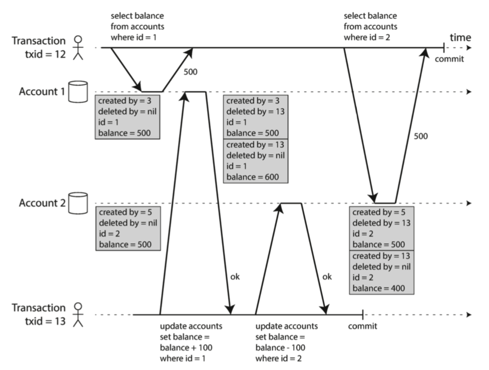
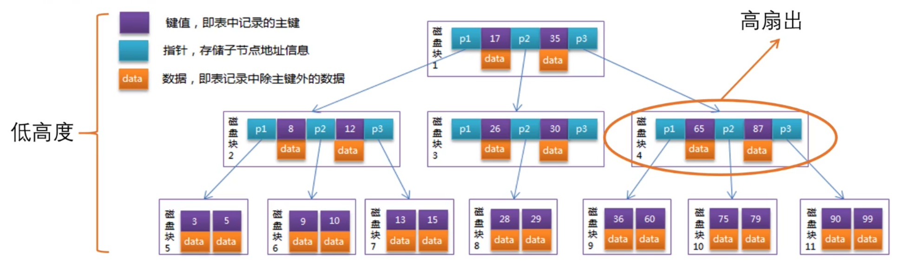
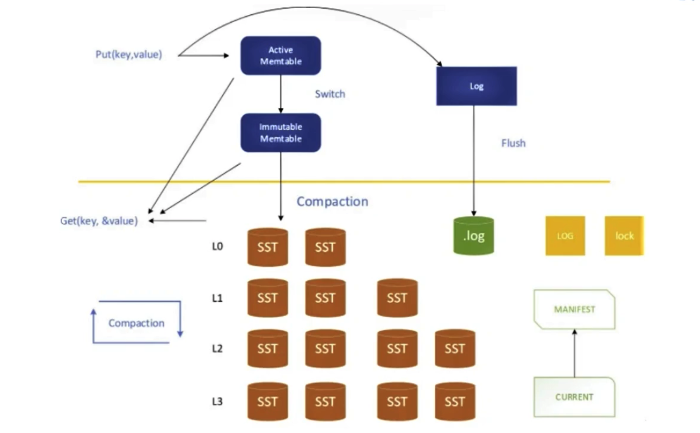
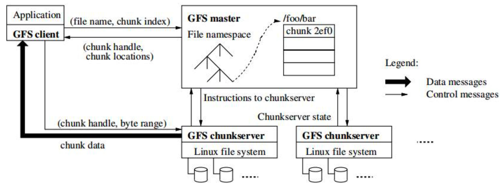
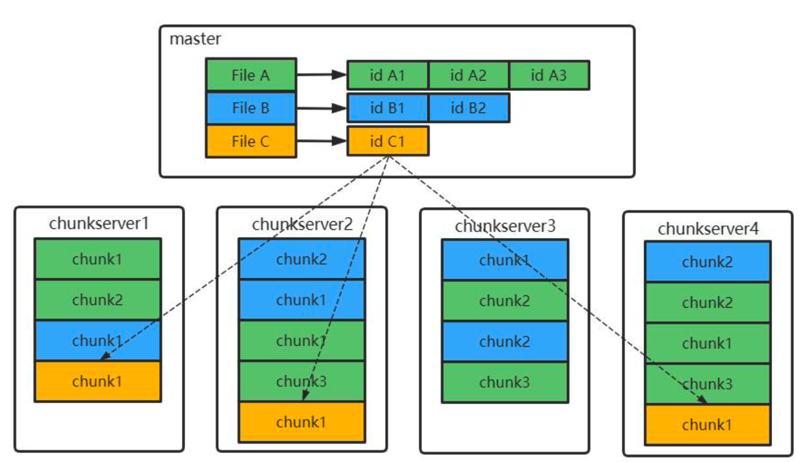
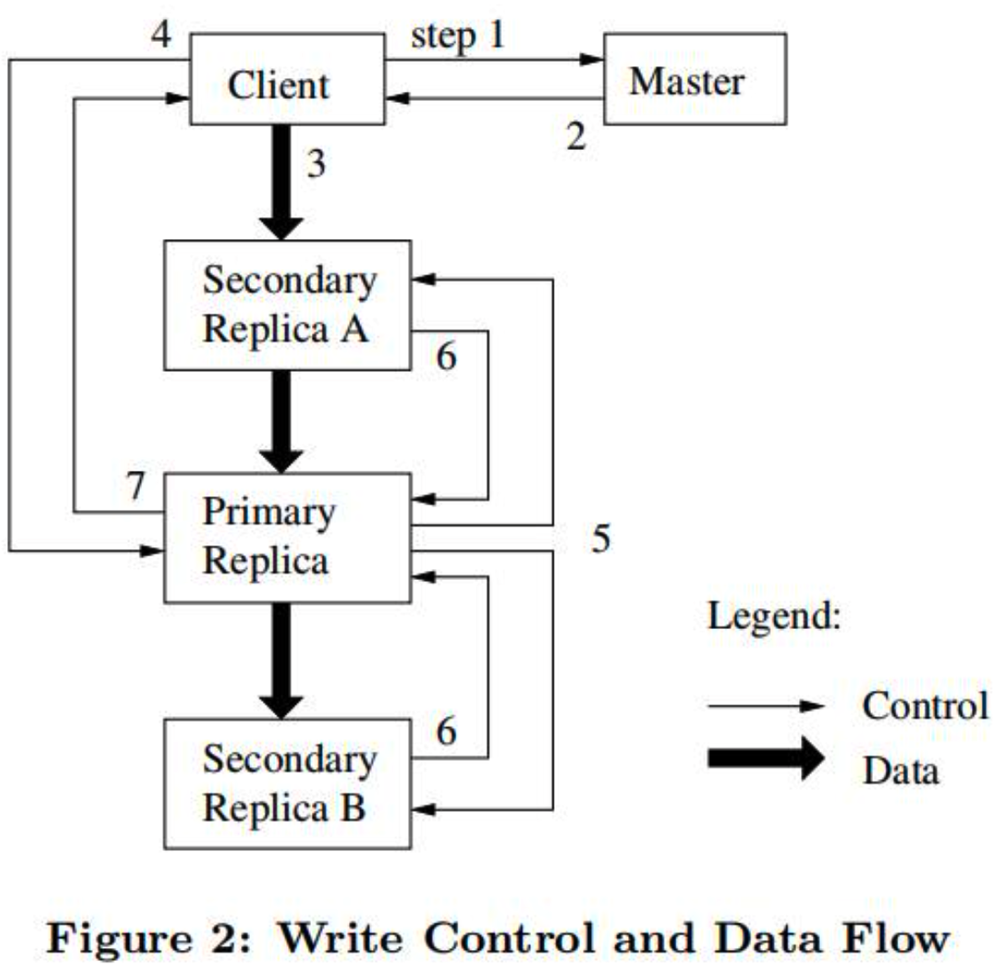

[toc]


# | 分布式理论

## || 定理

### CAP 定理

分区不可避免，C/A要进行取舍。


**Consistency 一致性**

数据在多个副本之间能够保持一致；

强调数据正确

- 每次读取都能读取到最新写入的数据
- 但如果数据不一致，则无法访问

> 区别 ACID 中的 C：事务操作前后，数据的完整性保持一致


**Availability 可用性**

系统提供的服务必须一直处于可用的状态；

强调可用性

- 每次读取都能得到响应数据

- 但不保证数据是最新的/正确的


**Partition Tolerance 分区容错性**

出现网络分区错误时，部分节点彼此失联时，系统也需正确地提供服务。

<u>不可用方法</u>

- 激进剔除

  > 一旦发现节点不可达，则剔除，并选出新主。
  >
  > 问题：导致双主

- 保守停止

  > 一旦发现节点不可达，则停止自己的服务。
  >
  > 问题： 整个系统不可用

<u>可用方法</u>

- **Static Quorum** 
  - 固定票数：大于固定票数的分区为活动分区，`固定票数 <= 总节点数 <= 2 * 固定票数 - 1`
  - 问题
    - 分区多时，不容易找到符合条件的分区
    - 票数固定，不适用于动态加入节点
- **Keep Majority** 
  - 保留多数节点的子集群
  - 问题
    - 分区多时，不容易找到符合条件的分区
    - 偶数时如何解决？叠加策略：保留节点ID最小的
- **仲裁机制** 
  - 选主：拥有全局心跳信息，据此判断有多个少分区、保留那个子集群
  - 仲裁者为第三方组件

  - 问题
    - 仲裁者的可靠性
- **共享资源方式**
  - 分布式锁：哪个子集群获得锁，就保留谁
  - 问题
    - 如果获得锁后发生故障，但未释放锁？


**CA 场景：放弃分区容错性**

> 假设节点之间通信永远可靠，单机系统

- **含义**

  - 关注一致性、可用性

  - 需要全体一致性协议：例如 2PC

  - 不能容忍网络错误：此时整个系统会拒绝写请求，变成只读

- **例子**

  - **Oracle RAC**，通过共享磁盘避免网络分区

  - zookeeper --> CP?

    在选出新leader之前，不对外提供服务，岂不是不保证A?

  - 单机版 MySql


**CP 场景：放弃可用性**

> 适用对数据质量要求很高的场景，例如金钱交易

- **含义**
  - 关注一致性、分区容忍性

  - 需要多数人一致性协议：例如Paxos

  - 保证大多数节点数据一致，少数节点在没有同步到最新数据时会变成不可用状态。
    在等待期间系统不可用

- **例子**
  
  - **Hbase**
  
  
  
  - Etcd
  - Consul
  - BigTable
  - MongoDB
  - BookKeeper
  - **Kafka** 
    - Unclean 领导者选举，会导致 CP --> AP


**AP 场景：放弃一致性**

> 最终一致性，放弃强一致性；主流选择

- **含义**
  - 关心可用性、分区容忍性
  - 这样的系统不可能达成一致性

- **例子**
  - **Redis** 等 NoSQL 产品
- Kafka
  - DynamoDB
  - Cassandra
  - Eureka


### BASE 理论

**Basiccally Available**

分布式系统出现故障的时候，允许损失部分可用性。

例如：Latency 损失、降级。


**Soft State** 

允许系统存在中间状态，而该中间状态不影响系统整体可用性。

例如：副本同步的延时。


**Eventual Consistency**

系统中所有数据副本经过一定时间后，最终能够达到一致的状态

变种：

- **读己之所写 Read Your Writes**

  - 要求：自己写入成功的任何数据，下一刻一定能读到。
  - 实现：写入节点如果是 副本R1，则后续的读取操作也要打到该节点。

  

- **单调读一致性 Monotonic read consistency**

  - 要求：用户一旦读到某个值，就不会读到比这个值更旧的值。
  - 实现：将用户与副本建立固定的映射关系，类似会话粘滞。

- 单调写一致性 Monotonic write consistency

- 前缀一致性 Consistent Prefix

  - 保持因果顺序，例如现有 Q 再有 A

- 会话一致性 Session Consistency

- 因果一致性 Causal Consistency


### 挑战

**通讯异常**

- 内存访问 10ns，网络访问 0.1-1ms

- 延迟 100 倍

**网络分区**

- 脑裂

- 出现局部小集群

**三态**

- 成功

- 失败

- 超时：发送时丢失、响应丢失

**节点故障**


## || 定律

**墨菲定律**：凡事只要有可能出错，那就一定会出错。

> **Murphy’s Law**: Anything that can go wrong will go wrong.


**布鲁克定律**：为已经延期的软件项目增加人手只会让项目延期得更厉害。

> Brook’s Law


**霍夫施塔特定律**：即使你考虑到了霍夫施塔特定律，项目的实际完成时间总是比预期的要长。

> Hofstadter’s Law


**康威定律**：软件的结构反映了开发软件的组织的结构。

> Conway’s Law
>
> 组织所设计的系统的结构受限于组织的通信结构。


**波斯托定律**：又称鲁棒性法则；保守输出，自由输入。

> Postel’s Law


**帕累托法则**：又称80/20 法则；对于很多现象，80％的后果源于 20％的原因。

> Pareto Principle


**彼得法则**：在一个等级制度中，每个员工都倾向于晋升到他无法胜任的职位。

> The Peter Principle


基尔霍夫法则：在密码学中，系统应该是安全的，即使系统的所有东西都是公开的——除了一小部分信息——秘钥。

> Kerchkhoff’s Principle


莱纳斯定律：如果有足够多的眼睛，所有的 bug 都将无所遁形。

> Linus’s Law


**摩尔定律**：单位成本的计算机算力每 24 个月翻一番。(计算机的处理速度每两年翻一番！)

> Moore’s Law


沃斯定律：软件比硬件更容易变慢。

> Wirth’s Law


**九九法则**：前 90％的代码占用了 10％的时间，其余的 10％代码占用了剩下的 90％时间。

> Ninety-Ninety Rule


**克努特优化法则**：过早优化是万恶之源。

> Knuth’s Optimization Principle


诺维格定律：任何超过 50％渗透率的技术都不会再次翻倍（无论在多少个月内）。

> Norvig’s Law


## || 架构演进

**1. 原始分布式时代**

- DCE, Distributed Computing Environment 定义了分布式服务规范和参考实现。


**2. 单体系统**

- 定义：Self-contained，自包含；并非“不可拆分”，而是拆分后欠缺自治与隔离：一个模块故障会影响全局。


**3. SOA**

- 服务拆分的几种架构
  - **烟囱式架构：Information Silo Architecture**
    - 各模块完全独立，使用独立的数据库、服务器；
    - 缺点：不好共享。
  - **微内核架构：Micro-kernel Architecture**
    - 公共服务作为核心 Core System；
    - 其他业务作为插件模块 Plugin Module；
    - 缺点：假设各插件无直接交互。
  - **事件驱动架构：Event-Driven Architecture**
- SOA 缺点：过于严格的规范定义，带来过度的复杂性


**4. 微服务**

- 特征
  - **围绕业务能力构建：Organized Around Business Capability**
    - 康威定律
  - **分散治理：Decentralized Governance**
    - Dev ops
  - **通过服务来实现独立自治的组件： Componentization  via Service**
    - 通过服务而非类库来构建组件
  - **产品化思维：Product not Project**
    - Dev ops，并关注产品的整个方面
  - **数据去中心化：Decentralized Data Management**
    - 数据隔离，带来分布式一致性挑战
  - **强终端弱管道：Smart Endpoint & Dumb Pipe**
    - 强终端 - Service Mesh, Side car
  - **容错性设计：Design for Failure**
    - 快速故障检测、出错时进行隔离
  - **演进式设计：Evolutionary Design**
    - 承认服务会被报废淘汰，不要让系统中出现无可替代的服务
  - **基础设施自动化：Infrastructure Automation**
    - 例如 CICD，减少构建部署的复杂性


**5. 云原生时代**

- 又称后微服务时代。
- 从硬件角度，解决分布式架构中出现的问题。（例如注册发现、跟踪治理、负载均衡、传输通信）
- 技术
  - K8S
  - Service Mesh: Sidecar


**6. 无服务时代**

- 组件
  - 后端服务
  - 函数
- 愿景
  - 无需考虑技术组件、部署、算力、运维


## || 分布式中间件

**NoSql**

|          | Memcached                                               | Redis                                                        | MongoDB                                                      |
| -------- | ------------------------------------------------------- | ------------------------------------------------------------ | ------------------------------------------------------------ |
| 功能     | KV                                                      | KV                                                           | 常用命令：<br />`show dbs / collections` `use db1` `db.collection1.find();` |
| 内存机制 | 内存机制：Slab，解决了内存碎片问题 但无法有效利用内存   | Redis知识图谱 http://naotu.baidu.com/file/3200a19ccc62cf25a318cdf75def4211 |                                                              |
| 问题     | 对比 Redis 缺失：数据类型、持久化、分布式、内存管理slot |                                                              |                                                              |


**MQ**

|      | RabbitMQ                                                     | RocketMQ                             | Kafka                                                        | Pulsar                           |
| ---- | ------------------------------------------------------------ | ------------------------------------ | ------------------------------------------------------------ | -------------------------------- |
| 特点 | 轻量级；Exchange：处于Producer、Queue之间，路由规则灵活      | 时延小；Broker事务反查：支持事务消息 | 集群成员对等，没有中心主节点； 与周边生态系统集成好； 性能好； CA | 存算分离；                       |
| 功能 | 优先级队列、延迟队列                                         | 延迟队列，消息过滤；半消息           |                                                              | 优先级队列、延迟队列             |
| 问题 | 对消息堆积不友好，会导致性能急剧下降；性能不佳；Erlang语言小众 | 与周边生态系统的集成和兼容不佳       | 异步收发消息时延小，但同步时延高；批量发送，数据量小时反而时延高 | 性能有损失：多一次请求BookKeeper |


# | 分布式问题

分布式要义：如何基于不可靠的组件，构建出可靠的系统。


## || 网络不可靠

- 为什么不可靠：网络拥塞

  - 交换机队列、OS队列
  - 发送端 TCP 流控/背压
  - TCP 重试会增加延时

- 解决：超时重试

- 问题：如何确定超时时长

  - 太短：导致节点过早被认为宕机，职责转移到其他节点，给其他节点带来额外负担。特别是当高负载时，会导致 cascading failure. 
  - 太长：failure detection delay
  - 理想情况 timeout = `2d + r`，d=网络传输，r=处理时间。但问题是 d可能无上限。
  - 可以基于实验确定，或者动态设置超时时间；参考 Akka、Cassandra。

  

## || 时钟不可靠


# | 分布式协同


## || 分布式互斥/锁

**作用**

- 排他性的资源访问
- Distributed Mutual Exclusion
  - Critical Resource 临界资源

**场景**

- 订单 消息处理
- 订单ID是共享资源，处理时要加锁；防止重复消息
  - 但锁并不保证幂等，需要业务保证 （例如处理之前查询订单状态）

**算法**

**1. 集中式算法**

- 实现

  - 每个程序在需要访问临界资源时，先给协调者发送一个请求。如果当前没有其他程序使用这个资源，协调者直接授权请求程序访问；

  - 否则，按照先来后到的顺序为请求程序“排一个号”。如果有程序使用完资源，则通知协调者，协调者从“排号”的队列里取出排在最前面的请求，并给它发送授权消息。拿到授权消息的程序，可以直接去访问临界资源。


- 优点
  - 简单、容易实现


- 缺点
  - 引入协调者；可用性、性能受协调者影响


**2. 分布式算法**

- 实现
  - 当一个程序要访问临界资源时，先向系统中的其他程序发送一条请求消息，在接收到所有程序返回的同意消息后，才可以访问临界资源。


- 缺点

  - 消息数量指数增加；可用性低

    > 消息要发给所有节点；一个节点挂了 就不可用；
    >
    > --> 改进：检测到节点故障则忽略它。


- 适用场景
  - 适合节点少，且变动不频繁的系统：Hadoop 修改 HDFS 文件


**3. 令牌环算法**

- 实现
  - 所有程序构成一个环结构，令牌按照顺时针（或逆时针）方向在程序之间传递，收到令牌的程序有权访问临界资源，访问完成后将令牌传送到下一个程序；若该程序不需要访问临界资源，则直接把令牌传送给下一个程序。


- 特点

  - 通信效率高，公平；

  - 但也有无效通信。


- 适用场景
  - 适用于规模较小，每个程序使用临界资源的频率高，且用时短的场景。


**实现方式**

**1. 数据库**

- 实现

  - 唯一索引

  - for update: `select id from order where order_no= 'xxxx' for update`


- 原理

  - 加锁：增加一条记录；


  - 放锁：删除


  - 通过唯一性约束保证互斥


- 问题

  - 单点故障


  - 死锁：若记录一直删不掉？


**2. Redis**

- 原理
  - **SETNX + Expire**


```
public static boolean tryGetDistributedLock(Jedis jedis, String lockKey, String requestId, int expireTime) {

    Long result = jedis.setnx(lockKey, requestId);// 设置锁
    if (result == 1) {// 获取锁成功
        // 若在这里程序突然崩溃，则无法设置过期时间，将发生死锁
        jedis.expire(lockKey, expireTime);// 通过过期时间删除锁
        return true;
    }
    return false;
}

```

25.12之后：

```
String result = jedis.set(
  key, 
  requestId,
  "NX",
  "PX", expireTi);
```


- 问题

  - 无法续租：执行业务时间可能超过过期时间


  - AP
    - 集群同步是异步的，Master获取锁后，在同步之前崩溃了；新master是不认识这个锁的
    - 而若用单实例，则可能阻塞业务流程


- 解决：Redisson RedLock算法 (?)

  - 节点超半数


  - CP ?


- 优点

  - 性能最好

  

**3. ZooKeeper**

首选！

- 原理

  - 临时顺序节点 + Watch前一节点
    - 避免羊群效应


  - 最小节点获得锁


  - Paxos --> ZAB 协议


- 问题

  - 频繁创建删除节点，性能不及redis


  - 如何实现续租 (?)


**4. Chubby**

- 客户端缓存
  
- 作用： 提升性能
  
- 缓存一致性

  - 租期

    - 修改 Master 元数据时：

      > 先向所有客户端通过 KeepAlive 响应发送缓存过期信号；
      >
      > 客户端返回：要求更新缓存、或允许缓存租期过期；
      >
      > 然后 Master 再继续进行之前的修改操作

    - 客户端租期到期时：向服务器续订租期

  - 类似 Expire + MQ 更新缓存

- 分布式锁错乱

  - Client-1 获取到锁，并发出请求，但迟迟没有到达服务器；被认为失败，并让Client-2 获取到锁，执行请求；

  - 之后 Client-1的请求达到服务器并被处理，覆盖了 Client-2的请求；

  - 方案：

    - 锁延迟 lock-delay

      > 如果客户端主动释放锁，则马上放锁；
      >
      > 如果客户端异常（例如无响应）而释放锁，则服务器再保留一定的时间；
      >
      > Chubby 用此方案。

    - 锁序列器

      > 客户端操作资源时，同时带上锁序列器（锁名，模式，序号）；
      >
      > 服务器会检查锁序列器是否有效；
      >
      > Chubby 也提供此方案。


**5. etcd**

- 原理：Raft 协议


## || 分布式选举

**作用**

- 负责对其他节点的协调和管理；保证其他节点的有序运行


**算法**

**1. Bully 算法**

> 在所有存活节点中，选取ID最大的为主节点

- 角色

  - 普通节点

  - 主节点


- 流程

1. 节点判断自己的 ID 是否为当前存活的最大 ID，如果是，则直接向其他节点发送 Victory 消息，宣誓自己的主权。 
2. 节点向比自己 ID 大的节点发送 Election 消息，等待 Alive 回复。
3. 如果给定时间内未收到 Alive 回复，则认为自己成为主节点，向其他节点发送 Victory 消息
4. 如果收到 Alive 回复，则继续等待 Victory 消息；


- 优点
  - 选举速度快、算法复杂度低；


- 缺点

  - 每个节点有全局的节点信息，额外信息存储多；

  - ID 大的节点不稳定时会触发频繁切主；


**2. Raft 算法**

> 多数派投票选举

- 角色

  - Leader 节点


  - Candidate 节点


  - Follower 节点


- 流程

1. 初始化时都是 Follower；开始选主时所有节点转化为 Candidate，并向其他节点发送选举请求；
2. 其他节点根据收到的选举请求的**先后顺序**，回复是否同意成为主；
3. 若获得超过一半投票，则成成为主，状态变为 Leader；其他节点 Candidate --> Follower；
4. Leader 任期到了，则 Leader --> Follower，进入新一轮选主


- 优点

  - 选举速度快、算法复杂度低；

  - 稳定度较 Bully好：新节点加入时会触发选主，但不一定会触发切主；


- 缺点
  - 节点互相通信，通信量大


**3. ZAB 算法**

> ZooKeeper Atomic Broadcast：在 Raft 基础上，保证数据新的节点优先成为主：server_id + server_zxID


- 每个节点都有唯一的三元组：

  - `server_id`: 本节点 ID

  - `server_zxID`: 本节点存放的数据 ID

  - `epoch`: 当前选举轮数


- 原则：

  - `server_zxID` 最大者成为Leader;

  - 若相同，则 `server_id` 最大者成为Leader;


- 角色

  - Leader

  - Follower

  - Observer


- 流程

1. 刚启动时，都推选自己，选票信息 `<epoch, vote_id, vote_zxID>`
2. 因为 epoch\zxID 都相同，server_id较大者会成为推选对象；其他节点会更新自己的投票并广播


- 优点

  - 性能高；

  - 稳定性好，新节点加入会触发选主，但不一定触发切主；


- 缺点

  - 广播方式发送信息，通信量大；

  - 选举时间较长，除了投票还要对比节点 ID 和数据 ID；


## || 分布式共识


为什么需要分布式共识？

- Distributed Consensus：为了实现“复制状态机”

  - 分布式系统内部容忍暂时的不同状态，但最终保证大多数节点状态达成一致；同时分布式系统在外部看来始终表现出整体一致的结果。
  - 扩展：两个副本一个采用行存储、另一个采用列存储；实现 HTAP。
- 问题演进
  - Scalability：构建分布式存储，是为了扩区更大的存储容量。
  - Sharding：为了获取更大的存储容量，就必须把数据进行分片。
  - Fault：而更多的机器会带来更高的出错频率。
  - Replication：为了容错，就要对每个分片建立副本。
  - Consensus：而为了维持副本之前的一致，就要引入共识算法。


分布式共识的复杂度来源：

- 系统内部各节点通信是不可靠的。
- 系统外部各用户访问是可并发的。


属性

- **Safety - 协定性**：所有的坏事都不会发生。
  - 例如，选主的结果一定且只有唯一的一个主节点。

- **Liveness - 终止性**：所有的好事都终将发生，但不知道是什么时候发生
  - 例如，选主过程一定可以在某个时刻结 束。


区块链

**算法**

**1. PoW: Proof of Work**

比计算能力

**2. PoS: Proof of Stake**

权益是指占有货币的数量和时间

**3. DPoS: Delegated Proof of Stake**

解决PoS的垄断问题 


### Paxos

> - https://ongardie.net/static/raft/userstudy/ 
>
> - https://www.youtube.com/watch?v=JEpsBg0AO6o
>   
> - https://ongardie.net/static/raft/userstudy/paxos.pdf 


- 三种类型的节点
  - **Proposer - 提案节点**
    - 提出对某个值进行设置操作的节点
  - **Acceptor - 决策节点**
    - 决定提案是否可被投票、是否可被接受。一般为奇数个。 
    - 提案一旦得到过半数决策节点接受，即称该提案被批准，意味着该值不能被更改、也不会丢失，且最终所有节点都会接受它。
  - **Learner - 记录节点**
    - 只单纯从提案节点、决策节点学习已经达成共识的提案。
- 约定
  - P1: 一个Acceptor必须批准它收到的第一个提案
  - P2: 如果提案 [M0, V0] 被选定，那么所有比编号 M0 更高的、且被选定的提案，其Value必须也是 V0
    - [M0, V0] 被选定，则所有比 M0 编号更高的、且被Acceptor批准的提案，其Value必须也是V0
    - [M0, V0] 被选定，则之后任何 Proposer 产生的编号更高的提案，其Value都是 V0


**方案演进**

**1. Strawman: Single Acceptor**

- 问题：acceptor crashes after choosing

- 解决：**quorum**，Value is **chosen** if accepted by **majority** of acceptors.

  > - Accept: 临时性?
  > - Chosen: accepted by majority.


**2. Problem: Split Votes**

- 问题：如果 Acceptor 仅接受其收到的**第一个** value？如果并发 proposal，可能任一 proposal 都无法获得多数 quorum，则任一value都无法被 chosen。
- 解决：**Acceptors must sometimes accept multiple (different) values**


**3. Problem: Conflicting Choices**

- 问题：如果 Acceptor 接受其收到的**所有**value？则可能导致 choose 多个值。--> 违反 Safety 要求。

- 解决：Once a value has been chosen, future proposals must propose/choose that same value (**2-phase protocol**)

  > S5 在提交 proposal 之前，要检查当前是否已有其他 proposal已被chosen。S5需要放弃propose blue，而propose red


- 问题2：即便有 2-phase protocol，还是可能冲突：在 proposal red 未被 majority accept 之前有新的proposal被提出。

- 解决：Must **order** proposals, reject old ones.

  > S3 应该拒绝 S1 的proposal


**4. 如何实现 Order Proposal?**

- Unique proposal number: `Round Number` + `Server ID`
  - Proposer 需要持久化 maxRound，避免宕机后重用以前的 proposal number。


**流程**

**Phase 1: broadcast `Prepare` RPCs**

- 目的

  - Find out about any chosen values;  --> 如果有，则用它，而放弃自己的proposal
  - Block older proposals that have not yet completed;
  - 相当于抢锁。

- **流程**

  - 1）*Proposer*：选择 proposal number = n；
  - 2）*Proposer*：广播 `Prepare(n)`；
  - 3）*Acceptor*：响应 `Prepare(n)`，
    - 如果 n > **minProposal**，则重设 minProposal = n；
    - 返回已接受的最高 proposal `(acceptedProposal, acceptedValue)`；
  - 4）*Proposer*：收到majority响应后，将提案值改为 `value = max(acceptedValue)`；

  > Acceptor 给予提案节点**两个承诺**：
  >
  > - 承诺以后不再接受 ID <= n 的 Prepare 请求；--> 通过 minProposal 实现
  > - 承诺以后不再接受 ID < n 的 Accept 请求。
  >
  > Acceptor 返回**一个应答**：
  >
  > - 在满足承诺的前提下，返回已批准过的最大ID 提案中的值、和提案 ID；
  > - 否则忽略该 Prepare 请求。-- ?

**Phase 2: boardcast `Accept` RPCs**

- 目的

  - Ask acceptors to accept a specific value. 

- **流程**

  - 5）*Proposer*：广播 `Accept(n, value)`；
  - 6）*Acceptor*：响应 `Accept(n, value)`，
    - 如果 n < minProposal，则拒绝；
    - 如果 n >= minProposal，则接受，设置 **acceptedProposal** = minProposal = n，**acceptedValue** = value；
    - 返回 `minProposal`
  - 7）*Proposer*：如果有任何拒绝 ( `result > n`)，则证明有最新的提交，goto step-1；否则表明 value 被 **chosen**. 

  > 如果 Proposer 收到半数以上的 Acceptor 响应结果，则产生 [Mn, Vn] 提案
  >
  > - Vn = 响应中编号最大提案的 Value：此时无条件接受已有提案值。
  > - 或者响应中无内容，则 Vn = Proposer 任意选择 
  >
  > 确认提案后，提交给 某个 Acceptor 集合；
  >
  > 只要 Acceptor 没有对 > Mn 的Prepare请求作出响应，则其可以通过该提案


- Acceptor 必须持久化存储如下值：
  - **minProposal**：acceptor以后能接受的最小 proposal
  - acceptedProposal
  - acceptedValue


**Optional：Learner 获取提案**

- 流程
  - Acceptor 将他们对提案的批准情况，发给一个特定的Learner集合；
  - 该集合中的 Learner 随后通知所有其他 learner
- 演进
  - 为什么 Acceptor 不直接通知所有 Leaner?
    -- 逐一通信，次数M*N 
  - 为什么 Acceptor 不只发给一个 主Leaner，再由主Leaner通知其他？
    -- 单点问题
    	

Q：提案 被半数 Acceptor 接收后，如何发布给其他 Acceptor？


**Competing Proposer 案例**

**案例1：Previous value already chosen**

- S3 在收到 `P4.5` prepare 请求后，返回 acceptedProposal = `P3.1`, acceptedValue = `X`；
- S5 收到响应后，放弃自己的propose value `Y` 并改为 `X`，再广播给 acceptors. 
- 结果：新 proposer 会发现 previous value 已被 chosen，并继续使用它.


**案例2：Previous value not chosen, but new proposer sees it**

- 同案例1
- 结果：新 proposer 会使用已有值，新旧 proposer 均将成功 并使用同一值。


**案例3：Previous value not chosen, new propose does NOT see it**

- S3 在收到 `P4.5` prepare 请求后，成功；S5 收到响应后，继续自己的propose value `Y` ，广播给 acceptors. 
- S3 后续收到 `A3.1` accept 请求后，返回 `minProposal = 4.5`；S1 收到响应后重新走 step-1；
- 结果：新 proposer 成功执行，老 proposer 被block。


**案例4：活锁，Competing proposers can livelock**

- S3 收到 `A3.1` accept 请求后，返回minProposal = 3.5；S1 收到响应后重新 prepare(4.1)；
- S3 收到 `A3.5` accept 请求后，返回minProposal = 4.1；S5 收到响应后重新 prepare(5.5)；...
- 方案一：重新prepare之前加入**随机延迟**。以便让其他 propser 有机会完成先。
- 方案二：加入 **Leader Election** (Multi-Paxos)


> Notes:
>
> - 只有 proposer 知道哪个值被 chosen；
> - 如果其他服务器想要知道 chosen value，需要执行 paxos proposal 才行；


### Multi-Paxos

TODO


### Raft

> - 动画：http://thesecretlivesofdata.com/raft/
>
> - git：https://raft.github.io/ 
>
> - https://www.youtube.com/watch?v=YbZ3zDzDnrw
>   https://ongardie.net/static/raft/userstudy/raft.pdf


要解决 Paxos 的问题：

- 节点是对等的，可能形成活锁 Live Lock：两个提案节点交替使用更大的ID、准备阶段成功、批准阶段失败。


**思路**

- 增加**选主**过程，在平等节点中挑选意见领袖：希望既不破坏 Paxos ”众节点平等“的原则，又能在提案节点中实现主次之分、限制每个节点都有不受控的提案权利。

- 只有”主提案节点“才能提提案，其他节点收到请求都转发给主。

  > 即无需”准备阶段“

- 主节点记录”任期编号“，以防网络分区。


达成共识等价于解决一下**三个问题**：

- 领导者选举  `Leader Election`
- 日志复制：如何把数据复制到各个节点上 Log Replication`
- 安全性：如何保证过程是安全的 `Safety`


**概念**

- **节点类型**
  - Leader -- Candidate -- Follower
  - 状态机
    

- **任期：Term**

  - Raft 把时间划分为不同 Term，每个 Term 从一次选举开始；每个Term有一个或〇个 Leader。

  - 每个节点都持久化”current term“相关的取值。

    

- **两种 RPC 请求**

  - RequestVote：请求投票

  - AppendEntries：追加条目、保持心跳

- **Log Structure**

  - Log = entry list

  - Entry = 

    - `command` 状态机指令
    - `term id` Leader 任期号，用于检测多个日志副本之间的不一致情况、判定节点状态、判断节点空缺了哪个任期；
    - `index` 日志索引

  - Committed: 被多数节点写入。

    


**Raft 子问题一：Leader Election 领导者选举**

> http://thesecretlivesofdata.com/raft/#election 
>
> https://www.bilibili.com/video/BV1uF411G7vc/

- **优点：**

  - 性能好：只需等待性能最佳的多数节点返回。

- Raft 有两类超时设置

  - `electionTimeout`：follower 等待变成 candidate的时间，150ms ~ 300ms随机值。
  - `heartbeatTimeout`：发送 AppendEntries 消息的时间间隔。

- **Leader Election 流程**

  - **1. 开始投票：**当 electionTimeout 到期后，Follower 变成 candidate、开启新一轮选主 `election term`：增加TermId、转到 Candidate 状态、投票给自己、并行发送 `RequestVote` RPC 请求给所有其他节点。

  - **2. 选出领导者：**如果其他节点在本轮尚未做出投票，则投票给该 candidate、并重置 election timeout。当 candidate 收到多数投票后，则成为 Leader。

    > 若出现 **split vote**，例如两个candidate节点均无法获得多数投票，则重试：增加 term id、重新选举。

  - **3. 心跳：**Leader 被选出后开始以 heartbeat timeout 时间间隔定期发送 `AppendEntries` 消息给 follower；follower 返回响应。

    > 若一个 Follower (在election timeout 内) 未收到 heartbeat，变成 candidate、重新触发选主。
    >
    > 若一个 Leader / Follower 收到的 term id比自己的大，则发现自己的任期号过期，立即回到 Follower 状态。


- **扩展：Picking the best leader**

  - 应该选择尽量包含所有已提交 entry 的 candidate 作为新 Leader。
    During elections, choose candidate with log most likely to contain all committed entries

    - `RequestVote` 请求中包含当前节点 last entry 的 `index & item`；

    - Voting 节点对比该值，如果觉得自己更完整则拒绝该 `RequestVote` 请求：

      ```
      (lastTerm-V > lastTerm-C) || 
      (lastTerm-V == lastTerm-C) && (lastIndex-V > lastIndex-C)
      ```

  - For a leader to decide an entry is committed: 

    - Must be stored on a majority of servers.
    - NEW: At least one new entry from leader’s term must also be stored on majority of servers


**Raft 子问题二：Log Replication 日志复制**

> http://thesecretlivesofdata.com/raft/#replication
>
> https://www.bilibili.com/video/BV1VY4y1e7px

- **Log Replication 流程**

  - **1. Leader 写入日志：**Leader 收到客户端请求后，先记入本地 `node log`（未提交，不会即时修改`node value`）；


  - **2. AppendEntries：**Leader 通过 heartbeat  `AppendEntries` 请求将修改复制到 Follower 节点 log；


  - **3. 提交：**等待多数返回后，Leader 提交日志、并执行对应的状态机指令，写入 `node value`。


  - 然后 Leader 通知 Follower 节点该 entry 已提交，集群达成共识。


- **Log Replication 流程（网络分区时）**

  - LeaderA 收到客户端请求后， `Append Entries` 请求在分区A内无法获得多数返回，则其 log entry 保持为 uncommitted 状态。

  - 同时另一个 LeaderB 收到另一请求，成功写入，在分区B内达成共识。

  - 网络恢复后，LeaderA 发现有更高的 election term、则分区A内节点会回滚 uncommitted entry，并同步新 LeaderB 的日志。


- **Raft 一致性检查：**

  - 目的：保证一个 entry 被接受的话，之前的entry也一定已被接受。

  - 场景：Follower 崩溃后恢复。保证 follower 能按顺序恢复崩溃后缺失的日志。

  - AppendEntries 请求会带上前一个日志条目的 Term ID + Index，follower 如果不包含该该 preceding entry 则会拒绝该请求。Leader 收到拒绝后，会发送前一个日志条目，逐渐向前定位到 follower 第一个缺失的日志、补齐所有缺失的日志。--> Follower 中额外的日志会被覆盖掉（因为这些日志一定没有被提交，不违反一致性）。

    > 优化：follower 返回最后一个日志索引？或者往回找的时候 二分查找？
    >
    > - Raft 作者认为不必要，失败不经常发生。


**Raft 子问题三：安全性**

目的：

- 光靠领导者选举 + 日志复制，无法完全保证每一个状态机都按照相同的**顺序**执行相同的命令。
- 保证日志有序、无空洞。


完善边界条件规则：

- **Leader 宕机处理：选举限制**
  - **增加限制**：被选出来的 Leader 一定包含了之前各任期的所有 Committed Entries.  
  - **解决问题**：follower 落后 leader 若干日志（但没有遗漏一整个任期），那么下次选举其任期号 + 1、依旧有可能当选 leader、之后无法补齐之前缺失的日志，造成状态机之间的不一致。
  - **实现**：RequestVote 请求中包含 candidate 的日志信息（`lastLogIndex`, `lastLogTerm`），如果投票者自己的日志比该 candidate 还新，则拒绝该投票。
- **Leader 宕机处理：新 Leader 是否提交之前任期内的日志条目**
  - Leader 在提交某个日志条目之后崩溃，则新 Leader 会试图完成该日志条目的**复制**，而非提交。
  - 这些被复制的老日志何时被提交？—— 新 Leader 提交一个新日志时，同时提交老日志。可以避免老任期内的日志被覆盖。——no-op 补丁：不等新日志，直接发送一个空请求
  - Raft 永远不会通过计算副本数目的方式，来提交**之前任期**内的日志条目。 只有 leader **当前任期内**的日志条目才通过计算副本数目的方式来提交。(??? --> https://www.bilibili.com/video/BV1S94y1d7iY )
- **Follower 和 Candidate 宕机处理：**
  - 宕机后，后续发给他们的 RequestVote 和 AppendEntries RPC 都会失败、无限重试。
- **时间与可用性限制：**
  - Raft 不依赖客观时间，即便后发的 RPC 先到，也不会影响 Raft 正确性。
  - 广播时间（broadcastTime，RPC 时间）<< 选举超时时间（electionTimeout）<< 平均故障时间（MTBF）


**Repairing Follower Logs 流程**

- 新选出的 Leader 必须把 Follower log 弄成与自己的log一致：
  - Delete extraneous entries
  - Fill in missing entries
- 实现方式
  - Leader 为每个 follower 维护一个 `nextIndex` ，初始值 = `leader's last index + 1`；表示 Index of next log entry to send to that follower。
  - 当 `AppendEntries` Consistency Check 失败，`nextIndex`会被往前推并重试。
    


属性

- **Safety**: If a leader has decided that a log entry is **committed**, that entry will be present in the logs of all future leaders. 
  --> 一旦 log entry apply 到状态机，则其他状态机不会对相同 log entry apply 不同的值。
  - Leader 永不覆盖其log中的entry；-- append only
  - 只有 leader log 中存在的 entry 才能被提交；
  - Entry 必须在被apply到状态机前提交；


**集群成员变更**

- 难点：避免脑裂
- 解决1：**Joint Consensus 联合一致**
  - 预备阶段：新增的节点为只读状态，追日志。
  - 第一阶段：Joint Consensus 联合一致状态。所有 RPC 都需要在新旧两个配置中都达到大多数才算成功。
  - 第二阶段：切换到新配置。
- 解决2：**单节点变更方法**，一次只增减一个节点
  - 缺点：不支持一步完成机器替换
  - 缺点：变更过程必然经历偶数节点状态，如发生网络分区，无法选出Leader


### ZAB

> Zookeeper Atomic Broadcast
>
> - CP
> - 支持崩溃恢复的，原子广播协议


**保证特性**

- **顺序一致性**：同一客户端的事务请求，严格按顺序执行

  > 如何做到？
  >
  > - 全局递增的唯一 事务ID：ZXID；类似 Kafka Leader Epoch
  > - Leader 为每个Follower 维护一个单独的队列，Proposal 放入队列中 FIFO

- **原子性**：所有事务请求的处理结果在集群中所有机器上的应用情况是一致的。

  ——通过version保证 ？
  
- **单一视图：**客户端无论连接哪个zk服务器，看到的数据模型都是一致的

- **可靠性：**一旦服务端成功应用一个事务，则引起的状态变更会被一致保留下来

- **实时性：**在一定时段内，客户端最终一定能从服务端读取到最新的数据状态

- **强一致性**！！C

  

**原理**

- 单一主进程

  - 单一的主进程来接收并处理所有事务请求

  - 对每个事务分配全局唯一的ZXID

    > zxid低32位：单调递增计数器
    > zxid高32位：Leader周期的epoch编号
    > 类似 kafka leaderEpoch

  - 数据的状态变更以“事务Proposal”的形式广播到所有副本进程

- 顺序应用

  > 必须能保证一个全局的变更序列被顺序应用，从而能处理依赖关系

  

**角色**

- Leader：读写
  
- Follower：读；参与Leader选举、过半写成功
  
- Observer：读；可以提升读性能，且不影响写性能

  

**协议：消息广播模式**

> 消息广播：
>
> - 所有的事务请求都会转发给Leader，Leader会为事务生成对应的Proposal，并为其分配一个全局单调递增的唯一ZXID。
>
> - 当Leader接受到半数以上的Follower发送的ACK投票，它将发送Commit给所有Follower通知其对事务进行提交，Leader本身也会提交事务，并返回给处理成功给对应的客户端。

- Leader

  - 将客户端事务请求转换成一个 事务Proposal，并分发给“所有Follower”

  - 一旦“超过半数Follower”反馈，则Leader向“所有Follower”分发Commit消息

  - 类似 两阶段提交：2PC

    > 区别：只用等待超过半数的反馈，而非所有反馈
    > 简化版 2PC：移除了中断逻辑

- 流程

  - **1. Proposal**

    - Leader为事务生成对应的 Proposal，分配 全局递增的唯一事务ID： ZXID

      > 必须将每一个事务Proposal按照其ZXID的先后顺序来进行排序与处理。

  - **2. ACK**
    
    - 等待半数以上的Follower回复ACK投票
  - **3. Commit**
    - Leader发送 Commit给“所有”Follower通知其对事务进行提交
    - `Commit消息`：消息内容只包含 ZXID；具体事务内容 Follower 上已保存；
    - `Inform消息`：Leader 发送 Inform 给Observers；Inform 和 Commit的区别：还包含事务内容
  - **4. 返回给处理成功给对应的客户端**


**协议：崩溃恢复模式**

- 触发场景

  - Leader 服务器崩溃
  - Leader 与超过半数服务器通讯异常

- **1.选举**

  - 要求

    - 对于 Leader 上“已提交”的 Proposal，确保最终被所有服务器都提交；哪怕 Leader 在 发送commit 之前宕机
    - 对于 Leader 上“已提出 但未提交”的 Proposal，要确保丢弃

  - 解决

    - 选举要保证新选出的Leader拥有最大的ZXID

  - 流程 

    > 1. 服务器状态变更。余下的非Observer机器变为 LOOKING，进入投票环节
    >
    > 2. 开始投票
    >    - 每台机器 投票：(myid, ZXID)
    >    - PK: ZXID 越大，myid 越大
    >    - Q：每个 LOOKING 节点两两通讯？通讯量岂不很大？
    > 3. 变更投票
    >    PK后更新自己的投票
    > 4. 确定 Leader
    >    是否超半数以上 接收到相同的投票信息
    > 5. 改变服务器状态
    >    FOLLOWING, LEADING


- **2.同步**

  -  作用

    - 选举结束，对外提供服务之前，检查是否完成数据同步；
    - 同步阶段的引入，能有效保证Leader在新的周期中提出Proposal之前，\n所有的进程都已经完成了对之前所有Proposal的提交。

  - 流程

    - 对需要提交的，重新放入Proposal+Commit

      > 1. Leader 为每个 Follower 维护一个队列，将没有被各Follower同步的事务以Proposal消息的形式逐个发给Follower
      >
      >  	2. 并在每一个 Proposal消息后紧接着发送一个 Commit消息

    - 对于Follower上尚未提交的Proposal，回退

      > - 首先如果Follower包含上一轮Leader周期的未提交Proposal，则其一定不会被选为新的Leader；因为 一定有 Quorum集合包含更高 epoch 的Proposal；其ZXID更大。
      > - 这种Follower与 Leader连接后，Leader会比较其最后提交的Proposal，发现改Follower要执行回退操作


### Gossip

**区别：**

- Gossip 是**最终一致性**：系统中的不一致状态可能在一定时间被外部直接观察到。
- Paxos, Raft, ZAB 是**强一致性**：不一致的情况不会被外部观察到。

**工作过程：**

- 要同步的信息如同留言一般传播、病毒一般扩散。
- 从信息源开始，以固定传播周期，随机选择相连的 k 个节点来传播消息 - Fan out
- 节点收到消息后，如果是之前没收到过的，则继续想相邻的 k 个节点传播；直到最终网络中所有节点都收到消息。

**特点：**

- 能容忍网络上节点随意增加减少。
- 没有中心化节点，鲁棒性强。

**缺点：**

- 无法准确预计需要多长时间才能达成全网一致。
- 消息冗余。


## || 分布式聚合

目的

- 聚合不同微服务的数据

**手段**

**1. Aggregator / BFF**

- 每次计算，性能不好


**2. Denormalize + Materialize the view**

- 消费Stream，实时预聚合


**3. CQRS**

> Command Query Responsibility Segregation

- 技术点

  - Command: SQL 数据库

  - Query: Cassandra / ES / Redis...

  - 同步: CDC / MQ


- 问题

  - 最终一致性，不实时；


  - 解决
    - **UI 乐观更新**：写入后 UI直接显示最新值；如果写入失败再回滚。
      - **UI 拉模式**：UI 写入时带上 version，轮询读服务查询 version 更新 UI。
      - **UI 发布订阅**：UI 写入后，订阅读服务，当有通知是更新 UI。
    
    
    

## || 分布式事务


**事务传播 Propagation**

- REQUIRED: 当前有就用当前的，没有就新建
- SUPPORTS: 当前有就用当前的，没有就算了
- MANDATORY: 当前有就用当前的，没有就抛异常
- REQUIRES_NEW: 无论有没有，都新建
- NOT_SUPPORTED: 无论有没有，都不用
- NEVER: 如果有，抛异常
- NESTED: 如果有，则在当前事务里再起一个事务


### ACID

> AID --> C：**AID 是手段、C 是目的**。（仅针对单个数据源、本地事务）
>
> AID 是数据库的属性，C 是应用程序的属性。

- **A 原子性**：要么全部执行成功，要么全部不执行；无需担心“部分失败”
  - 实现：Write-ahead log
  - 要么转账成功，要么转账失败

- **C 一致性**：事务操作前后，数据的完整性保持一致（invariants）
  - 实现：事务语义
  - 总钱数不会变

- **I 隔离性**：多个事务并发执行，不会互相干扰
  - 实现：Lock
  - A转账、B查余额，依赖于隔离级别

- **D 持久性**：一旦事务生效，其修改内容就不会丢失
  - 实现：
    - 单机：Write-ahead log，用于故障恢复
    - 分布式：写入多个副本
  - 一旦事务成功，则其做的更新被永远保存下来


**实现原子性&持久性**

- **方式一：Commit Logging，提交日志**
  - 流程
    - 修改之前将相关信息（数据位置、改前值、改后值）以日志形式记录到磁盘；
    - 提交后，即看到 Commit Record后，才会根据日志信息真正进行修改；
    - 修改完成后，在日志中加入 End Record，表示事务已完成持久化。
  - 原理
    - 日志有 Commit Record 时，重启后 Redo、保证持久性；
    - 日志无 Commit Record 时，重启后 Undo 回滚。
  - 缺点
    - 真实修改必须发生在事务提交之后，性能不佳。
- **方式二：Write-Ahead Logging，提前写入日志**
  - 原理
    - 增加 `Undo Log 回滚日志`，数据写入磁盘前必须先记录 Undo Log，以便据此进行回滚。
  - 流程
    - **Analysis 分析阶段**：从最后一次 Checkpoint 开始扫描日志，找出没有 End Record 的事务。
    - **Redo 重做阶段：**找出所有包含 Commit Record 的日志，重做写入磁盘，完成后增加 End Record。
    - **Undo 回滚阶段**：剩下的事务根据 `Undo Log` 将已写入磁盘的信息改写回去。


- **思想：FORCE & STEAL**
  将何时写入变动数据划分为 FORCE 和 STEAL 两类情况。
  - Commit Logging 允许 NO-FORCE，不允许 STEAL
  - Write Ahead Logging 允许 NO-FORCE，也允许 STEAL 
    - 优势，性能佳！
    - 通过 Undo log 回滚已写入但未提交成功的记录

|                                                              | NO-STEAL<br />提交事务前，不允许数据提前写入 | STEAL<br />提交事务前，允许数据提前写入    |
| ------------------------------------------------------------ | -------------------------------------------- | ------------------------------------------ |
| **NO-FORCE**<br />**提交事务后，不强制数据必须同时完成写入** | 过 redo log 实现                             | 通过 undo log 实现。性能最佳，复杂度也高。 |
| **FORCE**<br />**提交事务后，强制数据必须同时完成写入**      | 无需日志；实践中少用                         | 通             过 undo log 实现            |


### **隔离级别**

- 并行事务的 Race Condition 问题

  - **脏写 / Dirty Writes**：覆盖了另一事务尚未提交的写入。——所有隔离级别均能解决脏写

  - **脏读 / Dirty Reads**：读到另一事务未提交的写入。

  - **不可重复读 / Read skew**：对同一行数据的两次查询结果不同。——快照隔离解决

    > 因为缺乏贯穿事务周期的`读锁`，数据可能被另一事务修改。

  - **更新丢失 / Lost Updates**：多个事务进行 read-modify-write，一个事务覆盖了另一个的写入。——select for update

  - **写倾斜 / Write skew**：当写入时，之前读取到的前提已过时。——串行化

  - **幻读 / Phantom Reads**：一个事务改变了另一个事务的查询结果。（以致第二次读可能读到新插入的记录？）

    > 例如抢注用户名，第一次查询时未被占用、但提交时可能已被占用。
    >
    > 原因是查询时判断是否存在，而无法对具体的行加锁。

  

- 隔离级别

|              | Serialized                              | Repeatable Read                                              | Read Committed                                               | Read Uncommitted                                             |
| ------------ | --------------------------------------- | ------------------------------------------------------------ | ------------------------------------------------------------ | ------------------------------------------------------------ |
| **定义**     | 串行化，不允许并发执行                  | **快照隔离**：查询只承认在`事务`启动前就已经提交完成的数据   | **防止脏读**：查询只承认在`语句`启动前就已经提交的修改       | 查询承认未提交的数据。**防止脏写**、但不防脏读               |
| **解决问题** | 解决：脏读、不可重复读、幻读            | 弱化：可能**幻读**。第二次读可能读到新插入的记录。因为没有加`范围锁`。 | 弱化：可能**不可重复读**。对同一行数据的两次查询结果不同。因为缺乏贯穿事务周期的`读锁`，数据可能被另一事务修改。 | 弱化：可能**脏读**。读到另一事务未提交的修改。——因为不加读锁，反而能读到另一事务加了写锁的数据 |
| **加锁方式** | 对所有读写数据加**读锁、写锁、范围锁`** | 对涉及数据加**读锁**、**写锁**，一直持有到事务结束。但不再加**范围锁**。 | 对涉及数据加**写锁**，一直持有到事务结束。加**读锁**，但查询完成立马释放。 | 对涉及数据加**写锁**，一直持有到事务结束。但不加**读锁**     |
| **实现**     | 串行（存储过程）、两阶段锁定、          | MVCC：读取 Create_Version <= 当前事务ID的记录；每个事务读取一个快照 | MVCC：读取最新版本即可；每次查询读取一个快照                 | 直接操作原始数据即可                                         |
| 场景         | 无法忍受幻读时                          | 备份数据时，分析查询时                                       | Oracle 11g, PostgreSQL, SQL Server 的默认级别                |                                                              |

- **隔离性实现方式**：加锁

  - 写锁：Write Lock, eXclusive Lock；其他事务不能写入数据、也不能施加读锁（但不禁止其他事务可以读取数据）。
  - 读锁：Read Lock, Shared Lock；其他事务不能写入数据、但可以读取。
  - 范围锁：Range Lock；在这个范围内的数据不能被写入，包括修改和新增。

- **隔离级别的目的**，是为了让用户可以调节数据库加锁方式，取得隔离性和吞吐量之间的平衡。

- **MVCC**，Multi-Version Concurrency Control

  > 一种**无锁**的**读取**优化策略，读取时无需加锁。

  - 思路：任何修改都不直接覆盖之前的数据，而是产生一个新版本与老版本共存。

  - 实现：每行记录存在两个隐藏字段 **Create_Version**, **Delete_Version**
    - 插入数据时，`Create_Version` = 操作事务ID，`Delete_Version` = null.
    - 删除数据时，`Create_Version` = null，`Delete_Version` = 操作事务ID.
    - 更新数据时，相当于删除旧数据 + 插入新数据
      - 对原有数据，`Create_Version` = null，`Delete_Version` = 操作事务ID.
      - 复制新数据，`Create_Version` = 操作事务ID，`Delete_Version` = null.
    
  - 索引隔离：多版本了，那索引怎么办？

    - 方案一：索引简单地指向对象的所有版本，并过滤掉对当前事务不可见的那些对象版本；-- PostgreSQL
    - 方案二：Copy on write，每个写入事务都创建一棵新 B 树，查询时无需过滤

  - 隔离级别支持：

    - **Repeatable Read**：读取 Create_Version <= 当前事务ID的记录，且忽略未提交记录- 

      > - 事务开始时列出进行中的事务清单，这些事务的任何写入都被忽略；
      > - 已中止事务的任何写入也被忽略；
      > - 比当前更晚的事务ID 的任何写入也被忽略；
      > - 其他写入都对应用查询可见。

    - **Read Committed**：读取最新版本即可

  

- 可序列化的实现方式
  - **真的串行执行**
    - 使用单线程，一次执行一个事务；——极端悲观，相当于全表加排他锁
    - 条件：事务够小（可用存储过程提交，避免往复 IO 拉长事务时长）、可内存操作（活跃数据集可放入内存）、写入吞吐量必须够低 能被单个CPU处理、最好不要有跨分区事务。
    - 案例：Redis（lua），VoltDB，Datomic
  - **两阶段锁定**
    - 写入不仅阻塞其他写入、也会阻塞读；反之亦然。——悲观锁
    - 实现：共享锁、排他锁
      - 附加“谓词锁”：可对db中尚不存在的记录加锁。
      - 附加“索引范围锁”：是为谓词锁的近似简化版，范围更大，开销更小(?)；将搜索条件附加到索引上
    - 缺点：性能极差：锁有开销、且并发度降低、一个慢事务可能影响后续事务、更容易发生死锁。
    - 案例：MySQL InnoDB，SQL Server
  - **可串行化快照隔离**（SSI, Serializable Snapshot Isolation）
    - 结合串行化的隔离级别，以及弱隔离级别的性能；当探测到事务基于过时的前提（outdated premise）进行写入时，则中止。——乐观锁
      - **检测在 MVCC 读取时有未提交的写入**：事务提交时，检查先前被 MVCC 忽略掉的未提交写入现在是否已提交。
      - **检测读取后发生写入**：事务读取时，在对应索引项上记录读取记录；事务写入时，查找可能受影响的其他事务（你读过的数据可能不是最新了），如果其他事务更新了相同对象，则提交时会中止。


### Spring 分布式事务

**种类**

- **XA 与最后资源博弈**
  
  - 两阶段提交
  
    ```
    1. start MQ tran
    2. receive msg
    3. start JTA tran on DB
    4. update DB
    5. Phase-1 commit on DB tran
    6. commit MQ tran
    7. Phase-2 commit on DB tran
    ```
  
    

- **共享资源**

  - 原理
    - 两个数据源共享同一个底层资源，例如 ActiveMQ 使用 DB 作为存储（ebay BES）
    - 使用 DB 上的 connection 控制事务提交
    
  - 要求
    - 需要数据源支持

  

- **最大努力一次提交**
  - 原理
    - 依次提交事务
    - 可能出错
    - 通过AOP或Listener实现事务直接的同步
    
  - 例：JMS最大努力一次提交+重试
  
    ```
    1. start MQ tran
    2. receive msg
    3. start DB tran
    4. update DB
    5. commit DB tran
    6. commit MQ tran
    
    Step4 数据库操作出错，消息会被放回 MQ，重新触发该方法；
    Step6 提交MQ事务出错，消息会被放回 MQ，重新触发该方法；此时会重复数据库操作，需要忽略重复消息；
    ```
  
    - 适用于其中一个数据源是 MQ，并且事务由读 MQ 消息开始
    - 利用 MQ 消息的重试机制
    - 重试时需要考虑重复消息

- **链式事务**

  - 原理

    - 定义一个事务链

    - 多个事务在一个事务管理器里依次提交

    - 可能出错

      第二个提交执行中 如果数据库连接失败，第一个提交无法回滚。

  - 实现：ChainedTransactionManager

    - DB + DB

      ```java
      @Bean
      public PlatformTransactionManger trxManager() {
        DataSourceTransactionManager userTM = new DataSourceTransactionManager(userDataSource());
        DataSourceTransactionManager orderTM = ...
        
        // 顺序敏感，在前的后提交
        ChainedTransactionManager tm = new ChianedTransactionManager(orderTM, userTM);
      }
      ```

    - JPA + DB

      ```java
      // JPA Factory
      @Bean
      public LocalContainerEntityManagerFactoryBean entityManagerFactory() {
        HibernateJpaVendorAdapter va = new ...;
        LocalContainerEntityManagerFactoryBean factory = new ...;
        factory.setJpaVendorAdapter(va);
        factory.setDataSource(userDataSrouce());
        return factory;
      }
      
      // TRX Manger
      @Bean
      public PlatformTransactionManger trxManager() {
        JpaTransactionManager userTM = new ...;
        userTM.setEntityManagerFactory(entityManagerFactory().getObject());
        
        DataSourceTransactionManager orderTM = new DataSourceTransactionManager(orderDataSource())
        
        // 顺序敏感，在前的后提交
        ChainedTransactionManager tm = new ChianedTransactionManager(orderTM, userTM);
      }
      ```

      

**选择**

- 强一致性
  -  JTA
  - （性能差，只适用于单个服务内）

- 弱、最终一致性
  -  最大努力一次提交、链式事务
  - （设计相应错误处理机制）

- MQ-DB
  - 最大努力一次提交 + 重试

- DB-DB
  - 链式事务

- 多个数据源
  - 链式事务、或其他事务同步方式


**锁的实现方式**

-  JmsListener.concurrent=1

- @Transactional + 数据库记录操作update where

- 分布式锁


### 刚性事务

> - https://matt33.com/2018/07/08/distribute-system-consistency-protocol/ 
> - 在分布式场景下，仍然追求强一致。一般仅用于“单服务多数据源”场景。


#### XA 协议

> eXtended Architecture.
>
> Java JTA 接口

参与者：

- TM 事务管理器
  - 协调者
  - 负责各个本地资源的提交和回滚

- RM 资源管理器
  - 参与者
  - 例如 数据库

- AP 应用程序

  - 定义事务边界，访问边界内的资源

  

#### 2PC：两阶段提交

**流程**

***阶段一：投票 Voting: CanCommit/Log***

- **CanCommit** 
  
  - `TM 协调者`：向本地资源管理器发起执行操作的 `CanCommit` 请求；
- **LOG** 
  
  - `RM 参与者`：收到请求后，执行事务操作，记录日志（`Undo / Redo log`）但不提交；返回操作结果。
  
    > 即在重做日志中记录内容，但不写入 Commit Record。


***阶段二：提交 Commit: DoCommit/DoAbort***

- **DoCommit**
  
  - `TM 协调者`：收到所有参与者的结果，先在本地持久化事务状态为 Commit；如果全是YES 则发送 `DoCommit` 消息；
  
  - `RM 参与者`：完成剩余的操作并释放资源，向协调者返回 `HaveCommitted` 消息；
  
    > 即写入一条 Commit Record，很轻量。而回滚则比较重量。
    
  - 如果此时有参与者提交失败 --> 重试：此阶段不回滚！
  
    > 提交是很轻量的，重试问题不大
  
- **DoAbort**
  - `TM 协调者`：如果结果中有 No，则向所有参与者发送 `DoAbort` 消息；
  - `RM 参与者`：之前发送 Yes 的参与者会按照回滚日志进行回滚；返回`HaveCommitted` 消息。（基于 Undo log）

- `TM 协调者`：收到 HaveCommitted 消息，就意味着整个事务结束了

  

>  疑问：如果 阶段二 DoCommit 执行失败怎么办？
>
>  A：通过预留阶段的确认，保证确认阶段不会出错


**前提条件：**

- 假设提交阶段耗时短、不会丢消息。如果提交阶段失败则无法补救！！


**不足**

- **单点问题**
  - 协调者宕机，则所有参与者会一直等待。
- **性能问题**
  - 整个过程要经历 两次远程服务调用、三次数据持久化（准备阶段 Redo Log、协调者做状态持久化、提交阶段写入Commit Record）。
  - 所有节点都是事务阻塞型的。
  - 参与者在等待其他参与者的响应过程中，无法进行其他操作。

- **数据不一致问题**
  - 协调者发送 `DoCommit` 后如果发生网络局部故障，会导致部分节点已提交，但部分节点未提交且无法回滚。


**场景**

- 适合强一致、并发量不大的场景
  - 例如下单 + 使用优惠券
  - 类比：组织爬山


**案例**

- Zookeeper 消息广播
  - Leader --> Follower

- Paxos 生成提案

- MySQL WAL (write ahead log)
  - 更新 redo log --> 写入binlog --> 提交 redo log

- Kafka 精确一次语义
  - 事务: `Transaction Coordinator` & `Transaction Log`
  - 保证消息原子性地写入多个分区，要么全部成功，要么全部失败

- Practical Microservices Architectural Pattern
  - Atomikos
  - https://github.com/Apress/practical-microservices-architectural-patterns/tree/master/Christudas_Ch13_Source/ch13/ch13-01/XA-TX-Distributed


#### 3PC：三阶段提交

**目的**

- **解决 2PC 准备阶段的性能**

  - 将准备阶段再拆分，先询问是否 `CanCommit`，以免有部分参与者无法完成提交、其他参与者相当于做了无用功。
  - 在需要回滚的场景中，3PC 性能好很多。
  - 但正常提交场景，3PC 性能甚至稍差（因为多了一次询问）。

- **解决 2PC 协调者单点问题**

  - `PreCommit` 之后，如果协调者宕机，参与者没有等到 `DoCommit` 消息的话，默认提交事务，而不是持续等待。 

- **但无法解决数据不一致问题**

  - 最后一步如果出现分区，部分参与者收不到消息、会提交事务；其他参与者收到 Abort、回滚事务。

  

**流程**

***阶段一：CanCommit***

- `协调者` 发出询问
- `参与者` 检查、反馈


***阶段二：PreCommit***/Abort

- 正常：都是Yes

  - `协调者`：发送 `PreCommit` 请求
  - `参与者`：收到 `PreCommit` 后执行事务操作，并将 `Undo、Redo`信息记录到事务日志
  - 执行成功后发回 ACK，并等待最终指令

- 异常：包含NO

  - `协调者`：发送 `Abort`消息

  - `参与者`：收到Abort / 或超时后仍未收到协调者消息，则执行中断操作

    > 默认会中断
    
    

***阶段三：DoCommit***/Abort

- 正常：提交

  - `协调者`：收到所有ACK后，向所有参与者发送 `DoCommit`
  - `参与者`：正式提交事务，释放资源

- 异常

  - 中断

    - `协调者`：向所有参与者发送 `Abort`
    - `参与者`：利用在PreCommit阶段记录的 Undo 日志，进行回滚，释放资源

  - 超时

    - `协调者`：超时会收到回复，发送中断请求

      > 默认中断

    - `参与者`：如果长时间没有得到协调者响应，参与者会自动提交

      > 默认会提交！！

    - 避免2PC的阻塞


#### Seata

思想

- 是优化的 2PC

特性
- 支持多种事务模式
  AT
  TCC
  Saga
  
  

### 柔性事务

原则
- 假定网络、服务不可靠
- 将全局事务建模成一组本地 ACID 事务
- 引入事务补偿机制处理失败场景
- 不管成功或失败，事务要始终处在一种明确的状态
- 最终一致
- 考虑隔离性
- 考虑幂等性
- 异步响应式，尽量避免直接同步调用


#### 可靠事件队列

**思路**

- 先将最有可能出错的业务，以本地事务的方式完成；然后采用不断重试的方式（轮询消息表），来促使关联业务全部完成。
- 没有回滚概念。只许成功，不许失败。

**问题**

- 没有隔离性。例如可能导致超售。


> **案例：购物转账减库存**
>
> - 分析最易出错的服务，排序：账号扣款 --> 仓库出库 --> 商家收款；
> - 在最易出错的账号服务，以本地事务方式完成 *扣款 + 写本地消息表*；
> - 定时轮询消息表，将 state = processing 的消息发送到关联的库存服务、商家服务；
>   - 如果执行成功，则将消息 state 设为 done；
>   - 如果因为网路原因未能响应，则继续轮询发送：要求幂等；
>   - 如果某个业务无法完成，例如出库失败 库存不足，则仍然是轮询重发消息：不会回滚、只许成功；
>
> 


#### TCC 事务

**流程**

- **Try**
  - 尝试执行阶段：完成业务检查（保障一致性）、**预留**必要的业务资源（保障隔离性）。
  
- **Confirm**
  - 确认执行阶段：不做任何业务检查，直接用 Try 阶段准备的资源来完成业务处理。
  - 可能重复执行，要幂等
- **Cancel**
  - 取消执行阶段：释放 Try 阶段预留的业务资源
  - 可能重复执行，要幂等
  


**特点**

- 业务侵入大；
- 资源锁定由业务方负责，类似 2PC 但灵活性更大；
- 解决可靠实践队列的隔离性问题。


> **案例：购物转账减库存**
>
> - Try
>   - 业务创建事务：生成事务ID、记录活动日志
>   - 用户服务：检查可行性，将用户的 100 元设置为“冻结”状态；
>   - 库存服务：检查可行性，将一件商品设置为“冻结”状态；
> - Confirm
>   - 业务记录活动日志：将状态记录为 Confirm；
>   - 用户服务：提交，直接减扣 100 元；
>   - 库存服务：提交，直接减库存；
> - Cancel
>   - 业务记录活动日志：将状态记录为 Cancel；
>   - 用户服务：取消，释放 100 元；
>   - 库存服务：取消，释放库存；


#### Saga 事务

思路

- TCC 案例中，如果是第三方网络支付，在 Try 阶段就无法完成资源预留了。
- 而 补偿操作 往往比 冻结操作 更容易实现。

流程
- 将分布式事务拆分成多个本地事务；

- 每个本地事务 都有相应的`执行模块` Ti、`补偿模块` Ci；
  
  - 状态机
  - Ti Ci 都必须满足幂等性；
  - Ti Ci 必须满足交换律，先执行 Ti 还是先执行 Ci 效果一样；
  
- **Forward Recovery 正向恢复**

  - 如果 Ti 事务执行失败，则一直对 Ti 进行重试（最大努力交付）
  - 从 Ti 依次往后执行；

- **Backward Recovery 反向恢复**

  - 或者，如果 Ti 事务执行失败，依次执行 Ci （最大努力交付）
  - 从 Ci 依次往前执行；

  

**分类**

- 协同式 Saga

  - Choreography
  - 各系统之间两两MQ联系

- 编排式 Saga

  - Orchestration
  - 各系统都与集中式 Orchestrator 联系
  - 缺点：SPOF
  - 优点：交互复杂度低、方便集中管理


#### 异步 MQ 事务消息

概念
- **半消息**：发到MQ服务端，但标记为暂不投递；直到 MQ 服务端收到二次确认（Commit）
- **消息回查**：消息长期处于半消息状态，则MQ服务器主动向生产者询问
- 2PC?


步骤

- **发送半消息**
  - 发送方：发送半消息到MQ服务器，同步
  - 这一步需要处理幂等，可能会发送重复半消息
  - 类似 prepare
- **执行本地事务**
  - 发送方：收到MQ服务器返回值后，执行本地事务

- **提交或回滚**
  - 发送方：执行成功后，发送commit / rollback 到MQ服务器
  - MQ服务器：投递该消息给订阅方，或删除消息
  - MQ消费端：由 MQ 保证消费成功
- **回查**
  - MQ服务器：扫描发现长期处于半消息状态，请求发送发回查事务状态
  - 这对 MQ 服务器要求太高
  - 发送方：检查本地事务状态，再次发送 commit / rollback

缺点
- MQ 要支持半消息：RocketMQ
- 业务要提供回查
- 发送消息非幂等：可能发送多个半消息，例如当 MQ 返回值未收到时


#### 异步本地消息表 (事务性发件箱)

思路
- 两张表：业务表、消息表 （事务性发件箱）
- 解决 MQ 事务消息的缺点
  - 更常用！
  - 无需回查


步骤

- **执行本地事务**
  
  - 业务方：写入业务数据
- 业务方：写入消息表；而不是直接写入MQ
  
- **写入MQ**
  
  - 业务方：读取消息表，写入MQ
- MQ： 返回回执
  
- **删除本地消息**
  
  - 业务方：收到 MQ 回执写入成功，则删除本地消息；
  
    > 或记录状态，而不删除
  
  - 若回执丢失？
    - 重新写入 MQ
    - At Least Once


实现

- Killbill Common Queue https://github.com/killbill/killbill-commons/tree/master/queue


> 案例：创建订单、清空购物车
>
> - 正常使用订单库的事务去更新订单数据
> - 同时在本地记录一条日志，内容是“清空购物车”操作
>   - 文件，或“订单库”中的一个表
> - 启动 `异步服务`，读取本地消息，调用购物车服务清空购物车
> - 清空后，把本地消息状态更新为已完成


#### CDC 异步变更数据捕获

> CDC：Change Data Capture


思路

- 消费事务日志
- Transacation Log Miner 捕获日志，并写入MQ
  - At least once


实现

- Canal

  - 基于 MySQL binlog

- Redhat Debezium

  - 基于 Kafka Connect

- Zendesk Maxwell

  - 基于 MySQL binlog

- Airbnb SpinalTrap

  - 基于 MySQL binlog

- Eventuate-Tram

  - 学习用

  

#### 同步场景分布式事务

**思路**

- 基于异步补偿

- 关键点
  - 记录请求调用链路
  - 基于补偿机制
  - 提供幂等补偿接口


**实现**

- 业务方逻辑层
  - Proxy
    - 补偿服务提供的 jar：AOP @Around
    - 职责
      - 事务开始前，生成 txid，记入表：TDB.
      - 当全部执行成功，修改 status = 2（成功）；删除请求调用信息
      - 当有一步失败，则修改 status = 3 （事务失败）；返回失败：查询调用链反向补偿
  - RPC Client
    
  - 执行各个步骤之前，记录请求调用信息，记入表：TDB.
    
    
  
- 业务方数据层
  - 提供补偿接口
  - 可基于注解 标注业务方法对应的补偿方法

  
  
- 事务补偿服务
  -  TDB
    - 事务组表：记录事务状态： txid, status, ts
    - 事务调用组表：请求调用链路： txid, actionId, callmethod,  params
  - tschedule
    - 扫描事务组表 中执行失败（status=3）的txid
    - 查询事务调用组表，逐个调用补偿方法；设置 status = 4
      - 如果补偿失败？重试；重试还失败，告警人工介入
  - RPC Client
    
    - 负责调用补偿方法
    
    

**案例：下单、减库存、付款**

- 类似 Saga：向后恢复


# | 分布式计算

## MapReduce


## Stream


## Actor


## 流水线


# | 分布式通信

## || RPC

**进程间通信 - Inter-Process Communication, IPC**

- 管道和具名管道 (Named Pipe)
- 信号 (Signal)
  - Kill -9 pid
- 信号量 (Semaphore)
  - OS 提供的一个特殊变量，程序可以进行 wait notify
- 消息队列 (Message Queue)
- 共享内存 (Shared Memory)
- 本地套接字接口 (IPC Socket)


**RPC 选型**

- 原则：简单、普适、高性能 无法兼得
- 简单
  - 例如 DCE, DOCM, Java RMI
  - 依赖操作系统，或者依赖特定语言；无法普适
  - 而例如 WebService 屏蔽了复杂性，却无法高性能
- 普适
  - 例如Corba
  - 复杂性高


基本流程

- **协议**：如何传递数据
  - 扩展性
  - 协议体、协议头不定长
- **序列化：如何表示数据**
- **通信模型**

  - 阻塞IO
  - IO多路复用
    - Netty
- **动态代理**


治理

- 服务发现

- 健康监测

- 路由策略

- 负载均衡

- 异常重试

- 优雅关闭

- 优雅启动

- 熔断限流

- 业务隔离


## || REST

**定义**

> REST 只能说是风格，而不是规范/协议。
>
> REST 实际上是 HTT (Hypertext Transfer) 的进一步抽象，类似接口与实现类的关系。

- 资源 Resource
  - 例如要阅读的文章
- 表征 Representation
  - 指信息与用户交互时的表示形式，例如 PDF/MD
- 状态 State
  - 例如“下一篇”
- 转移 Transfer
  - 例如服务通过某种方式，将“当前文档” 转变成 “下一篇文章”


**原则**

理想的满足 REST 风格的系统应该满足六大原则：

- 客户端与服务端分离 （Client-Server）
- 无状态（Stateless）：服务端不负责维护状态
- 可缓存（Cacheability）：允许将部分服务端应答缓存起来
- 分层系统（Layered System）：客户端不需要知道是否连接到了最终服务器，典型例子是 CDN
- 同一接口（Uniform Interface）：面向资源编程
- 按需代码（Code-On-Demand）：代码存放在服务端，类似 Applet


**RMM**

Richardson 成熟度模型

- **Level 0 - The swamp of plain old xml**

  - 完全不 REST
  - 基于 RPC 风格的服务设计，例如 `POST /appointmentService?action=query`

- **Level 1 - Resource**

  - 引入资源、资源ID；
  - Endpoint 应该是名词而非动词，例如 `POST /doctors/john`

- **Level 2 - HTTP Verbs**

  - 引入动词。
  - 解决扩展性问题，否则查询修改要定义不同的接口。例如 `GET /doctors/john/schedule`

- **Level 3 - Hypermedia Controls**

  - HATEOAS，Hypertext As The Engine of Application State.

  - 除了第一个请求，其他请求都应该能够自己描述后续可能发生的状态转移。例如响应：

    ```
    {
      links: [
        {ref: "doctor info", href: "/doctors/john/info"}
      ],
      schedules: [
        {
          id: 1234, start: "", end: ""
        }
      ]
    }
    ```

    

**争议**

1. 面向资源只适合 CRUD，复杂逻辑还是要靠 面向过程、面向对象

- 可使用自定义方法，例如 `POST /books/id:undelete`
- 或抽象出另一个资源，例如 “回收站”


2. REST 与 HTTP 强绑定，不适合高性能传输场景

- HTTP 并非传输层协议，而是应用层协议；将 HTTP 仅用于传输是不恰当的。
- 这类场景往往是集群内部节点之间通讯，RPC 更合适？


3. REST 不利于事务支持


4. REST 没有传输可靠性支持

- 重试 + 幂等


5. REST 缺乏对资源进行“部分”、“批量”处理

- 例如想要只返回用户姓名，而不是完整用户详情
- 例如要批量修改一批用户
- GraphQL


## || 编码

Aka. 序列化

**编程语言特定的编码**

-  **JDK**：ObjectOutputStream
   -  语言限定
   -  安全问题
   -  兼容性差
   -  性能差

**文本格式编码**

-  **JSON**
   -  额外空间开销大
   -  没有类型，转换数字可能损失精度
   -  不支持二进制字符串
   -  要通过反射，性能不好

**二进制编码**

> 一般附带代码生成工具。

- **Thrift**

  - 预定义 IDL

    ```idl
    struct Person {
      1: required string       userName,
      2: optional i64          favoriteNumber,
      3: optional list<string> interests
    }
    ```

  -  编码 & 压缩：有两种，BinaryProtocol， CompactProtocol

     > - Filed type
     > - Field tag - 数字、对应IDL中的字段
     > - Field value length
     > - Filed value

  -  兼容性要求

     > 向前兼容：老代码可以读新记录；
     >
     > 向后兼容：新代码可以读老记录；

     -  不可修改字段 tag
     -  新增的字段，要么是optional，要么有默认值，否则破坏 向后兼容性
     -  删除的字段，必须是optional，且其 tag 后续不可被重用

- **Protobuf**

  - 预定义 IDL

    ```protobuf
    message Person {
      required string user_name = 1;
      optional int64 favorite_number = 2;
      repeated string interests = 3;
    }
    ```

  - 编码&压缩

    > - Field tag - 数字、对应IDL中的字段
    > - Field type
    > - Field value length
    > - Filed value

- **Avro**

  - 作为 Hadoop 子项目诞生

  - IDL

    ```idl
    record Person {
      string userName;
      union {null, long} favoriteNumber = null #注意可选字段的表示方式
      array<string> interests;
    }
    ```

    

  - 编码&压缩

    > 不保存字段名或字段 tag，靠顺序来识别字段
    >
    > - Field value length
    > - Field value

  -  兼容性：

     -  只可增加有默认值的字段。
     -  因为不保存字段 tag；解码时，lib 分别解析读模式 writer's schema 和写模式 reader's schema，进行转译。但 lib 如何知道读模式呢？
        -  如果存储为大文件，可以在文件开头包含写模式；
        -  如果存储为数据库，可以保存版本号；
        -  如果发送到网络，可以在建立连接时协商模式版本；

  -  优点：对动态生成的模式更友好

     -  否则如果用 Protobuf, Thrift，需要手工映射字段 tag

- Hessian

- kryo

- 选型依据

  - 性能
  - 空间开销
  - 通用性、兼容性


## || 服务发现

 


## 发布订阅/


## 消息队列/


# | 分布式存储

## || 概念

**三要素**

- **数据生成者、消费者**
- **数据存储**

- **数据索引**
- 设计原则
    - 数据均匀
    - 数据稳定（迁移少）
    - 节点异构性
    - 隔离故障域（备份到其他节点）
    - 性能稳定
  - 索引技术
  - 分片技术
    - 一致性哈希
      - 有限负载；
      - 虚拟节点；


**数据恢复指标**

- RTO，Recovery Time Objective 恢复时间目标
- RPO，Recovery Point Objective 恢复点目标


### 数据模型

> 从应用程序开发者角度，理解如何把数据交给db、如何从中查询数据

数据模型分层，每一层向上提供清晰的数据模型、隐藏复杂性

- 应用层：数据结构、API
- 数据层：JSON、表、图
- 数据库层：数据存储、查询
- 硬件层：


数据模型

- **层次模型** 
  
  - 缺点：不支持多对多 --> 可泛化为 “网络模型”
  
- **关系模型 Relational Model**
  
  - Relations (tables), Tuples (rows) 
  
  - 缺点：Object-Relational mismacth：需要 ORM 做转换
  
    
  
- **文档模型 Document Model**
  - NoSQL
  - 对比
    - 类似层次模型，用 nested 记录存储一对多关系
    - 类似关系模型，用外键 document reference 存储多对多关系
  - 优点：**Locality**，局部性，查询整体数据时性能更好
    - 频繁访问整个文档时有用。避免join。
  - 优点：Schema 灵活。
    - **Schema-on-write** 写时模式，类似`静态编译期类型检查`；
    - **Schema-on-read** 读时模式，隐式数据结构，类似`动态运行时类型检查`；适合于集合元素结构不一样时。
  - 缺点：不支持多对一，需要应用代码 join、不能直接引用 nested item

  

- **图模型 Graph-Like Data Model**

  - 顶点 `Vertex` + 边 `Edge`

  - **Property Graph** 属性图模型

    - 相当于 2 个关系表，分别表示顶点和边

    - 查询语言：`Cypher`，声明式，而非命令式。

      ```cypher
      //data
      CREATE 
        (USA:Location   {name:'United States', type:'country'}),
        (Idaho:Location {name:'Idaho', type:'state'}),
        (Lucy:Person    {name:'Lucy'})                  
        (Idaho) -[:WITHIN] -> (USA),
        (Lucy)  -[:BORN_IN] -> (Idaho)
      //query
      MATCH   
        (person) -[:BORN-IN]-> () -[WITHIN*0..]-> (us:Location {name:'United States'})      
      RETURN
        person.name
      ```

    - 查询语言还可用 Graph Queries in SQL

  - **Triple Store** 三元存储模型

    - 格式 `(subject, predicate, object)`，

      -  `(Jim, likes, bananas)` *subject* = Vertex, *predicate* = Edge, *object* = Vertex
      - `(Jim, age, 33)` *subject* = Vertex, *predicate* + *object* = property

    - 查询语言：`SPARQL`

      ```SPARQL
      PREFIX : <urn:example:>
      SELECT ?personName WHERE {
        ?person :name ?personName,
        ?person :bornIn / :within* / :name "United States".
      }
      ```


**查询语言类别**

- **命令式 Imperative**
  - 例如 SQL、CSS
- **声明式 Declarative** 
  - 例如 JS
  - 优点：精确、易用、隐藏实现细节！
  - 优点：并行执行会更快 - 因为只定义了模式而不定义算法 --> 依赖底层优化？


### 数据存储

> 从db角度，理解如何存储数据、如何找到数据。


**存储结构概述**

- 要求
  - 适合磁盘操作，即粒度要大：排除 `链表、哈希表、跳表、二叉搜索树、红黑树`
  - 允许并发操作，即粒度要小：排除 `大文件、数组`

- 适合做存储结构：B 树，LSM 树

- **LSM Tree vs. B Tree**

  |      | LSM Tree                                                     | B Tree                                                       |
  | ---- | ------------------------------------------------------------ | ------------------------------------------------------------ |
  | 特点 | 写入更快（异位更新）；更适用于固态硬盘（随机读效率高，减少了寻道时间，减少写入过程的数据擦除操作）。 | 读取更快（就地更新，写入更慢）；更适用于机械硬盘。           |
  | 更新 | **Out-of-place update**：异位更新，将更新的内容存储到新位置，而不是覆盖旧条目；需要 compaction。 | **In-place update**：就地更新。                              |
  | 优点 | 写入吞吐更高：顺序写入 + 更少的写放大；<br />文件更小：compaction； | 易于事务隔离；                                               |
  | 缺点 | Compaction 可能影响常规读写、占用磁盘带宽；<br />难以事务隔离、加锁：同一个key可能存在不同的 segment； | 写入吞吐低（至少两次写入，WAL + Page）；<br />存储浪费：页中有空洞； |

- B Tree

  - 

- B+ Tree

  - 数据只存放在叶子节点

- LSM Tree

  - 


**Log-Structured Storage**

- 特性：Append-only，而不更新已有记录
  - 顺序写，性能好
  - 易于并发 - 因为单线程写？
  - 崩溃恢复更简单：
- 索引：哈希索引（key - offset）
  - 否则必须全日志扫描
  - 缺点：
    - Key 不能太多，必须能全部放入内存；
    - 范围查询效率低。
- 问题：如何避免磁盘用尽
  - 分段存储；
  - 定期在后台对 frozen segments 进行 Compact + Merge
  - 每个 segment 有自己的索引


**SSTable：Sorted String Table**

> 实际应用：LevelDB，RocksDB
>
> 源自 **LSM-Tree： Log-Structured Merged-Tree**

- 定义：类似 log segments，但在每个 segment 内按 key 排序
- 优点：
  - Merge segments 更简单高效。
  - 不必索引所有 key。
  - 进而可以将记录组合成块，并对块压缩
- 实现：
  - 写入：先写入 `memtable`，即内存平衡树；当 `memtable` 足够大时，写入 SSTable 文件；
  - 读取：先在 `memtable` 中查找、再查找最新的 segment、再查次新；
  - 后台 merge + compact 
- 问题：宕机后 memtable 数据丢失
  - 解决方案：先写入一个 append-only log，该log只用于崩溃恢复。
- 问题：查找不存在的 key 很慢
  - 解决方案：布隆过滤器


**Page-Oriented Storage**

- 基于 **B-Tree**：将数据库分解成固定大小的 块或页；页可以互相引用、形成 tree

- 特性
  - 更新：LSM-Tree 更新记录时只会append，而 B-Tree 是修改对应页；
  - **页分裂**：当插入key时发现当前页没有足够的存储空间，则将当前页分裂为多个页。--> 页有空洞
  - **深度可控**：O(log n) 深度

- 可靠性
  - 可靠性问题：例如页分裂、并更新父页对两个子页的引用，如果此时发生崩溃，则可能出现孤儿页；
  - 解决：**WAL**，必须先写入 WAL（redo log）、再修改页

  


**OLAP 存储模型**

- OLTP vs. OLAP 

  |          | OLTP         | OLAP                           |
  | -------- | ------------ | ------------------------------ |
  | 读取模式 | 查询少量记录 | 在大量记录上聚合、只读取少量列 |
  | 写入模式 | 随机访问     | 批量导入 ETL                   |
  | 性能     | 快           | 慢                             |

- **星型模型**

  - 事实表 Fact Table：处于中心；每行表示一个事件
  - 维度表 Dimension Table：表示与事件相关的人、物、时间等

- **雪花模型**

  - 维度继续拆分为子维度


**Column-Oriented Storage**

- 目的：解决 OLAP 每次只访问少量列、但查询大量行的问题。
- 思路：将每一列的数据存储在一起，可认为每一列存储在独立的文件里。


## || Replication

> 数据复制，在多个节点保存相同的数据副本。 
>
> - DDIA replication 笔记：https://mp.weixin.qq.com/s/LB5SR4ypQwDxzueI1ai2Kg 

**目的**

- Latency：地理最近原则
- High Availability：冗余
- Read Scalability：*read-scaling* 


**复制方式**

- **同步复制**
  
  - 所有备库均操作成功，才返回成功
  - 优点：能保证所有节点数据都是最新的
  - 缺点：写入性能差
  
- **异步复制**
  - 写入主库，则返回成功
  - 缺点：不保证 durable
  - MySQL 默认复制模式，binlog --> relay log

- **半同步复制**

  - 至少一个备库写入成功
  - 至少一半备库写入成功
  
  

### 单主节点

> Leader-based replication, active-passive, master-slave

**复制流程**

- 一般 Leader 节点会定期生成快照；
- Follower 启动时首先同步快照；
- 然后增量同步。


**处理节点失效**

- **Follower 失效**：追赶时恢复，Catch-up Recovery
  - 发生故障重新连接后，从断链时的位置继续复制；
- **Leader 失效**：节点切换，Failover
  - 确认主节点失效：心跳 + 超时；
  - 选出新主：多数节点共识、或由提前选定的 controller node 决定；
  - 配置系统使新主生效：写入请求、从新主复制；
- **问题**
  - Failover 如何处理异步复制的数据不一致？
    - 原主节点上未复制的数据就此丢弃。
  - 脑裂
    - 强制关闭其中一个主节点
  - 如何设置合适的主节点失效超时？
    - 太小则会导致频繁的不必要的切换；
    - 尤其当系统已经处于高负载时，不必要的切换让情况更糟；
  - 权限：数据一致性、持久性、可用性、延迟。


**复制日志的实现**

- **基于语句，Statement-based**

  > MySQL 5.1之前版本

  - 将操作语句同步到 Follower；
  - 问题
    - 非确定性函数，造成数据值不一致--> now()
    - 自增字段，造成数据值不一致 --> 可由 Leader 决定好，再将确定值复制到从节点
    - 有些语句有副作用：调用 trigger、存储过程

- **基于预写日志，Write-ahead Log**

  > Oracle，PostgreSQL

  - 数据引擎通常每个写操作都会记录到 WAL，以便崩溃后能恢复索引：SSTable、LSM Tree、B-Tree；
  - Leader 可以直接将此 WAL 复制给 Follower；
  - 问题
    - 太过底层、与存储引擎绑定；
    - 兼容性问题：升级时一般先升级 Follower、再无缝切换成新主；但升级Follower后可能导致无法解析 Leader 中的老版本 WAL.

- **基于逻辑日志，Logical Log**

  > MySQL binlog

  - 为了解决 WAL 的问题；又称 Row-based，记录对每一行的增删改。

- **基于 Trigger**

  > Oracle Gloden Gate，Databus for Oracle，Bucardo for Postgress
  - 在应用层面做复制，更灵活。例如可以决定只复制一部分数据。
  - 优点：灵活
  - 缺点：易错、开销大


**Replication Lag 复制滞后**

- 问题：最终一致性，导致有可能读取到不一致的数据。

  - 场景一：用户写入后、马上读取，发现写入的查不到；
  - 场景二：用户连续读取，第二次读取的值比前一次更老；
  - 场景三：用户读取到的数据顺序，与实际写入顺序不一致；
    

- **写后读一致性：Read-after-write Consistency**

  > 保证同一用户在写入数据后，马上能都到。

  - 实现一：判断如果该用户可能做过修改，则读 Leader.

    - 例如查看自己的Profile，可以读 Leader；但查看别人的Profile，可以读 Follower，因为当前用户不可能修改之。

  - 实现二：监控复制延迟，以决定读 Leader 还是 Follower

    - 适用于无法判断该用户是否可能做过修改时；即多数内容都可能被用户修改。

  - 实现三：客户端记录最近一次修改的时间，以此决定读哪个 Follower，或等待多久

- **单调读一致性：Monotonic Read**

  > 保证连续读取时，不可能读到比上一次读取更老的数据。

  - 实现：Session sticky，同一用户总是读取同一副本。

- **前缀读一致性：Consistent Prefix Read**

  > 保证读取到的数据顺序和写入顺序一致。

  - 实现：需要保序的数据写入同一个分区。


### 多主节点

> multi-leader replication, master-master, active-active

单主节点的问题：

- 如果无法连上主节点，则无法写入


**使用场景**

- **多数据中心**：每个数据中心一个主节点，主节点之间进行数据复制。
  - 优点
    - 性能更好，否则需要跨数据中心访问单主节点；
    - 容忍数据中心失效 - DR；
    - 容忍网络问题，跨数据中心一般走公用网络，不稳定；
  - 缺点
    - 要解决并发修改问题
    - 有坑，自增住建、触发器、约束
  - 实例
    - MySQL Tungsten Replicator
    - PostgreSQL BDR
    - Oracle GoldenGate
- **多客户端离线操作**：每个设备本地存储相当于一个主节点，每个设备相当于一个 DC。
  - 例如手机电脑同时操作日历 app；
  - 联机时才复制数据，复制滞后可能很长；
  - 实例
    - CouchDB
- **协作编辑**：每个人相当于一个 DC.
  - 如何避免编辑冲突：编辑之前加锁，退化为单主节点复制。
  - 实例
    - Google Doc


**解决写入冲突**

- **同步 vs. 异步冲突检测**
  - 同步检测：等待写入被复制到多个副本，发现冲突则失败
    - 相当于退化为单主节点复制。
  - 异步检测：
    - 更常用
- **避免冲突**
  - 更理想的情况是避免冲突发生。例如特定用户总是路由到同一个 DC。
- **收敛于一致状态**：实在无法避免冲突时使用
  - **写入请求优先级**：每个写入请求分配一个 UUID，选择最高 ID 作为胜者，忽略其他的并发写入；
  - **副本优先级**：每个副本给定一个 ID，更高ID拥有更高优先级；
  - **自动解决冲突**：例如把多个并发写入的值拼接起来作为最终值；
  - **应用层解决冲突**：使用合适的数据结构记录冲突相关的所有信息，由应用代码稍后解决冲突；
    - 写入时解决冲突
      - 存储系统在复制变更日志时检测到冲突，即调用应用代码解决冲突。
      - 例如 Bucardo
    - 读取时解决冲突
      - 存储系统检测到冲突后，暂存冲突信息；下一次读取数据时，将多个版本数据返回给应用层、解决后写回DB。
      - 例如 CouchDB


**复制拓扑**

- **All-to-all 拓扑**

  - 每个主节点都同步到其他所有主节点。
  - 缺点：不保序

- **星形拓扑**

  - 一个指定的根节点将写入转发给其他所有主节点。
  - 防止重复转发：写入请求包含节点ID
  - 缺点：单点故障

- **环形拓扑**

  - 每个主节点接收来自前序节点的写入，并将这些写入 + 自己的写入转发给后序节点。
  - 防止重复转发：写入请求包含节点ID
  - 缺点：单点故障
  - 案例：MySQL

  


### 无主节点

概念

- 任何副本都可接受客户端写入；
- 客户端直接将写入请求发送到多个副本，或者由协调者节点代表客户端写入多副本。

实例

- Dynamo
- Cassandra
- Riak
- Voldemort


**节点失效**

- **节点失效后被读取到过期值**
  
- 客户端读取时，并行发送到多副本，取版本号最大的作为最终值；避免读到过期值。
  
- **节点失效后如何追赶数据**
  - **Read Repair 读修复**

    - 客户端从多个副本并行读取，探测到有过期值后，将新值写回；
    - 适用于经常被读取的场景；

  - **Anti-entropy 反熵**

    - 后台进程不断探测不一致数据；
    - 不能保证以特定顺序复制写入。

    

**读写 Quorum**

- 只要 w + r > n，则读取的节点中一定会包含最新的值

  > - n：总副本数。如果多DC，则n是所有DC的副本总和；
  > - w：写入需要 w 个节点确认，若可用节点 < w 则写入失败；
  > - r：读取需要 r 个节点确认，若可用节点 < r 则读取失败；

- w 和 r 通常取 majority of nodes
  
  - 保证 w + r > n，同时能容忍一半节点失效
- 或可设置 w r 为较小值
  - 无法保证 w + r > n，但性能高、可用性高
  - 缺点是可能读到 stale value
    - 因为 w / r 节点可能不重叠
    - 因为并发写入
    - 因为某些副本写入成功、但总体写入失败，这些记录并未回滚
    - 因为有新值的节点失效

- **Sloppy Quorum**：w 或 r 无法达到要求时如何处理？
  - 拒绝请求
  - 接受写入，写入少数节点  --> `Sloppy Quorum`；一旦其他节点恢复，立即回传到这些节点 --> `Hinted Handoff`


**检测并发写入**

- 什么是并发写入
  - Two operations are both unaware of each other. 
  - 如果有 Happens-before 关系，则不是并发
- **LWW: Last Write Wins**
  - 最近写入的覆盖之前写入的。
  - 以损失持久性为代价：所有写入都返回成功，但DB默默丢弃更老的数据
  - 适用
    - 缓存，等对持久性要求不高的场景
    - Immutable，写入后即不再修改同一个key的场景
  - 案例：Cassandra
- **Version Vectors**
  - 每个副本对每个key 都维护一个版本号。新值写入时，递增版本号，同时保存新值 + 版本号。
  - 读取时，服务器返回所有当前值，以及版本号。
  - 写入时，请求中必须包含之前读到的版本号、读到的值 + 新值。服务器覆盖比该版本号更低的所有值，但保留更高版本号的所有值。(?)


## || Partition

> 数据分区，将大块数据拆分成多个较小子集，分别存储到不同节点；
>
> - `shard`: MongoDB, ES, Solr
> - `region`: HBase
> - `tablet`: Bigtable
> - `vnode`: Cassandar, Riak
> - `vBucket`: Couchbase


**目的**

- 将数据以及查询负载分摊到多个节点，避免热点；
- 提高可扩展性。


**分区方式**

- **按 Key Range 分区**

  > 为每个分区分配一段连续的 key range。

  - 注意：需设计分区边界，以适应数据分布。
  - 优点：适合区间查询。
  - 缺点：可能导致热点。
    - 缓解：加前缀；例如key = timestamp --> key = sensorName+timestamp
  - 案例：
    - Bigtable，HBase，RethinkDB，MongoDB(<2.4)

- **按 Key Hash 分区**

  > 用哈希函数来计算给定 key 的所属分区。

  - 缺点：范围查询困难，要查所有分区、再聚合。
    - 案例：MongoDB
  - 折中：复合主键 Compound Primary Key。
    - 案例：Cassandra
    - key 的第一部分用于哈希分区；其他部分用于组合索引对数据排序。


**二级索引的分区方式**

- 二级索引
  - 用于搜索；
  - 如何对多个分区的数据构建索引？
- **按文档分区 - Partitioning Secondary Indexes by Document**
  - 又称为 **Local Index**；每个分区维护自己的二级索引、涵盖自己分区内的数据；
  
    > Node-A: a:1, b:1,2
    > Node-B: a:3, b:4
  - 缺点：需查询所有分区，才能获取全量数据。`Scatter/Gather`
  - 案例：MongoDB，Riak，Cassandra，ES，Solr，VoltDB
- **按词条分区 - Partitioning Secondary Indexes by Term**
  - 又称为 **Global Index**；二级索引也分区存储，但分区逻辑可以与主键不同；
  
    > Node-A: a: 1,3
    >
    > Node-B: b: 1,2,4
  - 优点：查询时无需查所有分区。
  - 缺点：写入复杂、慢。
  - 案例：DynamoDB，Riak搜索，Oracle warehouse


**重平衡**

> 将数据从一个节点转移到另一个节点，以便让负载更均衡

- **不可直接取模**

  - 否则可能导致大规模迁移

- **策略一：固定分区数**

  > 数据量越大，分区越大。
  >
  > **适用于 Key Hash 分区。**

  - 分区数不变、key-partition 分配规则也不变；可变的是 partition-node 对应关系。
  - 前提：提前确定好分区数。大分区 --> 难恢复；小分区 --> 开销大 (?)
  - 缺点：不适用于 Key Range 分区
  - 案例：Riak，ES，Couchbase，Voldemort

- **策略二：动态分区**

  > 数据量越大，分区数越多。
  >
  > **适用于 Key Range 分区。**

  - 但分区大小超过阈值，拆分；反之合并。
  - 优点：分区数与数据总量适配。
  - 缺点：初始状态数据量小，分区数容易过小。--> 优化：可配pre-splitting 默认值。
  - 案例：HBase，RethinkDB，MongoDB

- **策略三：按节点比例分区**

  > 节点数不变时：数据量越大，分区越大；
  >
  > 节点数增加时：分区变小

  - 每个节点都有固定数量的分区，分区数与节点数成正比。
  - 新节点加入时，随机选择已有的分区进行拆分，拆分后的一半分区放到新节点。
  - 案例：Cassandra，Ketama


**请求路由**

- **策略一：分区分配信息存储到每个节点**
  - 客户端可以连接任意的节点。如果节点能处理则处理、不能处理则转发给合适的节点。
- **策略二：分区分配信息存储到独立的路由层**
  - 所有请求都必须先连接到路由层，由路由层转发到合适的节点。
- **策略三：分区分配信息存储到客户端**
  - 客户端直接请求到合适的节点。
- **问题：如何获知分区分配信息？**
  - 方案一：利用独立的协调服务：ZooKeeper.
    - 案例：HBase，Solr，Kafka
  - 方案二：Gossip 协议传播集群状态的变化，避免依赖外部系统
    - 案例：Cassandra，Riak
  - 方案三：不支持自动重平衡
    - 案例：Couchbase


## || 分布式数据库


**方案演进**

**1. 客户端组件 + 单体数据库**

- Sharding-JDBC


**2. 代理中间件 + 单体数据库**

- MyCat


**3. 单元化架构 + 单体数据库**

对业务应用系统的彻底重构，应用系统被拆分成若干实例，配置独立的单体数据库，让每个实例管理一定范围的数据。当出现跨支行业务时，由应用层代码通过分布式事务组件保证事务的 ACID 特性。

- 业务聚合？
- https://time.geekbang.org/column/article/271373


## || 分布式文件系统

从单机到分布式

- **A1：文件怎样分散存储到多台服务器？怎样实现自动扩缩容？**
  --> 分割存储。
  --> 单 master 节点上增减、调整 chunk 元数据即可。
- **A2：怎样知道一个文件存储在哪台机器？**
  --> master 节点存储元数据。
- **A3：怎样保证服务器在发生故障时文件不损坏不丢失？**
  --> master WAL & 主备，chunk 多副本。
- **A4：使用多副本的话，怎样保证副本之间的一致？**
  --> 对一个 chunk 所有副本的写入顺序都是一致的；
  --> 使用 chunk 版本号来检测 chunk 副本是否出现过宕机；
  --> master 定期检查 chunk 副本的 checksum 来确认其是否正确；
  --> 推荐使用 追加写 来达到更高的一致性


更进一步的非功能性需求：

- **B1：怎样支持大文件存储？**
  --> 采用更大的 chunk，以及配套的一致性策略
- **B2：超多机器情况下，怎样实现自动监控、容错、恢复？**
  --> 由 Chubby 负责主备切换；由 master 负责 chunk 租约、副本位置
- **B3：怎样支持快速的顺序读和追加写？**
  --> 三写一读模式。写入采用流水线技术、数据流控制流分离技术保证性能；
  --> 追加写对一致性要求简单，也更高效。
  --> 所有副本均可读取，就近读取性能高。


### GFS 整体架构





**组件**

- GFS Client
- GFS Master
  - 维护元数据
- GFS ChunkServer
  - 存储数据


**存储层设计：ChunkServer**

- Chunk 为存储单元，64M。如果直接以文件存储，问题在于文件可能非常大、且大小不均。


**计算层设计：Master**

- 存储三类元数据：
  - 所有文件和 chunk 的 namespace
  - 文件到 chunk 的映射
  - 每个 chunk 的位置 (无需持久化，宕机后可以从 chunkserver 重建)
- 读取流程
  - 1.通过文件名，获取对应的所有 chunk名
  - 2.获取所有chunk位置
  - 3.依次到对应的 ChunkServer 中读取 chunk

- master 是单节点
  - 这就要求尽量减轻 master 的压力，确保其不成为单点
    - 所有**数据流**不经过 master，而是直接有 client 和 chunk server 交互；
    - client **缓存** master 中的元数据；
    - 避免 master **内存**瓶颈：增大 chunk 大小以节省 chunk 数量，压缩数据


**写入流程**

> - 追加 append：追求性能
> - 改写 overwrite：不在意性能

- 要求：写入时要求三个副本都完成写入后才返回写入结果。

  - 为什么不设计为多数返回即可？
  - GFS 更关注读取，写入时即保证一致性。

- 通用写入流程

  - Step-1、2.  **找到 Replicas**: Client 向 Master 询问要写入的 chunk 租约在那个 chunkserver (Primary Replica)，以及其他副本的位置（Secondary Replicas）

  - Step-3. **Client 将数据推送到所有副本**。

    > 用到流水线技术：client会把文件数据发往离自 己最近的一个副本，无论它是否是主(是否持有租约)。这 个副本在接收到数据后，就立刻向其他副本转发(一边接收， 一边转发)。这样就控制了数据的流向，节省了网络传输代 价。

  - Step-4. 确认所有副本收到数据后，Client **发送正式写入请求到 Primary Replica**。由 Primary Replica对这个 chunk 上的所有操作排序，然后按照顺序执行写入。

  - Step-5. Primary Replica 把chunk **写入顺序同步**给 Secondary Replica。(此时 Primary 已经写入成功，Secondary只需按指定顺序把早已获取到的写入真正实施到 chunk)

  - Step-6. 所有 Secondary Replica 发送响应给 Primary。

  - Step-7. Primary Replica发送响应给 Client

    - 所有副本响应成功，确认写入完成；
    - 部分副本写入失败，重新执行第三步。
    
      > 这种场景下，重新执行后可能有的副本多次执行，造成不一致。



- 改写 vs. 追加
  - 一个改写可能涉及多个 chunk；如果部分 chunk 成功、部分失败，则读到的文件就不正确了。改写：分布式操作。
  - 而追加只会操作一个 chunk：文件的最后一个 chunk。哪怕追加失败，客户端读取到的也是过期数据，而不会不正确。


**读取流程**

- 读取流程
  - Step-1. 客户端收到读取请求后，首先查看自身缓存。如果缓存没有，则请求 master 获取元数据信息并缓存。
  - Step-2. 客户端计算文件偏移量对应的 chunk。
  - Step-3. 客户端向就近的 chunkserver 发送读请求。
  - Step-4. 进行 chunk 校验和确认，如果不通过，则选择其他副本读取。
  - Step-5. 客户端返回结果。


### GFS 高可用

**元数据高可用**

- 主备：**Primary** master + **Shadow** master

- 对元数据的修改，先记录 **WAL**，并同步到 Shadow；再真正修改内存中的元数据。

  > WAL, Write Ahead Log：
  >
  > - 即便因为宕机内存数据丢失，也可以通过 WAL 来恢复数据。
  > - 顺序写入，速度快。写入成功即可认为修改成功，不用等待落盘。
  > - 主备复制也更简单。

- Primary 会**实时**向 Shadow 同步 WAL，只有同步日志完成，元数据的修改才算成功。

- 如何自动切换：Chubby，共识算法来识别并切换到 Shadow master


**chunk 数据高可用**

- 目的：处理 ChunkServer 宕机后的数据恢复
- 对 Chunk 的每次写入，都必须确保在三个副本中都写入完成。ACK = all? 


## || 分布式缓存

### 缓存更新策略

- LRU/LFU/FIFO 算法删除
  -  maxmemory-policy

- 超时剔除
  - expire

- 主动更新


### 缓存读写策略

**1. Cache Aside: 旁路缓存策略**

- 读：

  - 先从 Cache 取；没有则从数据库取，成功后放入缓存

- 写：

  - 先存入数据库，成功后再让缓存失效：删除缓存

- 问题：

  - 写入成功后**更新**缓存，而不删除？--> 防止两个并发写导致不一致

    >  e.g. 数据库值=19
    >
    > 请求A: 更新为20，待更新缓存；
    > 请求B: 更新为21，并更新到缓存；
    > 请求A: 更新缓存为20
    >
    > --> db=21, cache=20

  - 能否先删除缓存，再更新数据库？--> 防止并发读写导致不一致

    >  e.g. 数据库值=19
    >
    > 请求A: 更新为20 --> 删除缓存，待更新数据库；
    > 请求B: 读取 --> 缓存未命中，查数据库19，并更新到缓存；
    > 请求A: 更新数据库为20
    >
    > --> db=20, cache=19

  - 但还是存在读写并发的问题

    > e.g. 数据库值20，缓存为空；
    > 请求A: 查询, 待放入缓存；
    > 请求B: 修改为21，并清空缓存；
    > 请求A: 放入缓存20；--> 与数据库不一致
    >
    > 
    >
    > 但实际很难出现请求B已经更新db并清空缓存，A才更新完缓存的情况。

- 变通

  - 第一次插入数据后，可以直接写入缓存

    > 避免数据库主从同步延迟。
    > 新数据不会有并发更新问题。


**2. Read/Write Through: 读穿/写穿策略**

>思想：用户只与缓存打交道


- 读：
  - 从Cache取，没有则由 Cache 触发加载数据库
- 写：
  - 若缓存中已存在，则更新缓存，然后 Cache 触发更新数据库
  - 若缓存中不存在（Write Miss, 写失效）
    - `Write Allocate`：写入缓存，再由缓存组件同步更新到数据库
    - `No-write Allocate`：直接更新到数据库
- 案例
  - 例如 Guava Cache


**3. Write Back: 写回策略**

> 思想
>
> - 写入数据时，只写缓存；并把缓存块标记为脏；
> - 脏块只有被再次使用时才会将其中的数据写入到后端存储 --？


- 读：
  - 读到后发现是脏的，则写入数据库
- 写
  - 若缓存中不存在，则Write Allocate：写入缓存，再由缓存组件同步更新到数据库


**4. Write Behind Caching**

- 写

  - 只更新缓存，不更新数据库
  - 异步存数据库：缓存要失效时


对比

**vs. CDN缓存**

针对静态资源

1. DNS cname: 域名 --> CDN域名

2. GSLB 全局负载均衡：选取离用户最近的CDN节点


### 问题

**1. 缓存粒度控制**

- 缓存全量属性
  
  - 通用性好、可维护性好
- 缓存部分属性
  
  - 占用空间小
  


**2. 缓存热点问题**

- 解决
  - 多级缓存


- 如何识别热点？

  - 客户端

  - 监控系统


**3. 缓存并发回源问题**

- 问题
  - 同一个key同时并发回源


- 解决
  - 回源时 加锁 + 双重检查


```java
@Autowired
private RedissonClient redissonClient;
@GetMapping("right")
public String right() {
    String data = stringRedisTemplate.opsForValue().get("hotsopt");
    if (StringUtils.isEmpty(data)) {
        RLock locker = redissonClient.getLock("locker");
        //获取分布式锁
        if (locker.tryLock()) {
            try {
                data = stringRedisTemplate.opsForValue().get("hotsopt");
                //双重检查，因为可能已经有一个B线程过了第一次判断，在等锁，然后A线程已经把数据写入了Redis中
                if (StringUtils.isEmpty(data)) {
                    //回源到数据库查询
                    data = getExpensiveData();
                    stringRedisTemplate.opsForValue().set("hotsopt", data, 5, TimeUnit.SECONDS);
                }
            } finally {
                //别忘记释放，另外注意写法，获取锁后整段代码try+finally，确保unlock万无一失
                locker.unlock();
            }
        }
    }
    return data;
}
```


- 缺点
  - 限制了访问并发性

- 优化
  - 用进程内锁，而非分布式锁 --> 允许不同节点并发回源；
  - 用 Semaphore 限制并发数 --> 允许并发回源，但限制同时并发数

​	


**4. 缓存穿透问题**

- 原因

  - 大量请求未命中缓存，而访问后端系统

  - 业务代码自身问题

  - 恶意攻击、爬虫


- 发现

  - 业务响应时间

  - 监控指标：总调用数、缓存命中数、存储层命中数


- 解决

  - **缓存空对象**
    - 要注意空对象对内存占用的影响

  - **布隆过滤器拦截**
    - 实践：创建数据时要同时修改布隆过滤器
    - 缺点：存在误判、不支持删除元素
    - Guava BloomFilter


```java

private BloomFilter<Integer> bloomFilter;

@PostConstruct
public void init() {
    //创建布隆过滤器，元素数量10000，期望误判率1%
    bloomFilter = BloomFilter.create(Funnels.integerFunnel(), 10000, 0.01);
    //填充布隆过滤器
    IntStream.rangeClosed(1, 10000).forEach(bloomFilter::put);
}

@GetMapping("right2")
public String right2(@RequestParam("id") int id) {
    String data = "";
    //通过布隆过滤器先判断
    if (bloomFilter.mightContain(id)) {
        String key = "user" + id;
        //走缓存查询
        data = stringRedisTemplate.opsForValue().get(key);
        if (StringUtils.isEmpty(data)) {
            //走数据库查询
            data = getCityFromDb(id);
            stringRedisTemplate.opsForValue().set(key, data, 30, TimeUnit.SECONDS);
        }
    }
    return data;
}
```


 - 狗桩效应 dog-pile effect

   	- 极热点缓存项失效后大量“并发”请求穿透
    - 方案1：启动后台线程加载缓存，未加载前所有请求直接返回
    - 方案2：分布式锁，只有获取到锁的请求才能穿透

   

**5. 缓存雪崩问题**

- 问题
  - cache服务器异常，流量直接压向后端db或api，造成级联故障


- 优化

  - **保证缓存高可用**
    - redis sentinel
    -  redis cluster
    - 主从漂移：VIP + keepalived


  - **保证不在同一时间过期**
    - 过期时间 + 扰动值

  - **不主动过期**
    - 后台线程定时更新

  - **依赖隔离组件为后端限流（降级）**

  - **提前演练**


**6. 一致性问题**

- 问题
  - 缓存值与 DB 值不一致


- 方案

  - 通过过期时间来更新缓存，DB 更新后不会触发缓存更新


  - 在更新 DB 的同时更新缓存 --> 并发问题？


  - 基于2，MQ 异步更新缓存


  - 将 DB 更新、缓存更新放到一个事务中


  - 订阅binlog更新缓存

    


**7. 无底洞问题**

- 问题

  - 加机器性能不升反降

    > 原因：


  - 客户端批量接口需求（mget, mset）


  - 后端数据增长与水平扩展需求


- 优化

  - 命令本身优化

    - 慢查询 keys
    - hgetall bigkey


  - 减小网络通信次数

    - 串行mget --> 串行IO --> 并行IO 
    - hash_tag


  - 降低接入成本

    - 客户端长连接、连接池
    -  NIO

    


# | 分布式指标

## || 可靠性 Reliability

**定义：Fault-Tolerant / Resilient**

- 即便发生了某些错误（`fault`），系统仍可以继续工作（`fault-tolerant`，`resilient`）。

目的

- prevent `faults` from causing `failure`，避免故障引发系统失效。
- 要在不可靠组件的基础上构建可靠的系统。

手段

- 硬件冗余 --> 单机可靠性 --> 软件容错 达到整体弹性


手段

**1. 负载均衡 Load Balance**

- 目标
  - 避免服务器过载


- 手段

  - 轮询

  - 带权重的轮询


**2. 降级 Degradation**

- 手段

  - **降低一致性**
    
    - 使用异步简化流程
    - 降低数据一致性：缓存
    
    - **停止次要功能**
      - 先限流再停止
      - 例如双十一停止退货服务
  
- **简化功能**
  
- **拒绝部分请求** --> 限流？
  
- **限流降级、开关降级**


- 触发

  - 吞吐量过大时

  - 响应时间过慢时

  - 失败次数过多时

  - 网络或服务故障时


- 原理

  - hystrix fallback 原理

    https://segmentfault.com/a/1190000005988895

    - 滚桶式统计
      - 10秒滚动窗口
      -  每1秒一个桶
      


  -  RxJava Observable.window()实现滑动窗口


**3. 熔断 Circuit Breaker**

- 作用：保护服务调用方

  - 防止程序不断尝试执行可能会失败的操作

  - 防止浪费CPU时间去等待长时间的超时产生

  - 防止雪崩


- vs. 降级
  - 降级概念更广，熔断是降级的一种


- 原理

  - Hystrix实现 https://github.com/Netflix/Hystrix/wiki/How-it-Works#CircuitBreaker


  - Resilience4j https://resilience4j.readme.io/docs/circuitbreaker


  - Jedis 封装示例

    - open状态时定期检测可用性

      ```java
      new Timer("RedisPort-Recover", true).scheduleAtFixedRate(new TimerTask() {
        @Override
        public void run() {
          if (breaker.isOpen()) {
            Jedis jedis = null;
            try {
        jedis = connPool.getResource();
        jedis.ping(); // 验证 redis 是否可用
        successCount.set(0); // 重置连续成功的计数
        breaker.setHalfOpen(); // 设置为半打开态
            } catch (Exception e) {
            } finally {
              if (jedis != null) {
                jedis.close();
            }
          }
         }
         }
      }, 0, recoverInterval); // 初始化定时器定期检测 redis 是否可用
      ```

      

    - 操作数据时判断状态

      ```java
      //1. 断路器打开则直接返回空值
      if (breaker.isOpen()) { 
        return null;  
      }
      
      K value = null;
      Jedis jedis = null;
      
      try {
        jedis = connPool.getResource();
        value = callback.call(jedis);
        
        //2. 如果是半打开状态
        if(breaker.isHalfOpen()) {
      if(successCount.incrementAndGet() >= SUCCESS_THRESHOLD) {// 成功次数超过阈值
      failCount.set(0);  // 清空失败数   
      breaker.setClose(); // 设置为关闭态
                }
           }
           return value;
      } catch (JedisException je) {
      
      // 3. 失败：如果是关闭态
      if(breaker.isClose()){ 
      if(failCount.incrementAndGet() >= FAILS_THRESHOLD){ // 失败次数超过阈值
       breaker.setOpen();  // 设置为打开态
         }
      } 
      
      //4. 失败：如果是半打开态
      else if(breaker.isHalfOpen()) {  
        breaker.setOpen();    // 直接设置为打开态
        } 
        throw  je;
        
      } finally {
           if (jedis != null) {
                 jedis.close();
           }
      }
      ```

      


- 状态

  - **Closed**
    - 记录失败次数
  - **Open**
    - 失败次数超过阈值，则断开
    - 并且开启一个超时时钟 --> how?

  - **Half-Open**
    - 超时时钟到期，允许一定数量的请求调用服务


- 实践

  - 错误类型
    - 有些错误先走**重试**，比如限流、超时
    - 有些错误直接**熔断**，比如远程服务器挂掉

  - 日志监控
    - 测试服务是否可用
      - ping
      - 不必等到真实流量才切回 closed


  - 手动重置

  - 并发问题: atomic

  - 资源分区
    - 只对有问题的分区熔断，而不是整体


**4. 限流 Throttle**

- 作用：保护服务提供方
  - 对并发访问进行限速，对整体流量做塑形


- 部署位置

  - API 网关

  - RPC 客户端


- 后果

  - 拒绝服务

  - 服务降级

  - 特权请求：多租户

  - 延时处理


- 设计

  - 限流规则

    - 阈值的设置
      - 配置中心，动态调整
      -  yml, properties

    ```
    configs:
    
    - appId: app-1
      limits:
      - api: /v1/user
        limit: 100
        unit：60
      - api: /v1/order
        limit: 50
    - appId: app-2
      limits:
      - api: /v1/user
        limit: 50
      - api: /v1/order
        limit: 50
    ```


 - 配置值确定
   	-  压测
      	- 粒度不能过大：起不到保护作用
              	- 粒度不能过小：容易误杀


- 限流模式

  - 单机

  - 分布式
    - 集中式管理计数器；例如 存到Redis；注意 Redis超时情况，设置合理超时时间


**限流算法**

- **固定窗口算法**

  ```java
  private AtomicInteger counter;
  
  // 判断限流
  public boolena isRateLimit() {
    return counter.incrementAndGet() >= allowedLimit;
  }
  
  // 定期重置
  ScheduledExecutorService timer = Executors.newSingleThreadScheduledExecutor();
  timer.scheduleAtFixedRate(new Runnable(){
      @Override
      public void run() {
          counter.set(0);
      }
  }, 0, 1, TimeUnit.SECONDS);
  ```

  - 原理：计数器方式

  - 缺点：无法限制短时集中流量、窗口边界流量

    > 例如限制 10次/s，但无法限制下列场景：
    >
    > 前一秒最后10ms --> 10次请求
    > 后一秒最前10ms --> 10次请求


 - **滑动窗口算法**
   	- 划分为多个小窗口


 - **队列算法**
   	- 普通队列
    - 优先级队列
    - 带权重的队列：对优先级队列的优化，避免低优先级队列被饿死


- **漏桶算法 Leaky Bucket**
  
  - 用队列实现，队满则拒绝
  - 速率控制较均匀、精确
  - 不能处理突发流量
  
  
  
- **令牌通算法 Token Bucket**

  - 中间人：往桶里按照固定速率放入token，且总数有限制
  - 限速不精确，能处理突发流量
    - 桶的大小决定了突发流量处理量
    - 流量小时积攒 token，流量大时可以快速处理
  - 令牌的存储
    - 单机： 变量
    - 分布式：Redis
    
      - 性能优化：每次取一批令牌，减少请求redis的次数
      
      

- **基于响应时间的动态限流**

- TCP: Round Trip Time拥塞控制算法

- **全局流控**

  - Redis INCR + Lua

    ```lua
    -- 操作的 Redis Key
    local rate_limit_key = KEYS[1]
    -- 每秒最大的 QPS 许可数
    local max_permits = ARGV[1]
    -- 此次申请的许可数
    local incr_by_count_str = ARGV[2]
    
    -- 当前已用的许可数
    local currentStr = redis.call('get', rate_limit_key)
    
    local current = 0
    if currentStr then
        current = tonumber(currentStr)
    end
    
    -- 剩余可分发的许可数
    local remain_permits = tonumber(max_permits) - current
    
    local incr_by_count = tonumber(incr_by_count_str)
    -- 如果可分发的许可数小于申请的许可数，只能申请到可分发的许可数
    if remain_permits < incr_by_count then
        incr_by_count = remain_permits
    end
    
    -- 将此次实际申请的许可数加到 Redis Key 里面
    local result = redis.call('incrby', rate_limit_key, incr_by_count)
    -- 初次操作 Redis Key 设置 1 秒的过期
    if result == incr_by_count then
        redis.call('expire', rate_limit_key, 1)
    end
    
    -- 返回实际申请到的许可数
    return incr_by_co
    ```

    

  - 考虑点

    - 流控粒度问题
      	- 分成若干 N 毫秒的桶 + 滑动窗口
    - 流控依赖资源存在瓶颈问题
       - 本地批量预取
       - 以限流误差为代价


## || 可扩展性 Scalability

**定义: 负载 - 性能**

- 可扩展性描述负载增高时系统的处理能力。
  Scalability is the term we use to describe a system's ability to cope with increased load.

  > 如何描述负载：`Load Parameters`
  >
  > - web服务器：Requests per second
  > - 数据库：Ratio of reads to writes
  > - 聊天室：Simultaneously active users
  > - 缓存：Hit rate

- 即：负载增高时，如继续保持良好的性能。负载增高时，如果要保持性能不变，需要如何增加资源？

  > 如何描述性能：
  >
  > - Throughput
  > - Response Time : Percentile
  >   - Response time vs. Latency: 响应时间是客户端观测到的；Latency 是请求等待处理的时间。


**手段**

**1. Scale-up**

- 垂直扩展；
- 升级到更强大的机器；


**2. Scale-out**

- 水平扩展；
- 将负载分布到多个小机器；

要求：无状态


**3. Elastic**

- 负载增加时自动增加计算资源；


## || 可维护性 Maintainability

定义：易于维护

- 易于修复缺陷；
- 易于运维；
- 易于排查故障；
- 易于适配新平台；
- 易于适配新场景；
- 易于偿还技术债；
- 易于增加新功能；


手段

- **可运维性 Opeability**
- 可观测运行时行为和内部状态；
  
- 自动化、与标准工具集成；
  
- 避免依赖单个机器；
  
- 良好的文档和操作模式；
  
- 良好的默认行为；
  
- Self-healing 自我修复；同时给管理员手动控制；
  
- 行为可预测；Exhibiting predictable behavior, minimizing suprises；


- **简单性 Simplicity**
  - “抽象 Abstraction” 可以降低复杂性；
  - facade


- **可演化性 Evolvability / Extensibility**

  - Agile：适应变化

  - 架构重构


## || 高可用

手段

**1. 故障隔离 Bulkheads**

> https://resilience4j.readme.io/docs/bulkhead

- 故障隔离策略

  - **线程级隔离**
    - 常用于单体应用
    - 通信
      - 共享变量


  - **进程级隔离**
    - 通信
      - 信号量
      - 消息队列
      - 共享内存
      - RPC


  - **资源隔离**
    - 微服务服务隔离
      - 服务注册时：接口名 + 分组参数
      - 服务发现时：不同客户端的请求带的分组参数不一样，获取的服务器列表也就不一样了
    - 通过容器隔离资源


  - **用户隔离（多租户**）
    - 服务共享
    - 数据隔离


- 隔离带来的问题

  - 多板块数据的聚合：响应时间下降

  - 大数据仓库：增加数据合并复杂度

  - 故障雪崩

  - 分布式事务


**2. 故障恢复 Failover**

- 故障检测
  - 心跳
    - 固定心跳检测
    - 基于历史心跳消息预测故障


- 故障恢复

  - 对等节点
  
- 随机访问另一个即可
  
  - 不对等节点

    - 选主：在多个备份节点上达成一致
  - Poxos，Raft
  
    


**3. 超时控制**

目的是不让请求一直保持，释放资源给接下来的请求使用

- 设置

  - `ConnectTimeout`
    - 建立连接阶段最长等待时间
    - 1~5s即可。几秒连接不上，则可能永远连不上；配长了没意义

  - `ReadTimeout`
    - 从socket上读取数据的最长等待时间
    - 设为 TP99 RT
      - 过长：下游抖动会影响到客户端自己，线程hang
      - 过短：影响成功率


**4. 重试 Retry**

- 场景

  - 认为这个故障时暂时的，而不是永久的；例如网络抖动


  - 调用超时


  - 返回了某种可以重试的错误：繁忙中，流控中，资源不足...


  - 注意要幂等！

    - 绝对值的修改 天然幂等

    - 相对值的修改

      - 加 where 条件
      - 转换成绝对值修改（先查出来）

      


- 重试策略(Spring)

  - NeverRetryPolicy：只调一次

  - AlwaysRetryPolicy：无限重试，直到成功

  - SimpleRetryPolicy：固定次数重试

  - TimeoutRetryPolicy：在超时时间内允许重试

  - CircuitBreakerRetryPolicy：有熔断功能的重试策略

  - CompositeRetryPolicy：组合


```java
@Service
public interface MyService {
    @Retryable(
      value = { SQLException.class }, 
      maxAttempts = 2,
      backoff = @Backoff(delay = 5000))
    void retryService(String sql) throws SQLException;
    ...
}

```


- 退避策略(Spring)

  - NoBackOffPolicy：立即重试

  - FixedBackOffPolicy：固定时间退避
  
- sleeper | backOffPeriod
  
  - UniformRandomBackOffPolicy：随机时间退避
  
  - sleeper | minBackOffPeriod | maxBackOffPeriod
  
- ExponentialBackOffPolicy：指数退避策略
  
    ```java
  public static long getWaitTimeExp(int retryCount) {
        long waitTime = ((long) Math.pow(2, retryCount) );
      return waitTime;
    }
  ```


  - ExponentialRandomBackOffPolicy：指数对比策略，并引入随机乘数


- 实现

```java
public static void doOperationAndWaitForResult() {

// 异步操作
long token = asyncOperation();
int retries = 0;
boolean retry = false;

do {
 // 获取异步操作结果
 Results result = getAsyncOperationResult(token);
 if (Results.SUCCESS == result) {
   retry = false;
 } else if (Results.NOT_READY == result 
  || Results.TOO_BUSY == result
  || Results.NO_RESOURCE == result
  || Results.SERVER_ERROR == result) {
    retry = true;
 } else {
    retry = false;
}

 if (retry) {
  long waitTime = Math.min(getWaitTimeExp(retries), MAX_WAIT_INTERVAL);
  // 等待下次 retry
  Thread.sleep(waitTime);
  }

} while (retry && (retries++ < MAX_RETRIES));


```


**5. 防雪崩**

>  https://segmentfault.com/a/1190000005988895

- 流量控制

  - 网关限流


  - 用户交互限流


  - 关闭重试


- 改进缓存模式

  - 缓存预加载


  - 同步改为异步刷新


- 服务自动扩容

- 服务调用者降级


**指标**

- **MTBF / (MTBF + MTTR)**

  > MTBF: Mean Time Between Failure
  >
  > MTTR: Mean Time To Repair


- **VALET**

  - Volume - 容量，TPS
  
    - Availability - 可用性
  
    - Latency - 时延
  
    - Errors - 错误率
  
    - Tickets - 人工介入

  

**框架**

**1. Hystrix**

- HystrixCommand

  - run()

  - getFallback()

  - 执行
    - queue()
    -  observe()


- Spring Cloud Hystrix
  - @HystrixCommand


- 请求合并、请求缓存
  - TBD


- 隔离

  - 信号量隔离
    - 轻量
    - 不支持任务排队、不支持主动超时、异步调用
    - 适用高扇出，例如网关


  - 线程隔离
    - 支持排队、超时、异步调用
    - 线程调用会产生额外开销适用有限扇出


- 监控

  - hystrix.stream

  - hystrix dashboard

  - turbine
    - 聚合
    - 输出到dashboard


**2. Alibaba Sentinel**

TBD

**3. Resilience4j**

TBD


## || 高性能

手段

**1. 池化**

- **连接池**
  - 注意池中连接的维护问题
    - 用一个线程定期检测池中连接的可用性：C3P0
    - 获取到连接之后先校验可用性：DBCP testOnBorrow


- **线程池**

  - 优先放入队列暂存，而不是开启新线程，适用于CPU型任务
    - IO型任务更适合直接创建线程，例如tomcat线程池即是如此。


  - 要监控线程池队列的堆积量


  - 不能使用无界队列！会触发Full GC


**2. 读写分离**

- 主从复制 binlog

- 如何解决复制延迟问题

  - 使用缓存
    - 适合新增数据的场景


  - 读主库


- 如何屏蔽底层访问方式

  - 植入应用程序内部
    - TDDL


  - 单独部署代理层
    - Mycat


**3. 分库分表**

- 垂直拆分
  - 专库专用


- 水平拆分

  - 按哈希值拆分


  - 按字段区间拆分


- 引入的问题

  - 引入了分区键，所有查询都要带上这个字段


  - 跨库Join


  - 主键的全局唯一性问题

    > 单库单表 一般用自增字段作为主键。
    - UUID

      - 不递增，不有序
      - 不具备业务含义
      - 耗费空间

    - **Snowflake**

      - 算法：时间戳 + 机器ID + 序列号

        >  如果独立主备部署（而不是分布在业务代码中），则机器ID可省略

      - id偏斜问题

        > 问题：qps不高时，比如每毫秒只发一个id，id末位永远是1；则表库分配不均匀。
        >
        > 思路：
        >
        > - 时间戳不记录毫秒，而是记录秒。
        > - 序列号起始号做随机，这秒是21，下秒是30

      - 时钟不准问题

        > 可让发号器暂时拒绝发号。

    - 百度 UidGenerator https://github.com/baidu/uid-generator/

    - 美团 Leaf https://tech.meituan.com/2017/04/21/mt-leaf.html

    -  微信序列号生成器 https://www.infoq.cn/article/wechat-serial-number-generator-architecture


**4. 缓存**


指标

- 吞吐量 Throughput

- 响应时间 Response Time

- 完成时间 Turnaround Time


## || 高并发

手段

**1. Scale out 横向扩展**

- 数据库主从

- 分库分表

- 存储分片


**2. 缓存**

- CPU 多级缓存

- 文件 Page Cache 缓存


**3. 异步**


# | 运维

## SLA

**含义**

Service Level Agreement 服务等级协议

**SLA 指标**

- **可用性 Availability**
  - 3 个 9： 一天服务间断 86秒
  - 4 个 9：一天服务间断期 8.6秒
- **准确性 Accuracy**
  - 用错误率衡量
  - 评估
    - 性能测试
    - 查看系统日志

- **系统容量 Capacity**：QPS / RPS
  - 如何给出
    - 限流
    - 性能测试 - 注意缓存
    - 分析日志

- **延迟 Latency**
  - Percentile

**扩展指标**

- **可扩展性 Scalability**
  - 水平扩展
    - 可提高可用性
  - 垂直扩展

- **一致性 Consistency**
  - 强一致性
    - 牺牲延迟性
    - 例如Google Cloud Spanner
  - 弱一致性
  - 最终一致性
- **持久性 Durability**
  - 数据复制

## 压测

**指标**

- **TPS**

  - TPS 和 RT 有相关性

    >  TPS = (1000 ms / RT ms) * 压力机线程数

  - 示例

    - RT = 25 ms, 压力机线程 10
    - TPS = 1000 / 24 * 10 = 400

  - 并发和压力机线程数无关！

- **RT**


**工具**

- JMeter

