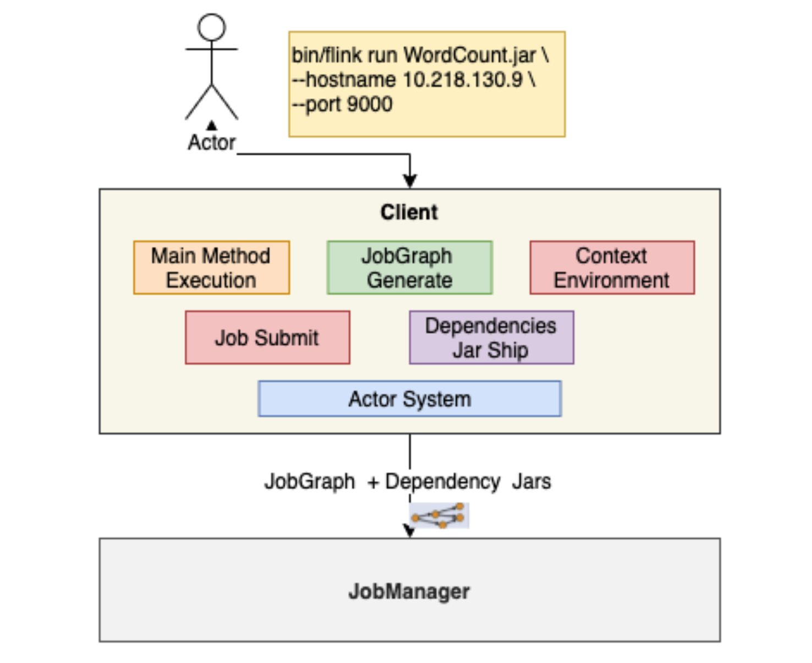

[toc]

# | 流式计算

## || 大数据计算模式

- **批量计算 Batch Computing**
  - MapReduce
  - Spark
  - Hive
  - Flink
  - Pig
- **流式计算 Stream Computing**
  - Storm
  - Spart Streaming
  - Flink
  - Samza
- **图计算 Graph Computing**
  - Giraph - Facebook
  - Graphx - Spark
  - Gelly - Flink
- **交互计算 Interactive Computing**
  - Presto
  - Impala
  - Druid
  - Drill


对比

|                   | Flink                                                     | Spark Streaming                          | Storm                                    | Samza                    |
| ----------------- | --------------------------------------------------------- | ---------------------------------------- | ---------------------------------------- | ------------------------ |
| **架构**          | 主从结构 - 类sp streaming<br />DataFlowGraph - 类storm    | 主从模式，每个batch都依赖主              | 主从模式，依赖zk，处理过程对主的依赖不大 | 依赖kafka                |
| **处理模式**      | Native                                                    | Micro-batch                              | Native                                   | Native                   |
| **容错**          | 基于 Chandy-Lamport distributed snapshots checkpoint 机制 | WAL 及 RDD 血统机制                      | Records ACK                              | Log-Based                |
| **处理模型&延迟** | 单条事件处理；亚秒级延迟                                  | 一个事件窗口内的所有事件；秒级延迟       | 每次传入的一个事件；亚秒级延迟           | 单条事件处理；亚秒级延迟 |
| **吞吐量**        | High                                                      | High                                     | Low                                      | High                     |
| **数据处理保证**  | Exactly Once                                              | Exactly Once                             | At Least Once (基于 record level ack)    | At Least Once            |
| **高级 API**      | 高级类库                                                  | 容易对接Spark生态组件                    | 需按照特定的Storm定义的规则编写          | 只支持 JVM 语言          |
| **易用性**        | 支持 SQL Streaming，批流一体                              | 支持 SQL Streaming，批流采用统一编程框架 | 不支持 SQL Streaming                     | 好于 Storm               |
| **部署**          | 简单，只依赖 JRE                                          | 简单，只依赖 JRE                         | 依赖 JRE 和 zk                           | 依赖 JRE                 |


## || 分布式流处理模型

Google 论文：https://research.google/pubs/pub43864/ 


- 数据从上一个 Operation 节点直接 push 到下一个 Operation 节点；
- 各节点可以分布在不同的 task 线程中运行；


# | Flink 架构

## || 核心特性

- 统一数据处理组件栈：Batch, Stream, ML, Graph；
- 支持事件时间 - `Event Time`、接入时间 - `Ingestion Time`、处理时间 - `Processing Time`；
- 容错：基于轻量级分布式快照；
- 支持有状态计算；
- 支持高度灵活的窗口操作；
- 带 “反压” 的连续流模型；
- 基于 JVM 实现独立的内存管理；


## || 集群架构


组件

- **JobManager**
  - 管理节点，每个集群至少一个；
  - 管理集群计算资源、Job调度、checkpoint协调
- **TaskManager**
  - 每个集群有多个 TM；
  - 负责计算资源提供
- **Client**
  - 本地执行 main，解析 JobGraph 对象、提交到 JobManager 运行


### JobManager

- Checkpoint 协调
- JobGraph --> Execution Graph
- Task 部署与调度
- RPC 通信（Actor System）
- 集群资源管理（Resource Manager）
- TaskManager 注册与管理


### TaskManager

- Task Execution 

- Network Manager 

  > 基于 Netty，实现 TM 与TM 之间数据交互

- Shuffle Environment 管理

- RPC 通信（Actor System）

- Heartbeat with JobManager / RM

- Data Exchange

- Memory Management

- Register to RM

- Offer Slots to JobManager


### Client

- 执行 main 方法；
- JobGraph generate
- Execution Environment 管理
- Job 提交与运行
- Dependency Jar Ship
- RPC with JobManager
- 集群部署




### JobGraph

- 通过有向无环图，表达用户程序
- 是不同接口程序的抽象表达：方便与 JobManager 通信
- 是客户端和集群之间 Job 描述载体
- 


StreamGraph --> JobGraph

- StreamGraph 只描述转换的大概逻辑：Source - Map() - keyby() - Sink
- JobGraph 根据算子并行度拆解、形成 DAG 


## || 集群部署模式


**Session Mode**

- 定义	
  - 共享 JobManager 和 TaskManager；
  - 所有提交的 Job 都在一个 Runtime 中运行；
  - JobManager 生命周期不受 Job 影响，会长期运行；
- 优点
  - 资源充分共享、提高资源利用率
  - Job 在 Flink Session 集群中管理，运维简单；
- 缺点
  - 资源隔离相对较差；
  - 非 Native 类型部署：TM 不易扩展，Slot 计算资源伸缩性较差；


**Per-Job Mode**

- 定义
  - 单个 Job 独占 JobManager 和 TaskManager；
  - 每个 Job 单独启动一个 Runtime；TM 中的 slot 资源根据 Job 指定；
  - JobManager 生命周期与 Job 生命周期绑定；
- 优点
  - Job 直接资源隔离充分；
  - 资源根据 Job 需要进行申请，TM Slot 数量可以不同；
- 缺点
  - 资源相对浪费，JobManager 需要消耗资源；
  - Job 管理完全交给 ClusterManagement，管理复杂；


**Application Mode**

- 定义
  - Application的 main() 运行在 Cluster 上，而不是客户端；客户端无需上传dependency，释放客户端压力。
  - 每个 Application 对应一个 Runtime，Application 中可以包含多个 Job；
- 优点
  - 降低带宽消耗和客户端负载；
  - Application 之间资源隔离；Application 中实现资源共享；
- 缺点
  - 仅支持 Yarn / K8S；


# | Flink Concepts

- https://nightlies.apache.org/flink/flink-docs-release-1.14/docs/concepts/overview/ 

## || Dynamic Table

- https://nightlies.apache.org/flink/flink-docs-release-1.11/dev/table/streaming/dynamic_tables.html#table-to-stream-conversion 


Table 定义，分两部分：

- logical schema conf
- connector conf


示例

```sql
CREATE TABLE FileSource (
    pageId INT,
    url VARCHAR,
    userId VARCHAR,
    `timestamp` BIGINT,
    WATERMARK wk FOR `timestamp` AS withOffset(`timestamp`,1000)
) WITH (
    'connector.type'='File',
    'connector.path'='/tmp/test/test.txt'
);
```


类型

- **Source tables** are data sources. 

  - Flink SQL 必须至少有一个 source table.

- **Side tables** are lookup tables. 

  - 创建时指定 dimension identifier `PERIOD FOR SYSTEM_TIME` 

    ```sql
    CREATE TABLE Behavior (
        docId INT,
        name VARCHAR,
        price INT,
        PERIOD FOR SYSTEM_TIME
    ) WITH (
        'connector.type'='couchbase',
        'connector.default-values'='0,ANN,23'
    )
    ```

  - 支持 cache

  - Retry Handler: 查询 external data store 失败时会重试

- **Sink tables** are data sinks.

  - 输出


## || Time Window

https://nightlies.apache.org/flink/flink-docs-release-1.11/dev/table/sql/queries.html#group-windows 

- https://nightlies.apache.org/flink/flink-docs-release-1.14/docs/dev/datastream/operators/windows/ 


分类

- Session Window
- Tumbling Count Window
- Sliding Time Window
- Tumbling Time Window


```sql
CREATE TABLE FileSource (
    pageId INT,
    url VARCHAR,
    userId VARCHAR,
    `timestamp` BIGINT,
    # generate the watermark based on the timestamp in event and give 1000ms offset
    WATERMARK wk FOR `timestamp` AS withOffset(`timestamp`, 1000)
) WITH (
    'connector.type'='File',
    'connector.path'='/tmp/test/test.txt'
);

CREATE TABLE ConsoleSink (
    userId VARCHAR,
    windowStartTime TIMESTAMP,
    distinctPageCount BIGINT
) WITH (
    'connector.type'='console'
);

INSERT INTO ConsoleSink
    SELECT
        userId,
        TUMBLE_START(wk, INTERVAL '5' SECOND),
        COUNT(DISTINCT pageId)
    FROM FileSource
    GROUP BY
        userId, TUMBLE(wk, INTERVAL '5' SECOND)
```

# | DataStream API

## || 操作

StreamExecutionEnvironment 功能

- TimeCharacteristic 管理
- Transformation 存储与管理
- StreamGraph 创建和获取
- CacheFile 注册于管理
- 任务提交与运行
- 重启策略管理
- StateBackend 管理
- Checkpoint 管理
- 序列化器管理
- 类型和序列化注册
- DataStream 数据源创建
  - 基本数据源接口 - 集合、Socket、File
  - 数据源连接器 - Kafka, ES
  - Custom DataSource


DataStream 转换操作

- 基于单条记录：
  - `filter`, `map`, `flatmap`
- 基于窗口：
  - NonKeyed: `timeWindowAll`, `countWindowAll`, `windowAll`
  - Keyed: `timeWindow`, `countWindow`,  `window`
- 合并多条流：
  - NonKeyed: `union`, `join`, `connect`
  - Keyed: `Interval join`
- 拆分单条流：`split`


Sample: 

```java
public class WindowWordCount {

    public static void main(String[] args) throws Exception {
        // 1. 设置运行环境
        StreamExecutionEnvironment env = StreamExecutionEnvironment.getExecutionEnvironment();
        // 2. 读取源数据、执行转换操作
        DataStream<Tuple2<String, Integer>> dataStream = env
                .socketTextStream("localhost", 9999)
                .flatMap(new Splitter())
                .keyBy(value -> value.f0)
                .window(TumblingProcessingTimeWindows.of(Time.seconds(5)))
                .sum(1);
        // 3. 默认 sink 操作
        dataStream.print();
        // 4. 执行 Flink 应用程序
        env.execute("Window WordCount");
    }

    public static class Splitter implements FlatMapFunction<String, Tuple2<String, Integer>> {
        @Override
        public void flatMap(String sentence, Collector<Tuple2<String, Integer>> out) throws Exception {
            for (String word: sentence.split(" ")) {
                out.collect(new Tuple2<String, Integer>(word, 1));
            }
        }
    }

}
```


## || 时间

时间设置：

```java
StreamExecutionEnvironment env = StreamExecutionEnvironment.getExecutionEnvironment();
env.setStreamTimeCharacteristic(TimeCharacteristic.EventTime);
```


**Event Time**

- 事件发生的时间
- 可以处理乱序数据

**Storage Time**

- 

**Ingestion Time**

- 

**Processing Time**

- 处理时的机器本地时间
- 处理过程最小延迟


## || Watermark

> https://nightlies.apache.org/flink/flink-docs-release-1.9/dev/event_time.html#event-time-and-watermarks 
>
> In order to handle out-of-order events and distinguish between on-time and late events in streaming, we need to extract timestamps from events and make some kind of progress in time (so-called watermarks).
>
> When we receive a watermark, we think the event before the watermark should all be processed.


概念

- Watermark 用于标记 Event-Time 的前进过程；
- Watermark 跟随 DataStream Event-Time 变动，并自身携带 TimeStamp；
- Watermark 用于表明所有较早的时间已经（可能）达到；
- Watermark 本身也属于特殊的事件；


更新时机

- 每当有新的最大时间戳事件出现时，则产生新的 Watermark；

迟到事件

- “迟到事件”：比当前 Watermark 更小的时间戳 会被忽略、不会触发统计操作。


并行中的 Watermark 

- Source Operator 产生 watermark，下发给下游 Operator
- 每个 Operator 根据 watermark 对 “自己的时钟” 进行更新、并将 watermark 发送给下游算子


**Watermark & Window**

- Watermark = Max EventTime - Late Threashold；
- Late Threashold 越高，数据处理延时越高；
- 启发式更新；
- 解决一定范围内的乱序事件；
- 窗口触发条件：`Current Watermark > Window EndTime`
- Watermark 的主要目的是告诉窗口不再会有比当前 Watermark 更晚的数据达到。


**Watermark 生成**


·


# | Table API

## || Join

https://nightlies.apache.org/flink/flink-docs-release-1.11/dev/table/sql/queries.html#joins 

| Join type                    | Description                                                  | Left table type    | Right table type       | Scenario                                                     |
| ---------------------------- | ------------------------------------------------------------ | ------------------ | ---------------------- | ------------------------------------------------------------ |
| Side join                    | A dynamic table join the side(lookup/dimension) table. It is a `LEFT JOIN`. | Dynamic fact table | Static dimension table | your business logic is that consuming the kafka topic and enrich every event with the dimension table in Cassandra/Couchbase/Mongo/Mysql/NuKV/Oracle/Restful |
| Regular join                 | A dynamic table join another dynamic table. It is a `INNER join`. | Dynamic fact table | Dynamic fact table     | join the data from one kafka topic with the data from another kafka topic |
| Interval join                | A dynamic table join another dynamic table within **time interval**. It is a `INNER join`. | Dynamic fact table | Dynamic fact table     | join the data from one kafka topic with the data from another kafka topic |
| Temporal table function join | A dynamic table join the side(lookup/dimension) table. It is a `LEFT JOIN`.  --> 与 Side Join 的区别？ | Dynamic fact table | Static dimension table | write your user defined side table then use side join or write a temporal table function then use it with Temporal table function join |


- Side join vs. Temporal table function join
  - side join support async query and have cache function. It will take more effect to develop side join user defined table. 


| Table type         | Operating constraints      |
| :----------------- | :------------------------- |
| source table       | Only support `FROM`        |
| side table         | Only support `JOIN`        |
| result(sink) table | Only support `INSERT INTO` |
| view table         | Only support `FROM`        |


## || Query

https://nightlies.apache.org/flink/flink-docs-release-1.10/dev/table/sql/queries.html 

https://nightlies.apache.org/flink/flink-docs-release-1.14/docs/dev/table/sql/queries/overview/ 


```sql
INSERT INTO
  Console
  SELECT
      a.p,
      b.url,
      c.weight,
  FROM
      (Select p, ciid, TNAME FROM Pulsar WHERE p<> '12345') a
  LEFT JOIN
      SIDE_TABLE_1 b
  ON
      a.p=b.p
  LEFT JOIN
      SIDE_TABLE_2 c
  ON a.p=c.p
  WHERE c.p <> NULL;
```


### 基于时间的查询

条件

- 必须是 append-only
- 查询条件中包含时间关联条件和算子
  - GROUP BY window aggregation
  - OVER window aggregation
  - Time-windowed JOIN
  - JOIN with a teamporal table (enrichment join)
  - Pattern matching (MATCH_RECOGNIZE)
- 查询结果也是 append-only 类型


## || UDF

https://nightlies.apache.org/flink/flink-docs-release-1.10/dev/table/functions/udfs.html 


## || Table Aggregation Function

https://ci.apache.org/projects/flink/flink-docs-release-1.11/dev/table/functions/udfs.html#table-aggregation-functions.


# | Reference

- playground https://github.com/apache/flink-playgrounds 


