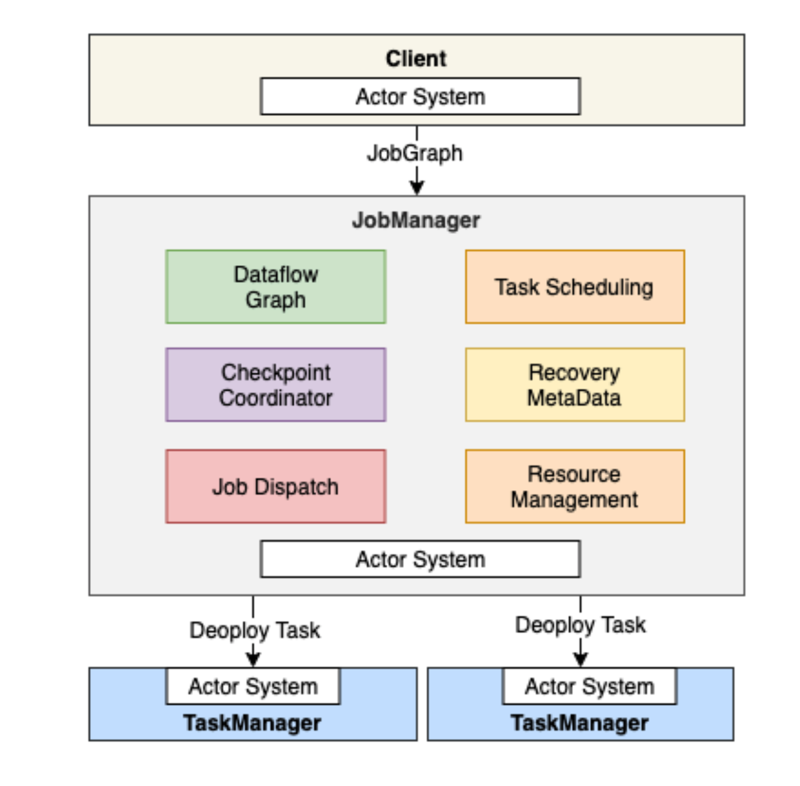
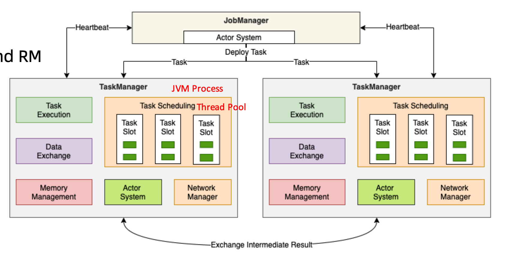
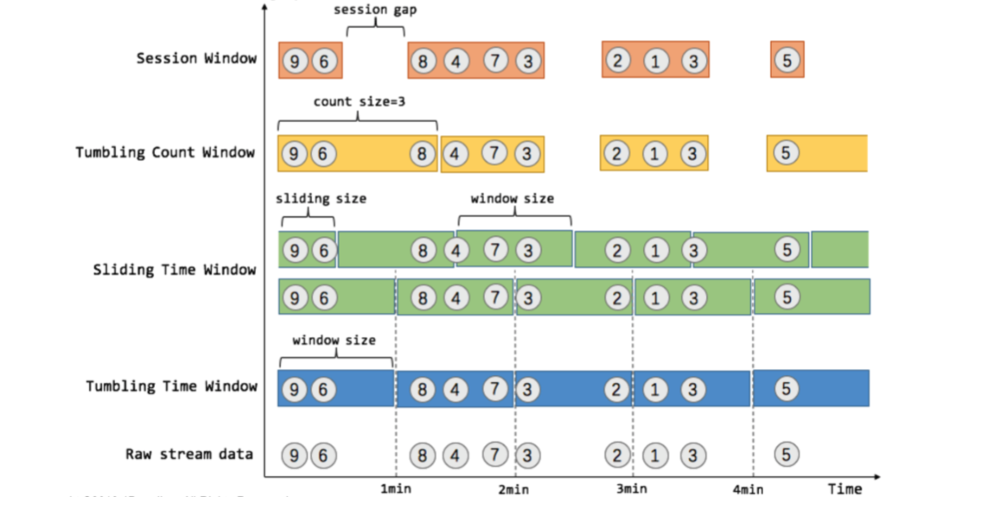
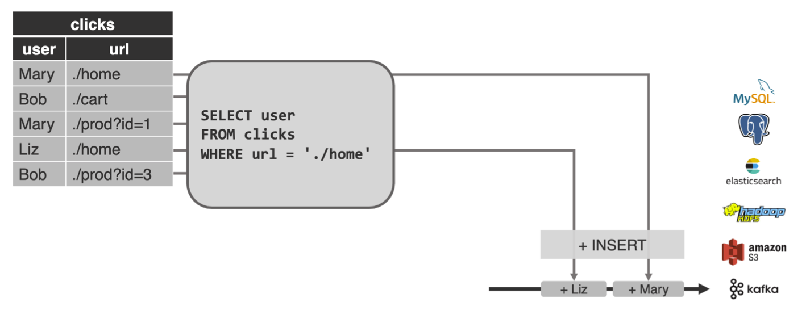
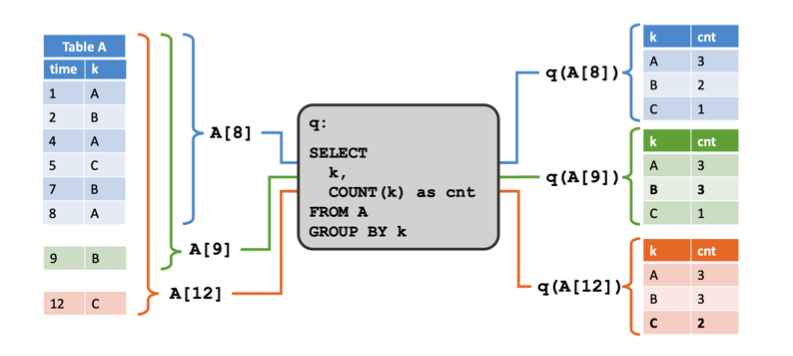
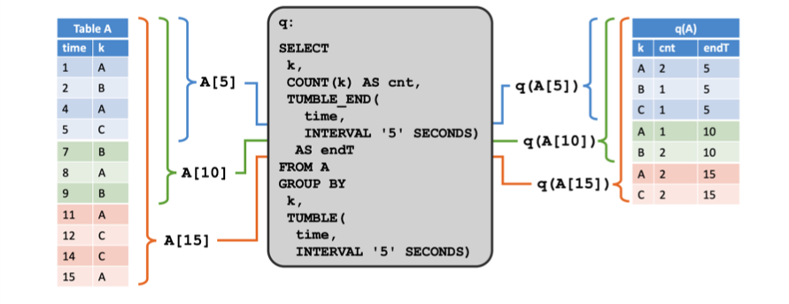
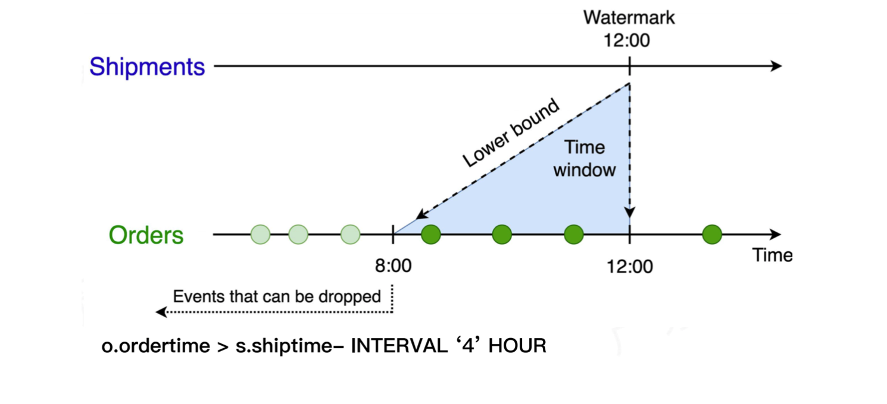
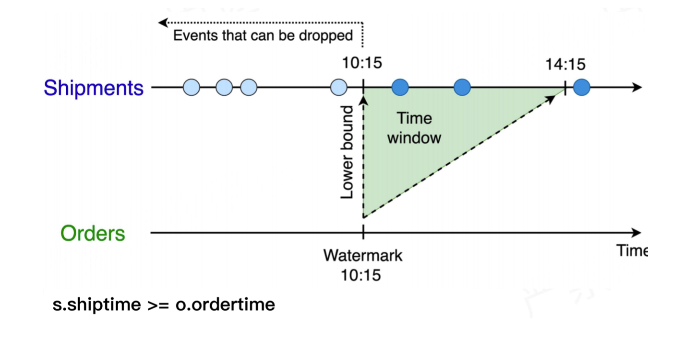

[toc]

# | 流式计算

## || 大数据计算模式

- **批量计算 Batch Computing**
  - MapReduce
  - Spark
  - Hive
  - Flink
  - Pig
- **流式计算 Stream Computing**
  - Storm
  - Spart Streaming
  - Flink
  - Samza
- **图计算 Graph Computing**
  - Giraph - Facebook
  - Graphx - Spark
  - Gelly - Flink
- **交互计算 Interactive Computing**
  - Presto
  - Impala
  - Druid
  - Drill


对比

|                   | Flink                                                     | Spark Streaming                          | Storm                                    | Samza                    |
| ----------------- | --------------------------------------------------------- | ---------------------------------------- | ---------------------------------------- | ------------------------ |
| **架构**          | 主从结构 - 类sp streaming<br />DataFlowGraph - 类storm    | 主从模式，每个batch都依赖主              | 主从模式，依赖zk，处理过程对主的依赖不大 | 依赖kafka                |
| **处理模式**      | Native                                                    | Micro-batch                              | Native                                   | Native                   |
| **容错**          | 基于 Chandy-Lamport distributed snapshots checkpoint 机制 | WAL 及 RDD 血统机制                      | Records ACK                              | Log-Based                |
| **处理模型&延迟** | 单条事件处理；亚秒级延迟                                  | 一个事件窗口内的所有事件；秒级延迟       | 每次传入的一个事件；亚秒级延迟           | 单条事件处理；亚秒级延迟 |
| **吞吐量**        | High                                                      | High                                     | Low                                      | High                     |
| **数据处理保证**  | Exactly Once                                              | Exactly Once                             | At Least Once (基于 record level ack)    | At Least Once            |
| **高级 API**      | 高级类库                                                  | 容易对接Spark生态组件                    | 需按照特定的Storm定义的规则编写          | 只支持 JVM 语言          |
| **易用性**        | 支持 SQL Streaming，批流一体                              | 支持 SQL Streaming，批流采用统一编程框架 | 不支持 SQL Streaming                     | 好于 Storm               |
| **部署**          | 简单，只依赖 JRE                                          | 简单，只依赖 JRE                         | 依赖 JRE 和 zk                           | 依赖 JRE                 |


## || 分布式流处理模型

- Google 论文：https://research.google/pubs/pub43864/ 

- Flink doc: https://nightlies.apache.org/flink/flink-docs-release-1.14/docs/learn-flink/overview/ 


- 数据从上一个 Operation 节点直接 push 到下一个 Operation 节点；
- 各节点可以分布在不同的 task 线程中运行；


# | Flink 架构

## || 核心特性

- 统一数据处理组件栈：Batch, Stream, ML, Graph；
- 支持事件时间 - `Event Time`、接入时间 - `Ingestion Time`、处理时间 - `Processing Time`；
- 容错：基于轻量级分布式快照；

  > Flink is able to provide fault-tolerant, exactly-once semantics through a combination of state snapshots and stream replay.  
- 支持有状态计算；

  > The set of parallel instances of a stateful operator is effectively a sharded key-value store. Each parallel instance is responsible for handling events for a specific group of keys, and the state for those keys is kept **locally** (heap, or disk).
  >
  > https://nightlies.apache.org/flink/flink-docs-release-1.14/docs/dev/datastream/fault-tolerance/queryable_state/ 
- 支持高度灵活的窗口操作；
- 带 “反压” 的连续流模型；
- 基于 JVM 实现独立的内存管理；


### Stateful

keyed state 是一种分片的键/值存储，每个 keyed state 的工作副本都保存在负责该键的 taskmanager 本地中。另外，Operator state 也保存在机器节点本地。

Flink 提供了为 RocksDB 优化的 `MapState` 和 `ListState` 类型。 相对于 `ValueState`，更建议使用 `MapState` 和 `ListState`，因为使用 RocksDBStateBackend 的情况下， `MapState` 和 `ListState` 比 `ValueState` 性能更好。 

**State backend**

- EmbeddedRocksDBStateBackend
  - 本地磁盘
  - 慢10倍
- HashMapStateBackend：Jvm heap.
  - 更快


### Fault Tolerance

https://nightlies.apache.org/flink/flink-docs-release-1.14/docs/learn-flink/fault_tolerance/ 

**Checkpoint Storage**

Flink 定期获取所有状态的快照，并将这些快照复制到持久化的位置，例如分布式文件系统。

- FileSystemCheckpointStorage：分布式文件系统
- JobManagerCheckpointStorage：测试用


**概念**

- **Snapshot**
  - 包括指向每个数据源的指针（例如，到文件或 Kafka 分区的偏移量）、以及每个作业的有状态运算符的状态副本
- **Checkpoint**
  - Flink 自动生成的 snapshot。可全量可增量。
- **Externalized Checkpoint**
  - 可保留生成的 snapshot，以便手工恢复。
- **Savepoint**
  - 手工触发的 snapshot


## || 集群架构


组件

- **JobManager**
  - 管理节点，每个集群至少一个；
  - 管理集群计算资源、Job调度、checkpoint协调
- **TaskManager**
  - 每个集群有多个 TM；
  - 负责计算资源提供
- **Client**
  - 本地执行 main，解析 JobGraph 对象、提交到 JobManager 运行


### JobManager

- Checkpoint 协调
- JobGraph --> Execution Graph
- Task 部署与调度
- RPC 通信（Actor System）
- 集群资源管理（Resource Manager）
- TaskManager 注册与管理




### TaskManager

- Task Execution 

- Network Manager 

  > 基于 Netty，实现 TM 与TM 之间数据交互

- Shuffle Environment 管理

- RPC 通信（Actor System）

- Heartbeat with JobManager / RM

- Data Exchange

- Memory Management

- Register to RM

- Offer Slots to JobManager




### Client

- 执行 main 方法；
- JobGraph generate
- Execution Environment 管理
- Job 提交与运行
- Dependency Jar Ship
- RPC with JobManager
- 集群部署


### JobGraph

- 通过有向无环图，表达用户程序
- 是不同接口程序的抽象表达：方便与 JobManager 通信
- 是客户端和集群之间 Job 描述载体
- 


StreamGraph --> JobGraph

- StreamGraph 只描述转换的大概逻辑：Source - Map() - keyby() - Sink
- JobGraph 根据算子并行度拆解、形成 DAG 


## || 集群部署模式


**Session Mode**

- 定义	
  - 共享 JobManager 和 TaskManager；
  - 所有提交的 Job 都在一个 Runtime 中运行；
  - JobManager 生命周期不受 Job 影响，会长期运行；
- 优点
  - 资源充分共享、提高资源利用率
  - Job 在 Flink Session 集群中管理，运维简单；
- 缺点
  - 资源隔离相对较差；
  - 非 Native 类型部署：TM 不易扩展，Slot 计算资源伸缩性较差；


**Per-Job Mode**

- 定义
  - 单个 Job 独占 JobManager 和 TaskManager；
  - 每个 Job 单独启动一个 Runtime；TM 中的 slot 资源根据 Job 指定；
  - JobManager 生命周期与 Job 生命周期绑定；
- 优点
  - Job 直接资源隔离充分；
  - 资源根据 Job 需要进行申请，TM Slot 数量可以不同；
- 缺点
  - 资源相对浪费，JobManager 需要消耗资源；
  - Job 管理完全交给 ClusterManagement，管理复杂；


**Application Mode**

- 定义
  - Application的 main() 运行在 Cluster 上，而不是客户端；客户端无需上传dependency，释放客户端压力。
  - 每个 Application 对应一个 Runtime，Application 中可以包含多个 Job；
- 优点
  - 降低带宽消耗和客户端负载；
  - Application 之间资源隔离；Application 中实现资源共享；
- 缺点
  - 仅支持 Yarn / K8S；


# | DataStream API

流程

- 获取一个 Execution Env
- 加载、创建初始数据
- 转换
- 指定结果存储位置
- 触发 execution

Sample: 

```java
public class WindowWordCount {

    public static void main(String[] args) throws Exception {
        // 1. 设置运行环境
        StreamExecutionEnvironment env = StreamExecutionEnvironment.getExecutionEnvironment();
        // 2. 读取源数据、执行转换操作
        DataStream<Tuple2<String, Integer>> dataStream = env
                .socketTextStream("localhost", 9999)
                .flatMap(new Splitter())
                .keyBy(value -> value.f0)
                .window(TumblingProcessingTimeWindows.of(Time.seconds(5)))
                .sum(1);
        // 3. 默认 sink 操作
        dataStream.print();
        // 4. 执行 Flink 应用程序
        env.execute("Window WordCount");
    }

    public static class Splitter implements FlatMapFunction<String, Tuple2<String, Integer>> {
        @Override
        public void flatMap(String sentence, Collector<Tuple2<String, Integer>> out) throws Exception {
            for (String word: sentence.split(" ")) {
                out.collect(new Tuple2<String, Integer>(word, 1));
            }
        }
    }

}
```


## || Execution Env

StreamExecutionEnvironment 功能

- TimeCharacteristic 管理
- Transformation 存储与管理
- StreamGraph 创建和获取
- CacheFile 注册于管理
- 任务提交与运行
- 重启策略管理
- StateBackend 管理
- Checkpoint 管理
- 序列化器管理
- 类型和序列化注册
- DataStream 数据源创建
  - 基本数据源接口 - 集合、Socket、File
  - 数据源连接器 - Kafka, ES
  - Custom DataSource


## || 操作

DataStream 转换操作

- 基于单条记录：
  - `filter`, `map`, `flatmap`
- 基于窗口：
  - NonKeyed: `timeWindowAll`, `countWindowAll`, `windowAll`
  - Keyed: `timeWindow`, `countWindow`,  `window`
- 合并多条流：
  - NonKeyed: `union`, `join`, `connect`
  - Keyed: `Interval join`
- 拆分单条流：`split`


## || 时间

时间设置：

```java
StreamExecutionEnvironment env = StreamExecutionEnvironment.getExecutionEnvironment();
env.setStreamTimeCharacteristic(TimeCharacteristic.EventTime);
```


**Event Time**

- 事件发生的时间
- 可以处理乱序数据

**Storage Time**

- 

**Ingestion Time**

- 

**Processing Time**

- 处理时的机器本地时间
- 处理过程最小延迟


## || Watermark

> https://nightlies.apache.org/flink/flink-docs-release-1.9/dev/event_time.html#event-time-and-watermarks 
>
> In order to handle out-of-order events and distinguish between on-time and late events in streaming, we need to extract timestamps from events and make some kind of progress in time (so-called watermarks).
>
> When we receive a watermark, we think the event before the watermark should all be processed.


概念

- Watermark 用于标记 Event-Time 的前进过程；
- Watermark 跟随 DataStream Event-Time 变动，并自身携带 TimeStamp；
- Watermark 用于表明所有较早的时间已经（可能）达到；
- Watermark 本身也属于特殊的事件；


更新时机

- 每当有新的最大时间戳事件出现时，则产生新的 Watermark；

迟到事件

- “迟到事件”：比当前 Watermark 更小的时间戳 会被忽略、不会触发统计操作。
- watermark defines when to stop waiting for earlier events.


并行中的 Watermark 

- Source Operator 产生 watermark，下发给下游 Operator
- 每个 Operator 根据 watermark 对 “自己的时钟” 进行更新、并将 watermark 发送给下游算子


**Watermark & Window**

- Watermark = Max EventTime - Late Threashold；
- Late Threashold 越高，数据处理延时越高；
- 启发式更新；
- 解决一定范围内的乱序事件；
- 窗口触发条件：`Current Watermark > Window EndTime`
- Watermark 的主要目的是告诉窗口不再会有比当前 Watermark 更晚的数据达到。


**Watermark 生成**

API：同时指定 timestamp & watermark 

- assignTimestampsAndWatermarks


- Connector 指定

  ```java
  FlinkKafkaConsumer<MyType> kafkaSource = new FlinkKafkaConsumer<>("myTopic", schema, props);
  
  kafkaSource.assignTimestampsAndWatermarks(
     WatermarkStrategy.forBoundedOutOfOrderness(Duration.ofSeconds(20))); 
  
  DataStream<MyType> stream = env.addSource(kafkaSource);
  
  ```

  

  


两种类型

- Periodic Watermark

  - 常用。基于事件时间。

  - 原理：

    ```java
    public class BoundedOutOfOrdernessGenerator implements WatermarkGenerator<MyEvent> {
      private final long maxOutOfOrderness = 3500; // 3.5 seconds
      private long currentMaxTimestamp;
      
      @Override
      public void onEvent(MyEvent event, long eventTimestamp, WatermarkOutput output) {
        currentMaxTimestamp = Math.max(currentMaxTimestamp, eventTimestamp); 
      }
      
    	@Override
    	public void onPeriodicEmit(WatermarkOutput output) {
    		// emit the watermark as current highest timestamp minus the out-of-orderness bound
    		output.emitWatermark(new Watermark(currentMaxTimestamp - maxOutOfOrderness - 1)); 
      }
    }
    ```

    

- Punctuated Watermark

  - Based on something in the event stream.

  - 原理：

    ```java
    public class PunctuatedAssigner implements WatermarkGenerator<MyEvent> {
    	@Override
    	public void onEvent(MyEvent event, long eventTimestamp, WatermarkOutput output) {
    		if (event.hasWatermarkMarker()) {
    			output.emitWatermark(new Watermark(event.getWatermarkTimestamp())); 
        }
    	}
      
    	@Override
    	public void onPeriodicEmit(WatermarkOutput output) {
    		// don't need to do anything because we emit in reaction to events above
    	} 
    }
    ```

    


**Watermark 选择：Latency vs. Completeness**


## || Window

- https://nightlies.apache.org/flink/flink-docs-release-1.14/docs/dev/datastream/operators/windows/ 


作用：

- 无界 --> 有界

流程：


- **Window Assigners**: assign events to windows (creating new window objects as necessary),  
- **Window Functions**:  applied to the events assigned to a window.
- **Triggers**: determine when to call the window function.
- **Evictors**: remove elements collected in a window.


### **Window Assigner**

- **Session Window 会话窗口** 

  - page views per session. 

- **Sliding Time Window 滑动窗口**

  - page views per minute computed every 10 seconds.

- **Tumbling Time Window 滚动窗口**

  - page views per minute. 
  - 是特殊的滑动窗口：Window size == Window slide

- **Tumbling Count Window**

- **Global Window**

  - 用户自己指定window策略

  




### Window Trigger

决定何时启动 Window Function 来处理窗口中的数据、何时将窗口内的数据清理。

| Window Trigger                  | 触发频率 | 功能                                                         |
| ------------------------------- | -------- | ------------------------------------------------------------ |
| ProcessingTimeTrigger           | 一次触发 | 基于 ProcessingTime，当机器时间大于窗口结束时间时触发        |
| EventTimeTrigger                | 一次触发 | 基于 EventTime，当 Watermark 大于窗口结束时间时触发          |
| ContinuousProcessingTimeTrigger | 多次触发 | 基于 ProcessingTime，固定时间间隔触发                        |
| ContinuousEventTimeTrigger      | 多次触发 | 基于 EventTime，固定时间间隔触发                             |
| CountTrigger                    | 多次触发 | 基于元素固定条数触发                                         |
| DeltaTrigger                    | 多次触发 | 基于当前元素与上次触发的元素做delta计算，超过指定threshold触发 |
| PuringTrigger                   |          | 对 Trigger的封装，用于触发后额外清理中间状态数据             |


### Window Evictor

作用：

- 剔除 window 中不需要的数据。
- 可用于 Window Function 之前，或之后。

| Window Evictor | 作用                                                         |
| -------------- | ------------------------------------------------------------ |
| CountEvictor   | 保留一定数目的元素，多余的元素按照从前到后顺序清理           |
| TimeEvictor    | 保留一个时间段的元素，早于该时间段的元素会被清理             |
| DeltaEvictor   | 窗口计算时，最近一条元素和其他元素做 Delta 计算，仅保留 Delta 在指定Threshold 内的元素 |


### Window Function

3 种：reduce, aggregate, process

1. as a batch, using a `ProcessWindowFunction` that will be passed an `Iterable` with the window’s contents;
2. incrementally, with a `ReduceFunction` or an `AggregateFunction` that is called as each event is assigned to the window;
3. or with a combination of the two, wherein the pre-aggregated results of a `ReduceFunction` or an `AggregateFunction` are supplied to a `ProcessWindowFunction` when the window is triggered.


- **全量元素 Function** 

  - `ProcessWindowFunction`：性能较差

    ```java
    //ProcessWindowFunction: 计算传感器的最大值
    DataStream<SensorReading> input = ...
    input
        .keyBy(x -> x.key)
        .window(TumblingEventTimeWindows.of(Time.minutes(1)))
        .process(new MyWastefulMax());
    
    public static class MyWastefulMax extends ProcessWindowFunction<
            SensorReading,                  // input type
            Tuple3<String, Long, Integer>,  // output type
            String,                         // key type
            TimeWindow> {                   // window type
        
        @Override
        public void process(
                String key,
                Context context, //包含信息： window(), windowState(), globalState(), currentWatermark(), currentProcessingTime()
                Iterable<SensorReading> events,
                Collector<Tuple3<String, Long, Integer>> out) {
    
            int max = 0;
            for (SensorReading event : events) {
                max = Math.max(event.value, max);
            }
            out.collect(Tuple3.of(key, context.window().getEnd(), max));
        }
    }
    ```


- **增量元素 Function**

  - `ReduceFunction`：类似 map reduce，累积

    ```java
    // ReduceFunction：累加
    DataStream<Tuple2<String, Long>> input = ...; 
    input
      .keyBy(<key selector>)
      .window(<window assigner>)
      .reduce(new ReduceFunction<Tuple2<String, Long>> {
        public Tuple2<String, Long> reduce(Tuple2<String, Long> v1, Tuple2<String, Long> v2) {
          return new Tuple2<>(v1.f0, v1.f1 + v2.f1); 
        } 
      });
    ```

    

  - `AggregateFunction`：

    ```java
    // AggregateFunction: 统计平均数
    DataStream<Tuple2<String, Long>> input = ...; 
    input
      .keyBy(<key selector>) 
      .window(<window assigner>) 
      .aggregate(new AverageAggregate());
    
    private static class AverageAggregate implements AggregateFunction<Tuple2<String, Long>, Tuple2<Long, Long>, Double> {
      // createAccumulator: 创建累积器，sum & count
      @Override
      public Tuple2<Long, Long> createAccumulator() { 
        return new Tuple2<>(0L, 0L);
    	}
      // 累加时：增加 sum & count
    	@Override
    	public Tuple2<Long, Long> add(Tuple2<String, Long> value, Tuple2<Long, Long> accumulator) {
    		return new Tuple2<>(accumulator.f0 + value.f1, accumulator.f1 + 1L); 
      }
      // 结果：sum/count
    	@Override
    	public Double getResult(Tuple2<Long, Long> accumulator) { 
        return ((double) accumulator.f0) / accumulator.f1;
    	}
      // 非核心：用于并发合并
      @Override
      public Tuple2<Long, Long> merge(Tuple2<Long, Long> a, Tuple2<Long, Long> b) { 
        return new Tuple2<>(a.f0 + b.f0, a.f1 + b.f1);
      } 
    }
    ```

    

  - `FoldFunction`


- 内置 aggregations

  - sum(key)

  - min(key)

  - max(key)

    ```java
    DataStream<Tuple2<String, Integer>> counts = tokenized 
      .keyBy(value -> value.f0) 
      .window(TumblingEventTimeWindows.of(Time.seconds(5))) 
      // group by the tuple field "0" and sum up tuple field "1" 
      .sum(1); // 基于第二个字段
    ```


Q: 能否集成全量+增量的优点？


**如何处理 Late Events:**

- 默认忽略

- **Side Output**：发送到另一个stream 
  https://nightlies.apache.org/flink/flink-docs-release-1.14/docs/learn-flink/event_driven/#side-outputs 

  ```java
  OutputTag<Event> lateTag = new OutputTag<Event>("late"){};
  
  SingleOutputStreamOperator<Event> result = stream.
      .keyBy(...)
      .window(...)
      .sideOutputLateData(lateTag)
      .process(...);
    
  DataStream<Event> lateStream = result.getSideOutput(lateTag);
  ```

  

- **allowedLateness**：specify an interval of *allowed lateness* during which the late events will continue to be assigned to the appropriate window(s)

  ```java
  stream.
      .keyBy(...)
      .window(...)
      .allowedLateness(Time.seconds(10)) //为何不把watermark设长10s？
      .process(...);
  ```


## || 多流合并

e.g. 每个用户的点击 **JOIN** 该用户最近十分钟的浏览


两种合并类型：

- **Window Join**

  

  ```java
  DataStream<Integer> orangeStream = ...
  DataStream<Integer> greenStream = ...
  orangeStream.join(greenStream)
    .where(<KeySelector>)
    .equalTo(<KeySelector>) 
    .window(TumblingEventTimeWindows.of(Time.milliseconds(2))) 
    .apply(new JoinFunction<Integer, Integer, String> () {
      @Override
      public String join(Integer first, Integer second) {
        return first + "," + second; 
      }
  });
  ```

  

- **Interval Join**
  `orangeElem.ts + lowerBound <= greenElem.ts <= orangeElem.ts + upperBound`
  

  ```java
  KeyedStream<Tuple2<String, Integer>, String> streamOne = ...
    .assignTimestampsAndWatermarks(new AscendingTuple2TimestampExtractor()) 
    .keyBy(new Tuple2KeyExtractor());
  KeyedStream<Tuple2<String, Integer>, String> streamTwo = ... 
    .assignTimestampsAndWatermarks(new AscendingTuple2TimestampExtractor()) 
    .keyBy(new Tuple2KeyExtractor());
  
  streamOne.intervalJoin(streamTwo)
    .between(Time.milliseconds(0), Time.milliseconds(10)) // 定义上下界
    .process(new ProcessJoinFunction<Tuple2<String, Integer>, Tuple2<String, Integer>, String>() {
      
      @Override
      public void processElement(
        Tuple2<String, Integer> left,
        Tuple2<String, Integer> right, 
        Context ctx, 
        Collector<String> out) throws Exception { 
        
        out.collect(left + ":" + right);
      }
    }).addSink(new ResultSink());
  ```


Q: Join 操作中的watermark 如何更新？对于不同输入流中的 watermark 如何选择？


# | Stateful Stream Processing

底层 API，灵活性更大。

## || ProcessFunction

ProcessFunction 可以访问：

- 时间
- 状态
- 定时器


# | Table API

程序结构

- 构造 TableEnvironment
- Connect() 创建 Temporary Table
- tableEnv.from().select()  /  tableEnv.sqlQuery()
- 输出 tableEnv.executeInsert()
- 调用 tableEnv.execute()


## || Table 创建

**DataStream 转为 Table**

```java
// Convert the DataStream into a Table with default fields "f0", "f1" 
Table table1 = tableEnv.fromDataStream(stream);
// Convert the DataStream into a Table with fields "myLong", "myString" 
Table table2 = tableEnv.fromDataStream(stream, $("myLong"), $("myString"));

// 逻辑表 register the DataStream as View "myTable" with fields "f0", "f1" 
tableEnv.createTemporaryView("myTable", stream);
// register the DataStream as View "myTable2" with fields "myLong", "myString" 
tableEnv.createTemporaryView("myTable2", stream, $("myLong"), $("myString"));
```


**Table 转为 DataStream**

- Append mode
- Retract mode

```java
// convert the Table into an append DataStream of Row by specifying the class 
DataStream<Row> dsRow = tableEnv.toAppendStream(table, Row.class);

// convert the Table into an append DataStream of Tuple2<String, Integer> 
TupleTypeInfo<Tuple2<String, Integer>> tupleType = new TupleTypeInfo<>( Types.STRING(), Types.INT()); DataStream<Tuple2<String, Integer>> dsTuple = tableEnv.toAppendStream(table, tupleType);

// convert the Table into a retract DataStream of Row.
// A retract stream of type X is a DataStream<Tuple2<Boolean, X>>.
// The boolean field indicates the type of the change.
// True is INSERT, false is DELETE.
DataStream<Tuple2<Boolean, Row>> retractStream = tableEnv.toRetractStream(table, Row.class);
```


**Table Connector**

```java
tableEnvironment
  .connect(...) // Table Connector Eg:Kafka 
  .withFormat(...) // Format Type Eg:JSON
  .withSchema(...) // Table Schem
  .inAppendMode() // update mode 
  .createTemporaryTable(“MyTable”) // Register Table
```


## || Dynamic Table

- https://nightlies.apache.org/flink/flink-docs-release-1.11/dev/table/streaming/dynamic_tables.html#table-to-stream-conversion 

动态表：基于无界序列


**原理**

- 物化视图 Materialized View：缓存查询结果；基表修改时，物化视图将过期。
- 基于动态表查询
  - 查询动态表将生成一个连续查询 ;
  - 一个连续查询永远不会终止，结果会生成一个动态表；查询不断更新其(动态)结果表，以反映其(动态)输入表上的更改;
  - 动态表上的连续查询非常类似于定义物化视图的查询;
  - 连续查询的结果在语义上总是等价于以批处理模式在输入表快照上执行的相同查询的结果;


**创建**

Table 定义，分两部分：

- logical schema conf
- connector conf

示例

```sql
CREATE TABLE FileSource (
    pageId INT,
    url VARCHAR,
    userId VARCHAR,
    `timestamp` BIGINT,
    WATERMARK wk FOR `timestamp` AS withOffset(`timestamp`,1000)
) WITH (
    'connector.type'='File',
    'connector.path'='/tmp/test/test.txt'
);
```


**类型**

- **Source tables** are data sources. 

  - Flink SQL 必须至少有一个 source table.

- **Side tables** are lookup tables. 

  - 创建时指定 dimension identifier `PERIOD FOR SYSTEM_TIME` 

    ```sql
    CREATE TABLE Behavior (
        docId INT,
        name VARCHAR,
        price INT,
        PERIOD FOR SYSTEM_TIME
    ) WITH (
        'connector.type'='couchbase',
        'connector.default-values'='0,ANN,23'
    )
    ```

  - 支持 cache

  - Retry Handler: 查询 external data store 失败时会重试

- **Sink tables** are data sinks.

  - 输出


**Dynamic Table --> Stream**

- INSERT：转换为 **append-only 流**
  
- INSERT + DELETE：转换为 **Retract 流**
  - 先 delete 再 insert，实现 update 效果
    

- UPSERT + DELETE：转换为 **Upsert 流**

  - 包含两种类型的 msg: upsert messages 和delete messages；
  - 根据 key 进行 update 和 delete

  - Q: 与 retract 流的区别？

  


## || TimeStamp & Watermark 定义

**Processing Time 定义**

- 建表 DDL 中定义

  ```sql
  CREATE TABLE user_actions (
    user_name STRING,
    data STRING,
    user_action_time AS PROCTIME() -- 声明一个额外的列作为处理时间属性
  ) WITH ( 
    ...
  );
  
  SELECT TUMBLE_START(user_action_time, INTERVAL '10' MINUTE), COUNT(DISTINCT user_name) 
  FROM user_actions
  GROUP BY TUMBLE(user_action_time, INTERVAL '10' MINUTE);
  ```

- DataStream 转 table 时定义

  ```java
  DataStream<Tuple2<String, String>> stream = ...;
  // 声明一个额外的字段作为时间属性字段
  Table table = tEnv.fromDataStream(stream, $("user_name"), $("data"),
                                    $("user_action_time").proctime());
  
  WindowedTable windowedTable = table.window( 
    Tumble.over(lit(10).minutes())
    .on($("user_action_time")) 
    .as("userActionWindow"));
  ```

- 自定义 StreamTableSource


**EventTime 定义**

- 建表 DDL 中定义 (与watermark一起定义)

  ```sql
  CREATE TABLE user_actions (
    user_name STRING,
    data STRING,
    user_action_time TIMESTAMP(3),
    -- 声明 user_action_time 是事件时间属性，并且用 延迟 5 秒的策略来生成 
    watermark WATERMARK FOR user_action_time AS user_action_time - INTERVAL '5' SECOND
  ) WITH ( 
    ...
  );
  
  SELECT TUMBLE_START(user_action_time, INTERVAL '10' MINUTE), COUNT(DISTINCT user_name) 
  FROM user_actions
  GROUP BY TUMBLE(user_action_time, INTERVAL '10' MINUTE);
  ```

  

- DataStream 转 table 时定义

  ```java
  //方式一:基于 stream 中的事件产生时间戳和 watermark
  DataStream<Tuple2<String, String>> stream = inputStream.assignTimestampsAndWatermarks(...);
  // 声明一个额外的逻辑字段作为事件时间属性
  Table table = tEnv.fromDataStream(stream, $("user_name"), $("data"),
  $("user_action_time").rowtime()");
                                    
  // 方式二:从第一个字段获取事件时间，并且产生 watermark
  DataStream<Tuple3<Long, String, String>> stream = inputStream.assignTimestampsAndWatermarks(...);
  // 第一个字段已经用作事件时间抽取了，不用再用一个新字段来表示事件时间了
  Table table = tEnv.fromDataStream(stream, $("user_action_time").rowtime(), $("user_name"), $("data"));
                                    
  // Usage:
  WindowedTable windowedTable = table.window(Tumble
                                             .over(lit(10).minutes()) 
                                             .on($("user_action_time")) 
                                             .as("userActionWindow"))
  ```

- 自定义 StreamTableSource


## || Query

- https://nightlies.apache.org/flink/flink-docs-release-1.10/dev/table/sql/queries.html 
- https://nightlies.apache.org/flink/flink-docs-release-1.14/docs/dev/table/sql/queries/overview/ 


```sql
INSERT INTO
  Console
  SELECT
      a.p,
      b.url,
      c.weight,
  FROM
      (Select p, ciid, TNAME FROM Pulsar WHERE p<> '12345') a
  LEFT JOIN
      SIDE_TABLE_1 b
  ON
      a.p=b.p
  LEFT JOIN
      SIDE_TABLE_2 c
  ON a.p=c.p
  WHERE c.p <> NULL;
```


- **常规查询**
  - 全表计算，结果集不断被更新；
  - key 很多时会占用内存资源；



- **窗口查询**
  - 不会出现资源不足
  
  - 使用场景：
  
    - 状态大小查询限制 - 连续运行数周或数月
  
    - Updating Results 查询限制 -  有些查询需要重新计算和更新大量已输出的结果行，即使只添加或更新一条输入记录。
  
      ```sql
      SELECT user, RANK() -- rank() 需要更新大量数据
      OVER (ORDER BY lastLogin) 
      FROM (
        SELECT user, MAX(cTime) AS lastAction FROM clicks GROUP BY user );




### 基于时间的查询

例子

- 计算最近一分钟平均值
- 关联最近汇率变化表
- 五分钟内如果三次失败则触发报警


特征

- 输入表是 append-only
- 查询条件中包含时间相关条件和算子
- 查询结果也是 append-only 类型


操作

- JOIN

  - Time-windowed JOIN
  - JOIN with a teamporal table (enrichment join)

- Pattern matching (MATCH_RECOGNIZE)

- 聚合

  - **GROUP BY window aggregation**

    ```sql
    -- 计算每个小时中，每个用户的点击次数
    SELECT user,
      TUMBLE_END(cTime, INTERVAL '1' HOURS) AS endT, 
      COUNT(url) AS cnt
    FROM clicks
      GROUP BY TUMBLE(cTime, INTERVAL '1' HOURS), user
    ```

    

  - **OVER window aggregation**

    ```sql
    -- 计算每次点击之前两个小时内的点击总数
    SELECT user, url,
      COUNT(*) OVER w
    FROM clicks 
      WINDOW w AS (
        PARTITION BY url
        ORDER BY cTime
        RANGE BETWEEN INTERVAL ’2’ HOUR PRECEDING AND CURRENT ROW)
    ```

    


### Window

https://nightlies.apache.org/flink/flink-docs-release-1.11/dev/table/sql/queries.html#group-windows 


```sql
CREATE TABLE FileSource (
    pageId INT,
    url VARCHAR,
    userId VARCHAR,
    `timestamp` BIGINT,
    # generate the watermark based on the timestamp in event and give 1000ms offset
    WATERMARK wk FOR `timestamp` AS withOffset(`timestamp`, 1000)
) WITH (
    'connector.type'='File',
    'connector.path'='/tmp/test/test.txt'
);

CREATE TABLE ConsoleSink (
    userId VARCHAR,
    windowStartTime TIMESTAMP,
    distinctPageCount BIGINT
) WITH (
    'connector.type'='console'
);

INSERT INTO ConsoleSink
    SELECT
        userId,
        TUMBLE_START(wk, INTERVAL '5' SECOND),
        COUNT(DISTINCT pageId)
    FROM FileSource
    GROUP BY
        userId, TUMBLE(wk, INTERVAL '5' SECOND)
```


## || JOIN

- https://nightlies.apache.org/flink/flink-docs-release-1.14/docs/dev/table/sql/queries/joins/

| Join type                    | Description                                                  | Left table type    | Right table type       | Scenario                                                     |
| ---------------------------- | ------------------------------------------------------------ | ------------------ | ---------------------- | ------------------------------------------------------------ |
| Side join                    | A dynamic table join the side(lookup/dimension) table. It is a `LEFT JOIN`. | Dynamic fact table | Static dimension table | your business logic is that consuming the kafka topic and enrich every event with the dimension table in Cassandra/Couchbase/Mongo/Mysql/NuKV/Oracle/Restful |
| Regular join                 | A dynamic table join another dynamic table. It is a `INNER join`. | Dynamic fact table | Dynamic fact table     | join the data from one kafka topic with the data from another kafka topic |
| Interval join                | A dynamic table join another dynamic table within **time interval**. It is a `INNER join`. | Dynamic fact table | Dynamic fact table     | join the data from one kafka topic with the data from another kafka topic |
| Temporal table function join | A dynamic table join the side(lookup/dimension) table. It is a `LEFT JOIN`.  --> 与 Side Join 的区别？ | Dynamic fact table | Static dimension table | write your user defined side table then use side join or write a temporal table function then use it with Temporal table function join |


- Side join vs. Temporal table function join
  - side join support async query and have cache function. It will take more effect to develop side join user defined table. 


| Table type         | Operating constraints      |
| :----------------- | :------------------------- |
| source table       | Only support `FROM`        |
| side table         | Only support `JOIN`        |
| result(sink) table | Only support `INSERT INTO` |
| view table         | Only support `FROM`        |


Join 静态表

- JOIN 时数据完整可用

Join 动态表

- 一定要有时间条件

**Join 时态表（Temporal Table）**

- 概念

  - Temporal Table 是随时间变化而变化的表；相当于一个快照
  - 主要用于维表关联
  - 例如：查询之前某个指定时间的最新汇率

- vs. Temporal table function 时态表函数：使用 UDTF + LATERAL TABLE 语法 转换成一张表

- 应用

  


**Inner JOIN**

- Join 顺序没有进行优化
- 状态可能无限增长，需要配置 TTL 

**Outer JOIN**

- 同上


**Interval JOIN**

- 至少需要一个限制时间的 join 条件；

- 只支持 INNER JOIN.

  - Q: 无法发出未匹配成功的事件？

- 示例：

  ```sql
  SELECT * 
  FROM Orders o, Shipments s
  WHERE o.id = s.orderId
    AND o.ordertime BETWEEN s.shiptime - INTERVAL'4'HOUR AND s.shiptime
  ```






- **Window JOIN**
  - DataStream 支持，但 Flink sql 不支持


## || UDF

https://nightlies.apache.org/flink/flink-docs-release-1.10/dev/table/functions/udfs.html 


## || Table Aggregation Function

https://ci.apache.org/projects/flink/flink-docs-release-1.11/dev/table/functions/udfs.html#table-aggregation-functions.


# | Reference

- playground https://github.com/apache/flink-playgrounds 


