[toc]

# | 消息系统

**作用**

- **异步处理** Asynchronous Processing
- 提升总体性能：


  - 更快返回结果；


  - 减少等待，各步骤实现并发


- **削峰填谷** Peak Shaving 
  - 消息堆积，消费端按自己的能力处理 (buffer the data)
  - 代价
    - 增加调用链，总体时延变长
    - 上下游都要改成异步消息，增加复杂度


- **服务解耦 ** Decoupling


**消息模型**

- 点对点

- 发布订阅


**Streaming Platform**

**对比**

- vs. 消息系统
  - 集群，自由伸缩
  - 数据存储
  - 流式处理

- vs. hadoop
  - 批处理 --> 流处理

- vs. ETL


**特点**

- 支持多生产者

  >  生产者以相同格式 写入主题，消费者即可获得单一流

- 支持多消费者

  >  消费者组之间互不影响

- 基于磁盘的数据存储

  > Disk-Based Retention，消费者可暂时离线

- 伸缩性

- 高性能


**使用场景**

- Activity tracking - 用户行为日志

- Messaging - 用户通知：格式化、聚合、Preference
- Metrics & Logging
- Commit log
  - Change Log
  - 可设置为log-compacted，为每个key只保留一个变更数据

- Stream processing - 实时 Map Reduce


**设计对比**

> https://www.confluent.io/blog/okay-store-data-apache-kafka/

One way to think about the relationship between messaging systems, storage systems, and Kafka is the following. 

- **Messaging systems** are all about propagating *future* messages: when you connect to one you are waiting for new messages to arrive. 
- **Storage systems** such as a filesystem or a database are all about storing *past* writes: when you query or read from them you get results based on the updates you did in the past. 
- The essence of **stream processing** is being able to combine these two—being able to process from the past, and continue processing into the future as the future occurs. 


**产品对比**

|              | Components                                                   | Pros                                                         | Cons                                                         |
| ------------ | ------------------------------------------------------------ | ------------------------------------------------------------ | ------------------------------------------------------------ |
| **Kafka**    | **- Peer-to-Peer**.<br />**- ZK**: coordinate broker & consumers.<br />**- HA**: replication | - **Fast**: zero copy, disk sequential read/write, batching produce, data compression. | - Leader serves read/write                                   |
| **RabbitMQ** | - Exchange (forwarding agent),  Queue.<br />**- Disk node vs. Memory node**: disk node - configuration information and meta-information are stored<br/>**- HA**: queue mirroring. | - Operations firstly applied on master then propagated to mirrors.<br />- Supports **priority queuing, delay queuing**. | - **Poor scalability**: complete replication design.<br />- **Not fast**: sync mechanism.<br />- **No ordering.** |
| **RocketMQ** | - **Master-slave** mode. Slave read only<br />- **NameServers**: topic routing registration center.<br />-  **queue** in each topic, like partition. | - Supports **delay queuing**, batch processing, msg filtering<br />- **Low latency**: gc, lock, page cache |                                                              |
| **ActiveMQ** | - **Master-slave** mode. <br /><br />- ZK: master election   | - Supports both point-to-point (Queue) & pub sub (Topic) mode. <br /> - Supports **priority queuing**. | - No sharding.                                               |
| **Pulsar**   | - **Broker**: compute; <br />- **BookKeeper**: storage.<br /> - **Segment**: 物理存储单元，存储在不同 Bookie；每个分区有多个Segment | - **Scalability**: seprate compution & storage. Broker 宕机可以快速被替换。<br /> - 支持所有三种消息保证，支持 **Priority queuing、delay queuing**. | -                                                            |


# | 物理组件


## || Broker

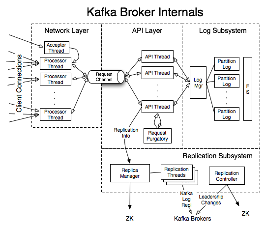

### Controller

**定义**

- 集群中的某一个Broker会作为控制器。
- 集群内唯一。在zk的帮助下，管理和协调“整个”kafka集群

**原理：重度依赖 ZK** 

- 写入临时节点 `/controller`
- 选出新 controller后，会分配更高的 “controller epoch”；如果broker收到了来自老epoch的消息，则会忽略。


**作用**

- **Partition 领导者选举**

  > 当有 Broker离开
  >
  > 1. 失去 leader 的分区需要一个新 leader；ZK 通知控制器，控制器会遍历这些分区，确定谁将成为新 leader；
  >    --> Q: 如何确定新 leader？
  > 2. 控制器先写入 ZK，然后向包含新 leader、原有 follower 的 broker 发送请求，告知新的 leader/follower 信息；
  > 3. 新 leader 处理生产者消费者请求、follower 则从新 leader 复制消息；
  >
  
  > 当有Broker加入
  >
  > 1. 控制器根据 Broker ID 检查新 broker 是否已有 repilcas；
  > 2. 如果已有，则通知 brokers，新 broker 则会从已有的 leader 处复制消息；
  
- **主题管理**

  - 创建、删除、增加分区：kafka-topics 执行时，后台大部分工作是控制器完成

- **分区重分配**

  - kafka-reassign-partitions

- **Preferred 领导者选举**

  - 为了避免部分 Broker 负载过重而提供的一种换 Leader 方案

- **集群成员管理**

  - 新增 Broker、Broker 主动关闭、Broker 宕机；
  
    > 控制器watch "zk /brokers/ids 下的临时节点" 变化；--> Q: 然后做什么？-- 抢占？

- **数据服务**

  - 缓存 ZK 数据
  - 向其他 Broker 提供元数据信息，包括：
    - 主题信息：分区、Leader Replica、ISR
    - Broker信息：运行中、关闭中
    


**Controller Failover**

- 抢占！zk `/controller` 节点创建
  - 每个 Broker 启动后，都尝试创建 /controller 临时节点。
  - 没抢到的，会 Watch 这个节点

- Epoch: Controller 更新后会 增加 epoch，避免老的controller假死后恢复--脑裂。

- 技巧：当 Controller 出问题时，可手工删除节点 触发重选举


### Coordinator 

Leader replica 所在的 Broker 即为协调者（GroupCoordinator）。

**作用**

- **消费者组成员管理 & Rebalance**

  > 协调者对应一个 Group！
  >
  > 消费者启动时，向 Coordinator 所在 Broker 发送请求，由 Coordinator 进行消费者组的注册、成员管理

  - **1. GroupCoordinatorRequest** 找到 group coordinator

    - 消费者启动时发送，发往任一 broker
    - broker 等待 Purgatory 后，返回协调者：
      1. `hash(group.id) % 50` (__commit_offsets 分区数) 
      2. 据此找到 topic partition.
      3. 找到 partition leader.

  - **2. JoinGroupRequest** 加入 group

    - Coordinator 负责选出 `consumer group leader` ：第一个请求者
    - Coordinator 返回 JoinGroupResponse 给 leader：包含各成员的 instanceId

  - **3. Group Leader: 分区分配**

    - 注意是在消费者客户端配置 分区分配策略的！
    - `PartitionAssignor#assign()`

  - **4. Group Leader: SyncGroupRequest** 同步分区分配信息

    - Coordinator 转发给所有消费者

    

- **消费者心跳处理**

  - Consumer 下线后，协调者通知消费者组重新 Join。

- **位移管理**

  > 消费者提交位移时，是向 Coordinator 所在的 Broker 提交

  


**消费者如何找到Coordinator？**--> 分区 Leader 副本所在的 Broker

- Step-1: 找到由位移主题的**哪个分区**来保存该 Group 数据

  ```java
  partitionId = Math.abs(groupId.hashCode % offsetsTopicPartitionCount)
  ```

- Step-2: 找到该**分区的 Leader 副本**所在的 Broker


### 消息存储

**Partition 分配**

- **选择 Broker**：Round-Robin

  > 1. 先随机选一个 broker-1作为 partition-1 leader；依次选 broker-2 作为 partition-2 leader
  >
  > 2. 然后针对每个分区，从 leader broker 开始往后设置 follower
  >
  > 例如 partition-A : leader = broker-2, follower1 = broker-3, ...

  - 配置 `broker.rack`，更高的可用性

- **选择 目录**

  - 使用 已有 partition 个数最少的那个目录；
  - 考虑个数，而不考虑大小！


**Log Segment**

- **什么是 Segment**

  - 一个 segment 对应一个数据文件。

  - `log.segment.ms | bytes`：当达到segment限制时，会关闭当前文件，并创建一个新的。

  - active segment：当前正在写入的 segment，不会被删除；

    > 可能导致 `log.retention.ms` 不生效：超出很多后才能被过期

- `xx.log`

  - DumpLogSegment 工具：查看segment文件内容
  - 对于压缩过的消息，Broker 不会解压，而是直接存储为 Wrapper Message。


- `xx.index`：将 offset 映射到 segment 文件 + 文件内的位置
  - 跳表 
  - 4 bytes: partition offset
  - 4 bytes: log file offset ——为什么4 bytes就够了，offset 是Long？存的是相对位置。

- `xx.timeindex`：时间与 segment 文件的映射
  - 8 bytes: timestamp
  - 4 bytes: log file offset


**Log Cleanup Policy**

> LogCleanerManager，只会作用于 非active segment。
>
> 所以即便compact，active segment 中也可能有重复key。—— 调小 segment size，减少系统重启压力。

- **Delete**
- **Compact**：相同的key只保留一份值，类似 Map。
  - CleanerThread 循环执行日志清理，首先寻找待清理的 TopicPartition、遍历其中待清理的 Segment：
    - 条件1：topic `cleanup.policy = compact`
    - 条件2：TopicPartition 状态为空，即没有其他 CleanerThread 在操作；
    - 条件3：达到 `max.compaction.lag.ms`
  - 构造 OffsetMap 记录每个 key 最新的 offset 以及对应的消息时间；
  - 将待清理 Segment 进行分组，每一组会聚合成一个新的Segment：创建新 Segment、根据 OffsetMap 选择需要保留的消息、存入新 Segment；
  - 对于已经完成 Compaction 流程的log进行删除，删除LogStartOffset 之前的所有 Segment


### 请求处理

> https://time.geekbang.org/column/article/110482


**数据类型请求**

- **PRODUCE**

  > 来自生产者;
  >
  > 必须发往 leader replica；否则会报错 “Not a Leader for Partition”
  >
  > 如果ack=all，leader 会将其暂存在 `Purgatory`，等到 ISR 复制完该消息

- **FETCH**

  > 来自消费者、Follower Replica；
  >
  > 必须发往 leader replica；否则会报错 “Not a Leader for Partition”；
  >
  > 返回 response 使用 zero-copy !

- **METADATA request**

  > 可以发往任意 broker；
  >
  > 客户端据此才能知道 那个是Leader Replica，才能正确发送PRODUCE / FETCH 请求


**控制类请求**

- **LeaderAndIsr**

  > Controller 发往--> Replicas
  >
  > 通知新的 Leader，开始接收客户端请求
  >
  > 通知其他 Follower，从 Leader 复制消息

- **StopReplica**

- **OffsetCommitRequest**

- **OffsetFetchRequest**


**原理 - Reactor 模式**

- 隔离 控制类请求 vs. 数据类请求

- 两套组件：网络线程池、IO线程池 都有两套

- 一个 acceptor（监听并接收请求），多个 worker

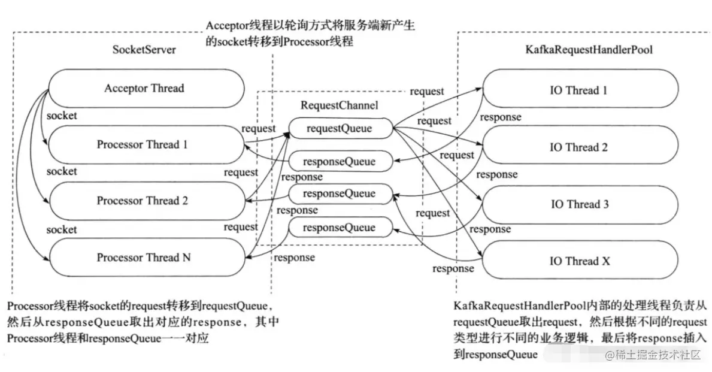

- 配置
  - `num.network.threads`：processor 数量
  - `num.io.threads`：API Thread 数量（io thread）


**请求处理组件**

- **SocketServer** - 接收请求

- **Acceptor 线程** - 请求分发

  - 轮询，将入站请求公平地分发到所有网络线程

- **Processor Thread 网络线程池**

  - `num.network.threads = 3`

  - 负责与客户端通过网络读写数据

    > 网络线程拿到请求后，并不自己处理，而是放入一个共享请求队列（Request Queue）中；
    >
    > 最后从 Response Queue 中找到response并返回给客户端

- **Request Queue 共享请求队列**

  > 所有网络线程共享

- **IO 线程池**

  - `num.io.threads = 8`
  - 从 Request Queue 共享请求队列中取出请求，进行处理；包括写入磁盘、读取页缓存等

- **Response Queue** 请求响应队列

  - 每个网络线程专属，不共享；因为没必要共享了！！！

- **Purgatory** 炼狱

  - 作用：用来**缓存延时请求**。当请求不能立刻处理时，就会暂存在 Purgatory 中。等条件满足，IO线程会继续处理该请求，将Response放入对应网络线程的响应队列中

    > - Case-1: produce requests with `acks=all`. 需要所有ISR副本都接收消息后才能返回。处理该请求的IO线程就必须等待其他Broker的写入结果。
    >
    > - Case-2: consumer fetch requests with `min.bytes=1`
    >
    > - Case-3: consumer Join Group Request，等所有consumer接入

  - 原理：Hierarchical Timing Wheels
  
    > https://www.confluent.io/blog/apache-kafka-purgatory-hierarchical-timing-wheels/ 
    >
    > - Timeout timer：
    >   - DelayQueue: 插入复杂度 O(logn)
    >   - Hierarchical Timing Wheel: 插入复杂度 O(m), m = 时间轮个数
    >     - Tips: 循环数组取多长为宜？2的N次幂 --> 以便将 `取模运算` 优化为 `位运算` ：a % 2^n == a & (2^n - 1)
    >     - 时间轮 + 最小堆：堆内存储有请求的时间格，避免空转。
    > - Watcher list:  


**TCP 连接管理**

**生产者TCP连接管理**

- TCP

  - 多路复用请求：将多个数据流合并到一条物理连接。
  - 同时轮询多个连接

- **建立连接**

  - 时机1：创建 Producer 时与 `bootstrap.servers` 建链

    > Sender 线程：new KafkaProducer 时会创建“并启动” Sender 线程，该线程在开始运行时会创建与 `bootstrap.servers` 的连接 

  - 时机2：更新元数据后，如果发现与某些 Broker 没有连接，则建链。

    > 更新元数据的时机：
    >
    > 1. 给不存在的主题发送消息时，Broker 返回主题不存在，Producer 会发送 METADATA;
    > 2. `metadata.max.age.ms` 定期更新元数据；
    >
    > 问题：会连接所有 Broker，浪费！

  - 时机3：发送消息时，会连接到目标 Broker；

  - 流程

    1. 创建 KafkaProducer 实例；
    2. 后台启动 Sender 线程，与 Broker 建立连接：连接到 `bootstrap.servers`；
    3. 向某一台 broker 发送 METADATA 请求，获取集群信息；

- **关闭连接**

  - 主动关闭：`producer.close()`
  - 自动清理：`connections.max.idle.ms` (broker端发起)

- **更新集群元数据**

  - 时机1：当给一个不存在的主题发消息：回复主题不存在，producer 会发送 metadata 请求刷新元数据；
  - 时机2：`metadata.max.age.ms` 到期


**消费者 TCP 连接管理**

- **创建连接**

  - 执行 poll() 时建链，`new KafkaConsumer()` 时并不创建连接。三个时机：

    - 时机1：首次执行poll()，发送 FindCoordinator 请求时

      > 目的：询问 Broker 谁是当前消费者的协调者；
      >
      > 策略：向集群中当前负载最小的 Broker 发送请求

    - 时机2：连接协调者，执行组成员管理操作时

      > 只有连接协调者，才能处理加入组、分配、心跳、位移提交等

    - 时机3：消费数据时

      > 与分区领导者副本所在 Broker 建立连接

- 关闭连接

  - 主动关闭： `KafkaConsumer.close()`、`kill`
  - 自动关闭：`connection.max.idel.ms` 到期，默认9分钟


## || 生产者

### 发送流程

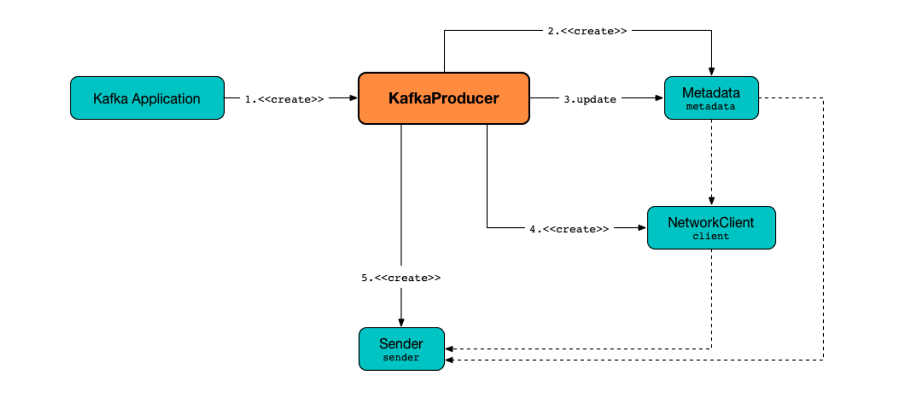

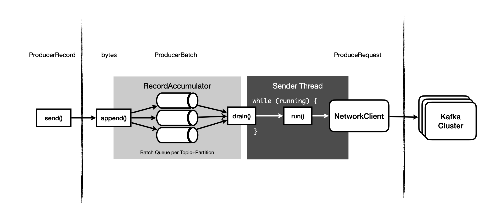

**准备**

- **0. 创建 KafkaProducer** 

  - 线程安全！可以在多个线程中使用同一个 KafkaProducer，建议全局变量。

  - 

- **1. 创建 ProducerRecord**

  > 必选：Topic, Value
  >
  > 可选：Key, Partition
  >
  > - Batch 批量发送：权衡吞吐量 vs. 延时
  > - 元数据
  >   - key：可选，消息分区的依据
  >   - offset：分区内唯一
  >
  > - Schemas
  >
  >   - JSON, XML, Avro


**send()**

- **2. Seriazlier 序列化**

  > 将 key/value 序列化为字节数组；
  >
  > 实现方式
  >
  > - 自定义：继承 Serializer；不推荐：兼容性
  > - 使用已有的：JSON、Avro、Thrift、Protobuf
  >   - 引入 Schema Registry
  >   - `schema.registry.url` --> Q: 如何关联到 Schema ID / version ??
  >
  > 注意：不是序列化整个 ProducerRecord对象？ NO，**序列化的是 value 对象**

- **3. Partitioner 确定分区** 

  > 分区机制
  >
  > - **如果已指定 Partition**：不做处理
  >
  > - **如果已指定 Key**: 按 Key Hash 分区
  >
  >   ```java
  >   List<PartitionInfo> partitions = cluster.partitionsForTopic(topic);
  >   return Math.abs(key.hashCode()) % partitions.size();
  >   ```
  >
  >   - 使用 Kafka 自己特定的散列算法
  >   - 如果增加 Partition，相同 key 可能会分到另一个Partition --> 建议提前规划，不要随意增加分区
  >
  > - **自定义分区器**：场景 - 某个 key 数据量超大，需要写入专门的分区；
  >
  >   ```java
  >   // 实现Partitioner接口
  >   int partition(String topic, Object key, byte[] keyBytes, Object value, byte[] valueBytes, Cluster cluster);
  >   ```
  >
  > - key == null && **没有分区器**：则 Round-robin 平衡

- **4. 记录到 batch** 

  > 同一个batch的记录，会发送到相同的Topic / Partition
  >
  > - 每个分区对应一个 `RecordAccumulator`

- **5. 单独 Sender 线程 发送batch 到相应的 Broker** 

  > **Sender 线程**：new KafkaProducer 时会创建“并启动” Sender 线程，该线程在开始运行时会创建与`bootstrap.servers`的连接。
  > 
  >三种发送方式
  > 
  >- fire-and-forget：`send(record)`
  > - 同步发送： `send(record).get()` 获取 RecordMetadata
  > - 异步发送：`send(record, Callback)`


**Response**

- **6. Broker 回复 Response** 

  > 成功：返回 RecordMetadata，包含 topic / partition / offset
  >
  > 失败：返回 Error，生产者决定是否重试

- **7. close** 

  > 可用 try-with-resource


### 拦截器

**代码实现**

- 配置 `interceptor.classes`

```java
Properties props = new Properties();
List<String> interceptors = new ArrayList<>();
interceptors.add("com.yourcompany.kafkaproject.interceptors.AddTimestampInterceptor"); // 拦截器1
interceptors.add("com.yourcompany.kafkaproject.interceptors.UpdateCounterInterceptor"); // 拦截器2

props.put(ProducerConfig.INTERCEPTOR_CLASSES_CONFIG, interceptors);
```

- 实现接口 `ProducerInterceptor`

  > `onSend()`：发送之前被调用
  >
  > `onAcknowlegement()`：早于callback调用；与onSend()是不同线程，注意共享变量的同步！

**应用场景**

- 监控、审计

- 一个消息从生产到消费的总延时


### 重试&乱序

默认会自动重试；相关参数：`retries`, `delivery.timeout.ms`

- 自动重试的问题
  - 重复：生产者会重复发送同一消息；
  - 乱序：之前发送的消息被重试；

- 解决1：`enable.idempotence=true` 

  > - Broker 此时会多保存一些字段，用于判断消息是否重复，自动去重
  
- 解决2：`max.in.flight.requests.per.connection=1` ，一次只能发送一个请求；

  > 保证消息顺序，并允许重试错误消息；

- 解决3：手工重试

  - `retries = 0`

  - 实现回调 `onCompletion()` 


### 幂等

- 目的：为了实现 Exactly-Once Produce.

- 客户端：发送时引入两个字段

  - `seq`：每条消息赋予唯一ID

  - `PID`：唯一的生产者ID。broker 分发 PID（broker 向 zk 申请可分发的 ID，保证各broker 可用的ID不重复）。

- 服务端：服务端收到消息，对比存储的**最后一条ID**，如果一样，则认为是重复消息丢弃

- 配置

  - `enable.idempotence = true`
  - `acks = all`  保证数据一致性，否则seq顺序可能乱
  - `retries > 1` 否则可能丢消息
  - `max.in.flight.requests.per.connection <= 5` 正在发送中的 batch 数目。 
    ——为什么是5？Broker 对每个 PID 只缓存5个 seq。
    ——如果设置>5，且最前面的msg ack丢失、producer重发、broker无法判断这条是否重复。


## || 消费者

**定义**

- 组内所有消费者协调在一起来消费订阅主题的所有分区

- 每个分区只能由组内的一个 Consumer 实例消费
  - 增加组内消费者：scale up


**模型**

- 消息队列模型：所有实例都属于同一个 group

- 发布订阅模型：所有实例分别属于不同 group


**组员个数**

- `= 分区数`：每个实例消费一个分区
- `> 分区数`：有实例空闲
- `< 分区数`：有实例消费多个分区


**要点**

- 每个 Consumer 属于一个 Consumer Group
- 每个 Consumer 独占一个或多个 Partition
- 每个 Consumer Group 都有一个 `Coordinator `
  - 负责分配消费者与分区的对应关系
  - 当分区或者消费者发生变更，则触发 rebalance

- Consumer 维护与 `Coordinator` 之间的心跳，以便让 Coordinator 感受到 Consumer 的状态


### 消费流程

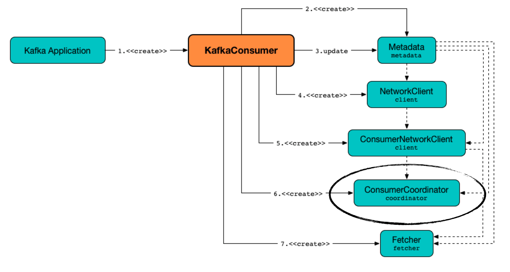

**准备**

- **0. 创建 kafkaConsumer** 

  - 非线程安全！

- **1. subscribe(topics)** 

  > 参数：Topic 列表
  >
  > - 参数可以是正则表达式；
  > - 同时注册多个主题，如果有新主题匹配，会触发 Rebalance；
  >

  - 或者作为 standalone 消费者直接 **assign** 分区： `consumer.assign(Collections.singleton(new TopicPartition("real-donald-trump", 1)));` ——此时无需指定 group.id


**轮询**

- **2. poll()** 

  > 第一次 poll 时
  >
  > - 找到 GroupCoordinator、加入 Consumer Group、收到 Partition 指派
  > 
  > 
  >
  > 返回值 ConsumerRecords
  >
  > - 是 ConsuemrRecord的集合；包含 topic / partition / offset / key / value
  >
  > 
  > 
  >Deserializer
  > 
  >- 不推荐自定义
  > - Avro
  >  - 引入 Schema Registry
  >   - Q: 如何关联到 Schema ID / version ??


**关闭**

- **3. consumer.wakeup()** 

  > 从另一个线程调用，例如 `addShutdownHook()` 中调用；然后 poll() 会抛出  WakeupException，该异常无需处理；
  >
  > --> Q：wakeup() 用户在其他线程中关闭一个 Consumer
  
- **4. commit / close** 

  > 会马上触发 Rebalance，而无需等待 GroupCoordinator  被动发现；
  >
  > 注意要在 finally 中执行；


**编码**

- 消费者组 `KafkaConsumer.subscribe()`

- 独立消费者 `KafkaConsumer.assign()`

- 拦截器

  - `interceptor.classes`

  - 实现接口 `ConsumerInterceptor`

    > onConsume()：消费之前被调用
    >
    > onCommit()：提交位移之后执行


### Multi-Threading

**1. 粗粒度：每个线程启一个 KafkaConsumer**

```java
public class KafkaConsumerRunner implements Runnable {

  private final AtomicBoolean closed = new AtomicBoolean(false);
  private final KafkaConsumer consumer;

  public void run() {
   try {
     //配置订阅
     consumer.subscribe(Arrays.asList("topic"));
 
     while (!closed.get()) {
	     ConsumerRecords records = consumer.poll(Duration.ofMillis(10000));
       //TODO 执行消息处理逻辑
     }
   } catch (WakeupException e) {
      // Ignore exception if closing
      if (!closed.get()) throw e;
   } finally {
      // 关闭消费者
      consumer.close();
   }
}

// Shutdown hook which can be called from a separate thread
public void shutdown() {
   closed.set(true);
   consumer.wakeup();
}

````


- 优点
  - 实现简单
  - 线程之间独立，没有交互
  - 可保证分区内消息的顺序性

- 缺点
  - 占用资源：内存、TCP连接
  - 线程数受限：不能多于分区数
  - 无法解决消息处理慢的情况


**2. 细粒度：多线程执行消息处理逻辑**

https://www.cnblogs.com/huxi2b/p/7089854.html

```java
private final KafkaConsumer<String, String> consumer;

// 线程池定义
private ExecutorService executors = new ThreadPoolExecutor(workerNum, workerNum, 0L, TimeUnit.MILLISECONDS, new ArrayBlockingQueue<>(1000), new ThreadPoolExecutor.CallerRunsPolicy());

...
while (true)  {
  ConsumerRecords<String, String> records = consumer.poll(Duration.ofSeconds(1));
  
  for (ConsumerRecord record : records) {
    // 每个线程处理一个 Record
	  executors.submit(new Worker(record)); 
  }
}


```

- 优点
  - 消息获取、消息消费独立
  - 伸缩性好

- 缺点
  - 实现难度大：有两组线程
  - **无法保证分区内消息的顺序性**
  - **较难正确提交正确的位移**
    - 因为消息消费链路被拉长
    - 可能导致消息重复消费

## || Rebalance

**触发条件**

- **消费者组成员数目变更**
  - 增加、离开、崩溃
  - 需要避免不必要的重平衡：被协调者错误地认为消费者已离开
- **主题数变更**
  - 例如订阅模式 `consumer.subsribe(Pattern.compile("t.*c"))`；当创建的新主题满足此模式，则发生rebalance
- **分区数变更**
  - 增加


**重平衡的问题**

- **Rebalance 过程中，所有 consumer 停止消费**
  - STW
  - Q：消费者部署过程中如何处理？--> 发布系统：只有在 switch 的时候才启动消费者？

- **Rebalance 是所有消费者实例共同参与，全部重新分配；而不是最小变动**
  - 未考虑局部性原理

- **Rebalance 过程很慢**


**什么是不必要的重平衡？**

- 被 coordinator “错误地”认为已停止

- 组员减少导致的 rebalance


**避免不必要的重平衡**

- **避免“未及时发心跳”而导致消费者被踢出**

  - *session.timeout.ms* 存活性时间，间隔越小则越容易触发重平衡 `session.timeout.ms = 6s`
  - *heartbeat.interval.ms* 心跳间隔，用于控制重平衡通知的频率；保证在 timeout 判定前，至少发送 3 轮心跳 `heartbeat.interval.ms = 2s`

- **避免“消费时间过长”而导致被踢出**

  - *`max.poll.interval.ms`增大* 两次poll() 的最大间隔，如果超过，则consumer会发起“离开组”请求；--> 如果消费比较耗时，应该设大，否则会被Coordinator剔除出组
  - (?) Worker Thread Pool 异步并行处理： 注意不能阻塞poll，否则心跳无法上报。异步处理开始后，pause() 使得继续 poll 但不返回新数据；等异步处理结束，再 resume() 

- **GC调优**

  - Full GC导致长时间停顿，会引发 rebalance

  

**重平衡监听器 ConsumerRebalanceListener**

作用

- 当将要失去分区所有权时，处理未完成的事情（例如提交 offset）

- 当被分配到一个新分区时，seek 到指定的 offset处


接口

- `onPartitionsAssigned(partitions)`
  - 触发时间：消费者停止消费之后、rebalance 开始之前
  - 常见操作：清理状态、seek()

- `onPartitionsRevoked(partitions)`
  - 触发时间：rebalance 之后、消费者开始消费之前
  - 常见操作：提交 offset；注意要用 commitSync()，确保在 rebalance **开始？**之前提交完成

- `subscribe(topics, listener)` 指定监听器


```java
Map<TopicPartition, OffsetAndMetadata> currOffsets = new HashMap();

class HandleRebalance implements ConsumerRebalanceListener {
  // 消费者停止消费之后、rebalance开始之前
  public void onPartitionsAssigned(Collection<TopicPartition> partitions) {}
  
  //Rebalance Revoked: 重平衡之后，commitSync提交偏移量
  public void onPartitionsRevoked(Collection<TopicPartition> partitions) {
    consumer.commitSync(currOffsets);
  }
}

try {
  //subscribe 时传入监听器
  consumer.subscribe(topics, new HandleRebalance());
  
  while (true) {
    // 轮询
    ConsumerRecords<String, String> records =  consumer.poll(100);
    for (ConsumerRecord record : records) {
       process(record); 
       //记录当前处理过的偏移量
       currOffsets.put();
    }
 
    // commitAysnc 使用异步提交规避阻塞
    commitAysnc(currOffsets, null);
  }
} catch (WakeupException e) {
  // ignore.
} catch (Exception e) {
   handle(e); 
} finally {
   try {
     // 最后一次提交使用同步阻塞式提交
     consumer.commitSync(currOffsets);     
	 } finally {
	   consumer.close();
   }
}

```


**重平衡原理**

如何通知消费者进行重平衡？

- **心跳线程**
- Consumer 定期发送心跳请求到 Broker；Broker 通过心跳线程通知其他消费者进行重平衡；
  - `heartbeat.interval.ms`：控制重平衡通知的频率

- **Group Coordinator**

  - 当分组协调者决定开启新一轮重平衡，则在“心跳响应”中加入 `REBALANCE_IN_PROGRESS`


**重平衡过程消费者组状态流转**

- 状态

  - `Empty`：组内没有任何成员，但可能存在已提交的位移
  - `Dead`：组内没有任何成员，且组的元数据信息已在协调者端移除
  - `PreparingRebalance`：消费者组准备开启重平衡
  - `CompletingRebalance`：消费者组所有成员已加入，正在等待分配方案。= AwaitingSync ?
  - `Stable`：分配完成

- 流转

  - 初始化

    > Empty --> PreparingRebalance --> CompletingRebalance --> Stable

  - 成员加入/退出

    > Stable --> PreparingRebalance
    >
    > 所有成员重新申请加入组

  - 所有成员退出

    > Stable --> PreparingRebalance --> Empty
    >
    > kafka定期自动删除empty状态的过期位移


**重平衡流程**

- 场景一：Consumer 端重平衡

  - **JoinGroup 请求**

    1. 加入组时，向分组协调者发送 JoinGroup 请求、上报自己订阅的主题
    2. 选出 Leader Consumer
       - 协调者收集到全部成员的 JoinGroup 请求后，"选择"一个作为领导者；Q：如何选择？--> == 第一个加入组的消费者？
       - 协调者将订阅信息放入 JoinGroup 响应中，发给 Leader Consumer；
       - **Leader Consumer** 负责收集所有成员的订阅信息，据此制定具体的分区消费分配方案： PartitionAssignor
       - 最后 Leader Consumer 发送 SyncGroup 请求

    > Q：为什么引入 Leader Consumer？可否协调者来分配？
    >
    > A：客户端自己确定分配方案有很多好处。比如可以独立演进和上线，不依赖于服务器端

    

  - **SyncGroup请求**

    1. **Leader Consumer** 将分配方案通过 SyncGroup 请求发给协调者；同时其他消费者也会发送空的 SyncGroup请求；
    2. 协调者将分配方案放入 SyncGroup 响应中，下发给所有成员；即**通过协调者中转**；
    3. 消费者进入 Stable 状态


- 场景二：Broker 端重平衡

  - **新成员入组  JoinGroup**

    > 回复“心跳请求”响应给所有成员，强制开启新一轮重平衡；

  - **组成员主动离组 close()： LeaveGroup** 

    > 回复“心跳请求”响应给所有成员，强制开启新一轮重平衡

  - **组成员崩溃离组**

    > session.timeout.ms 后，Broker感知有成员超时；（在此期间，老组员对应的分区消息不会被消费）
    >
    > 回复“心跳请求”响应给所有成员时，强制开启新一轮重平衡


## || Zookeeper

节点列表

>Kafka
>
>- `brokers`
>  - `ids/xx` 对应每个Broker，包括其地址、版本号、启动时间
>  - `seqid`
>  -  `topics/x/partitions/0/state` 分区信息，包括分区Leader、 所有 ISR 的 Broker ID
>- `consumers`
>  - `consumer-group/ids/{consumer_id}` 消费者信息
>  - `/consumer/consumer-group/owners/topic-x/p-x` 分区消费关系信息
>  - `/consumers/consumer-group/offsets/topic-x/p-x` 位移信息
>- `controller`
>- `controller_epoch`
>- `cluster`
>- `config`
>- `admin`


**broker**

- **Broker 列表** `/brokers/ids/0` 

  - 临时节点：如果 broker 宕机，节点删除
  - 新启动的 Broker 如果有相同 ID，则无缝继承原 Broker 的 partition / topic
  - 内容：对应每个在线的 Broker，包含：
    - Broker 地址、
    - 版本号、
    - 启动时间
  
  ```sh
  ## Schema:
  {
    "jmx_port": jmx端口号,
    "timestamp": kafka broker初始启动时的时间戳,
    "host": 主机名或ip地址,
    "version": 版本编号默认为1,
    "port": kafka broker的服务端端口号,由server.properties中参数port确定
  }
  
  ## Example:
  {
    "jmx_port": 6061,
    "timestamp":"1403061899859"
    "version": 1,
    "host": "192.168.1.148",
    "port": 9092
  }
  ```

  

- **分区信息** `/brokers/topics/x/partitions/0/state`

  - 内容：保存分区信息，包括
    - 分区的 Leader、 
    - 所有 ISR 的 Broker ID
  
  - 如果该分区的 leader broker 宕机，节点删除
  
  ```sh
  ## Schema:
  {
    "controller_epoch": 表示kafka集群中的中央控制器选举次数,
    "leader": 表示该partition选举leader的brokerId,
    "version": 版本编号默认为1,
    "leader_epoch": 该partition leader选举次数,
    "isr": [同步副本组brokerId列表]
  }
  
  ## Example:
  {
    "controller_epoch": 1,
    "leader": 2,
    "version": 1,
    "leader_epoch": 0,
    "isr": [2, 1]
  }
  ```
  
  

**consumer**

- **消费者信息** `/consumers/consumer-group/ids/{consumer_id}`

  ```sh
  ## Schema:
  {
    "version": 版本编号默认为1,
    "subscription": { //订阅topic列表
        "topic名称": consumer中topic消费者线程数
     },
    "pattern": "static",
    "timestamp": "consumer启动时的时间戳"
  }
  
  ## Example:
  {
    "version": 1,
    "subscription": {
       "open_platform_opt_push_plus1": 5
    },
    "pattern": "static",
    "timestamp": "1411294187842"
  }
  ```


- **消费位移信息** `/consumers/consumer-group/offsets/topic-x/p-x`
  - 问题：offset 写入频繁，并不适合 zk
  - 所以新版本 offset 保存在 内部 Topic 中：` __consumer_offsets`


- **分区消费关系** `/consumer/consumer-group/owners/topic-x/p-x`

  - 标识 partition 被哪个 consumer 消费

  

**controller**

- 临时节点 `/controller`

**config**

- TODO


**用例**

**1. 客户端如何找到对应 Broker 地址**

- 先从分区信息 `/brokers/topics/x/partitions/0/state` 中找到分区对应的 brokerID
- 再从 Broker 列表 `/brokers/ids` 中找到对应地址

注意

- 客户端并不直接和 zk 交互，而是和 broker 交互；
- 每个broker 都维护了和 zk 数据一样的元数据**缓存**，通过 Watcher 机制更新


# | 逻辑组件


## || 主题 / 分区

**Topic - 主题** 

类似数据库里的表


**Partition - 分区**

- **作用：**
  - 实现数据冗余 Redundancy，每个 Partition 可以分布在不同机器上：Replica

  - 实现伸缩性 Scalability：一个 Topic 包含多个 Partition，类比 Sharding

- **特点**
  - 分区内保证顺序

  - 每个分区是一组有序的消息日志

    - 消息日志的定期回收机制
    - Log Segment


- **分区策略**
  - 轮询策略 Round Robin

  - 随机策略 Randomness

    ```java
      List<PartitionInfo> partitions = cluster.partitionsForTopic(topic);
      return ThreadLocalRandom.current().nextInt(partitions.size());
    ```

  - 按消息键保序策略 Key-Ordering：同一个key的所有消息都进入相同分区

    ```java
      List<PartitionInfo> partitions = cluster.partitionsForTopic(topic);
      return Math.abs(key.hashCode()) % partitions.size();
    ```

  - 自定义分区策略：实现Partitioner接口，根据key选择partition

    ```java
    int partition(String topic, Object key, byte[] keyBytes, Object value, byte[] valueBytes, Cluster cluster);
    ```

    ​	

## || 副本

副本作用

- **Availability**：数据冗余，提升可用性、容灾能力
- **备份**：同一分区下所有副本保存“相同的”消息序列


### Leader vs. Follower

- **Leader Replica**
  
  - **负责读写**
  - 每个 partition 只有一个 leader replica：保证 Consistency
  - vs. Preferred Replica
    - 最先创建的副本。
    - 如果 `auto.leader.rebalance.enable = true`，如果 Preferred Replica 不是当前 Leader，而它又在 ISR 中；则触发 leader 选举、将 Preferred Replica 选为 Leader
    - 如果手工 reassign replica，注意第一个 replica 均匀分布在各 Broker上
      
  
- **Follower Replica**

  - **只负责与 Leader 同步**（异步拉取）

    > 1. 为什么Follower不提供读服务？消息写入主节点后，等待ISR个副本都复制成功后才会返回。
    >
    > 2. 异步！
    >
    > 3. 拉取！发送 Fetch 请求， == Consumer 消费消息
    >
    
  - **不对外提供服务**
  
    > 好处：
    >
    > 1. 实现 Read Your Writes：写入后马上读取，没有 lag
    > 2. 实现单调读 Monotonic Reads：不会看到某条消息一会儿存在一会儿不存在
  
  - 会滞后


**思想：同步 vs. 异步复制**

- Kafka 复制机制既不是完全的同步复制，也不是单纯的异步复制；这种使用 ISR 的方式则很好的均衡了确保数据不丢失以及吞吐率。

  > 同步复制要求所有能工作的 follower 都复制完，这条消息才会被commit，这种复制方式极大的影响了吞吐率。
  >
  > 而异步复制方式下，follower 异步的从 leader 复制数据，数据只要被 leader 写入 log 就被认为已经 commit，这种情况下如果 follower 都还没有复制完，落后于 leader 时，突然leader 宕机，则会丢失数据。

- Redis 属于同步复制？


可优化的点

- 提高伸缩性：让 follower 副本提供读功能？

  > **没必要。**
  >
  > - Leader 分区已经均匀分布在各 Broker 上，已有负载均衡；不像 MySQL 压力都在主上；
  > - 而且位移管理会更复杂

- 改善数据局部性：把数据放在与用户地理位置近的地方


### **ISR**

- **AR**: Assigned Replicas - 所有副本集合

- **ISR**: In-Sync Replicas - 只有ISR集合中的副本才可能选为新leader

  - **如何判断是否 In-Sync**：`replica.lag.time.max.ms` (default = 10s)
    ——**是判断落后的时间间隔，而非落后的消息数！**为什么？
    ——否则如果同时写入大量消息，在一瞬间副本一定跟不上，会被踢出 ISR.

  - **ISR 的作用：**The ISR exists to **balance data safety with latency**. It allows for a majority of replicas to fail and still provide availability while minimizing the impact of dead or slow replicas in terms of latency.


  > 原理：Kafka在启动的时候会开启两个任务，
  >
  > - 一个任务用来定期地检查是否需要缩减或者扩大 ISR 集合，这个周期是`replica.lag.time.max.ms`的一半，默认 5000ms。当检测到 ISR 集合中有失效副本时，就会收缩 ISR 集合，当检查到有 Follower 的 HighWatermark 追赶上 Leader 时，就会扩充 ISR。
  > - 除此之外，当 ISR 集合发生变更的时候还会将变更后的记录缓存到 `isrChangeSet` 中，另外一个任务会周期性地检查这个 Set，如果发现这个 Set 中有 ISR 集合的变更记录，那么它会在 zk 中持久化一个节点。
  >   然后 Controller watch 感知到 ISR 的变化，并向它所管理的 broker 发送更新元数据的请求。最后删除该路径下已经处理过的节点。
  >

  

- **OSR**: Out-of-Sync Replicas

- **Observer**：不参与选主，只**异步**复制数据

  - Improved durability without sacrificing write throughput.
  - Replicates across slower/higher-latency links without falling in and out of sync (also known as ISR thrashing)
  - Complements *Follower Fetching*
  - **可用于 DR** - 复制到另一个 DC 中的 Observer


### Leader Election

- **正常领导者选举**
  - 当 Leader 挂了，zk 感知（broker zk node 被删），Controller watch，并从 ISR 中选出新 Leader

  - 其实并不是选出来的，而是 Controller 指定的

- **Unclean 领导者选举**
  - 当ISR全空，如果 `unclean.leader.election.enable=true`；从 OSR 中选出领导者

  - 问题
    - 提高可用性的代价：消息丢失！
    - **CP --> AP**：通过配置参数，实现选择 C vs. A


### Replication

副本同步相关概念：

- **LEO**：Log End Offset，日志末端位移: 表示副本写入下一条消息的位移值。
  
- **高水位 High Watermark**
  
  - HWM = ISR 集合中最小的 Log End Offset (LEO)
  - 分区的高水位  == Leader 副本的高水位
  
- **HWM 作用**

  - 定义消息可见性：消费者只能拉取高水位之前的消息，即 *committed message.*

    > 高水位以上的消息属于未提交消息。即：消息写入后，消费者并不能马上消费到！

  - 实现异步的副本同步 - [TBD]

    https://time.geekbang.org/column/article/112118


**副本同步流程**

-  **ISR**

  - 1. Leader收到消息后，写入本地，并等待复制到所有 Follower  --> 所有 or 所有 ISR?

    > 靠 Follower 异步拉取：Fetch 请求，带上自己的LEO，默认间隔 500ms

  - 2. 如果某个 Follower 落后太多，则从 ISR 中删除

- **Leader 副本**
  
  - 1. 处理生产者写入消息
       - 写入本地磁盘
       - 更新分区高水位值：`HW = max{HW, min(所有远程副本LEO)}`
  - 2. 处理 Follower 副本拉取消息
       -  读取磁盘/页缓存中的消息数据；
       - 更新远程副本LEO值 = 请求中的位移值；
       - 更新分区高水位置：`HW = max{HW, min(所有远程副本LEO)}`
  
- **Follower 副本**：异步拉取

  - 1. Leader 副本收到一条消息，更新状态

       > Leader：`HW = 0`, `LEO = 1`, `RemoteLEO = 0`
       >
       > Follower：`HW = 0`, `LEO = 0`

  - 2. Follower拉 取消息（featchOffset = 0）

       > Follower 本地操作：写入磁盘，更新 LEO，更新 HW = min{Leader HW, 本地LEO}
       >
       > Follwer：`HW = 0`, `LEO=1`

       至此 Leader/Flower 的高水位仍然是0，需要在下一轮拉取中被更新。

  - 3. Follower 再次拉取消息（featchOffset = 1）

       > Leader：`HW = 1`, ` LEO = 1`,`RemoteLEO = 1`
       >
       > Follower：`HW = 1`, `LEO = 1` - Follower收到回复后更新 HW

- **Leader Failover**

  - Leader fail 之后，ZK 通知控制器、选出新 Leader；新 Leader 会将 HW 作为其当前 LEO。

  - Follower 获知新 Leader后，Truncate Local Log to HW，然后发出 fetch 请求。或请求新 Leader 获知 HW、然后据此 Truncate。 

    > 为何要 Truncate log?
    >
    > 新 Leader 可能并未完全catch up，或者新Leader 上次fsync 更久远，truncate 可以避免出现数据不一致。


**Leader Epoch？**

- **HWM 可能出现数据丢失**

  > **场景1：陆续重启**
  >
  > 1. Follower高水位尚未更新时，发生重启；
  >
  > 2. 其重启后，会根据之前的HW来更新LEO，造成数据截断；
  >
  > 3. Follower再次拉取消息，理应会把截断的数据重新拉过来；但是假如此时Leader宕机，Follower则成为新的Leader
  >
  > 只会发生在 min.insync.replicas = 1 时？？？
  >
  > 
  >
  > **场景2：同时重启**
  >
  > 假设集群中有两台Broker，Leader为A，Follower为B。A中有两条消息m1和m2，他的HW为1，LEO为2；B中有一条消息m1，LEO和HW都为1.
  >
  > - 假设A和B同时挂掉，然后B先醒来，成为了Leader（假设此时的min.insync.replicas = 1）。然后B中写入一条消息m3，并且将LEO和HW都更新为2.
  > - 然后A醒过来了，向B发送FetchrRequest，B发现A的LEO和自己的一样，都是2，就让A也更新自己的HW为2。但是其实，虽然大家的消息都是2条，可是消息的内容是不一致的。一个是(m1,m2),一个是(m1,m3)。
  >
  > 这个问题也是通过引入leader epoch机制来解决的。
  >
  > 现在是引入了leader epoch之后的情况：B恢复过来，成为了Leader，之后B中写入消息m3，并且将自己的LEO和HW更新为2，注意这个时候LeaderEpoch已经从0增加到1了。
  > 紧接着A也恢复过来成为Follower并向B发送一个OffsetForLeaderEpochRequest请求，这个时候A的LeaderEpoch为0。B根据0这个LeaderEpoch查询到对应的offset为1并返回给A，那么A就要对日志进行截断，删除m2这条消息。然后用FetchRequest从B中同步m3这条消息。这样就解决了数据不一致的问题。

- **原因**
  
  - Leader/Follower的高水位更新存在时间错配；因为Follower的高水位要额外一次拉取才能更新
  
- **解决： Leader Epoch**
  - 取值

    - 大版本：单调递增的版本号

      > 领导变更时会增加大版本

    - 小版本：起始位移，leader副本在该Epoch值上写入的首条消息的位移

  - 目的

    - 规避高水位可能带来的数据丢失

  - 新的流程

    - Follower重启后，先向Leader请求Leader的LEO；会发现缓存中没有 > Leader LEO的Epoch；所以不做日志截断
  - Leader重启后，新的Leader会更新Leader Epoch


## || 位移

**目的**

- 重平衡后，消费者得以从最新的已提交offset处开始读取

- 当已提交 offset < 当前消费者已处理消息：重复消费

- 当已提交 offset > 当前消费者已处理消息：丢失

  - 但实际丢失部分的消息肯定已被其他消费者处理过，所以没问题


**查看消费者组位移**

```shell
kafka-console-consumer.sh 
  --bootstrap-server host:port 
  --topic __consumer_offsets 
  --formatter "kafka.coordinator.group.GroupMetadataManager\$OffsetsMessageFormatter" 
  --from-beginning
```


**读取位移主题消息**

```shell
kafka-console-consumer.sh 
  --bootstrap-server host:port 
  --topic __consumer_offsets 
  --formatter "kafka.coordinator.group.GroupMetadataManager\$GroupMetadataMessageFormatter" 
  --from-beginning
```


### 位移存储

- 老版本：zk
  - 好处：broker 无状态，方便扩展
  - 坏处：zk 不适合频繁写入

- 新版本：位移主题 `__consumer_offsets`

  - 消息结构

    > Key: groupId + topic + partition
    >
    > - 分区粒度
    >
    > - groupId ==> 消费者信息
    >
    > Value: 
    >
    > -  位移
    > - 时间戳：为了删除过期位移消息
    > - 用户自定义数据

  - 位移主题配置

    > 第一个 consumer 启动时，自动创建位移主题；
    >
    > - 分区数 50：`offset.topic.num.partitions=50` 
    > - 副本数 3： `offset.topic.replication.factor=3`
  
- Tombstone消息

  - 墓碑消息，delete mark；表示要彻底删除这个group信息
  - 当 consumer group下所有实例都停止，并且位移数据都被删除时，会写入该消息


### 位移提交

**1. 自动提交**

- 原理

  - 每隔 N 秒自动提交一次位移

    > Q: how? 单独线程计时？——poll()

  - 开始调用 poll() 时，提交上次 poll 返回的所有消息

    > Q: 和 `auto.commit.interval.ms`有关系吗？[TBD]
    >
    > 自动提交逻辑是在 poll 方法中，如果间隔大于最小提交间隔，就会运行逻辑进行 offset 提交，如果小于最小间隔，则忽略offset提交逻辑？也就是说上次poll 的数据即便处理结束，没有调用下一次 poll，那么 offset也不会提交？

- 配置

  - `enable.auto.commit=true`
  
  - `auto.commit.interval.ms=5000`  表示最小间隔，实际提交间隔可能大于该值
  
  
  > vs. poll 间隔？

- 缺点
  - **consumer 不关闭 就会一直写入位移消息；导致位移主题越来越大。**
    - 需要自动整理消息：Log Cleaner 后台线程
      - Compact 整理策略
      - 扫描所有消息，删除过期消息
  - **可能导致重复消费**
    - 在提交之前发生 Rebalance


**2. 手动提交**

注意，手动提交之前确保该批消息已被处理结束，否则会丢失消息

- **同步提交：`consumer.commitSync()`** 

  > commitSync() 时会阻塞
  >
  > 自动重试

```java
while (true) {
  ConsumerRecords<String, String> records = consumer.poll(Duration.ofSeconds(1));
  process(records); // 处理消息
  
  try {
     consumer.commitSync();
  } catch (CommitFailedException e) {
     handle(e); // 处理提交失败异常
  }
}

```


- **异步提交 `consumer.commitAsync()`**

  > 基于回调；
  >
  > 不会重试，也不要在回调中尝试重试；
  >
  > - 如果重试，则提交的位移值可能早已过期
  > - 除非：设置单调递增的ID，回调中检查ID判断是否可重试

```java
while (true) {
  ConsumerRecords<String, String> records = consumer.poll(Duration.ofSeconds(1));
  process(records); // 处理消息
  
  consumer.commitAsync((offsets, exception) -> {
	if (exception != null)
	   handle(exception);
	});
}

```


- **组合 同步 + 非同步**

  > - 轮询中：commitAsync()，避免阻塞
  >
  > - 消费者关闭前：commitSync()，确保关闭前保存正确的位移， 因为这是rebalance前的最后一次提交机会

```java
try {
  while (true) {
    ConsumerRecords<String, String> records = consumer.poll(Duration.ofSeconds(1));
    process(records); // 处理消息

    // 使用异步提交规避阻塞
    commitAysnc(); 
  }
} catch (Exception e) {
   handle(e); 
} finally {
   try {
     // 最后一次提交使用同步阻塞式提交
     consumer.commitSync();     
	} finally {
	 consumer.close();
    }
}

```


- **精细化提交** `commitAsync(Map<TopicPartition, OffsetAndMetadata>)`

  > 问题：如果一次 poll 过来5000条消息，默认要全部消费完后一次提交
  >
  > 优化：每消费xx条数据即提交一次位移，增加提交频率

```java
Map<TopicPartition, OffsetAndMetadata> offsets = new HashMap<>();
int count = 0;

while (true) {
  ConsumerRecords<String, String> records = consumer.poll(Duration.ofSeconds(1));

  for (ConsumerRecord<String, String> record: records) {
   // 处理消息
   process(record);  

   // 记录已处理的 offsets + 
   offsets.put(
     new TopicPartition(record.topic(), record.partition()),
     new OffsetAndMetadata(record.offset() + 1); // 为什么+1：位移表示要处理的“下一条消息”
  
   if（count % 100 == 0）{
      // 提交已记录的offset
      consumer.commitAsync(offsets, null); // 回调处理逻辑是 null
      count++;
   }
}

```


### 位移重设

**重设策略**

- **位移维度 `consumer.seek()`**

  - `Earliest` 重新消费所有消息

  - `Latest` 从最新消息处开始消费

  - `Current` 重设到当前最新提交位移处。场景：修改了消费者代码，并重启消费者后。

    ```java
    consumer.partitionsFor(topic).stream().map(info -> 
    	new TopicPartition(topic, info.partition()))
    	.forEach(tp -> {
    	  long committedOffset = consumer.committed(tp).offset();
        consumer.seek(tp, committedOffset);
    });
    ```
    
    

  - `Specified-Offset` 手动跳过错误消息的处理。

    ```java
    long targetOffset = 1234L; // 指定 offset
    
    for (PartitionInfo info : consumer.partitionsFor(topic)) {
    	TopicPartition tp = new TopicPartition(topic, info.partition());
    	consumer.seek(tp, targetOffset);
    }
    ```

    

  - `Shift-By-N` 
  
    ```java
    for (PartitionInfo info : consumer.partitionsFor(topic)) {
     TopicPartition tp = new TopicPartition(topic, info.partition());
     long targetOffset = consumer.committed(tp).offset() + 123L; //SHIFT
     consumer.seek(tp, targetOffset);
    }
    ```


- **根据时间查询 offset** `consumer.offsetsForTimes()`

  - 按 DateTime 绝对时间查询位移

    ```java
    long ts = LocalDateTime.of(2019, 6, 20, 20, 0).toInstant(ZoneOffset.ofHours(8)).toEpochMilli();
        
    Map<TopicPartition, Long> timeToSearch = consumer.partitionsFor(topic).stream()
      .map(info -> new TopicPartition(topic, info.partition()))
      .collect(Collectors.toMap(Function.identity(), tp -> ts));
    
    for (Map.Entry<TopicPartition, OffsetAndTimestamp> entry : consumer.offsetsForTimes(timeToSearch).entrySet()) {
      consumer.seek(entry.getKey(), entry.getValue().offset());
    }
    ```
    
  - 按 Duration 相对时间查询位移

    ```java
    Map<TopicPartition, Long> timeToSearch = consumer.partitionsFor(topic).stream()
     .map(info -> new TopicPartition(topic, info.partition()))
     .collect(Collectors.toMap(Function.identity(), tp -> System.currentTimeMillis() - 30 * 1000  * 60));
    
    for (Map.Entry<TopicPartition, OffsetAndTimestamp> entry : consumer.offsetsForTimes(timeToSearch).entrySet()) {
      consumer.seek(entry.getKey(), entry.getValue().offset());
    }
    ```
    
  

**重设方式**

- **kafka-consumer-groups.sh**

  ```shell
  bin/kafka-consumer-groups.sh 
    --bootstrap-server host:port 
    --group test-group 
    --reset-offsets 
    --all-topics 
  
    --to-earliest 
    --to-latest
    --to-current
    --to-offset xx
    --shift-by XX
    --to-datetime 2019-08-11T20:00:00.000
    --by-duration PT0H30M0S
  
    –execute
  ```


- **seek()**


  - **调用时机一：消费者启动时**

    - subscribe / poll 之后，通过 consumer.assignment() 获取分配到的分区，对每个分区执行 `consumer.seek(partition, offset)` 

    - 其中offset 自己管理，从存储中读取

  - **调用时机二：onPartitionAssigned()**

    - 对每个新分配的 partition，执行`consumer.seek(partition, offset)`

    - 其中offset 自己管理，从存储中读取


  ```java
  void seek(TopicPartition partition, long offset);
  void seek(TopicPartition partition, OffsetAndMetadata offsetAndMetadata);
  ```

- **seekToBeginning() / seekToEnd()**

  ```java
  void seekToBeginning(Collection<TopicPartition> partitions);
  void seekToEnd(Collection<TopicPartition> partitions);
  ```

  

### 位移编码范例

```java
// 重平衡 RebalanceListener
class HandleRebalance implements ConsumerRebalanceListener {
  
  //Assigned: 找到偏移量
  public void onPartitionsAssigned(Collection<TopicPartition> partitions) {
    for (TopicPartition p : partitions) 
      consumer.seek(p, getOffsetFromDB(p));
  }
  
  //Revoked: 提交偏移量
  public void onPartitionsRevoked(Collection<TopicPartition> partitions) {
    commitDbTrx();
    //直接commit到kfk?
    //consumer.commitSync(currOffsets);
  }
}

try {
  consumer.subscribe(topics, new HandleRebalance());
  consumer.poll(0);
  // subscribe 时恢复offset
  for (TopicPartition p : consumer.assignement()) {
    consumer.seek(p, getOffsetFromDB(p));
  }
  
  while (true) {
    ConsumerRecords<String, String> records =  consumer.poll(100);
    for (ConsumerRecord record : records) {
       // 同一事务里：存储记录、offset
       storeRecordInDB();
       storeOffsetInDB();
    }
    commitDbTrx();
  

    // 使用异步提交规避阻塞
    commitAysnc(currOffsets, null);
  }
} catch (WakeupException e) {
  // ignore.
} catch (Exception e) {
   handle(e); 
} finally {
   try {
     // 最后一次提交使用同步阻塞式提交
     consumer.commitSync(currOffsets);     
	} finally {
	 consumer.close();
  }
}
```


### 问题

**Q: 消费者重启后，如何获取 offset？**

-  去 位移主题 里查询？
- Coordinator 会缓存


**Q：CommitFailedException**

- 含义

  - 提交位移时发生**不可恢复**的错误


  - 而对于可恢复异常，很多 api 都是支持自动错误重试，例如 commitSync()


- **可能原因**

  - 消费者组开启 rebalance，并将要提交位移的分区分配给了另一个消费者

    > 当超过 `max.poll.interval.ms` 配置的时间，Kafka server 认为 consumer 掉线了，于是就执行分区再均衡将这个 consumer踢出消费者组。但是 consumer 又不知道服务端把自己给踢出了，下次在执行 poll() 拉取消息的时候（**在poll()拉取消息之前有个自动提交offset的操作**），就会触发该问题。 


  - 深层原因：连续两次调用 poll 的间隔 超过了`max.poll.interval.ms`

    > 因为触发了重平衡？


  - 冷门原因：Standalone 消费者的 groupId 与其他消费者组重复


- **规避**

  - 缩短单条消息处理的时间


  - 增大消费一批消息的最大时长：增大 `max.poll.interval.ms`


  - 减少poll方法一次性返回的消息数量：减小 `max.poll.records`


  - 多线程消费


# | 原理


## || 高性能

**原理**

- **批量消息**

  > 批消息构建：生产端
  > 批消息解开：消费端
  >
  > Broker处理的永远是批消息

- **压缩**

- **顺序读写** Sequential File IO

- **PageCache**：

  - 写入数据并不马上写入磁盘，而是先写入 Page Cache.
    ——数据丢失风险？！

  - 消费 tailing 消息直接读取 Page Cache。
    ——理想情况。

  > 为什么不用 JVM cache，而用 OS Page Cache？
  >
  > - 避免 GC
  > - 服务重启之后仍然可用
  > - IO scheduler 会合并写入连续的 small writes

- **零拷贝 ZeroCopy**

  - 发生在传输给 Consumer 时。操作系统 sendfile 函数，Java NIO: `FileChannel.transferTo()` 
    ——为什么 Producer 写入时不用？需要在用户态做验证（检查大小、压缩方式）
    ——如果使用了 SSL 也无法零拷贝，因为要在用户态加密解密。
  - 避免拷贝到**用户态**，只在**内核态**拷贝。
    ——因为不涉及用户态的逻辑处理

  > AS-IS
  > PageCache --> 内存 --> Socket缓冲区
  >
  > TO-BE
  > PageCache --> Socket缓冲区
  >
  > 
  >
  > AS-IS
  > --> 磁盘 
  > --> 内核缓冲区 
  > **--> 用户缓冲区**
  > --> Socket缓冲区
  > --> 网卡缓冲区
  >
  > TO-BE
  > --> 磁盘 
  > --> 内核缓冲区 
  > --> Socket缓冲区
  > --> 网卡缓冲区
  >
  > AS-IS
  >
  > 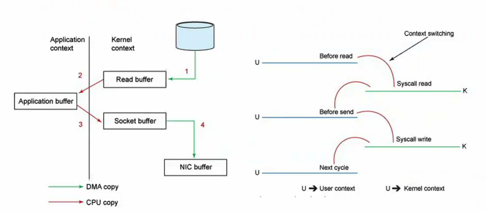
  >
  > TO-BE
  >
  > 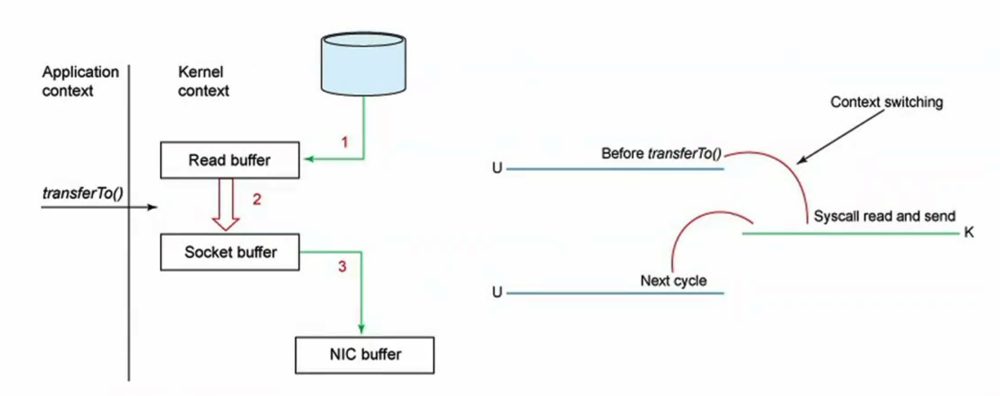
  >
  > 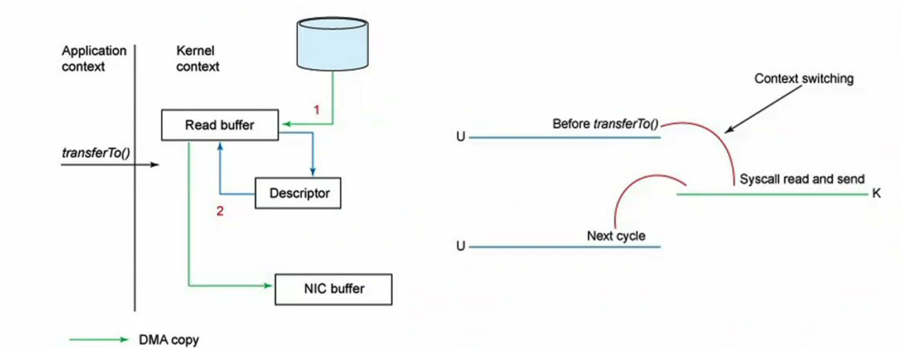
  >
  > 


## || 高可用

> https://jack-vanlightly.com/blog/2018/9/2/rabbitmq-vs-kafka-part-6-fault-tolerance-and-high-availability-with-kafka
>
> https://jack-vanlightly.com/blog/2018/9/14/how-to-lose-messages-on-a-kafka-cluster-part1

副本配置

- `unclean.leader.election.enable = false`
- `replication.factor >= 3`
- `min.insync.replicas > 1` & `ack = all` 
  - 如果 minISR < 配置值，则写入和读取均会失败：NotEnoughReplicas。
- `replication.factor > min.insync.replicas` 
  - 避免挂掉一个 broker 就导致不可用


**复制协议**

> https://www.slideshare.net/ConfluentInc/hardening-kafka-replication

- Leader 接受写入

- Follower 从 leader fetch 数据

  - 如果 Follower 落后太多，会被 leader 踢出ISR；同时 high watermark剔除该 follower的影响
  - 默认只有 ISR 中的副本才有可能变成 Leader

- Leader Election：由 Controller 负责

  - 当 Leader A 挂了，zk 感知，Controller watch，并从 ISR 中选出新 Leader B；zk 中有 ISR 信息

  - 新 Leader B 产生后，即可接受写入；

  - 新 Leader B 产生后，其他 Follower C 会 fetch 数据。此时可能会对其他 Follower 中的未提交数据进行截断；

    > Q：能否 Follower C local HWM 之后的数据直接截断？
    >
    > A：如果 Follower C fetch data 之前新 Leader B 又挂了，Follower C 成为Leader，会有数据丢失！
    >
    > Follower C会询问新Leader 上一个 epoch 的`end offset`，如果大于 local HWM，则无需截断。


**节点分配不均：**

- 问题：节点宕机后，分区 Leader 转移到其他节点；而节点恢复后，并不会自动迁移回来？
- 解决：
  - 方案一：主题配置 `auto.leader.rebalance.enable=true`，允许 controller 将leadership 重分配到 **prefered replica** leader 节点。
  - 方案二：手工执行 `kafka-prefered-replica-election.sh`


**[网络分区](https://jack-vanlightly.com/blog/2018/9/2/rabbitmq-vs-kafka-part-6-fault-tolerance-and-high-availability-with-kafka)**

- **场景1：Follower 与 Leader 断联，但与 zk 正常**

  - 该 Follower 在 `replica.lag.time.max.ms` 到期后会被清出 ISR
  - 网络分区修复后，继续 fetch，当赶上后重新加入 ISR.

- **场景2：Leader 与所有 Follower 断联，但与 zk 正常**

  - ISR 缩减为 1，数据冗余降低。

- **场景3：Follower 与 zk 断联，但与 Leader 正常**

  - 该 Follower 继续 fetch，并处于 ISR
  - ZK 认为节点宕机，但因为只是 follower，不做处理。

- **场景4：Leader 与 zk 断联，但与 Follower 正常**

  - ZK 感知到 Leader 宕机，通知 Controller、选出新主；

  - 原 Leader 尝试缩减 ISR = 1、继续接受写入；但是因为无法写入zk会失败，拒绝新的请求；

  - 客户端探测到 Leader 改变、开始写入到新 Leader；

  - 网络分区解决后，原 Leader 变为 Follower：truncate log 到新 Leader 的 HW、发送 Fetch 请求。

    > Data Loss：写入原 Leader 但是尚未同步到其他 Follower的消息会丢失。

- **场景5：Follower 与 Leader & zk 断联**

  - 被移出 ISR，同场景1

- **场景6：Leader 与 Follower & zk 断联**

  - 原 Leader 在 `replica.lag.time.max.ms`到期后，尝试缩减 ISR = 1，但是会失败 无法更新zk，拒绝新的请求；
  - 如果 acks=1，则在此期间接受的写入会丢失。
  - 如果 acks=all，
  - 可能短暂脑裂：`acks=1`  `min.insync.replicas=1` 时；
  - 其他同场景4？

- **场景7：Controller 节点与其他节点断联**

  - 可能短暂脑裂

- **场景8：Controller 节点与 zk 断联**

  - 选出新 Controller；原控制器因为无法与zk通信 无法做出任何行动
  - 网络分区解决后，原控制器意识到有新 controller、变成普通节点。

> - Follower 网络分区不会导致消息丢失；
> - Leader / ZK 断联，在`acks=1`时会导致数据丢失，会短时脑裂；


**宕机恢复：Kill Leader**

- **acks = 0**
  - Fire-and-forget
  - 此时Leader宕机会导致数据丢失。两个原因：连接失败、Leader failover
- **acks = 1**
  - 此时Leader宕机会导致数据丢失。一个原因：Leader failover；丢失几率比 acks = 0 小。
- **acks = all**
  - 无数据丢失


## || 事务消息

**1. RocketMQ 事务消息**

> https://help.aliyun.com/document_detail/43348.htm?spm=a2c4g.11186623.0.0.69003945pTBACv#concept-2047067
>
> 

作用：解决本地事务和发消息的数据一致性问题

例子：

- 下单后清理购物车

- 购物车模块：清理后再提交确认

- 订单模块：创建订单 + 发送消息 = 事务


流程

1. Producer --> Broker: 开启事务

2. Producer --> Broker: 发送半消息

   > 半消息：消费者看不到
   >
   > RocketMQ: 添加属性 `PROPERTY_TRANSACTION_PREPARED=true`

3. Producer: 执行本地事务 

4. Producer --> Broker: 提交或回滚 

   > 若失败，则抛异常；业务代码可重试
   >
   > RocketMQ 则实现了**事务反查**：
   >
   > - 需要Produer提供反查接口，Broker定期去查询本地事务状态，根据结果决定提交或回滚。
   > - 作用：Producer发送提交或回滚失败，Broker一直没收到后续命令，兜底策略

5. Broker: 投递消息 


**2. Kafka 事务消息**

> https://www.confluent.io/blog/transactions-apache-kafka

作用

- 实现 Exactly Once 机制：**读数据 + 计算 + 保存结果过程中数据“不重不丢”**；


  - Topic A --> 流计算 --> Topic B 过程中每个消息都被计算一次；


用法

- **生产者设置事务**

  ```java
  //txid 要保证进程重启后id不变，可用某个本地文件名
  //- 反例：UUID
  prop.put("transactional.id", "<transaction-id>");
  ...
  producer.initTransactions();
  try {
    producer.beginTransaction();
    producer.send(record1);
    producer.send(record2);
    producer.sendOffsetsToTransaction(offsets);//如果有offset提交，要用producer完成!
    producer.commitTransaction();
  } catch (KafkaException e) {
    producer.abortTransaction();
  }
  ```

- **消费者设置 `isolation.level`** 

  ```java
  prop.put("isolation.level", "read_committed");
  ...
  Consumer<String, String> consumer = new KafkaConsumer<>(props)
  ```

  - **read_uncommitted**：类似无事务消费；
  - **read_committed**：只读取成功提交了的事务，过滤掉 aborted 消息


实现：为了实现事务，也就是保证一组消息可以**原子性**生产和消费，Kafka 引入了如下概念；


- 引入了 `事务协调者（Transaction Coordinator）`的概念。
  - 与消费者的组协调者类似，每个生产者会有对应的事务协调者，赋予 PID 和管理事务的逻辑都由事务协调者来完成。


  - 引入了 `事务日志（Transaction Log）` 的内部主题。
    - 与消费者位移主题类似，事务日志是每个事务的持久化多副本存储。

  - 事务协调者使用事务日志来保存当前活跃事务的最新状态快照。
    
  - 引入了`控制消息（Control Message）` 的概念。
    - 这些消息是客户端产生的并写入到主题的特殊消息，但对于使用者来说不可见。它们是用来让 broker 告知消费者之前拉取的消息是否被原子性提交。


  - 引入了 `TransactionalId` 的概念，
    - TransactionalId 可以让使用者唯一标识一个生产者。一个生产者被设置了相同的 TransactionalId 的话，那么该生产者的不同实例会恢复或回滚之前实例的未完成事务。


  - 引入了 `生产者epoch` 的概念。
    - 生产者epoch可以保证对于一个指定的TransactionalId只会有一个合法的生产者实例，从而保证事务性即便出现故障的情况下。


原理

- 组件

  - **Transaction Coordinator**
  - **Transaction Log**
    - 是一个内部 Topic，保存事务的最近一次状态 `Ongoing`  `Prepare commit` `Completed`；
    - 其每个分区被一个 Cooridinator 管理；
    - 每个 `transactional.id` 哈希映射到 transactional log的一个分区，也就是**每个tid 对应一个 coordinator**；

- 流程

  1. **Producer - Tx Coordinator**

     > 三个场景下，producer 需要跟 Coordinator 交互
     >
     > - initTransactions：coordinator 关闭同一 txid 下的其他未完成事务；
     > - 首次发送数据：分区与 coordinator 注册；
     > - commitTransaction / abortTransaction：触发两阶段提交

  2. **Tx Coordinator - Tx Log**

     > Coordinator 将事务状态存到内存、写入Log

  3. **Producer - Topic**

     > Producer 正常写入主题

  4. **Tx Coordinator - Topic** 

     > 2PC 两阶段提交 https://www.jianshu.com/p/f77ade3f41fd
     >
     > - 阶段一：协调者将内部状态置为 `PREPARE_COMMIT` ，并将该状态更新到事务日志。（完成后则保证事务将被提交）；
     > - 阶段二：协调者 call WriteTxnMarkerReqeust--> 分区Leader，往主题分区写入 transaction commit marker `COMMIT(PID)` or `ABORT(PID)`；之后协调者往事务日志写入 Commit/Aboart 消息。
     >   - 如果消费者配置 `isolation.level = read_committed`，则必须有此 marker 才能看到对应的消息；没有marker则会被过滤掉。
     >   - 写入 marker 后，协调者标记该事务为 `complete`

- Coordinator Failover
  - Recover from txn log. 
  - 如果 `PREPARE_COMMIT` / `PREPARE_ABORT`，继续提交或结束。
  - 如果在 PREPARE 之前，不用管、producer 继续往新 coordinator发请求。


**3. 事务 vs. 幂等**

- Idempotence: 
  - Exactly-once in **order** semantics **PER** partition
- Transaction: 
  - **Atomic** writes across **MULTIPLE** partitions


## || 可靠性交付

### At-Most-Once

- 需要Producer禁止重试


### At-Least-Once

- 默认提供

Q：何时会多于一次？
A：Broker返回应答时 网络抖动，Producer 此时选择重试


**可能消息重复**

- At Least Once + 幂等消费 = Exactly Once

- 幂等性生产

  > - 每条消息赋予唯一ID
  >
  > - 服务端收到消息，对比存储的**最后一条ID**，如果一样，则认为是重复消息丢弃

- 幂等性消费

  > - 利用数据库的唯一约束实现幂等；或者Redis SETNX
  >
  > ```java
  > // 判断 ID 是否存在
  > boolean isIDExisted = selectByID(ID); 
  > if(isIDExisted) {
  >   // 存在则直接返回
  >   return; 
  > } else {
  >   // 不存在，则处理消息
  >   process(message); 
  >   // 存储 ID
  >   saveID(ID);
  > }
  > ```
  >
  > - 为更新的数据设置前置条件：version
  > - 记录并检查操作：Token / GUID


### Exactly-Once

> - http://www.dengshenyu.com/kafka-exactly-once-transaction-interface/ 
> - https://www.confluent.io/blog/exactly-once-semantics-are-possible-heres-how-apache-kafka-does-it/ ！！
> - https://docs.google.com/document/d/11Jqy_GjUGtdXJK94XGsEIK7CP1SnQGdp2eF0wSw9ra8/edit#heading=h.97qeo7mkx9jx 设计文档


实现 Exactly-Once 的两种思路

https://www.splunk.com/en_us/blog/it/exactly-once-is-not-exactly-the-same.html 

- Distributed snapshot/state checkpointing
- At-least-once event delivery plus message deduplication


**Exactly-Once = Idempotence + At Least Once**


**生产者幂等性** 

> 幂等性：保证生产的消息即便重试也不会有重复。

- **配置**
  - `enable.idempotence = true`

- **原理**
  - Broker此时会多保存一些字段（PID, seq），用于判断消息是否重复，自动去重：每条消息会有一个 sequence number。
  - Kafka 发送时自动去重。

- **限制**
  - 无法实现跨分区的幂等
  - 无法实现跨会话的幂等：Producer 重启后会丧失幂等性，因为重启后 PID 会变


**生产者事务** 

区别 RocketMQ 的半消息！

> 事务性保证消息 **原子性** 地写入到多个分区，要么全部成功，要么全部失败 
>
> - 但即便失败，也会写入日志；因为没法回滚
> - 解决幂等性生产者的限制：不能跨分区、跨会话


- **配置：**
  
  - `enable.idempotence = true`
  
  - 同时设置 `transactional.id`
  
    > 如果配置了 transaction.id，则此时 enable.idempotence 会被设置为 true；
    >
    > 在使用相同 TransactionalId 的情况下，老的事务必须完成才能开启新的事务
  
- 代码中显式地提交事务

- consumer改动：设置 `isolation.level` 

  - **read_uncommitted**：类似无事务consumer；
  - **read_committed**：只读取成功提交了的事务，否则消费者会读到提交失败的消息

  

  

- **限制**
  
  - 性能更差


**消费者幂等性**

1. 通过“Unique Key”存储，保证消费幂等性

   > RDB / ES

2. 通过 RDB 事务性，原子性写入记录、存储 offset

   > 当重启时，通过 consumer.seek() 找到上次处理位置


### Kafka EOS

>  Exactly-Once Stream
>
>  https://www.confluent.io/blog/enabling-exactly-once-kafka-streams/  

因为上述幂等性、原子性，在Streams应用中只需要配置 `processing.guarantee=exactly_once` 即可保证 Exactly-Once. 


## || 消息丢失

> https://jack-vanlightly.com/blog/2018/9/2/rabbitmq-vs-kafka-part-6-fault-tolerance-and-high-availability-with-kafka


Q: 什么情况下消息不丢失

- **已提交的消息**：当若干个broker成功接收到消息，并写入到日志文件。

- **有限度的持久化保证**：至少有一个 broker 存活 


### 消息丢失原因

**生产阶段丢失**

- 丢失原因

  1. **网络抖动**

  2. **Leader replica 所在 broker 异常**

- 措施

  1. **请求确认机制**

  2. **超时重传**

- 注意

  - 生产者是异步发送消息：fire and forget

  > 慎用 `producer.send(msg)`
  >
  > 推荐 `producer.send(msg, callback)` 或者 `producer.send(msg).get()` 
  >
  > - 在callback中重试
  >
  >   Q: 直接配置 retires不就可以了？？
  >
  > - 在callback中正确处理异常？

  - 重传可能导致重复消费


**存储阶段丢失**

- 丢失原因

  1. **异步刷盘，不是实时存储到磁盘**

- 措施

  1. **单机：写入磁盘后再给 Producer 返回确认**

  2. **集群：至少写入 2 个以上节点，再给 Producer 返回确认**

  > - `acks = all` : 发送给 Leader + 所有 ISR 之后，才发送确认
  > - `unclean.leader.election.enable = false`


**消费阶段丢失**

- 丢失原因

  1. **接收时网络抖动，导致没收到**
  2. **处理时失败，但更新消费进度成功**
  3. **异步处理消息 + 自动提交**：提交时尚有未处理完成的消息

- 措施

  1. **确认机制**

  > - 推荐先消费、再更新位移
  > - 异步处理消息时，不要开启自动提交位移
  >
  > 如果broker没收到消费确认，则下次拉取时还会返回同一条消息


### 消息丢失检测

检测：序号连续递增

- 发送端：拦截器注入序号；
- 接收端：拦截器检测连续性；


### 消息不丢配置

**数据丢失的场景**

- `acks = 1` 时，Leader 宕机、或者Leader 与 ZK 断链。
- `acks = all` 时，出现 unclean 选举
- `min.insync.replicas = 1` 时，即便`acks = all`，也会出现 ISR 缩减为 1 (Leader被网络分区)
- 分区所有副本节点同时宕机：fsync 尚未保存到磁盘。


**Producer 设置**

- `acks = all`

  > 要求所有 ISR 副本Broker都要接收到消息，才算已提交。——“所有 ISR 副本”！而非“所有副本”！
  >
  
- `retries = {big value}`

  > 自动重试消息

- `producer.send(msg, callback)`

  > callback 记录错误、或存储错误、或调用其他应用....


**Broker 设置**

- `unclean.leader.election.enable = false`

  > 禁止落后太多的broker成为leader

- `replication.factor >= 3`

  > 将消息多保存几份

- `min.insync.replicas > 1`

  > 写入多少个副本才算已提交，min.insync.replicas保证的写入副本的下限。broker宕机过多后会报  NotEnoughReplicas。
  >
  > 副作用是会增加延时，受控于 `replica.lag.time.max.ms`。

- `replication.factor > min.insync.replicas`

  > 否则，只要一个副本挂了，整个分区就挂了；还要考虑可用性
  >


**Consumer 设置**

- `enable.auto.commit = false`

- `group.id`

  > 如果某个消费者想要读取所有分区消息，则使用独立的 group.id

- `auto.offset.reset = earliest`

  > 当没有位移可提交时（例如刚启动）从最小位置开始读取；可能导致重复

- 位移提交
  - 并确保消息“处理”完成再提交
  - 提交频率：性能 vs. 重复

- 重试

  - 1. **将待重试记录存入 buffer，下次poll时重试该buffer**

    > 还可以调用 pause() 让下一次poll不返回新数据，更方便重试

  - 2. **将待重试记录写入单独主题**

    > 类似 死信队列
    >
    > 同一消费者组订阅 main topic + retry topic；或由另一个消费者组订阅 retry topic


## || 消息积压

- 马太效应：消息堆积后，移出OS页缓存，失去 zero copy，越堆越多


### 消息积压优化

**发送端性能优化**

- **并发发送**

  > RPC 可直接在当前线程发送消息，因为 rpc 多线程

- **批量发送**

  > 例如离线分析系统


**消费端性能优化**

- 优化消费代码：**并行**

- **扩容**

  > 注意如果大于分区数量则无效果
  >
  > 注意 rebalance 的影响

- **降级**


### **消息积压监控**

即：消费进度监控

- kafka-consumer-groups 脚本

  ```shell
  kafka-consumer-groups.sh 
    --bootstrap-server <Kafka broker 连接信息 > 
    --describe 
    --group <group 名称 >
  ```

  - CURRENT-OFFSET 当前消费进度
  - LOG-END-OFFSET  消息总数
  - LAG 堆积数


- API

  - `AdminClient#listConsumerGroupOffsets()`  列出消费者组的最新offset

  - `KafkaConsumer#endOffset()` 获取订阅分区的最新offset

  - 代码示例：

    ```java
    public static Map<TopicPartition, Long> lagOf(String groupID, String bootstrapServers) {
      Properties props = new Properties();
      props.put(ConsumerConfig.ENABLE_AUTO_COMMIT_CONFIG, false); 
      props.put(ConsumerConfig.GROUP_ID_CONFIG, groupID);  
      props.put(CommonClientConfigs.BOOTSTRAP_SERVERS_CONFIG, bootstrapServers);
      try (AdminClient client = AdminClient.create(props)) {
        // 1.获取消费者组最新位移
        ListConsumerGroupOffsetsResult result = client.listConsumerGroupOffsets(groupID);
        Map<TopicPartition, OffsetAndMetadata> consumedOffsets = result.partitionsToOffsetAndMetadata().get(10, TimeUnit.SECONDS);
      
        try (final KafkaConsumer<String, String> consumer = new KafkaConsumer<>(props)) {
          // 2.获取订阅分区的最新位移
          Map<TopicPartition, Long> endOffsets = consumer.endOffsets(consumedOffsets.keySet());
          return endOffsets.entrySet().stream()
            .collect(Collectors.toMap(
              // key: TopicPartition
              entry -> entry.getKey(),
              // value: 3.做减法
              entry -> entry.getValue() - consumedOffsets.get(entry.getKey()).offset()));
    ```
    
    
  
- JMX

  > kafka.consumer:type=consumer-fetch-manager-metrics,client-id=xx

  - `records-lag-max` 堆积数

  - `records-lead-min` = 消费位移 - 分区当前第一条消息位移

    > 监控快要被删除但还未被消费的数目
    >
    > 原因：消息留存时间达到，之前的老消息被删除，导致lead变小


## || DR

> https://eng.uber.com/kafka/ 
>
> https://www.confluent.io/blog/disaster-recovery-multi-datacenter-apache-kafka-deployments 


**单 DC**

背景：单 DC 如何保证高可用？

> https://www.confluent.io/white-paper/optimizing-your-apache-kafka-deployment/

- 基于 replica，生产端设置 acks = all。如果 leader broker 挂了，会在 ISR 中选取新 leader；
- 客户端通过 bootstrap brokers 指定一组 broker，如果一个 broker 挂了，其他 broker 还能提供连接。
- zk quorum 确保可靠的分布式协同。
- 全局 schema registry：只有 leader instance 提供写服务。


**DR 考虑因素**

- Multi-datacenter designs
- Centralized schema management
- Prevention of cyclic repetition of messages
- Automatic consumer offset translation


### 多 DC 架构

> 多 DC 架构 : https://docs.confluent.io/platform/current/multi-dc-deployments/multi-region-architectures.html
>
> ebay practice: https://ebaytech.berlin/resiliency-and-disaster-recovery-with-kafka-b683a88aea0 


**1. Stretch Clusters**

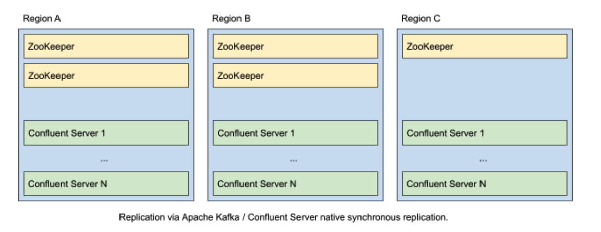

原理

- 跨数据中心，部署单一的 Kafka 集群 >> 通过 Rack

  > Rack awareness ensures that replica placement is such that at least one topic-partition replica exists in each region (or rack).

优点

- 同步复制：RPO = 0, RTO = 0
- 没有资源浪费 

要求：

- DC 间延迟 < 50 ms


**2. Hub-Spokes  (Aggregation)**

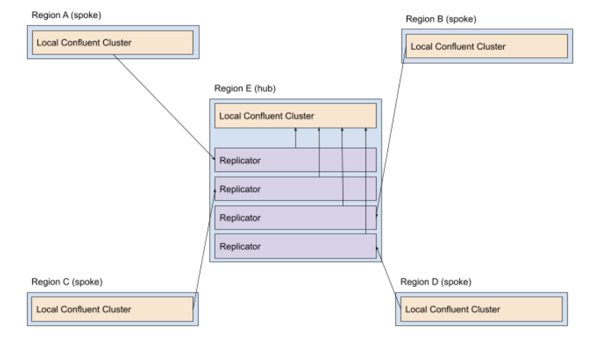

原理

- 一个中央集群，从其他分支集群拉取数据、聚合；简化：两个集群，一个 Leader， 一个 Follower
- `RPO > 0` `RTO >= 0`

场景：

- 各分支集群数据集完全隔离、没有依赖；例如银行的各个分行

优点：

- 简单，易于部署、配置、监控

> 生产者只关心本地集群
>
> Replication 是单向的

缺点：

- 不可跨区读取


**3. Active-Active**

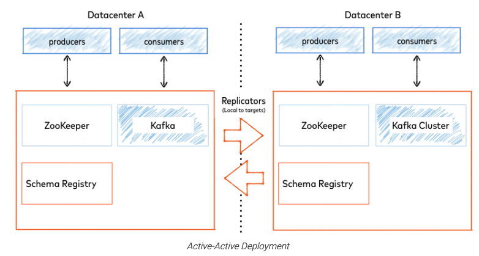

原理

- 各数据中心 共享部分或全部数据；
- 互相异步复制： `RPO > 0` `RTO = 0` 
- 生产者往 Local DC写入；
- 消费者从 Local DC读取；

优点

- 便于就近服务
- 数据冗余、可靠

缺点

- 数据异步读写，需要避免数据冲突

  > 同步延迟问题： stick-session
  >
  > 数据冲突问题：多个集群同时写入同一个数据集

- Mirroring Process 过多

  > 要避免“来回复制”；一般可引入“逻辑主题” / “namespace”：
  >
  > - 常规主题：user
  > - 逻辑主题：clusterA-user, clusterB-user


**4. Active-Passive**

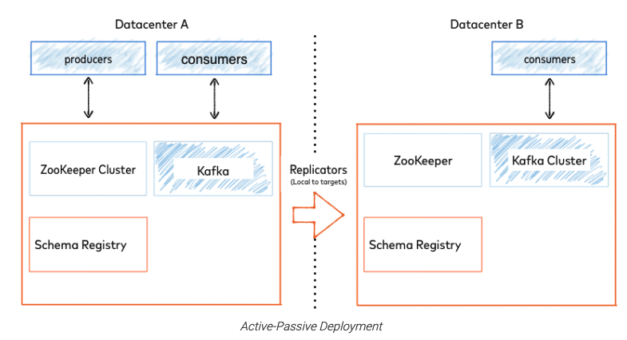

原理

- 有一个数据中心专门用于 Inactive / Cold 复制，而不对外提供写入服务；
- 生产者只往 active DC 写入；
- 消费者可以从 local DC 读取；
- `RPO >0` `RTO > 0`

优点：

- 简单，无需考虑冲突

缺点

- 数据丢失

- 资源浪费

  > 优化：
  >
  > - DR 集群用较小规模 --> 有风险！
  >
  > - DR 集群服务部分只读请求

- Failover 困难

  - 数据丢失、不一致

  - Failover 之后的“起始偏移量”

    > 1. Auto offset reset: 
    >    earliset / latest
    >
    > 2. Replicate offset topic: 
    >    对 `__consumer_offsets` 主题进行镜像；
    >
    >
    > 3. Time-based failover:
    >    每个消息包含一个 timestamp，表示何时被写入kafka；Broker 支持根据 timestamp  查找offset
    >
    > 4. External offset mapping:
    >    用外部存储保存两个数据中心的偏移量对应关系。


5. Local Aggregation

https://eng.uber.com/kafka/ 

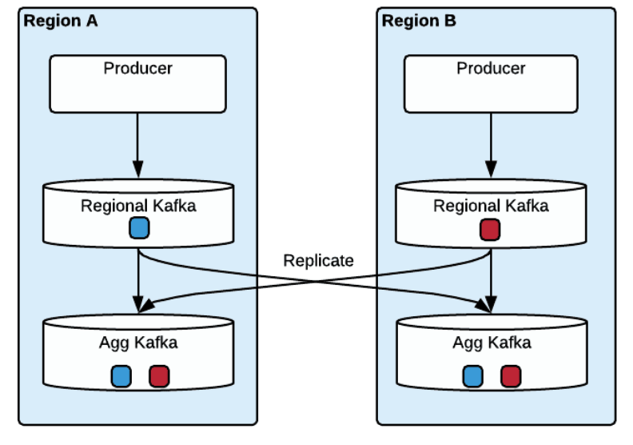

原理

- Producer 写入 Local DC.
- 异步复制到各个 DC 的 Agg Kafka.

消费模式

- Active-Active
  - consumers consume the same topic in the aggregate clusters in each region independently.
  - 会有重复消费？
- Active-Passive
  - 消费者读取某一个agg

**Offset 同步**

- 为什么要同步offset：不同DC agg 上的数据顺序会不一样，因为cross dc replicate会更耗时
- offset mapping 存储：
  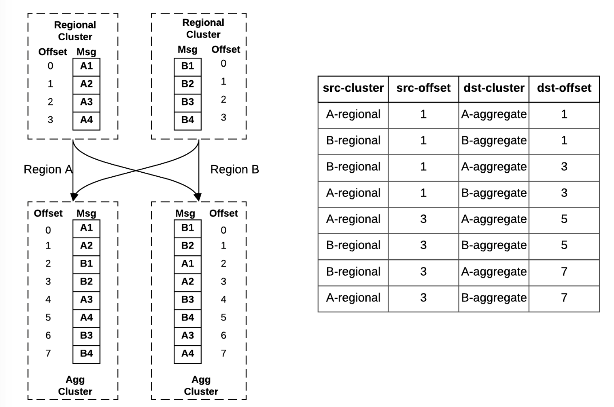

- Offset mapping 算法：找到每个DC topic对应的target agg offset，取最小值。

  


### Failover

**1. Cyclic Message Repetition** 避免消息循环复制

 Prevent Duplicates or Cyclic Message Repetition 

- **Replicator Provenance Hader**
  Replicator为每条消息添加 `provenance header`，来避免重复消息、循环复制；包含：
  - 源 cluster id
  - 源 topic name
  - Replicator 初次复制消息时的 timestamp

如果源 cluster+topic与目标clsuter+topic雷同，则不复制。

- **Topic Naming Strategy**
  还可以通过 主题命名 来避免循环复制。

  - Topic 名中包含 DC：`dc1-topicX` 

    > Replicator 配置为只复制 topic 名中包含对方 DC 的

  - 复制后自动给Topic名字加后缀：`topicX.replica` 

    > Replicator 配置为只复制不含 后缀的主题


**2. Offset Translation - Timestamp Preservation**

- **问题：同一条消息在不同 DC 的 offset 可能不同**，DR 之后不能直接通过 `__consumer_offsets` 恢复消费。
  - 在消费被复制之前，源 DC 由于 rentention 策略或 compaction，删除了消息；
  - 消息复制失败时会重新发送，导致重复，导致 offset 不匹配；
  - 消息复制可能落后于 offset 主题复制，导致 DR 后消费者尝试读取一个还未复制的消息。

- 可基于 timestamp 进行 **offset translation**，offset虽然在多DC间可能不一致，但 timestamp 不会；

  > https://docs.confluent.io/platform/current/multi-dc-deployments/replicator/replicator-failover.html#understanding-consumer-offset-translation
  >
  > - auto.offset.reset 则需要到指定offset，而不是 latest/earliest；
  > - 为消费者配置timestamp-interceptor，将 timestamp - offset 信息存储到 `__consumer_timestamps` 主题；

Q: `offsetsForTimes` API 原理是什么，是查询这个主题吗？


**3. Failover 流程**

1. Replicator 从源 DC 读取 `__consumer_timestamps`，获取消费者组的进度；

2. 将源 DC 的 committed offset 翻译为目标 DC 的 offset；

   > How? 

3. 将翻译后的 offset 写入目标 DC `__consumer_offsets` 

   > 而如果消费者组中已有消费者 目标DC，则不会写入。因为这些消费者会自己提交维护offset。

4. Failover：如果两个 DC 都有消费者， 源 DC 消费者可以选择不迁移，等待源DC恢复；

5. Failover：如果只有源 DC 有消费者，需要在消费者程序考虑迁移到新 DC：重配置 bootstrap servers；

6. 新版本无需 reset offset，因为 "Timestamp Preservation"

   

注意

- Failover 后还是可能有重复消费，因为
  - 同步有延迟
  - offset 提交是周期性的
  - 同一 ts 可能对应多个消息
- Failover 后可能会丢消息
  - Replication Lag


### Failback

- **数据同步**

  - Active-Active 模式：

    - 源 DC 恢复后，Replicator 会自动同步新 DC 数据回来。
    - 源 DC 如果还有未被同步的数据，如果不用保序，则同步到 destination。

  - Active-Passive 模式： 需要手工同步数据。

    > Replicator 默认不会同步有 provenance header 的消息。

- **同步后消息顺序不能保证**

- **客户应用重启**


### Raplicator

> - 15 things : https://www.confluent.io/blog/15-facts-about-confluent-replicator-and-multi-cluster-kafka-deployment/ 
> - Multi-Region: https://www.confluent.io/blog/multi-region-data-replication/ 
> - 入门 https://docs.confluent.io/platform/current/multi-dc-deployments/replicator/replicator-quickstart.html#replicator-quickstart 
> - DEMO https://docs.confluent.io/platform/current/multi-dc-deployments/replicator/replicator-docker-tutorial.html#replicator 
> - 配置参数 https://docs.confluent.io/platform/current/multi-dc-deployments/replicator/replicator-failover.html 


**部署**

- Raplicator 其实是一个 Kafka connector（所以支持 Single Message Transforms，SMTs）
- 一般部署在目标DC，每个 source cluster 对应一个 replicator 实例。
- Active-Active 模式下，要禁止 Replicator 提交 offset：`offset.timestamps.commit=false`

**功能**

- 主题选择：基于白名单、黑名单、正则

- 主题动态创建

- 主题元数据同步：分区数、

- Offset Translation

- Prevent cyclic message repetition


**监控**

- Replication lag: 影响 RPO

**架构**


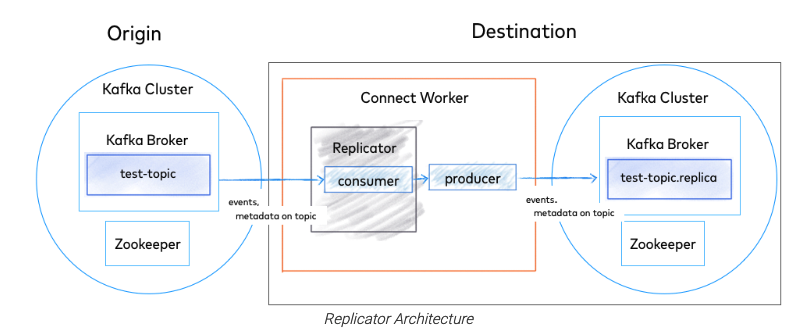

- 主题命名：默认 source 和 desitination 使用同一主题名，而如果从多个 DC 复制到单一 destination，则需要独立的主题。

  > 原因：仅仅是防止配置可能不同？--> Q?
  >
  > 主题同名需要考虑：
  >
  > - Producer 不应等待远程DC的ack; Replicator 在本地commit之后才会异步同步数据；
  >- 生产的消息不会 “全局有序”；
  > - 如果没有DC有相同consumer group的消费者，则会被消费多次。
  
  


### MirrorMaker

> https://kafka.apache.org/documentation/#basic_ops_mirror_maker 

**概念**

- 在不同数据中心之间同步数据

- 原则
  - 一个数据中心至少一个kafka集群
  - exactly-once 复制
  - 尽量从远程数据中心 消费数据，而不往远程数据中心 生产数据


**原理**

一个 Producer + 多个 Consumer

- 一个 Producer
  - 用于写入 Target Cluster

- 多个 Consumer
  - 用于读取 Source Cluster
  - 所有 consumer属于同一个消费者组
  - 个数可配：`num.streams`
  - 每隔 60s 提交 offset 到 Source Cluster `auto.commit.enable = false`

**注意**

- **MirrorMaker 部署位置**

  - 一般部署在 Target Cluster：远程消费” 比 “远程生产” 更安全，否则可能丢失数据

    > 如果消费者断链，只是不能读取，消息还会保存在 Broker；而如果生产者断链，则消息可能丢失

  - 如果集群间是加密传输，则可部署在 Source Cluster

    > 消费加密传输更影响性能
    >
    > 此时注意 acks = all，减少数据丢失

- **部署多个 MirrorMaker 实例，可以提高吞吐量**

  - 注意要是同一个消费者组

- **建议提前创建好主题，否则会按照默认配置自动创建主题**

**问题**

- **Rebalance 期间会停止消费**

  - whitelist 正则匹配，分区变化 会导致 Rebalance

  - MirrorMaker 实例增删 会导致Rebalance

  - 参考 Uber uReplicator

    > https://eng.uber.com/ureplicator-apache-kafka-replicator/
    >
    > 引入 Apache Helix 提供分片管理
    >
    > 引入自定义 Consumer，接受Helix分配的分区

- **配置信息难以保证一致**
- **无法避免循环复制**


可用替换：Confluent's Replicator
https://www.confluent.io/product/confluent-platform/global-resilience/


## || Tiered Storage

> https://cwiki.apache.org/confluence/display/KAFKA/KIP-405%3A+Kafka+Tiered+Storage KIP
>
> https://kreuzwerker.de/en/post/apache-kafka-tiered-storage-and-why-you-should-care 
>
> https://docs.confluent.io/platform/current/kafka/tiered-storage.html 
>
> https://www.youtube.com/watch?v=3lgGgHpYcRs from Uber


Kafka Retention 为什么不能过长？

- 每个 Broker 数据如果过多，会导致 recovery & rebalancing 耗时。

- 如果提高 Broker 个数，又会导致不必要的 空闲CPU/内存 资源；也会带来部署复杂性、运维成本。

  > Q: 不考虑成本的情况下，提高 broker 个数是否是个可行方案？- Topic 增加 partition?

目标

- 延迟敏感的应用，从 local-tier 读取；回追应用，则从 remote-tier 读取；
- 使得存储可以独立于 CPU/内存进行 scale。

限制

- 不支持压缩主题

  


# | 运维

## || 安装&测试

**Broker安装**

- 启动 kafka-server-start.sh

  ```shell
  bin/kafka-server-start.sh 
    -daemon
    config/server.properties
  ```

  

**主题相关：kafka-topics.sh**

- 创建主题

  ```shell
  # 创建主题：--create
  kafka-topics.sh
    --create
    --bootstrap-server host:port
    --zookeeper localhost:2181 (v2.2以前)
    --replication-factor 1
    --partitions 1
    --topic topic_name
    
  # 描述主题 --describe
  kafka-topics.sh
    --zookeeper localhost:2181
    --describe
    --topic topic_name
  
  # 列举主题 --list
  kafka-topics.sh 
    --bootstrap-server host:port 
    --list
  
  # 删除主题（异步）：--delete 
  kafka-topics.sh 
    --bootstrap-server host:port 
    --delete  
    --topic <topic_name>
  
  # 增加分区（可能导致数据迁移）--alter 
  kafka-topics.sh 
    --bootstrap-server host:port 
    --alter 
    --topic <topic_name> 
    --partitions < 新分区数 >
  
  # 减少分区：不支持，因为会导致数据删除
  --> 删除主题、重建
  ```

  

- 变更副本数 kafka-reassign-partitions.sh

  ```shell
  bin/kafka-reassign-partitions.sh 
    --zookeeper zookeeper_host:port 
    --reassignment-json-file reassign.json 
    --execute
  
  reassign.json:
  
  {"version":1, "partitions":[
   {"topic":"__consumer_offsets","partition":0,"replicas":[0,1,2]}, 
    {"topic":"__consumer_offsets","partition":1,"replicas":[0,2,1]},
    {"topic":"__consumer_offsets","partition":2,"replicas":[1,0,2]},
    {"topic":"__consumer_offsets","partition":3,"replicas":[1,2,0]},
    ...
    {"topic":"__consumer_offsets","partition":49,"replicas":[0,1,2]}
  ]}`
  ```

- 主题分区迁移 kafka-reassign-partitions.sh

- 修改主题级别参数 kafka-configs.sh

  ```shell
  # 修改主题级别
  kafka-configs.sh 
    --zookeeper host:port 
    --entity-type topics 
    --entity-name <topic_name> 
    --alter 
    --add-config max.message.bytes=10485760
  ```

- 修改主题限速 kafka-configs.sh

  ```shell
  kafka-configs.sh 
    --zookeeper zookeeper_host:port 
    --alter 
    --add-config 'leader.replication.throttled.rate=104857600,follower.replication.throttled.rate=104857600' 
    --entity-type brokers 
    --entity-name <broker-id>
  
  kafka-configs.sh 
    --zookeeper zookeeper_host:port 
    --alter 
    --add-config 'leader.replication.throttled.replicas=*,follower.replication.throttled.replicas=*' 
    --entity-type topics 
    --entity-name test
  ```


**测试**

- 启动
  ```sh
  $ bin/zookeeper-server-start.sh config/zookeeper.properties 
  $ bin/kafka-server-start.sh config/server.properties 
  
  $ bin/kafka-topics.sh --create --topic quickstart-events --bootstrap-server localhost:9092 
  $ bin/kafka-topics.sh --describe --topic quickstart-events --bootstrap-server localhost:9092
  ```

  

- 发布消息 kafka-console-producer.sh

  ```shell
  bin/kafka-console-producer.sh 
    --bootstrap-server localhost:9092 
    --topic topic-demo
  
  > Hello, Kafka!
  ```

  

- 消费消息 kafka-console-consumer.sh

  ```shell
  bin/kafka-console-consumer.sh 
    --bootstrap-server localhost:9092 
    --group test-group
    --from-beginning
    --consumer-property enable.auto.commit=false
    --topic topic-demo
  ```

  

- 查看消息文件数据 kafka-dump-log

  ```shell
  $ bin/kafka-dump-log.sh 
    --files ../data_dir/kafka_1/test-topic-1/00000000000000000000.log 
    --deep-iteration 
    --print-data-log
  ```

  

- 消费者组信息 kafka-consumer-groups.sh

- 性能测试 

  ```shell
  # kafka-producer-perf-test.sh 
  $ bin/kafka-producer-perf-test.sh 
    --topic test-topic 
    --num-records 10000000 
    --throughput -1 
    --record-size 1024 
    --producer-props bootstrap.servers=kafka-host:port 
    acks=-1 
    linger.ms=2000 
    compression.type=lz4
  
  # kafka-consumer-perf-test
  $ bin/kafka-consumer-perf-test.sh 
    --broker-list kafka-host:port 
    --messages 10000000 
    --topic test-topic
  
  ```

  

## || 管理工具

**KafkaAdminClient**

> 实现.sh的各种功能

- 原理
  - 前端主线程：将操作转成对应的请求，发送到后端 IO 线程队列中
  - 后端 IO 线程：从队列中读取请求，发送到对应的 Broker；把结果保存起来，等待前段线程来获取
    - wait / notify 实现通知机制
    - kafka-admin-client-thread-xx

- 代码

```java
Properties props = new Properties();
props.put(AdminClientConfig.BOOTSTRAP_SERVERS_CONFIG, "kafka-host:port");
props.put("request.timeout.ms", 600000);
String groupID = "test-group";

try (AdminClient client = AdminClient.create(props)) {
  ListConsumerGroupOffsetsResult result = client.listConsumerGroupOffsets(groupID);
  Map<TopicPartition, OffsetAndMetadata> offsets = result.partitionsToOffsetAndMetadata().get(10, TimeUnit.SECONDS);
  System.out.println(offsets);
}
```

**MirrorMaker**

- 跨集群镜像

- 本质是一个 消费者 + 生产者 程序


## || 安全

**Authentication 认证机制**

- **SSL/TLS**: Transport Layer Securit

  > 一般只用来做通信加密；而非认证

- **SASL**: Simple Authentication and Security Layer
  
  - 用于认证
  
  - 认证机制
    - GSSAPI：基于 Kerberos 认证
    - PLAIN：简单用户名密码；不能动态增减用户，必须重启Broker
    - SCRAM：PLAIN进阶；认证信息保存在ZK，可动态修改
    - OAUTHBEARER：基于OAuth2
    - Delegation Token
    
  - SASL 编码
    ```java
    props.put("security.protocol", "SASL_PLAINTEXT");
    props.put("sasl.mechanism", "TRUST_FABRIC");
    //Kafka broker 用如下自定义LoginModule&配置来认证
    props.put("sasl.jaas.config", "io.xx.kafka.security.tf.TFClientLoginModule required;");
    ```
    
    

**Authorization 授权管理**

- 权限模型
  - `ACL`：Access Control List
  - `RBAC`：Role Based Access Control
  - `ABAC`：Attribute Based Access Control
  - `PBAC`：Policy Based Access Control

- Kafka ACL

  - 启用：server.properties

    > authorizer.class.name=kafka.security.auth.SimpleAclAuthorizer

  - 设置：kafka-acls

    ```shell
    $ kafka-acls 
      --authorizer-properties
      zookeeper.connect=localhost:2181 
      --add 
      --allow-principal User:Alice 
      --operation All 
      --topic '*' 
      --cluster
    ```


## || 配置

**动态配置**

- 配置分类

  - per-broker
  - cluster-wide
  - 静态配置 server.properties
  - kafka 默认值

- 原理：保存在 zk 持久化节点 `/config/brokers/` 

  > `/config/brokers/<default>` 
  > cluster-wider 动态参数
  >
  > `/config/brokers/<broker_id>`
  > per-broker 动态参数

- 设置 `kafka-configs.sh --alter --add-config` 

  ```shell
  # cluster-wider:
  $ bin/kafka-configs.sh 
    --bootstrap-server host:port 
    --entity-type brokers 
    --entity-default 
    --alter 
    --add-config unclean.leader.election.enable=true
  
  # per-broker:
  $ bin/kafka-configs.sh 
    --bootstrap-server host:port 
    --entity-type brokers 
    --entity-name 1 
    --alter 
    --add-config unclean.leader.election.enable=false
  ```

  

**常用动态配置项**

- log.retention.ms

- num.io.threads / num.network.threads

- num.replica.fetchers


**集群配置参数**

`/config/server.properties`


**分区管理**

- kafka-preferred-replica-election.sh

  > 触发 prefered replica election，让broker重置首领

- kafka-reassign-partitions.sh

  > 修改副本分配
  >
  > 修改分区的副本因子 replica-factor

- kafka-replica-verification.sh

  > 验证副本


### 操作系统配置

- **`ulimit -n 1000000`** 

  > 文件描述符限制

- **swappiness**

  - 建议设一个小值，例如 1
  - 但不要设成 0，否则物理内存耗尽可能直接被 OOM Killer

- **提交时间 / Flush落盘时间**

  > Kafka收到数据并不马上写入磁盘，而是写入操作系统Page Cache上。随后操作系统根据LRU算法，定期将页缓存上的脏数据落盘到物理磁盘。
  > 默认5秒，可适当调大。


### Broker配置

**Broker连接相关配置**

- **listeners**

  > PLAINTEXT://localhost:9092
  > 告诉外部连接者通过什么协议访问主机名和端口开放的Kafka服务

- **advertised.listeners**

  > 对外发布的

- **host.name/port**

  > 过期参数

- **borkerlid**

  > 默认为0，可以取任意值

- **zookeeper.connect**

  > 建议配置 chroot
  > 建议配置多个zk地址

  > zk1:2181,zk2:2181,zk3:2181/kafka1
  >
  > zk记录了元数据信息：
  >
  > - 有哪些Broker在运行
  > - 有哪些Topic
  > - 每个Topic有多少分区
  > - 每个分区的Leader副本都在哪些机器上


**内存环境变量**

- `KAFKA_HEAP_OPTS`： 堆大小
- `KAFKA_JVM_PERFORMANCE_OPTS`：GC参数

> 配置环境变量：
>
> $> export KAFKA_HEAP_OPTS=--Xms6g  --Xmx6g
>
> $> export  KAFKA_JVM_PERFORMANCE_OPTS= -server -XX:+UseG1GC -XX:MaxGCPauseMillis=20 -XX:InitiatingHeapOccupancyPercent=35 -XX:+ExplicitGCInvokesConcurrent -Djava.awt.headless=true
>
> $> bin/kafka-server-start.sh config/server.properties


**Retention 数据留存配置**

- **log.dirs**

  > 含义：指定 Broker 使用的文件目录列表；
  >
  > 1. 建议挂在到不同物理磁盘
  >    - 提升读写性能
  >    - 实现故障转移
  > 2. 可配置多个：
  >    - broker 会按照 “least-used” 原则选择目录；
  >    - least-used == 存储的分区数目最少，而非容量！

- **log.retention.hour|minutes|ms**

  > 含义：一条消息被保存多久

- **log.retention.bytes**

  > 含义：Broker为消息保存的总磁盘大小

- **message.max.bytes**

  > 含义：一条消息最大大小；
  >
  > 默认值1000012，偏小！

- **log.cleaner.enabled**

  > log compacted：对每一个key，只保留最新的一条消息
  >
  > 适合 change log 类型的消息；

  > 原理
  >
  > 1. segment 分为两部分
  >    - Clean：上次 compact 过的消息；clean部分每个key只对应一个value；
  >    - Dirty：上次compact过后新增的消息
  >
  > 2. 多个 compaction 线程
  >    - 遍历 Dirty 部分，构造 offset map
  >    - 遍历 Clean 部分，对 offset map进行补充
  >    - 替换 segment ?


**主题相关**

- **auto.create.topics.enable=false**

  > 含义：是否允许自动创建主题
  >
  > 应该设为false，把控主题名称

- **unclean.leader.election.enable=false**

  > 含义：是否允许unclean leader选举：允许落后很多的副本参与选举
  >
  > 应该设为false，否则数据可能丢失

- **auto.leader.rebalance.enable=false**

  > 含义：是否允许定期进行Leader选举；
  >
  > 应该设为false


### Topic配置

**分区配置**

- **num.partitions**

  > 注意分区数只能增加，不能减少；建议设得大一些，方便扩展消费者数目
  >
  > 如何定值？--> 期望吞吐量 / 消费者吞吐量
  >
  > 
  >
  > 注意分区过多也有副作用：
  >
  > - 过多的分区可能导致server/clients端占用更多的内存，producer默认使用缓冲区为每个分区缓存消息，一旦满足条件producer会批量发出缓存的信息。由于该参数是分区级别，因此如果分区很多，这部分缓存的内存占用也会变大；在broker端，每个broker内部都维护了很多分区级别的元数据，如controller、副本管理器、分区管理器等，分区数越多，缓存成本越大
  >
  > - 每个分区在底层系统都有专属目录，除3个索引文件外还会保存日志段文件。通常生产环境日志段文件可能有多个，保守估计**一个分区占用十几个甚至几十个句柄**，当Kafka打开文件便不会显示关闭文件，因此文件句柄不会被释放，随着分区数的增加，系统文件句柄数也会相应增长
  > - 每个分区通常会有若干个副本，不同副本保存在不同broker上，当leader副本挂掉，controller会自动检测到，在ZooKeeper帮助下选择新的leader。**若分区数很多，当broker挂掉后，需要进行leader选举的分区数就会很多**。而controller是单线程处理事件，所以controller只能一个一个地处理leader变更请求，可能会拉长整体系统恢复时间

**消息配置**

- **retention.ms | bytes**

  > 默认7天，无限大

- **message.max.bytes**

  > 含义：定义一条消息最大大小；
  >
  > 大消息有缺点
  >
  > - 会增加磁盘写入块的大小，影响 IO 吞吐量
  > - 处理网络连接和请求的线程要花费更多时间来处理

  > 联动参数
  >
  > - `fetch.message.max.bytes` 消费者能读取的最大消息大小，如果 < `max.message.bytes`，则消费会被阻塞
  > - `replica.fetch.max.bytes` 集群同步的最大消息大小，原则同上

- **log.segment.ms | bytes**

  > 含义：单个 log segment的大小；达到该值时，当前日志片段会关闭 并创建新的日志片段
  >
  > 如何定值？
  >
  > - 若太小，会频繁关闭和分配文件
  > - 若太大，而写入数据量又很小，则可能等到超过 log.retention.ms 很多后才能被过期


配置操作

kafka-topics.sh --config 创建topic时

```shell
bin/kafka-topics.sh
--bootstrap-server localhost:9092
--create
--topic transaction
--partitions 1
--replication-factor 1
--config retention.ms=15552000000
--config max.message.bytes=5242880
```

kafka-configs.sh

```shell
bin/kafka-configs.sh
--zookeeper localhost:2181
--entity-type topics
--entity-name transaction
--alter
--add-config
max.message.bytes=10485760
```


### 副本配置

**Producer 端**

- **acks**

  > 含义：表示多少 Replica 写入成功才算真的写入成功
  > https://medium.com/better-programming/kafka-acks-explained-c0515b3b707e

  - `acks = 0` 发完即认为成功，保证性能
  - `acks = 1` 只要 Leader 写入成功即可
  - `acks = all` 需要所有 ISR 副本写入成功，保证可靠性

**Broker 端**

- **min.insync.replica**

  - 含义：表示 `acks=all` 时最少需要多少个 ISR 存在；值越小，性能影响越小，但丢失数据的风险越大

  - 注意：可设置 broker or topic level


  > 配合acks
  >
  > - 如果acks = all，但ISR中只有 Leader 一个，则有问题：写入这一个即认为成功；
  > - 如果 ISR 少于 min，则返回 NotEnoughReplicasException

- **replica.lag.time.max.ms**

  - 含义：follower的延迟如果超过该值，则被踢出 ISR

- **replication.factor**

  - 含义：副本个数，消息被复制的份数，默认 3

  - 值越大，则可用性可靠性越大；同时需要的 Broker 数目也越大

- **unclean.leader.election.enable**

  - 含义：是否允许 OSR replica 被选为 leader，

  > - 默认 true：提高可用性，但可能消息丢失、数据不一致；适用于用户行为跟踪
  >- 设为false：可保证 committed data 不丢失；适用于银行支付信息


### 生产者配置

```
Properties p = new Properties();
p.put("bootstrap.servers", "b1:p1,b1:p2");
p.put("key.serializer", "");
p.put("value.serializer", "");
producer = new KafkaProduer<String, String>(p);
```


- bootstrap.servers

- key.serializer / value.serializer

- **acks**

  > 含义：表示多少 Replica 写入成功才算真的写入成功
  >
  > https://medium.com/better-programming/kafka-acks-explained-c0515b3b707e

  - `acks = 0` 发完即认为成功，保证性能、吞吐量，但会丢消息
  - `acks = 1` 只要 Leader 写入成功即可
    - 写入分区数据文件，但不一定同步到磁盘
    - 只要 Leader 写入成功即可
    - Leader 选举阶段会返回 LeaderNotAvailableException
  - `acks = all` 需要所有 ISR 副本写入成功，保证可靠性

- **retries**

  > 含义：遇到临时性错误时的重试次数
  >
  > 注意：
  >
  > - 无需在业务代码里处理重试！
  >
  > - 业务代码只需关注 不可重试的错误，或者重试失败的情况
  >
  > - MirrorMaker 会设置 retries = MAX

  - 可重试错误
    - A lack of leader for a partition；
    - LEADER_NOT_AVAILABLE
  - 不可重试错误
    - e.g. message too large
    - INVALID_CONFIG
  - 配合 `retry.backoff.ms`， 默认退避 100ms

- **batch.size**

  > 含义：每个 batch 的字节数，注意不是 size!
  >
  > 注意：
  >
  > - 不宜过小，过小会导致频繁发送消息
  > - 生产者并不是非要等到 达到 batch.size 才会发送出去；配合 `linger.ms`

- **linger.ms**

  > 含义：每个batch发送之前的等待时间
  >
  > 注意：
  >
  > - 调大会增加延迟，也会提升吞吐量
  > - 当发现生产者总是发送空 batch，则应该增大该值

- **max.in.flight.requests.per.connection**

  > 含义：生产者在收到broker响应之前可以发送多少消息
  >
  > 注意：
  >
  > - 调大会增加内存占用，会提高吞吐量
  > - 但设置过高会降低吞吐量 --> 因为 batching becomes less efficient --？
  > - 如果对有序性要求高，建议设置为 1。
  >
  > 乱序场景
  >
  > - `in.flight > 1 && retries > 0` 时，依次发送batch-1 / 2 --> batch-1 失败 --> batch-2 成功 --> batch-1 重试成功，则乱序
  > - 设置 `in.flight = 1` 可确保当有重试时，下一个消息不会被发送；但会严重影响吞吐量。或者设置 `retries = 0`，但会影响 reliable

- compression.type

  > 取值
  >
  > - gzip - CPU 消耗高，压缩比更大
  > - snappy - CPU 消耗少，压缩比可观
  > - LZ4
  > - Zstandard (zstd)
  >
  > vs. Broker压缩
  >
  > - 如果Broker指定的compression.type != producer，则会重新进行解压压缩； 还会丧失zero copy特性
  >
  > 解压
  >
  > - 只会发生在 Consumer 端 --> 如何设置每条消息的 offset、校验 checksum？
  > - Producer 端压缩、Broker 端保持、Consumer 端解压缩


- buffer.memory

  > 含义：生产者内存缓冲区大小 --> Q: 跟batch什么关系？

- client.id

  > 含义：客户端的标识，可以为任意字符串；用户 日志、metrics、quotas

- 超时 request.timeout.ms

  >  Producer：等待发送数据返回响应的超时

- 超时 metadata.fetch.timeout.ms

  > Producer：请求元数据的超时

- 超时 timeout.ms

  > Broker：等待 In-Sync Replica 返回消息确认的超时
  >
  > 与 `acks` 相关：若超时，且 acks = all 则认为写入失败

- max.block.ms

  > 含义1：调用 send() 时的阻塞时间，例如 send buffer 已满
  >
  > 含义2：调用 partitionFor()获取元数据时的阻塞时间，例如元数据不可用
  >
  > 注意：会抛出 timeout 异常

- max.request.size

  > 含义：生产者发送的请求大小
  >
  > 注意：配合 Broker端参数：`message.max.bytes`，最好取值一样；否则生产者发出的大消息 可能被Broker拒绝

- receive.buffer.bytes / send.buffer.bytes

  > 含义：TCP Socket 发送和接受缓冲区大小


### 消费者配置

- bootstrap.servers

- key.deserializer / value.deserializer

- group.id
- client.id


- **fetch.min.bytes**

  > 含义：消费者能获取的最小字节数；broker 收到消费者请求时如果数据量 < `fetch.min.bytes`，会等待 `fetch.max.wait.ms`，直到有足够的数据
  >
  > 注意：
  >
  > - 提高该值，可以减少网络来回，减少 broker 和 consumer 负载
  >   - 如果消费者 CPU高、且可用数据量不大，调高该值
  >   - 如果消费者过多 导致 Broker 负载过高，调高该值
  > - 如果发现 fetch-rate 很高，应该增大该值
  > - 配合 `fetch.max.wait.ms`

- **fetch.max.wait.ms**

  > 含义：等待足够数据的时间
  >
  > 注意：调高会增加 Latency

- **fetch.max.bytes**

  > 如果通过监控发现 fetch-size-agv/max 接近 fetch.max.bytes，则应该增大该值

- **max.partition.fetch.bytes**

  > 含义：服务器从每个分区能返回的最大字节数，每次 poll() 从“单个分区”返回的数据 不会超过此值
  >
  > 注意：
  >
  > - 必须 > max.message.size；否则会导致大消息无法被消费，consumer被hang住 --> 之后的消息也会无法消费。
  > - 如果设置过大，会导致 consumer处理耗时，影响poll()频率

- **max.poll.records**

  > 含义：poll() 返回的最大记录个数
  >
  > https://time.geekbang.org/column/article/102132
  >
  > - 目前java consumer的设计是一次取出一批，缓存在客户端内存中，然后再过滤出 `max.poll.records`条消息返给你 
  > - 若无限制，broker可能返回超大消息，导致消费者OOM

  - vs. `fetch.min.bytes`
    - 如果 max.poll.record < fetch.min.bytes，什么结果???

  - vs. `max.partition.fetch.bytes`
    - 个数 vs. 大小
    - 总体 vs. 按分区


- session.timeout.ms

  > 含义：消费者被认为死亡的超时时间；**超时后会触发 Rebalance**
  >
  > 注意：
  >
  > - 配合 `heartbeat.internal.ms`，通常一起修改、必须比它大；推荐设置 `session.timeout.ms` = 3 * `heartbeat.internal.ms`
  > - 调高 session.timeout 可以减少不必要的 rebalance，但可能导致“故障探测时间”更长

- **auto.offset.reset**

  > 含义：消费者读取一个没有偏移量、或偏移量无效的分区时，该如何处理；
  >
  > 原因：消费者死掉好久，包含偏移量的记录已被删除

  - `latest`：从最新记录开始读取
  - `earliest`：从起始位置开始读取

- **enable.auto.commit**

  > 含义：是否自动提交，默认为 true
  >
  > 注意：
  >
  > - 配合 `auto.commit.interval.ms`
  > - 设为 false，可减少重复、丢失

- **partition.assignment.strategy**

  > 含义：给消费者分配 Partition 的策略

  - `Range`：把主题的若干“连续”分区分配给消费者，分配可能不均衡

    > C1: t1_p0, t1_p1, t2_p0, t2_p1  -- 连续分区 分配给C1
    > C2: t1_p2, t2_p2

  - `RoundRobin`：把主题的所有分区“逐个”分配给消费者，分配更均衡

    > C1: t1_p0, t1_p2, t2_p1 -- 连续分区 分配给C1
    > C2: t1_p1, t2_p0, t2_p2

- **receive.buffer.bytes / send.buffer.bytes**

  > 含义：TCP Socket 发送和接受缓冲区大小


## || 调优

### 链接调优

- 复用 Producer / Consumer 对象
- 及时关闭 Socket连接、ByteBuffer缓冲区


### Throughput 调优

**目的**

在给定时间内，尽可能多地移动数据。允许延时、允许丢消息


**手段**

- Producer 端
  - `batch.zise = 100000–200000` 增大批次大小（default = 16384）--> 损失 latency
  - `linger.ms = 10-100` 增大批次缓存时间（the time spent waiting for the batch to fill up with messages，default = 0）--> 损失 latency
  - `compress.type=lz4/zstd` 压缩，gzip会导致cpu冲高；
  - `acks=0/1`, 不要是all（default = 1）；--> 损失 durability
  - `retries=0` 
  - `buffer.memory`：如果分区很多，则可增大（default = 33554432）；表示为未发送消息分配的内存。
  
- Broker 端
  - `num.replica.fetchers` 增大；Follower 副本用多少线程来拉取消息 

  - `主题分区数调大`：不同的分区可以并行生产、并行消费。--> 损失latency

- Consumer 端
  - `fetch.min.bytes = 100000`：Broker 积攒了 N 字节数据，就可以返回给 consumer，表示每次fetch数据的大小（default = 1）；--> 损失 latency
  - `多线程消费`。
  - `GC调优` 减少GC停顿时间。


### Latency 调优

**目的**

减少消息从生产到消费的耗时；多数参数默认值 都是以 Latency 为目的。


**手段**

- Producer端：希望消息尽快发出，不要停留
  - `linger.ms=0` 另外 batch.size 就无需指定了
  - `compress.type=none`
  - `acks=1`
  - 避免数据倾斜，尽量均匀发到各分区；避免个别分区的broker压力过大。—— 尽量不设置 key
  
- Broker端
  - `num.replica.fetchers` 增大；Follower副本用多少线程来拉取消息（default = 1）
  - `主题分区数调小`：broker默认用单线程同步数据，分区越多同步越慢

- Consumer端
  - consumer instances = partitions
  - `fetch.min.bytes=1`：只要Broker有数据就立即返回给 Consumer
  - `fetch.max.wait.ms`：减小？
  - commitAsync
  - 处理时间不要过长：会导致heartbeat发不出，会被认为已宕机，触发 rebalance


### Durability 调优

**目的**

- 减少消息丢失的几率。--> **Consistency**


**手段**

- Producer 端

  - `replication.factor=3`，多副本
  - `acks=all` 生产消息保所到所有 ISR 副本；
  - `retries=MAX_INT`
  - `delivery.timeout.ms` 增大等待ack回复的超时时间；
    - `enable.idempotence=true` 配置生产者幂等，因为retry会引起消息重复、乱序
    - `max.in.flight.requests.per.connection=1` 如果非幂等生产，则调整每次只发送一个请求（default = 5）
  
- Broker 端

  - `replication.factor=3` 主题副本个数
  - `min.insync.replicas=2` 主题最小ISR
  - `unclean.leader.election.enable=false` OSR 副本不可选为leader；--> tradeoff: 低于 min ISR 时会不可用；
  - `打开 rack awareness` 确保同一分区的不同副本分配到不同机架上；
  - `log.flush.interval.ms` / `log.flush.interval.messages` 如果主题流量很小，还可以调小 flush，更频繁地将 page cache刷盘；

  > 内部主题副本
  >
  > - `default.replication.factor=3` 自动创建的topic保证多副本；
  >
  > - `offsets.topic.replication.factor =3` __consumer_offsets 主题保证多副本；
  >
  > - `transaction.state.log.replication.factor=3` Exactly-Once-Semantics 主题保证多副本；
  >
- Consumer 端

  - `enable.auto.commit=false`  否则是在 poll() 的时候以一定时间间隔自动提交；
  - `isolation.level = read_committed` 对 EOS 事务


### Availability 调优

**目的**

发生故障时能尽快恢复。


**手段**

- Broker

  - `replica 数目不能过大`：副本越多，选主时间越长；
  
  - `min.insync.replicas=1`：减小 min ISR，减少 produce失败这种不可用；
  
  - `unclean.leader.election.enable=true` 让选主更快，而不考虑可能的数据丢失；
  
  - `num.recovery.threads.per.data.dir` 设置为磁盘数，提高 log recovery速度（新broker启动时使用）；
  
- Consumer

  - `session.timeout.ms` 调低；加快 consumer fail被发现的时间、尽快触发rebalance. 

    > !!! 同时要注意不能太低，以便处理 soft failures；例如“处理时间过长的情况”，此时可以：
    >
    > - 增大 `max.poll.interval.ms` 
    > - 减小 `max.poll.records`


## || 监控

**线程**

- 服务端

  - **Log Compaction 线程**

    > kafka-log-cleaner-thread-*

  - **副本拉取线程**

    > ReplicaFetcherThread*

- 客户端
  - 生产者消息发送线程

    > kafka-producer-network-thread-*

  - 消费者心跳线程

    > kafka-coordinator-heartbeat-thread-*


**端到端监控**

- Kafka Monitor

  > https://github.com/linkedin/kafka-monitor
  >
  > Linkedin

- Kafka Manager

  > Yahoo，GUI界面

- Burrow

  > Linkedin，监控消费进度

- Kafka Eagle

- JMXTrans + InfluxDB + Grafana


**Broker 指标**

- **Under-Replicated 非同步分区数**

  > MBEAN:
  > kafka.server:type=ReplicaManager,name=UnderReplicatedPartitions
  - 概念：作为首领的Broker有多少个分区处于非同步状态；

  - **原因1：数量稳定时：某个Broker离线**

    > 具体现象：
    >
    > - 有问题的Broker不上报metric;
    > - 其他Broker的under-replicated数目 == 有问题的Broker上的分区数目。
    >
    > 排查：此时先执行“preferred replica election” 再排查

  - **原因2：数量变动时：性能问题**

    > 排查：通过 kafka-topics.sh --describe --under-replicated 列出非同步分区
    >
    > - Cluster 问题
    >   - 负载不均衡
    >     排查：看每个Broker的 分区数量、Leader分区数量、消息速度 是否均衡
    >     解决：kafka-reassign-partitions.sh --> 自动化：linkedin kafka-assign 
    >   - 资源耗尽
    >     排查：关注 all topics bytes in rate 趋势
    > - Broker问题
    >   - 硬件问题
    >   - 进程冲突 - top 命令
    >   - 本地配置不一致 - 使用配置管理系统：Chef / Puppet


- **Offline 分区数**

  > MBEAN:
  > kafka.controller:type=KafkaController,name=OfflinePartitionsCount
  - 概念：没有首领的分区个数；只在 Controller上会上报此 metric
  - 原因1：所有相关的 broker 都挂了
  - 原因2：ISR 副本未能成为 leader，因为消息数量不匹配 --> ？


- **Active controller 数目**

  > MBEAN:
  > kafka.controller:type=KafkaController,name=ActiveControllerCount

  - `= 1`：正常
  - `= 0`：可能zk产生分区
  - `> 1`：一个本该退出的控制器线程被阻塞了；需要重启 brokers
  - ActiveControllerCount：如果多台broker该值为1，则出现脑裂

  

- **Request handler 空闲率**

  > MBEAN:
  > kafka.server:type=KafkaRequestHandlerPool,name=RequestHandlerAvgIdlePercent

  - 含义：请求处理器负责处理客户端请求，包括读写磁盘；空闲率不可太低，< 20% 则潜在问题；

  - 原因1：集群过小

  - 原因2：线程池过小，== cpu核数

  - 原因3：线程负责了不该做的事，例如老版本会负责消息解压、验证消息、分配偏移量、重新压缩

    > 0.10 的优化：
    >
    > - batch里可以包含相对位移。
    > - broker则无需再解压、重新压缩；


- **All topics bytes in / out**

  > MBEAN:
  > kafka.server:type=BrokerTopicMetrics,name=BytesInPerSec
  > kafka.server:type=BrokerTopicMetrics,name=BytesOutPerSec
  - 含义：消息流入流出速率
  - bytes in: 据此决定是否该扩展集群
  - bytes out: 也包含 replica的流量


- **Partition count**

  > MBEAN:
  > kafka.server:type=ReplicaManger,name=PartitionCount

  - 含义：每个Broker上的分区数目
  - 如果运行自动创建分区，则需关注此指标


- **Leader count**

  > MBEAN:
  > kafka.server:type=ReplicaManger,name=LeaderCount

  - 含义：每个 Broker 上的 Leader 分区数目
  - 作用：用于判断集群是否不均衡，可执行 preferred replica election 来重平衡


- **Reqeust Metrics**
  - Total time
  - request per second


**Topic 指标**

- **Bytes in/out rate**

  > MBEAN:
  > kafka.server:type=BrokerTopicMetrics,name=BytesInPerSec,topic=X

- **Failed fetch rate**

  > MBEAN:
  > kafka.server:type=BrokerTopicMetrics,name=FailedFetchRequestPerSec,topic=XX

- **Fetch request rate**

  > MBEAN:
  > kafka.server:type=BrokerTopicMetrics,name=TotalFetchRequestPer,topic=XX

- **Produce request rate**

  > MBEAN:
  > kafka.server:type=BrokerTopicMetrics,name=TotalProduceRequestPerSec,topic=XX


**Partition 指标**

- Partition Size

  > MBEAN:
  > kafka.log:type=Log,name=Size,topic=XX,partition=0

- Log segment count

  > MBEAN:
  > kafka.log:type=Log,name=NumLogSegments,topic=XX,partition=0

- Log start/end offset

  > MBEAN:
  > kafka.log:type=Log,name=LogStartOff,topic=XX,partition=0

- ISRShrink / ISRExpand
  
  - 副本频繁进出ISR --> 什么原因？


**Produer 指标**

> MBEAN:
> kafka.producer:type=producer-metrics,client-id=CLIENT

- **错误相关**
  - **record-error-rate**：经过重试仍然失败，表明严重错误
  - **record-retry-rate**
- **性能相关**
  - request-latency-avg
  - record-queue-time-avg
- **流量相关**
  - outgoing-byte-rate - 每秒消息大小
  - record-send-rate - 每秒生产的消息数目
  - request-rate - 每秒发送的请求数目；= N * batch?
- **大小相关**
  - request-size-avg
  - batch-size-avg - 据此调整 batch设置：如果指标小于预期，证明实际没有那么多消息，可以减小 batchSize
  - record-size-avg - `= msg`
  - record-per-request-avg：关联`max.partition.bytes` / `linger.ms`

- **限流**
  - produce-throttle-time-avg

  > MBEAN:
  > kafka.producer:type=producer-metrics,client-id=CLIENT, attribute produce-throttle-time-avg


- **Per-Broker**

> MBEAN:
kafka.producer:type=producer-node-metrics,client-id=CLIENTID,node-id=node-BROKERID


- **Per-Topic** (适用于 MirrorMaker )

> MBEAN:
> kafka.producer:type=producer-topic-metrics,topic=TOPICNAME


**Consumer 指标**

> MBEAN:
> kafka.consumer:type=cons-metrics,client-id=CLIENT


- **Fetch Manager**

​	> MBEAN: kafka.consumer:type=consumer-fetch-manager-metrics,client-id=CLIENT

- **性能**
  - **fetch-latency-avg**
    - 关联 `fetch.min.bytes` / `fetch.max.wait.ms`
    - 对于慢主题，该指标会时慢时快

- **流量**
  - **bytes-consumed-rate**
  - **records-consumed-rate**

  - **fetch-rate**

- **大小**
  - **fetch-size-avg**
  - **records-per-request-avg**
  - 注意没有类似 record-size-avg，消费者并不能知道每条消息的大小？


- **限流**
  
  - **fetch-throttle-time-avg**
  
  > MBEAN:
  > kafka.consumer:type=consumer-fetch-manager-metrics,client-id=CLIENT, attribute fetch-throttle-time-avg

- **Lag**
  - **records-lag**
  - **records-lag-max**
    - 只考虑 lag 最大的那个分区
    - consumer 挂了就监控不到 lag 了
  
- **外部监控：Burrow**
  https://engineering.linkedin.com/apache-kafka/burrow-kafka-consumer-monitoring-reinvented

  

- **Per-Topic**

> MBEAN:
> kafka.consumer:type=consumer-fetch-manager-metrics,client-id=CLIENT,topic=XX

如果消费者对应多个主题，则可用


- **Per-Broker**

> MBEAN:
> kafka.consumer:type=consumer-node-metrics,client-id=CLIENT,node-id=XX


**Coordinator**

> MBEAN:
kafka.consumer:type=consumer-coordina-metrics,client-id=CLIENT

- **sync-time-avg / sync-rate**
- **commit-latency-avg**
- **assigned-partitions**


# | Streaming

组件

- Kafka Connect + Kafka Core + Kafka Streams

其他方案

- Flume + Kafka + Flink
- Spark Streaming
- Flink


安装

- **Kafka Connect 组件：**

  > 负责收集数据：KV存储，数据库，搜索系统，文件

  ```shell
  cd kafka_2.12-2.3.0
  
  bin/connect-distributed.sh config/connect-distributed.properties
  
  # 创建
  $ curl -H "Content-Type:application/json" -H "Accept:application/json" http://localhost:8083/connectors -X POST --data '
  {"name":"file-connector","config":{"connector.class":"org.apache.kafka.connect.file.FileStreamSourceConnector","file":"/var/log/access.log","tasks.max":"1","topic":"access_log"}}'
  {"name":"file-connector","config":{"connector.class":"org.apache.kafka.connect.file.FileStreamSourceConnector","file":"/var/log/access.log","tasks.max":"1","topic":"access_log","name":"file-connector"},"tasks":[],"type":"source"}
  ```


- **Kafka Streams 组件**

  > 负责实时处理


## || Connect

**概念**

- 通过 `connector + 配置` 实现数据移动：Kafka <--> 其他存储

- 无需编码实现 Producer / Consumer

**组件**

- **Worker Processes**

  > 职责：
  >
  > - 是 Connector / Task 的容器
  > - 处理 REST API、配置管理、可靠性、高可用、负载均衡
  > - offset 自动提交
  >   - Source Connector：worker 包含逻辑partition (数据表)、逻辑offset (主键)，将其发送到Kafka broker；
  >   - Sink Connector：写入数据后，提交 offset；
  >
  > - 重试 （task 报错时）

  - Connect 集群
  - Worker 重启时，会 rebalance 重新分配 connectors / tasks


- **Connector Plugins**

  > 职责：
  >
  > - 决定需要运行多少个 Task：并行度 = `min { max.tasks, 表的个数 }`
  > - 按照任务来 拆分数据复制
  > - 从worker获取任务的配置，并启动任务
  - 负责移动数据
  - 可通过 REST API 配置和管理 connector


- **Tasks**

  > 职责：负责实际的数据读取、写入
  - Connector 执行 tasks
    - Source connector tasks：读取数据，提供Connect数据对象给 worker processes；
    - Sink connector tasks：从worker processes获取 connect数据对象，写入目标系统


- **Convertors**

  > 职责：支持将数据对象存储为不同的格式：JSON / Avro / string


**场景**

- 如果可以修改应用代码，则用传统API；否则用 Connect

- 关注点分离：Connect 内置处理 REST API、配置管理、可靠性、高可用、负载均衡

- 类比
  - Flume
  - Logstash
  - Fluentd


**配置**

1. 安装 connector plugin

   > github --> mvn install --> 拷贝到 /libs

2. 启动 Connect Workers 

   > connect-distributed.sh config

3. 配置 connector plugin 

   > POST host/connectors 
   >
   > 查可选输入参数 GET host/connector-plugins/JdbcSourceConnector/config/validate 
   >


**类别**

- Source connector

- Sink connector


## || Stream

持续地从一个无边界的数据集读取数据，进行处理、生成结果，那么就是流式处理。

**名词** 

- **时间 Time**
  - 事件时间 Event time

    > 事件的发生时间、记录的创建时间

  - 日志追加时间 Log append time

    > 事件达到Broker的时间

  - 处理时间 Processing time

    > stream-processing应用收到并处理事件的时间


- **状态 State**
  存储于事件与事件之间的信息称为状态

  - 本地状态、内部状态

    > 存储在应用实例内存中

  - 外部状态

    > 存储在外部数据存储中，例如Cassandra


- **流 vs. 表**：流表二元性
  - 流包含修改历史（ChangeLog），而表是一个快照（Snapshot）

  - 表 --> 流

    > CDC: Change Data Capture

  - 流 --> 表

    > Materializing：回放stream中的所有变化


- **时间窗口 Time Windows**
  - 窗口大小

  - 移动间隔 Advance Interval

    - 滚动窗口 Tumbling Window

      > 当移动间隔 == 窗口大小

    - 滑动窗口 Sliding Window

      > 当窗口随着每条记录移动

  - 多久之后禁止更新？


**特点**

- 无界
- 有序
- 数据记录不可变
- 可重播


**设计模式**

- **单个事件处理 Single-Event Processing**

  >https://github.com/gwenshap/kafka-streams-wordcount/blob/master/src/main/java/com/shapira/examples/streams/wordcount/WordCountExample.java
  - 又称 Map / Filter 模式：转换、过滤
   - 独立地处理单个事件
   - 无需维护内部状态，易于恢复
   - 例子
      - 从流中读取日志消息，将ERROR写入一个高优先级流，其他日志写入低优先级流
      - 从流中读取JSON，转成Avro


- **使用本地状态 Processing with Local State**

  > https://github.com/gwenshap/kafka-streams-stockstats/blob/master/src/main/java/com/shapira/examples/streams/stockstats/StockStatsExample.java
  - 当需要“group by 聚合”数据时，需要维护状态

  - 例子

    - 每个股票的一日均价

  - 注意

    - 内存使用

    - 持久化

      > RocksDB：同时存入磁盘
      >
      > Kafka Streaming: 将状态同时发送到一个主题，通过Log Compaction保证容量

    - 重平衡：重平衡后的新consumer需要能读取到最新的状态


- **多阶段处理 / 重分区 Multiphase Processing / Repartitioning**
  - “高级聚合”需要同时使用多个partition的数据，则需要阶段处理

    - 阶段一：聚合单个分区
    -  阶段二：聚合所有分区的结果

  - 例子

    - 当日股票市场的 top 10 股票

      > 1. 对每只股票计算当日收益，写入单一分区
      > 2. 使用单一程序 处理此单一分区

    - 类似 MapReduce


- **使用外部查找: 流与表连接 Processing with External Lookup: Stream-Table Join**

  > https://github.com/gwenshap/kafka-clickstream-enrich/blob/master/src/main/java/com/shapira/examples/streams/clickstreamenrich/ClickstreamEnrichment.java
  - 读取外部Table数据进行 Enrich --> CDC 更新本地 Cache
  - 例子
    - 使用数据库存储的规则，校验交易
    - 将用户点击流 关联到用户信息表 --> 生成 Enriched clicks topic


- **流与流连接 Streaming Join** 

  > https://github.com/gwenshap/kafka-clickstream-enrich/blob/master/src/main/java/com/shapira/examples/streams/clickstreamenrich/ClickstreamEnrichment.java
  - 基于同一个时间窗口、同一个key
    - 对比 Stream-Table 连接：table只用考虑当前数据，而stream需要连接所有相关的历史变更
    - 需要保证按key分区，不同主题的同一个分区号被分配到相同的任务
  - 例子
    - 流1：搜索事件流；流2：搜索结果点击流


- **乱序事件 Out-of-Sequence Events**
  - 乱序很常见，尤其对IoT事件

  - 需要处理的场景
    - 识别乱序：检查Event Time
    - 决定是reconcile还是忽略：定一个时间阈值
    - Reconcile能力
    - 支持更新结果

  

- **重新处理 Reprocessing**
  - 两个变种
    - 对流式处理应用进行了改进，生成新的结果、对比、切换；更安全，更好回退
    - 对老的流式处理应用进行修复，重新计算结果


**架构**

- **拓扑 Topology**
  - 又称 DAG，定义了一系列操作
  - Processors 操作算子
    - 操作类型：filter, map, aggregate
    - 种类
      - Source Processors
      - Sink Processors


- **Scaling**
  - 手段
    - 同一实例内可以开启多个执行线程
    - 可以启动多个实例
  - Tasks
    - 将拓扑分为多个task，以便并行执行：每个 Task 独立运行
    - Task 数目：取决于Streams引擎、分区数


- **Failover**

  - 本地状态存储在kafka
  - 任务失败时，通过消费者协调机制，保证高可用

  

- **精确一次语义**

  > Kafka Streams 在底层大量使用 Kafka 事务机制和幂等性 Producer 来实现多分区的原子性写入，又因为它只能读写 Kafka，因此 Kafka Streams 很容易地就实现了端到端的 EOS。
  - Kafka 事务机制
  - 幂等性 Producer
  


## || KSQL

> https://www.confluent.io/blog/ksql-streaming-sql-for-apache-kafka/


# | 源码

|| Consumer

**变量**

- **SubscriptionState**
  - 维护订阅主题、分区的消费位置
  - 消费者订阅时，传入 topic list，存于此处

- **ConsumerMetadata**
  - 维护Broker节点、主题和分区在节点上的分布
  - 维护Coordinator 给消费者分配的分区信息

- **subscribe(topic list): 订阅**

```java
public void subscribe(Collection<String> topics, ConsumerRebalanceListener listener) {
  //保证只能被单线程调用
  acquireAndEnsureOpen();
  try {
      // 存储主题列表
      subscriptions.subscribe(new HashSet<>(topics), listener);

      //更新元数据
      // 只是更新标志位 needUpdate = true
      // 在poll() 之前会实际去更新元数据
      metadata.setTopics(subscriptions.groupSubscription());
  } finally {
      release();
  }
}
```


- **poll(): 拉取消息**
  - 更新元数据 `updateAssignmentMetadataIfNeeded`

    > 底层用ConsumerNetworkClient，封装网络通信，异步实现
    >
    > coordinator.poll()
    > --> ConsumerNetworkClient.ensureFreshMetadata()
    > --> ConsumerNetworkClient.poll()  与cluster通信。

  - 拉取消息 `pollForFetches`

    ```java
    private Map<TopicPartition, List<ConsumerRecord<K, V>>> pollForFetches(Timer timer) {
    
      //1. fetcher.fetchedRecords()
      // 如果缓存里面有未读取的消息，直接返回这些消息 - 从ConcurrentLinkedQueue中获取
      Map<TopicPartition, List<ConsumerRecord<K, V>>> records = fetcher.fetchedRecords(); 
      if (!records.isEmpty()) {
          return records;
      }
      
      //2. 构造拉取消息请求，并发送
      // 回调：rep 会被暂存到ConcurrentLinkedQueue
      fetcher.sendFetches();
    
      //3. client.poll()
      // 发送网络请求拉取消息，等待直到有消息返回或者超时
       client.poll(pollTimer, () -> {
          return !fetcher.hasCompletedFetches();
       });
       
       //4. 返回拉到的消息
       return fetcher.fetchedRecords();
     }
    ```


# | 问题

**主题删除失败**

- 原因
  - 副本所在 Broker 宕机
  - 待删除主题部分分区依然在执行迁移过程

- 解决
  - 手动删除zk `/admin/delete_topics/xx`

  - 手动删除该主题在磁盘上的分区目录

  - 执行zk `rmr /controller`，触发controller重选举


**__consumer_offsets 磁盘占用大**

- 原因
  - kafka-log-cleaner-thread 线程挂掉，无法清理此内部主题

  - 用 jstack 确认

- 解决
  - 重启 broker

# | 挑战

**慢节点影响读写**

- 慢节点的原因
  - 集群负载不均衡导致局部热点，部分磁盘打满
  - PageCache 污染，**追赶读** 触发慢速磁盘访问。


**数据迁移效率问题**

- 迁移和实时拉取共用 Fetcher 线程，导致影响实时消费请求。
- 

**大规模集群运维复杂**

- 不同主题之间互相影响。大流量主题、或部分消费者追赶读会影响整体集群稳定性。
- 故障感知不及时。


# | 参考

- 论文
  - https://engineering.linkedin.com/distributed-systems/log-what-every-software-engineer-should-know-about-real-time-datas-unifying
  - https://www.kancloud.cn/kancloud/log-real-time-datas-unifying/58708

- doc
  - http://kafka.apache.org/documentation/#design

- acks vs. min.insync.replicas
  - https://medium.com/better-programming/kafka-acks-explained-c0515b3b707e

- improvement proposal
  - https://cwiki.apache.org/confluence/display/KAFKA/Kafka+Improvement+Proposals


