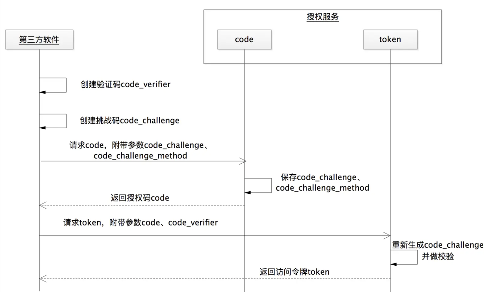
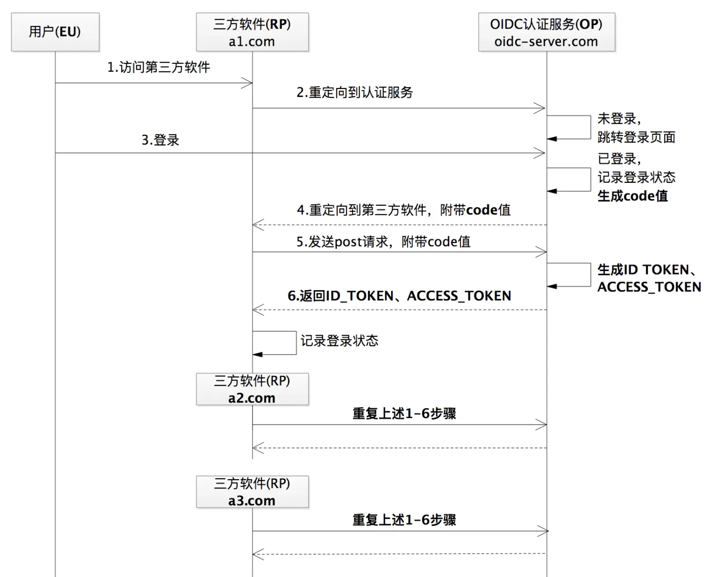
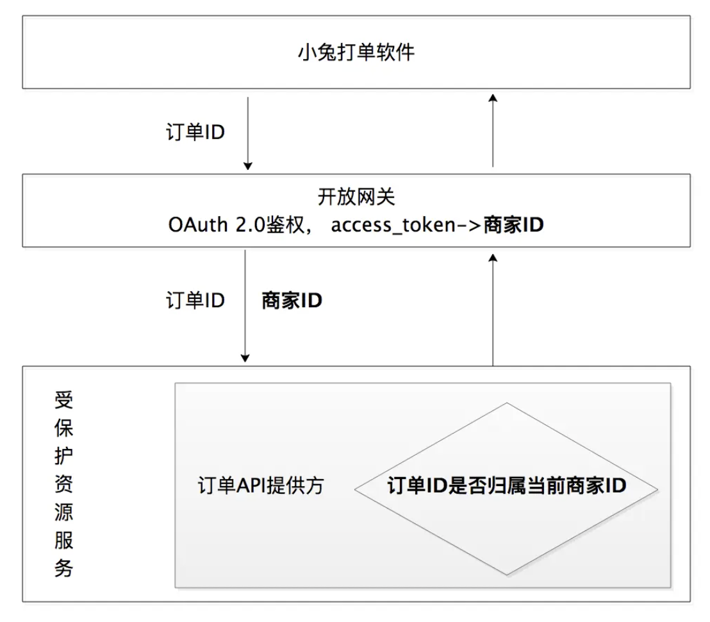

[toc]

# | 基础

**开放系统的授权问题**

- 复制用户名密码

- 通用的developer key
  - 可用于同一公司两个业务部分
- 特殊令牌


**传统安全问题**

- Filter：鉴权登录

- cookie + session


# | 核心概念

## 角色


### 1. 客户应用 Client Application

- 第三方应用。


### 2. 资源服务器 Resource Server 

- 受保护的资源。


### 3. 授权服务器 Authorized Server

提供 API

- /oauth2/authorize 授权
- /oauth2/token 访问令牌
- /oauth2/introspect
- /oauth2/revoke 撤回 


### 4. 资源拥有者 Resource Owner

- 登录用户。


## 信息

### 客户凭证 Client Credentials


### 令牌 Token

1. **访问令牌 Access Token**

访问受保护资源

2. **刷新令牌 Refresh Token**

用于去授权服务器获取一个新的访问令牌

3. **授权码 Authorization Code Token**

用于交换获取访问令牌和刷新令牌

4. **Bearer Token**

不管谁拿到Token都可以访问资源

5. **PoP Token (Proof of Possession)**

可以校验client是否对token有明确的拥有权


### 作用域 Scopes


# | 模式

概念

**前端渠道**

- 授权服务器 - 资源拥有者

**后端渠道**

- 授权服务器 - 资源服务器


## || 典型OAuth Flow

### 1. 授权码模式 Authorization Code


**Steps**

1. 用户访问客户应用。
2. 客户端**重定向**到授权服务器。
3. 用户授权。
4. 授权后，授权服务器生成授权码 Authorization Code，
5. 并将用户**重定向**到客户应用事先指定的 Redirect URI，同时附上授权码 Authorization Code。
6. 客户应用服务器收到授权码，附上早先的"重定向URI"，向授权服务器**申请令牌**。这一步是在客户应用的后台的服务器上完成的，对用户不可见。
7. 认证服务器核对了授权码和重定向URI，确认无误后生成 access_token，
8. 并向客户应用服务器发送访问令牌（access token）和更新令牌（refresh token）。
9. 接下来用户就可以使用客户应用了。


**前端渠道 vs. 后端渠道**

- 通过前端渠道，客户获取授权码Authorization Code

  > 通过浏览器促成了授权码的交互流程；

- 通过后端渠道，客户使用授权码去交换Access Token、以及可选的Refresh Token

**场景**

- 假定资源拥有者和客户在不同的设备上

- 安全性好，因为令牌不会传递经过user-agent


**为什么必须要有授权码？**

Q: Step 4/5 跳过授权码，直接返回用 access token 不行吗？

- 如果把安全保密性要求极高的访问令牌暴露在浏览器上，有访问令牌失窃的安全风险。所以只能把访问令牌返回给后端服务。但是，浏览器此时还处于被重定向到授权服务 --> 用户和客户应用之间的“连接”就断了，缺了 Step5 重定向。
- 有了授权码的参与，访问令牌可以在后端服务之间传输，同时还可以重新建立用户和客户应用之间的“连接”。这样通过一个授权码，既“照顾”到了用户的体验，又“照顾”了通信的安全。


### 2. 资源拥有者凭据许可 Resource Owner Credentials

> 用户名密码模式
>
> 客户应用只需要使用一次用户名和密码数据来换回一个 token，进而通过 token 来访问资源，以后就不会再使用用户名和密码了。


**Steps** 

1. 用户向客户应用提供用户名和密码。

2. 客户应用将用户名和密码发给认证服务器，请求 access_token。

   > `grant_type == password`

3. 认证服务器确认无误后，向客户应用提供 access_token。

4. 客户应用访问受保护资源时，附带 access_token.


**场景**

- 客户应用是官方出品。
- 假定资源拥有者和公开客户在相同设备上

- 适用用用户名密码登录的应用，例如桌面app


### 3. 客户端凭据许可 Client Credentials


**Steps**

1. 客户应用向认证服务器进行身份认证，并要求一个访问令牌。

   > `grant_type == client_credentials`
   >
   > 传入 app_id, app_secret，返回 access_token

2. 认证服务器确认无误后，向客户端提供访问令牌。

**流程**

- 只有后端渠道：使用客户凭证获取一个Access Token

- 客户应用以自己的名义，而不是以用户的名义，向"服务提供商"进行认证。

**场景**

- 适用于服务器间通信场景，没有明确的资源拥有者。-- 例如获取服务logo信息。

因为客户凭证可以使用对称/非对称加密，该方式支持共享密码或者证书


### 4. 隐式许可 Implicit 


**Steps**

1. 用户通过浏览器访问客户应用，客户应用相当于嵌入在浏览器中执行的应用程序；

2. 浏览器请求 access_token

   > `response_type == token`，同授权码模式
   >
   > 请求中附带 redirect_uri / app_id

3. 授权服务生成 access_token，并返回；

   > 调用 redirect_uri，将 access_token 作为参数返回

4. 浏览器访问受保护资源时，携带 access_token.


**要点**

- 直接在浏览器中向认证服务器申请令牌，跳过了"授权码"这个步骤

- 只有前端渠道：Access Token直接从授权服务器返回

- 不支持Refresh Token


**场景**

- 客户应用没有后端服务的情况；可以理解为 客户应用直接嵌入在浏览器中。
- 没有 app_id， app_secret；
- 假定资源拥有者和公开客户在同一个设备上

**安全性低**：令牌对访问者是可见的，且客户端不需要认证。


## || 如何选择？

**按场景选择**

- 优先考虑**授权码模式**；
- 如果客户应用是官方出品，则可直接使用**资源拥有者凭据许可**；
- 如果客户应用要获取的信息不属于任何第三方用户，则可直接使用**客户端凭据许可**；
- 如果客户应用是只嵌入到浏览器的应用，且没有服务端，则只能选择**隐式许可**；


**对比**：4 种授权许可类型获取 access_token的方式不同

| 授权许可类型               | 获取 access_token 的方式                                |
| -------------------------- | ------------------------------------------------------- |
| Authorization Code         | 通过授权码获取 access_token                             |
| Resource Owner Credentials | 通过第三方软件 app_id / app_secret 获取 access_token    |
| Client Credentials         | 通过用户名密码获取 access_token                         |
| Implicit                   | 通过嵌入浏览器中的第三方软件 app_id 来获取 access_token |


# | 授权服务器流程


## || 客户应用注册

注册后存储的信息：

- app_id
- app_secret
- redirect_uri
- scope


## || 颁发授权码

Request

```
 curl -X GET -H "Accept: application/x-www-form-urlencoded" $authorization_endpoint
 ?client_id=<client application id in DN format>
 &redirect_uri=<registered client callback url>
 &response_type=code
 &scope=openid <custom scopes>
 &state=<random guid>
 &code_challenge= <code challenge>
 &code_challenge_method =S256
```

Response

```
HTTP/1.1 302 Found
Location: <registered redirect_uri>?code=<code>&state=<same guid from the request>
```


**Q: state 参数什么作用？**

- 随机值，会再传回callback，由callback做对比校验。
- 防止 CSRF 攻击


### 1. 验证基本信息

- 验证客户应用合法性

- 验证回调地址合法性。

验证通过后，生成页面，提示资源拥有者进行授权。


### 2. 验证权限范围1

- 客户应用会传入权限范围
- 授权服务器将传入的权限范围，与注册的 scope 做对比


### 3. 生成授权请求页面

- 用户可以在此页面选择 已注册的权限（多选），点击 approve；
- approve 之后，生成授权码的流程才正式开始。

Q: 这里和Step1/2 的页面不同？？


### 4. 验证权限范围2

- 收到用户选择的权限范围，与注册的 scope 做对比


### 5. 处理授权请求，生成授权码

- 检查传入的 `response_type == code`

  > response_type 可能取值：code, token

- 生成授权码，并关联到 app_id + user

  > ```java
  > String code = generateCode(appId,"USERTEST");//模拟登录用户为USERTEST
  > 
  > private String generateCode(String appId,String user) {
  >   ...
  >   String code = strb.toString();
  >   codeMap.put(code,appId+"|"+user+"|"+System.currentTimeMillis());
  >   return code;
  > }
  > ```

- 并将授权码与已经授权的scope关联

  > ```java
  > Map<String,String[]> codeScopeMap =  new HashMap<String, String[]>();
  > 
  > codeScopeMap.put(code, rscope);//授权范围与授权码做绑定
  > ```

- 注意授权码要有有效期


### 6. 重定向到客户应用

- 调用 redirect_uri，将授权码告知客户应用


## || 颁发访问令牌

Request

```
 curl -X POST -H "Content-type: application/json" -H "Accept: application/x-www-form-urlencoded" $token_endpoint
 ?grant_type= authorization_code
 &code= <authorization code>
 &client_id= <client application id in DN format>
 &client_assertion= <client's TrustFabric token>
 &client_assertion_type= urn:ietf:params:oauth:client-assertion-type:jwt-bearer
 &code_verifier=<code verifier generated for PKCE along with code challenge>
 &response_type= token
 &redirect_uri= <same redirect uri used in authorize call>
```


### 1. 验证客户应用是否存在

- 验证 `grant_type == authorization_code` 
- 验证 app_id
- 验证 app_secret


### 2. 验证授权码

- 颁发授权码时保存了 授权码和 app_id + user 的关系；验证当前授权码存在、并清空存储

  > ```java
  > codeMap.put(code,appId+"|"+user+"|"+System.currentTimeMillis());
  > ```

  > ```java
  > if(!isExistCode(code)){//验证code值
  >   //code不存在
  >   return;
  > }
  > codeMap.remove(code);//授权码一旦被使用，须立即作废
  > ```


### 3. 生成访问令牌

- 原则：唯一性、不连续性、不可猜性。

- 可用 JWT 

- 生成后存下来：access_token -- scope; access_token -- app_id + user，并设置过期时间。

  > ```java
  > Map<String,String[]> tokenScopeMap =  new HashMap<String, String[]>();
  > 
  > String accessToken = generateAccessToken(appId, "USERTEST");//生成访问令牌access_token的值
  > tokenScopeMap.put(accessToken, codeScopeMap.get(code));//授权范围与访问令牌绑定
  > 
  > //生成访问令牌的方法
  > private String generateAccessToken(String appId,String user){
  >   
  >   String accessToken = UUID.randomUUID().toString();
  >   String expires_in = "1";//1天时间过期
  >   tokenMap.put(accessToken,appId+"|"+user+"|"+System.currentTimeMillis()+"|"+expires_in);
  > 
  >   return accessToken;
  > }
  > ```


## || 刷新令牌

有了刷新令牌，用户在一定期限内无需重新点击授权按钮，就可以继续使用第三方软件。

### 1. 接收刷新令牌请求，验证基本信息

- 验证 `grant_type == refresh_token` 

  > grant_type 可能取值：authorization_code, refresh_token

- 验证客户应用是否存在

- 验证刷新令牌是否存在

  > ```java
  > if(!refreshTokenMap.containsKey(refresh_token))
  > ```

- 验证刷新令牌是否属于该客户应用

  > ```java
  > String appStr = refreshTokenMap.get("refresh_token");
  > if(!appStr.startsWith(appId+"|"+"USERTEST")){
  >     //该refresh_token值不是颁发给该第三方软件的
  > }
  > ```

一个刷新令牌被使用后，需要将其废弃，并重新颁发一个刷新令牌。


### 2. 重新生成访问令牌

流程同“颁发访问令牌”。


> 客户应用如何使用刷新令牌？
>
> 1. 将 expires_in 保存下来，并定时检测；发现将要过期则利用 refresh_token 重新请求授权服务、获取新的访问令牌。
> 2. 现场发现：当突然收到一个访问令牌失效的响应，则立即使用 refresh_token 请求访问令牌。


# | 协议 & 规范

## || JWT 

> JSON Web Token

JWT 跟 OAuth 2.0 并没有直接关系，它只是一种结构化的信息存储，可以被用在除了 OAuth 2.0 以外的任何地方。比如，重置密码的时候，会给你的邮箱发送一个链接，这个链接就需要能够标识出用户是谁、不能篡改、有效期 5 分钟，这些特征都跟 JWT 相符合。

### JWT 结构

结构体

- HEADER
  - `typ`  类型
  - `alg` 签名算法
- PAYLOAD
  - `sub` Subject，令牌的主体
  - `aud` Audience，the recipients that the JWT is intended for.
  - `exp` Expiration Time，过期时间
  - `iat` Issue at，颁发时间 
  - `iss` Issuer
- SIGNATURE


更多字段：https://datatracker.ietf.org/doc/html/rfc7519 


### JWT 代码使用

JJWT 封装了 Base64URL 编码和对称 HMAC、非对称 RSA 的一系列签名算法。使用 JJWT，我们只关注上层的业务逻辑实现，而无需关注编解码和签名算法的具体实现。

```java
String sharedTokenSecret = "hellooauthhellooauthhellooauthhellooauth";//密钥
Key key = new SecretKeySpec(sharedTokenSecret.getBytes(),
                SignatureAlgorithm.HS256.getJcaName());

//生成JWT令牌
String jwts = Jwts.builder()
    .setHeaderParams(headerMap)
    .setClaims(payloadMap)
    .signWith(key,SignatureAlgorithm.HS256)
    .compact()

//解析JWT令牌
Jws<Claims> claimsJws  = Jwts.parserBuilder()
    .setSigningKey(key).build()
    .parseClaimsJws(jwts);
JwsHeader header = claimsJws.getHeader();
Claims body = claimsJws.getBody();  

```


### JWT 优缺点

优点

- 用计算代替存储。无需远程调用即可解析token内容。
- 加密。
- 无状态原则，增强可用性、伸缩性。


缺点

- 变更令牌状态之后，如何在已使用的令牌上生效？

  > 解决1：密钥粒度缩小到用户级别，当用户取消授权后，同时修改密钥。--> 需要额外的密钥管理服务。
  >
  > 解决2：把用户密码作为 jwt 密钥。


## || PKCE 协议

**Proof Key for Code Exchange by OAuth Public Clients**

### PKCE 目的

目的：既不使用 app_secret，还要防止授权码 code 失窃

- 来解决【公共客户端】授权码可能遭劫持的问题。公共客户端无法保存配置时的秘钥等信息。
- 不使用 app_secret：如果保存在 **app** 端，一旦被破解就会造成灾难性后果；




NOTE: PCKE 是随着移动应用发展而提出的。

### PKCE 流程

1. 客户应用生成 `code_verifier`， `code_challenge`；

```java
import java.security.SecureRandom;
import java.security.MessageDigest;
import java.util.Base64;

// code_verifier: 随机、长度 43~128
public String generateCodeVerifier() throws UnsupportedEncodingException {
    SecureRandom secureRandom = new SecureRandom();
    byte[] codeVerifier = new byte[48];
    secureRandom.nextBytes(codeVerifier);
    return Base64.getUrlEncoder().withoutPadding().encodeToString(codeVerifier);
}

// code_challenge:
// 1. code_challenge_method = plain, 则值和 code_verifier相同；
// 2. code_challenge_method = S256, 则将 code_verifier 进行ASCII 编码之后再进行哈希，然后再将哈希之后的值进行 BASE64-URL 编码 
public String generateCodeChallenge(String codeVerifier) throws UnsupportedEncodingException, NoSuchAlgorithmException {
    byte[] bytes = codeVerifier.getBytes("US-ASCII");
    MessageDigest messageDigest = MessageDigest.getInstance("SHA-256");
    messageDigest.update(bytes, 0, bytes.length);
    byte[] digest = messageDigest.digest();
    return Base64.getUrlEncoder().withoutPadding().encodeToString(digest);
}
```


2. **获取授权码**：通过 `code_challenge` 

   > 不再需要 app_id, app_secret
   >
   > ```
   > https://authorization-server.com/auth
   > ?response_type=code
   > &app_id=APP_ID
   > &redirect_uri=REDIRECT_URI
   > &code_challenge=CODE_CHALLENGE
   > &code_challenge_method=S256
   > ```

3. **获取 access_token**：通过 `code_verifier`

   > 授权服务器收到 code_verifier，运算后与上一步的 code_challenge 作对比。
   >
   > ```
   > POST https://api.authorization-server.com/token
   >   ?grant_type=authorization_code
   >   &code=AUTH_CODE_HERE
   >   &redirect_uri=REDIRECT_URI
   >   &app_id=APP_ID
   >   &code_verifier=CODE_VERIFIER
   > ```


好处：

- 即便授权码泄漏、code_challenge泄漏，也没办法逆推出 code_verifier。


## || OIDC

> OpenID Connect 1.0 is a simple identity layer on top of the OAuth 2.0 protocol. It allows Clients to verify the identity of the End-User based on the authentication performed by an Authorization Server, as well as to obtain basic profile information about the End-User in an interoperable and REST-like manner.


### OIDC 概念

OpenID Connect，是一种直接基于 OAuth 2.0 构建的身份认证框架协议。

> 在 OAuth2.0 的基础上，通过增加 ID 令牌来获取用户的唯一标识，从而就能够去实现一个身份认证协议。

- 常用于单点登录、联合登录；
- OAuth2: 授权协议；OIDC: 授权协议 + 身份认证，是 OAuth 2.0 的超集。


**Q: 常见误解 OAuth2 包含身份认证？**

- 授权之前的登录，只是一个额外需求，登录跟授权体系是独立的。
- 像这种“内嵌”的身份认证行为，并不是说 OAuth 2.0 自身承担起了身份认证协议的责任。


### OIDC 角色

**EU: End User**

代表最终用户。对应资源拥有者。


**RP: Relying Party**

代表认证服务的依赖方。对应客户应用。


**OP: OpenID Provider**

代表提供身份认证的服务方，例如微信登录。对应授权服务 + 受保护资源。


### OIDC 流程

与 OAuth2 授权码流程几乎完全一致，除了多返回一个 `id_token  ` 


**流程**

生成 ID 令牌 -> 创建 UserInfo 端点 -> 解析 ID 令牌 -> 记录登录状态 -> 获取 UserInfo。


**ID TOKEN**

JWT 格式，包含如下参数：

- `iss`，令牌的颁发者，其值就是身份认证服务（OP）的 URL。
- `sub`，令牌的主题，其值是一个能够代表最终用户（EU）的全局唯一标识符。
- `aud`，令牌的目标受众，其值是三方软件（RP）的 app_id。
- `exp`，令牌的到期时间戳，所有的 ID 令牌都会有一个过期时间。
- `iat`，颁发令牌的时间戳。


有了 id_token，客户应用就无需保存用户登录的会话关系。客户应用拿到 ID 令牌之后，就已经获得了处理身份认证标识动作的信息，也就是拿到了那个能够唯一标识最终用户（EU）的 ID 值


**Q: 为什么同时需要 id_token 和 access_token？**

- id_token 里没有用户名等信息


**Q: id_token信息合并到 access_token 不行吗？** 

- id_token是用户身份令牌、access_token是访问令牌，这两个一定要区别开，<u>access_token永远不能被任何第三方软件去解析</u>。--? 


### OIDC 实现单点登录

> Single Sign On

只需要让第三方软件（RP）重复上述 OIDC 的通信流程就可以了




**客户应用代码**

1. 通过 `/.well-known/openid-configuration` API，获取metadata. 

```json
{
   "issuer":"https://sso.alphawang.com",
   "authorization_endpoint":"https://sso.alphawang.com/v1/api/oauth2/authorize",
   "token_endpoint":"https://sso.alphawang.com/v1/api/oauth2/token",
   "userinfo_endpoint":"https://sso.alphawang.com/v1/api/oauth2/userinfo",
   "jwks_uri":"https://sso.alphawang.com/v1/api/jwks.json",
   "end_session_endpoint":"https://sso.alphawang.com/v1/api/oauth2/logout",
   "token_endpoint_auth_methods_supported":[
      "private_key_jwt"
   ],
   "token_endpoint_auth_signing_alg_values_supported":[
      "RS256"
   ],
   "scopes_supported":[
      "openid",
      "test_scope"
   ],
   "response_types_supported":[
      "token",
      "id_token",
      "token id_token"
   ],
   "code_challenge_methods_supported":[
      "S256"
   ],
   "subject_types_supported":[
      "public"
   ]
}
```


2. Java 工具：https://connect2id.com/products/nimbus-jose-jwt 

```java
private OIDCProviderMetadata loadOidcMetadata() {
  // The OpenID provider issuer URL
  Issuer issuer = new Issuer(siteSsoIssuer);

  // Will resolve the OpenID provider metadata automatically
  OIDCProviderConfigurationRequest request = new OIDCProviderConfigurationRequest(issuer);

  try {
    // Make HTTP request
    HTTPRequest httpRequest = request.toHTTPRequest();
    HTTPResponse httpResponse = httpRequest.send();

    // Parse OpenID provider metadata
    OIDCProviderMetadata opMetadata = OIDCProviderMetadata.parse(httpResponse.getContentAsJSONObject());

    if (!issuer.equals(opMetadata.getIssuer())) {
      throw new Exception("OIDC issuer mismatch from .well-known endpoint");
    }

    return opMetadata;
  } catch (IOException | ParseException exception) {
    throw new Exception("Error loading OIDC .well-known configuration", exception);
  }

}
```


# | 安全性考虑

## || CSRF 攻击

> Cross-Site Request Forgery 跨站请求伪造攻击：恶意软件让浏览器向已完成用户身份认证的网站发起请求，并执行有害的操作。

**问题**

- 攻击者获取到授权码后，构造一个被攻击者的 redirect_uri 链接诱导用户点击；相当于被攻击者继续走 OAuth2 流程，但使用的是攻击者的授权码。 
- 软件 A（攻击者）用自己的授权码 codeA 的值，通过 CSRF 攻击，“替换”了软件 B 的授权码的值。

**解决办法**

- 请求 access_token 时，带上取值为随机值的 **state 参数**。资源服务器 callback 里对比检验该值


## || XSS 攻击

> Cross Site Scripting，XSS 攻击的主要手段是将恶意脚本注入到请求的输入中，攻击者可以通过注入的恶意脚本来进行攻击行为，比如搜集数据等。

**问题**

- 当请求抵达受保护资源服务时，系统需要做校验，比如第三方软件身份合法性校验、访问令牌 access_token 的校验，如果这些信息都不能被校验通过，受保护资源服务就会返回错误的信息。大多数情况下，受保护资源都是把输入的内容，比如 app_id invalid、access_token invalid ，再回显一遍，这时就会被 XSS 攻击者捕获到机会。
- 例如攻击者传入了一些恶意的、搜集用户数据的 JavaScript 代码，受保护资源服务直接原路返回到用户的页面上，那么当用户触发到这些代码的时候就会遭受到攻击。

**解决办法**

- 对此类非法信息做转义过滤，比如对包含<script>、、<a>等标签的信息进行转义过滤。


## || 水平越权

> 水平越权是指，在请求受保护资源服务数据的时候，服务端应用程序未校验这条数据是否归属于当前授权的请求用户。

**问题**

- 不法者用自己获得的授权来访问受保护资源服务的时候，就有可能获取其他用户的数据，导致水平越权漏洞问题的发生。

  

**解决办法**




## || 授权码失窃

**问题**

- 正常请求授权码后，被攻击者获取。攻击者使用该授权码获得 access_token。

**解决办法**

- 授权服务：在进行授权码校验时，需要检查 app_id。
- 授权服务：在授权码在被使用过一次后，需要删除这个授权码。


## || redirect_uri 被篡改

**问题**

- 授权码被返回给一个 hacker.html 

  ```html
  <html>
  
  </html>
  ```

- 在 clientA 页面，解析 Referer 头部即可得到用户的授权码。

**解决办法**

- 授权服务：redirect_uri 必须做精确地完整性校验，而非模糊校验。


# | Spring Security OAuth2

TODO https://time.geekbang.org/column/article/264179


MSA: 


# | 参考

OAuth2最简指导

https://medium.com/@darutk/the-simplest-guide-to-oauth-2-0-8c71bd9a15bb

阮一峰：理解OAuth2

http://www.ruanyifeng.com/blog/2014/05/oauth_2_0.html

OIDC

https://connect2id.com/assets/oidc-explained.pdf

MSA

- [ ] https://www.kaper.com/cloud/micro-services-architecture-with-oauth2-and-jwt-part-1-overview/ 

- [ ] https://time.geekbang.org/column/article/257837

