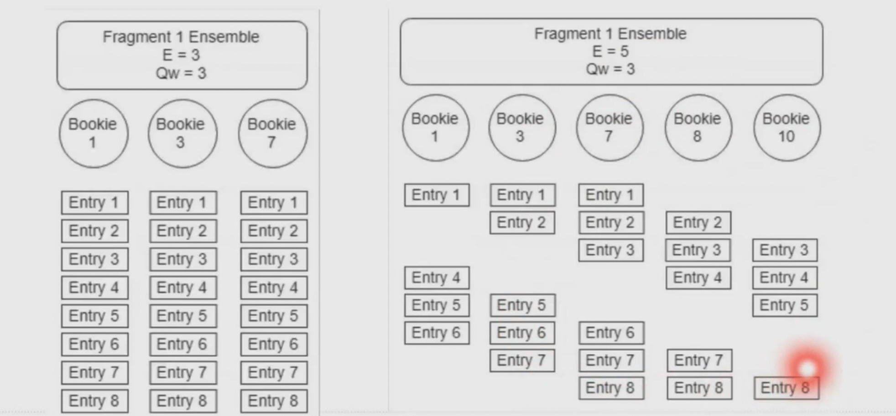
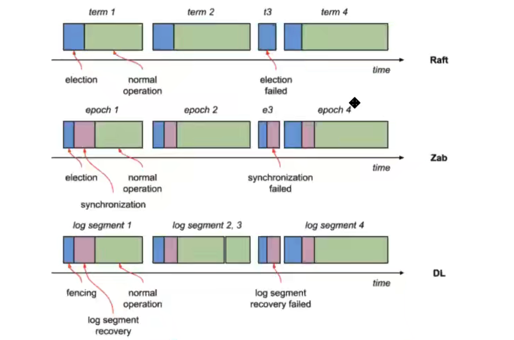

[toc]

# | 基础

## || 特点

**Pulsar 要解决的问题**

- 数据规模
  - 多租户
  - 百万 Topics
  - 低延
- 存算分离
  - 解决运维痛点：替换机器、服务扩容、**数据 Rebalance**
- 减少文件系统依赖
  - **性能难保障**：持久化 fsync、一致性 ack = all、多主题
  - **IO 不隔离**：消费者读 backlog 会影响其他生产者和消费者


**特点**

- **云原生**
  - Broker 无状态
  - Bookie 可以水平扩展，新数据存入新的Bookie
- **支持多租户和海量 Topic**
  - Tenant + Namespace 逻辑隔离；便于做共享大集群
  - 最佳实践：
    - Access Control
    - Quota: 
    - Isolation: 延时、吞吐量、存储、placement policy；不同 tenant 可以是不同的 Cluster。
    - Tenant：可能对应一个 Team
    - Namespace：可能对应一个 application。用于通用的主题设置，例如 backlog quota、offload、retention policy； 
- **平衡消息可靠性与性能**
  - 得益于 Quorum 机制、条带化写入策略
- **低延迟**
  - kafka topic 增加，延迟也增加 
  - 单个发送线程 TPS 2w？ -- 拉卡拉数据：batchingEnabled, blockIfQueueFull
  - 
- **高可靠、分布式**
  - Geo replication
- **轻量级函数式计算**
  - Pulsar Function: source --> sink
- **批流一体**
  - Segment 分片存储：方便支持流计算
  - 分层存储：方便支持批处理
- **多协议**
  - KOP, AMQP, MQTT
- **功能丰富**
  - 延迟队列
  - 死信队列
  - 顺序消息
  - 主题压缩
  - 多租户
  - 认证授权
  - 分层存储
  - 跨地域复制


**功能：Event Streaming**

- **Connect**: pub/sub, connectors, protocol handlers. 
- **Store**: BK, Tiered Storage (HDFS, JCloud --> aws, gcs)
- **Process**: Pulsar Functionss (etl, routing), Flink, Spark, Presto


**社区发展**

- 常用功能
  - Pub/Sub
  - Multi-Tenancy
  - Functions
  - Tiered Storage
  - Connectors


## || 架构

> - https://pulsar.apache.org/docs/zh-CN/concepts-architecture-overview/
>
> - https://www.splunk.com/en_us/blog/it/comparing-pulsar-and-kafka-how-a-segment-based-architecture-delivers-better-performance-scalability-and-resilience.html
>
> 量大关键架构哲学：
>
> - 分层
> - 基于 Segment 的存储


**分层架构**


**代理层**

- 作用：请求转发
- 对外隐藏 Broker IP


**Broker 层**

- 负责业务逻辑
- 提供管理接口


**Bookie 层**

- 负责数据存储
- BookKeeper: 只可追加数据的存储服务


**ZooKeeper**

- 存储元数据

  > Web-service-url 管理流地址
  >
  > Broker-service-url 数据流地址
  >
  > Ledger信息
  >
  > Topic 信息 （非持久化 NonPartitionedTopic 无需存储到zk）

- Broker选主

- 分布式锁


**流程**


（来自拉卡拉分享，Broker cache 的写入时机貌似不对）


**隔离性**

- BK 读写存储隔离

- Namespace 隔离

  - 让指定Namespace下所有 Bundle 只落在指定的 Broker 上，避免影响其他节点。

  - ```sh
    # 设置 NS 隔离策略
    pulsar-admin ns-isolation-policy set
      --primary broker-regs1
      --secondary broker-regs2
    ```

- Bookie 隔离：`set-bookie-affinity-group` 设置亲和性

  - 让指定Namespace下的主题尽量存到指定的 Bookie

  - ```sh
    # 设置bookie group信息
    pulsar-admin bookies set-bookie-rack
      -b 192.168.1.222:3181 
      -r rack1
      -g group1
    
    # 设置亲和性
    pulsar-admin namespaces set-bookie-affinity-group
      --primary-group group1
      --secondary-group group2
    # 设置反亲和性
    pulsar-admin namespaces set-anti-affinity-group
      --group group1
      tenant/namespace
    ```


# | 客户端

## || Producer

https://pulsar.apache.org/docs/en/concepts-messaging/

**消息生产流程**

- Producer：Message Routing 选择分区
- Topic Discovery (lookup)：跟 Broker 通讯，找到分区对应的Broker
- Broker：调用bk客户端，并发写入多个副本


**配置**

- **Synd Mode**
  
  - `sync send`: waits for an acknowledgement from the broker after sending every message.
- `async send`: puts a message in a blocking queue and returns immediately.
  
- **ProducerAccessMode**

  - `Shared`: Multiple producers can publish on a topic.

  - `Exclusive`: Only one producer can publish on a topic.

  - `WaitForExclusive`: If there is already a producer connected, the producer creation is pending (rather than timing out) until the producer gets the `Exclusive` access. 

    > 类似选主。if you want to implement the leader election scheme for your application, you can use this access mode.
  
- **MessageRoutingMode**: 对于 PartitionedTopic，决定消息被发送到哪个分区/Broker

  - `SinglePartition`: 如果消息有key，则对key哈希找分区；无key，则发送到某个特定分区（可以实现全局有序）；
  - `RoundRobinPartition`: 如果无key，则轮询发到各个分区；
  - `CustomPartition`: 自定义路由。


**实现类**

- **ProducerImpl**
  - HandlerState 状态机
  - 发送流程
    - 同步发送底层也是调用异步发送，然后Future.get()
    - 压缩
    - 分块
    - 校验并设置元数据，包括 sequenceId
    - 进入批量发送队列
    - Flush：直接触发、或等待
    
    > 如果是异步发送，收到ack后跟未决队列进行对比，如果收到 msg-2 ack，但尚未收到 msg-1 ack；则重发 msg1
- **PartitionedProducerImpl**
  
  - 内有保存 ProducerImpl List，每个partition对应一个


**功能**

- **Batching**

  - 最大消息个数

  - 最大发送延迟

  - batch是个整体

    - batches are tracked and *stored* as single units rather than as individual messages.
    - Consumer unbundles a batch into individual messages. In general, a batch is acknowledged when all of its messages are acknowledged by a consumer. 
    - 消费的时候，一批消息只会被同一个consumer消费。
  - 一个消息ack失败，会导致整个batch重发。2.6.0 之后引入 batch index acknowledgement 解决重复发送问题：消费者发送 batch index ack request. 
    
    

- **Chunking**

  > PIP 37: Large message size handling in Pulsar: Chunking Vs Txn https://github.com/apache/pulsar/wiki/PIP-37%3A-Large-message-size-handling-in-Pulsar

  - 作用：生产者将大payload拆分、消费者组装
  
- 1. The producer splits the original message into chunked messages and publishes them with chunked metadata to the broker separately and in order.
    2. The broker stores the chunked messages in one managed-ledger in the same way as that of ordinary messages, and it uses the `chunkedMessageRate` parameter to record chunked message rate on the topic.

    3. The consumer buffers the chunked messages and aggregates them into the receiver queue when it receives all the chunks of a message.

    4. The client consumes the aggregated message from the receiver queue.

  - 限制
  
    - 不能同时使用  batching；
    - 仅支持持久化主题；
    - 仅支持 exclusive / failover 订阅模式，要保证消息被同一个消费者消费。


- **重试机制**

  - 不会重试的场景

    - Topic 已关闭：producer 收到此异常后会把自己关闭；
    - 服务端返回 NotAllowedError：客户端直接抛出异常；
    - 超时：TCP 连接级别的超时抛出异常；

  - 重试的场景

    - 消息校验和不正确：缺失或被篡改；
    - 逻辑重连：Bundle 卸载、分裂等导致主题归属转移；
    - 无法获得连接：

    

- **Deduplication**

  > https://github.com/apache/pulsar/wiki/PIP-6:-Guaranteed-Message-Deduplication

  - 效果：生产者多次发送同样的消息，只会被保存一次到bookie。

  - 实现：

    - 生产者每条消息会设置一个元数据 `sequenceId`，topic owner broker 遇到比之前小的ID则可过滤掉。
  
    - 生产者重连后，会从 Broker 拿到当前 topic 最后的`sequenceId`，继续累加。

    - Broker 还会定期将 sequenceId 快照存储到 BK，防止Broker和客户端同时宕机。

      > 快照总有延迟，那么 Broker 重启后上次快照之后的消息还是可能重复。
      >
      > 解决：新Broker 会从 Ledger 读取最近的 N 条 entry 并写入内存。

  - 配置：`brokerDeduplicationEnabled=true`
  
    > https://pulsar.apache.org/docs/en/cookbooks-deduplication/ 
  
  - 可用于 effectively-once  语义

    > https://www.splunk.com/en_us/blog/it/exactly-once-is-not-exactly-the-same.html 
    
  - **消息重复的场景**
  
    - Broker Down
  
      > 1. 生产 N 条消息，并成功写入 BK Ensemble；但在 ack 之前 Broker 宕机。
      > 2. 新 Broker 触发 Ledger Recovery，恢复之前的消息；
      > 3. 而客户端重连到新 Broker，又重新发送这 N 条消息；


- **消息顺序**

  - `业务线程` 的影响：多个线程同时持有一个 Producer 对象；
  - `路由模式` 的影响：SinglePartition 有序、RoundRobinPartition 无序；
  - `分区` 的影响：如果只有一个分区，则同SinglePartition模式，能保证有序；例外：异步发送失败后重试；
  - `发送方式` 的影响：同步 vs 异步
  - `批量发送` 的影响: 一批消息是原子性。但批与批之间的顺序可能乱；
  - `消息key` 的影响：相同key会被发到同一分区，能保证有序性；
- ack 的影响：
    - 单条确认时，未确认的消息在超时后会重新投递；若要保序，则必须按顺序 ack；
    - 累积确认时，在超时后会重新投递一批消息；

  


- **Exclusive Producer**

  - 只有一个 producer 能写入成功。 类似订阅类型。 

  - PIP-68 https://github.com/apache/pulsar/wiki/PIP-68%3A-Exclusive-Producer

    ```java
    Producer<String> producer = client.newProducer(Schema.STRING)
          .topic("my-topic")
          .accessMode(ProducerAccessMode.Exclusive)
          .create();
    ```

- **Producer Partial RoundRobin**

  - 目的：分区过多时，producer的链接可能非常多。
  - 解决：
    - Producer 懒加载：只有在用的时候才会真正创建producer实例。
    - Partial RoundRobin：每个 producer 实例可能只 roundrobin 到一部分分区。

  

  ```java
  PartitionedProducerImpl<byte[] producer = (PartitionedProducerImpl<byte[]>) pulsarClient.newProducer()
    .topic("")
    .enableLazyStartPartitionedProducers(true) //设置1
    .messageRouter(new PartialRoundRobinMessageRouterImpl(3)) //设置2
    .messageRouting(MessageRoutingMode.CustomPartition)
    .enableBatching(false)
    .create();
  ```

  


## || Consumer

**消息读取流程**

- 消费者订阅的时候，根据订阅策略决定消费哪些分区；经过 topic discovery 长连接到 Owner Brokers
- Tailing Read：
  - Broker 存储消息到 bk后，从内存读取，dispatch 到consumer 的 **Recive Queue**.
- Catch-up Read:
  - 到 BK 读取数据，可读取任意 bookie


配置

- **Receive Mode**
  - `Sync Receive`: blocked until a message is available.
  - `Async Receive`: returns immediately with a future value.
- **subscriptionMode**
  - `durable`：在Broker生成持久化的cursor
  - `nonDurable`
- **subscriptionType**
  - Exclusive, Shared, Failover, Key_Shared


实现类

- **ConsumerImpl** 

  - 初始化

    - ConsumerStatsRecorder：记录消费者metrics信息。
    - Trackers：
      `UnAckedMessageTracker` 记录接收未确认的消息，用于管理后续重投递；
      `AcknowledgementsGroupingTracker` 批量确认管理；
      `NegativeAcksTracker` negative ack 管理；

  - 异步发送 Lookup 请求

    - 确认主题归属的 Broker

  - 获取连接

    - 复用 PulsarClient 连接池；

  - 发送订阅命令

  - 发送 `FlowPermits` 命令

    - 通知Broker推送数据，默认推送的消息个数是 ReceiverQueue 大小；
    - 然后消费者**缓存**预拉取消息到 ReceiverQueue；

    > 是一种“经过优化的 Poll 模式”：
    >
    > - 当 ReceiverQueue 中的消息少于一半时，消费者重新触发 FlowPermits 命令，要求Broker推送消息；
    > - 既能避免 Push 模式下消费能力不足的问题，又能提升消息消费的及时性。

- **MultiTopicsConsumerImpl**

  - 用于消费多分区 PartitionedTopic
  - 内部引用多个 ConsumerImpl

- **PatternMultiTopicsConsumer**

  - 用于用正则表达式订阅主题时；类似 MultiTopicsConsumerImpl，并实时更新订阅主题的变化。
  - 定时任务通过 Lookup 查到namespace下的所有主题，再通过正则筛选。

- **ZeroQueueConsuemrImpl**

  - 不会预拉取消息；适用于消息不多但单条消息要消费很久的场景。
  - 不可用来消费batch消息。

- **RawConsumerImpl**

  - 直接通过 bk client 读取和写入消息；
  - 仅用于pulsar内部，例如实现压缩主题。


消费流程

- 同步接收
  
  - 直接从 RecieverQueue 中 take()，同步等待
- 异步接收
  - 用户业务线程
  - Netty IO 线程
  
    > Q: 如果推送来的消息超过 RecieverQueue 怎么办？
    >
    > -- 推送也是消费者触发的？


功能

- **Acknowledgement**

  - **确认场景**

    - 单条消息确认：`consumer.acknowledge(msg);`
    
  - 累积消息确认：`consumer.acknowledgeCumulative(msg);`
    
    - 批量消息中的单个消息确认：

      - Broker 配置 `acknowledgementAtBatchIndexLevelEnabled=true`
      - 原理是在客户端重新收到一批后，过滤掉已确认的消息。

    - 否定应答: 表示处理失败、稍后重发给其他消费者。`consumer.negativeAcknowledge(msg);`

      > Q: 何时重新deliver、能否指定? 
    > A: 全局设置延迟时间；如有大量消息延迟消费，可调用 `reconsumerLater` 接口。
    
    
    
  - **确认流程**

    - 待确认的消息先放入`AcknowledgementsGroupingTracker`缓存，默认每100ms、或大小超过1000则发送一批确认请求；目的是避免broker收到高并发的确认请求。
    - 对于 **ack at batch index level**，存储格式为Map<Batch MessageId, `BitSet`>；
    - 对于 **累积消息确认**，Tracker 只需保存最新确认位置即可。
    - 对于**否定应答**，由 `NegativeAcksTracker`处理，其复用 Pulsar Client 时间轮，定期发送给 Broker。

    

  - **Ack timeout**: 可对unack消息自动重发。

    - 情况一：业务端调用 receive() 后：消息进入 `UnAckedMessageTracker`，其维护一个时间轮，超时后发送 redeliverUnacknowledgedMessages 命令给broker。

    - 情况二：消费者做了预拉取，但尚未调用 receive()：Broker侧将这些消息标记为 `pendingAck` 状态，除非当前消费者被关闭，才会被重新投递。

      > - Broker RedeliveryTracker 会记录每个消息的投递次数；
      > - 可知如果消费者 ReceiverQueue 设置过大 是会对Broker有影响的。

  - **Consumer Redeliver Backoff**

    - 默认否定应答、或应答超时后，会马上重发。
    - Backoff 则允许自定义重发的间隔。

    ```java
    // 反向签收
    client.newConsumer()
      .negativeAckRedeliveryBackoff(MultiplierRedeliveryBackoff.builder()
                                    .minDelayMs(1000)
                                    .maxDelayMs(60 * 1000)
                                    .build())
      .subscribe();
    
    client.newConsumer()
      .ackTimeout(10, TimeUnit.SECOND)
      .ackTimeoutRedeliveryBackoff(MultiplierRedeliveryBackoff.builder()
                                    .minDelayMs(1000)
                                    .maxDelayMs(60 * 1000)
                                    .build())
      .subscribe();
    ```

  

- **reconsumeLater**

  - 作用：把消息发送到重试队列、后续再消费。
  - 原理：
    - 消费者创建时，指定 DeadLetterPolicy，包含 `maxRedeliverCount` `retryLetterTopic` `deadLetterTopic`
    - 消费者自动创建对应重试队列、死信队列的内部 Producer；并同时偷偷地订阅“重试队列”。
    - 当未超过最大重试次数，发送到重试队列；否则发送到死信队列。
  - 注意：重试队列不是延迟队列，会立即被消费。如果设置了延迟多久reconsumeLater，则会被投递到延迟队列。


- **Dead Letter Topic**

  - 将消费失败的消息存到 dead letter `<topicname>-<subscriptionname>-DLQ`，可以自定义如何处理死信消息。

  - 配置处理策略：

    ```java
    Consumer<byte[]> consumer = pulsarClient.newConsumer(Schema.BYTES)
                  .topic(topic)
                  .subscriptionName("my-subscription")
                  .subscriptionType(SubscriptionType.Shared)
                  .deadLetterPolicy(DeadLetterPolicy.builder()
                        .maxRedeliverCount(maxRedeliveryCount)
                        .deadLetterTopic("your-topic-name")
                        .initialSubscriptionName("my-sub")
                        .build())
                  .subscribe();     
  // initialSubscriptionName 的作用:
    // 否则是懒创建，无法指定retention等参数。
    ```
  
  - 在 negative ack 和 ack timeout 时放入？


- **Retry Letter Topic** 

  - When **automatic retry** is enabled on the consumer, a message is stored in the retry letter topic if the messages are not consumed, and therefore the consumer automatically consumes the failed messages from the retry letter topic after a specified delay time.
    `consumer.reconsumeLater(msg,3,TimeUnit.SECONDS);`

  - 配置消费 retry letter:

    ```java
    Consumer<byte[]> consumer = pulsarClient.newConsumer(Schema.BYTES)
                    .topic(topic)
                    .subscriptionName("my-subscription")
                    .subscriptionType(SubscriptionType.Shared)
                    .enableRetry(true)
                    .receiverQueueSize(100)
                    .deadLetterPolicy(DeadLetterPolicy.builder()
                            .maxRedeliverCount(maxRedeliveryCount)
                            .retryLetterTopic("persistent://my-property/my-ns/my-subscription-custom-Retry")
                            .build())
                    .subscriptionInitialPosition(SubscriptionInitialPosition.Earliest)
                    .subscribe();
    ```

  

## || Reader

Reader 包装了 Consumer，拥有Consumer的所有功能。

- 特点
  - Reader 强制使用 Exclusive 订阅类型；
  - Reader 订阅模式是 NonDurable，即没有持久化的游标。

- 示例

  ```java
  Reader<byte[]> reader = pulsarClient
    .newReader()
    .topic("my-topic")
    .startMessageId(MessageId.earliest)
    .create();
  
  while (reader.hasMessageAvailable()) {
    reader.readNext();
  }
  ```


**TableView**

- 2.10 新引入，类似 compacted topic
  `client.newTableViewBuilder()`
- 客户端内存实现，数据不能太大。


## || Subscription

 The subscriptions do not contain the data, only meta-data and a cursor.


**订阅类型**


- **Exclusive**

  - 只有一个消费者绑定到当前订阅。其他消费者需要使用不同的 subscription name，否则报错 ConsumerBusyException: Exclusive consumer is already connected。

  - 有序。

  - 支持单条消息确认、累积消息确认。

    > Q: 是partition 维度？- Y！
    >
    > 

- **Failover**

  - 多个消费者可以绑定到当前订阅（而不像 Exclusive 那样直接报错），但只有一个收到消息。

  - 有序。

    > 类似 Kafka。
    >
    > 

- **Shared** 

  - 多个消费者可以绑定到当前订阅，按 round-robin 模式接收消息（消费者可设置 priorityLevel 来提升自己的优先级）。

  - 限制：

    - 无序、
    
    - 无法使用 cumulative ack，类似kafka . --> 否则可能有误ack的情况
    
      用 individual ack时，如果中间有部分msg没有ack，则重启后会重新收到 
      
    - 不过可以 **[batch ack](https://pulsar.apache.org/api/client/org/apache/pulsar/client/api/ConsumerBuilder.html#acknowledgmentGroupTime-long-java.util.concurrent.TimeUnit-)**，提高吞吐量。
    
    > 类似传统消息队列模型。每个consumer 可能消费都 partition 中的**一部分**数据。
    > 
    
  
- **Key_Shared** 

  - 多个消费者可以绑定到当前订阅，按相同key模式接收消息。

  - In *Key_Shared* mode, multiple consumers can attach to the same subscription. Messages are delivered in a distribution across consumers and message with same key or same ordering key are delivered to only one consumer. 

  - No matter how many times the message is re-delivered, it is delivered to the same consumer. When a consumer connected or disconnected will cause served consumer change for some key of message.

  - 限制

    - 必须指定 key，或orderingKey
    - 消费者无法使用 cumulative ack
    - 生产者必须禁用 batching，或者使用 *key-based batching*

    > 
  


## || Topic

命名：`{persistent|non-persistent}://tenant/namespace/topic`


类型

- Persistent
- Non-persistent


**Namespace**

-  The administrative unit of the topic, which acts as a grouping mechanism for related topics. 
-  Most topic configuration is performed at the [namespace](https://pulsar.apache.org/docs/en/concepts-messaging/#namespaces) level. 
-  Each tenant has one or multiple namespaces.


**Partitioned Topic**

- 普通 Topic 只对应一个broker，限制了吞吐量；而 **Partitioned Topic 可被多个 broker 处理**、分担流量压力；
- 实现：N 个内部主题。
- routing mode: 决定生产到哪个分区；
  - RoundRobinPartition
  - SinglePartition：随机
  - CustomPartition
- subscription mode: 决定从哪个分区读取；


**Non-persistent Topic**

- 普通 Topic 存储消息到 bookie，而non-persistent topic则只存到内存
- 更快


**消息ID**

- `LedgerId, EntryId, BatchIndex, PartitionIndex`
- 类似 Kafka offset.


**Topic Compaction** 

> - https://pulsar.apache.org/docs/concepts-topic-compaction/
> - https://pulsar.apache.org/docs/cookbooks-compaction/


- **创建原理**

  - 第一轮遍历：找出每个key的最近一次位置，并新建一个 BK Ledger；

  - 第二轮遍历：如果当前key的位置满足最近一次位置，则将数据写入新 Ledger，否则跳过；如果 payload 为空，则认为是 tombstone、删除 key；

  - 二轮遍历后，关闭新 Ledger，并写入主题元数据：leddger id、最后一个 message id （compaction horizon）

    > compaction 之后相当于用了另一个主题，不影响原来主题的正常消费。

- **读取原理**

  - 初始创建完成后，每当 compaction horizon 变动、或者 compacted backlog 变动都会通知 Topic Owner Broker；
  - 客户端即会尝试读取主题
    - 如果 msg ID >= compaction horizon，则正常读取；
    - 如果 msg ID < compaction horizon，则从开始位置读取； 
      --> Q: why? 

- 触发

  - 自动触发：当 backlog 达到阈值时自动触发，namespace 级别的配置：

    ```sh
    $ bin/pulsar-admin namespaces set-compaction-threshold \
      --threshold 100M my-tenant/my-namespace
    ```

  - 手工触发：

    ```sh
    # via REST api
    $ bin/pulsar-admin topics compact \
      persistent://my-tenant/my-namespace/my-topic
      
    # or communicate with ZK directly  
    $ bin/pulsar compact-topic \
      --topic persistent://my-tenant-namespace/my-topic
    ```

  > Q: 需要运维触发 compaction，并且频率取决于具体用例：If you want a compacted topic to be extremely speedy on read, then you should run compaction fairly frequently.

  

- 客户端

  - 消费端配置 readCompacted(true)

  - 生产端消息必须有key

    ```java
    Producer<byte[]> compactedTopicProducer = client.newProducer()
            .topic("some-compacted-topic")
            .create();
    
    Message<byte[]> msg = MessageBuilder.create()
            .setContent(someByteArray)
            .setKey("some-key")
            .build();
    
    compactedTopicProducer.send(msg);
    ```

    


## || 客户端通用能力

**连接管理**

- 客户端与每个broker只建立一个连接，但可配置。
- ConnectionPool 利用 ConcurrentHashMap 保存连接，key = Broker IP. 


**线程池管理**

- Pulsar 优化了原生线程池：ExecutorProvider 内部创建了多个原生 `ScheduledExecutorService`，每个线程池max thread = 1

- 优点：

  - 实现线程池隔离；
  - 保证线程安全、实现去锁。getExecutor(Object obj) 只要传入对象一样，则每次拿到的线程都是同一个。 

  

**LookupService**

- 目的
  - 动态服务发现：获取主题的归属broker。
  - 元数据查询：分区信息、Schema信息、某个 NS 下的所有主题。


**内存限制**

MemoryLimitController

- 目的：控制客户端内存使用量，避免例如 ReceiverQueueSize 不合理、大量 ConsumerImpl 带来的过度内存占用。

  


# | Broker

Broker 是 Bookie 的客户端。

## || 生产消费流程

**Broker 端生产流程**

- **managedLedger**：与BookKeeper打交道。


**Broker 端消费流程**

- handlwFlow：收到消费者的请求
- 校验unacked消息：如果该消费者接收了很多消息但都没确认，则触发限流。


**Dispatcher**

Dispatcher 负责从 bk 读取数据、返回给消费者。

**流程**

- 收到消费者 flowPerm 命令后，循环调用 bk 客户端读取数据；

- 凑足后，选择一个 Consumer：

  - Key Shared的情况下

    - AUTO_SPLIT：新consumer按照一致性哈希环（TreeMap实现）方式进入。
    - STICKY：加入哈希环时，如果区间有重叠 则报错，拒绝新consumer加入。

  - 按优先级选择消费者。

  - 注意：如果是 batch msg，服务端并不知道batch里有多少条消息，可能超发。

    > 新引入 preciseDispatcherFlowControl，根据历史记录估算batch msg count，减少超发过多的情况。

- 过滤：延时消息、事务消息

- 发送给消费者：根据订阅类型不同

  - 独占：所有entry发送给一个消费者；
  - 共享：发给多个消费者；
  - KeyShared：按key选择；


## || 元数据管理

**元数据存储**

- LocalZooKeeper
  - 保存集群内部的元数据
- GlobalZooKeeper (ConfigurationStoreServers)
  - 用于不同Broker集群之间的数据互通；
  - 例如跨地域复制时集群之间的元数据需要互相感知。


**元数据缓存**

- `AbstractMetadataStore` 使用了 Caffeine 缓存
- 通过 ZK Watcher 通知缓存更新
- 缓存数据
  - existsCache: 缓存节点、路径是否存在
  - childrenCache: 缓存子节点信息
  - metadataCache: 缓存当前节点信息


**线程安全**

- 使用ZK Version 机制，通过 **CAS + CopyOnWrite** 来保证线程安全。

- 更新原数据流程，被封装到一个Function类型的 Lambda 表达式：

  - 1. 从缓存中读取 Policies 对象；
    2. 修改对象中的某个策略值；
    3. 写入 ZK，并带上 Version；

  - 如果第三步失败，则重新调用 Function，从第一步重新执行。


## || 存储管理

> `ManagedLedger` 负责消息存储，而不是直接使用 bk client。

- 每个 Topic 都有一个 managedLedger，包装 Ledger + Cursor
- managedLedger 还管理一个 cache。--> Broker 层的cache ! 


 


**存储模型**

- 每个非分区 Topic 都对应一个或多个 Ledger；只有一个Ledger处于OPEN状态。
- 每个 Ledger 有一个或多个 Fragment；
  - 每个 Fragment 包含多个 Entry，每个 Entry 对应一条或一批消息。
    


**存储流程**

- **创建 Ledger**
  - 创建 Topic 时，仅向 ZK 写入 Ledger 元数据；当Producer或Consumer连接到broker上的某个主题时，才会真正创建对应 Topic 的 Ledger。
  - 创建 `ManagedLedger`，获取元数据、决定是否创建新 Ledger。
- **写入 Ledger**
  - `ManagedLedger` 封装 OpAddEntry 对象。
  - 根据 EntryId 计算需要并行写入的 Bookie 节点、然后并行写入。 
  - 写入成功，则缓存到 Write Cache。
- **读取 Ledger**
  - Cursor逻辑：对比当前读的位置、以及Ledger中最后一条写入消息的 MessageId，判断是否还有消息可读。
  - 检查是否需要切换 Ledger。
  - 尝试从 `ManagedLedger` Write Cache 中读取，读不到则回源到 BK 客户端读取。


**游标**

- 作用：存储当前订阅的消费位置。存到一个 log 里，定期compact。

- 存储内容

  - `markDeletePosition`：被连续确认的最大 EntryID，这个ID之前的所有entry都被消费过。

    > 消费者重启后，只能从markDeletePosition位置开始消费，会存在重复消费的可能。

  - `readPosition`：订阅的当前读取位置。

  - `individualDeletedMessages`：用于保存消息的空洞信息。

    > 默认利用 Guava Range 对象，存储已被确认的范围列表。
    >
    > 还可选择优化版，利用 BitSet 记录每个Entry是否被确认。适用于空洞较多的情况。

  - `batchDeletedIndexes`：用于保存批量消息中单条消息确认的信息。

    > Key = Position对象，包含 LedgerId, EntryId
    >
    > Value = BitSet，记录batch中有哪些消息已被确认。

- 空洞管理的优化
  - 问题：大量订阅会让游标数量暴增、BK 单个entry最大5M 超过会导致空洞信息持久化失败。
  - 优化：LRU + 分段存储。
    //TODO
- 消息回溯 seek()
  - 根据 ID 回溯
    - 修改 Cursor 中的 markDeletetionPosition 和 readPosition、清理 individualDeletedMessages 中的空洞信息、清除 batchDeletedIndexes 中的信息。
    - 后续消费者重新订阅时，会从readPosition开始读取消息。
  - 根据时间戳回溯
    - 遍历找到 Ledger，再二分查找到对应的 EntryId


**数据清理**

- 属性值

  - `markDeletePosition`：如果一个 Ledger 中所有 entry 都在 `markDeletePosition` 之前，则这个 Ledger 可被清理。

    > 即，entry 被确认后会立即标记为可删除，但并不一定会马上被删除。需要等到Ledger中所有entry 都被确认才行。

  - `Retention`：消息**被 ACK 后**还想保留一段时间/或大小。

  - `TTL`：当堆积超过此阈值，即便消息没有被消费，这个 Ledger 也会自动被确认、让Ledger 进入 Retention 状态。

    > 本质是自动将  `MarkDelete` 向前移；解决如果没有订阅时，消息的永远堆积问题。 

- **Retention**

  - Retention 表示当消息被 ack 后，继续在 bk 保留多久。
  - 只要有 Cursor 存在，则 Cursor 之后的数据不会被删除；除非ack后达到 `Retention` 
  - **ACK 过的数据分为两部分**：超过 Retention 的可以被删除，Retention 之内的不可被删除。

  

- **TTL**

  - 目的：如果只有 Retention，Consumer不再消费后，数据岂不一直不会被清理？

  - TTL 到期后，相当于**自动 ack**

    > Q: TTL 是 subscription level 的配置？！
    
  - TTL < Retention：消息生命周期 = TTL + Retention (?)

  - TTL >= Retention：消息生命周期 = TTL

    - Kafka 相当于 `TTL = Retention`

  

- 相关监控

  - `Backlog`：尚未被 ack 的消息数量；表示生产者发送的消息与消费者接收消息之间的差距。

  - `Storage Size`：所有未被删除的 Segment 的空间大小；

    > 消息删除是基于 Segment 分片的，活跃 Segment 不会被删除，即便其中包含超过retention的entry；

    
  
- **数据清理的单位是 Ledger！**

  - Ledger (Segment) 标记成可以删除后，是被一个定时后台线程清理；所以有延时。
  
    > GC 的处理方式为依次读取 entry log 文件中每一个 entry，判断 entry 是否过期。如果已经过期，则直接丢弃，否则将其写入新 entry log 文件中，并更新 entry 在 RocksDB 中的索引信息。
    >
    > 配置 `minorCompaction` 和 `majorCompaction`
    
  - Ledger 标记成可删除后，并不表明对应 Entry Log 可以被删除，因为 Entry Log 可能还包含其他 Ledger 数据。
  
  - Retention 到期后也不一定马上删除，还需要看 TTL + 有无 ack.
  
  - 删除 ZK 元数据、删除 BK Ledger，如何保证原子性：
  
    - 先删 ZK，则第二步删除 BK 失败的话（重试三次）则会一直删不掉。--> 工具定时检查？-- 高风险操作。
    - 两阶段删除协议：
      - Phase-1：Broker 发送删除命令到 System Topic：`__ledger_deletion` `__ledger_deletion_RETRY / DLQ`；发送成功则从元数据存储中删除 Ledger ID；
      - Phase-2：Broker 启动时还启动了一个消费者（Shared模式、启用retry），接收删除命令，从 BK 中删除 Ledger
    - 可能的中间状态
      - Case-1：第一阶段发送成功但删除元数据失败。
        第二阶段还会让Broker删除元数据；
      - Case-2：第一阶段发送多次删除命令。
        第二次删除特殊处理，也会认为成功。
      - Case-3：第二阶段删除成功，但ack失败。
        会重新执行删除，幂等，再次删除也会认为成功。


## || 主题归属 - bundle


**ZK 存储**

> 不能直接在 zk 上存储 topic - broker 归属关系：否则数据量太大

- ZK 只保存 Bundle 与 Broker 之间的联系。
- Topic 归属哪个 broker 是通过一致性哈希动态计算出来的。


**Topic 归属的计算步骤：LoadManager** `ServerCnx#handleLookup`

- 根据 namespace 找到其所有的 Bundle；

- 计算 Topic 所属的 Bundle：一致性哈希算法；每个 **namespace** 有一个哈希环。

- 确定 Bundle 归属哪个 Broker，先找到**裁判Broker**，其通过 `loadManager` 查找负载最低的 Broker 并把 Bundle 分配给他。

  > 如何选择裁判 Broker: 选主
  >
  > - 优先选择 Heartbeat、SLAMonitor 所在的broker；
  > - 如果 loadManager 使用的是中心化策略，则需要 Leader 裁判；
  > - 如果 loadManager 使用的是非中心化策略，则当前Broker即可裁判；

- 客户端请求到归属 Broker，该Broker会尝试在 zk 写入一个节点，如果写入失败则说明 Bundle 被别的 Broker 抢到了。


**负载均衡：Topic 的迁移**

- 作用：
  - 当 Broker 扩容后，将现有的 topic 迁移到新 Broker上。
  - 或者当 Broker 负载不均衡时，把高负载 broker 上的部分 bundle unload 并转移到低负载 broker。- **Shed load** `loadBalancerSheddingEnabled` 设置**自动unload**. 
- Q: 如果无论迁移到哪个Broker都无法承载topic的负载？
  - 支持 **split bundle**（线上建议关闭 `loadBalancerAutoBundleSplitEnabled`）
  - Bundle分裂，重新进行一致性哈希，将**部分** topic 转移到新的 Broker上。

**Bundle Split 算法**

- range_equally_devide：平分 bundle 为相同 hash range 两部分
- topic_count_equally_divide：平分 bundle 为相同主题数量的两部分


**Shedder 策略：如何判定负载高？**

> https://pulsar.apache.org/docs/administration-load-balance/#shed-load-automatically

- For example, the default threshold is 85% and if a broker is over quota at 95% CPU usage, then the broker unloads the percent difference plus a 5% margin: `(95% - 85%) + 5% = 15%`.
  - 默认阈值比较难达到，容易导致大部分流量集中在几个 broker；
  - 阈值调整标准难以确定，受其他因素影响较大，特别是这个节点上部署有其他服务的情况下；
  - broker 重启后，长时间没有流量均衡到该 broker 上，因为其他 broker 节点均没有达到 bundle unload 阈值。
- **ThresholdShedder**：基于均值的负载均衡策略，并支持 CPU、Memory、Direct Memory、BindWith In、BindWith Out 权重配置


**客户端如何找到 Topic Owner**

- Topic owner == Namespace bundle owner，相关信息记在 zk 中。
- 客户端执行 Topic lookup 发送到任意 Broker；Broker 找到 topic 归属哪个 namespace bundle、在从zk 找到bundle对应的 Owner Broker。

> Q：如果某个 topic 消费者非常多（fan-out），那么 Owner Broker 压力会非常大。
>
> - 改进：增加 **readonly broker** 的概念，同步 cursor.
> - https://github.com/apache/pulsar/wiki/PIP-63%3A-Readonly-Topic-Ownership-Support


**bundle 设置实践**

- Broker * 20; [200, 500] `defaultNumberOfNamespaceBundle`
- 流量大的主题，扩大分区数


## || 压缩主题 - compact

> https://pulsar.apache.org/zh-CN/docs/next/cookbooks-compaction/
>
> https://pulsar.apache.org/zh-CN/docs/next/concepts-topic-compaction/#compaction 

- 作用：相同key的消息，只保存最新的值。
- 触发
  - CLI: `pulsar-admin topics compact {name}`
  - 自动：定时线程检查积压的消息是否达到阈值。
- 实现
  - 接收到消息后，在原始topic创建Ledger时，同时在内部创建一个 `CompactedTopic` 对象；
  - 每个 Broker 上有一个单线程调度器 `compactionMonitor`，定时触发当前 Broker上所有 topic的 `checkCompaction`方法；每个Topic单独创建 `RawReader`直接从 bk 读取原始主题的数据；RawReader 会创建一个 `CompactorSubscription`。
  - 压缩阶段一：遍历原始主题，在内存中保存每个消息的 key + MessageId，只保留最新记录。
  - 压缩阶段二：根据阶段一的MessageId 再读一次数据，写入新的压缩 Ledger。
- Q: 压缩是异步进行的，那如何保证读取时总是读到最新值呢？
  - 如果要读取的 MessageId 位于游标位置之前，则从压缩主题读取；
  - 如果位于游标位置之后，则证明尚未被压缩，则从原始主题读取；


## || 事务消息

目的：用于保证精确一次语义。

- Producer 生产到不同分区时，要么同时失败，要么同时成功。
- Consumer 消费多条消息时，要么同时确认失败，要么同时确认成功。
- Producer / Consumer 在同一个事务时，要么同时失败，要么同时成功。


用法：

```java
// 示例：保证 produce & consume ack 在同一个事务里
PulsarClient client = PulsarClient.builder()
  .serviceUrl()
  .enableTransaction(true)
  .build();

// 1. 开启事务
// 客户端向`TC`发送newTxn命令，TC生成新事务
Transaction tx = pulsarClient
  .newTransaction()
  .withTransacationTimeout(1, TimeUnit.MINUTES)
  .build()
  .get();


Message<String> msg = sourceConsumer.receive();
// 2. 发送消息
// 消息会先经过每个Broker上的`RM`，RM记录元数据；写入主题后，该消息对消费者不可见
// 原理：每个主题有一个 maxReadPosition属性
sinkProducer.newMessage(tx)
  .value("sink data")
  .sendAsync();
// 3. 发送ACK
// 不会直接修改游标中的MarkDeleted位置，而是先持久化到一个额外的日志Ledger中，此时主题中的消息并未被真正确认。
sourceConsumer.acknowledgeAsync(msg.getMessageId(), tx);
// 4. 提交事务
// TC收到请求后，向RM广播提交事务；更新元数据、让消息对消费者可见
// 消费者RM会从日志Ledger读取刚才的消息确认、执行确认操作。
tx.commit().get();

```


**原理**

- Transaction Coordinator
  - 记录每个 tx 状态
  - 记录每个 tx 参与发送过消息的topic
  - 记录每个 tx 参与 ack过消息的subsscription


## || Schema

**目的**

- 否则需要代码 encode / decode byte[]，如果数据类型改变不好维护。
- schema 定义如何序列化反序列化、定义数据格式、处理兼容性。
- 与 Pulsar SQL 集成后可以映射为字段。


**Schema 定义格式**

- Type: AVRO / JSON / PROTOBUF

```json
{
  "type": "JSON",
  "properties": {
    "__alwaysAllowNull": "true",
    "__jsr310ConversionEnabled": "false"
  },
  "schema" : {
    type: record,
    name: Person,
    namespace: xx,
    fields: [
      "name": "age",
      "type": ["null", "string"]
    ]
  }
}
```


**Schema 的使用**

```java
//Static struct schema
Producer<User> producer = client.newProducer(Schema.AVRO(User.class)).create();
produer.newMessage()
  .value(user)
  .send();
Consumer<User> consumer = client.newConsumer(Schema.AVRO(User.class)).create();
consumer.receive();

//Dynamic struct schema: 常用于connector
RecordSchemaBuilder builder = SchemaBuilder.record("schemaName");
builder
  .field("intField")
  .type(SchemaType.INT32);
SchemaInfo schemaInfo = builder.build(SchemaType.AVRO);

Producer<GenericRecord> producer = client.newProducer(Schema.generic(schemaInfo)).create();
producer.newMessage()
  .value(schema.newRecordBuilder().set("intField", 32).build())
  .send();
```


 **Auto Schema**

- AUTO_PRODUCE：如果生产者发送的bytes不符合topic schema，则拒绝
- AUTO_CONSUME：反序列化为 GenericRecord，适用于提前不知道schema的情况。


**Schema 原理**

```java
Producer<User> producer = client.newProducer(Schema.AVRO(User.class)).create();
```

- 通过 `Schema.AVRO(User.class)` 创建 SchemaInfo
- `newProducer` 时连接到 broker，并发送 SchemaInfo；
- Broker 收到 SchemaInfo 后：
  - 如果主题没有 schema，则创建；
  - 如果主题已有 schema，且传入的schemaInfo是新的，且与已有的兼容，则创建新version.
  - 如果不兼容，则失败。
- 兼容性检查
  


**Schema 存储**

- Schema 存储在 BookKeeper 中，而不是 zk。


## || 安全机制

> https://pulsar.apache.org/docs/en/security-overview/

**认证授权**

- 支持的 auth provider
  - JWT
  - Athenz
  - Kerberos
  - OAuth2.0
- 配置
  - 客户端：`authPlugin` `authParams`
  - Broker：`authenticationProvider` `authorizationProvider` `superUserRoles` 
  - Broker 间通讯配置：`brokerClientAuthenticationPlugin` `brokerClientAuthenticationParameters = superUser token`
  - Broker-BK间通讯配置：`bookkeeperClientAuth...`
  - Proxy 配置：
    - 相当于Broker + Broker间通讯，配置项的并集
    - `forwardAuthorizationCredential = true/false`：是否转发客户端认证信息。
  - Function Worker：
    - 相当于 Broker 的配置：以便客户端/Proxy访问
    - 也要配置`clientAuthenticationPlugin` `clientAuthenticationParameters`：以便访问 Broker
  - Pulsar Function：
    - 继承 Function Worker 权限；可能有风险
    - 实现 FunctionAuthProvider，自定义


**加密**

- TLS加密
- 端到端加密


# | BookKeeper

> https://www.bilibili.com/video/BV1T741147B6?p=5 


## || 架构

### **概念**

> https://bookkeeper.apache.org/docs/latest/getting-started/concepts/ 

- **Entry**：一条日志记录。each unit of a log is an *entry*; 
  - 包含内容包含 metadata 和 data
    - Ledger Id
    - Entry Id
    - LAC, Last Add Confirmed：最后一条已确认的 entry id
    - Digest：CRC32
  - Data byte[]
  - Authentication code
- **Ledger** (Segment)：一组日志记录，类比一个文件。streams of log entries are called *ledgers*
  - 打开/关闭 Leger 只是操作`元数据`(元数据存储在zk)：
    - State: open/closed
    - Last Entry Id: -1L
    - Ensemble、WriteQuorum、ReadQuorum Size
  - Ledger 有多个 **Fragment** 组成。每当 bookie failover 时就生成一个新 Fragment。
- **Bookie**：存储 ledger的服务器。individual servers storing ledgers of entries are called *bookies*
  - 每个 bookie 存储部分 ledger *fragment*, 而非完整ledger


> Ledger == Segment
>
> Fragment == Ensemble


### 组件

**1. Metadata Store**

- Zk / etcd
- 存储 ledger 元数据、bookie 信息。
- 服务发现

> 可用性：如果zk挂了，已打开的Leger可以继续写，但create/delete ledger 会报错


**2. Bookie** 

- 而 Bookie 逻辑很轻量化
- 可当做是一个 KV 存储
  - `(Lid, Eid) --> Entry `
- 操作：Add / Read


> Q: 先写Write Cache，再 flush 到 Journal，会不会导致读到脏数据？
>
> A: 不会，LAC 之后的都读不到


**3. Client**

> 对 Pulsar 来说，此 client 为 Broker.

- 胖客户端：外部共识；

  - 例如 EntryID 是由客户端生成 ，前提：一个 Ledger 只有一个 Writer。

- 功能

  - 指定 WQ、AQ

  - 保存 **LAP**：Last Add Push，发出的请求最大值，LAC~LAP 之间的数据正在存储中；

  - 保存 **LAC**：Last Add Confirm，收到的应答最大值，LAC 之前的数据一定已被持久化；

    - 客户端需要保证不跳跃。

      > 例如收到 3 的ack、但未收到 2 的ack：收到的LAC = 1, 3时，不能直接改成3，因为2还没收到；
      >
      > 同时有超时机制，如果长时间不能收到2的确认，则触发 ensemble change，将2/3都再次写入新bk。

    - 因为不跳跃，所以能保证 LAC 之前的 entry 一定已被存储成功。

    - LAC 保存为 entry 的元数据，而不必存到zk。并定期同步到 bookie！？

      > 示例：LAC ~ LAP 之前的 entry 是正在存储中的数据。
      > 

  - Ensemble Change，当某个bookie宕机（Q：写入失败即认为宕机？）：

    - 新的entry可能存到新的 bookie。
    - 对于已宕机bookie里存储的数据，如何修复：
    
      > Auto Recovery https://bookkeeper.apache.org/docs/admin/autorecovery 


> Q: 读取时如何找到entry存在哪个bookie?
>
> - 任何一台 bookie 都可以响应？
> - --> 根据 Ledger ID 从元数据里找到 ensemble list，再计算出存储的 bookies. 


### WQ/AQ

**节点对等架构**


- 胖客户端决定：openLedger(`Ensemble`,  `Write Quorum`,  `Ack Quorum`)

  - **Ensemble**：组内节点数目，用于分散写入数据到多个节点；**控制一个 Ledger 的读写带宽**

    > 注意必须 < 所有节点总数，否则一个节点宕机就会导致写入失败。
  - **Write Quorum**：数据备份数目；**控制一条记录的副本数量**；
  - **Ack Quorum**：等待刷盘节点数目；**控制写入每条记录需要等待的 ACK 数量**；

- 灵活性配置

  - `增加 Emsemble (E > WQ)`：“条带化” 读写bk
    - **增加读写带宽**，增加总吞吐量，充分发挥每块磁盘IO性能。
    
      > Q: 但是会影响读取性能？https://medium.com/splunk-maas/apache-bookkeeper-insights-part-1-external-consensus-and-dynamic-membership-c259f388da21 
    - 还可以让数据分布更平均，避免某个分区数据倾斜。
  - `WQ = AQ`，等待所有Write Quorum的ack：**提供强一致性保障**
  - `减少 AQ`：**减少长尾时延**

  

- 示例
  
  - E = 5, WQ = 3 条带化写入
  - 对于指定 entryId，对5取模，决定存到哪三个 bookie；效果是按 Round Robin选择


### 外部共识 

> - External Consensus: https://medium.com/splunk-maas/apache-bookkeeper-insights-part-1-external-consensus-and-dynamic-membership-c259f388da21 
> - BK LAC & 可视化 & compare with Raft: https://www.youtube.com/watch?v=7etLdsC-qbM
> - Siji's BookKeeper Slides: https://www.slideshare.net/hustlmsp/apache-bookkeeper-a-high-performance-and-low-latency-storage-service
> - //TODO: Scaling Out Total Order Atomic Broadcast with Apache BookKeeper https://www.splunk.com/en_us/blog/it/scaling-out-total-order-atomic-broadcast-with-apache-bookkeeper.html 


外部共识：

- 数据复制是由 bk 客户端（Pulsar Broker）执行的。

- 因为复制和协调逻辑由客户端控制，所以客户端可以在故障发生时自由更改 Ledger 成员！

- 条件：一个 ledger 任何时候都不会有两个 bk 客户端写入、LAP / LAC 维护在 bk客户端。

  > LAC 包含在发送到 bk 节点的每个 entry中；存储节点并不使用该 LAC、用于客户端来查询 LAC。
  >
  > 客户端 Broker 知道最新的 LAC，而存储节点里的 LAC 可能是旧版。

**Ledger Recovery：**

- **一个ledger只会由一个broker负责写入**、写满即关闭；

  - 当broker宕机，新的broker会写入新的ledger，而不会操作老ledger；
  - 即：一个ledger任何时候都不会有两个broker写入。

- 同时宕机后的老 Broker 会被禁止写入老 Ledger：**Fencing**

  - 场景：broker1 与zk出现了网络分区，zk把broker2设为新的topic owner，新broker发现ledger处于open状态，则在接管前需要进行 recovery操作。

  - **流程（详见 恢复Ledger）：**

    - 1. **Recover Ledger-X**
         并不是直接恢复 LedgerX并继续写入，而是恢复 LAC 之后的数据（尚未被确认的数据），然后直接关闭 LedgerX。

      - 1.1 Fence Ledger-X ==> Retrun LAC

        > 新broker2对**原来的 ensembler** 发起 fencing 操作：将bookie状态设为fenced，则往原ledger的后续的写入会失败，发生 LedgerFencedException；-- 原来的broker1 会放弃ownership。

      - 1.2 Forward reading from LAC until no entry is found.

        > 恢复 LAC之后的数据：尝试找 LAC + 1 的entry，如果其已经写入部分 WQ 但尚未达到 AQ，则进行复制以便达到AQ，修复 LAC + 1。

      - 1.3 Update the ledger metadata.

        > 关闭原 Ledger-X

    - 2. **Open a new ledger** to append. 

> 对比 Kafka ISR：类似主从
>
> - Under min ISR 会导致写入失败，客户端需要等待broker达成一致（主从复制）。还要考虑如果 unclean leader election，会有truncate，可能数据丢失。
> - 而 Pulsar 的recovery 特别容易。只需开启新的 Ledger segment 并将


**复制协议中日志的三种区域**

- **未提交区域 Uncommitted**：尚未达到 AQ / Commit Quorum
- **已提交头部 Committed Head**：已达到 **AQ** / Commit Quorum，但尚未达到 WQ / Replication Factor。-- 此部分数据对客户可见。
- **已提交尾部 Committed Tail**： 已达到 **WQ** / Replication Factor

>  
> *(Kafka 日志的三个区域)*
> 
> *(Bookkeeper 日志的三个区域)*


**Ensemble Change**

- 当客户端写入某个 BK 失败，会选择新的 BK 来替代；会创建新 Ledger (Segment) 并将“未提交区域” 保存到新 Segment、然后继续往后写入。--> **写入可用性很高**。

- 而“已提交头部”、已达到 AQ 但未达到 WQ 的 entry 会被保留在原始 Ledger Fragement 中；

  > 这会导致 BK Ledger 中部会包含“已提交头部 + 尾部”；而 Kafka 日志中部全部是“已完全提交数据” (已提交尾部)
  >
  > 
  > *(BookKeeper Emsemble Change: moves uncommitted entries to the next fragment)*

  > 注意：Broker宕机后的 Leadger Recovery 过程，会让 AQ --> WQ，不会出现 Committed Head！！！

- 同时宕机 BK 上的原有数据会被慢慢修复：

  - **TODO**

- Q：客户端访问的时候如何知道对应entry究竟存在哪些 bk？
  --> Ledger 元数据包含 Ensemble 信息，Ensemble change 发生会增加一条记录

  ```
  0: B1, B2, B3, B4, B5 // fragment-1
  7: B1, B2, B3, B6, B5 // fragment-2: entryId=7之后，写入到新 ensemble
  ```


**类比 Raft 一致性协议**



日志复制过程：

- Q: Writer/Broker 相当于 Leader?


## || 读写流程

> - Apache BookKeeper Internals — Part 1 — High Level 
>   https://medium.com/splunk-maas/apache-bookkeeper-internals-part-1-high-level-6dce62269125

读写概览：


线程模型概览

- Read Threadpool：正常读取不会与其他线程交互；
- Long Poll Threadpool：被 write thread 通知写入事件；
- Write path 则涉及多个线程。


### 写入

> - Apache BookKeeper Internals — Part 2 — Writes 
>   https://medium.com/splunk-maas/apache-bookkeeper-internals-part-2-writes-359ffc17c497


> BIGO:
>
> - 1.将 entry 放入 Netty 线程处理队列中，等待 Netty 线程进行处
> - 2.Netty 线程会依次从队列中获取每一个 entry，根据该 entry 的 ledgerId 进行取模，选择写入的目标磁盘（ledger 盘）。取模算法为：ledgerId % numberOfDirs，其中 numberOfDirs 表示 bookie 进程配置的 ledger 目录的个数。
> - 3.选择目标磁盘对象后，将索引写入 cache 和 rocksDB 进行持久化存储，将 payload 写入 memtable（这是一个内存双缓冲），等待排序和回刷。
> - 4.当 memtable 的一个缓冲存满之后，会触发 flush，将 payload flush 到 PageCache 中，再由 PageCache 回刷到 disk 中。
>
> 


**前提**

- 一个 Ledger 只能被一个 broker 写入，这保证了 broker 可以维护严格递增的 EntryId。


**三种文件**

> - **Journal**：相当于 WAL；建议用SSD
>- **Entry log**：同一个 Entry log 可能存储多个 Ledger 的 entry
>   - Q: 那么 Ledger 是一个逻辑概念？
>   - Q: 必须所有 Ledger 都删除才能真正删除 entry log？--> bookie 异步 compaction：移动ledger到其他entry log
> - **Index file**: rocksDB


**两个存储模块：**

> - **Journal**
>   - 数据写入 Journal 后，触发 fsync，并返回客户端
> - **Ledger**
>   - 以异步方式批量刷盘


- **Journal**

  - 作用：**WAL**。在修改 ledger 之前，先记录事务日志。

    - 所有写操作，先**顺序写入**追加到 Journal，**不管来自哪个 Ledger**。
    - 写满后，打开一个新的 Journal、继续追加。 默认保存 5 个备份 file，老的被清理。

  - 特点：

    - 写入速度快（顺序写入一个文件，没有随机访问）、**读写存储隔离**
    - 相当于是个**循环 Buffer**. 
    - 但查询困难。--> 引入索引，但并不直接在 Journal 上做索引：读写分离。

  - 配置：

    - `journalDirectories`: **每个目录对应一个 Thread**，给多个Ledger开多个directory可提高写入SSD的吞吐。

      > Journal / Ledger 都可以通过设置多个目录，提高并行度！
    >
      > - A separate **Journal instance** is created for each configured journal directory. Each journal instance has its own internal **threading model** for writing to disk and calling the write request callbacks for sending the write responses.
      >   
      > - 而每个 **Ledger Directory** 会对应一个`SingleDirectoryDbLedgerStorage`，有自己独立的 Write Cache、Read Cache。
      >   

  

  

- **Write Cache**

  - JVM 写缓存，写入 Journal 之后将 Entry 放入缓存，并**按 Ledger 进行排序**（基于 Skiplist），方便读取。

    > 目前改成了先写 Write Cache，同时写 Journal。--> 因为有 LAC，保证不会读到脏数据。

  - 缓存满后，会被 Flush 到磁盘：写入 `Ledger Directory` （类比 KV 存储）

    > Checkpoint 定时刷新？

  - Flush 之后，Journal 即可被删除。

    > 那么 Journal 的作用是什么？仅相当于 循环Buffer、保证更高的可靠性。

    

    

- **Ledger Directory**

  - **Entry log**

    - Entries from different ledgers are aggregated and written sequentially, while their offsets are kept as pointers in a ledger cache for fast lookup.
    - **其实就是 write cache 的内容**，从 write cache flush 而来。

    > Q：为什么不直接存储 Journal 内容？
    >
    > - 因为一个 Journal 可能包含多个Ledger，可能造成随机读。
    > - 另外实现读写分离。

  - **Index file**

    - 每个 ledger 有一个 index 文件
    - entryId --> position 映射

    
    
  - **数据清理**的问题：一个 Ledger 被删后，Entry Log 不会马上删除！！
  
    - 因为对应的 Entry Log 可能还包含其他 Ledger 的数据。


**写入线程模型**


- **Netty 线程**
  - 处理所有 TCP 连接、分发到 Write Threadpool
  - 请求中包含要写入的 entry，以及返回response的回调。
- **Write ThreadPool**
  - 先写入 DbLedgerStorage 中的 `write cache`；成功之后再写入 Journal `内存队列`。
  - 默认线程数 = 1

- **DbLedgerStorage**：异步写入

  - 每个 Ledger 目录实际上有两个 `Write Cache`，一个接受写入、一个准备flush，两者互切。

    > `Write Cache` 默认大小是 直接内存的 25%，可配置共享的 `dbStorage_writeCacheMaxSizeMb`。
    >
    > 举例：`dbStorage_writeCacheMaxSizeMb = 1GB`，如果有两个 Ledger 目录，则每个目录 500M 总缓存，每个 Write Cache 250M.

  - 两个刷盘时机：

    - **Sync Thread**：定时 checkpoint 刷盘

      - Flush ledger storage
      - 清理旧 Journal 文件
      - 写入 log mark 文件：表示哪些位置已被安全地持久化。

    - **DbStorage Thread**：Write thread 写入 cache 时发现已满，则向 DbStorage Thread 提交刷盘操作。

      - 此时如果 swapped out cache 已经刷盘成功，则直接切换，write thread 写入新的 cache；

      - 否则 write thread 等待一段时间 `dbStorage_maxThrottleTimeMs = 10s`并拒绝写入请求。

        > 此种情况会导致 Write Threadpool 阻塞10s，造成反压。 

- **Journal**：同步写入

  - **Journal 线程**：循环读取其内存队列、写入磁盘。group commit，而非每个 entry 都进行一次 write 系统调用；*定期*向 `Force Write Queue` 中添加强制写入请求、触发 fsync；
  - **Froce Write Thread** ：循环从 froce write queue 中拿取强制写入请求（其中包含entry callback）、在 journal 文件上执行 fsync；
  - **Journal Callback Thread** ：fsync 成功后，执行 callback，给客户端返回 reesponse

  

**常见瓶颈**

- **Journal write / fsync 慢**：则 `Journal Thread `、 `Force Write Thread` 不能很快读取队列。

- **DbLedgerStorage 刷盘慢**：write cache 不能及时清空并互切。

- **Journal 瓶颈**：Journal 内存队列入队变慢，导致 `Write Thread Pool` 任务队列满、请求被拒绝。

  


### 读取

> - Apache BookKeeper Internals — Part 3 — Reads 
>   https://medium.com/splunk-maas/apache-bookkeeper-internals-part-3-reads-31637b118bf

> BIGO:
>
> - 1.从 ZooKeeper 中获取 entry 所在 ledger 的 metadata。metadata 存储该 ledger 副本所在的 bookie 节点地址，如：Ensembles: [bookie1, bookie2]。
> - 2.向其中一个 bookie 发送 entry 读取请求。
> - 3.bookie1 收到 read entry 请求后，根据 ledgerId 进行 hash，选择对应的 readerThread，并将请求放入该 readerThread 的请求处理队列
> - 4.readerThread 依次从请求队列中取出请求，根据 ledgerId 取模，选择该 ledger 所在的磁盘。
> - 5.选择目标磁盘对象后，首先检查 memtable、readAheadCache 中是否已经缓存目标 entry。如果有，则直接返回。否则，读取 rocksDB 索引，进而读取磁盘上的目标数据，并将读取到的数据加载到 readAheadCache 中。
>
> 

读请求由 DbLedgerStorage 处理，一般会从缓存读取。


读取流程：

- 根据 LedgerId + EntryId，先找到 ensemble 列表、计算出存储在哪些 Bookie。
- Bookie 收到 read entry 请求后，根据 ledgerId 进行哈希，选择对应的 readerThread
- 读取 `Write Cache`
- 读取 `Read Cache` 
  - **Read Cache Thrashing**：Read Cache 必须足够大，否则预读的 entry 会被频繁 evict；另外如果客户端过多，可能导致 cache 互相覆盖。
  - 推荐：**Sticky reads**，一个client始终从一个 bookie读取，否则 read cache 效率低。
  - 推荐：**增大Read Cache**，默认总大小是 直接内存的 25%。
  - 推荐：**减小Read Cache Batch Size**. 减少被多客户端互相覆盖的几率。
- 读取磁盘：

  - 找到位置信息：Entry Location Index (RocksDB)
  - 根据偏移量读取 entry 日志
  - 执行预读、写入 `Read Cache`


### 背压

> - Apache BookKeeper Internals — Part 4 — Back Pressure
>   https://medium.com/splunk-maas/apache-bookkeeper-internals-part-4-back-pressure-7847bd6d1257


背压：通过一系列限制，防止内存占用过多。

- Back-pressure exerted by a destination will travel back up the chain until it reaches the source.  

- Journal / DbLedgerStorage --> ThreadPool --> Netty --> Client

> Backpressure 指的是在 Buffer 有上限的系统中，Buffer 溢出的现象；在数据流从上游生产者向下游消费者传输的过程中，上游生产速度大于下游消费速度，导致下游的 Buffer 溢出，这种现象就叫做 Backpressure 出现。
>
> Backpressure 和 Buffer 是一对相生共存的概念，只有设置了 Buffer，才有 Backpressure 出现；只要设置了 Buffer，一定存在出现 Backpressure 的风险。
>
> - 危害：导致系统本身负载过大。
> - 应对措施：丢弃新事件。== 限流？


手段：

- 使用有界数据结构：journal queue size、write cache 大小
- 或者程序处理：netty pending tasks


**1. In-Progress 写入总数**

- 配置 `maxAddsInProgressLimit`
- 超过后，Netty 线程会被阻塞


**2. In-Progress 读取总数**

- 配置 `maxReadsInProgressLimit`
- 超过后，Netty 线程会被阻塞


**3. 每个 write thread 待处理的写入请求数**

- 配置线程池任务队列大小 `maxPendingAddRequestsPerThread`
- 超过后，客户端收到 TOO_MANY_REQUESTS，客户端选择另一个 bookie 写入


**4. 每个 read thread 待处理的读取请求数**

- 同上，`maxPendingReadRequestsPerThread`


**5. Journal 队列**

- Journal 从一个 blocking queue 获取任务；
- 队列满之后，写入线程被阻塞


**6. DbLedgerStorage 拒绝写入**

- Write cache 已满，同时 swapped out write cache还未完成刷盘；则等待一段时间`dbStorage_maxThrottleTimeMs=10s`，写入请求被拒绝


**7. Netty 不可写通道**

- 配置 backoff 机制，防止返回client response 占用过多内存  `waitTimeoutOnResponseBackpressureMs`
- 当 channel 缓冲区满导致通道不可写入，写入响应会延迟等待 `waitTimeoutOnResponseBackpressureMs`，超时后不会发送响应、而只发出错误 metric；
- 而如果不配置，则仍然发送响应，这可能到时 OOM （如果通过channel发送的字节过大）


## || Ledger

> - A Guide to the BookKeeper Replication Protocol 
>   https://medium.com/splunk-maas/a-guide-to-the-bookkeeper-replication-protocol-tla-series-part-2-29f3371fe395 
>- Apache BookKeeper Internals Part 1 — High Level: 读写流程 & 线程模型
>   https://medium.com/splunk-maas/apache-bookkeeper-internals-part-1-high-level-6dce62269125 
> - Apache BookKeeper Insights Part 1 — External Consensus and Dynamic Membership
>  https://medium.com/splunk-maas/apache-bookkeeper-insights-part-1-external-consensus-and-dynamic-membership-c259f388da21
> - Apache BookKeeper Insights Part 2 — Closing Ledgers Safely
>   https://medium.com/splunk-maas/apache-bookkeeper-insights-part-2-closing-ledgers-safely-386a399d0524 
>


Pulsar topic 由一系列数据分片（Segment）串联组成，每个 Segment 被称为 `Ledger (日志段)`、并保存在 BookKeeper 服务器 `bookie` 上。

- 每个 ledger 保存在多个 bookie 上，这组 bookie 被称为 ensemble；
- Ledger - Bookie 对应关系存储在 zk；
- Ledger 是可插拔的，Pulsar 使用的是 DbLedgerStorage。


### Ledger 生命周期

> - 可视化：https://runway.systems/?model=github.com/salesforce/runway-model-bookkeeper# 

Pulsar broker 调用 BookKeeper 客户端，进行创建 ledger、关闭 ledger、读写 entry。

**Ledger 状态机**


- 创建 ledger 的客户端（Pulsar broker）即为这个 ledger 的 owner；**只有owner 可以往 ledger 写入数据**。
- 如果 owner 故障，则另一个客户端会接入并接管。修复 under-replicated entry、关闭 ledger. —— open ledger 会被关闭，并重新创建新 ledger


**Ledger Rollover**

- 目的：只有closed ledger才会被清理。

- 触发1：写入的时候发现ledger已满，则打开新Ledger。

  - 问题：如果一个主题的写入停止了，则ledger长时间不被写入、也没办法rollover、空间无法释放。

  - 优化：引入 `maxLedgerRolloverTimeMinutes` ，超时后自动 rollover。

    > 优化后的条件：
    >
    > 1）maxRolloverTime 到期
    >
    > 2）或者，达到 maxEntries && 达到 minRolloverTime
  
- 触发2：Owner broker 故障

- 触发3：Topic offload


**对比**

- **Ledger Rollover：什么时候会新建 Ledger?**

  - 1. 写满了；

  - 2. Owner Broker 故障、owner 转移，会关闭老 ledger；

  - 3. Topic offload：关闭主题并 reload，会触发 Ledger Rollover.

    > 注意，Bookie 故障后触发 Ensemble Change，只会新增 Fragment。

- **什么时候会新建 Fragment ？**

  - 1. 新建 Ledger 时；
  - 2. 写入 Bookie 失败时 `Ensemble Change`；


### 写入 ledger


- **Pulsar 一个主题只有一个 open 状态的 ledger；**
- 所有写操作都写入 open ledger；读操作可读取任意 ledger；


**参数**

- `Write Quorum (WQ)`：每份 entry 数据需要写入多少个 bookie，类似 *replicas*；

- `Ack Quorum (AQ)`：需要多少个 bookie 确认，entry 才被认为提交成功，类似 *min-ISR*；

- `Ensemble Size (E)`：可用于存储 ledger 数据的 bookie 数量；

- `Last Add Confirmed (LAC)`：水位线，达到 AQ 的最大 entry id.  --> 类似 Kafka 高水位。

  > Bookie 本身并不存储 LAC，而是请求数据中包含最新 LAC

  - 高于此值：entry 未被提交；
  - 低于或等于此值：entry 已提交；


**Ledger Fragment**

- Leger 本身可以分成一个或多个 Fragment。
- 创建 Ledger 时，包含一个 Fragment，由一组bookie存储（it consists of a single fragment with an ensemble of bookies）
- 当写入某个 bookie 失败时，客户端用一个新的 bookie 来替代，创建新 Fragment（with a new ensemble）、重新发送未提交 entry 以及后续 entry
- Fragments 又称为 Ensembles ?！


### 读取 ledger

四种读取类型

- **Regular entry read**
  - 从任意 bookie 节点读取，读到 LAC 为止 ；如果读取失败，从 ensemble 中换个bookie 继续读取。
- **Long poll LAC read**
  - 读取到 LAC 位置后，即停止读取、并发起 long pool LAC read，等待有新的 entry 被提交。
- **Quorum LAC read**
  - 用于恢复：获取 LAC 值
- **Recovery read**
  - 用于恢复：读取 LAC + 1 之后的 entry


使用的 Quorum：

- **Ack Quorum (AQ)**

  - 用于写入

- **Write Quorum (WQ)**

  - 用于写入

- **Ensemble Coverage (EC)** = `(E - AQ) + 1`

  - 用于恢复过程：LAC Read 时等待 Fencing 响应的个数
  
- 定义：
  
    - ”*a given bookie is fenced*“ is satisfied by at least one bookie from every possible Ack Quorum within the "*current ensemble*". 
    
      > AQ 中至少有一个 bookie 已被 fence。
    
    - There exists no Ack Quorum of bookies that do not satisfy ”*a given bookie is fenced*“ within the "*current ensemble*". 
    
      > 当前 Ensemble 中不存在一个 AQ 未被 fence。 

  

- **Quorum Coverage (QC)** = `(WQ - AQ) + 1`

  - 用于恢复过程：

    - Recovery Read 时等待询问 ”LAC + X 的entry 是否已提交“的响应个数；
    - QC = The bar to close a ledger，用来决定 Entry 是否可以恢复。

  - 定义：

    - ”*a given bookie does not have the entry*“ is satisfied by at least one bookie from every possible Ack Quorum within the "*writeset of the entry*".

      > AQ 中至少有一个 bookie 不包含该 entry。

    - There exists no Ack Quorum of bookies that do not satisfy ”*a given bookie does not have the entry*“ within the "*writeset of the entry*".  

      > 当前 Ensemble 中不存在一个 AQ 包含该 entry。

  

> *Bookies that satisfy property = (Cohort size — Ack quorum) + 1*


### Ledger Recovery

> https://medium.com/splunk-maas/apache-bookkeeper-insights-part-2-closing-ledgers-safely-386a399d0524 


**何时触发  recovery?** 

- 每个 ledger 都有一个客户端作为 owner；如果这个客户端不可用，则另一个客户端会接入执行恢复、并关闭该 ledger。
- Pulsar：topic owner **broker 不可用**，则另一个broker接管该topic的所有权。


**防止脑裂**

- 恢复过程可能出现脑裂：客户端A (pulsar broker) **与zk断开连接**，被认为宕机；但他可能没有真的宕机、还能与 BK 集群通信、试图操作 Ledger；触发恢复过程，由另一个客户端B来接管 ledger并恢复ledger；则有两个客户端同时操作一个 ledger。
- 脑裂的后果：可能导致数据不一致/丢失！
- 脑裂的解决：**Fencing**: 客户端B 尝试恢复时，先将 ledger 设为 fence 状态，让 ledger 拒绝所有新的写入请求（则原客户端A写入新数据时，无法达到 AQ 设定的副本数）。一旦足够多的 bookie fence了原客户端A，恢复过程即可继续。


**恢复过程**

> - 每个 topic 有一个 broker 作为 owner（注册于 zk）。该 broker 调用 BookKeeper 客户端来创建、写入、关闭 broker 所拥有的 topic 的 ledger。
> - 如果该 owner broker 故障，则ownership 转移给其他 broker；新 broker 负责关闭该topic最后一个ledger、创建新 ledger、负责写入该topic。
>
> 


- **第一步：Fencing**

  > 将 Ledger 设为 fence 状态（OPEN --> IN_RECOVERY），并找到 LAC。

  - 新客户端 Broker2 发送 Fencing LAC 读请求：**Ensemble Coverage LAC Reads**，请求中带有 fencing 标志位。
  - Bookie 收到这个 fencing 请求后，将 ledger 状态设为 fenced，并返回当前 bookie 上对应 ledger 的 LAC。
  - 一旦新客户端收到足够多的响应，则执行下一步。何谓”足够多“？
    - 无需等待所有 bookie 响应，只需保证`剩下的未返回 bookie 数 < AQ` 即可。这样原客户端将一定无法写入 AQ 个节点、亦即无法写入成功。
    - 即，收到的响应数目达到 **Ensemble Coverage** 即可：`EC = (E - AQ) + 1`

  > Q: 为什么要找到 LAC？
  >
  > The LAC stored in each entry is generally trailing the real LAC and so finding out the highest LAC among all the bookies is the starting point of recovery.


- **第二步：Recovery reads & writes**

  - **目的**：BK 存储的 LAC 可能比真实的要落后，BK LAC 之后的 entry 有可能尚未 ack 给 Broker；需要找到实际已被提交的entry 重新复制到 ensemble **WQ**。确保在关闭 ledger之前，任何已提交 entry 都被完整复制：**AQ --> WQ**。
  - **流程**：客户端 Broker2 获知 LAC 后，从 **LAC + 1** 处开发发送 `Recovery Read 请求` 给所有的写入集合（区别与regular read！），读到之后将其重新写入 ensemble（写操作是幂等的，不会造成重复）。重复这个过程，直到 Broker2 读不到任何 entry。
  - **判断Ledger是否可以关闭的条件要严格**：`Recovery Read 请求` 的响应个数要超过 quorum，Broker 对每个 recovery 读请求需要明确该 entry 是否可恢复（已提交的才能恢复）：
  - 可恢复：positive 响应的个数超过 Ack Quorum 
    - 不可恢复： negative 响应的个数超过**Quorum Coverage** `QC = (WQ - AQ) + 1` 
    - 如果所有响应都已收到，但以上两个阈值都未达到，则无法判断是否已提交；这时会重复执行恢复过程，直至明确状态。
  
  > 1. 可否完全不等待 bookie 响应？
  >
  > NO，否则会导致 ledger truncation：Last Entry Id 设置得过低，导致已提交的 entry 无法被读取、数据丢失！
  >
  > 2. AQ = 1 带来的问题
  >
  > - 存储 entry 时没有冗余；
  > - 导致 recovery 过程卡住：必须等待所有 bookie 返回

  

  


- **第三步：关闭 Ledger**

  > 一旦所有已提交 entry 都被识别并被修复，客户端会关闭 ledger；

  - 更新 zk 上的 ledger 元数据：将状态设为 CLOSED、将 `Last Entry Id` 设为最高的已提交 entry id。
  - 在 bookie ensemble 中找到已提交的最高 entry id，确保每个 entry 已被复制到 Write Quorum。
    - 新客户端关闭 ledger，将状态置为 CLOSED，将 Last Entry ID 设置为最高的已提交 entry（即 `LAC，Last Added Confirmed`）；`Last Entry ID` 表示 Ledger 的结尾，其他客户端来读取时，永远不会超过此 Last Entry Id。之后的数据应该到新 Ledger 读取。
  - 元数据的更新是 CAS 操作，防止多个客户端同时对 Ledger 进行修复。
  
  

# | ZooKeeper

**存储 BookKeeper 相关信息**

- Ledger - bookie 对应关系：Broker 创建ledger的时候写入该元数据

  ```yaml
  Ledger-1: 
  	- Fragment-1, E0: {B1, B2, B3}
  	- Fragment-2, E1000: {B1, B2, B4}
  ```

- Ledger last entry 信息

  ```yaml
  Ledger-1:
    Last Entry: E5000
  ```

  Q: 异步定时更新？

- 


**存储 Broker 相关信息**

- Bundle - owner broker 对应关系
- 


# | 设计


## || 对比 Kafka

> - https://www.splunk.com/en_us/blog/it/comparing-pulsar-and-kafka-how-a-segment-based-architecture-delivers-better-performance-scalability-and-resilience.html
> - https://github.com/AlphaWang/Translation-Apache-Pulsar-Versus-Apache-Kafka 


|                     | **Kafka**                                                    | **Pulsar**                                                   |
| ------------------- | ------------------------------------------------------------ | ------------------------------------------------------------ |
| **Produce Latency** | Kafka 生产数据到 Leader，再同步到 follower；`ack=all`的情况下需要等待所有 ISR follower返回，性能差。<br />Kafka 新增/替换 Follower 需要先fetch lag，同步整个分区数据，新的节点才能serve read/write；Fetch lag 会占用 IO，影响写入性能。<br />Catch-up read影响写入性能。 | 读写磁盘隔离；BK复制协议忽略最慢的节点；<br />不受catch-up read影响，长尾时延好于 Kafka. |
| **Consume Latency** | Kafka catch-up read会**污染page cache**，影响 tailing read的性能、以及写入性能； Kafka 主题多了之后，也会污染 page  cache | Multi-cache，Speculative Reads                               |
| 容量限制            | 一个分区数据必须存在单个节点上                               | 得益于分段存储，存储不受限于单节点容量。                     |
| **扩展性**          | Kafka 分区数据存储到指定的几个 Broker，利用率可能倾斜。<br />Kafka 分区扩容困难，涉及到数据重平衡。 | the capacity of a topic partition is not limited only by the capacity of one node. Instead, it can scale up to the total capacity of the whole BookKeeper cluster. |
| 容错性              | 节点失效后需要数据复制                                       | Broker 失效后，涉及 owner 转移，无需数据迁移：写入新的 Segment即可。 |
| **安全性**          | Leader 宕机时如果ISR = 1，则可能导致数据丢失。               |                                                              |


**架构区别**：segment-centric vs. partition-centric  

- 容量限制： In Apache Kafka, a partition can only be stored on a single node and replicated to additional nodes, whose capacity is limited by the capacity of the smallest node.
  - Pulsar: The maximum size of the *distributed* log is no longer limited by the disk capacity of a single server. 

- 扩容问题：That means that capacity expansion requires partition rebalancing, which in turn requires recopying the whole partition for balancing both data and traffic to the newly added brokers. 
  -  If a broker server fails or you need to add a new broker to accommodate higher load, you end up copying sometimes large sets of log files between servers. Doing these large file copies while trying to keep up with real-time data can create a lot of strain on a Kafka cluster.

- 造成必须数据重新拷贝的场景：replica failures, disks failures, or machine failures。

  - 数据重新拷贝会导致不可用：During data recopying, partitions are generally unavailable until data recopying is completed.

  - For example, if you have a partition configured to be stored on 3 replicas you have to recopy the whole partition in order to make the partition available again upon losing just one replica. 


-  A log, though implemented as a series of files, cannot be split between multiple brokers or between multiple disks on the same broker.


**优势**

- **一个系统满足多样业务场景**
  - 延迟队列：任意时间维度的延迟消息
  - 死信队列：消费失败后，重新投递到另外得topic
  - 海量分区：mqtt
- **云原生的伸缩能力**
  - 秒级伸缩、对业务无感知、避免伸缩过程数据复制
  - Kafka 数据复制，与客户端争抢资源。--> 一般在现有机器上升级 cpu、磁盘；或新建集群
  - 
- **容灾建设**
- **资源利用率**
  - Kafka 单租户：需要为不同服务部署不同集群
  - Pulsar：共享 bk 资源


**Benchmark**

> https://streamnative.io/blog/tech/2020-11-09-benchmark-pulsar-kafka-performance-report/

- 最大吞吐量

  |         | Pulsar-Journal | Pulsar+Journal | Kafka |
  | ------- | -------------- | -------------- | ----- |
  | 单分区  | 700            | 580            | 280   |
  | 100分区 | 1600           | 800            | 1087  |

- Publish Latency

  |        | Pulsar-Journal | Pulsar+Journal | Kafka  |
  | ------ | -------------- | -------------- | ------ |
  | P95    | 1.36           | 4.62           | 2.86   |
  | P99    | 1.58           | 7.89           | 3.46   |
  | P99.9  | 1.68           | 12.24          | 54.56  |
  | P99.99 | 1.96           | 18.82          | 207.83 |

- E2E Latency


## || 高性能

- Tailing Read：读取 Broker Cache

  > 写入时，只有当有 durable cursor，并且 cursor lag < managedLedgerCursorBackloggedThreshold 时才会写入 Broker cache。
- Catch-up Read：读取 BK write cache，没有则读取 read cache，最后才会读取 Entry Log
- Produce：写入 Journal 盘，推荐 SSD


**Vs. RocketMQ**


- 升级同步双写流程
  - SendMessageProcessorThread 生成 CompletableFuture；随后即能继续处理下一个新请求；
  - CompletableFuture 何时完成：slave 复制位点超过消息位点后完成。完成后才响应客户端。


## || 高可用

> - https://jack-vanlightly.com/blog/2018/10/21/how-to-not-lose-messages-on-an-apache-pulsar-cluster
> - https://www.splunk.com/en_us/blog/it/scaling-out-total-order-atomic-broadcast-with-apache-bookkeeper.html


**读写高可用**

- **读高可用：Speculative Reads**

  - 原因：对等副本都可以提供读
  - 通过Speculative 减少长尾时延：同时发出两个读，哪个先返回用哪个
    Q：放大了读取请求数？

  > Kafka 为什么不能 Speculative Reads？
  >
  > - Kafka offset 是基于日志顺序读取、必须从 Leader读，而 BK 底层则并非连续存储，而是基于index

- **写高可用：Ensemble Change**

  - 最大化数据放置可能性


**Bookie 高可用**

某个 Bookie 宕机后如何处理。--> **Bookie Auto Recovery - Fragment Rollover**

> - https://bookkeeper.apache.org/docs/admin/autorecovery
> - TGI Pulsar 011: BookKeeper AutoRecovery: https://www.youtube.com/watch?v=w14OoOUkyvo
> - Jack: A Guide to the BookKeeper Replication Protocol https://medium.com/splunk-maas/a-guide-to-the-bookkeeper-replication-protocol-tla-series-part-2-29f3371fe395
>
> 注意：区别于broker宕机后的 **Ledger Recovery** --> Fencing 


Auto Recovery 架构图


- Auditor

  - 审计集群里是否有 bookie宕机；(ping bookies)
  - 审计某个Ledger是否有entry丢失；
  - Q：需要选主确定 auditor？--> YES. 

- 流程

  - 如果 bookie1宕机， Auditor 通过 ZK 感知到，扫描zk Ledger list 找出该bookie1存储的所有 ledger；
  - Auditor 在 `/underreplicated/` znode 下发布 rereplication 任务，每个任务对应一个 Ledger、等待一个 worker 认领。
  - Replication worker 监听该zk节点，如有新任务则加锁、从原ensemble复制原 ledger entries 到新 bookie2；
  - Replication worker 复制结束后，更新 Ledger metadata、修改原始的 Ensemble、剔除 bookie1 替换为 bookie2。

  > Q：Ensemble Change 后需要把未提交的 entry 重发到新 bookie；Auto Recovery 也会重新提交吧？

- 配置

  ```properties
  #bookkeeper.conf - 可并行复制的entry个数
  rereplicationEntryBatchSize=100
  ```

  

- Auto recovery 过程中并不会影响读取，因为 ensemble 中的其他 bookie 可以用于读取。

  > Q：会影响写入吗？--> 也不会，写入是写新的 Segment、往新的 Ensemble 中。

- 还可以手工 Recover

  ```sh
  #查看 Ledger metadata，BK fail之后，会产生新的 ensemble，但老的ensemble里还包含 FAILED_BK
  bookkeeper shell ledgermetadata -l LEDGER_ID 
  bookkeeper shell recover FAILED_BOOKIE_ID 
  #再次查看 ledger metadata，会发现老的ensembles bk列表剔除掉了FAILED_BOOKIE_ID，数据拷贝到了新BK.
  bookkeeper shell ledgermetadata -l LEDGER_ID 
  ```

  


**Broker 高可用**

- 当 Broker 宕机 / 或者与 ZK 断联并自动重启，客户端可以通过 Lookup 重新触发 Bundle 与 Broker 之间的绑定；**让主题转移到新的 Broker 上**。

  > - https://pulsar.apache.org/docs/administration-load-balance/ 
  > - Q: 花费多少时间？--> [30s](https://jack-vanlightly.com/blog/2018/10/21/how-to-not-lose-messages-on-an-apache-pulsar-cluster)？
  >   - It will take a few seconds for the dead broker's ZK session to timeout triggering the controller to choose a new leader. All the while the client is polling trying to find out who the new leader is. 30 seconds is reasonable. 
  >   - producers **slowing down significantly** after a broker fail-over, if the number of `messages in flight` at the time was close to the `internal pending message queue size`. 

- Since brokers are “stateless,” Pulsar only transfers *ownership* from one broker to another when a topic is moved to a different broker. No data is copied during this movement.

- 新写入的数据会保存到新 Segment，底层可能存储到新的 Ensemble bookies：
  

- 同时触发 **Ledger Recovery**：与该 Broker 关联的 Ledger 会进入恢复流程，Fencing 并重新找 owner Broker

- Broker 宕机，producer 会出现连接问题并重连；这期间的 in-flight 消息会 neg ack。

  > --> Q: 会丢吗？
  >
  > A：客户端会重发，可能导致重复


**ZooKeeper 断联问题**

- **Broker 与 ZK 断联**

  - 原 Broker 还会继续接受写入、直到发现断联并重启自己。此时可能会有消息重复。

    >  --> Q: 为什么重复？
    >
    > A：Ensemble 写入成功、Broker 在 ack 之前发现与 zk 断联并重启；之后 客户端重连、重新发送上一次的消息。即这一批消息被 Broker1 写入 Ledger1，之后又被 Broker2 写入 Ledger2.

  - 如果 ZK 完全不可用，则写入失败？！

- **Bookie 与 ZK 断联**

  - 应该毫无影响，因为 BK 在读写过程中不依赖于 ZK。

    > BK 需要使用 ZK 的地方：注册元数据、GC、Auto Recovery 

  - 但测试发现有数据重复。

    > Q: 为什么数据重复？


**跨机架高可用**

- BK 客户端的跨区域感知：
  - 写入时选择bookie节点时，必定包含来自不同机架的节点。
- 注意
  - 务必保证每个机架都有足够多节点，否则可能导致找不到足够多不同机架节点。
  - 同步高可用：同步写入多机架，延迟会增加。


**跨地域高可用**

- GEO Replication：异步，非强一致


**对于 BookKeeper 开发者，要避免发生 entry 丢失：**

- 对之前确认过的 entry，后续的所有响应都不能是 NoSuchEntry 或 NoSuchLedger。否则会导致 Ledger Recovery 过程中的 Ledger 截断（LastEntryId 被设置到 NoSuchEntry 的前一个 entry，导致后续的 entry都丢失）

- 恢复一个宕机的 bookie，如果id不变，但磁盘空了；默认会拒绝加入，但可以通过 CLI 删除 zk cookie 强制加入。这可能导致 Ledger 截断。 

  > **推荐用 decommission 删除宕机的 bookie**，再 bring back the bookie with empty disks and add it back to the cluster.
  >
  > 安全的做法是，先迁移数据，再下线 bookie。
  >
  > https://bookkeeper.apache.org/docs/admin/decomission

- 索引文件损坏后，手工重建索引前应该保证 bk 离线后出入只读模式；否则新添加的 entry 不会加入 index。


## || 扩展性

Segment-Centric Storage

- With segmentation, the messages in a topic partition can be evenly distributed and balanced across all the bookies in the cluster. 
- That means that the **capacity** of a topic partition is not limited only by the capacity of one node. Instead, it can scale up to the total capacity of the whole BookKeeper cluster.


Seamless Cluster Expansion

- Bookie 节点增加后即可服务于新的 Segment.
- Bookies X and Y are added to the cluster while broker 2 is writing messages to segment X of **Topic1-Part2**. Bookies X and Y are instantly discovered by broker 2. Brokers then will try to store the messages of segment X+1 and X+2 to the newly added bookies. The traffic instantly ramps up on the newly added bookies, without recopying any data. Apache BookKeeper offers resource-aware placement policies in addition to rack-aware and region-aware policies to ensure that traffic is balanced across all the storage nodes in the cluster without herding all the newly added empty bookies.
  


# | 功能

## || Deleyed Message


-  作用：发送时，可以给每个消息配置不同的延迟时间。在一段时间之后消费消息，而不是立即消费。

  ```java
  // message to be delivered at the configured delay interval
  producer.newMessage()
    .deliverAfter(3L, TimeUnit.Minute)
    .value("Hello Pulsar!")
    .sendAsync();
  
  // message to be delivered at future timestamp
  producer.newMessage()
    .deliverAt(long timestamp)
    .value("Hello Pulsar!")
    .sendAsync();
  ```

  

- **原理：**

  - 消息存储到 BookKeeper后，`DelayedDeliveryTracker` 在堆外内存**优先级队列**中维护索引 (time ->  LedgerId + EntryId)
  - 当消费时，如果消息为delay，则放入`DelayedDeliveryTracker` ；消费时还会查询 `DelayedDeliveryTracker` 获取到期消息。

  

  - 注意：只能作用于 shared mode

- **限制：**

  - 内存占用；

  - Broker 宕机后需要重建索引、新 Broker 有一段时间会无响应。

    > 增加分区可缓解，让每个分区的数据尽可能小。

  - 索引是在subscription维度，可能有重复；

  

- **优化 - PIP26 Hieraychical Timing Wheels**

  > http://www.cs.columbia.edu/~nahum/w6998/papers/sosp87-timing-wheels.pdf 
  >
  > https://blog.acolyer.org/2015/11/23/hashed-and-hierarchical-timing-wheels/

  - 自定义延迟精度，并分片；只有最近的分片存储在内存、其他的持久化
    
  - 取到M9时，会查看时间片 time-partition-0 是否有消息到期、读到M8。

- **挑战**

  - 如何清理延时消息？目前必须ack之后才能删
  - Safe position for subscription to start read? 从哪里开始读既不丢消息、又不影响索引重建？
  - 内存里需要维护 too much individual acks, introduced much memory overhead. 


## || Geo Replication

> - https://pulsar.apache.org/docs/en/administration-geo

*Geo-replication* is the replication of persistently stored message data across multiple clusters of a Pulsar instance.


- **配置**

  - 配置 clusters 互通性

    ```sh
    # Configure the connection from us-west to us-east.
    # Run the following command on us-west.
    $ bin/pulsar-admin clusters create \
      --broker-url pulsar://<DNS-OF-US-EAST>:<PORT> \
      --url http://<DNS-OF-US-EAST>:<PORT> \
      us-east
    ```

  - `--allowed-clusters`：配置 **tenant**，使其有权限使用上述clusters

    ```sh
    $ bin/pulsar-admin tenants create my-tenant \
      --admin-roles my-admin-role \
      --allowed-clusters us-west,us-east,us-cent
    ```

  - `set-clusters`：在 **namespace** level 指定在哪些 clusters 之间复制

    ```sh
    # 该namespace下的消息会被复制到所有指定cluster
    $ bin/pulsar-admin namespaces set-clusters my-tenant/my-namespace \
      --clusters us-west,us-east,us-cent
      
    # 不过发送消息时可以指定只复制到部分cluster:
    producer.newMessage()
            .value("my-payload".getBytes())
            .setReplicationClusters(Arrays.asList("us-west", "us-east"))
            .send();
    ```

    或者在 topic level 指定 `set-replication-clusters`：

    ```sh
    $ bin/pulsar-admin topics 
      set-replication-clusters --clusters us-west,us-east,us-cent 
      my-tenant/my-namespace/my-topic
    ```

    

- **原理**

  - **异步复制** 
  
- 如何避免循环复制：消息包含元数据 replicate-from
    - 如何保证 exact-once 复制：broker 去重 with sequence id。
    
    
  
  
- **Global Config Store**
  
  - replication_clusters
  
    
  
  - **Geo-replication without global zk**
  
    - 可以实现自定义的复制策略，例如 Aggregation、Failover冷备
    - TODO


**Subscription Replication**

- 要解决的问题：

  - 复制后 LedgerId / EntryId 可能会变

    > Message ID = Ledger ID | Entry ID | Partition Index | Batch Index

  - 要复制ack状态：目前只复制 mark delete position（连续ack的最大id）；切换后可能有重复消费。

    > ACK：消费进度会被持久化到 ledger。
    >
    > 

- 实现

  - **Cursor Snapshot**：定期同步，记录message id 对应关系

    > ClusterA 向 B/C 发送 `ReplicatedSubscriptionSnapshotRequest`，收到响应包含 ledger_id / entry_id；则 ClusterA 会保存本地 ledger_id / entry_id，以及其他 cluster对应的 ledger_id / entry_id。
    >
    > Cursor mapping 并不能做到精确，因为请求响应会有延时。
    >
    > 
    >
    > ```json
    > {
    >   "snapshot_id": "444D3632-F96C-48D7-83D8-041C32164EC1",
    >   "local_message_id": {
    >     "ledger_id": 192,
    >     "entry_id": 123123
    >   },
    >   "clusters": [
    >     {
    >       "cluster": "b",
    >       "message_id": {
    >         "ledger_id": 1234,
    >     		"entry_id": 45678
    >       }
    >     }, {
    >       "cluster": "c",
    >       "message_id": {
    >         "ledger_id": 7655,
    >     		"entry_id": 13421
    >       }
    >     }
    >   ]
    > }
    > ```
    
  - **Update Remote Cursor**：当 clusterA 的 ack 进度超过之前 snapshot 位置，则发送 `ReplicatedSubscriptionUpdate` 请求通知其他集群更新 mark delete position。


- Cursor Snapshot 如何存储

  - 和正常的消息穿插存储： `Snapshot Marker`

  - 与正常的消息一样进行跨地域复制：实现跨地域请求响应

  - 副作用：影响backlog计算；

    ```json
    --示例
    {
      "subscription_name": "my-subs",
      "clusters": [
        {
          "cluster": "cluster-1",
          "message_id" : {
            "ledger_id": 11,
            "entry_id": 4567
          }
        }, {
          "cluster": "cluster-2",
          "message_id" : {
            "ledger_id": 22,
            "entry_id": 5678
          }
        }
      ]
    }
    ```

    

- 配置

  - Broker 启用：`enableReplicatedSubscriptions=true` (默认true)

  - 可配置参数：多久做一次snapshot、snapshot复制请求的timeout时间、最多缓存多少个snapshot；

  - 创建subscription时启用：
  
    ```java
    Consumer<String> consumer = pulsarClient.newConsumer(Schema.STRING)
                  .topic(topic)
                  .subscriptionName("my-subscription")
                  .replicateSubscriptionState(true)
                .subscribe();
    ```

- 限制
  - 定期snapshot
  - 只同步 mark delete position
  - 仅当所有相关cluster可用时才会snapshot
  - 影响backlog计算，另外 batch 也会影响backlog 


## || Tiered Storage

> - PIP: https://github.com/apache/pulsar/wiki/PIP-17:-Tiered-storage-for-Pulsar-topics 
> - Doc: https://pulsar.apache.org/docs/en/tiered-storage-overview/


- 目的：将较旧的数据从 BK 移动到其他廉价存储中。

- 触发存储老 segment:

  - 当 Ledger 被关闭时，Offloader 判断Ledger 堆积数是否超过阈值；ManagedLedger 调用具体offloader循环卸载数据。

    > Once a segment has been sealed it is immutable. I.e. The set of entries, the content of those entries and the order of the entries can never change. 

- 读取老 segment
  
  - 数据虽然被卸载，但元数据还保存在 ZK；
  
  - ManagedLedger 默认用 BK 作为数据源，如果元数据表明已卸载，则返回 Offloader 的数据源句柄。
  
    > For Pulsar to read back and serve messages from the object store, we will provide a `ReadHandle` implementation which reads data from the object store. 
    >
    > With this, Pulsar only needs to know whether it is reading from bookkeeper or the object store when it is constructing the `ReadHandle`.


## || Function Mesh

**Function**

https://pulsar.apache.org/docs/en/schema-get-started/

- 作用

  - 消费主题中的数据，进行处理，再写入另一个主题。
  - 输入输出都必须是 Pulsar Topic。

- Runtime

  - **线程**：`ThreadRuntime` 将 java function 包装成一个Runnable。
  - **进程**：`ProcessRuntime` 调用 Java ProcessBuilder 创建一个进程对象；新进程暴露 gRPC服务，提供健康检查接口。
  - **K8S**：`KubernetesRuntime` 创建 Headless Service，为每个Function创建一个StatefulSet，让Function在Pod中运行。

- 特点：可配置三种语义保障

  - At Most Once:：收到消息即 ack
  - At Least Once：Function处理成功才ack
  - Effectively Once：数据去重

- 原理：三个内部主题

  - **提交**

    - 构造 FunctionConfig：tenant/ns/name, inputs/output, classsName

    - 可以提交到任意 worker；

    - worker 校验：检查配置、检查代码

    - worker 拷贝代码 jar 到 BookKeeper. 

      >  Q：bk 如何存储？
      >
      > Map<FQFN, FunctionMetaData> 存储到元数据 **topic**，也可以作为 audit log。

  - **调度**

    - 只有 Leader worker 才能调度；

      > 选主：failover subscription，订阅 "empty coordination **topic**"

    - 触发调度的时机：Function CRUD 操作、Worker变化：新增、选主、宕机

    - 任务分配：Leader 写入 ”Assignment **Topic**“，是压缩主题 key = FQFN + InstanceId，所有 Worker 订阅该主题。

  - **执行**

    - Worker 监听到 ”Assignment Topic“ 后，由`RuntimeSpawner` 管理Function生命周期。


**Function Mesh**

- 描述：用 yaml 描述一组 Function 之间的关系。
- 管理：
  - 用 pulsar admin 来管理：`./pulsar-admin function-mesh create -f mesh.yaml`
  - K8S 环境管理：`kubectl apply -f function-mesh.yaml`

- 原理：新增一个 `MeshTopic`，然后基于 Function 已有的三个topic.


**Pulsar IO (connector)**

https://pulsar.apache.org/docs/en/io-overview/

- 作用：数据经过转换之后存入外部数据源。


## || Transactions

> - https://pulsar.apache.org/docs/en/txn-how/
> - PIP-31 Transactional Streaming https://docs.google.com/document/d/145VYp09JKTw9jAT-7yNyFU255FptB2_B2Fye100ZXDI/edit#heading=h.bm5ainqxosrx

目的

- 在原子性事务里消费、处理、生产。

原理

- 概念
  - **Transaction Coordinator**：broker内部运行的一个模块，负责管理tx生命周期、处理tx超时。
  - **Transaction Log**：底层是 pulsar topic，存储 tx 状态。
  - **Transaction Buffer**：生产的消息先放到相应主题分区的 buffer、只有提交后才对消费者可见。
  - **Transaction ID**：高16位 = TC id，低 112 位 = 自增ID。
- 数据流程
  - 启动事务
    - Pulsar 客户端找到 TC，请求创建tx；TC 创建事务日志，返回 tx ID；
  - 生产消息
    - 先发送 topic partition 到TC；TC 写入事务日志；
  - Ack 消息
    - 先通过 TC 记录事务日志；再发送ack 到broker；
    - Broker 检查是否属于某个事务，标记为 PENDING_ACK；
  - 结束事务
    - 先通过 TC 记录事务日志：COMMITING / ABORTING
    - 负责生产的 Broker 写入 committed markers
    - 负责ack的Broker 将 PENDING_ACK 置为 ACK 或 UNACK
    - TC 最后将结果写入事务日志：COMMITTED / ABORTED


## || KoP

> - KoP 介绍 https://streamnative.io/blog/tech/2020-03-24-bring-native-kafka-protocol-support-to-apache-pulsar/ 
> - 连续偏移量 https://streamnative.io/blog/engineering/2021-12-01-offset-implementation-in-kafka-on-pulsar/ 

**如何实现连续 offset**

- bookie 存储内容新增 BrokerEntryMetadata 

  ```protobuf
  message BrokerEntryMetadata {
    optional uint64 broker_timestamp = 1;
    optional uint64 index = 2; //offset
  }
  ```

- FETCH

  - 直接读 Bookie，解析 BrokerEntryMetadata 即可；-- 二分查找

- PRODUCE

- - Managed Ledger 写入 Bookie 成功后有一个回调 ` public void addComplete(Position pos, ByteBuf entryData, Object ctx)`，可以从 entryData 中解析 BrokerEntryMetadata，返回 index 即可。

- COMMIT_OFFSET


## || SQL 

> https://pulsar.apache.org/docs/en/sql-overview/

查询办法

- CLI: `bin/pulsar sql`
- presto-jdbc
- Presto HTTP API
- 工具：Metabase，查询、图表


性能调优

-  **增加分区个数**，查询时指定分区；类似数据库分表。
  `where __partition__ = 1`
- **按发送时间查询**：底层使用二分法
  `where __publish_time__ > timestamp '2020-01-01 09:00:00'`
- **配置限流**，避免影响puslar正常读写 `/conf/presto/catalog/pulsar.properties` `pulsar.bookkeeper-throttle-value=`
- Presto 直接查询 bk 历史数据，是否对消息吞吐量产生影响？
  - 会。可以 offload 到二级存储，presto查二级存储；或replicate 到历史数据集群。 


监控

- 8081 端口提供 dashboard


# | 运维

## || 安装

https://pulsar.apache.org/docs/zh-CN/standalone/ 


Pulsar Manager

- https://pulsar.apache.org/docs/en/administration-pulsar-manager/

- 注意容器部署时cluster url：

  ```sh
  ./pulsar-admin clusters update standalone --url http://docker.for.mac.host.internal:8080 --broker-url pulsar://127.0.0.1:6650
  ```

   


**Docker Standalone 部署**

- 仓库：https://hub.docker.com/r/apachepulsar/pulsar

- 注意修改 advertisedAddress为container name，否则默认是主机名

  ```sh
  $ docker run -it 
    -p 6650:6650  
    -p 8080:8080 
    --mount source=pulsardata,target=/pulsar/data 
    --mount source=pulsarconf,target=/pulsar/conf 
    -e advertisedAddress=pulsar-standalone
    --name pulsar-standalone
    --hostname pulsar-standalone
    apachepulsar/pulsar:2.10.0 
    sh -c "bin/apply-config-from-env.py conf/standalone.conf && bin/pulsar standalone"
    
  ```


**Docker Compose 部署 (推荐)**

> https://github.com/apache/pulsar/tree/master/docker-compose/kitchen-sink 

- 部署 zk, bk, broker, proxy, manager

- 注意修改 advertisedAddress


**K8S 部署**

> https://pulsar.apache.org/docs/en/helm-overview/
>
> https://pulsar.apache.org/docs/en/getting-started-helm/ 
>
> https://github.com/apache/pulsar-helm-chart

- 安装 helm：

  ```sh
  helm repo add apache https://pulsar.apache.org/charts
  helm install pular apache/pulsar --set initialize=true
  ```

- 可选端口映射到本地，通过本地地址访问

  ```sh
  kubectl port-forward svc/pulsar-pulsar-manager 9527:9527 -n default
  ```

- 如何自定义

  - 默认使用 https://github.com/apache/pulsar-helm-chart/blob/master/charts/pulsar/values.yaml 
  - 可修改 replicaCount, images


**Bare Metal 部署**

> https://pulsar.apache.org/docs/next/deploy-bare-metal


**测试**

```shell
./pulsar-admin clusters list
./pulsar-admin brokers list my-cluster
./pulsar-admin topic list public/default

# 生产消费
./pulsar-client produce my-topic --messages "hello pulsar"
./pulsar-client consume my-topic -s "my-subscription"

# perf 
./pulsar-perf produce -r 100 -n 2 -s 1024 my-tpic
./pulsar-perf consume my-tpic
```


## || 开发调试

编译

```sh
mvn install -DskipTests
mvn install -Pcore-modules,-main -DskipTests # 忽略IO/Function
```


启动入口

- bin/pulsar broker --> `PulsarBrokerStarter`
- bin/pulsar standalone

服务端请求入口

- `ServerCnx`
- 基于 Netty
  

客户端请求入口

- `ClientCnx`
- 基于 Netty
  

控制面入口

- 服务端：pulsar-broker，包名 `xx.admin.v2.Brokers`
- 客户端：pulsar-client-admin


**问题排查**

- PR UT 失败，重试： `/pulsarbot run-failure-checks`


## || 监控

**查看主题统计**

```sh
./pulsar-admin topics stats TOPIC_NAME
./pulsar-admin topics stats-internal TOPIC_NAME #包含更多内部参数，例如ledger,cursor
```

- backlogSize / storageSize
- Publishers: 吞吐量，发送速率，地址，producerName
- Subscriptions: 吞吐量，消费速率，msgBacklog，type，
  - 该订阅下有哪些consumer、consumerName、lastAckTs、lastConsumeTs


**查看 BK**

```sh
./bookkeeper shell listledgers
./bookkeeper shell ledgermetadata -l LEDGER_ID
```

- ensembleSize / writeQuorunSize / ackQuorunSize
- ensembles : bk 节点列表
- lastEntryId 
- state
- managed-ledger: topic name -base64编码


**Pulsar-manager 监控 BookKeeper:**

```
http://localhost:7750/bkvm/
```

- Bookie 列表：Usage / 可用空间
- Ledger 列表：大小、age、replication、Ensemble、WQ、AQ


**Broker 指标**

- jvm heap/gc
- bytes in per broker
- message in per broker
- loadbalance
- broker 端 Cache 命中率
- bookie client quarantine ratio
- bookie client request queue


**BookKeeper 指标**

> https://medium.com/splunk-maas/apache-bookkeeper-observability-part-1-introducing-the-metrics-7f0acb32d0dc

- **Request rate & latency**

  - `bookkeeper_server_ADD_ENTRY_REQUEST`：写入请求时延 ，可通过 label = success 过滤
  - `bookkeeper_server_ADD_ENTRY_REQUEST_count`：写入请求量  
  - `bookkeeper_server_READ_ENTRY_REQUEST`：读取请求时延  
  - `bookkeeper_server_READ_ENTRY_REQUEST_count`：读取请求量  

- **Threadpool 队列**

  > 队列变长意味着 bookie 处理能力跟不上；
  >
  > 实际队列长度要么为空，要么满，跳跃很大。如果汇报周期过长，指标可能会被拉平。

  - `bookkeeper_server_BookieWriteThreadPool_queue_0`：写入线程队列大小；可配置 maxPendingAddRequestsPerThread
  - `bookkeeper_server_BookieWriteThreadPool_task_queued`：写入请求在队列中等待时间 
  - `bookkeeper_server_BookieWriteThreadPool_task_execution`：写入请求执行时间 
  - `bookkeeper_server_BookieReadThreadPool_queue_0`读取线程队列大小；可配置 maxPendingReadRequestsPerThread
  - `bookkeeper_server_BookieReadThreadPool_task_queued`：读取请求在队列中等待时间 
  - `bookkeeper_server_BookieReadThreadPool_task_execution`：读取请求执行时间 

- **Operation rate & latency** 

  > 如果比 Request rate 小，则可能有请求被拒绝、可能 threadpool 队列已满。

  - `bookkeeper_server_ADD_ENTRY`：写入 entry 时延 
  - `bookkeeper_server_ADD_ENTRY_count`：写入 entry 计数 
  - `bookkeeper_server_READ_ENTRY_count`：读取 entry 计数 
  - `bookie_WRITE_BYTES`：写入字节数 
  - `bookie_READ_BYTES`：读取字节数 

- 写入 USE 指标 (Utilization, Saturation, Errors)

  - todo

- **Journal 写入指标** 
  

  1. `bookie_journal_JOURNAL_QUEUE_SIZE`：Journal queue size，如果 flush / fsync 耗时，则 Journal 队列会增长。  
  2. `bookie_journal_JOURNAL_QUEUE_LATENCY` ：Journal queue 队列排队时间
  3. `bookie_journal_JOURNAL_ADD_ENTRY` ：Journal entry 写入延时
  4. `bookie_journal_JOURNAL_NUM_FLUSH_MAX_WAIT`：Journal 因为达到 max wait time 导致的 flush 次数
  5. `bookie_journal_JOURNAL_NUM_FLUSH_MAX_OUTSTANDING_BYTES`：Journal 因为达到最大字节数或最大entry个数导致的 flush 次数
  6. `bookie_journal_JOURNAL_NUM_FLUSH_EMPTY_QUEUE`：Journal 因为清空队列导致的 flush 次数
  7. `bookie_journal_JOURNAL_FLUSH_LATENCY`：Journal 线程进行 flush 的时延
  8. `bookie_journal_JOURNAL_WRITE_BYTES`：Journal 写入字节数
  9. `bookie_journal_JOURNAL_FORCE_WRITE_BATCH_BYTES`：Flush 字节数？？
  10. `bookie_journal_JOURNAL_FORCE_WRITE_BATCH_ENTRIES`：Flush 的entry个数
  11. `bookie_journal_JOURNAL_FORCE_WRITE_QUEUE_SIZE`： force write 队列大小，过大的话会block caller
  12. `bookie_journal_JOURNAL_FORCE_WRITE_ENQUEUE`：forece write 请求在队列中的等待时间，增大时会导致 force write 队列变大；
  13. `bookie_journal_JOURNAL_SYNC`：Force Write Thread 执行 fsync 的时延。
  14. `bookie_journal_JOURNAL_CB_QUEUE_SIZE`：Journal 正在处理的 entry 个数

  > Journal 调优
  >
  > - Journal / Ledger 磁盘分离
  > - 增加 bookie 分担压力
  > - 配置多个 Journal directory
  > - 使用 SSD

  

- **DbLedgerStorage 写入指标**
  

  1. `bookie_throttled_write_requests`：写入线程发现 write cache 已满时则 throttle （同时触发 DbLedgerStorage flush）
  2. `bookie_rejected_write_requests`：写入线程等待 write cache 清空超时、被拒绝写入
  3. `bookie_write_cache_size`：两个 write cache 总大小，注意不要太接近最大值 （25% 直接内存）
  4. `bookie_write_cache_count`：两个 write cache 中的entry 个数；不常用。
  5. `bookie_flush`：DbLedgerStorage flush 的时延，包括 rocksDB + entry log 写入时延
  6. `bookie_flush_size`：每次 Flush 的字节数，不常用。

  > Ledger 写入调优
  >
  > - Journal / Ledger 磁盘分离
  > - 增加 bookie 分担压力
  > - 配置多个 Ledger directory
  > - 增加 write thread 数目

- **DbLedgerStorage 读取指标**
  

  1. `bookie_read_cache_hits_count` `bookie_read_cache_misses_count`：Cache 命中率以及时延。包含 read cache + write cache

  2. `bookie_read_cache_size`：Read cache 大小。没有意义，因为是循环buffer；

  3. `bookie_read_cache_count`：Read cache entry 个数。没有意义。

  4. `bookie_readahead_batch_count`：每次 read-ahead 操作读取的 entry 个数；方便排查 *cache thashing*. 

     > 定位 cache thashing：读取磁盘的数目，对比read operation的个数
     >
     > `(sum(rate(bookie_readahead_batch_count_count[1m])) by (pod) + sum(rate(bookie_readahead_batch_count_sum[1m])) by (pod))` / `sum(rate(bookie_read_entry_count[1m])) by (pod)`
     >
     > ? https://medium.com/splunk-maas/apache-bookkeeper-observability-part-5-read-metrics-in-detail-2f53acac3f7e yin

  5. `bookie_readahead_batch_size`：每次 read-ahead 操作读取的字节大小；

  6. `bookie_read_entry`：entry 读取整体性能。

  > Ledger 读取调优
  >
  > - Journal / Ledger 磁盘分离
  > - 增加 bookie 分担压力
  > - 配置多个 Ledger directory 分担负载
  > - 使用 SSD
  >
  > Cache Thrashing 调优
  >
  > - 增大 bookie 的直接内存、间接提高 read cache 容量
  > - 增大  `dbStorage_readAheadCacheMaxSizeMb`
  > - 减少 read-ahead batch size `dbStorage_readAheadCacheBatchSize`，以便 read cahce 能容纳更多消费者的请求。

  

- prom 查询示例
  - 读取请求量 `sum(irate(bookkeeper_server_READ_ENTRY_REQUEST_count[1m])) by (pod)`
  - 读取请求失败量 `sum(irate(bookkeeper_server_READ_ENTRY_REQUEST_count{success=”false”}[1m])) by (pod)`
  - 写入请求失败量 `sum(irate(bookkeeper_server_ADD_ENTRY_REQUEST_count{success=”false”}[1m])) by (pod)`
  - Read operation rate:  `sum(irate(bookkeeper_server_READ_ENTRY_count[1m])) by (pod)`
  - Read throughput:  `sum(irate(bookie_READ_BYTES[1m])) by (pod)`
  - Journal flush latency `sum(bookie_journal_JOURNAL_FLUSH_LATENCY{success=”true”, quantile=”1.0"}) by (pod)`
  - Journal force write latency: `sum(bookie_journal_JOURNAL_SYNC_LATENCY{success=”true”, quantile=”1.0"}) by (pod)`
  - Journal queue length:  `sum(bookie_journal_JOURNAL_QUEUE_SIZE) by (pod)`
  - Journal force write queue lengh: `sum(bookie_journal_JOURNAL_FORCE_WRITE_QUEUE_SIZE) by (pod)`


**ZooKeeper 指标**

- local/global ZooKeeper read/write request latency


**Dashboard**

- https://github.com/streamnative/apache-pulsar-grafana-dashboard 


## || 性能调优

> - Penghui https://mp.weixin.qq.com/s/MSPVfH085qTlwqk2IWEBjA
> - Penghui https://mp.weixin.qq.com/s/R87gFB8tG92i6uvIPU3pOg 
> - BIGO 调优实战 https://mp.weixin.qq.com/s/mJViU-elhBwHMDiius2b8g


**生产者调优**

- **Batched Message** 

  - 一个entry存放一个batch，index 也变小
  - 读取 性能也更好

- **Producer Partition Switch 频率减少**

  - ```java
    client.newProducer()
      .topic("xx")
      .enableBatching(true)
      .batchingMaxBytes(128 * 1024 * 1024)
      .batchingMaxMessages(1000) //要比maxPendingMessage大
      .batchingMaxPublishDelay(2, MILLISECONDS)
      .blockIfQueueFull(true)
      .roundRobinRouterBatchingPartitionSwitchFrequency(10) //切换频率 10ms
      .batcherBuilder(BatcherBuilder.DEFAULT)
      .create();
    ```

  - batch 发送必须 sendAsync()，或者多线程 send()

- **Producer pending queue 增大**

  - 客户端在等待ack过程中有足够buffer继续接受写入
  - Vs. batched? 

- **Message Compression**


**存储配置**

- **BK 消息持久化配置**

  - 增加 E > QW / QA，条带化写入；一个topic使用更多的 bookie
  - 减少 QA，忽略最慢的 bookie；

- Broker 负载均衡：ThresholdShedder

- Bookie 负载均衡

  > Bookie client 每分钟会统计各 bookie 写入的失败率（包括写超时等各类异常）。默认情况下，当失败率超过 5 次/分钟时，这台 bookie 将会被关入小黑屋 30 分钟，避免持续向出现异常的 bookie 写入数据，从而保证 message 写入成功率。
  >
  > 问题：所有 bookie client 会同时把某台 bookie 关入小黑屋 30 分钟，等到 30 分钟之后又同时加入可写入列表中。这就导致了这台 bookie 的负载周期性上涨和下降。--> BookKeeper PR-2327 

- Broker 限流，否则可能 broker direct memory OOM --> PR-6178


**消息写入优化**

- Broker configurations
  
  >   0. 增加 bk flush 间隔（memtable定期flush到 Entry log的间隔）：`dbStorage_writeCacheMaxSizeMb / flushInterval`
  >   1. managedLedgerDefaultEnsembleSize
  >   2. managedLedgerDefaultWriteQuorum
  >   3. managedLedgerDefaultAckQuorum
  >   4. managedLedgerNumWorkerThreads
  >   5. numIOThreads
  >   6. Dorg.apache.bookkeeper.conf.readsystemproperties=true -DnumIOThreads=8
  
  - 关闭 auto bundle split `loadBalancerAutoBundleSplitEnabled`

- Bookie configurations

  > 0. Journal 目录和 Entry 目录存储到不同磁盘，利用多个磁盘的 IO 并行性；
  > 1. **Journal Directories **： `journalDirectories` 指定多个 Journal 目录，否则 bk 使用单线程处理每个journal目录；
  > 2. **Ledger Directories**： `ledgerDirectories` 每个 ledger 目录有独立的 Write Cache、Read Cache；
  > 3. Journal sync data // 禁用同步刷盘 `journalSyncData=false`，entry 写入page cache后即返回。
  > 4. Journal group commit // 启用组提交机制：`journalAdaptiveGroupWrites=true`
  > 5. Write cache
  > 6. Flush interval
  > 7. Add worker threads and max pending add requests
  > 8. Journal pagecache flush interval
  
  

**消息读取优化**

- Consumer receiver queue 增大

- Key_Shared 时，dispatcher 可能瓶颈

  > 计算hash、group by hash%slots。
  >
  > 一批读得越多性能越好。

- Bookie configurations

  > 1. dbStorage_rocksDB_blockCacheSize
  > 2. dbStorage_readAheadCacheMaxSizeMb
  > 3. dbStorage_readAheadCacheBatchSize
  > 4. Read worker threads
  
  - 
- Broker congifurations 

  > 1. Managed ledger cache
  > 2. Dispatcher max read batch size
  > 3. Bookkeeper sticky reads
  > 3. `managedLedgerNewEntriesCheckDelayInMillis`：broker间隔多久检查一次是否有新entry要push给消费者。

  - **优化追尾读**：设置缓存大小、缓存逐出策略

    > managedLedgerCacheSizeMB

  - **优化追赶读**：

    - 每次向 bk 读取的batchSize调大`dispatcherMaxReadBatchSize`
    - bk 使用单线程读取同一个 Ledger，可设置 worker 线程池 `numReadWorkerThreads` `maxPendingReadRequestsPerThread`
    - 设置 RocksDB 块缓存 `dbStorage_rockDB_blockCacheSize`
    - 设置 Entry 预读缓存：`dbStorage_readAheadCacheMaxSizeMb / BatchSize`


**部署调优**

- Bookie Journal/Ledger 目录放在独立磁盘上

- 当 Journal/Ledger 目录的磁盘为 HDD 时，ZooKeeper dataDir/dataLogDir 不要和 Journal/Ledger 目录放在同一块磁盘上

- 内存分配策略

  > - OS: 1 ~ 2 GB
  >
  > - JVM: 1/2
  >
  > - - heap: 1/3
  >   - direct memory: 2/3
  >
  > - PageCache: 1/2  --> 为何要考虑 pagecache?


## || 常见问题


**Broker OOM**

- 原因 [Report by InLong]：share、key_shared 模式下单条确认，ACK 空洞（pendingAcks 暴涨）。其底层数组可扩容，但无法缩容
- 解决：remove 元素后清理标志位；增加自动缩容功能


**Bookie OOM**

- 可能原因1：W3A2，当有一个节点如果返回较慢，则对应直接内存无法释放（已修复）


**Tailing Read cache miss**

- 原因 [Report by InLong] ：cache evict 条件 1) size、时间，2) 已经推送到所有 consumer 的会被驱逐( read position) 
  --> 如果还没来得及 ack，客户端重启，则不能命中 cache
- 解决：evict by `markdelete` position，根据 ack 位置进行驱逐


**负载均衡：unload 频繁**

- 原因 [Report by InLong] ：某个broker负载信息被计算为 NaN 无穷大，因为 FullGC --> 以固定速率统计，导致时间间隔 < 1s，usage = 100 * (usage - lastUsage) / elapsedTimeSeconds == 分母太小
- 解决：scheduleAtFixedRate --> scheduleWithFixedDelay 


**负载均衡：每个 bundle 流量不均衡**

- 原因 [Report by InLong]：unload 流量不均？bundle 切分算法不灵活：哈希均分、主题数均分；如果存在热点topic，拆分后流量还是不均衡。
- 解决：按照指定位置拆分，尽量把两个热点主题 拆到两个不同的bundle；（缺点：需要人工介入）
  - get hash position of a topic
  - specify the hash position for split 


**负载均衡：Broker 负载差异较大**

- 原因 [Huawei]：某个节点重启后，负载降为0；原负载转移到其他 Broker、但尚未超过阈值、不会触发重平衡；所以重启后的节点持续空闲无流量。
- 解决：PR？


**BK 写入流量明显偏大**

- 原因 [InLong]：ack 持久化请求过多？
- 配置调优：减小ack持久化速率？


**BK 隔离策略导致流量只能打到部分节点**

- 原因 [InLong]：BK 发现不健康后 会被隔离，流量不会打到这些节点；但升级过程中也会被隔离。
- 解决：通过 bk client 写入标志位到zk，标识本次是升级无需隔离，保证升级过程平滑。


**KeyShared 模式消费者加入后可能被 block**

