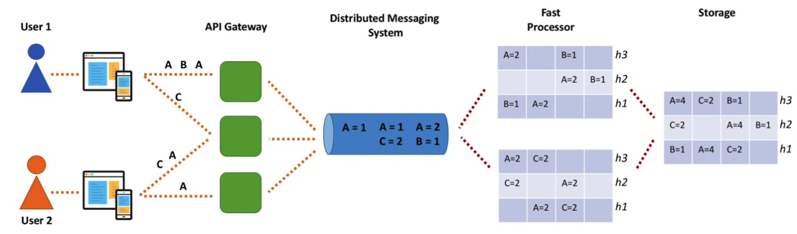
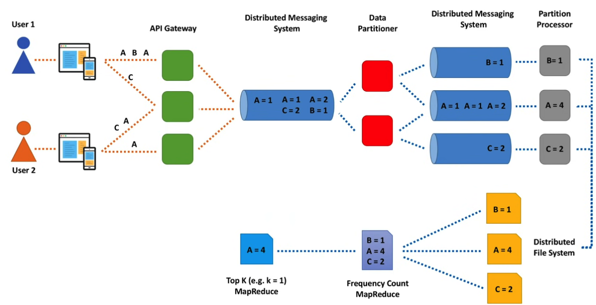
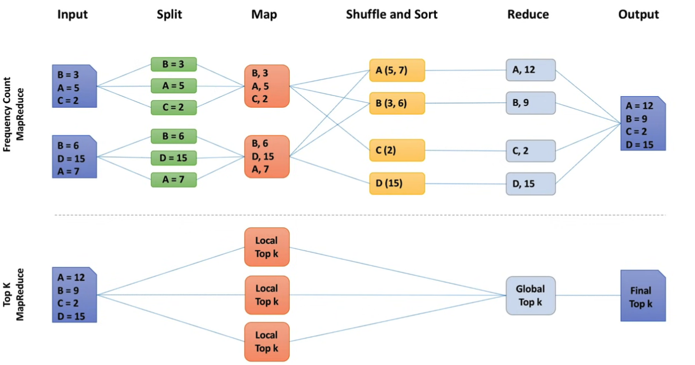
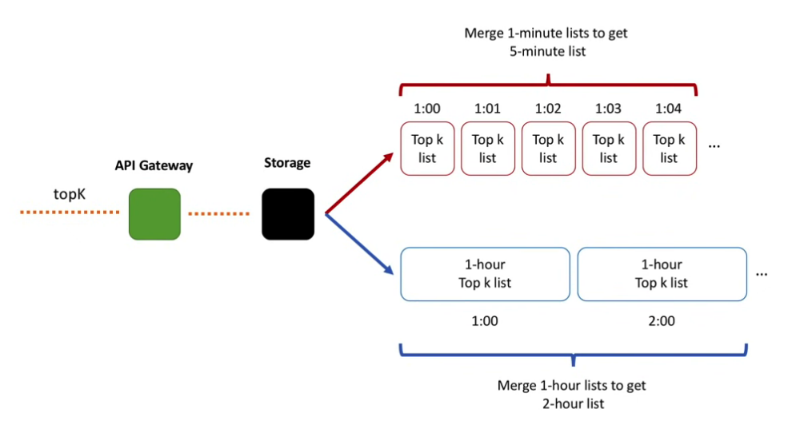
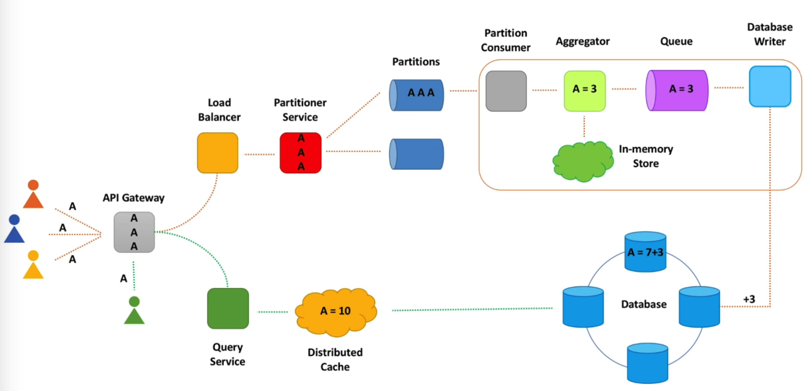
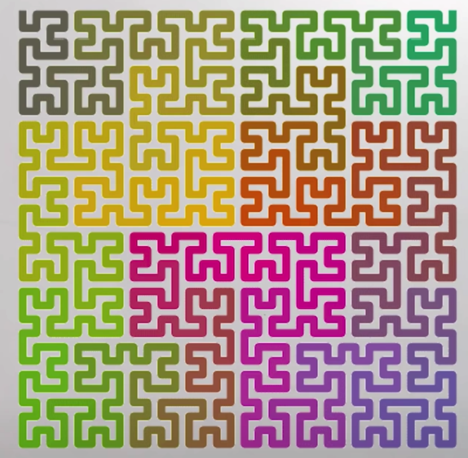
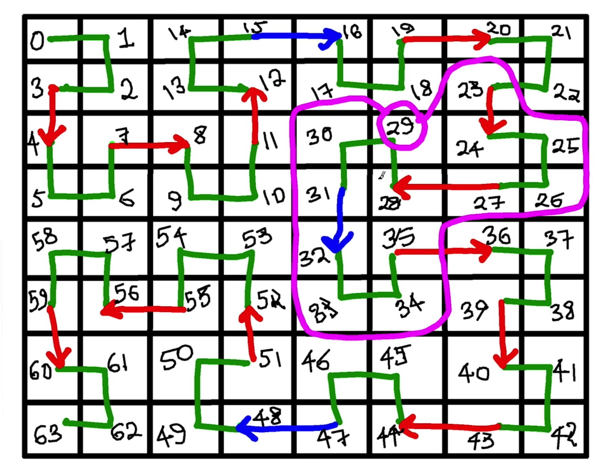

[toc]


TBD

- Chapter 1: Scale From Zero To Millions Of Users
- Chapter 2: Back-of-the-envelope Estimation
- Chapter 3: A Framework For System Design Interviews
- Chapter 4: Design A Rate Limiter
- Chapter 5: Design Consistent Hashing
- Chapter 6: Design A Key-value Store
- Chapter 7: Design A Unique Id Generator In Distributed Systems
- Chapter 8: Design A Url Shortener
- Chapter 9: Design A Web Crawler
- Chapter 10: Design A Notification System
- Chapter 11: Design A News Feed System
- Chapter 12: Design A Chat System
- Chapter 13: Design A Search Autocomplete System
- Chapter 14: Design Youtube
- Chapter 15: Design Google Drive
- Chapter 16: The Learning Continues


# | 通则

**需求确认**

- Scenario
  - Who will use the system?
  - How the system will be used?
- Scale
  - Read TPS?
  - Spike traffic?
- Performance
  - P99 latency?
- Cost
  - minimize dev cost
  - minimize maintenance cost


**高层设计**

- 数据模型
  - what we store: individual events, or aggregate data? 
  - 


# | 计数系统设计

## || 微博点赞数、评论数存储

**特点**

- 数据量巨大 --> 要考虑存储成本
- 访问量大 --> 性能
- 可用性、准确性高


**存储方案**

**1. MySQL**

- 表设计：id, comment_count, praise_count
- 分库分表
  - id：HASH
  - id：时间
    - 会导致冷热不均衡，近期数据总是访问多

**2. Redis**

- 内存优化
  - 合并存储点赞数 + 评论数 +...
  - 解决多个相同 ID 的存储成本

**3. SSD + 内存：冷数据存磁盘**

- 热点属性：把久远数据迁移到SSD，缓解内存
- 读冷数据时，使用异步线程从SSD加载到内存中单独的 Cold Cache


**非功能需求**

**1. 如何降低写压力？**

- 消息队列
- 批量处理消息、合并 +N
  - 预聚合


**2. 可扩展**

- Sharding
- 冷数据迁移（对象存储），热数据缓存


**3. 高可靠**

- 持久化
- Replication
- Checkpoint (kafka offset)


## || 系统通知未读数（共享存储场景）

**特点**：所有用户通知列表是一样的

**方案**

**1. 存储每个用户的未读数**

- 有新通知时，需要遍历所有用户、并+1
- 大部分用户不活跃，存储浪费


**2. 通知列表共享，存储每个用户读过的最后一条消息的ID**

- 全部用户共享一份有限的存储，每个人只记录自己的偏移量
- 如果读过的 ID 为空，则为新用户，未读数返回 0
- 对非活跃用户，定期清空存储


## || 微博未读数（信息流未读场景）

特点

- 每个用户的信息流不一样，不可使用共享的存储

方案

- 通用计数器，存储每个用户发布的博文数；
- Redis 存储用户所有关注人的博文数快照，该快照在点击未读消息时刷新；
- `未读数 = 关注人实际的博文总数 - 快照中的博文总数`


## || TopK 

> https://www.youtube.com/watch?v=kx-XDoPjoHw 

**单机版本**

- 先用 Map 存储计数：`Map<String, Integer>`

- 再遍历放入 Heap：`PriorityQueue<Entry>`
  ```java
  PriorityQueue<Entry> heap = new PriorityQueue<Entry>(Comparator.comparing(e -> e.getValue()));
  for (Entry e : map.getEntry()) {
    heap.offer(e);
    if (heap.size() > k) {
      heap.poll();
    }
  }
  ```

- 遍历heap取出结果即可。

问题：not scalable，大数据量无法放入内存怎么办？


**分布式版本：**

- 方案一：负载均衡

  - Load Balancer 接收请求，路由到多个**计算节点**进行计算；
  - 计算节点将结果存到统一的 **存储节点**。

- 方案二：数据分区

  - Data Paritioner 将数据按 key 分区到多个计算节点，按 heap 找出各自的 topK
  - 再由单个节点 merge sorted list

- 方案三：MapReduce 批处理

  > 上面的方案要求数据集固定 bonded. 

- 优化：节省内存，但结果可能不精确：**count-min sketch**

  - 结构：一个二维表，纵轴 = hash function （很少，例如5个），横轴 = function values (有限个)，取值 = 各 hash function value的出现次数。
  - 写入时：对每个key，执行 5 个  hash function，5个单元格内的 value++
  - 读取时：读出对应 key 的所有 hash funciton value，取最小值。（可能比实际值大）

  

  

最终版本：(Lambda 架构)

- API gateway：收集点击事件、预聚合以便减少数据量、写入 Kafka

- fast path: 

  - 快速获取结果，但不精确。
  - Fast processor 使用 count-min sketch 聚合短时数据。
    ——无需数据分区，因为内存不再是问题；可做数据复制，但不是必须，因为结果本来就不精确。
  - 定期（几秒钟）将结果写入存储。
    ——需要数据复制，保证HA

  

  

- slow path: 

  - 延时获取结果，但精确
  - 方案一：MapReduce：计数、聚合、写入存储
  - 方案二：分区
    - Data Partitioner 将数据分区到不同的 Kafka 分区；
    - Partition Processor 计算各个分区的topK
  - 方案三：整合
  
  
  
  两个 MapReduce:
  
  - Frequencey Count MapReduce
  - TopK MapReduce




- **读取流程：查询指定时间段的 TopK** 
  - 根据时间段不同，结合 Slow Path、Fast Path
  - 


## || 分布式计数服务

功能需求：

- 计数

- 查询

非功能需求：

- **规模**：1w+ 次每秒观看记录；
- **性能**：写入读取延迟 ms 级别；写入到读取分钟级延时；
- **高可用**：无单点失败；


#### 高层设计



**考察点**

- **API gateway：分区服务客户端**
  - Blocking vs. Non-blocking IO
  - Buffering & batching：不要每次有访问记录都写入
  - Timeout
  - Retry：超时之后重试
  - Exponetial backoff & Jitter：重试间隔
  - Circuit Breaker
- **Load Balancer**
  - 软件 or 硬件负载均衡
  - 网络协议：TCP
  - 负载均衡算法
  - DNS
  - Health checking
  - HA
- **Partitioner Service**
  - 分区策略
  - 服务发现：zk
  - Replication


**技术栈**

- Client
  - Netty, Hystrix, Polly
- Load Balancer
  - NetScaler, Nginx, AWS ELB
- Messaging
  - Kafka, AWS Kinesis
- Data processing
  - Spark, Flink
- Storage
  - Cassandra, HBase, Hadoop, S3


#### 存储

**数据库选型 : SQL** 

- Replica 主从：解决高可用问题
- Sharding 分片：分摊负载
- 代理：ShardingSphere (ShardingJDBC) --> 路由 + Registry Center

**数据库选型 : NOSQL**

- Cassandra: gossip 让每个机器都知道集群信息；复制因子、仲裁（多数成功即可）
- 动态添加节点、


**表设计：**

- 基本信息：video_info (videoId, name, spaceId)

- 聚合数据：video_stats (videoId, ts, count)  
- NOSQL 记录每个事件：(videoId, ts1_count, ts2_cont) --> 列式数据库，记录每分钟的操作数目

设计考察点

- 老数据归档问题：DB --> 对象存储
- 热点数据：缓存 --> 三级缓存：cache / db / S3


#### 计数写入服务

**设计思路**

- 可扩展：分区，sharding
- 高性能：内存计算，批处理 （预聚合）
- 高可靠：持久化、Replication、checkpointing（kafka offset）

**MQ 解耦**

- 引入MQ：请求直接丢人MQ，计数服务消费、进行本地聚合、写入数据库。
- 好处：
  - 1、解耦，削峰；
  - 2、即便计数器服务下线维护，MQ仍然能保证请求不丢，后续仍能补充计数。
- 统计粒度：按分钟的队列、按小时的队列、按天的队列... --> 按分钟统计完后，扔进按小时队列，依次类推；类似 Kafka Streaming。


**数据接收层设计**

- API Gateway: 转发用户请求。
  --> 问题：负载均衡，服务发现，限流容错，防爬虫
- Counting Service：分发到 kafka 分区 
  --> 问题：同步生产？异步生产？MQ 高可靠？


**计数消费者设计**

- MQ消费者：拉取分区消息，放入本地内存队列1。
- Aggregator：消费本地内存队列数据、聚合，写入内部队列2 （磁盘、db、kafka）。
- DB Writer：将计算结果写入DB。如果无法写入，放入死信队列。

代码设计：

```
- countViewEvent(videoId) 
- countEvent(videoId, eventType)
- processEvent(video, eventType, count|sum|avg) 
- processEvent(eventList)
```


#### 计数查询服务

**数据获取层设计**

- API Gateway: 接受并转发用户请求；
- Query Service: 查询数据库；

代码设计：

```
- getViewsCount(videoId, startTime, endTime)
- getCount(videoId, eventType, s, e)
- getStat(videoId, eventType, count|sum|avg, s, e)
```


#### 考察点

1. 监控
   - 压力测试
   - 调用量、错误数
   - 队列消息堆积

2. 如何保证功能正确
   - 线下功能测试
   - 模拟用户事件、进行校验 
   - 实时流计算系统、线下批处理系统同时计算，校验对比。--> Lambda Architecture
3. 热分区问题 （热点数据导致某些队列分区访问频繁）
   - 视频ID key添加时间戳
4. 如何监控慢消费者
   - see MQ design


# | 电商系统

## || 订单

**订单数据存储**

- 订单主表
- 订单商品表
- 订单支付表
- 订单优惠表


**场景**

**1. 创建订单的幂等性**

- 预先生成订单号
- 利用数据库唯一性约束，避免重复写入订单、避免重复下单


**2. 修改订单的幂等性（ABA问题）**

- 引入版本号，避免并发更新问题

  > UPDATE orders set ..., version = version + 1
  > WHERE version = 8;


**性能**

- **存档历史订单数据**

- **分库分表**

分表：解决数据量大的问题

分库：解决高并发问题

Sharding KEY：

- 原则：让查询尽量落在一个分片中
  - 用户ID后几位， 作为订单ID的一部分
  - 按订单ID查找
  - 按用户ID查找

- Q: 查询能力受限，例如按商家ID查询？
  - 同步到其他存储系统


**分片算法**

> 保证均匀，避免出现热点问题

- 范围分片
  - 对查询优化，但易热点

- 哈希分片

- 查表法
  - 例如 Redis Cluster：查找槽位


## || 商详

**商品数据存储**

- 基本信息
  - 特点：属性固定
  - 方案：数据库 + 缓存
  - 注意保留历史版本：历史表，或 KV 存储

- 商品参数
  - 特点：不同商品参数不一样，字段庞杂
  - 方案：MongoDB

- 图片视频
  - 方案：对象存储，例如S3


**商品介绍静态化**

- 以空间换时间
- nginx


## || 购物车

**未登录购物车**

- 客户端存储
  - Session / Cookie / LocalStorage

**登录购物车**

- MySQL
- Redis


## || 账户


**一致性问题**

- 事务 ACID
- 隔离级别


**账户余额更新逻辑**

- 账户余额表：增加字段 `log_id`，表示最后一笔交易流水号
- 开启事务，查询当前余额、log_id
- 写入交易流水表
- 更新账户余额，where log_id = xx
- 检查更新余额的返回值，>0 则提交事务，否则回滚


## || 商品排行榜

> https://github.com/donnemartin/system-design-primer/blob/master/solutions/system_design/sales_rank/README-zh-Hans.md


# | 信息流服务

## || 推模式（写扩散机制）

发微博时，主动写入粉丝收件箱

**表设计**

- Feed表
- Timeline表

**发布微博时**

- 往自己发件箱（Feed）里写入一条记录 
- 往所有粉丝收件箱里（Timeline）也写入一条记录。一般用消息队列来消除写入的峰值

**查询微博时**

- 查询自己的收件箱即可


**优缺点**

- **- 写入延迟**

缓解：多线程消费

- **- 存储成本高**

缓解：定期清理Timeline表，只保存最近数据

缓解：只发送给活跃 follower，基于 LRU

- **- 扩展性差**

例如要支持对关注人分组的话，必须新建 Timeline表？

存储成本更高了

- **- 取关、删除微博逻辑复杂**


**适用场景**

- 粉丝数小、粉丝数有上限的场景；例如朋友圈


## || 拉模式

用户主动拉取关注人的微博，进行排序、聚合

**发布微博时**

- 只需写入自己的发件箱（Feed）

**查询微博时**

- 查询关注列表
- 查询关注列表的发件箱


**优缺点**

- **+ 彻底解决延迟问题**

+ **+ 存储成本低**

- **+ 扩展性好**

- **- 数据聚合逻辑复杂**

缓解：缓存用户最近5天发布的微博ID

- **- 缓存节点带宽成本高**

缓解：增加缓存副本


## || 推拉结合

**思路**

大V 发布微博后，只推送给活跃用户

- 什么是大V？粉丝数超50w
- 什么是活跃用户？ 最近在系统中有过操作，则做标记


**方案**

- 每个大V 维护一个活跃粉丝列表：固定长度
- 用户变成活跃时
  - 查询关注了哪些大V，写入到大V活跃粉丝列表
  - 若超长，则剔除最早加入的粉丝
- 或者对 大V 使用拉模式！


## || Twitter 时间线设计

> https://github.com/donnemartin/system-design-primer/blob/master/solutions/system_design/twitter/README-zh-Hans.md 


## || Instagram

> Design Instagram https://www.youtube.com/watch?v=QmX2NPkJTKg 

**需求**

- Store/get images 
  - see design Tinder: https://www.youtube.com/watch?v=tndzLznxq40
- Like + Comment images
  - comment recursive?  -- 两层
  - like a comment? 
- Follow someone
- Publish news feed


**表设计**

Like + Comment images

- Post: `postId`, `userId`, `text`, `imageUrl`, `ts`
- Comment: `id`, `text`, `ts`
- Likes: `parentId` , `type`(post or comment), `userId`, `ts`
  - 加冗余聚合表：likes count

Follows

- Follow: `followerId`, `followeeId`, `ts`
  - 查询我的 follower：
  - 查询我 follow 了谁：


**访问流程**

- Gateway
- User feed service：LB
- Posts service
  - Limit count
  - Pre-compute user's posts : 推模式，写扩散；写入 follower's queue 
  - 
- Follow service
- Image service


## || 通知服务

> https://www.youtube.com/watch?v=bBTPZ9NdSk8 


# | MQ 系统设计


## || Rebalancer: Partition assigner

需求

Think Kafka consumer groups. With a Kafka consumer group you have P partitions and C consumers and you want to balance consumption of the partitions over the consumers such that:

- Allocation of partitions to consumers is balanced. With 7 partitions and 3 consumers, you’ll end up with 3, 2, 2.
- No partition can be allocated to more than one consumer
- No partition can remain unallocated

Also, when a new partition is added, or a consumer is added or removed or fails, then the partitions need to be rebalanced again.


https://jack-vanlightly.com/blog/2019/1/25/building-a-simple-distributed-system-the-what 

https://github.com/Rebalanser/wiki/wiki

https://github.com/Rebalanser/rebalanser-net-zookeeper 

- 基于ZK分配任务

  ```
  /rebalanser
     /{group name} (permanent)
        /clients (permanent)
           /c_000000000 (ephemeral sequential)
           /c_000000001 
           /c_000000002
           /c_n
        /resources (permanent - data: stores allocations map)
           /{res id 1} (permanent)
           /{res id 2}
           /{res id n}
        /barriers (permanent)
           /{res id 1} (ephemeral)
           /{res id 2}
           /{res id n}
        /term (permanent)
  ```

  

- `/chroot/group/clients/`客户端启动时注册 zk：

  - 临时节点、递增节点

  - 如果 ID 最小，则成为 Leader；

    - 监听`/chroot/group/term` **term** 节点；

      > 避免脑裂多个节点成为 Leader，当 term 节点版本更新，上一个 Leader 监听到并退位(abdicate)

    - 监听 `/chroot/group/resources` child 节点

    - 监听 `/chroot/group/clients` child 节点

  - 如果 ID 不是最小，则成为 Follower；

    - 监听**前一个 ID** 节点；
    - 监听 `/chroot/group/resources` 节点，监听资源分配。

- `/chroot/group/resources/` 用于注册资源

  - 新增资源后，被 Leader client 监听到；触发 rebalance；
  - Leader 将分配结果写入 `/resources/` znode；被 follower 监听到、执行相应动作。

- 重平衡流程

  - Leader 监听到  `/chroot/group/resources`  或  `/chroot/group/clients`  子节点有变化、触发重平衡；
  - Leader 获取到当前 resource、client 列表；分配任务保存为 resource-client KV、写入 `/chroot/group/resources` 节点值；
  - Follower 监听到 `/chroot/group/resources` 节点值变化、即资源分配有变；
    - 调用 `OnStop`
    - getData() 获取资源分配映射
    - 遍历当前占有的资源，删除 resource barrier znode
    - 遍历新的已分配资源，watch `/resources/resource-x/barrier`
    - 调用 `OnStart`


## || 延迟任务队列

**思路**

- 周期性扫描任务表：`select * from tasks where alert_after < now`。同时计算下一次执行时间。

开源：

- `db-scheduler`  
- `killbill notification queue` 
- `quartz` 重量
- `Xxl-job`
- `cron-utils` 工具类


**如何保证一个任务只被一个worker执行：**

- 1) 乐观锁：所有worker都能获取任务，但只有第一个写入的才能写入成功。`update version = version + 1 where version = ? ` 
- 2) 每个节点只处理当前节点写入的任务（sticky polling）


## || 精确一次语义


## || 消息不丢不重


# | 数据系统设计

## || 图片存储

**Q1：File or Blob**

- 考虑使用 DB 的场景

  - Mutability
  - Trasaction, ACID
  - Index, Search

- File 

  - Cheaper

  - Faster

    


## || 会话缓存服务

需求

- 消除粘性会话 Sticky Session：单点问题，发布问题，难以水平扩展。

**设计思路**

- 四种常用会话技术：粘性会话、纯客户端会话、服务器共享会话，集中式会话。
- sessionId 与 SessionServer的映射关系问题：一致性哈希不适用，因为服务器挂了会导致数据丢失；cookie 携带 server IP，如果读失败，则从DB加载数据、重新分配server IP。
- SessionServer挂了怎么办：缓存写后（异步刷盘到DB）
- 升级扩容 / 服务发现：


**SessionServer 内部设计**

- 两级缓存，平衡性能和容量：
  - LRU内存缓存；
  - 磁盘存储：存储不活跃的session，cache eviction后放入二级磁盘存储。value = 存储块ID + 位移；存储块整理线程，清理存储块中被删除的段。
    --> 参考 Yahoo HaloDB
- DB持久化（缓存写后异步刷盘，也可刷到集中式缓存，参考携程 x-pipe）
  - 异步操作 如何保证一定成功？
- LRU 缓存实现：
  - Guava Cache --> Caffeine
  - 线程安全：get/put - 写锁；size - 读锁
  - 线程安全 + 高并发：分段锁 LruCache[] 

**集群跨数据中心HA**

- 摇摆策略：各数据中心互通、互相注册。
- 双写策略：异步写入另一个数据中心。


## || 数据迁移

**思路** 

- 双写 、读老库、异步对比
- 双写、读新库、异步对比
- 读写新库


**步骤**

**1. 数据同步**

Canal


**2. 双写**

- **结果要以旧库为准；**不能让新库影响到业务可用性和数据准确性
- **对比 / 补偿；**选择合适的时间窗口


**3. 灰度发布切到新库**


**原则**

- 确保每一步可快速回滚

- 确保不丢数据
  - 对比补偿


## || 促销数据及时更新

- 本地缓存，如何保持和库存数据同步
- 缓存更新：加锁？--> 如何实现限制最多N个请求回表？
- 数据库锁？


## || 社交网络数据存储

> https://github.com/donnemartin/system-design-primer/blob/master/solutions/system_design/social_graph/README-zh-Hans.md 


## || KV 存储设计

> https://github.com/donnemartin/system-design-primer/blob/master/solutions/system_design/query_cache/README.md


## || LBS


需求

- Measurable Distance：两点之间的距离不能按直线计算
  - Uniform assignment
  - Scalable granularity
- Proximity：搜索附近


地点存储

-  QuadTree? 

- 将二维平面转换为一维线条：支持范围查询

  - Hilbert curve

  

  


# | 社交系统

## || Chat 

https://systeminterview.com/design-a-chat-system.php  


需求

- Receive messages from other clients.
- Find the right recipients for each message and relay the message to the recipients.
- If a recipient is not online, hold the messages for that recipient on the server until she is online.


沟通方式

- **Polling**

  - 客户端每隔一段时间发请求，询问是否有新消息。
  - 缺点：
    - 浪费服务端资源

- **Long Polling**

  - 客户端发起链接后不会马上关闭，而是等待一段时间服务器响应。
  - 缺点：
    - 发送者和接收者可能连到不同服务器
    - 服务器无法感知客户端是否断链；
    - 效率低，需要为低频客户端保持链接。

- **WebSocket**, XMPP?

  - 建立持久化双向通道

    > It starts its life as a HTTP connection and could be “upgraded” via some well-defined handshake to a WebSocket connection.


组件

- **Chat Server**

  - 处理消息收发

- **Presence Server**

  - 管理上下线状态

- **API Server**

  - 处理用户登录、注册、修改 profile

- **Notification Server**

  - 推送提醒消息

- **KV Store**

  - 保存消息历史 

  - MessageId: 要求有序

    > 三种思路
    >
    > - 自增逐渐：nosql 不支持；
    > - 全局ID生成器，Snowflake：重量级
    > - 本地ID生成器：只要保证在一对一聊天、或一个群聊内唯一且有序即可。


**一对一聊天**

- UserA 发送消息给 gateway --> Chat Server 1；

- Chat Server1 调用 ID 生成器生成 message id；

- Chat Server1 将消息发送到队列；

- 消息存储到 KV store；

- 如果 UserB在线，则消息转发给UserB对应的Chat Server2；由Chat Server2通过websocket发送给UserB。

  > Q: 如何转发到 Chat Server2? 
  >
  > - A: 增加 **User Mapping Service（Session Service）**, 存储 user-server对应关系。
  >
  > Q: 找到server后，如何通信？
  >
  > - A1：为每个 server创建 dedicated queue。缺点：队列太多、server宕机后 队列里的消息怎么办。
  > - A2：HTTP 会导致消息无序、且请求量巨大。
  > - A3：改进HTTP：添加 prevMsgId 保序、使用 buffer 降低请求量。

- 如果 UserB 不在线，则发送调用Notification Server发送 Push notification


**群聊 Group Messaging**

- Group Service 
  - groupId --> memberId
  - 群组大小要有限制

- Session Service
  - User --> Connection map

- 消息模式
  - 群组较小时：PUSH
  - 群组较大时：PULL


**Read Reciepts**

- like reply 


**上下线状态 - last seen**

- 心跳保活
- 存储到redis （同时也是 user-server mapping）
  - User - timestamp


# | 治理

## || 轻量级锁

- 乐观锁：基于版本号
- 排它锁：
  - 基于数据库：
  - 如果获取锁后线程挂掉
    - 超时机制：但有可能任务执行本来就很慢。
    - 栅栏令牌（fencing token）：返回锁 + 令牌，令牌类似乐观锁version？
  - 开源产品：`ShedLock`


## || 分布式限流系统

常用算法
- 令牌桶：支持突发流量
- 漏桶算法
- 固定窗口计数器
- 滑动窗口计数器

考点

- 限流规则配置化、功能开关
- 网关限流


## || TopK 反爬虫

功能要求：返回访问最频繁的 topK 客户 `topK(k, startTime, endTime)`

非功能需求：高性能，高可用，扩展，准确性

**单机方案**

- 保存 Hash: key = IP, value = count
- topK
  - 全排序 O(NLogN)
  - 堆 O(NlogK)

**分区方案**

- 分区服务：将请求IP Sharding到不同的”分区聚合主机“；后续 ”归并主机“ 进行归并、存入DB

**总体架构**

- API 网关：
  - 访问日志组件：记录访问日志；
  - 防爬虫组件：读取爬虫列表、拒绝请求；
- 访问日志采集服务：将日志写入 MQ
- 消费聚合服务：消费MQ，计算每分钟的TopK，存入DB
- 爬虫计算任务：根据DB数据 + 爬虫规则，计算出爬虫IP，存入DB
- 查询服务：查询当前爬虫


## || 可扩展系统

> https://github.com/donnemartin/system-design-primer/blob/master/solutions/system_design/scaling_aws/README-zh-Hans.md


# | 工具

## || 短链系统

> https://github.com/donnemartin/system-design-primer/blob/master/solutions/system_design/pastebin/README-zh-Hans.md 

**概要设计**


**Write API**

- 生成唯一 URL

  - 先校验是否已存在，如果已存在则重新生成

  - 映射关系存入 SQL
    ```sql
    shortlink char(7) NOT NULL
    expiration_length_in_minutes int NOT NULL
    created_at datetime NOT NULL
    paste_path varchar(255) NOT NULL
    PRIMARY KEY(shortlink)
    ```

    

-  如何生成
  ```
  url = base_encode(md5(ip_address+timestamp))[:URL_LENGTH]
  ```

  - MD5 哈希
  - 再 Base 62 编码
  - 取出前 7 位作为短链


**Read API**

- 从 SQL 中查询
- 如果查不到，则报错


**扩展：分析点击率**

- map reduce web logs


**扩展：过期策略**

- 定期清理


**扩展：扩展设计**


## || 网页爬虫

> https://github.com/donnemartin/system-design-primer/blob/master/solutions/system_design/web_crawler/README-zh-Hans.md 


## || 账户查询预测

> https://github.com/donnemartin/system-design-primer/blob/master/solutions/system_design/mint/README-zh-Hans.md 


# | 面向对象设计


| 问题                     |                                                              |
| ------------------------ | ------------------------------------------------------------ |
| 设计 hash map            | [解决方案](https://github.com/donnemartin/system-design-primer/blob/master/solutions/object_oriented_design/hash_table/hash_map.ipynb) |
| 设计 LRU 缓存            | [解决方案](https://github.com/donnemartin/system-design-primer/blob/master/solutions/object_oriented_design/lru_cache/lru_cache.ipynb) |
| 设计一个呼叫中心         | [解决方案](https://github.com/donnemartin/system-design-primer/blob/master/solutions/object_oriented_design/call_center/call_center.ipynb) |
| 设计一副牌               | [解决方案](https://github.com/donnemartin/system-design-primer/blob/master/solutions/object_oriented_design/deck_of_cards/deck_of_cards.ipynb) |
| 设计一个停车场           | [解决方案](https://github.com/donnemartin/system-design-primer/blob/master/solutions/object_oriented_design/parking_lot/parking_lot.ipynb) |
| 设计一个聊天服务         | [解决方案](https://github.com/donnemartin/system-design-primer/blob/master/solutions/object_oriented_design/online_chat/online_chat.ipynb) |
| 设计一个环形数组         | [待解决](https://github.com/donnemartin/system-design-primer/blob/master/README-zh-Hans.md#贡献) |
| 添加一个面向对象设计问题 | [待解决](https://github.com/donnemartin/system-design-primer/blob/master/README-zh-Hans.md#贡献) |


# | More


| 问题                                                  |                                                              |
| ----------------------------------------------------- | ------------------------------------------------------------ |
| 设计 Pastebin.com (或者 Bit.ly)                       | [解答](https://github.com/donnemartin/system-design-primer/blob/master/solutions/system_design/pastebin/README-zh-Hans.md) |
| 设计 Twitter 时间线和搜索 (或者 Facebook feed 和搜索) | [解答](https://github.com/donnemartin/system-design-primer/blob/master/solutions/system_design/twitter/README.md) |
| 设计一个网页爬虫                                      | [解答](https://github.com/donnemartin/system-design-primer/blob/master/solutions/system_design/web_crawler/README.md) |
| 设计 Mint.com                                         | [解答](https://github.com/donnemartin/system-design-primer/blob/master/solutions/system_design/mint/README.md) |
| 为一个社交网络设计数据结构                            | [解答](https://github.com/donnemartin/system-design-primer/blob/master/solutions/system_design/social_graph/README.md) |
| 为搜索引擎设计一个 key-value 储存                     | [解答](https://github.com/donnemartin/system-design-primer/blob/master/solutions/system_design/query_cache/README.md) |
| 通过分类特性设计 Amazon 的销售排名                    | [解答](https://github.com/donnemartin/system-design-primer/blob/master/solutions/system_design/sales_rank/README.md) |
| 在 AWS 上设计一个百万用户级别的系统                   | [解答](https://github.com/donnemartin/system-design-primer/blob/master/solutions/system_design/scaling_aws/README.md) |
| 添加一个系统设计问题                                  | [贡献](https://github.com/donnemartin/system-design-primer/blob/master/README-zh-Hans.md#贡献) |


| 问题                                   | 引用                                                         |
| -------------------------------------- | ------------------------------------------------------------ |
| 设计类似于 Dropbox 的文件同步服务      | [youtube.com](https://www.youtube.com/watch?v=PE4gwstWhmc)   |
| 设计类似于 Google 的搜索引擎           | [queue.acm.org](http://queue.acm.org/detail.cfm?id=988407) [stackexchange.com](http://programmers.stackexchange.com/questions/38324/interview-question-how-would-you-implement-google-search) [ardendertat.com](http://www.ardendertat.com/2012/01/11/implementing-search-engines/) [stanford.edu](http://infolab.stanford.edu/~backrub/google.html) |
| 设计类似于 Google 的可扩展网络爬虫     | [quora.com](https://www.quora.com/How-can-I-build-a-web-crawler-from-scratch) |
| 设计 Google 文档                       | [code.google.com](https://code.google.com/p/google-mobwrite/) [neil.fraser.name](https://neil.fraser.name/writing/sync/) |
| 设计类似 Redis 的键值存储              | [slideshare.net](http://www.slideshare.net/dvirsky/introduction-to-redis) |
| 设计类似 Memcached 的缓存系统          | [slideshare.net](http://www.slideshare.net/oemebamo/introduction-to-memcached) |
| 设计类似亚马逊的推荐系统               | [hulu.com](http://tech.hulu.com/blog/2011/09/19/recommendation-system.html) [ijcai13.org](http://ijcai13.org/files/tutorial_slides/td3.pdf) |
| 设计类似 Bitly 的短链接系统            | [n00tc0d3r.blogspot.com](http://n00tc0d3r.blogspot.com/)     |
| 设计类似 WhatsApp 的聊天应用           | [highscalability.com](http://highscalability.com/blog/2014/2/26/the-whatsapp-architecture-facebook-bought-for-19-billion.html) |
| 设计类似 Instagram 的图片分享系统      | [highscalability.com](http://highscalability.com/flickr-architecture) [highscalability.com](http://highscalability.com/blog/2011/12/6/instagram-architecture-14-million-users-terabytes-of-photos.html) |
| 设计 Facebook 的新闻推荐方法           | [quora.com](http://www.quora.com/What-are-best-practices-for-building-something-like-a-News-Feed) [quora.com](http://www.quora.com/Activity-Streams/What-are-the-scaling-issues-to-keep-in-mind-while-developing-a-social-network-feed) [slideshare.net](http://www.slideshare.net/danmckinley/etsy-activity-feeds-architecture) |
| 设计 Facebook 的时间线系统             | [facebook.com](https://www.facebook.com/note.php?note_id=10150468255628920) [highscalability.com](http://highscalability.com/blog/2012/1/23/facebook-timeline-brought-to-you-by-the-power-of-denormaliza.html) |
| 设计 Facebook 的聊天系统               | [erlang-factory.com](http://www.erlang-factory.com/upload/presentations/31/EugeneLetuchy-ErlangatFacebook.pdf) [facebook.com](https://www.facebook.com/note.php?note_id=14218138919&id=9445547199&index=0) |
| 设计类似 Facebook 的图表搜索系统       | [facebook.com](https://www.facebook.com/notes/facebook-engineering/under-the-hood-building-out-the-infrastructure-for-graph-search/10151347573598920) [facebook.com](https://www.facebook.com/notes/facebook-engineering/under-the-hood-indexing-and-ranking-in-graph-search/10151361720763920) [facebook.com](https://www.facebook.com/notes/facebook-engineering/under-the-hood-the-natural-language-interface-of-graph-search/10151432733048920) |
| 设计类似 CloudFlare 的内容传递网络     | [cmu.edu](http://repository.cmu.edu/cgi/viewcontent.cgi?article=2112&context=compsci) |
| 设计类似 Twitter 的热门话题系统        | [michael-noll.com](http://www.michael-noll.com/blog/2013/01/18/implementing-real-time-trending-topics-in-storm/) [snikolov .wordpress.com](http://snikolov.wordpress.com/2012/11/14/early-detection-of-twitter-trends/) |
| 设计一个随机 ID 生成系统               | [blog.twitter.com](https://blog.twitter.com/2010/announcing-snowflake) [github.com](https://github.com/twitter/snowflake/) |
| 返回一定时间段内次数前 k 高的请求      | [ucsb.edu](https://icmi.cs.ucsb.edu/research/tech_reports/reports/2005-23.pdf) [wpi.edu](http://davis.wpi.edu/xmdv/docs/EDBT11-diyang.pdf) |
| 设计一个数据源于多个数据中心的服务系统 | [highscalability.com](http://highscalability.com/blog/2009/8/24/how-google-serves-data-from-multiple-datacenters.html) |
| 设计一个多人网络卡牌游戏               | [indieflashblog.com](https://web.archive.org/web/20180929181117/http://www.indieflashblog.com/how-to-create-an-asynchronous-multiplayer-game.html) [buildnewgames.com](http://buildnewgames.com/real-time-multiplayer/) |
| 设计一个垃圾回收系统                   | [stuffwithstuff.com](http://journal.stuffwithstuff.com/2013/12/08/babys-first-garbage-collector/) [washington.edu](http://courses.cs.washington.edu/courses/csep521/07wi/prj/rick.pdf) |
| 添加更多的系统设计问题                 | [贡献](https://github.com/donnemartin/system-design-primer/blob/master/README-zh-Hans.md#贡献) |


**产品介绍**

| 类型            | 系统                                                   | 引用                                                         |
| --------------- | ------------------------------------------------------ | ------------------------------------------------------------ |
| Data processing | **MapReduce** - Google的分布式数据处理                 | [research.google.com](http://static.googleusercontent.com/media/research.google.com/zh-CN/us/archive/mapreduce-osdi04.pdf) |
| Data processing | **Spark** - Databricks 的分布式数据处理                | [slideshare.net](http://www.slideshare.net/AGrishchenko/apache-spark-architecture) |
| Data processing | **Storm** - Twitter 的分布式数据处理                   | [slideshare.net](http://www.slideshare.net/previa/storm-16094009) |
|                 |                                                        |                                                              |
| Data store      | **Bigtable** - Google 的列式数据库                     | [harvard.edu](http://www.read.seas.harvard.edu/~kohler/class/cs239-w08/chang06bigtable.pdf) |
| Data store      | **HBase** - Bigtable 的开源实现                        | [slideshare.net](http://www.slideshare.net/alexbaranau/intro-to-hbase) |
| Data store      | **Cassandra** - Facebook 的列式数据库                  | [slideshare.net](http://www.slideshare.net/planetcassandra/cassandra-introduction-features-30103666) |
| Data store      | **DynamoDB** - Amazon 的文档数据库                     | [harvard.edu](http://www.read.seas.harvard.edu/~kohler/class/cs239-w08/decandia07dynamo.pdf) |
| Data store      | **MongoDB** - 文档数据库                               | [slideshare.net](http://www.slideshare.net/mdirolf/introduction-to-mongodb) |
| Data store      | **Spanner** - Google 的全球分布数据库                  | [research.google.com](http://research.google.com/archive/spanner-osdi2012.pdf) |
| Data store      | **Memcached** - 分布式内存缓存系统                     | [slideshare.net](http://www.slideshare.net/oemebamo/introduction-to-memcached) |
| Data store      | **Redis** - 能够持久化及具有值类型的分布式内存缓存系统 | [slideshare.net](http://www.slideshare.net/dvirsky/introduction-to-redis) |
|                 |                                                        |                                                              |
| File system     | **Google File System (GFS)** - 分布式文件系统          | [research.google.com](http://static.googleusercontent.com/media/research.google.com/zh-CN/us/archive/gfs-sosp2003.pdf) |
| File system     | **Hadoop File System (HDFS)** - GFS 的开源实现         | [apache.org](https://hadoop.apache.org/docs/r1.2.1/hdfs_design.html) |
|                 |                                                        |                                                              |
| Misc            | **Chubby** - Google 的分布式系统的低耦合锁服务         | [research.google.com](http://static.googleusercontent.com/external_content/untrusted_dlcp/research.google.com/en/us/archive/chubby-osdi06.pdf) |
| Misc            | **Dapper** - 分布式系统跟踪基础设施                    | [research.google.com](http://static.googleusercontent.com/media/research.google.com/en//pubs/archive/36356.pdf) |
| Misc            | **Kafka** - LinkedIn 的发布订阅消息系统                | [slideshare.net](http://www.slideshare.net/mumrah/kafka-talk-tri-hug) |
| Misc            | **Zookeeper** - 集中的基础架构和协调服务               | [slideshare.net](http://www.slideshare.net/sauravhaloi/introduction-to-apache-zookeeper) |
|                 | 添加更多                                               | [贡献](https://github.com/donnemartin/system-design-primer/blob/master/README-zh-Hans.md#贡献) |


**公司的系统架构**

| Company        | Reference(s)                                                 |
| -------------- | ------------------------------------------------------------ |
| Amazon         | [Amazon 的架构](http://highscalability.com/amazon-architecture) |
| Cinchcast      | [每天产生 1500 小时的音频](http://highscalability.com/blog/2012/7/16/cinchcast-architecture-producing-1500-hours-of-audio-every-d.html) |
| DataSift       | [每秒实时挖掘 120000 条 tweet](http://highscalability.com/blog/2011/11/29/datasift-architecture-realtime-datamining-at-120000-tweets-p.html) |
| DropBox        | [我们如何缩放 Dropbox](https://www.youtube.com/watch?v=PE4gwstWhmc) |
| ESPN           | [每秒操作 100000 次](http://highscalability.com/blog/2013/11/4/espns-architecture-at-scale-operating-at-100000-duh-nuh-nuhs.html) |
| Google         | [Google 的架构](http://highscalability.com/google-architecture) |
| Instagram      | [1400 万用户，达到兆级别的照片存储](http://highscalability.com/blog/2011/12/6/instagram-architecture-14-million-users-terabytes-of-photos.html) [是什么在驱动 Instagram](http://instagram-engineering.tumblr.com/post/13649370142/what-powers-instagram-hundreds-of-instances) |
| Justin.tv      | [Justin.Tv 的直播广播架构](http://highscalability.com/blog/2010/3/16/justintvs-live-video-broadcasting-architecture.html) |
| Facebook       | [Facebook 的可扩展 memcached](https://cs.uwaterloo.ca/~brecht/courses/854-Emerging-2014/readings/key-value/fb-memcached-nsdi-2013.pdf) [TAO: Facebook 社交图的分布式数据存储](https://cs.uwaterloo.ca/~brecht/courses/854-Emerging-2014/readings/data-store/tao-facebook-distributed-datastore-atc-2013.pdf) [Facebook 的图片存储](https://www.usenix.org/legacy/event/osdi10/tech/full_papers/Beaver.pdf) |
| Flickr         | [Flickr 的架构](http://highscalability.com/flickr-architecture) |
| Mailbox        | [在 6 周内从 0 到 100 万用户](http://highscalability.com/blog/2013/6/18/scaling-mailbox-from-0-to-one-million-users-in-6-weeks-and-1.html) |
| Pinterest      | [从零到每月数十亿的浏览量](http://highscalability.com/blog/2013/4/15/scaling-pinterest-from-0-to-10s-of-billions-of-page-views-a.html) [1800 万访问用户，10 倍增长，12 名员工](http://highscalability.com/blog/2012/5/21/pinterest-architecture-update-18-million-visitors-10x-growth.html) |
| Playfish       | [月用户量 5000 万并在不断增长](http://highscalability.com/blog/2010/9/21/playfishs-social-gaming-architecture-50-million-monthly-user.html) |
| PlentyOfFish   | [PlentyOfFish 的架构](http://highscalability.com/plentyoffish-architecture) |
| Salesforce     | [他们每天如何处理 13 亿笔交易](http://highscalability.com/blog/2013/9/23/salesforce-architecture-how-they-handle-13-billion-transacti.html) |
| Stack Overflow | [Stack Overflow 的架构](http://highscalability.com/blog/2009/8/5/stack-overflow-architecture.html) |
| TripAdvisor    | [40M 访问者，200M 页面浏览量，30TB 数据](http://highscalability.com/blog/2011/6/27/tripadvisor-architecture-40m-visitors-200m-dynamic-page-view.html) |
| Tumblr         | [每月 150 亿的浏览量](http://highscalability.com/blog/2012/2/13/tumblr-architecture-15-billion-page-views-a-month-and-harder.html) |
| Twitter        | [Making Twitter 10000 percent faster](http://highscalability.com/scaling-twitter-making-twitter-10000-percent-faster) [每天使用 MySQL 存储2.5亿条 tweet](http://highscalability.com/blog/2011/12/19/how-twitter-stores-250-million-tweets-a-day-using-mysql.html) [150M 活跃用户，300K QPS，22 MB/S 的防火墙](http://highscalability.com/blog/2013/7/8/the-architecture-twitter-uses-to-deal-with-150m-active-users.html) [可扩展时间表](https://www.infoq.com/presentations/Twitter-Timeline-Scalability) [Twitter 的大小数据](https://www.youtube.com/watch?v=5cKTP36HVgI) [Twitter 的行为：规模超过 1 亿用户](https://www.youtube.com/watch?v=z8LU0Cj6BOU) |
| Uber           | [Uber 如何扩展自己的实时化市场](http://highscalability.com/blog/2015/9/14/how-uber-scales-their-real-time-market-platform.html) |
| WhatsApp       | [Facebook 用 190 亿美元购买 WhatsApp 的架构](http://highscalability.com/blog/2014/2/26/the-whatsapp-architecture-facebook-bought-for-19-billion.html) |
| YouTube        | [YouTube 的可扩展性](https://www.youtube.com/watch?v=w5WVu624fY8) [YouTube 的架构](http://highscalability.com/youtube-architecture) |


# Reference

**参考资料**

- Gaurav Sen: [System Design](https://www.youtube.com/playlist?list=PLMCXHnjXnTnvo6alSjVkgxV-VH6EPyvoX) 
- Gaurav Sen: [Interview Prep](https://www.youtube.com/playlist?list=PLMCXHnjXnTnuX59JRYLwyr6IFkuqTr0oa)
- Gaurav Sen: [High Level Design](https://www.youtube.com/playlist?list=PLMCXHnjXnTnvZBRQGkIAuZkPMK4SpE1fq)
  - and [low level design](https://www.youtube.com/playlist?list=PLMCXHnjXnTnvQVh7WsgZ8SurU1O2v_UM7) 
- System Design Interview (有口音) www.youtube.com/watch?v=bUHFg8CZFws

System Design Primer

- https://github.com/donnemartin/system-design-primer
- https://systeminterview.com/


